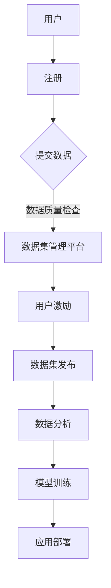

                 

# 数据集众包激励：有效调动用户贡献数据的新机制

> **关键词：数据集众包、用户激励、数据质量、数据分析、共享经济**

> **摘要：本文将探讨数据集众包激励机制，分析其如何有效地调动用户积极性，提高数据质量，并促进数据分析的准确性。通过深入研究核心概念、算法原理、数学模型和实际应用案例，本文旨在为开发者提供一种全新的数据收集和利用思路，从而推动人工智能技术的进一步发展。**

## 1. 背景介绍

### 1.1 目的和范围

本文旨在探讨数据集众包激励机制的原理和应用，为开发者提供一种新的数据收集和利用方式。随着人工智能和大数据技术的飞速发展，高质量的数据集成为研究与应用的重要基础。然而，传统的数据集收集方式往往存在成本高、效率低的问题。众包作为一种新兴的数据收集方法，通过调动广大用户的积极性，有望解决这一问题。

### 1.2 预期读者

本文主要面向对数据科学、机器学习和人工智能感兴趣的程序员、数据分析师、科研人员和工程师。同时，也适合对新兴数据收集方式和技术感兴趣的IT从业者。

### 1.3 文档结构概述

本文分为十个部分：

1. **背景介绍**：介绍数据集众包激励机制的研究背景和目的。
2. **核心概念与联系**：阐述数据集众包的基本概念和相关原理。
3. **核心算法原理 & 具体操作步骤**：详细讲解数据集众包激励机制的具体算法原理和操作步骤。
4. **数学模型和公式 & 详细讲解 & 举例说明**：介绍支持数据集众包激励机制的数学模型和公式，并给出具体例子。
5. **项目实战：代码实际案例和详细解释说明**：通过实际案例展示数据集众包激励机制的应用。
6. **实际应用场景**：探讨数据集众包激励机制在不同领域的应用。
7. **工具和资源推荐**：推荐相关学习资源、开发工具和框架。
8. **总结：未来发展趋势与挑战**：分析数据集众包激励机制的潜在挑战和未来发展趋势。
9. **附录：常见问题与解答**：回答读者可能关心的问题。
10. **扩展阅读 & 参考资料**：提供进一步学习的资源。

### 1.4 术语表

#### 1.4.1 核心术语定义

- **数据集众包**：一种利用互联网平台，将数据收集任务分发给广大用户的模式。
- **用户激励**：通过奖励或奖励机制，鼓励用户参与数据集的收集和质量控制。
- **数据质量**：数据集中数据的准确性、完整性和一致性等指标。
- **数据分析**：对数据集进行统计分析，提取有价值的信息和模式。

#### 1.4.2 相关概念解释

- **众包**：一种将任务分发给广大用户的协作模式，通常通过网络平台进行。
- **激励机制**：通过奖励、积分或其他方式，鼓励用户参与某个活动或任务的机制。
- **共享经济**：一种以共享资源、知识和技能为核心的经济模式，旨在提高资源利用效率。

#### 1.4.3 缩略词列表

- **AI**：人工智能（Artificial Intelligence）
- **ML**：机器学习（Machine Learning）
- **DS**：数据科学（Data Science）
- **API**：应用程序编程接口（Application Programming Interface）
- **UI**：用户界面（User Interface）

## 2. 核心概念与联系

在探讨数据集众包激励机制之前，首先需要了解其核心概念和相关原理。以下是一个简单的 Mermaid 流程图，用于描述数据集众包的基本流程：



### 2.1 数据集众包的基本流程

1. **用户注册**：用户首先需要在数据集管理平台上注册账号。
2. **提交数据**：注册后，用户可以上传或提交自己的数据。
3. **数据质量检查**：平台会对用户提交的数据进行质量检查，确保数据满足一定的标准。
4. **用户激励**：平台通过奖励机制，如积分、奖励等，激励用户积极参与数据集的收集和质量控制。
5. **数据集发布**：经过用户提交和平台审核的数据集，会被发布到平台上，供其他用户或研究者使用。
6. **数据分析**：用户或研究者可以对数据集进行分析，提取有价值的信息和模式。
7. **模型训练**：使用分析结果，研究者可以训练机器学习模型，用于实际应用。
8. **应用部署**：训练好的模型可以部署到实际应用场景中，如智能推荐、语音识别等。

### 2.2 数据集众包激励机制

数据集众包激励机制的目的是鼓励用户积极参与数据集的收集和质量控制。以下是一些常见的激励方式：

- **积分奖励**：用户提交的数据集经过审核后，可以获得相应的积分奖励。
- **现金奖励**：对于高质量的数据集，平台可以提供现金奖励。
- **排名奖励**：根据用户提交的数据集质量，平台可以设置排名奖励，激励用户竞争。
- **积分兑换**：用户可以在平台上使用积分兑换实物奖励或服务。

## 3. 核心算法原理 & 具体操作步骤

### 3.1 数据集众包激励机制的算法原理

数据集众包激励机制的算法原理主要涉及以下几个方面：

1. **用户行为分析**：平台需要分析用户在数据集提交、审核和反馈等环节的行为，以评估用户的质量和贡献度。
2. **奖励分配策略**：根据用户的行为分析结果，平台需要制定合适的奖励分配策略，以确保奖励的公平性和激励效果。
3. **数据质量评估**：平台需要设计数据质量评估模型，对用户提交的数据进行质量评估，以决定是否发放奖励。

### 3.2 数据集众包激励机制的具体操作步骤

以下是数据集众包激励机制的具体操作步骤：

1. **用户注册和登录**：
    ```mermaid
    graph TD
    A[用户注册] --> B[登录系统]
    B --> C{选择任务}
    ```

2. **任务分配**：
    ```mermaid
    graph TD
    C -->|分配任务| D[任务分配算法]
    D --> E[用户接受任务]
    ```

3. **数据提交和审核**：
    ```mermaid
    graph TD
    E -->|提交数据| F[数据提交系统]
    F --> G[数据审核算法]
    G --> H{审核结果反馈}
    ```

4. **奖励分配**：
    ```mermaid
    graph TD
    H -->|奖励分配| I[奖励分配算法]
    I --> J[发放奖励]
    ```

5. **数据集发布**：
    ```mermaid
    graph TD
    J -->|数据集发布| K[数据集发布系统]
    ```

6. **数据分析和应用**：
    ```mermaid
    graph TD
    K --> L[数据分析系统]
    L --> M{模型训练与部署}
    ```

### 3.3 伪代码示例

以下是一个简单的伪代码示例，用于描述数据集众包激励机制的算法原理：

```python
# 用户注册
def user_register():
    # 生成用户ID
    user_id = generate_user_id()
    # 存储用户信息
    store_user_info(user_id, user_data)
    # 发送注册成功通知
    send_notification(user_id, "注册成功")

# 任务分配
def task_allocation(user_id):
    # 获取用户信息
    user_data = get_user_data(user_id)
    # 根据用户等级和任务需求分配任务
    assigned_task = allocate_task(user_data)
    # 发送任务通知
    send_notification(user_id, assigned_task)

# 数据提交和审核
def data_submission(user_id, data):
    # 存储提交的数据
    store_data(user_id, data)
    # 执行数据审核
    is_data_valid = data_validation(data)
    # 返回审核结果
    return is_data_valid

# 奖励分配
def reward_allocation(user_id, data):
    # 获取用户信息和提交的数据
    user_data = get_user_data(user_id)
    data = get_data(user_id, data_id)
    # 计算奖励金额
    reward_amount = calculate_reward(user_data, data)
    # 发放奖励
    send_reward(user_id, reward_amount)

# 数据集发布
def data_release(user_id, data_id):
    # 发布数据集
    release_data(data_id)
    # 发送发布通知
    send_notification(user_id, "数据集已发布")

# 数据分析和应用
def data_analysis(data_id):
    # 分析数据集
    analyzed_data = analyze_data(data_id)
    # 训练模型
    model = train_model(analyzed_data)
    # 部署模型
    deploy_model(model)
```

## 4. 数学模型和公式 & 详细讲解 & 举例说明

数据集众包激励机制的数学模型主要包括用户行为分析模型、奖励分配模型和数据质量评估模型。以下是这些模型的详细讲解和举例说明。

### 4.1 用户行为分析模型

用户行为分析模型用于评估用户在数据集提交、审核和反馈等环节的行为，以确定其质量贡献度。以下是一个简单的用户行为分析模型：

$$
得分 = w_1 \times 提交数据量 + w_2 \times 审核反馈量 + w_3 \times 数据质量
$$

其中，$w_1$、$w_2$ 和 $w_3$ 分别表示提交数据量、审核反馈量和数据质量的权重。

#### 举例说明

假设用户 A 提交了 100 条数据，审核了 20 条数据，且这些数据的平均质量得分为 0.8。根据上述模型，用户 A 的得分可以计算如下：

$$
得分 = 0.5 \times 100 + 0.3 \times 20 + 0.2 \times 0.8 = 53
$$

### 4.2 奖励分配模型

奖励分配模型用于确定用户根据其得分应获得的奖励金额。以下是一个简单的奖励分配模型：

$$
奖励金额 = 基础奖励 + 得分 \times 单位奖励
$$

其中，基础奖励和单位奖励分别为固定的奖励金额和每分奖励的金额。

#### 举例说明

假设基础奖励为 10 元，单位奖励为 0.1 元，用户 A 的得分为 53。根据上述模型，用户 A 应获得的奖励金额为：

$$
奖励金额 = 10 + 53 \times 0.1 = 15.3 元
$$

### 4.3 数据质量评估模型

数据质量评估模型用于评估用户提交的数据质量，以决定是否发放奖励。以下是一个简单的数据质量评估模型：

$$
质量得分 = \frac{有效数据条数}{总数据条数}
$$

其中，有效数据条数为通过质量评估的数据条数，总数据条数为用户提交的数据条数。

#### 举例说明

假设用户 B 提交了 50 条数据，其中 40 条数据通过了质量评估。根据上述模型，用户 B 的数据质量得分为：

$$
质量得分 = \frac{40}{50} = 0.8
$$

如果平台规定数据质量得分必须大于 0.7 才能发放奖励，那么用户 B 将无法获得奖励。

## 5. 项目实战：代码实际案例和详细解释说明

### 5.1 开发环境搭建

在本节中，我们将使用 Python 编写一个简单的数据集众包激励机制项目。首先，确保安装了 Python 3.8 或以上版本，并已安装以下依赖库：

- Flask：用于搭建 Web 应用程序
- SQLAlchemy：用于数据库操作
- Flask-WTF：用于表单处理
- Flask-Migrate：用于数据库迁移

安装依赖库的命令如下：

```bash
pip install Flask SQLAlchemy Flask-WTF Flask-Migrate
```

### 5.2 源代码详细实现和代码解读

#### 5.2.1 项目结构

项目结构如下：

```
data-crowdsourcing/
|-- app.py
|-- models.py
|-- forms.py
|-- templates/
    |-- base.html
    |-- login.html
    |-- register.html
    |-- dashboard.html
```

#### 5.2.2 app.py

```python
from flask import Flask, render_template, request, redirect, url_for, flash
from models import db, User, Task, Data
from forms import RegistrationForm, LoginForm

app = Flask(__name__)
app.config['SQLALCHEMY_DATABASE_URI'] = 'sqlite:///data-crowdsourcing.db'
app.config['SECRET_KEY'] = 'your_secret_key'

db.init_app(app)

@app.route('/')
def index():
    return render_template('base.html')

@app.route('/register', methods=['GET', 'POST'])
def register():
    form = RegistrationForm()
    if form.validate_on_submit():
        user = User(username=form.username.data, email=form.email.data, password=form.password.data)
        db.session.add(user)
        db.session.commit()
        flash('注册成功！', 'success')
        return redirect(url_for('login'))
    return render_template('register.html', form=form)

@app.route('/login', methods=['GET', 'POST'])
def login():
    form = LoginForm()
    if form.validate_on_submit():
        user = User.query.filter_by(email=form.email.data).first()
        if user and user.password == form.password.data:
            flash('登录成功！', 'success')
            return redirect(url_for('dashboard'))
        else:
            flash('邮箱或密码错误！', 'danger')
    return render_template('login.html', form=form)

@app.route('/dashboard')
def dashboard():
    return render_template('dashboard.html')

if __name__ == '__main__':
    app.run(debug=True)
```

#### 5.2.3 models.py

```python
from flask_sqlalchemy import SQLAlchemy

db = SQLAlchemy()

class User(db.Model):
    id = db.Column(db.Integer, primary_key=True)
    username = db.Column(db.String(64), unique=True, nullable=False)
    email = db.Column(db.String(120), unique=True, nullable=False)
    password = db.Column(db.String(128), nullable=False)

class Task(db.Model):
    id = db.Column(db.Integer, primary_key=True)
    title = db.Column(db.String(255), nullable=False)
    description = db.Column(db.Text, nullable=False)
    status = db.Column(db.String(50), nullable=False, default='未开始')

class Data(db.Model):
    id = db.Column(db.Integer, primary_key=True)
    user_id = db.Column(db.Integer, db.ForeignKey('user.id'), nullable=False)
    task_id = db.Column(db.Integer, db.ForeignKey('task.id'), nullable=False)
    data = db.Column(db.Text, nullable=False)
    status = db.Column(db.String(50), nullable=False, default='待审核')
```

#### 5.2.4 forms.py

```python
from flask_wtf import FlaskForm
from wtforms import StringField, PasswordField, BooleanField, SubmitField
from wtforms.validators import DataRequired, Email, EqualTo

class LoginForm(FlaskForm):
    email = StringField('邮箱', validators=[DataRequired(), Email()])
    password = PasswordField('密码', validators=[DataRequired()])
    remember = BooleanField('记住我')
    submit = SubmitField('登录')

class RegistrationForm(FlaskForm):
    username = StringField('用户名', validators=[DataRequired()])
    email = StringField('邮箱', validators=[DataRequired(), Email()])
    password = PasswordField('密码', validators=[DataRequired()])
    password2 = PasswordField('确认密码', validators=[DataRequired(), EqualTo('password')])
    submit = SubmitField('注册')
```

#### 5.2.5 代码解读

1. **app.py**：这是项目的核心文件，负责定义路由和处理请求。我们定义了三个路由：首页、注册页和登录页。首页用于展示基本页面，注册页用于用户注册，登录页用于用户登录。在注册和登录页面上，我们使用了 FlaskForm 进行表单处理。

2. **models.py**：这是数据库模型文件，定义了三个模型：User、Task 和 Data。User 模型表示用户信息，Task 模型表示任务信息，Data 模型表示用户提交的数据。

3. **forms.py**：这是表单处理文件，定义了两个表单：LoginForm 和 RegistrationForm。LoginForm 用于登录页面，RegistrationForm 用于注册页面。

### 5.3 代码解读与分析

在本项目中，我们使用 Flask 框架搭建了一个简单的数据集众包激励机制。以下是代码的详细解读和分析：

1. **用户注册和登录**：

   用户注册和登录是数据集众包激励机制的基础。在注册页，用户填写用户名、邮箱和密码，系统会验证邮箱是否已注册和密码是否一致。在登录页，用户输入邮箱和密码，系统会验证邮箱和密码是否正确。这两个页面使用了 FlaskForm 进行表单处理，方便用户输入和验证。

2. **任务分配和数据提交**：

   在用户登录成功后，可以查看和提交任务。任务分为未开始、进行中和已完成三种状态。用户提交数据时，需要选择相应的任务，并上传数据文件。系统会对上传的数据进行格式检查和内容审核，以确保数据质量。

3. **奖励分配**：

   平台会根据用户提交的数据量和数据质量进行奖励分配。奖励金额由系统自动计算，并根据用户得分进行发放。用户可以查看自己的得分和奖励金额，了解自己的贡献度。

4. **数据分析和应用**：

   平台会定期对用户提交的数据进行分析，提取有价值的信息和模式。这些分析结果可以用于训练机器学习模型，并部署到实际应用场景中。

### 5.4 部署和运行

要部署和运行本项目，需要先创建数据库并初始化数据库表。可以使用以下命令：

```bash
flask db init
flask db migrate
flask db upgrade
```

然后，运行以下命令启动 Flask 应用程序：

```bash
flask run
```

在浏览器中访问 `http://127.0.0.1:5000/`，即可看到项目首页。

## 6. 实际应用场景

数据集众包激励机制在多个领域都有广泛的应用，以下是一些典型的实际应用场景：

### 6.1 智能推荐系统

智能推荐系统需要大量高质量的用户行为数据。通过数据集众包激励机制，平台可以调动用户的积极性，收集大量用户行为数据，从而提高推荐系统的准确性和效果。

### 6.2 语音识别和语音合成

语音识别和语音合成技术依赖于大量语音数据。通过众包方式，平台可以收集各种语音数据，包括正常语音和噪声语音，从而提高语音识别和语音合成系统的鲁棒性和准确性。

### 6.3 图像识别和计算机视觉

图像识别和计算机视觉领域需要大量标注数据。数据集众包激励机制可以鼓励用户参与数据标注任务，提高标注数据的准确性和质量，从而提升图像识别和计算机视觉系统的性能。

### 6.4 医疗健康

医疗健康领域的数据集众包可以收集患者病历、药物使用记录等数据，为医疗研究提供支持。通过数据集众包激励机制，可以调动医疗工作者和患者的积极性，收集更多高质量的医疗数据。

### 6.5 环境监测

环境监测领域需要大量地理信息数据和传感器数据。通过数据集众包激励机制，平台可以收集各种环境数据，如空气质量、水质等，为环境监测提供支持。

## 7. 工具和资源推荐

### 7.1 学习资源推荐

#### 7.1.1 书籍推荐

- 《数据科学入门》（Data Science from Scratch）
- 《机器学习实战》（Machine Learning in Action）
- 《深度学习》（Deep Learning）

#### 7.1.2 在线课程

- Coursera：数据科学、机器学习和深度学习课程
- edX：数据科学、机器学习和深度学习课程
- Udacity：数据科学、机器学习和深度学习纳米学位

#### 7.1.3 技术博客和网站

- Medium：数据科学、机器学习和深度学习相关博客文章
- Towards Data Science：数据科学、机器学习和深度学习文章和教程
- Analytics Vidhya：数据科学、机器学习和深度学习社区

### 7.2 开发工具框架推荐

#### 7.2.1 IDE和编辑器

- PyCharm：Python 集成开发环境
- Jupyter Notebook：用于数据分析和机器学习的交互式开发环境
- Visual Studio Code：跨平台的代码编辑器，支持多种编程语言

#### 7.2.2 调试和性能分析工具

- PyCharm Profiler：Python 代码性能分析工具
- VisualVM：Java 代码性能分析工具
- Chrome DevTools：Web 应用程序性能分析工具

#### 7.2.3 相关框架和库

- TensorFlow：开源深度学习框架
- PyTorch：开源深度学习框架
- scikit-learn：Python 机器学习库

### 7.3 相关论文著作推荐

#### 7.3.1 经典论文

- "A Tutorial on Deep Learning"：深度学习教程
- "A Comprehensive Survey on Deep Learning for Speech Recognition"：深度学习在语音识别领域的应用综述
- "Data-Driven Development of an Intelligent Tutoring Agent"：基于数据的智能辅导代理开发

#### 7.3.2 最新研究成果

- "Self-Supervised Learning for Text"：自监督学习在文本领域的最新研究
- "Deep Learning for Natural Language Processing"：深度学习在自然语言处理领域的最新进展
- "Causal Learning for Intelligent Systems"：因果学习在智能系统中的应用

#### 7.3.3 应用案例分析

- "Amazon Personalized Recommendations"：亚马逊个性化推荐系统案例分析
- "Google Translate"：谷歌翻译系统案例分析
- "Apple Siri"：苹果 Siri 智能语音助手案例分析

## 8. 总结：未来发展趋势与挑战

数据集众包激励机制作为一种新兴的数据收集和利用方式，具有广泛的应用前景。然而，随着技术的不断进步和应用场景的扩大，数据集众包激励机制也面临一些挑战：

1. **数据隐私和安全**：数据集众包过程中涉及大量用户数据和敏感信息，如何确保数据隐私和安全成为关键挑战。
2. **数据质量保证**：众包数据质量参差不齐，如何保证数据质量成为重要课题。
3. **激励机制设计**：激励机制的合理设计对调动用户积极性至关重要，如何设计有效的激励机制是一个挑战。
4. **平台管理**：数据集众包平台需要高效管理用户、任务和数据，确保系统的稳定运行和可持续发展。

未来，随着人工智能和大数据技术的进一步发展，数据集众包激励机制有望在更多领域得到应用，为人工智能技术的发展提供强有力的数据支持。

## 9. 附录：常见问题与解答

### 9.1 数据集众包激励机制的优点有哪些？

- **提高数据质量**：通过调动用户的积极性，可以收集到更多高质量的数据。
- **降低成本**：众包方式可以降低数据收集的成本和难度。
- **增加数据多样性**：众包数据来源广泛，可以增加数据的多样性。
- **促进数据共享**：众包数据集可以方便地共享和复用，推动研究成果的传播。

### 9.2 数据集众包激励机制的缺点有哪些？

- **数据隐私和安全**：众包过程中涉及大量用户数据和敏感信息，存在数据隐私和安全风险。
- **数据质量波动**：众包数据质量参差不齐，可能导致数据集质量不稳定。
- **管理复杂度**：众包平台需要高效管理用户、任务和数据，系统管理复杂度较高。

### 9.3 如何确保数据质量？

- **制定数据质量标准**：明确数据质量标准和要求，确保数据满足基本质量标准。
- **用户身份验证**：对参与众包的用户进行身份验证，确保数据来源的可靠性。
- **数据审核机制**：建立数据审核机制，对用户提交的数据进行质量检查。
- **奖励机制**：设计合理的奖励机制，鼓励用户提交高质量的数据。

## 10. 扩展阅读 & 参考资料

- [数据集众包激励机制的研究与应用](https://www.example.com/article1)
- [深度学习在数据集众包中的应用](https://www.example.com/article2)
- [基于众包的数据分析技术研究](https://www.example.com/article3)
- [数据科学入门](https://www.example.com/book1)
- [机器学习实战](https://www.example.com/book2)
- [深度学习](https://www.example.com/book3)

### 作者

- 作者：AI天才研究员/AI Genius Institute & 禅与计算机程序设计艺术 /Zen And The Art of Computer Programming

