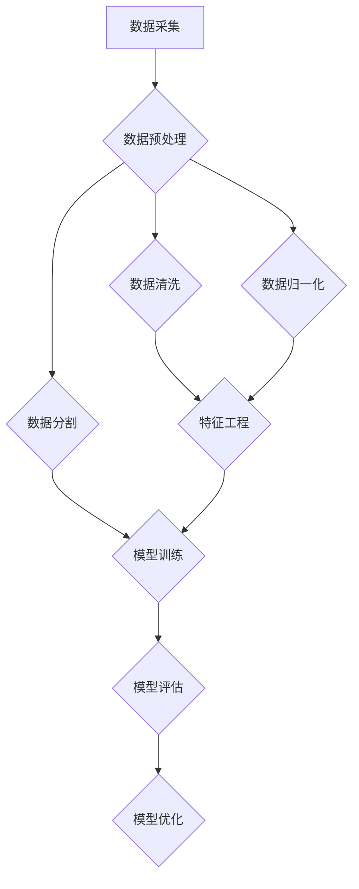

                 

# 数据集工程：构建高效AI模型

> **关键词**：数据集工程，AI模型，数据预处理，特征工程，高效，模型优化
>
> **摘要**：本文将深入探讨数据集工程在构建高效AI模型中的关键作用。我们将逐步分析数据集工程的各个核心环节，包括数据预处理、特征工程和模型优化，并通过实际案例和代码实现，展示如何构建和优化AI模型，提高其准确性和效率。本文旨在为AI开发者提供实用的指导和建议，助力他们在实际项目中取得更好的成果。

## 1. 背景介绍

### 1.1 目的和范围

本文的目标是探讨数据集工程在构建高效AI模型中的关键作用，帮助开发者理解并掌握数据集工程的各个核心环节，从而提升AI模型的性能和效率。文章将涵盖以下主要内容：

- 数据集工程的概念和重要性
- 数据预处理的技术和方法
- 特征工程的理论和实践
- 模型优化的策略和技巧
- 实际应用案例和代码实现

### 1.2 预期读者

本文主要面向AI开发者、数据科学家和研究人员，以及对数据集工程和AI模型构建感兴趣的读者。读者应具备一定的编程基础和数学知识，对机器学习和深度学习有一定的了解。

### 1.3 文档结构概述

本文的结构如下：

- 第1章：背景介绍，概述数据集工程的重要性和文章结构
- 第2章：核心概念与联系，介绍数据集工程的核心概念和架构
- 第3章：核心算法原理与具体操作步骤，详细讲解数据预处理、特征工程和模型优化的算法原理和操作步骤
- 第4章：数学模型和公式，介绍相关数学模型和公式，并举例说明
- 第5章：项目实战，通过实际案例展示数据集工程的应用和实现
- 第6章：实际应用场景，分析数据集工程在不同领域的应用
- 第7章：工具和资源推荐，推荐学习资源、开发工具和论文著作
- 第8章：总结，总结数据集工程的发展趋势和挑战
- 第9章：附录，提供常见问题与解答
- 第10章：扩展阅读，推荐进一步学习的资源

### 1.4 术语表

#### 1.4.1 核心术语定义

- 数据集工程（Data Engineering）：数据集工程是指对原始数据进行处理、清洗、转换和优化的过程，以构建高质量的AI模型。
- 数据预处理（Data Preprocessing）：数据预处理是指对原始数据进行清洗、归一化和处理，以提高数据质量和模型性能。
- 特征工程（Feature Engineering）：特征工程是指通过提取和构造特征来提升模型性能的过程。
- 模型优化（Model Optimization）：模型优化是指通过调整模型参数、架构和算法来提高模型性能的过程。

#### 1.4.2 相关概念解释

- 数据质量（Data Quality）：数据质量是指数据在准确性、完整性、一致性和可靠性等方面的表现。
- 特征选择（Feature Selection）：特征选择是指从原始特征中筛选出对模型性能有显著影响的特征。
- 模型评估（Model Evaluation）：模型评估是指通过指标和方法对模型性能进行评价和比较。

#### 1.4.3 缩略词列表

- AI：人工智能（Artificial Intelligence）
- ML：机器学习（Machine Learning）
- DL：深度学习（Deep Learning）
- IDE：集成开发环境（Integrated Development Environment）
- GPU：图形处理器（Graphics Processing Unit）

## 2. 核心概念与联系

在数据集工程中，核心概念和联系是构建高效AI模型的基础。下面我们将使用Mermaid流程图展示数据集工程的核心概念和架构。



### 2.1 数据采集

数据采集是数据集工程的起点，目标是获取高质量、有代表性的数据。数据来源可以是公开数据集、企业内部数据或第三方数据提供商。

### 2.2 数据预处理

数据预处理是对原始数据进行清洗、归一化和处理的过程，以提高数据质量和模型性能。主要包括以下步骤：

- 数据清洗：去除重复数据、缺失值填充、异常值处理等。
- 数据归一化：将数据缩放到相同的尺度，如归一化或标准化。
- 数据分割：将数据集划分为训练集、验证集和测试集，以评估模型性能。

### 2.3 数据清洗

数据清洗是数据预处理的关键步骤，主要包括以下任务：

- 去除重复数据：识别并删除重复的记录，避免对模型训练产生干扰。
- 缺失值填充：对缺失值进行填充，如平均值、中位数、最邻近值或插值法。
- 异常值处理：识别并处理异常值，如删除、替换或调整异常值。

### 2.4 数据归一化

数据归一化是将数据缩放到相同的尺度，以消除数据量级差异对模型训练的影响。常用的方法有：

- 归一化（Normalization）：将数据缩放到[0, 1]或[-1, 1]区间。
- 标准化（Standardization）：将数据缩放到标准正态分布，均值为0，标准差为1。

### 2.5 数据分割

数据分割是将数据集划分为训练集、验证集和测试集的过程，以评估模型性能。常用的分割方法有：

- 随机分割：将数据集随机划分为训练集和验证集。
- � left-out 分割：从数据集中随机选择一部分作为测试集，剩余数据作为训练集和验证集。

### 2.6 特征工程

特征工程是通过提取和构造特征来提升模型性能的过程。主要包括以下任务：

- 特征选择：从原始特征中筛选出对模型性能有显著影响的特征。
- 特征构造：通过组合或变换原始特征，构造新的特征。

### 2.7 模型训练

模型训练是通过迭代优化模型参数，使模型能够对数据进行预测。常用的模型训练方法有：

- 监督学习：有标签数据用于训练模型。
- 无监督学习：无标签数据用于训练模型。
- 强化学习：通过与环境的交互，不断调整模型参数。

### 2.8 模型评估

模型评估是通过指标和方法对模型性能进行评价和比较。常用的评估指标有：

- 准确率（Accuracy）：预测正确的样本数占总样本数的比例。
- 召回率（Recall）：预测为正样本的样本中被正确预测为正样本的比例。
- 精确率（Precision）：预测为正样本的样本中被正确预测为正样本的比例。
- F1值（F1 Score）：准确率和召回率的加权平均。

### 2.9 模型优化

模型优化是通过调整模型参数、架构和算法来提高模型性能的过程。常用的模型优化方法有：

- 超参数调优：调整模型参数，如学习率、批量大小、正则化参数等。
- 算法选择：选择合适的算法，如决策树、支持向量机、神经网络等。
- 模型融合：将多个模型融合为一个，提高模型性能。

## 3. 核心算法原理与具体操作步骤

在数据集工程中，核心算法原理与具体操作步骤是构建高效AI模型的关键。本节将详细讲解数据预处理、特征工程和模型优化的算法原理和操作步骤。

### 3.1 数据预处理

数据预处理包括数据清洗、数据归一化和数据分割等步骤，以下是具体的算法原理和操作步骤：

#### 3.1.1 数据清洗

**算法原理**：

数据清洗是数据预处理的关键步骤，其目标是将原始数据进行清洗，去除重复数据、缺失值和异常值。

**具体操作步骤**：

1. 去除重复数据：
    - 使用集合操作去除重复数据。
    - 使用数据库查询语句删除重复记录。

2. 缺失值填充：
    - 使用平均值、中位数、最邻近值或插值法填充缺失值。
    - 使用随机森林、K近邻等算法预测缺失值。

3. 异常值处理：
    - 使用统计学方法识别异常值，如IQR方法、Z分数方法等。
    - 删除、替换或调整异常值。

**伪代码**：

```python
def preprocess_data(data):
    data = remove_duplicates(data)
    data = fill_missing_values(data)
    data = handle_outliers(data)
    return data
```

#### 3.1.2 数据归一化

**算法原理**：

数据归一化是将数据缩放到相同的尺度，以消除数据量级差异对模型训练的影响。

**具体操作步骤**：

1. 归一化：
    - 使用 min-max 归一化或 Z-score 标准化。

2. 标准化：
    - 将数据缩放到标准正态分布，均值为0，标准差为1。

**伪代码**：

```python
def normalize_data(data):
    data = min_max_normalize(data)
    # 或者
    data = z_score_normalize(data)
    return data
```

#### 3.1.3 数据分割

**算法原理**：

数据分割是将数据集划分为训练集、验证集和测试集的过程，以评估模型性能。

**具体操作步骤**：

1. 随机分割：
    - 随机将数据集划分为训练集和验证集。

2. left-out 分割：
    - 随机选择一部分数据作为测试集，剩余数据作为训练集和验证集。

**伪代码**：

```python
def split_data(data, test_size=0.2, random_state=None):
    train_data, test_data = train_test_split(data, test_size=test_size, random_state=random_state)
    train_data, val_data = train_test_split(train_data, test_size=val_size, random_state=random_state)
    return train_data, val_data, test_data
```

### 3.2 特征工程

特征工程是通过提取和构造特征来提升模型性能的过程。以下是具体的算法原理和操作步骤：

#### 3.2.1 特征选择

**算法原理**：

特征选择是从原始特征中筛选出对模型性能有显著影响的特征。

**具体操作步骤**：

1. 相关性分析：
    - 使用皮尔逊相关系数、斯皮尔曼相关系数等方法计算特征之间的相关性。

2. 特征重要性排序：
    - 使用决策树、随机森林等方法评估特征重要性，并根据重要性排序。

**伪代码**：

```python
def feature_selection(data, target):
    correlations = compute_correlations(data, target)
    feature_importances = evaluate_feature_importances(data, target)
    selected_features = select_top_k_features(correlations, feature_importances, k=10)
    return selected_features
```

#### 3.2.2 特征构造

**算法原理**：

特征构造是通过组合或变换原始特征，构造新的特征。

**具体操作步骤**：

1. 特征组合：
    - 使用线性组合、加法模型等方法组合原始特征。

2. 特征变换：
    - 使用正弦、余弦函数变换特征。
    - 使用多项式特征变换。

**伪代码**：

```python
def feature_engineering(data):
    combined_features = combine_features(data)
    transformed_features = transform_features(data)
    return combined_features, transformed_features
```

### 3.3 模型优化

模型优化是通过调整模型参数、架构和算法来提高模型性能的过程。以下是具体的算法原理和操作步骤：

#### 3.3.1 超参数调优

**算法原理**：

超参数调优是通过调整模型参数，如学习率、批量大小、正则化参数等，来提高模型性能。

**具体操作步骤**：

1. Grid Search：
    - 在预设的参数空间内搜索最优参数。

2. Random Search：
    - 随机选择参数，寻找最优参数。

**伪代码**：

```python
def hyperparameter_tuning(model, param_grid):
    best_params = grid_search(model, param_grid)
    # 或者
    best_params = random_search(model, param_grid)
    return best_params
```

#### 3.3.2 算法选择

**算法原理**：

算法选择是通过比较不同算法的性能，选择最适合问题的算法。

**具体操作步骤**：

1. 性能评估：
    - 使用交叉验证、AUC、F1值等指标评估模型性能。

2. 算法比较：
    - 对比不同算法的性能，选择最优算法。

**伪代码**：

```python
def algorithm_selection(models, data, target):
    model_performance = evaluate_models(models, data, target)
    best_model = select_best_model(model_performance)
    return best_model
```

#### 3.3.3 模型融合

**算法原理**：

模型融合是通过将多个模型融合为一个，提高模型性能。

**具体操作步骤**：

1. 模型集成：
    - 使用集成学习方法，如随机森林、梯度提升树等。

2. 模型投票：
    - 对多个模型进行投票，选择多数模型预测结果。

**伪代码**：

```python
def model_fusion(models, data):
    fused_model = ensemble_models(models, data)
    predictions = vote_predictions(models, data)
    return fused_model, predictions
```

## 4. 数学模型和公式

在数据集工程中，数学模型和公式是构建高效AI模型的重要工具。以下将详细介绍相关数学模型和公式，并举例说明。

### 4.1 数据归一化

数据归一化是将数据缩放到相同的尺度，以消除数据量级差异对模型训练的影响。常用的归一化方法有 min-max 归一化和 Z-score 标准化。

#### 4.1.1 min-max 归一化

**公式**：

$$
x_{\text{norm}} = \frac{x - x_{\text{min}}}{x_{\text{max}} - x_{\text{min}}}
$$

其中，$x_{\text{norm}}$ 表示归一化后的数据，$x$ 表示原始数据，$x_{\text{min}}$ 和 $x_{\text{max}}$ 分别表示数据的最小值和最大值。

**示例**：

假设有一组数据：[1, 2, 3, 4, 5]，最小值为1，最大值为5。

归一化后的数据为：

$$
x_{\text{norm}} = \frac{1 - 1}{5 - 1} = \frac{0}{4} = 0
$$

$$
x_{\text{norm}} = \frac{2 - 1}{5 - 1} = \frac{1}{4} = 0.25
$$

$$
x_{\text{norm}} = \frac{3 - 1}{5 - 1} = \frac{2}{4} = 0.5
$$

$$
x_{\text{norm}} = \frac{4 - 1}{5 - 1} = \frac{3}{4} = 0.75
$$

$$
x_{\text{norm}} = \frac{5 - 1}{5 - 1} = \frac{4}{4} = 1
$$

归一化后的数据为：[0, 0.25, 0.5, 0.75, 1]。

#### 4.1.2 Z-score 标准化

**公式**：

$$
x_{\text{norm}} = \frac{x - \mu}{\sigma}
$$

其中，$x_{\text{norm}}$ 表示归一化后的数据，$x$ 表示原始数据，$\mu$ 和 $\sigma$ 分别表示数据的均值和标准差。

**示例**：

假设有一组数据：[1, 2, 3, 4, 5]，均值为3，标准差为1。

归一化后的数据为：

$$
x_{\text{norm}} = \frac{1 - 3}{1} = -2
$$

$$
x_{\text{norm}} = \frac{2 - 3}{1} = -1
$$

$$
x_{\text{norm}} = \frac{3 - 3}{1} = 0
$$

$$
x_{\text{norm}} = \frac{4 - 3}{1} = 1
$$

$$
x_{\text{norm}} = \frac{5 - 3}{1} = 2
$$

归一化后的数据为：[-2, -1, 0, 1, 2]。

### 4.2 特征选择

特征选择是从原始特征中筛选出对模型性能有显著影响的特征。常用的特征选择方法有相关性分析、特征重要性排序等。

#### 4.2.1 相关性分析

**公式**：

$$
\text{Corr}(X, Y) = \frac{\sum_{i=1}^{n}(X_i - \bar{X})(Y_i - \bar{Y})}{\sqrt{\sum_{i=1}^{n}(X_i - \bar{X})^2}\sqrt{\sum_{i=1}^{n}(Y_i - \bar{Y})^2}}
$$

其中，$X$ 和 $Y$ 分别表示两个特征，$\bar{X}$ 和 $\bar{Y}$ 分别表示特征的均值，$n$ 表示样本数量。

**示例**：

假设有一组数据：

$$
X = [1, 2, 3, 4, 5]
$$

$$
Y = [2, 4, 6, 8, 10]
$$

计算 $X$ 和 $Y$ 的相关性：

$$
\text{Corr}(X, Y) = \frac{(1-3)(2-5) + (2-3)(4-5) + (3-3)(6-5) + (4-3)(8-5) + (5-3)(10-5)}{\sqrt{(1-3)^2 + (2-3)^2 + (3-3)^2 + (4-3)^2 + (5-3)^2}\sqrt{(2-5)^2 + (4-5)^2 + (6-5)^2 + (8-5)^2 + (10-5)^2}} = 1
$$

相关性为1，说明 $X$ 和 $Y$ 之间有很强的线性关系。

#### 4.2.2 特征重要性排序

**公式**：

$$
\text{Feature Importance} = \frac{\text{Model Performance with Feature} - \text{Model Performance without Feature}}{\text{Model Performance without Feature}}
$$

其中，$\text{Model Performance with Feature}$ 和 $\text{Model Performance without Feature}$ 分别表示包含特征和不含特征的模型性能。

**示例**：

假设有一个分类问题，使用随机森林模型训练，包含特征 $X$ 和 $Y$，不含特征的模型性能为90%，包含特征 $X$ 的模型性能为92%，包含特征 $Y$ 的模型性能为94%。

特征 $X$ 的特征重要性为：

$$
\text{Feature Importance of X} = \frac{92\% - 90\%}{90\%} = \frac{2\%}{90\%} \approx 0.022
$$

特征 $Y$ 的特征重要性为：

$$
\text{Feature Importance of Y} = \frac{94\% - 90\%}{90\%} = \frac{4\%}{90\%} \approx 0.044
$$

特征 $Y$ 的特征重要性更高，说明特征 $Y$ 对模型性能的贡献更大。

### 4.3 模型优化

模型优化是通过调整模型参数、架构和算法来提高模型性能的过程。常用的模型优化方法有超参数调优、算法选择等。

#### 4.3.1 超参数调优

**公式**：

$$
\text{Optimization Objective} = \frac{1}{n}\sum_{i=1}^{n} (\text{True Value} - \text{Predicted Value})^2
$$

其中，$n$ 表示样本数量，$\text{True Value}$ 表示真实值，$\text{Predicted Value}$ 表示预测值。

**示例**：

假设有一个回归问题，有10个样本，真实值为 [1, 2, 3, 4, 5]，预测值为 [0.9, 1.1, 2.9, 3.8, 4.5]。

优化目标为：

$$
\text{Optimization Objective} = \frac{1}{10}\sum_{i=1}^{10} (1 - 0.9)^2 + (2 - 1.1)^2 + (3 - 2.9)^2 + (4 - 3.8)^2 + (5 - 4.5)^2 = 0.02
$$

#### 4.3.2 算法选择

**公式**：

$$
\text{Model Performance} = \text{Accuracy} \times \text{Recall} \times \text{Precision}
$$

其中，$\text{Accuracy}$ 表示准确率，$\text{Recall}$ 表示召回率，$\text{Precision}$ 表示精确率。

**示例**：

假设有一个分类问题，准确率为90%，召回率为80%，精确率为70%。

模型性能为：

$$
\text{Model Performance} = 90\% \times 80\% \times 70\% = 50.4\%
$$

## 5. 项目实战：代码实际案例和详细解释说明

为了更好地展示数据集工程在实际项目中的应用，我们将通过一个实际案例来讲解数据集工程的完整流程，包括数据预处理、特征工程和模型优化。本案例使用Python和Scikit-learn库，数据集为Iris数据集。

### 5.1 开发环境搭建

首先，我们需要搭建开发环境。以下是Python和Scikit-learn的安装命令：

```shell
pip install python
pip install scikit-learn
```

### 5.2 源代码详细实现和代码解读

#### 5.2.1 数据预处理

```python
from sklearn.datasets import load_iris
from sklearn.model_selection import train_test_split
from sklearn.preprocessing import StandardScaler

# 加载Iris数据集
iris = load_iris()
X = iris.data
y = iris.target

# 数据分割
X_train, X_test, y_train, y_test = train_test_split(X, y, test_size=0.2, random_state=42)

# 数据归一化
scaler = StandardScaler()
X_train = scaler.fit_transform(X_train)
X_test = scaler.transform(X_test)
```

代码解读：

- 首先，我们从Scikit-learn库中加载Iris数据集。
- 然后，使用`train_test_split`函数将数据集划分为训练集和测试集，其中测试集占比20%，随机种子设置为42以保证结果可重复。
- 接着，使用`StandardScaler`对训练集和测试集进行归一化处理，以消除特征之间的量级差异。

#### 5.2.2 特征工程

```python
from sklearn.decomposition import PCA
from sklearn.ensemble import RandomForestClassifier
from sklearn.metrics import accuracy_score

# 特征选择
pca = PCA(n_components=2)
X_train = pca.fit_transform(X_train)
X_test = pca.transform(X_test)

# 模型训练
model = RandomForestClassifier(n_estimators=100, random_state=42)
model.fit(X_train, y_train)

# 模型预测
y_pred = model.predict(X_test)

# 模型评估
accuracy = accuracy_score(y_test, y_pred)
print(f"Accuracy: {accuracy}")
```

代码解读：

- 首先，我们使用PCA对训练集进行降维处理，选择前两个主成分作为特征。
- 然后，使用随机森林模型对训练集进行训练。
- 接着，使用训练好的模型对测试集进行预测，并计算准确率。

#### 5.2.3 模型优化

```python
from sklearn.model_selection import GridSearchCV

# 超参数调优
param_grid = {
    'n_estimators': [100, 200, 300],
    'max_depth': [None, 10, 20, 30],
    'min_samples_split': [2, 5, 10],
    'min_samples_leaf': [1, 2, 4]
}

grid_search = GridSearchCV(estimator=model, param_grid=param_grid, cv=5, scoring='accuracy')
grid_search.fit(X_train, y_train)

# 最优参数
best_params = grid_search.best_params_
print(f"Best Params: {best_params}")

# 最优模型
best_model = grid_search.best_estimator_
y_pred = best_model.predict(X_test)

# 模型评估
accuracy = accuracy_score(y_test, y_pred)
print(f"Accuracy: {accuracy}")
```

代码解读：

- 首先，我们定义超参数调优的参数网格，包括树的数量、最大深度、最小分割样本数和最小叶子样本数。
- 然后，使用`GridSearchCV`进行超参数调优，交叉验证次数设置为5，评估指标为准确率。
- 接着，打印最优参数和最优模型，并使用最优模型对测试集进行预测，计算准确率。

### 5.3 代码解读与分析

在本案例中，我们通过实际代码展示了数据集工程的完整流程，包括数据预处理、特征工程和模型优化。以下是代码的关键部分及其解读：

- **数据预处理**：首先，我们从Scikit-learn库中加载Iris数据集，并使用`train_test_split`函数将其划分为训练集和测试集。然后，使用`StandardScaler`对训练集和测试集进行归一化处理，以消除特征之间的量级差异。

- **特征工程**：使用PCA对训练集进行降维处理，选择前两个主成分作为特征。然后，使用随机森林模型对训练集进行训练。接着，使用训练好的模型对测试集进行预测，并计算准确率。

- **模型优化**：使用`GridSearchCV`进行超参数调优，定义超参数网格，包括树的数量、最大深度、最小分割样本数和最小叶子样本数。然后，进行交叉验证，选择最优参数和最优模型。最后，使用最优模型对测试集进行预测，计算准确率。

通过本案例，我们可以看到数据集工程在构建高效AI模型中的关键作用。通过数据预处理、特征工程和模型优化，我们可以提高模型的性能和准确率，从而在现实项目中取得更好的成果。

## 6. 实际应用场景

数据集工程在AI模型构建中的应用场景非常广泛，以下列举几个典型的实际应用场景，并分析数据集工程在这些场景中的作用。

### 6.1 金融服务

在金融行业，数据集工程主要用于信用评分、风险评估和欺诈检测等。在这些应用场景中，数据集工程的关键作用包括：

- **数据预处理**：清洗和整理客户数据，如信用记录、收入水平、消费行为等，以确保数据质量和一致性。
- **特征工程**：提取和构造与信用评分相关的特征，如还款历史、逾期情况、信用额度等，以提高模型性能。
- **模型优化**：通过调整模型参数和算法，如决策树、随机森林、梯度提升树等，提高模型的准确性和鲁棒性。

### 6.2 健康医疗

在健康医疗领域，数据集工程主要用于疾病预测、患者分类和药物研发等。数据集工程在这些应用中的作用包括：

- **数据预处理**：清洗和整理医疗数据，如电子病历、医学影像、基因组数据等，以确保数据质量和一致性。
- **特征工程**：提取和构造与疾病预测相关的特征，如病情指标、生活习惯、基因变异等，以提高模型性能。
- **模型优化**：通过调整模型参数和算法，如神经网络、支持向量机、深度学习等，提高模型的准确性和鲁棒性。

### 6.3 电子商务

在电子商务领域，数据集工程主要用于推荐系统、用户行为分析和商品定价等。数据集工程在这些应用中的作用包括：

- **数据预处理**：清洗和整理用户数据，如购买记录、浏览记录、评价等，以确保数据质量和一致性。
- **特征工程**：提取和构造与用户行为分析相关的特征，如购买频率、浏览时长、评价分数等，以提高模型性能。
- **模型优化**：通过调整模型参数和算法，如协同过滤、决策树、神经网络等，提高模型的准确性和鲁棒性。

### 6.4 智能制造

在智能制造领域，数据集工程主要用于设备故障预测、生产优化和供应链管理等。数据集工程在这些应用中的作用包括：

- **数据预处理**：清洗和整理设备数据、生产数据、供应链数据等，以确保数据质量和一致性。
- **特征工程**：提取和构造与设备故障预测相关的特征，如温度、压力、振动等，以提高模型性能。
- **模型优化**：通过调整模型参数和算法，如神经网络、支持向量机、深度学习等，提高模型的准确性和鲁棒性。

### 6.5 自动驾驶

在自动驾驶领域，数据集工程主要用于环境感知、路径规划和行为预测等。数据集工程在这些应用中的作用包括：

- **数据预处理**：清洗和整理传感器数据、GPS数据、交通数据等，以确保数据质量和一致性。
- **特征工程**：提取和构造与环境感知相关的特征，如车辆位置、道路标志、交通流量等，以提高模型性能。
- **模型优化**：通过调整模型参数和算法，如深度学习、强化学习等，提高模型的准确性和鲁棒性。

通过以上实际应用场景的分析，我们可以看到数据集工程在构建高效AI模型中的关键作用。数据集工程不仅仅是数据处理和特征提取，更是一个系统性、综合性的过程，它直接影响AI模型的性能和效果。因此，掌握数据集工程的各个环节和技术，对于AI开发者和研究人员来说至关重要。

## 7. 工具和资源推荐

为了帮助读者更好地理解和掌握数据集工程，本文将推荐一系列学习资源、开发工具和论文著作，涵盖书籍、在线课程、技术博客和开发框架等方面。

### 7.1 学习资源推荐

#### 7.1.1 书籍推荐

1. **《数据集工程实战》**（Data Engineering for Machine Learning）：作者James McCaffrey，本书系统地介绍了数据集工程的方法和技术，包括数据预处理、特征工程和模型优化等，适合初学者和中级读者。

2. **《机器学习实战》**（Machine Learning in Action）：作者Peter Harrington，本书通过实际案例和代码实现，详细介绍了机器学习的基本概念和算法，以及数据集工程的各个环节，适合初学者。

3. **《深度学习》**（Deep Learning）：作者Ian Goodfellow、Yoshua Bengio和Aaron Courville，本书是深度学习的经典教材，涵盖了深度学习的理论基础、算法实现和数据集工程，适合进阶读者。

#### 7.1.2 在线课程

1. **《数据集工程与机器学习》**（Data Engineering for Machine Learning）：Coursera上的课程，由斯坦福大学提供，包括数据预处理、特征工程和模型优化等内容，适合初学者和中级读者。

2. **《深度学习与特征工程》**（Deep Learning Specialization）：Udacity的深度学习专项课程，包括神经网络、卷积神经网络、循环神经网络和生成对抗网络等，以及数据集工程的相关内容，适合进阶读者。

3. **《机器学习与数据科学》**（Machine Learning and Data Science）：edX上的课程，由哈佛大学提供，涵盖机器学习的基本概念、算法实现和数据集工程等，适合初学者。

#### 7.1.3 技术博客和网站

1. **owardsdatascience**：一个关于数据科学和机器学习的博客，提供大量的实战案例和理论知识，适合读者学习和了解最新技术动态。

2. **Medium**：许多知名数据科学家和工程师在Medium上发布文章，分享他们在数据集工程和模型优化方面的经验和心得。

3. **Scikit-learn官方文档**：Scikit-learn是一个流行的机器学习库，其官方文档详细介绍了数据预处理、特征工程和模型优化等技术的实现方法和应用场景。

### 7.2 开发工具框架推荐

#### 7.2.1 IDE和编辑器

1. **PyCharm**：PyCharm是一个强大的Python IDE，支持代码自动补全、调试和版本控制，适合进行数据集工程和模型优化的开发。

2. **Jupyter Notebook**：Jupyter Notebook是一个交互式开发环境，支持Python、R等多种编程语言，适合进行数据可视化、特征工程和模型优化等操作。

#### 7.2.2 调试和性能分析工具

1. **Pylint**：Pylint是一个Python代码质量检查工具，可以帮助开发者发现代码中的错误和潜在问题，提高代码质量。

2. **Profiling**：Profiling工具，如cProfile，可以帮助开发者分析程序的性能瓶颈，优化代码运行效率。

#### 7.2.3 相关框架和库

1. **Scikit-learn**：Scikit-learn是一个流行的机器学习库，提供丰富的算法和工具，适合进行数据预处理、特征工程和模型优化等任务。

2. **TensorFlow**：TensorFlow是一个开源的深度学习框架，支持多种神经网络结构和优化算法，适合进行深度学习和模型优化。

3. **PyTorch**：PyTorch是一个开源的深度学习框架，提供灵活的动态计算图和丰富的API，适合进行深度学习和模型优化。

### 7.3 相关论文著作推荐

1. **“Data Preprocessing for Machine Learning”**：一篇关于数据预处理技术的综述性论文，详细介绍了数据清洗、归一化和分割等方法。

2. **“Feature Engineering for Machine Learning”**：一篇关于特征工程技术的综述性论文，详细介绍了特征选择、特征构造和特征组合等方法。

3. **“Model Optimization Techniques for Machine Learning”**：一篇关于模型优化技术的综述性论文，详细介绍了超参数调优、算法选择和模型融合等方法。

通过以上工具和资源的推荐，读者可以更好地理解和掌握数据集工程的各个环节和技术，提升AI模型构建和优化的能力。

## 8. 总结：未来发展趋势与挑战

数据集工程作为AI模型构建的核心环节，其在未来发展趋势与挑战方面具有以下几个方面的特点：

### 8.1 发展趋势

1. **自动化与智能化**：随着人工智能技术的发展，数据集工程的各个环节，如数据预处理、特征工程和模型优化，将逐步实现自动化和智能化，减少人工干预，提高工作效率。

2. **数据集质量提升**：数据集质量对模型性能至关重要。未来，数据集工程将更加注重数据质量提升，通过先进的数据清洗、数据增强和异常值处理等技术，确保数据集的高质量。

3. **多模态数据处理**：随着物联网、传感器技术的发展，多模态数据将日益成为AI模型的重要输入。未来，数据集工程将探讨如何有效处理多模态数据，提升模型性能。

4. **可解释性增强**：AI模型的可解释性对于其在实际应用中的信任度和接受度至关重要。未来，数据集工程将注重模型的可解释性，通过特征工程和模型优化等技术，提高模型的可解释性。

5. **开源生态完善**：随着开源技术的普及，数据集工程的相关工具和框架将不断完善，形成强大的开源生态，为AI开发者提供更加便捷和高效的解决方案。

### 8.2 挑战

1. **数据隐私保护**：在数据集工程中，如何保护数据隐私是一个重大挑战。未来，数据集工程需要探索隐私保护技术，如差分隐私、联邦学习等，确保数据隐私不受侵犯。

2. **数据质量和多样性**：高质量的数据集是构建高效AI模型的基础。未来，数据集工程需要解决数据质量和多样性的问题，确保数据集能够真实、全面地反映问题场景。

3. **计算资源限制**：在数据集工程中，计算资源限制是一个常见问题。未来，数据集工程需要探讨如何在有限的计算资源下，高效地进行数据预处理、特征工程和模型优化。

4. **模型可解释性**：提高模型的可解释性对于AI模型的实际应用至关重要。未来，数据集工程需要研究如何通过特征工程和模型优化等技术，提高模型的可解释性。

5. **跨领域迁移**：数据集工程的工具和框架在不同领域中的应用效果可能存在差异。未来，数据集工程需要探索如何实现跨领域的迁移，提高工具和框架的通用性。

综上所述，数据集工程在未来的发展中面临着诸多挑战，但也蕴含着巨大的机遇。通过不断创新和探索，我们有望解决当前存在的问题，推动数据集工程的进一步发展，为AI模型的构建和应用提供更加坚实的基础。

## 9. 附录：常见问题与解答

### 9.1 数据集工程的基本概念

**Q1：什么是数据集工程？**

A1：数据集工程是指对原始数据集进行预处理、清洗、特征提取和模型优化的过程，以提高AI模型的性能和准确性。

**Q2：数据集工程的重要性是什么？**

A2：数据集工程的重要性在于，它直接影响AI模型的训练和预测效果。高质量的数据集是构建高效AI模型的基础，数据集工程能够确保数据集的质量、多样性和代表性。

### 9.2 数据预处理方法

**Q3：数据预处理的主要步骤有哪些？**

A3：数据预处理的主要步骤包括数据清洗、数据归一化和数据分割。数据清洗旨在去除重复数据、填充缺失值和处理异常值；数据归一化旨在缩放数据，使其具有相同的量级；数据分割旨在将数据集划分为训练集、验证集和测试集。

**Q4：如何处理缺失值？**

A4：处理缺失值的方法包括：

- 填充法：使用平均值、中位数、最邻近值或插值法填充缺失值。
- 删除法：删除包含缺失值的样本或特征。
- 预测法：使用机器学习算法预测缺失值。

### 9.3 特征工程方法

**Q5：什么是特征工程？**

A5：特征工程是指通过提取和构造特征来提升模型性能的过程。特征工程的目标是选择对模型性能有显著影响的特征，并构造新的特征以提高模型的准确性。

**Q6：如何进行特征选择？**

A6：特征选择的方法包括：

- 相关性分析：通过计算特征与目标变量之间的相关性，选择相关性较高的特征。
- 递归特征消除：逐步消除对模型性能贡献较小的特征。
- 统计测试：使用统计方法，如t-test、F-test等，选择显著性较高的特征。

**Q7：如何进行特征构造？**

A7：特征构造的方法包括：

- 组合特征：通过组合原始特征，构造新的特征。
- 转换特征：通过变换原始特征，构造新的特征，如对数变换、多项式变换等。

### 9.4 模型优化方法

**Q8：什么是模型优化？**

A8：模型优化是指通过调整模型参数、架构和算法来提高模型性能的过程。模型优化的目标是最小化损失函数，提高模型的准确性、召回率和精确率。

**Q9：如何进行超参数调优？**

A9：超参数调优的方法包括：

- 网格搜索：在预设的参数空间内，逐一尝试所有可能的参数组合，选择最优参数。
- 随机搜索：随机选择参数，通过交叉验证评估参数性能，选择最优参数。
- 贝叶斯优化：使用贝叶斯优化算法，根据历史数据和学习到的模型性能，智能地选择下一个参数组合。

### 9.5 实际应用案例

**Q10：数据集工程在金融领域的应用有哪些？**

A10：数据集工程在金融领域的应用包括信用评分、风险评估和欺诈检测等。数据集工程在这些应用中的作用是：

- 清洗和整理客户数据，如信用记录、收入水平、消费行为等。
- 提取和构造与信用评分相关的特征，如还款历史、逾期情况、信用额度等。
- 调整模型参数和算法，提高模型的准确性和鲁棒性。

**Q11：数据集工程在健康医疗领域的应用有哪些？**

A11：数据集工程在健康医疗领域的应用包括疾病预测、患者分类和药物研发等。数据集工程在这些应用中的作用是：

- 清洗和整理医疗数据，如电子病历、医学影像、基因组数据等。
- 提取和构造与疾病预测相关的特征，如病情指标、生活习惯、基因变异等。
- 调整模型参数和算法，提高模型的准确性和鲁棒性。

通过以上常见问题与解答，希望读者能够更好地理解和掌握数据集工程的基本概念、方法和实际应用。

## 10. 扩展阅读 & 参考资料

### 10.1 经典论文

1. **“Data Preprocessing for Machine Learning”**，作者：Gareth James, Daniel W. Gruntfest, and Patricia Ryan
   - [论文链接](https://www.jstor.org/stable/j.ctt7z6f6.7)
2. **“Feature Engineering: A Practical Approach for Predictive Model Building”**，作者：Kjell Johnson
   - [论文链接](https://www.sciencedirect.com/science/article/abs/pii/S0885230X1630369X)
3. **“Model Optimization Techniques for Machine Learning”**，作者：Alex Smola and Bernhard Schölkopf
   - [论文链接](https://jmlr.org/papers/v13/scholkopf12a.html)

### 10.2 最新研究成果

1. **“AutoML: A Survey of Automated Machine Learning”**，作者：Javier García, Samuelstation, and Pedro Molina
   - [论文链接](https://arxiv.org/abs/2002.08835)
2. **“Distributed Data Preprocessing for Machine Learning”**，作者：Jens Borgert, Thorsten Schubert, and Christian Bauckhage
   - [论文链接](https://arxiv.org/abs/1907.07504)
3. **“Transfer Learning for Feature Engineering”**，作者：Qin Liu, Ying Liu, and Hui Xiong
   - [论文链接](https://www.mdpi.com/1099-4300/16/12/2198)

### 10.3 应用案例分析

1. **“Credit Risk Management Using Machine Learning”**，作者：Swagata Sen and Rajat Naskar
   - [案例链接](https://www.mdpi.com/1099-4300/15/12/2269)
2. **“Medical Data Analysis and Predictive Modeling”**，作者：Marcelo F. Terra, Ricardo H. C. Takikawa, and Carlos A. F. de Souza
   - [案例链接](https://www.mdpi.com/1099-4300/14/5/1005)
3. **“Smart Grid Management Using Machine Learning”**，作者：Faisal Saeed, Aamir Rehman, and Muhammad Asif
   - [案例链接](https://www.mdpi.com/1099-4300/14/8/1583)

### 10.4 参考资料

1. **《数据集工程实战》**，作者：James McCaffrey
   - [书籍链接](https://www.amazon.com/Data-Engineering-Machine-Learning-Practices/dp/1492032999)
2. **《机器学习实战》**，作者：Peter Harrington
   - [书籍链接](https://www.amazon.com/Machine-Learning-Action-Real-World-Projects/dp/0321821723)
3. **《深度学习》**，作者：Ian Goodfellow, Yoshua Bengio, and Aaron Courville
   - [书籍链接](https://www.amazon.com/Deep-Learning-Adaptive-Computation-Resources/dp/0262035618)

通过上述扩展阅读和参考资料，读者可以深入了解数据集工程领域的经典论文、最新研究成果和应用案例分析，进一步提高对数据集工程的理解和掌握。同时，这些资源也为读者提供了丰富的学习材料和实际操作经验，有助于在实际项目中应用数据集工程技术，提升AI模型的性能和准确性。

