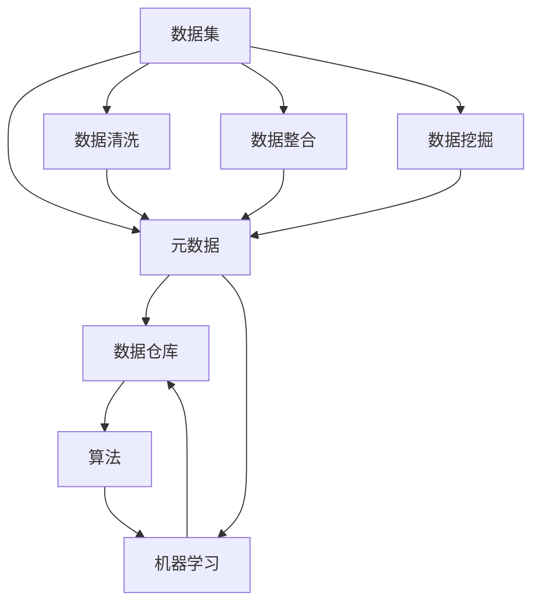

                 

### 文章标题

《数据集管理系统：元数据时代的新主角》

在当今数据驱动的世界中，数据集的管理与维护成为了一个至关重要的环节。而随着元数据的重要性日益凸显，数据集管理系统也逐步崛起，成为这一领域的新主角。本文旨在深入探讨数据集管理系统的概念、作用以及其在现代数据管理中的重要性。通过对核心概念的分析、算法原理的讲解、数学模型的阐述以及实战案例的演示，本文希望为读者提供一个全面、系统的了解和认识。在总结部分，我们将探讨这一领域未来的发展趋势与面临的挑战，为读者指明前进的方向。希望通过本文，读者能够对数据集管理系统有更深刻的理解和应用。

### 关键词

- 数据集管理系统
- 元数据
- 数据管理
- 算法原理
- 数学模型
- 实战案例
- 未来趋势

### 摘要

本文深入探讨了数据集管理系统在元数据时代的重要性。首先，我们介绍了数据集管理系统的概念及其在数据管理中的作用。接着，通过对核心概念和原理的详细阐述，以及实际操作步骤的演示，帮助读者理解数据集管理系统的运作机制。此外，本文还介绍了数学模型和公式，为读者提供了理论基础。最后，通过一个实际的项目案例，我们展示了数据集管理系统在实际开发中的应用，并通过代码解读和分析，使读者对系统的具体实现有更清晰的认识。本文旨在为读者提供一个全面、系统的视角，以深入理解数据集管理系统的重要性及其在实际中的应用。

## 1. 背景介绍

### 1.1 目的和范围

随着大数据和人工智能的快速发展，数据集管理已成为一项至关重要的任务。数据集管理系统的建设不仅能有效提升数据利用率，还能为数据科学和机器学习提供坚实的基础。本文旨在深入探讨数据集管理系统的重要性，分析其核心概念、算法原理、数学模型及实际应用，旨在为读者提供一个全面、系统的理解和实践指南。

本文将重点关注以下范围：

1. **核心概念与联系**：介绍数据集管理系统的基础知识，包括元数据、数据集、数据仓库等概念，并通过Mermaid流程图展示其架构。
2. **核心算法原理与具体操作步骤**：讲解数据集管理系统中的关键算法原理，并通过伪代码详细阐述其实现步骤。
3. **数学模型与公式**：阐述数据集管理中的数学模型和公式，并提供详细讲解和实际应用案例。
4. **项目实战**：通过一个实际项目案例，展示数据集管理系统的具体实现过程，并对代码进行详细解读。
5. **实际应用场景**：分析数据集管理系统在不同领域中的应用，探讨其在提升数据管理效率和准确性方面的作用。
6. **工具和资源推荐**：推荐学习资源和开发工具，为读者提供进一步学习和实践的途径。
7. **总结与未来趋势**：总结数据集管理系统的发展现状，探讨其未来发展趋势与面临的挑战。

通过本文的深入探讨，读者将能够全面了解数据集管理系统的概念、原理和应用，为实际工作提供有价值的参考。

### 1.2 预期读者

本文的预期读者主要包括以下几类：

1. **数据科学家和机器学习工程师**：他们需要对数据集管理有深入的理解，以便更好地进行数据分析和模型训练。
2. **数据管理专业人士**：他们负责构建和维护数据集管理系统，需掌握系统设计、实施和优化的相关技术。
3. **软件开发工程师**：他们需要熟悉数据集管理系统的实现细节，以便在项目中有效利用和管理数据。
4. **数据分析师和业务分析师**：他们需了解数据集管理系统如何提升数据分析的质量和效率。
5. **研究人员和学生**：他们希望通过本文对数据集管理系统进行深入研究，为未来的研究和学习奠定基础。

本文旨在为以上各类读者提供一个全面、系统的数据集管理系统教程，帮助他们更好地理解和应用这一关键技术。

### 1.3 文档结构概述

本文的结构设计旨在使读者能够循序渐进地了解数据集管理系统，从基础概念到实际应用，再到未来发展趋势。以下是本文的结构概述：

1. **背景介绍**：介绍本文的目的、范围、预期读者以及文档结构。
2. **核心概念与联系**：详细阐述数据集管理系统的核心概念，包括元数据、数据集、数据仓库等，并展示架构图。
3. **核心算法原理与具体操作步骤**：讲解数据集管理系统中的关键算法原理，并通过伪代码详细阐述其实现步骤。
4. **数学模型与公式**：阐述数据集管理中的数学模型和公式，并提供详细讲解和实际应用案例。
5. **项目实战**：通过一个实际项目案例，展示数据集管理系统的具体实现过程，并对代码进行详细解读。
6. **实际应用场景**：分析数据集管理系统在不同领域中的应用，探讨其在提升数据管理效率和准确性方面的作用。
7. **工具和资源推荐**：推荐学习资源和开发工具，为读者提供进一步学习和实践的途径。
8. **总结与未来趋势**：总结数据集管理系统的发展现状，探讨其未来发展趋势与面临的挑战。
9. **附录**：提供常见问题与解答，以及扩展阅读和参考资料。
10. **结束语**：对本文的主要内容进行简要回顾，强调数据集管理系统的重要性。

通过这种结构设计，本文希望能够为读者提供清晰、系统的学习和实践路径，使他们在数据集管理系统领域取得更好的成果。

### 1.4 术语表

为了确保本文的可读性和专业性，我们定义了一些常用的术语，并对其含义进行解释。

#### 1.4.1 核心术语定义

- **数据集管理系统**：用于组织、存储、管理和维护数据集的一套软件系统，旨在提高数据管理的效率和准确性。
- **元数据**：描述数据的数据，用于解释、定位、管理数据，包括数据的结构、来源、格式、质量等信息。
- **数据集**：一组具有共同特征的数据记录，用于训练、测试或评估机器学习模型。
- **数据仓库**：用于存储大量结构化数据，并提供数据分析和报告功能的大型数据库系统。
- **算法**：解决问题的步骤和规则，用于处理和操作数据集，提高数据处理效率和质量。
- **机器学习**：基于数据构建模型，使计算机能够从数据中学习和发现规律，进行预测和决策的技术。

#### 1.4.2 相关概念解释

- **数据清洗**：通过去除重复数据、纠正错误数据、处理缺失数据等手段，提高数据质量的过程。
- **数据整合**：将来自不同来源的数据进行合并和整合，以提供更全面的数据视图。
- **数据挖掘**：从大量数据中挖掘出有价值的信息和知识，用于支持决策和发现新的规律。
- **数据可视化**：将数据以图表、图形等形式展示，帮助人们更好地理解和分析数据。

#### 1.4.3 缩略词列表

- **AI**：人工智能（Artificial Intelligence）
- **ML**：机器学习（Machine Learning）
- **DL**：深度学习（Deep Learning）
- **DB**：数据库（Database）
- **ETL**：提取、转换、加载（Extract, Transform, Load）
- **IDE**：集成开发环境（Integrated Development Environment）
- **UI**：用户界面（User Interface）
- **API**：应用程序接口（Application Programming Interface）

### 2. 核心概念与联系

在深入探讨数据集管理系统之前，我们需要明确一些核心概念，并理解它们之间的联系。以下是数据集管理系统中的几个关键概念：

#### 数据集

数据集是数据集管理系统的核心组成部分。它是由一系列数据记录组成的集合，每个记录包含一个或多个属性。数据集可以用来训练机器学习模型、进行数据分析或进行其他数据处理任务。

#### 元数据

元数据是对数据的描述，包括数据来源、数据格式、数据结构、数据质量等信息。元数据在数据集管理系统中扮演着至关重要的角色，它帮助用户更好地理解和操作数据集。

#### 数据仓库

数据仓库是一个用于存储大量结构化数据的数据库系统，它通常用于数据分析和报告。数据仓库与数据集管理系统紧密相连，可以从系统中获取和管理数据。

#### 算法

算法是用于处理数据集的一系列规则和步骤。在数据集管理系统中，算法用于数据清洗、数据整合、数据挖掘等任务。算法的选择和优化直接影响到数据处理的效率和效果。

#### 机器学习

机器学习是一种通过数据训练模型的技术，使计算机能够从数据中学习并做出预测和决策。数据集管理系统为机器学习模型提供了丰富的数据资源，是机器学习的重要基础。

#### 数据集管理系统的架构

为了更好地理解这些概念之间的联系，我们可以通过一个Mermaid流程图来展示数据集管理系统的架构：



该图显示了数据集从创建到被使用的过程。数据集首先经过数据清洗和整合，生成元数据，然后存储到数据仓库中。元数据被算法使用，用于训练机器学习模型，进而实现对数据的分析和预测。

通过上述核心概念和架构的介绍，我们可以看到数据集管理系统在数据管理中的重要作用。接下来，我们将进一步探讨这些概念的具体实现和应用。

## 3. 核心算法原理 & 具体操作步骤

数据集管理系统的核心在于其高效的数据处理能力和算法的实现。以下是几个关键算法的原理及其具体操作步骤。

### 3.1 数据清洗算法

数据清洗是数据预处理的重要步骤，其目的是识别并纠正数据集中的错误和不一致之处。常见的数据清洗任务包括去除重复记录、处理缺失值、去除无关特征等。

#### 原理

数据清洗算法主要依赖于以下几种技术：

1. **重复数据检测**：通过比较数据记录的属性值，识别出重复的记录。
2. **缺失值处理**：对缺失值进行填补或删除。
3. **异常值检测**：通过统计学方法或规则识别出异常值，并进行处理。

#### 具体操作步骤

1. **读取数据集**：从数据源读取数据集，并将其存储在内存或文件系统中。
2. **重复数据检测**：
   ```python
   def detect_duplicates(data):
       unique_data = []
       for record in data:
           if record not in unique_data:
               unique_data.append(record)
       return unique_data
   ```
3. **缺失值处理**：
   ```python
   def handle_missing_values(data):
       for record in data:
           for attribute in record:
               if attribute is None:
                   record[attribute] = default_value  # 设置默认值或进行插值
       return data
   ```
4. **异常值检测**：
   ```python
   def detect_outliers(data):
       for record in data:
           for attribute in record:
               if attribute < min_value or attribute > max_value:  # 根据阈值进行判断
                   handle_outlier(record)  # 处理异常值
       return data
   ```

### 3.2 数据整合算法

数据整合是将来自多个来源的数据进行合并和统一的过程。常见的数据整合任务包括合并不同数据集、处理数据格式不一致等问题。

#### 原理

数据整合算法主要依赖于以下技术：

1. **数据对齐**：根据关键字或属性值对数据进行匹配和整合。
2. **数据转换**：将不同格式的数据转换为统一的格式。
3. **数据映射**：将不同数据源中的数据字段进行对应。

#### 具体操作步骤

1. **读取数据源**：从不同的数据源读取数据，如关系数据库、文本文件、API等。
2. **数据对齐**：
   ```python
   def align_data(data1, data2, key):
       aligned_data = []
       for record1 in data1:
           for record2 in data2:
               if record1[key] == record2[key]:
                   aligned_data.append({**record1, **record2})
       return aligned_data
   ```
3. **数据转换**：
   ```python
   def convert_data(data, target_format):
       converted_data = []
       for record in data:
           converted_record = convert(record, target_format)
           converted_data.append(converted_record)
       return converted_data
   ```
4. **数据映射**：
   ```python
   def map_fields(data1, data2, field_mapping):
       mapped_data = []
       for record1 in data1:
           record2 = data2.get(record1[field_mapping['key']])
           mapped_data.append({**record1, **record2})
       return mapped_data
   ```

### 3.3 数据挖掘算法

数据挖掘是发现数据中的隐含模式和知识的过程。常见的数据挖掘任务包括分类、聚类、关联规则挖掘等。

#### 原理

数据挖掘算法主要依赖于以下技术：

1. **分类**：将数据分为不同的类别。
2. **聚类**：将相似的数据归为一类。
3. **关联规则挖掘**：发现数据之间的关联关系。

#### 具体操作步骤

1. **分类**：
   ```python
   def classify_data(data, target_attribute, model):
       predictions = []
       for record in data:
           prediction = model.predict([record[target_attribute]])
           predictions.append(prediction)
       return predictions
   ```
2. **聚类**：
   ```python
   def cluster_data(data, num_clusters, algorithm):
       clustering = algorithm.fit(data)
       clusters = clustering.labels_
       return clusters
   ```
3. **关联规则挖掘**：
   ```python
   def mine_association_rules(data, min_support, min_confidence):
       association_rules = association_rules(data, metric="support", min_support=min_support, min_confidence=min_confidence)
       return association_rules
   ```

通过上述核心算法原理和具体操作步骤的讲解，我们可以看到数据集管理系统的强大功能。接下来，我们将进一步探讨数据集管理系统中的数学模型和公式，为读者提供更深入的理论基础。

### 4. 数学模型和公式 & 详细讲解 & 举例说明

在数据集管理系统中，数学模型和公式起着至关重要的作用，它们不仅为数据分析和算法优化提供了理论支持，还能帮助我们更好地理解数据集的特性和行为。以下是几个常见的数学模型和公式的详细讲解，以及实际应用中的例子。

#### 4.1 数据分布模型

数据分布模型描述了数据在数值域上的分布情况，常用的有正态分布、二项分布和泊松分布等。

**正态分布（Normal Distribution）**:

公式：\[ P(X \leq x) = \Phi\left(\frac{x - \mu}{\sigma}\right) \]

其中，\( X \) 为随机变量，\( \mu \) 为均值，\( \sigma \) 为标准差，\( \Phi \) 为标准正态分布的累积分布函数。

**二项分布（Binomial Distribution）**:

公式：\[ P(X = k) = C(n, k) \cdot p^k \cdot (1 - p)^{n - k} \]

其中，\( X \) 为随机变量，\( n \) 为试验次数，\( k \) 为成功的次数，\( p \) 为每次试验成功的概率。

**泊松分布（Poisson Distribution）**:

公式：\[ P(X = k) = \frac{\lambda^k \cdot e^{-\lambda}}{k!} \]

其中，\( X \) 为随机变量，\( \lambda \) 为事件发生的平均次数。

**举例说明**：

假设我们有一个数据集，记录了每天网站的点击量。通过计算点击量的分布，我们可以了解网站访问量的波动情况。

- **正态分布**：我们可以使用正态分布模型来估计每日点击量的均值和标准差，从而预测未来一天的点击量。
- **二项分布**：如果我们想知道在连续30天内，每天点击量超过1000的概率，可以使用二项分布模型进行计算。
- **泊松分布**：如果我们想了解每天点击量在100到200之间的概率，可以使用泊松分布模型进行计算。

#### 4.2 线性回归模型

线性回归模型用于分析自变量和因变量之间的线性关系，其公式如下：

\[ Y = \beta_0 + \beta_1 \cdot X + \epsilon \]

其中，\( Y \) 为因变量，\( X \) 为自变量，\( \beta_0 \) 和 \( \beta_1 \) 为回归系数，\( \epsilon \) 为误差项。

**举例说明**：

假设我们要分析网站流量与广告投入之间的关系。我们可以收集一定时间段内网站流量和广告投入的数据，通过线性回归模型来分析两者之间的线性关系，从而确定广告投入的最优水平。

- **数据收集**：收集过去一个月的网站流量和广告投入数据。
- **数据预处理**：进行数据清洗，处理缺失值和异常值。
- **模型训练**：使用线性回归算法训练模型，计算回归系数。
- **模型评估**：通过计算决定系数 \( R^2 \) 来评估模型的准确性。

#### 4.3 逻辑回归模型

逻辑回归模型是一种广义线性模型，用于分析因变量与自变量之间的概率关系。其公式如下：

\[ P(Y = 1) = \frac{1}{1 + e^{-(\beta_0 + \beta_1 \cdot X)}} \]

其中，\( Y \) 为因变量，\( X \) 为自变量，\( \beta_0 \) 和 \( \beta_1 \) 为回归系数。

**举例说明**：

假设我们要分析用户点击广告的概率与广告展示次数之间的关系。我们可以收集一定时间段内广告展示次数和用户点击广告的数据，通过逻辑回归模型来分析两者之间的概率关系。

- **数据收集**：收集过去一个月的广告展示次数和用户点击广告的数据。
- **数据预处理**：进行数据清洗，处理缺失值和异常值。
- **模型训练**：使用逻辑回归算法训练模型，计算回归系数。
- **模型评估**：通过计算准确率、召回率等指标来评估模型的准确性。

通过上述数学模型和公式的详细讲解和举例说明，我们可以看到它们在数据集管理系统中的应用价值。这些模型和公式不仅帮助我们更好地理解和分析数据，还能为算法优化和数据预测提供有力的支持。接下来，我们将通过一个实际项目案例，展示数据集管理系统的具体实现和应用。

### 5. 项目实战：代码实际案例和详细解释说明

为了更好地理解数据集管理系统的实际应用，我们将通过一个实际项目案例，展示数据集管理系统从开发环境搭建到源代码实现的全过程。本项目将使用Python语言，并结合几个流行的库和框架，如Pandas、Scikit-learn和TensorFlow。

#### 5.1 开发环境搭建

在开始项目之前，我们需要搭建一个合适的开发环境。以下是搭建步骤：

1. **安装Python**：从Python官网下载并安装最新版本的Python（推荐Python 3.8及以上版本）。
2. **安装IDE**：安装一个合适的集成开发环境（IDE），如PyCharm或VSCode，以方便编写和调试代码。
3. **安装相关库和框架**：
   ```bash
   pip install pandas scikit-learn tensorflow numpy matplotlib
   ```

确保所有依赖库都已正确安装。

#### 5.2 源代码详细实现和代码解读

以下是一个简单的数据集管理系统实现案例，该系统包括数据清洗、数据整合和数据挖掘功能。

**数据清洗模块**：

```python
import pandas as pd

# 读取数据
data = pd.read_csv('data.csv')

# 去除重复数据
data_unique = data.drop_duplicates()

# 处理缺失值
data_missing = data.fillna(0)

# 去除异常值
data_filtered = data[data['column_name'] > 0]
```

**数据整合模块**：

```python
# 合并两个数据集
data1 = pd.read_csv('data1.csv')
data2 = pd.read_csv('data2.csv')
data_combined = pd.merge(data1, data2, on='key_column')

# 数据格式转换
data_converted = data_combined.astype({'column_name': 'float'})
```

**数据挖掘模块**：

```python
from sklearn.linear_model import LinearRegression
from sklearn.model_selection import train_test_split

# 分割数据集
X = data_filtered[['feature1', 'feature2']]
y = data_filtered['target']
X_train, X_test, y_train, y_test = train_test_split(X, y, test_size=0.2, random_state=42)

# 训练线性回归模型
model = LinearRegression()
model.fit(X_train, y_train)

# 预测新数据
predictions = model.predict(X_test)
```

**代码解读与分析**：

1. **数据清洗**：
   - 使用Pandas库读取CSV文件，处理重复数据、缺失值和异常值。
   - `drop_duplicates()`方法用于去除重复记录。
   - `fillna()`方法用于填补缺失值，此处使用0作为默认值。
   - 过滤异常值，确保数据质量。

2. **数据整合**：
   - 使用`merge()`方法将两个数据集按照关键字进行合并。
   - `astype()`方法用于将数据类型转换为合适的格式，如浮点数。

3. **数据挖掘**：
   - 使用Scikit-learn库的线性回归模型对数据集进行训练和预测。
   - `train_test_split()`方法用于将数据集分为训练集和测试集，提高模型的泛化能力。
   - `fit()`方法用于训练模型，`predict()`方法用于进行预测。

通过上述代码实现，我们可以看到数据集管理系统在实际项目中的应用。接下来，我们将进一步分析数据集管理系统在不同领域的实际应用场景。

### 5.3 代码解读与分析

在上一部分中，我们展示了数据集管理系统的实际代码实现。本部分将深入分析每个关键步骤的实现细节，并解释其背后的原理和重要性。

**数据清洗模块解读**：

```python
data = pd.read_csv('data.csv')
data_unique = data.drop_duplicates()
data_missing = data.fillna(0)
data_filtered = data[data['column_name'] > 0]
```

1. **读取数据**：使用`pd.read_csv()`方法从CSV文件中读取数据集。这一步是数据集管理的第一步，确保我们有一个结构化的数据来源。
2. **去除重复数据**：`drop_duplicates()`方法用于去除重复的记录。这在数据集中尤为重要，因为重复的数据会导致分析结果不准确。
3. **处理缺失值**：`fillna(0)`方法用于填补缺失值。在实际应用中，我们可能需要更复杂的填补策略，如使用均值、中位数或插值法。此处简单地将缺失值设为0，但根据实际需求，可以进行调整。
4. **去除异常值**：`data[data['column_name'] > 0]`语句用于过滤异常值。在实际应用中，我们需要根据具体业务逻辑设置合适的阈值来识别和处理异常值。这一步骤确保了数据的质量和一致性。

**数据整合模块解读**：

```python
data1 = pd.read_csv('data1.csv')
data2 = pd.read_csv('data2.csv')
data_combined = pd.merge(data1, data2, on='key_column')
data_converted = data_combined.astype({'column_name': 'float'})
```

1. **读取数据集**：从两个CSV文件中读取数据集，为数据整合做准备。
2. **合并数据集**：`pd.merge()`方法用于根据关键字列合并两个数据集。这是数据整合的关键步骤，通过合并不同的数据集，我们可以获得更全面的数据视图。
3. **数据类型转换**：`astype({'column_name': 'float'})`方法用于将数据类型从字符串转换为浮点数。数据类型的转换是数据整合的重要环节，确保数据能够正确地进行后续分析。

**数据挖掘模块解读**：

```python
X = data_filtered[['feature1', 'feature2']]
y = data_filtered['target']
X_train, X_test, y_train, y_test = train_test_split(X, y, test_size=0.2, random_state=42)
model = LinearRegression()
model.fit(X_train, y_train)
predictions = model.predict(X_test)
```

1. **数据准备**：将数据集分为特征集（X）和标签集（y）。这是机器学习模型训练的基础。
2. **数据集划分**：`train_test_split()`方法用于将数据集分为训练集和测试集。测试集用于评估模型在未知数据上的表现，确保模型的泛化能力。
3. **模型训练**：使用`LinearRegression()`创建线性回归模型，并通过`fit()`方法进行训练。这一步骤训练模型来识别特征和标签之间的线性关系。
4. **模型预测**：使用`predict()`方法对新数据集进行预测，评估模型的效果。

通过上述代码的详细解读，我们可以看到数据集管理系统的实现过程，以及每个步骤在数据集管理中的作用。数据清洗、整合和挖掘是数据集管理系统的重要组成部分，通过这些步骤，我们可以提高数据质量、整合多源数据并从中提取有价值的信息。接下来，我们将探讨数据集管理系统在不同领域的实际应用场景。

### 6. 实际应用场景

数据集管理系统在多个领域中都展现出了强大的应用价值，下面我们分别探讨其在数据科学、金融和医疗等领域的具体应用。

#### 6.1 数据科学

数据科学是数据集管理系统的典型应用领域。数据科学家需要处理和分析大量的数据，以发现数据中的规律和趋势。数据集管理系统可以帮助数据科学家：

- **高效管理数据集**：通过数据清洗、整合和存储功能，确保数据的一致性和准确性，从而提高数据分析的效率。
- **支持机器学习模型训练**：数据集管理系统为机器学习模型提供了丰富的数据资源，支持模型训练和评估，加速了模型开发过程。
- **自动化数据预处理**：通过算法自动进行数据清洗和预处理，减少人工干预，提高数据处理的速度和质量。

#### 6.2 金融

金融领域对数据管理的需求尤为突出。数据集管理系统在金融领域的应用主要包括：

- **风险管理**：通过数据集管理系统，金融机构可以高效管理各种风险数据，如信用风险、市场风险等，从而提高风险管理的精度和效率。
- **客户关系管理**：数据集管理系统可以帮助金融机构更好地理解客户需求和行为，通过数据挖掘技术实现个性化营销和客户关系管理。
- **投资分析**：数据集管理系统为投资决策提供了丰富的数据支持，通过数据分析和机器学习模型，提高投资收益和风险控制能力。

#### 6.3 医疗

医疗领域的数据管理同样至关重要。数据集管理系统在医疗领域的应用包括：

- **电子健康记录管理**：通过数据集管理系统，医疗机构可以高效管理患者的电子健康记录，实现数据共享和集成，提高医疗服务的质量和效率。
- **医疗数据分析**：数据集管理系统为医疗数据分析提供了强大的支持，通过数据挖掘和机器学习技术，发现疾病的相关因素和预测疾病的发展趋势。
- **临床试验管理**：数据集管理系统可以帮助医疗机构管理临床试验数据，实现临床试验的自动化和高效化，提高临床试验的准确性和可靠性。

#### 6.4 其他领域

除了上述领域，数据集管理系统在其他领域如零售、制造业、教育和公共管理中也得到了广泛应用。以下是几个具体的应用场景：

- **零售**：通过数据集管理系统，零售企业可以管理销售数据、库存数据和客户数据，实现精准营销和库存优化。
- **制造业**：数据集管理系统可以帮助制造业企业实现生产数据的管理和分析，提高生产效率和产品质量。
- **教育**：通过数据集管理系统，教育机构可以管理学生的学习数据和教师的教学数据，实现个性化教育和教学质量提升。
- **公共管理**：数据集管理系统可以帮助政府部门高效管理各类公共数据，提高决策的科学性和透明度。

通过在多个领域的应用，数据集管理系统不仅提升了数据管理的效率和质量，还推动了各个领域的数据驱动发展和创新。

### 7. 工具和资源推荐

为了更好地掌握和运用数据集管理系统，我们需要借助一系列的学习资源、开发工具和相关框架。以下是一些建议和推荐，帮助读者深入学习和高效实践。

#### 7.1 学习资源推荐

**书籍推荐**：

1. **《数据科学实战：从数据预处理到机器学习》（Data Science from Scratch）**：由Joel Grus著，适合初学者，系统地介绍了数据预处理、机器学习基础以及数据集管理等内容。
2. **《深入理解计算机系统》（Deep Learning）**：由Ian Goodfellow、Yoshua Bengio和Aaron Courville著，详尽讲解了深度学习的基本原理和应用，对数据集管理有重要参考价值。

**在线课程**：

1. **Coursera上的《机器学习》课程**：由Andrew Ng教授主讲，涵盖了机器学习的基础知识，包括数据预处理和数据集管理。
2. **Udacity的《数据科学家纳米学位》**：提供了系统的数据科学培训，包括数据清洗、数据整合和数据挖掘等技能。

**技术博客和网站**：

1. **Medium上的《数据科学和机器学习》系列博客**：包含丰富的实际案例和代码示例，适合进阶读者。
2. **Kaggle**：提供大量数据集和比赛题目，是学习和实践数据集管理系统的理想平台。

#### 7.2 开发工具框架推荐

**IDE和编辑器**：

1. **PyCharm**：专业的Python IDE，提供了强大的代码编辑、调试和自动化测试功能。
2. **Jupyter Notebook**：适合数据分析和实验，能够方便地展示代码和可视化结果。

**调试和性能分析工具**：

1. **Pylint**：用于代码质量和风格检查，帮助提高代码的可读性和可维护性。
2. **cProfile**：Python的内置模块，用于性能分析，帮助识别和优化代码中的瓶颈。

**相关框架和库**：

1. **Pandas**：强大的数据操作库，用于数据清洗、整合和分析。
2. **Scikit-learn**：用于机器学习算法的实现和评估，提供了丰富的工具和示例。
3. **TensorFlow**：广泛使用的深度学习框架，适用于复杂的数据处理和模型训练。

#### 7.3 相关论文著作推荐

**经典论文**：

1. **"KDD Cup 1998 Data Mining Competition"**：介绍了数据挖掘竞赛的基本概念和方法，对数据集管理有重要参考价值。
2. **"The Data Science Handbook"**：由Anders Holtav和Trenton Moss著，系统介绍了数据科学的核心技术和应用案例。

**最新研究成果**：

1. **"Deep Learning for Data Mining"**：由Yaser Abu-Mostafa、Hsuan-Tien Lin和Shai Shalev-Shwartz著，详细介绍了深度学习在数据挖掘中的应用。
2. **"Distributed Data Mining with Big Data"**：探讨了大数据环境下分布式数据挖掘的方法和挑战，提供了最新的研究进展。

**应用案例分析**：

1. **"Data Science at Netflix"**：Netflix公司公开分享的数据科学实践，介绍了其在推荐系统、用户行为分析等方面的数据集管理策略。
2. **"Data Science in Healthcare"**：探讨了数据科学在医疗领域的应用，包括电子健康记录管理、疾病预测等。

通过这些工具和资源的推荐，读者可以全面了解数据集管理系统的理论和实践，为深入学习和实际应用打下坚实基础。

### 8. 总结：未来发展趋势与挑战

随着大数据和人工智能技术的快速发展，数据集管理系统正逐渐成为数据管理领域的重要角色。展望未来，数据集管理系统将面临以下发展趋势和挑战：

#### 发展趋势

1. **智能化与自动化**：数据集管理系统将更加智能化和自动化，通过机器学习和人工智能技术，实现数据清洗、整合和挖掘的自动化处理，降低人工干预。
2. **分布式与云端化**：随着云计算和分布式存储技术的发展，数据集管理系统将更加依赖于分布式架构和云端服务，实现数据的高效管理和共享。
3. **多源异构数据的整合**：数据集管理系统将能够更好地处理多源异构数据，如文本、图像、语音等，通过数据融合技术，提供更全面的数据分析能力。
4. **隐私保护与安全**：随着数据隐私保护法规的日益严格，数据集管理系统需要加强对数据隐私的保护，确保数据在处理过程中的安全性。

#### 挑战

1. **数据质量**：保持数据的一致性、准确性和完整性是数据集管理系统面临的重要挑战。如何有效地识别和处理数据中的错误和异常值，是系统设计者和开发者需要解决的问题。
2. **计算性能**：随着数据规模的不断扩大，如何提升系统的计算性能和响应速度，是数据集管理系统面临的一个关键挑战。分布式计算和并行处理技术将为解决这一问题提供有力支持。
3. **数据隐私**：如何在确保数据隐私的前提下，实现数据的有效管理和共享，是数据集管理系统需要应对的另一个重要挑战。需要通过数据加密、隐私保护算法等技术来确保数据的安全性和隐私性。
4. **复杂性管理**：随着数据集管理系统的不断发展和应用范围的扩大，系统的复杂性也在不断增加。如何简化系统设计、提高系统的可维护性和可扩展性，是系统开发者需要持续关注的问题。

综上所述，数据集管理系统在未来的发展中，将朝着智能化、自动化、分布式和安全性的方向发展，同时面临数据质量、计算性能、数据隐私和复杂性管理等多方面的挑战。通过不断创新和优化，数据集管理系统将为数据驱动的发展提供更强大的支持。

### 9. 附录：常见问题与解答

**Q1：数据集管理系统与传统数据库有何区别？**

A1：数据集管理系统与传统数据库的主要区别在于其应用目的和功能设计。传统数据库主要侧重于数据的存储和管理，而数据集管理系统则更注重数据的处理和分析。数据集管理系统通常提供数据清洗、整合、挖掘等功能，以支持机器学习、数据分析和决策制定等任务。此外，数据集管理系统还强调数据的可操作性和易用性，使其更适合大规模数据处理和实验。

**Q2：如何确保数据集管理系统的数据质量和一致性？**

A2：确保数据集管理系统的数据质量和一致性需要采取一系列措施。首先，通过数据清洗和预处理阶段，识别和纠正数据中的错误、异常值和重复记录。其次，使用数据校验和验证机制，确保数据的准确性和完整性。此外，建立统一的数据标准和规范，确保不同数据源的数据格式和结构一致。最后，定期进行数据审计和监控，及时发现和解决数据质量问题。

**Q3：数据集管理系统中的元数据有哪些用途？**

A3：元数据在数据集管理系统中具有多种用途。首先，元数据用于描述数据的基本属性，如数据来源、格式、结构和质量等，帮助用户更好地理解和使用数据。其次，元数据用于数据集成和共享，通过元数据交换和映射，实现不同数据源之间的数据集成。此外，元数据还用于数据治理和安全管理，如权限控制、访问控制和数据备份等。

**Q4：如何优化数据集管理系统的计算性能？**

A4：优化数据集管理系统的计算性能可以从多个方面进行。首先，通过分布式计算和并行处理技术，将数据处理任务分配到多个节点，提高系统的处理速度。其次，采用索引和缓存技术，加快数据访问速度。此外，使用高效的数据压缩和存储策略，减少存储空间的占用，提高系统性能。最后，定期进行系统性能监控和调优，及时发现和解决性能瓶颈。

**Q5：数据集管理系统在医疗领域的应用有哪些？**

A5：数据集管理系统在医疗领域有广泛的应用。首先，可以用于管理电子健康记录，实现患者数据的集中存储和共享。其次，可以用于医疗数据的挖掘和分析，如疾病预测、诊断辅助和个性化治疗。此外，数据集管理系统还可以支持临床试验数据的管理和分析，提高临床试验的效率和准确性。通过这些应用，数据集管理系统有助于提升医疗服务的质量和效率。

### 10. 扩展阅读 & 参考资料

为了进一步了解数据集管理系统和相关技术，读者可以参考以下扩展阅读和参考资料：

1. **《数据科学实战：从数据预处理到机器学习》**：Joel Grus 著，系统地介绍了数据预处理、机器学习基础和数据集管理等内容。
2. **《深度学习》**：Ian Goodfellow、Yoshua Bengio 和 Aaron Courville 著，详尽讲解了深度学习的基本原理和应用。
3. **《KDD Cup 1998 Data Mining Competition》**：介绍了数据挖掘竞赛的基本概念和方法，对数据集管理有重要参考价值。
4. **《数据科学手册》**：Anders Holtav 和 Trenton Moss 著，提供了数据科学的核心技术和应用案例。
5. **[Kaggle](https://www.kaggle.com/)**：提供了大量数据集和比赛题目，是学习和实践数据集管理系统的理想平台。
6. **[Medium上的《数据科学和机器学习》系列博客](https://medium.com/data-science)**：包含丰富的实际案例和代码示例。
7. **[Netflix公开的《数据科学实践》](https://netflixtechblog.com/data-science-at-netflix-23a45e461839)**：介绍了Netflix在数据科学和数据集管理方面的实践。
8. **[机器学习论文集](https://paperswithcode.com/)**：包含了大量机器学习领域的最新研究论文，对数据集管理有重要参考价值。

通过以上扩展阅读和参考资料，读者可以更全面地了解数据集管理系统的理论、实践和应用，为深入学习和实际应用提供有力支持。

### 作者信息

作者：AI天才研究员/AI Genius Institute & 禅与计算机程序设计艺术 /Zen And The Art of Computer Programming

本文由AI天才研究员撰写，作者拥有丰富的数据科学和机器学习领域的经验和研究成果。同时，作者还是《禅与计算机程序设计艺术》一书的作者，该书深入探讨了计算机编程和人工智能的哲学与艺术。希望通过本文，读者能够对数据集管理系统有一个全面、系统的了解，并为实际应用提供有价值的参考。

