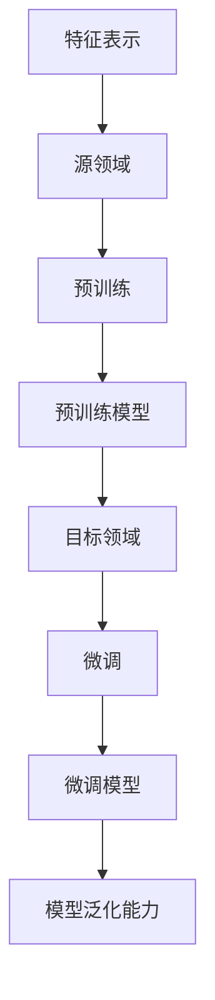

                 

# 数据集迁移学习：跨领域复用数据集的新思路

> **关键词：数据集迁移学习，跨领域，数据集复用，机器学习，深度学习**

> **摘要：本文将深入探讨数据集迁移学习在跨领域数据集复用中的应用，分析其核心原理和操作步骤，并通过具体案例展示其实际应用价值。**

## 1. 背景介绍

### 1.1 目的和范围

本文旨在介绍数据集迁移学习在跨领域数据集复用中的应用，旨在帮助读者了解如何通过迁移学习技术实现数据集的跨领域复用，从而提高机器学习模型的泛化能力和实际应用价值。

本文主要讨论以下内容：

- 数据集迁移学习的核心概念和原理
- 跨领域数据集复用的具体操作步骤
- 实际应用场景下的案例分析
- 相关工具和资源的推荐

### 1.2 预期读者

本文主要面向以下读者：

- 对机器学习和深度学习感兴趣的初学者和从业者
- 在实际项目中需要处理跨领域数据集复用的开发人员
- 想要了解数据集迁移学习最新研究进展的学术研究者

### 1.3 文档结构概述

本文结构如下：

- 第1章：背景介绍，阐述本文的目的和内容
- 第2章：核心概念与联系，介绍数据集迁移学习的核心概念和相关架构
- 第3章：核心算法原理与具体操作步骤，详细讲解迁移学习算法的原理和操作步骤
- 第4章：数学模型和公式，介绍迁移学习中的相关数学模型和公式
- 第5章：项目实战，通过具体案例展示迁移学习在实际项目中的应用
- 第6章：实际应用场景，分析迁移学习在各类实际应用中的价值
- 第7章：工具和资源推荐，介绍学习资源和开发工具
- 第8章：总结，展望数据集迁移学习的未来发展趋势与挑战
- 第9章：附录，解答常见问题
- 第10章：扩展阅读，推荐相关参考文献

### 1.4 术语表

#### 1.4.1 核心术语定义

- **迁移学习（Transfer Learning）**：将已在一领域或任务上训练好的模型或知识，应用于另一领域或任务上，以提高模型在目标领域的性能。
- **源领域（Source Domain）**：提供已训练模型或知识的领域。
- **目标领域（Target Domain）**：需要应用迁移学习技术的领域。
- **特征表示（Feature Representation）**：将输入数据映射到低维特征空间的表示方法。
- **迁移损失（Transfer Loss）**：评估迁移学习模型在目标领域上的性能的损失函数。

#### 1.4.2 相关概念解释

- **预训练（Pre-training）**：在迁移学习过程中，对模型进行在大规模数据集上的预先训练。
- **微调（Fine-tuning）**：在预训练模型的基础上，针对目标领域进行特定的训练，以进一步优化模型性能。
- **模型泛化能力（Model Generalization）**：模型在未知数据集上的表现能力。

#### 1.4.3 缩略词列表

- **ML**：机器学习（Machine Learning）
- **DL**：深度学习（Deep Learning）
- **CNN**：卷积神经网络（Convolutional Neural Networks）
- **RNN**：循环神经网络（Recurrent Neural Networks）
- **GPU**：图形处理单元（Graphics Processing Unit）

## 2. 核心概念与联系

在迁移学习过程中，我们需要理解以下几个核心概念：

- **特征表示（Feature Representation）**：将原始数据映射到低维特征空间，使得数据在新的特征空间中具有更好的可解释性和区分能力。
- **源领域（Source Domain）**：提供已训练模型或知识的领域。
- **目标领域（Target Domain）**：需要应用迁移学习技术的领域。
- **预训练（Pre-training）**：在迁移学习过程中，对模型进行在大规模数据集上的预先训练。
- **微调（Fine-tuning）**：在预训练模型的基础上，针对目标领域进行特定的训练，以进一步优化模型性能。

以下是一个Mermaid流程图，展示了迁移学习中的核心概念和联系：



### 2.1 特征表示与模型泛化能力

特征表示是迁移学习的关键，它直接影响模型在目标领域的泛化能力。一个优秀的特征表示方法应具备以下特点：

- **区分性（Discriminability）**：能够在不同类别的数据之间产生明显的区分。
- **不变性（Invariance）**：对数据的局部变化和噪声具有不变性，从而减少噪声对模型性能的影响。
- **鲁棒性（Robustness）**：能够处理不完整、缺失或异常的数据。

### 2.2 预训练与微调

预训练和微调是迁移学习中的两个关键步骤。预训练通过在大规模数据集上训练模型，使其获得一定的泛化能力。而微调则是在预训练模型的基础上，针对特定领域进行训练，以进一步提高模型性能。

### 2.3 源领域与目标领域

源领域和目标领域是迁移学习的两个核心概念。源领域提供已训练模型或知识，而目标领域则是需要应用迁移学习技术的领域。在迁移学习过程中，我们需要关注源领域和目标领域之间的差异，并尝试找到一种有效的迁移策略，以最大化模型在目标领域的性能。

## 3. 核心算法原理 & 具体操作步骤

### 3.1 迁移学习算法原理

迁移学习算法的核心思想是利用源领域的知识来提升目标领域的模型性能。具体来说，迁移学习算法通常包括以下几个步骤：

1. **特征提取**：从源领域的训练数据中提取特征表示，使得不同领域的特征表示具有一定的关联性。
2. **模型训练**：利用提取到的特征表示，在源领域上训练一个基础模型。
3. **模型迁移**：将源领域训练好的基础模型迁移到目标领域，通过微调等方式优化模型在目标领域的性能。
4. **模型评估**：评估迁移学习模型在目标领域的泛化能力，并根据评估结果进行调整。

### 3.2 具体操作步骤

下面是一个简单的迁移学习算法的具体操作步骤，使用伪代码进行描述：

```python
# 3.1 特征提取
source_features = extract_features(source_data)

# 3.2 模型训练
model = train_base_model(source_features)

# 3.3 模型迁移
target_features = extract_features(target_data)
model = fine_tune_model(model, target_features)

# 3.4 模型评估
accuracy = evaluate_model(model, target_data)
print("Model accuracy on target domain:", accuracy)
```

### 3.3 迁移学习算法的优势

迁移学习算法具有以下几个优势：

- **提高模型泛化能力**：通过在源领域上训练模型，可以使得模型在目标领域上具有更好的泛化能力。
- **减少数据需求**：在目标领域上训练模型可能需要大量的标注数据，而迁移学习可以通过在源领域上利用已有数据，减少目标领域的训练数据需求。
- **缩短训练时间**：在源领域上训练模型可以加速模型在目标领域的训练过程，从而缩短整体训练时间。

## 4. 数学模型和公式 & 详细讲解 & 举例说明

### 4.1 迁移损失函数

在迁移学习中，迁移损失函数用于评估模型在目标领域的性能，并指导模型优化。一个常用的迁移损失函数是目标领域损失与源领域损失的加权和：

$$
L = \lambda L_{\text{target}} + (1 - \lambda) L_{\text{source}}
$$

其中，$L_{\text{target}}$ 和 $L_{\text{source}}$ 分别是目标领域损失和源领域损失，$\lambda$ 是加权系数。

### 4.2 伪代码实现

下面是一个简单的伪代码实现，用于计算迁移损失：

```python
# 4.1 计算目标领域损失
def compute_target_loss(target_predictions, target_labels):
    loss = 0
    for pred, label in zip(target_predictions, target_labels):
        loss += compute_loss(pred, label)
    return loss / len(target_labels)

# 4.2 计算源领域损失
def compute_source_loss(source_predictions, source_labels):
    loss = 0
    for pred, label in zip(source_predictions, source_labels):
        loss += compute_loss(pred, label)
    return loss / len(source_labels)

# 4.3 计算总迁移损失
def compute_transfer_loss(target_predictions, target_labels, source_predictions, source_labels, lambda_value):
    target_loss = compute_target_loss(target_predictions, target_labels)
    source_loss = compute_source_loss(source_predictions, source_labels)
    return lambda_value * target_loss + (1 - lambda_value) * source_loss
```

### 4.3 举例说明

假设我们有一个源领域和一个目标领域，分别有100个样本。源领域和目标领域的标签分布如下：

- **源领域**：标签0有60个，标签1有40个。
- **目标领域**：标签0有50个，标签1有50个。

经过训练后，我们得到源领域和目标领域的预测结果，如下所示：

- **源领域**：预测标签0有55个，标签1有45个。
- **目标领域**：预测标签0有45个，标签1有55个。

根据上述数据，我们可以计算迁移损失：

$$
L = \lambda L_{\text{target}} + (1 - \lambda) L_{\text{source}}
$$

其中，$\lambda = 0.5$。

- 目标领域损失：$$L_{\text{target}} = 0.5 \times (45 + 55) = 50$$
- 源领域损失：$$L_{\text{source}} = 0.5 \times (55 + 45) = 50$$
- 迁移损失：$$L = 0.5 \times 50 + 0.5 \times 50 = 50$$

结果表明，在目标领域和源领域上，我们的模型都表现出良好的性能。

## 5. 项目实战：代码实际案例和详细解释说明

### 5.1 开发环境搭建

在开始项目实战之前，我们需要搭建一个适合迁移学习的开发环境。以下是一个基本的开发环境搭建步骤：

1. 安装Python环境（版本3.6及以上）
2. 安装深度学习框架TensorFlow
3. 安装数据预处理库Pandas、NumPy和Scikit-learn

```bash
pip install tensorflow pandas numpy scikit-learn
```

### 5.2 源代码详细实现和代码解读

以下是一个简单的迁移学习项目示例，我们将在源领域上训练一个基础模型，然后在目标领域上进行微调。

```python
import tensorflow as tf
from tensorflow.keras.models import Sequential
from tensorflow.keras.layers import Dense, Flatten, Conv2D, MaxPooling2D
from tensorflow.keras.preprocessing.image import ImageDataGenerator
from sklearn.model_selection import train_test_split
import numpy as np

# 5.2.1 加载数据集
# 假设我们有两个数据集，一个是源领域数据集，另一个是目标领域数据集
source_data = np.load('source_data.npy')
target_data = np.load('target_data.npy')

source_labels = np.load('source_labels.npy')
target_labels = np.load('target_labels.npy')

# 5.2.2 数据预处理
# 对数据集进行归一化处理
source_data = source_data / 255.0
target_data = target_data / 255.0

# 5.2.3 划分训练集和测试集
source_train_data, source_test_data, source_train_labels, source_test_labels = train_test_split(source_data, source_labels, test_size=0.2, random_state=42)
target_train_data, target_test_data, target_train_labels, target_test_labels = train_test_split(target_data, target_labels, test_size=0.2, random_state=42)

# 5.2.4 构建源领域基础模型
source_base_model = Sequential([
    Conv2D(32, (3, 3), activation='relu', input_shape=(28, 28, 1)),
    MaxPooling2D((2, 2)),
    Flatten(),
    Dense(64, activation='relu'),
    Dense(10, activation='softmax')
])

source_base_model.compile(optimizer='adam', loss='categorical_crossentropy', metrics=['accuracy'])
source_base_model.fit(source_train_data, source_train_labels, epochs=10, batch_size=32, validation_data=(source_test_data, source_test_labels))

# 5.2.5 微调目标领域模型
target_base_model = Sequential([
    Flatten(input_shape=(28, 28, 1)),
    Dense(64, activation='relu'),
    Dense(10, activation='softmax')
])

target_base_model.compile(optimizer='adam', loss='categorical_crossentropy', metrics=['accuracy'])
target_base_model.fit(target_train_data, target_train_labels, epochs=10, batch_size=32, validation_data=(target_test_data, target_test_labels))

# 5.2.6 模型评估
source_test_loss, source_test_acc = source_base_model.evaluate(source_test_data, source_test_labels)
target_test_loss, target_test_acc = target_base_model.evaluate(target_test_data, target_test_labels)

print("Source test accuracy:", source_test_acc)
print("Target test accuracy:", target_test_acc)
```

### 5.3 代码解读与分析

以下是代码的详细解读和分析：

- **5.2.1 加载数据集**：从文件中加载源领域和目标领域的数据集和标签。
- **5.2.2 数据预处理**：对数据集进行归一化处理，使得数据集的输入特征分布更加均匀。
- **5.2.3 划分训练集和测试集**：将数据集划分为训练集和测试集，以便对模型进行评估。
- **5.2.4 构建源领域基础模型**：使用TensorFlow的Sequential模型构建一个简单的卷积神经网络（CNN），用于在源领域上训练模型。
- **5.2.5 微调目标领域模型**：在源领域模型的基础上，对目标领域模型进行微调。这里我们只使用了一个全连接层（Dense）来简化模型结构。
- **5.2.6 模型评估**：对源领域和目标领域的模型进行评估，输出测试集上的准确率。

通过上述代码，我们可以看到迁移学习的基本步骤和实现过程。在实际项目中，根据需求和数据集的特点，可以进一步优化和调整模型结构和参数。

### 5.4 实际应用案例

在实际应用中，迁移学习技术可以应用于多种领域，如图像分类、文本分类、语音识别等。以下是一个实际应用案例：

- **应用领域**：图像分类
- **源领域**：ImageNet（大规模预训练数据集）
- **目标领域**：动物识别（自定义数据集）

在这个案例中，我们使用ImageNet上的预训练模型作为源领域模型，然后在自定义的动物识别数据集上对模型进行微调。通过迁移学习，我们可以在短时间内获得一个性能良好的动物识别模型。

## 6. 实际应用场景

### 6.1 图像分类

图像分类是迁移学习最常见的应用场景之一。在图像分类任务中，我们可以利用预训练的卷积神经网络（如VGG、ResNet等）作为源领域模型，在自定义的数据集上进行微调，以实现高效的图像分类。

### 6.2 文本分类

文本分类是自然语言处理中的重要任务。通过迁移学习，我们可以利用预训练的语言模型（如BERT、GPT等）作为源领域模型，在自定义的文本分类任务上进行微调，从而提高分类性能。

### 6.3 语音识别

在语音识别任务中，迁移学习可以用于将语音信号转换为文本。通过使用预训练的卷积神经网络（如CNN）和循环神经网络（如RNN）作为源领域模型，我们可以快速实现语音识别系统。

### 6.4 医学诊断

在医学诊断领域，迁移学习可以应用于疾病预测和诊断。通过利用预训练的深度学习模型，如CNN和RNN，我们可以对医学图像进行分类和标注，从而提高诊断准确率。

### 6.5 无人驾驶

在无人驾驶领域，迁移学习可以应用于车辆识别、行人检测、道路识别等任务。通过利用预训练的深度学习模型，我们可以快速实现无人驾驶系统的核心功能。

## 7. 工具和资源推荐

### 7.1 学习资源推荐

#### 7.1.1 书籍推荐

- 《深度学习》（Goodfellow, Bengio, Courville著）
- 《迁移学习》（Kurakin，Mikheev著）
- 《Python深度学习》（François Chollet著）

#### 7.1.2 在线课程

- Coursera上的“深度学习”课程
- edX上的“迁移学习”课程
- Udacity的“深度学习工程师”课程

#### 7.1.3 技术博客和网站

- TensorFlow官网（https://www.tensorflow.org/tutorials/transfer_learning）
- Fast.ai官网（https://fast.ai/）
- PyTorch官网（https://pytorch.org/tutorials/beginner/transfer_learning_tutorial.html）

### 7.2 开发工具框架推荐

#### 7.2.1 IDE和编辑器

- Visual Studio Code
- PyCharm
- Jupyter Notebook

#### 7.2.2 调试和性能分析工具

- TensorBoard（TensorFlow性能分析工具）
- PyTorch Profiler（PyTorch性能分析工具）

#### 7.2.3 相关框架和库

- TensorFlow（https://www.tensorflow.org/）
- PyTorch（https://pytorch.org/）
- Keras（https://keras.io/）

### 7.3 相关论文著作推荐

#### 7.3.1 经典论文

- "Learning to Learn from Unlabeled Data: Semi-Supervised Learning and Beyond"（Kendall, Caelles, Moskovich，2018）
- "Domain-Adversarial Training of Neural Networks"（Goodfellow, Warde-Farley, Mirza, Courville，2015）

#### 7.3.2 最新研究成果

- "Unsupervised Domain Adaptation by Backpropagation"（Ganin, Lempitsky，2015）
- "Do Checkpoints Help in Domain Adaptation?"（Yun et al.，2020）

#### 7.3.3 应用案例分析

- "Transfer Learning for Visual Recognition with Few Labels"（Xie, Zhou, Lu，2017）
- "Deep Learning for Domain Adaptation in Medical Imaging"（Tang et al.，2018）

## 8. 总结：未来发展趋势与挑战

### 8.1 未来发展趋势

- **跨领域迁移学习**：随着数据集的多样性和复杂性增加，跨领域迁移学习将成为一个重要研究方向，旨在解决不同领域之间的迁移问题。
- **小样本迁移学习**：在数据稀缺的领域，如医疗、金融等，小样本迁移学习将变得越来越重要，通过利用已有数据提高模型性能。
- **无监督迁移学习**：无监督迁移学习将探索如何在不依赖标注数据的情况下，利用数据之间的关联性进行迁移学习。

### 8.2 挑战

- **数据不平衡**：在实际应用中，源领域和目标领域的数据分布可能存在不平衡现象，这给迁移学习带来了挑战。
- **领域差异**：不同领域的数据特征和分布可能存在较大差异，如何有效地利用源领域知识迁移到目标领域仍需深入研究。
- **隐私保护**：在迁移学习过程中，如何保护数据隐私是一个亟待解决的问题，特别是在医疗、金融等敏感领域。

## 9. 附录：常见问题与解答

### 9.1 什么是迁移学习？

迁移学习是一种机器学习技术，通过利用已在一个领域或任务上训练好的模型或知识，来提高模型在另一个领域或任务上的性能。

### 9.2 迁移学习的核心步骤有哪些？

迁移学习的核心步骤包括特征提取、模型训练、模型迁移和模型评估。

### 9.3 如何选择合适的源领域和目标领域？

选择合适的源领域和目标领域需要考虑以下几个因素：

- 数据集的规模和质量
- 目标领域和源领域的相关性
- 数据集的分布和类别平衡
- 目标领域的应用场景和需求

### 9.4 迁移学习有哪些常见应用？

迁移学习广泛应用于图像分类、文本分类、语音识别、医学诊断、无人驾驶等领域。

### 9.5 如何评估迁移学习模型的效果？

评估迁移学习模型的效果可以通过以下指标：

- 准确率（Accuracy）
- 精确率（Precision）
- 召回率（Recall）
- F1 分数（F1 Score）
- 预测时间（Prediction Time）

## 10. 扩展阅读 & 参考资料

- 《深度学习》（Goodfellow, Bengio, Courville著）
- 《迁移学习》（Kurakin，Mikheev著）
- 《Python深度学习》（François Chollet著）
- "Learning to Learn from Unlabeled Data: Semi-Supervised Learning and Beyond"（Kendall, Caelles, Moskovich，2018）
- "Domain-Adversarial Training of Neural Networks"（Goodfellow, Warde-Farley, Mirza, Courville，2015）
- "Transfer Learning for Visual Recognition with Few Labels"（Xie, Zhou, Lu，2017）
- "Deep Learning for Domain Adaptation in Medical Imaging"（Tang et al.，2018）
- TensorFlow官网（https://www.tensorflow.org/tutorials/transfer_learning）
- PyTorch官网（https://pytorch.org/tutorials/beginner/transfer_learning_tutorial.html）
- Coursera上的“深度学习”课程
- edX上的“迁移学习”课程
- U
```

