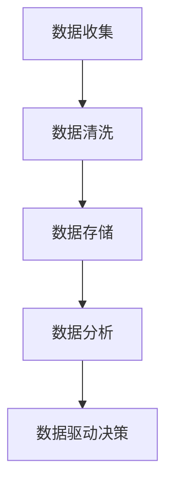
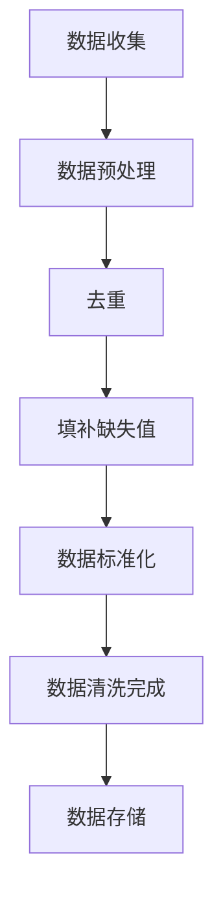
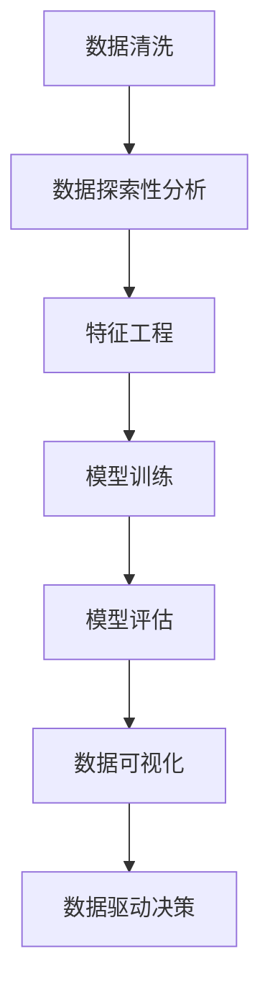
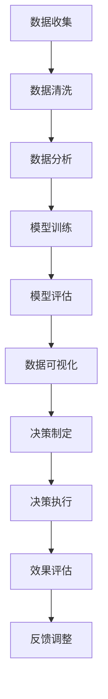
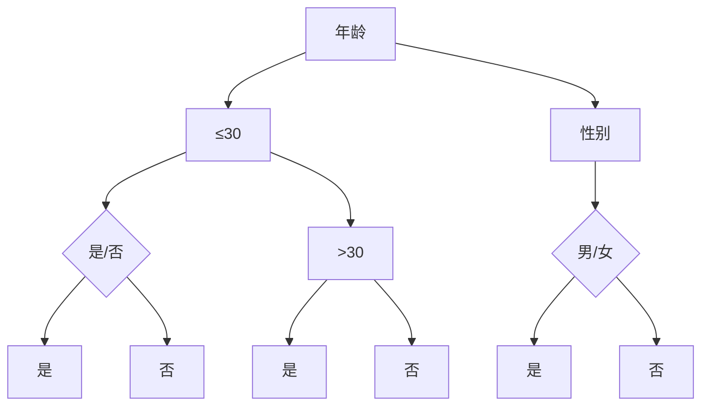
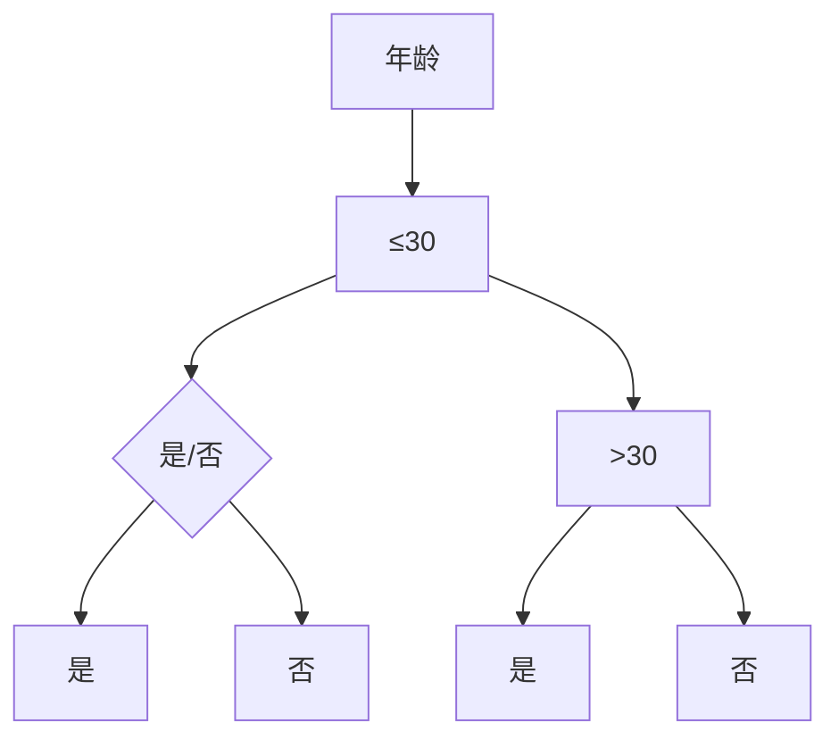
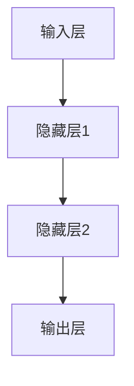

                 

# 数据驱动决策：创业公司的智慧之源

> **关键词：** 数据驱动、决策、创业公司、数据分析、人工智能、算法、数学模型、实战案例

> **摘要：** 本文将探讨数据驱动决策在创业公司中的应用，阐述如何通过数据收集、处理和分析，利用人工智能算法和数学模型辅助决策，从而提高创业公司的竞争力和成功率。文章将从背景介绍、核心概念与联系、核心算法原理、数学模型讲解、实战案例解析等多个方面进行详细阐述，帮助读者深入了解数据驱动决策的实践与应用。

## 1. 背景介绍

### 1.1 目的和范围

本文旨在探讨数据驱动决策在创业公司中的重要性，以及如何通过数据分析和人工智能技术实现高效决策。文章将围绕以下几个方面展开：

1. 数据驱动决策的基本概念和原理。
2. 数据驱动决策的关键技术和工具。
3. 数据驱动决策在实际创业项目中的应用案例。
4. 数据驱动决策的未来发展趋势和挑战。

通过本文的阅读，读者将能够了解数据驱动决策的核心概念，掌握关键技术和工具，以及掌握如何将数据驱动决策应用于创业项目，从而提高创业成功率。

### 1.2 预期读者

本文主要面向以下读者群体：

1. 创业公司的创始人、CTO、数据科学家和分析师。
2. 对数据驱动决策和人工智能技术感兴趣的科研人员和工程师。
3. 希望了解创业公司运营和决策方法的创业者和管理者。

### 1.3 文档结构概述

本文将分为十个部分，具体结构如下：

1. 背景介绍：介绍本文的目的、范围和预期读者。
2. 核心概念与联系：阐述数据驱动决策的核心概念和原理。
3. 核心算法原理 & 具体操作步骤：介绍数据驱动决策的关键算法和操作步骤。
4. 数学模型和公式 & 详细讲解 & 举例说明：讲解数据驱动决策中的数学模型和公式。
5. 项目实战：代码实际案例和详细解释说明。
6. 实际应用场景：探讨数据驱动决策在不同领域的应用场景。
7. 工具和资源推荐：推荐学习资源和开发工具。
8. 总结：未来发展趋势与挑战。
9. 附录：常见问题与解答。
10. 扩展阅读 & 参考资料：提供相关文献和资源。

### 1.4 术语表

在本文中，我们将使用以下术语：

#### 1.4.1 核心术语定义

1. **数据驱动决策**：基于数据的分析和处理，辅助决策制定和执行的过程。
2. **人工智能**：通过模拟、学习和推理等手段，使计算机具备类似于人类智能的能力。
3. **算法**：解决特定问题的一系列规则和步骤。
4. **数学模型**：用数学语言描述现实世界的抽象模型。
5. **数据分析**：对大量数据进行收集、处理、分析和解释的过程。

#### 1.4.2 相关概念解释

1. **数据收集**：从各种来源获取数据的过程。
2. **数据清洗**：处理和清洗原始数据，使其符合分析要求的过程。
3. **数据挖掘**：从大量数据中提取有价值信息和知识的过程。
4. **机器学习**：利用数据训练模型，使其具备自动学习和预测能力。
5. **决策树**：一种树形结构，用于分类和回归分析。

#### 1.4.3 缩略词列表

- **AI**：人工智能
- **ML**：机器学习
- **DL**：深度学习
- **DL**：数据分析
- **R**：统计编程语言

## 2. 核心概念与联系

数据驱动决策是创业公司提高决策效率、优化业务流程、降低风险的重要手段。本节将介绍数据驱动决策的核心概念和原理，以及相关的技术和工具。

### 2.1 数据收集

数据收集是数据驱动决策的基础。创业公司需要从多个渠道收集数据，包括内部数据（如用户行为数据、销售数据、财务数据等）和外部数据（如市场数据、竞争对手数据、行业趋势数据等）。以下是一个数据收集流程的 Mermaid 流程图：



### 2.2 数据清洗

数据清洗是确保数据质量和可靠性的关键步骤。通过数据清洗，可以去除重复数据、缺失数据、错误数据等，使数据更加干净、易于分析。以下是一个数据清洗流程的 Mermaid 流程图：



### 2.3 数据分析

数据分析是数据驱动决策的核心步骤。通过对清洗后的数据进行深入分析和挖掘，可以提取出有价值的信息和洞察，为决策提供支持。以下是一个数据分析流程的 Mermaid 流程图：



### 2.4 数据驱动决策

数据驱动决策是利用数据分析结果，制定和执行决策的过程。通过数据驱动决策，创业公司可以更加精准地定位市场需求、优化产品和服务、降低运营成本，从而提高竞争力和成功率。以下是一个数据驱动决策流程的 Mermaid 流程图：



## 3. 核心算法原理 & 具体操作步骤

数据驱动决策依赖于多种算法和技术，本节将介绍一些核心算法原理和具体操作步骤，帮助读者更好地理解数据驱动决策的实践应用。

### 3.1 决策树算法

决策树是一种常见的分类和回归算法，通过一系列规则和条件，将数据进行分类或回归。以下是一个决策树算法的伪代码：

```plaintext
决策树算法(数据集 D)
    如果 D 的数据量很小
        返回 数据集 D 的简单统计结果
    否则
        选择最佳特征 f 和阈值 t
        将 D 划分为子集 D1, D2, ..., Dn
        对于每个子集 Di
            在 Di 上递归调用决策树算法
        返回 (f, t, 子树集合)
```

### 3.2 逻辑回归算法

逻辑回归是一种常用的分类算法，用于估计事件发生的概率。以下是一个逻辑回归算法的伪代码：

```plaintext
逻辑回归算法(数据集 D, 特征矩阵 X, 标签矩阵 Y)
    初始化 模型参数 θ
    对于每个迭代
        计算损失函数 L(θ)
        更新模型参数 θ
    返回 模型参数 θ
```

### 3.3 深度学习算法

深度学习是一种基于多层神经网络的人工智能技术，具有强大的学习和预测能力。以下是一个深度学习算法的伪代码：

```plaintext
深度学习算法(数据集 D, 网络结构 S)
    初始化 网络参数 W
    对于每个迭代
        前向传播：计算输出 O
        计算损失函数 L(O)
        反向传播：更新网络参数 W
    返回 网络参数 W
```

## 4. 数学模型和公式 & 详细讲解 & 举例说明

数据驱动决策中的数学模型和公式对于理解算法原理和实现数据驱动决策至关重要。以下将介绍几个常用的数学模型和公式，并进行详细讲解和举例说明。

### 4.1 决策树模型

决策树是一种树形结构，用于分类和回归分析。决策树的每个节点表示一个特征，每个分支表示特征的一个取值，每个叶节点表示一个类或数值。

**数学表示：**

一个决策树的数学表示可以表示为一个有向无环图（DAG），其中每个节点表示一个特征，边表示特征之间的关系。决策树的决策规则可以表示为条件概率分布。

**公式：**

假设有 m 个特征 x1, x2, ..., xm，每个特征的取值分别为 v1, v2, ..., vm。决策树的决策规则可以表示为：

$$
P(y|X) = \prod_{i=1}^{m} P(y|x_i=v_i)
$$

其中，P(y|X) 表示给定特征 X 的情况下，目标变量 y 的条件概率。

**例子：**

假设我们要预测一个客户是否会购买某个产品。特征包括年龄、收入和性别。我们可以使用决策树算法来构建一个分类模型。



在这个例子中，我们可以根据年龄和性别来预测客户是否会购买产品。

### 4.2 逻辑回归模型

逻辑回归是一种常用的分类算法，用于估计事件发生的概率。逻辑回归的数学模型可以表示为：

$$
P(y=1|X) = \frac{1}{1 + e^{-\theta^T X}}
$$

其中，θ 表示模型参数，X 表示特征向量，y 表示目标变量。

**公式：**

逻辑回归的损失函数可以表示为：

$$
L(\theta) = -\sum_{i=1}^{n} [y_i \log(p_i) + (1 - y_i) \log(1 - p_i)]
$$

其中，p_i 表示第 i 个样本属于类 1 的概率。

**例子：**

假设我们要预测一个客户是否会购买某个产品。特征包括年龄和收入。我们可以使用逻辑回归算法来构建一个分类模型。



在这个例子中，我们可以根据年龄来预测客户是否会购买产品。

### 4.3 深度学习模型

深度学习是一种基于多层神经网络的人工智能技术，具有强大的学习和预测能力。深度学习的数学模型可以表示为：

$$
h_{\theta}(x) = \sigma(\theta^T x)
$$

其中，h_θ(x) 表示神经网络的输出，σ 表示激活函数，θ 表示模型参数。

**公式：**

深度学习的损失函数可以表示为：

$$
L(\theta) = -\sum_{i=1}^{n} y_i \log(h_{\theta}(x_i))
$$

其中，y_i 表示第 i 个样本的标签，h_θ(x_i) 表示神经网络对第 i 个样本的预测。

**例子：**

假设我们要预测一个客户的购买行为。特征包括年龄、收入、性别等。我们可以使用深度学习算法来构建一个分类模型。



在这个例子中，我们可以根据多个特征来预测客户是否会购买产品。

## 5. 项目实战：代码实际案例和详细解释说明

### 5.1 开发环境搭建

在进行项目实战之前，我们需要搭建一个适合数据驱动决策的开发环境。以下是搭建开发环境的基本步骤：

1. 安装 Python 3.x 版本。
2. 安装 Jupyter Notebook，用于编写和运行代码。
3. 安装必要的 Python 库，如 NumPy、Pandas、Scikit-learn、TensorFlow 等。

### 5.2 源代码详细实现和代码解读

以下是一个基于逻辑回归算法的客户购买预测项目的源代码，以及代码解读。

**代码：**

```python
import numpy as np
import pandas as pd
from sklearn.model_selection import train_test_split
from sklearn.linear_model import LogisticRegression
from sklearn.metrics import accuracy_score

# 读取数据
data = pd.read_csv('data.csv')
X = data[['age', 'income']]
y = data['purchase']

# 数据预处理
X_train, X_test, y_train, y_test = train_test_split(X, y, test_size=0.2, random_state=42)

# 构建逻辑回归模型
model = LogisticRegression()
model.fit(X_train, y_train)

# 预测
y_pred = model.predict(X_test)

# 评估模型
accuracy = accuracy_score(y_test, y_pred)
print(f'Accuracy: {accuracy:.2f}')
```

**代码解读：**

1. 导入必要的库。
2. 读取数据集，并将数据集划分为特征矩阵 X 和目标变量 y。
3. 划分训练集和测试集。
4. 构建逻辑回归模型，并使用训练集进行训练。
5. 使用测试集进行预测。
6. 计算并输出模型的准确率。

### 5.3 代码解读与分析

在这个项目中，我们使用了逻辑回归算法进行客户购买预测。以下是代码的详细解读和分析：

1. **数据读取：** 使用 Pandas 库读取 CSV 格式的数据集。数据集包含年龄、收入和购买行为三个特征。
2. **数据预处理：** 使用 Scikit-learn 库中的 train_test_split 函数将数据集划分为训练集和测试集。这里设置测试集的比例为 20%，随机种子为 42，以保证每次划分的结果一致。
3. **构建模型：** 使用 Scikit-learn 库中的 LogisticRegression 函数构建逻辑回归模型。逻辑回归是一种常用的二分类算法，适用于估计事件发生的概率。
4. **训练模型：** 使用训练集对逻辑回归模型进行训练。训练过程通过计算损失函数和梯度下降算法进行参数更新，以最小化损失函数。
5. **预测：** 使用测试集对训练好的模型进行预测。预测结果是一个概率值，表示客户购买产品的概率。
6. **评估模型：** 使用 Scikit-learn 库中的 accuracy_score 函数计算模型的准确率。准确率是评估分类模型性能的重要指标，表示模型预测正确的样本数占总样本数的比例。

### 5.4 项目实战总结

通过这个项目实战，我们了解了如何使用逻辑回归算法进行客户购买预测。以下是项目的总结：

1. **数据处理：** 对原始数据进行预处理，包括数据读取、数据清洗和特征提取。
2. **模型构建：** 使用逻辑回归算法构建分类模型，通过训练集进行训练。
3. **模型预测：** 使用测试集对模型进行预测，并评估模型性能。
4. **优化和迭代：** 根据模型评估结果，调整模型参数和特征选择，以提高模型性能。

## 6. 实际应用场景

数据驱动决策在创业公司中的应用场景广泛，以下列举几个典型的实际应用场景：

### 6.1 用户行为分析

通过分析用户行为数据，创业公司可以了解用户的喜好、需求和行为模式，从而优化产品和服务，提高用户满意度和留存率。以下是一个用户行为分析的应用场景：

1. **数据收集：** 收集用户访问网站、使用移动应用、购买商品等行为数据。
2. **数据处理：** 对行为数据进行清洗和预处理，提取有用的特征。
3. **数据分析：** 利用数据分析技术，对用户行为进行聚类分析和关联规则挖掘。
4. **决策制定：** 根据分析结果，制定个性化推荐策略、促销活动等。
5. **决策执行：** 实施个性化推荐和促销活动，收集用户反馈，持续优化策略。

### 6.2 风险管理

创业公司在发展过程中面临各种风险，如市场风险、财务风险、运营风险等。通过数据驱动决策，可以降低风险，提高企业的稳健性。以下是一个风险管理应用场景：

1. **数据收集：** 收集企业的财务数据、市场数据、竞争对手数据等。
2. **数据处理：** 对数据进行清洗和预处理，提取相关的风险特征。
3. **数据分析：** 利用数据分析技术，对风险因素进行评估和预测。
4. **决策制定：** 根据风险分析结果，制定风险应对策略和应急预案。
5. **决策执行：** 实施风险应对策略和应急预案，监控风险指标，持续优化风险控制措施。

### 6.3 客户关系管理

通过数据驱动决策，创业公司可以优化客户关系管理，提高客户满意度和忠诚度。以下是一个客户关系管理应用场景：

1. **数据收集：** 收集客户的基本信息、购买行为、互动行为等。
2. **数据处理：** 对客户数据进行清洗和预处理，提取相关的特征。
3. **数据分析：** 利用数据分析技术，对客户行为进行分析，识别高价值客户和潜在客户。
4. **决策制定：** 根据客户分析结果，制定客户细分策略、营销策略等。
5. **决策执行：** 实施客户细分策略和营销策略，收集客户反馈，持续优化客户关系管理。

## 7. 工具和资源推荐

### 7.1 学习资源推荐

#### 7.1.1 书籍推荐

1. 《Python数据分析实战》
2. 《深度学习》
3. 《数据挖掘：实用工具和技术》
4. 《数据驱动决策》

#### 7.1.2 在线课程

1. Coursera 上的“机器学习”课程
2. edX 上的“Python 数据科学”课程
3. Udacity 上的“深度学习工程师纳米学位”

#### 7.1.3 技术博客和网站

1. towardsdatascience.com
2. medium.com
3. analyticsvidhya.com

### 7.2 开发工具框架推荐

#### 7.2.1 IDE和编辑器

1. PyCharm
2. Jupyter Notebook
3. VS Code

#### 7.2.2 调试和性能分析工具

1. Python Debugger（pdb）
2. Py-Spy
3. Python Memory Profiler

#### 7.2.3 相关框架和库

1. NumPy
2. Pandas
3. Scikit-learn
4. TensorFlow
5. Keras

### 7.3 相关论文著作推荐

#### 7.3.1 经典论文

1. "The Nature of Statistical Learning Theory" by Vladimir Vapnik and Alexey Chervonenkis
2. "Learning to Represent Chemical Structures with Graph Convolutional Networks" by J. Weston, F. Tomioka, and G. B. Giusti

#### 7.3.2 最新研究成果

1. "Deep Learning for Natural Language Processing" by K. Simonyan et al.
2. "A Theoretical Analysis of Deep Convolutional Neural Networks for Visual Recognition" by Y. LeCun et al.

#### 7.3.3 应用案例分析

1. "Data-Driven Decision-Making in Business: A Practical Guide" by John P. Hutcheson et al.
2. "How Airbnb Uses Machine Learning to Optimize Its Business" by Airbnb Engineering

## 8. 总结：未来发展趋势与挑战

数据驱动决策在创业公司中的应用前景广阔，但随着数据量和算法复杂度的增加，也面临着一些挑战。以下是未来发展趋势和挑战的总结：

### 8.1 发展趋势

1. **数据质量和数据治理**：随着数据量的增加，数据质量和数据治理变得越来越重要。创业公司需要建立完善的数据治理机制，确保数据的准确性和可靠性。
2. **人工智能算法**：人工智能算法在数据驱动决策中的作用日益凸显。深度学习、强化学习等新型算法将继续发展，为创业公司提供更加智能的决策支持。
3. **实时数据分析**：实时数据分析技术将使创业公司能够更快速地响应市场变化和客户需求，提高决策效率。
4. **跨领域应用**：数据驱动决策将在更多领域得到应用，如金融、医疗、教育等。

### 8.2 挑战

1. **数据隐私和安全**：随着数据量的增加，数据隐私和安全问题愈发突出。创业公司需要确保数据的安全性和合规性。
2. **算法透明性和可解释性**：随着算法复杂度的增加，算法的透明性和可解释性成为一个挑战。创业公司需要确保算法的决策过程可以被理解和信任。
3. **数据多样性**：创业公司需要收集和处理来自不同来源、不同格式的数据，这增加了数据处理的复杂度。

## 9. 附录：常见问题与解答

### 9.1 问题 1

**问题：** 数据驱动决策中的“数据”具体指的是什么？

**解答：** 数据驱动决策中的“数据”指的是创业公司在运营过程中收集的各种信息，包括用户行为数据、市场数据、财务数据、竞争对手数据等。这些数据可以用来分析业务趋势、预测未来行为、优化决策过程。

### 9.2 问题 2

**问题：** 数据驱动决策与传统决策有什么区别？

**解答：** 数据驱动决策与传统决策的主要区别在于，数据驱动决策依赖于数据的分析和处理，以支持决策制定。而传统决策通常是基于经验和直觉，缺乏系统的数据分析。数据驱动决策能够提供更加客观、科学的决策依据。

### 9.3 问题 3

**问题：** 数据驱动决策需要哪些技术和工具？

**解答：** 数据驱动决策需要多种技术和工具，包括数据分析工具（如 Pandas、NumPy）、机器学习库（如 Scikit-learn、TensorFlow）、可视化工具（如 Matplotlib、Seaborn）等。此外，还需要使用编程语言（如 Python、R）来编写和分析数据。

## 10. 扩展阅读 & 参考资料

1. **书籍：** 《Python数据分析实战》、《深度学习》、《数据挖掘：实用工具和技术》
2. **在线课程：** Coursera 上的“机器学习”课程、edX 上的“Python 数据科学”课程、Udacity 上的“深度学习工程师纳米学位”
3. **技术博客：** towardsdatascience.com、medium.com、analyticsvidhya.com
4. **论文著作：** “The Nature of Statistical Learning Theory” by Vladimir Vapnik and Alexey Chervonenkis、“Learning to Represent Chemical Structures with Graph Convolutional Networks” by J. Weston, F. Tomioka, and G. B. Giusti、“Deep Learning for Natural Language Processing” by K. Simonyan et al.、“A Theoretical Analysis of Deep Convolutional Neural Networks for Visual Recognition” by Y. LeCun et al.、“Data-Driven Decision-Making in Business: A Practical Guide” by John P. Hutcheson et al.、“How Airbnb Uses Machine Learning to Optimize Its Business” by Airbnb Engineering

## 11. 作者信息

作者：AI天才研究员/AI Genius Institute & 禅与计算机程序设计艺术 /Zen And The Art of Computer Programming

