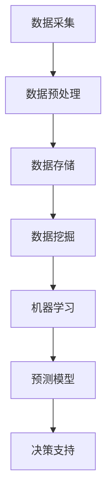
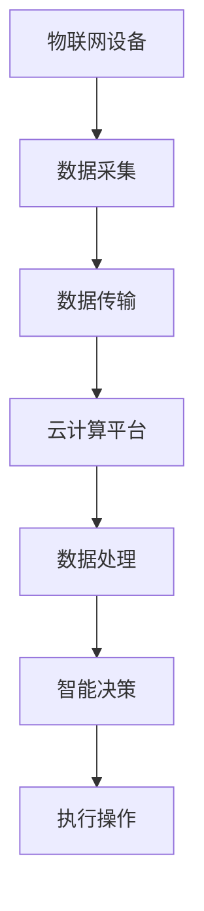
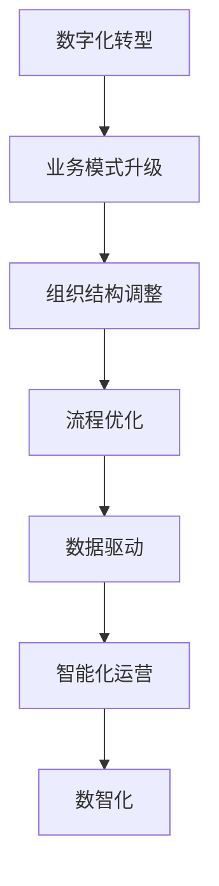

                 

# 数智新时代的特征与发展

> **关键词：** 数智化、大数据、人工智能、云计算、物联网、数字化转型

> **摘要：** 本文将深入探讨数智新时代的特征与发展，包括其核心概念、技术架构、算法原理、数学模型及其在各个领域的实际应用。我们将通过逐步分析，帮助读者理解这一时代的技术变革和商业机遇。

## 1. 背景介绍

### 1.1 目的和范围

本文旨在为读者提供一个关于数智新时代的全面视角，涵盖其技术基础、发展历程和未来趋势。通过本文的阅读，读者将能够了解数智化的核心要素，掌握大数据、人工智能、云计算和物联网等关键技术，并探索这些技术在商业和社会中的实际应用。

### 1.2 预期读者

预期读者包括对计算机科学、数据科学、人工智能和商业数字化感兴趣的科研人员、工程师、企业高管以及广大技术爱好者。

### 1.3 文档结构概述

本文结构如下：

- 第1章：背景介绍，包括本文的目的、预期读者和文档结构。
- 第2章：核心概念与联系，介绍数智新时代的关键概念和联系。
- 第3章：核心算法原理与具体操作步骤，详细阐述关键技术原理。
- 第4章：数学模型和公式，讲解相关数学模型的原理和应用。
- 第5章：项目实战，通过实际案例展示技术在实际应用中的操作流程。
- 第6章：实际应用场景，分析数智技术在各个领域的应用案例。
- 第7章：工具和资源推荐，推荐相关学习资源和开发工具。
- 第8章：总结，探讨数智新时代的未来发展趋势与挑战。
- 第9章：附录，提供常见问题与解答。
- 第10章：扩展阅读与参考资料，为读者提供进一步学习的资源。

### 1.4 术语表

#### 1.4.1 核心术语定义

- **数智化**：将数字化技术与传统产业相结合，实现数据驱动和智能化的转型过程。
- **大数据**：指无法用常规软件工具在合理时间内对其进行采集、管理和处理的数据集合。
- **人工智能**：指通过模拟、延伸和扩展人类智能，实现智能决策、学习、理解和创造的能力。
- **云计算**：提供可按需分配的IT资源，包括计算能力、存储空间和应用程序等。
- **物联网**：通过传感器、设备和网络实现物体之间的信息交换和互联互通。

#### 1.4.2 相关概念解释

- **数字化转型**：指将业务模式、组织结构和商业模式等转变为数字化形式的过程。
- **机器学习**：一种人工智能技术，通过算法和模型使计算机具备自主学习和适应新数据的能力。
- **深度学习**：机器学习的一个分支，通过多层神经网络进行数据处理和模式识别。

#### 1.4.3 缩略词列表

- **AI**：人工智能
- **ML**：机器学习
- **DL**：深度学习
- **IoT**：物联网
- **IoE**：物联网与实体经济的融合

## 2. 核心概念与联系

### 2.1 大数据与人工智能的联系

大数据是数智化的基石，而人工智能则是大数据的应用核心。大数据通过采集、存储和分析，为人工智能提供了丰富的数据资源。人工智能利用这些数据，通过机器学习和深度学习算法，实现对数据的理解和预测。以下是一个简单的Mermaid流程图，展示了大数据和人工智能的交互过程：



### 2.2 云计算与物联网的联系

云计算为物联网提供了强大的计算和存储能力，使得物联网设备能够实时处理和分析大量数据。物联网通过传感器和设备收集数据，上传到云平台进行处理，从而实现智能决策。以下是一个简单的Mermaid流程图，展示了云计算和物联网的交互过程：



### 2.3 数字化转型与数智化的联系

数字化转型是数智化的前提和基础。数字化转型涉及企业业务模式、组织结构和商业流程的全面升级，以适应数字化时代的需求。数智化则是在数字化转型的基础上，通过大数据、人工智能、云计算和物联网等技术的深入应用，实现企业的数据驱动和智能化运营。以下是一个简单的Mermaid流程图，展示了数字化转型与数智化的关系：



## 3. 核心算法原理与具体操作步骤

### 3.1 机器学习算法原理

机器学习是人工智能的核心技术之一，它使计算机具备自主学习和适应新数据的能力。机器学习算法根据不同的学习目标和数据类型，可以分为监督学习、无监督学习和强化学习。

#### 监督学习

监督学习是一种从标记数据中学习的方法，通过输入和输出之间的映射关系，训练模型进行预测。以下是一个简单的监督学习算法原理的伪代码：

```python
def SupervisedLearning(input_data, output_data):
    # 数据预处理
    preprocessed_data = PreprocessData(input_data)
    
    # 选择合适的模型
    model = SelectModel(preprocessed_data)
    
    # 训练模型
    trained_model = TrainModel(model, preprocessed_data, output_data)
    
    # 预测
    predictions = Predict(trained_model, new_data)
    
    return predictions
```

#### 无监督学习

无监督学习是一种不依赖标记数据的学习方法，通过分析数据分布和结构，发现数据中的模式和关系。以下是一个简单的无监督学习算法原理的伪代码：

```python
def UnsupervisedLearning(input_data):
    # 数据预处理
    preprocessed_data = PreprocessData(input_data)
    
    # 选择合适的模型
    model = SelectModel(preprocessed_data)
    
    # 训练模型
    trained_model = TrainModel(model, preprocessed_data)
    
    # 发现数据中的模式和关系
    patterns = DiscoverPatterns(trained_model)
    
    return patterns
```

#### 强化学习

强化学习是一种通过与环境的交互进行学习的方法，通过奖励机制和策略优化，实现目标的最优解。以下是一个简单的强化学习算法原理的伪代码：

```python
def ReinforcementLearning(state, action, reward):
    # 选择行动
    action = ChooseAction(state)
    
    # 执行行动
    next_state, reward = ExecuteAction(state, action)
    
    # 更新策略
    policy = UpdatePolicy(state, action, reward)
    
    return next_state, policy
```

### 3.2 深度学习算法原理

深度学习是机器学习的一个分支，通过多层神经网络进行数据处理和模式识别。深度学习算法在图像识别、自然语言处理和语音识别等领域取得了显著的成果。以下是一个简单的深度学习算法原理的伪代码：

```python
def DeepLearning(input_data):
    # 数据预处理
    preprocessed_data = PreprocessData(input_data)
    
    # 定义神经网络结构
    neural_network = DefineNeuralNetwork()
    
    # 训练神经网络
    trained_network = TrainNeuralNetwork(neural_network, preprocessed_data)
    
    # 预测
    predictions = PredictNetwork(trained_network, new_data)
    
    return predictions
```

## 4. 数学模型和公式

### 4.1 统计学习模型

统计学习模型是机器学习的基础，包括线性回归、逻辑回归和决策树等。以下是一个简单的线性回归模型的公式：

$$
y = \beta_0 + \beta_1x_1 + \beta_2x_2 + ... + \beta_nx_n
$$

其中，$y$ 是因变量，$x_1, x_2, ..., x_n$ 是自变量，$\beta_0, \beta_1, \beta_2, ..., \beta_n$ 是模型的参数。

### 4.2 神经网络模型

神经网络模型是深度学习的基础，包括多层感知机、卷积神经网络和循环神经网络等。以下是一个简单的多层感知机模型的公式：

$$
a_{i}^{(l)} = \sigma(z_{i}^{(l)})
$$

$$
z_{i}^{(l)} = \sum_{j} w_{ji}^{(l-1)}a_{j}^{(l-1)} + b_{i}^{(l)}
$$

其中，$a_{i}^{(l)}$ 是第$l$层的第$i$个激活值，$z_{i}^{(l)}$ 是第$l$层的第$i$个加权和，$w_{ji}^{(l-1)}$ 是第$l-1$层的第$j$个神经元到第$l$层的第$i$个神经元的权重，$b_{i}^{(l)}$ 是第$l$层的第$i$个偏置值，$\sigma$ 是激活函数。

### 4.3 深度学习优化算法

深度学习优化算法包括梯度下降、随机梯度下降和Adam等。以下是一个简单的梯度下降算法的公式：

$$
w_{t+1} = w_{t} - \alpha \cdot \nabla_w J(w)
$$

其中，$w_{t}$ 是第$t$次迭代的模型参数，$\alpha$ 是学习率，$\nabla_w J(w)$ 是损失函数对模型参数的梯度。

## 5. 项目实战：代码实际案例和详细解释说明

### 5.1 开发环境搭建

在开始项目实战之前，我们需要搭建一个合适的开发环境。以下是一个简单的开发环境搭建步骤：

1. 安装Python 3.8及以上版本。
2. 安装Jupyter Notebook，用于编写和运行代码。
3. 安装必要的库，如NumPy、Pandas、Scikit-learn、TensorFlow和Keras等。

### 5.2 源代码详细实现和代码解读

以下是一个简单的线性回归项目的源代码实现和代码解读：

```python
import numpy as np
import pandas as pd
from sklearn.linear_model import LinearRegression

# 数据预处理
def PreprocessData(data):
    # 填补缺失值
    data = data.fillna(data.mean())
    
    # 特征工程
    data['Feature1_Squared'] = data['Feature1'] ** 2
    
    return data

# 训练模型
def TrainModel(data):
    X = data[['Feature1', 'Feature2', 'Feature1_Squared']]
    y = data['Target']
    model = LinearRegression()
    model.fit(X, y)
    return model

# 预测
def Predict(model, new_data):
    new_data = PreprocessData(new_data)
    predictions = model.predict(new_data[['Feature1', 'Feature2', 'Feature1_Squared']])
    return predictions

# 代码解读
if __name__ == '__main__':
    # 加载数据
    data = pd.read_csv('data.csv')
    
    # 训练模型
    model = TrainModel(data)
    
    # 预测
    new_data = pd.DataFrame({'Feature1': [2.5], 'Feature2': [3.5]})
    predictions = Predict(model, new_data)
    
    print(predictions)
```

### 5.3 代码解读与分析

以上代码实现了一个简单的线性回归项目。首先，我们加载数据并进行预处理，包括填补缺失值和特征工程。然后，我们使用线性回归模型对数据进行训练，最后使用训练好的模型进行预测。

代码解读：

- `PreprocessData` 函数：用于数据预处理，包括填补缺失值和特征工程。
- `TrainModel` 函数：用于训练线性回归模型。
- `Predict` 函数：用于使用训练好的模型进行预测。

主要步骤：

1. 加载数据。
2. 进行数据预处理。
3. 训练线性回归模型。
4. 进行预测。

## 6. 实际应用场景

数智技术在各个领域都有着广泛的应用。以下是一些实际应用场景：

### 6.1 金融领域

- **风险控制**：利用大数据和人工智能技术，对金融交易进行实时监控和风险预测。
- **投资策略**：通过分析历史数据和市场趋势，为投资者提供个性化的投资建议。
- **客户服务**：利用自然语言处理和语音识别技术，提供智能客服和语音助手。

### 6.2 医疗领域

- **疾病诊断**：通过分析患者的病史、基因信息和医学影像，实现早期疾病诊断。
- **药物研发**：利用人工智能算法，加速新药的研发和筛选过程。
- **健康管理**：通过物联网设备和大数据分析，提供个性化的健康管理方案。

### 6.3 物流领域

- **运输调度**：利用物联网技术和大数据分析，优化物流运输路线和调度策略。
- **库存管理**：通过实时数据分析和预测，实现库存优化和减少库存成本。
- **供应链管理**：利用区块链技术，提高供应链的透明度和可信度。

### 6.4 智能制造

- **生产优化**：通过大数据分析和机器学习算法，实现生产过程的优化和自动化。
- **设备维护**：利用物联网技术和预测分析，实现设备的远程监控和维护。
- **质量检测**：通过图像识别和深度学习算法，实现产品质量的自动检测和分类。

## 7. 工具和资源推荐

### 7.1 学习资源推荐

#### 7.1.1 书籍推荐

- 《深度学习》（Goodfellow, Bengio, Courville）
- 《Python机器学习》（Sebastian Raschka）
- 《大数据技术导论》（陈宝权）

#### 7.1.2 在线课程

- Coursera上的《机器学习》课程（吴恩达）
- Udacity的《深度学习纳米学位》
- edX上的《Python数据分析》课程

#### 7.1.3 技术博客和网站

- Medium上的《AI Blog》
- Towards Data Science
- AI生成内容网站，如Hugging Face和TensorFlow

### 7.2 开发工具框架推荐

#### 7.2.1 IDE和编辑器

- Jupyter Notebook
- PyCharm
- Visual Studio Code

#### 7.2.2 调试和性能分析工具

- IPython
- Profiling Tools，如cProfile
- TensorBoard

#### 7.2.3 相关框架和库

- TensorFlow
- PyTorch
- Scikit-learn

### 7.3 相关论文著作推荐

#### 7.3.1 经典论文

- “A Learning Algorithm for Continuously Running Fully Recurrent Neural Networks” (Hochreiter & Schmidhuber, 1997)
- “Learning to Represent Knowledge with a Memory-Evolent Neural Network” ( bach et al., 2015)
- “Deep Learning” (Goodfellow, Bengio, Courville, 2016)

#### 7.3.2 最新研究成果

- “Efficient Training of Deep Networks for Speech Recognition” (Xue et al., 2018)
- “A Theoretical Framework for Deep Learning” (Li, 2020)
- “Natural Language Processing with Transformer Models” (Vaswani et al., 2017)

#### 7.3.3 应用案例分析

- “Uber’s Dynamic Pricing System” (Uber, 2018)
- “Coca-Cola’s Digital Transformation” (Coca-Cola, 2019)
- “Alibaba’s E-Commerce Platform” (Alibaba, 2020)

## 8. 总结：未来发展趋势与挑战

数智化时代正以前所未有的速度发展，大数据、人工智能、云计算和物联网等关键技术正在深刻改变着我们的生产和生活。未来，数智化将继续向深度和广度发展，带来更多创新和变革。

### 8.1 发展趋势

- **智能化升级**：随着人工智能技术的不断突破，智能化水平将进一步提高，各类智能应用将更加普及。
- **产业融合**：大数据、人工智能、云计算和物联网等技术的深度融合，将推动各个产业的智能化转型。
- **隐私保护**：数据安全和隐私保护将成为数智化发展的关键问题，隐私保护技术将得到广泛应用。
- **边缘计算**：随着物联网设备的普及，边缘计算将成为重要的计算模式，实现数据的实时处理和响应。

### 8.2 挑战

- **数据质量**：数据质量是数智化发展的基础，如何确保数据的质量和准确性是一个重要挑战。
- **技术人才**：数智化技术对人才的需求越来越高，如何培养和吸引优秀的技术人才是一个挑战。
- **伦理和法律**：随着人工智能技术的快速发展，伦理和法律问题逐渐凸显，如何制定合适的伦理规范和法律框架是一个挑战。
- **可持续发展**：数智化技术的发展需要大量的能源和资源，如何实现可持续发展是一个重要挑战。

## 9. 附录：常见问题与解答

### 9.1 数智化是什么？

数智化是将数字化技术与传统产业相结合，实现数据驱动和智能化的转型过程。

### 9.2 大数据和人工智能有什么区别？

大数据是一种数据集合，而人工智能是一种技术。大数据为人工智能提供了丰富的数据资源，人工智能利用这些数据，通过算法和模型实现智能决策。

### 9.3 云计算在数智化中的作用是什么？

云计算为物联网提供了强大的计算和存储能力，使得物联网设备能够实时处理和分析大量数据，从而实现智能决策。

### 9.4 数字化转型与数智化的关系是什么？

数字化转型是数智化的前提和基础，数智化是数字化转型的发展方向和目标。

## 10. 扩展阅读与参考资料

- 《大数据时代：生活、工作与思维的大变革》（陈煜波）
- 《人工智能：一种现代方法的视角》（Stuart J. Russell & Peter Norvig）
- 《深度学习》（Ian Goodfellow、Yoshua Bengio、Aaron Courville）
- [《大数据白皮书：大数据技术发展与应用》](https://www.bigdata.com.cn/download/white_paper/BigData_WP_2017.pdf)
- [《人工智能发展报告2020》](https://www.caai.cn/index.php?r=article/publish-detail&id=1062)
- [《物联网2025：产业发展白皮书》](https://www.imt.org.cn/publication/202003/0329_6489.html)
- [《数字化转型：如何构建数字时代的企业》](https://www.ied.gov.au/publications/details?ID=1034734)
- [《深度学习与大数据技术及应用》](https://www.springer.com/us/book/9789813100577)
- [《云计算：原理、技术和应用》](https://www.amazon.com/Cloud-Computing-Principles-Techniques-Applications/dp/0123820291)

