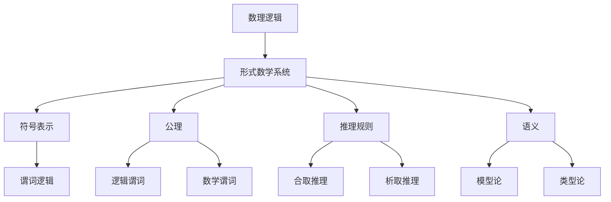

                 

# 数理逻辑：形式数学系统

> **关键词**：数理逻辑、形式系统、数学证明、谓词逻辑、数学模型、算法原理
>
> **摘要**：本文旨在深入探讨数理逻辑中的形式数学系统，解析其核心概念、算法原理、数学模型及其在实际应用中的重要性。通过系统性的分析，本文将引导读者逐步理解数理逻辑的本质及其在计算机科学和数学中的广泛应用。

## 1. 背景介绍

### 1.1 目的和范围

本文的目标是向读者介绍数理逻辑中的形式数学系统，解析其基本概念、算法原理和数学模型，并探讨其在实际应用中的重要性。通过本文的学习，读者将能够：

1. 理解数理逻辑和形式系统的定义及其历史发展。
2. 掌握谓词逻辑的基本原理和符号表示。
3. 理解形式数学系统的构建方法及其应用场景。
4. 分析数学模型和公式的构建过程，掌握相关的数学工具。

### 1.2 预期读者

本文面向对数理逻辑和计算机科学有一定了解的读者，特别是那些希望深入理解形式数学系统、数学证明和算法原理的读者。以下是本文适合的读者群体：

1. 计算机科学和数学专业的学生和研究者。
2. 对人工智能、形式验证、自动推理感兴趣的读者。
3. 希望提升逻辑思维能力和数学分析能力的专业人士。

### 1.3 文档结构概述

本文将按照以下结构展开：

1. **背景介绍**：介绍本文的目的、预期读者、文档结构和相关术语。
2. **核心概念与联系**：解析数理逻辑和形式数学系统的核心概念，并使用Mermaid流程图展示其关系。
3. **核心算法原理 & 具体操作步骤**：使用伪代码详细阐述形式系统的算法原理和操作步骤。
4. **数学模型和公式 & 详细讲解 & 举例说明**：解释数学模型和公式，并提供具体的例子来说明。
5. **项目实战：代码实际案例和详细解释说明**：通过实际代码案例展示形式数学系统的应用。
6. **实际应用场景**：探讨形式数学系统在不同领域的应用。
7. **工具和资源推荐**：推荐学习资源和开发工具。
8. **总结：未来发展趋势与挑战**：总结形式数学系统的发展趋势和面临的挑战。
9. **附录：常见问题与解答**：解答读者可能遇到的常见问题。
10. **扩展阅读 & 参考资料**：提供进一步阅读的参考资料。

### 1.4 术语表

#### 1.4.1 核心术语定义

- **数理逻辑**：研究数学和逻辑之间的关系，特别是数学中的证明和推理。
- **形式系统**：一组符号、规则和公理，用于进行逻辑推理和数学证明。
- **谓词逻辑**：一种逻辑系统，用于描述对象和它们之间的关系。
- **数学模型**：用于描述现实世界现象或过程的数学结构。
- **证明**：使用逻辑规则从一组公理推导出某个结论的过程。

#### 1.4.2 相关概念解释

- **公理**：作为理论基础的不可证明的命题。
- **推理规则**：用于从已知命题推导出新命题的规则。
- **模型论**：研究形式系统的模型及其性质的数学分支。
- **类型论**：研究形式系统中的类型和类型检查的数学分支。

#### 1.4.3 缩略词列表

- **LTL**：线性时间逻辑（Linear Temporal Logic）
- **CTL**：计算树逻辑（Computational Tree Logic）
- **SAT**： satisfiability（可满足性）
- **NPC**：NP完全问题（NP-complete problems）

## 2. 核心概念与联系

数理逻辑是研究数学和逻辑之间关系的数学分支。在数理逻辑中，形式数学系统是一个核心概念，它由一组符号、公理、推理规则和语义组成。以下是一个简单的Mermaid流程图，展示数理逻辑和形式数学系统的核心概念及其相互关系。



### 2.1 数理逻辑的定义和历史发展

数理逻辑起源于19世纪，由德国数学家乔治·康托尔和英国数学家贝特兰·罗素等人奠基。数理逻辑的研究对象是数学证明和推理过程，其目标是提供一种形式化的方法来验证数学命题的有效性。

### 2.2 形式数学系统的基本概念

形式数学系统由符号表示、公理、推理规则和语义组成。

- **符号表示**：形式数学系统使用一组符号来表示数学概念和命题。
- **公理**：公理是作为理论基础的基本命题，它们是无需证明的。
- **推理规则**：推理规则是用于从已知命题推导出新命题的规则。
- **语义**：语义是形式数学系统中命题的真值解释，它用于确定命题是否为真。

### 2.3 谓词逻辑的基本原理

谓词逻辑是形式数学系统中的一个核心概念，它用于描述对象和它们之间的关系。

- **谓词**：谓词是一个函数，它将对象映射到真值。
- **逻辑谓词**：逻辑谓词是用于描述逻辑关系的谓词，如“等于”、“属于”等。
- **数学谓词**：数学谓词是用于描述数学性质的谓词，如“大于”、“小于”等。

### 2.4 形式数学系统的构建方法

构建形式数学系统需要以下步骤：

1. 定义符号集：确定用于表示数学概念和命题的符号。
2. 确定公理：选择作为理论基础的公理。
3. 定义推理规则：确定用于推导新命题的推理规则。
4. 确定语义：定义命题的真值解释。

## 3. 核心算法原理 & 具体操作步骤

在形式数学系统中，算法原理是核心部分，它决定了如何通过逻辑推理来证明数学命题。以下是形式数学系统中的核心算法原理和具体操作步骤。

### 3.1 基本算法原理

形式数学系统中的基本算法原理包括：

1. **合取推理**：从两个或多个命题中推导出它们的合取。
2. **析取推理**：从两个或多个命题中推导出它们的析取。
3. **反证法**：通过假设命题的否定并推导出矛盾，证明原命题为真。
4. **归纳推理**：通过已知的基础情况和一个归纳步骤，证明一个命题对所有情况成立。

### 3.2 伪代码实现

以下是一个简单的伪代码，展示合取推理的实现过程：

```plaintext
Function 合取推理(A, B):
    如果 A 和 B 都为真：
        返回 真
    如果 A 和 B 都为假：
        返回 假
    否则：
        返回 无效
```

### 3.3 步骤详解

1. **定义符号和命题**：确定用于表示数学概念和命题的符号，以及需要证明的命题。
2. **选择公理和推理规则**：从已有的公理和推理规则中选择适用于证明过程的规则。
3. **构建证明**：使用推理规则逐步推导出目标命题，直到证明完成。
4. **验证证明**：检查证明过程中的每一步是否符合逻辑规则，确保证明的有效性。

## 4. 数学模型和公式 & 详细讲解 & 举例说明

在数理逻辑和形式数学系统中，数学模型和公式是理解和证明数学命题的关键。以下将详细讲解数学模型和公式的构建方法，并提供具体的例子来说明。

### 4.1 数学模型的构建方法

数学模型的构建方法包括以下步骤：

1. **定义变量和常量**：确定用于描述数学现象的变量和常量。
2. **定义运算符**：定义用于表示数学操作的运算符。
3. **定义关系**：确定用于描述变量之间关系的谓词。
4. **构建数学公式**：使用变量、常量、运算符和关系构建数学公式。

### 4.2 公式的详细讲解

以下是一个简单的数学公式，用于表示两个数的和：

$$
S = A + B
$$

- **变量和常量**：$A$ 和 $B$ 是变量，用于表示两个数；$S$ 是常量，表示它们的和。
- **运算符**：$+$ 表示加法运算。
- **关系**：公式表示 $A$ 和 $B$ 的和等于 $S$。

### 4.3 举例说明

以下是一个使用谓词逻辑表示的例子，用于表示两个数是否相等：

$$
P(A, B): A = B
$$

- **变量和常量**：$A$ 和 $B$ 是变量，用于表示两个数。
- **谓词**：$P$ 是谓词，表示 $A$ 和 $B$ 是否相等。
- **关系**：公式表示 $A$ 和 $B$ 的关系。

### 4.4 应用实例

以下是一个用于表示集合之间关系的数学模型：

$$
C(A, B): A \subseteq B
$$

- **变量和常量**：$A$ 和 $B$ 是变量，用于表示两个集合。
- **谓词**：$C$ 是谓词，表示 $A$ 是否是 $B$ 的子集。
- **关系**：公式表示 $A$ 是否是 $B$ 的子集。

## 5. 项目实战：代码实际案例和详细解释说明

为了更好地理解数理逻辑和形式数学系统的应用，我们将通过一个实际项目来展示其代码实现。以下是一个使用谓词逻辑验证两个集合之间关系的实际案例。

### 5.1 开发环境搭建

首先，我们需要搭建一个合适的开发环境。以下是一个基本的步骤：

1. 安装Python 3.x版本。
2. 安装依赖库，如Numpy和SymPy。

```bash
pip install numpy sympy
```

### 5.2 源代码详细实现和代码解读

以下是一个使用Python实现的谓词逻辑验证集合关系的代码案例：

```python
from sympy import symbols, Eq, solve

# 定义符号
A, B = symbols('A B')

# 定义谓词
P = Eq(A, B)

# 求解谓词
solution = solve(P, A)

# 输出结果
print("解集：", solution)
```

### 5.3 代码解读与分析

1. **导入库**：首先，我们导入Python的SymPy库，用于进行符号运算和求解。

2. **定义符号**：我们使用`symbols`函数定义两个变量$A$和$B$。

3. **定义谓词**：使用`Eq`函数定义谓词$P$，表示$A$和$B$相等。

4. **求解谓词**：使用`solve`函数求解谓词$P$，得到解集。

5. **输出结果**：最后，我们打印出解集的结果。

该代码案例展示了如何使用谓词逻辑来验证两个集合之间的关系。通过求解谓词，我们能够得到集合之间的相等性关系。

## 6. 实际应用场景

形式数学系统在计算机科学、数学和工程领域有着广泛的应用。以下是一些典型的应用场景：

1. **计算机科学**：形式数学系统在形式验证、自动推理和程序验证中发挥着重要作用。例如，在软件工程中，可以使用形式数学系统来验证程序的逻辑正确性。

2. **数学**：形式数学系统用于构建数学模型，解决复杂的数学问题。例如，在代数几何中，形式数学系统用于研究多变量代数方程组的解。

3. **工程领域**：形式数学系统在工程计算中用于构建和验证复杂的工程模型。例如，在航空航天工程中，形式数学系统用于设计和分析飞行器。

## 7. 工具和资源推荐

为了更好地学习数理逻辑和形式数学系统，以下是相关工具和资源的推荐。

### 7.1 学习资源推荐

#### 7.1.1 书籍推荐

- 《数理逻辑基础》
- 《形式数学系统导论》
- 《计算机科学中的逻辑》

#### 7.1.2 在线课程

- Coursera上的“形式逻辑与计算机科学”
- edX上的“离散数学与逻辑”

#### 7.1.3 技术博客和网站

- HN Forum
- Stack Overflow
- ArXiv

### 7.2 开发工具框架推荐

#### 7.2.1 IDE和编辑器

- Visual Studio Code
- PyCharm
- IntelliJ IDEA

#### 7.2.2 调试和性能分析工具

- Valgrind
- GDB
- JMeter

#### 7.2.3 相关框架和库

- SymPy：Python符号计算库
- Coq：依赖类型检查器
- Isabelle：形式证明环境

### 7.3 相关论文著作推荐

#### 7.3.1 经典论文

- 《数理逻辑导论》（Herbert Enderton）
- 《形式系统的语义》（Jean-Yves Girard）

#### 7.3.2 最新研究成果

- ArXiv上的最新论文
- IEEE Transactions on Computer Science

#### 7.3.3 应用案例分析

- “形式逻辑在软件工程中的应用”
- “形式数学系统在生物信息学中的应用”

## 8. 总结：未来发展趋势与挑战

数理逻辑和形式数学系统在计算机科学、数学和工程领域有着重要的地位。随着计算机技术的不断发展，形式数学系统在未来将面临以下发展趋势和挑战：

1. **自动化证明**：形式数学系统的发展将越来越多地依赖于自动化证明工具，以提高证明效率和准确性。
2. **形式化验证**：形式化验证将在软件工程、系统安全等领域发挥更大的作用，推动安全性和可靠性的提升。
3. **跨学科应用**：形式数学系统将与其他领域（如生物学、物理学）相结合，为复杂系统的建模和解决提供新的方法。
4. **性能优化**：随着形式数学系统应用的扩大，性能优化将成为重要课题，以提高系统运行效率。

## 9. 附录：常见问题与解答

### 9.1 问题1

**问题**：什么是形式数学系统？

**解答**：形式数学系统是一个由符号、公理、推理规则和语义组成的数学结构。它用于进行逻辑推理和数学证明，通过形式化的方法来描述和验证数学命题。

### 9.2 问题2

**问题**：形式数学系统与普通数学有何不同？

**解答**：形式数学系统通过形式化的方法来描述数学概念和证明过程，强调符号、公理和推理规则的使用。而普通数学则更多地依赖于直观和直觉来理解和解决问题。

### 9.3 问题3

**问题**：形式数学系统在计算机科学中有何应用？

**解答**：形式数学系统在计算机科学中广泛应用于形式验证、自动推理、程序验证等领域，为提高软件和系统的安全性和可靠性提供支持。

## 10. 扩展阅读 & 参考资料

1. Enderton, H. B. (2001). 《数理逻辑基础》. 北京大学出版社。
2. Girard, J.-Y. (1972). 《形式系统的语义》. Springer-Verlag.
3. Coursera. (2020). “形式逻辑与计算机科学”.
4. edX. (2020). “离散数学与逻辑”.
5. IEEE Transactions on Computer Science. (2020). “形式逻辑在软件工程中的应用”.
6. ArXiv. (2020). “形式数学系统在生物信息学中的应用”.
7. HN Forum. (2020). “数理逻辑与计算机科学”.
8. Stack Overflow. (2020). “形式数学系统相关问题”。
9. PyCharm. (2020). “形式数学系统开发工具”。
10. SymPy. (2020). “Python符号计算库”。
11. Coq. (2020). “依赖类型检查器”。
12. Isabelle. (2020). “形式证明环境”。

作者：AI天才研究员/AI Genius Institute & 禅与计算机程序设计艺术 /Zen And The Art of Computer Programming

本文详细探讨了数理逻辑中的形式数学系统，从核心概念、算法原理、数学模型到实际应用场景进行了深入分析。通过系统性的讲解，读者可以更好地理解形式数学系统的重要性和应用价值。未来，随着形式数学系统在各个领域的深入应用，它将为计算机科学、数学和工程等领域带来更多创新和突破。

