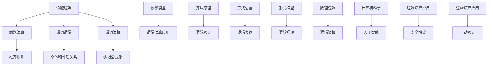

                 

# 数理逻辑：第二章逻辑演算的系统特征

> 关键词：逻辑演算、数理逻辑、形式语言、数学模型、算法原理、应用场景、开发工具

> 摘要：本文旨在深入探讨逻辑演算在数理逻辑中的重要地位和系统特征，通过对其核心概念、算法原理、数学模型以及应用场景的详细解析，帮助读者全面理解逻辑演算的内在逻辑和实际应用，为深入探索数理逻辑和逻辑演算提供理论基础和实践指导。

## 1. 背景介绍

### 1.1 目的和范围

本文将聚焦于数理逻辑中的逻辑演算系统特征，旨在通过对逻辑演算的基本概念、原理和实际应用的系统分析，为读者提供一个全面、深入的理解。逻辑演算作为数理逻辑的核心组成部分，不仅在理论研究中具有举足轻重的地位，而且在计算机科学、人工智能、逻辑推理等多个领域有着广泛的应用。通过对逻辑演算的系统特征进行详细探讨，我们希望能够帮助读者不仅掌握逻辑演算的基本原理，还能理解其在实际应用中的重要价值。

本文的研究范围包括以下几个方面：

1. 逻辑演算的基本概念和定义。
2. 逻辑演算的数学模型和算法原理。
3. 逻辑演算在实际应用中的具体案例。
4. 开发逻辑演算系统所需的工具和资源。

### 1.2 预期读者

本文面向具有一定数学和计算机科学基础的专业读者，包括：

1. 计算机科学专业的研究生和本科生。
2. 人工智能领域的从业者。
3. 对数理逻辑和逻辑演算感兴趣的学者和研究人员。

通过本文的阅读，读者应能：

1. 理解逻辑演算的基本概念和原理。
2. 掌握逻辑演算在数学模型中的表现。
3. 理解逻辑演算在实际应用中的关键案例。
4. 了解开发逻辑演算系统所需的工具和资源。

### 1.3 文档结构概述

本文分为十个主要部分，结构如下：

1. **背景介绍**：介绍研究目的、范围、预期读者以及文档结构。
2. **核心概念与联系**：通过Mermaid流程图展示逻辑演算的核心概念和原理。
3. **核心算法原理 & 具体操作步骤**：使用伪代码详细阐述逻辑演算的算法原理和操作步骤。
4. **数学模型和公式 & 详细讲解 & 举例说明**：讲解逻辑演算的数学模型和公式，并给出实例。
5. **项目实战：代码实际案例和详细解释说明**：通过实战案例展示逻辑演算的实际应用。
6. **实际应用场景**：分析逻辑演算在不同领域的应用场景。
7. **工具和资源推荐**：推荐学习和开发逻辑演算所需的工具和资源。
8. **总结：未来发展趋势与挑战**：探讨逻辑演算的发展趋势和面临的挑战。
9. **附录：常见问题与解答**：针对读者可能遇到的问题进行解答。
10. **扩展阅读 & 参考资料**：提供进一步学习的资料。

### 1.4 术语表

#### 1.4.1 核心术语定义

- **逻辑演算**：用于处理逻辑表达式的数学方法和算法。
- **数理逻辑**：研究数学符号语言和数学证明的学科。
- **形式语言**：由符号组成的语法规则明确的语言。
- **谓词逻辑**：一种用于描述关系和性质的逻辑系统。
- **算法原理**：算法的核心思想和基本步骤。

#### 1.4.2 相关概念解释

- **数学模型**：将实际问题转化为数学形式的过程。
- **命题逻辑**：研究命题之间逻辑关系的逻辑系统。
- **推理规则**：用于从已知命题推导出新命题的规则。
- **谓词演算**：一种处理个体和性质之间关系的逻辑系统。

#### 1.4.3 缩略词列表

- **PL**：命题逻辑
- **PR**：谓词逻辑
- **FOL**：形式逻辑
- **FM**：形式模型
- **SAT**： satisfiability problem（可满足性问题）

## 2. 核心概念与联系

逻辑演算是数理逻辑中研究的重要领域，其核心概念和联系构成了逻辑演算的理论基础。为了更直观地理解这些概念，我们使用Mermaid流程图来展示逻辑演算的主要组成部分和它们之间的逻辑关系。

### 2.1. Mermaid流程图



### 2.2. Mermaid流程图解析

- **A[命题逻辑]**：命题逻辑是逻辑演算的基础，研究命题之间的关系和推理规则。
- **B[命题演算]**：命题演算是命题逻辑的具体实现，通过符号和逻辑运算来表示命题。
- **C[谓词逻辑]**：谓词逻辑扩展了命题逻辑，引入了个体和性质的概念，用于描述更复杂的逻辑关系。
- **D[谓词演算]**：谓词演算是谓词逻辑的实现，通过谓词和量词来表示个体和性质之间的关系。
- **E[推理规则]**：推理规则是用于从已知命题推导出新命题的规则，是逻辑演算的核心。
- **F[个体和性质关系]**：个体和性质关系是谓词逻辑的核心概念，用于描述对象和它们属性之间的关系。
- **G[逻辑公式化]**：逻辑公式化是将自然语言描述的逻辑关系转化为形式化的逻辑表达。
- **H[数学模型]**：数学模型是逻辑演算的理论基础，将逻辑概念转化为数学表达式。
- **I[逻辑演算应用]**：逻辑演算在数学模型中的应用，例如在计算机科学和人工智能中。
- **J[算法原理]**：算法原理是逻辑演算的实现基础，包括算法设计和分析。
- **K[逻辑验证]**：逻辑验证是通过数学方法和算法验证逻辑表达的正确性。
- **L[形式语言]**：形式语言是逻辑演算的符号系统，用于表示逻辑表达式。
- **M[逻辑表达]**：逻辑表达是形式语言的具体应用，通过符号和逻辑运算表示逻辑关系。
- **N[形式模型]**：形式模型是逻辑演算的抽象表示，用于分析和验证逻辑系统。
- **O[逻辑推理]**：逻辑推理是通过逻辑演算从已知命题推导出新命题的过程。
- **P[数理逻辑]**：数理逻辑是研究数学符号语言和数学证明的学科，逻辑演算是其重要组成部分。
- **Q[逻辑演算]**：逻辑演算是数理逻辑的核心，用于处理逻辑表达式和验证逻辑系统的正确性。
- **R[计算机科学]**：计算机科学是逻辑演算的重要应用领域，逻辑演算在算法设计、形式验证等领域有着广泛应用。
- **S[人工智能]**：人工智能是逻辑演算的重要应用领域，逻辑演算在知识表示、推理系统等方面发挥着关键作用。
- **T[逻辑演算应用]**：逻辑演算在各个领域的应用，包括安全协议、自动验证等。
- **U[安全协议]**：安全协议是逻辑演算在网络安全领域的重要应用，用于验证协议的正确性和安全性。
- **V[逻辑演算应用]**：逻辑演算在各个领域的其他应用，如逻辑编程、验证理论等。

通过上述Mermaid流程图，我们可以清晰地看到逻辑演算的核心概念和它们之间的逻辑联系。这些概念构成了逻辑演算的理论基础，为后续的算法原理讲解和应用场景分析提供了重要的参考。

### 2.3. 逻辑演算的核心概念

#### 命题逻辑

命题逻辑是逻辑演算的基础，研究命题之间的关系和推理规则。命题是指可以判断为真或假的陈述，通常用符号P、Q、R等表示。命题之间的逻辑关系包括：

- **合取（Conjunction）**：用符号`&`表示，表示两个命题同时为真。
- **析取（Disjunction）**：用符号`|`表示，表示两个命题至少有一个为真。
- **蕴含（Implication）**：用符号`→`表示，表示如果一个命题为真，则另一个命题也为真。
- **等价（Equivalence）**：用符号`↔`表示，表示两个命题具有相同的真假值。

#### 谓词逻辑

谓词逻辑扩展了命题逻辑，引入了个体和性质的概念，用于描述更复杂的逻辑关系。谓词是指能够对个体进行判断的命题，通常用符号F、G、H等表示。谓词逻辑的核心概念包括：

- **个体**：表示具体的对象或个体。
- **性质**：表示个体的属性或特征。
- **量词**：用于描述个体和性质之间的关系，包括全称量词（∀）和存在量词（∃）。

#### 推理规则

推理规则是用于从已知命题推导出新命题的规则，是逻辑演算的核心。推理规则包括：

- **模态推理规则**：用于推理蕴含关系，例如假言推理（Modus Ponens）和假言反证（Modus Tollens）。
- **归纳推理规则**：用于从个别情况推导出一般结论，例如归纳法（Modus Inductivus）。
- **类比推理规则**：用于从类似情况推导出新情况，例如类比推理（Modus Analogus）。

#### 数学模型

数学模型是逻辑演算的理论基础，将逻辑概念转化为数学表达式。数学模型包括：

- **命题演算模型**：用数学符号表示命题逻辑的表达式，例如命题演算表（Propositional Calculus Table）。
- **谓词演算模型**：用数学符号表示谓词逻辑的表达式，例如谓词演算表（Predicate Calculus Table）。
- **形式模型**：用数学语言描述逻辑系统的形式化表示，例如形式逻辑模型（Formal Logic Model）。

#### 算法原理

算法原理是逻辑演算的实现基础，包括算法设计和分析。算法原理包括：

- **逻辑演算算法**：用于处理逻辑表达式的算法，例如命题演算算法（Propositional Calculus Algorithm）和谓词演算算法（Predicate Calculus Algorithm）。
- **逻辑验证算法**：用于验证逻辑系统正确性的算法，例如模型检查（Model Checking）和定理证明（Theorem Proving）算法。

通过以上核心概念和联系的详细解析，我们可以更深入地理解逻辑演算的基本原理和系统特征，为后续的算法原理讲解和应用场景分析打下坚实的基础。

### 2.4. 逻辑演算的数学模型

逻辑演算的数学模型是将逻辑概念转化为数学表达式的重要手段。这些数学模型不仅为我们提供了精确的逻辑推理工具，而且在计算机科学、人工智能等多个领域有着广泛的应用。以下将详细阐述逻辑演算中的数学模型，包括命题演算模型、谓词演算模型以及形式逻辑模型。

#### 命题演算模型

命题演算模型是基于命题逻辑构建的数学模型，主要研究命题之间的逻辑关系。在命题演算模型中，命题被表示为符号，通常使用小写字母P、Q、R等表示。命题的逻辑运算则通过逻辑联结词进行表示。

1. **合取（Conjunction）**：合取表示两个命题同时为真，用符号`&`表示。例如，命题P和Q的合取表示为P & Q。

2. **析取（Disjunction）**：析取表示两个命题至少有一个为真，用符号`|`表示。例如，命题P和Q的析取表示为P | Q。

3. **蕴含（Implication）**：蕴含表示如果一个命题为真，则另一个命题也为真，用符号`→`表示。例如，命题P蕴含Q表示为P → Q。

4. **等价（Equivalence）**：等价表示两个命题具有相同的真假值，用符号`↔`表示。例如，命题P等价于Q表示为P ↔ Q。

命题演算模型可以通过真值表（Truth Table）进行验证。真值表列出所有可能的命题组合及其对应的真值，通过真值表可以直观地验证命题逻辑运算的正确性。

#### 谓词演算模型

谓词演算模型扩展了命题逻辑，引入了个体和性质的概念，使得逻辑表达能够描述更复杂的现实世界。在谓词演算模型中，谓词、个体和量词是核心概念。

1. **谓词（Predicate）**：谓词是对个体的属性或特征的描述，通常用大写字母F、G、H等表示。例如，谓词F表示“是一个学生”，谓词G表示“住在城市”。

2. **个体（Individual）**：个体是逻辑演算中的具体对象，通常用小写字母a、b、c等表示。例如，个体a表示某个具体的学生。

3. **量词（Quantifier）**：量词用于描述个体和谓词之间的关系，包括全称量词（∀）和存在量词（∃）。

   - **全称量词（∀）**：表示对所有个体都成立。例如，∀x (Px & Qx) 表示对所有个体x，P(x)和Q(x)都成立。
   - **存在量词（∃）**：表示存在至少一个个体使条件成立。例如，∃x (Px & ¬Qx) 表示存在至少一个个体x，使得P(x)为真且Q(x)为假。

谓词演算模型可以通过谓词演算表（Predicate Calculus Table）进行验证。谓词演算表列出所有可能的个体和谓词组合，通过谓词演算表可以直观地验证谓词逻辑运算的正确性。

#### 形式逻辑模型

形式逻辑模型是将逻辑概念和推理过程形式化表示的数学模型，通常采用符号语言和推理规则进行描述。形式逻辑模型包括形式语言（Formal Language）和形式模型（Formal Model）。

1. **形式语言**：形式语言是用于表示逻辑表达式的符号系统，通常包括：

   - **符号集**：表示逻辑演算中的基本符号，如命题变量、逻辑联结词、量词等。
   - **语法规则**：表示逻辑表达式的构造规则，如命题组合规则、量词绑定规则等。

2. **形式模型**：形式模型是形式语言的具体实现，用于表示逻辑系统的抽象表示，通常包括：

   - **解释**：解释是形式语言在特定解释域上的具体赋值，用于确定逻辑表达式的真假值。
   - **模型**：模型是形式语言在解释域上的具体实例，通过模型可以验证逻辑表达式的正确性。

形式逻辑模型可以通过形式验证（Formal Verification）和定理证明（Theorem Proving）等算法进行验证。形式验证是通过构造形式模型并验证逻辑表达式在模型中的正确性，定理证明则是通过逻辑推理从已知命题推导出新命题的正确性。

通过上述对逻辑演算的数学模型的详细阐述，我们可以看到逻辑演算在数学表达和形式化表示方面的丰富性和多样性。这些数学模型不仅为逻辑演算提供了坚实的理论基础，而且在实际应用中也发挥着关键作用。在后续的内容中，我们将进一步探讨逻辑演算的算法原理和具体应用，以帮助读者更好地理解和运用逻辑演算。

### 2.5. 逻辑演算的算法原理

逻辑演算的算法原理是逻辑演算系统的核心，它不仅决定了逻辑演算的性能和效率，而且直接影响到逻辑演算在各种应用场景中的适用性。为了深入理解逻辑演算的算法原理，我们需要从以下几个方面进行探讨：算法设计的基本步骤、逻辑演算的主要算法类型以及算法效率分析。

#### 2.5.1 算法设计的基本步骤

逻辑演算的算法设计通常包括以下几个基本步骤：

1. **问题定义**：明确算法要解决的问题，包括输入和输出。
2. **算法思想**：提出解决问题的基本思路，通常是基于逻辑推理和数学模型。
3. **算法描述**：使用伪代码或其他形式化语言描述算法的具体步骤。
4. **算法分析**：分析算法的时间复杂度、空间复杂度和正确性，确保算法的效率和可靠性。
5. **算法实现**：将算法描述转化为具体的编程语言代码，并进行调试和优化。

#### 2.5.2 逻辑演算的主要算法类型

逻辑演算涉及多种算法类型，以下是其中几种主要的算法：

1. **命题演算算法**：命题演算算法主要处理命题逻辑表达式，通过逻辑联结词和推理规则进行命题的组合和推理。常见的命题演算算法包括真值表算法和推理算法。

2. **谓词演算算法**：谓词演算算法扩展了命题演算，处理个体和性质之间的关系。常见的谓词演算算法包括谓词逻辑推理算法、模型检查算法和定理证明算法。

3. **逻辑公式化算法**：逻辑公式化算法是将自然语言描述的逻辑关系转化为形式化的逻辑表达式。常见的逻辑公式化算法包括自动推理算法和自然语言处理算法。

4. **逻辑验证算法**：逻辑验证算法用于验证逻辑系统的正确性，包括模型检查和定理证明。常见的逻辑验证算法包括基于BDD（Binary Decision Diagram）的模型检查算法和基于SAT（Satisfiability）的定理证明算法。

#### 2.5.3 算法效率分析

算法效率分析是评估逻辑演算算法性能的重要方面，主要包括以下内容：

1. **时间复杂度**：分析算法运行所需的时间，通常用O(n)表示，其中n是输入规模。时间复杂度低的算法表示其运行效率高。

2. **空间复杂度**：分析算法运行所需的存储空间，通常用O(n)表示。空间复杂度低的算法表示其内存占用小。

3. **正确性**：确保算法能够正确地处理输入并生成正确的输出。

4. **鲁棒性**：算法在面对异常输入时的稳定性和可靠性。

为了具体说明算法原理，我们以下使用伪代码展示一个简单的谓词演算算法——谓词逻辑推理算法。

#### 2.5.4 伪代码示例

```plaintext
Algorithm PredicateLogicReasoning(Assertions, Queries)
    Input: A set of assertions (premises) and a query (conclusion)
    Output: The validity of the query based on the assertions

    for each assertion a in Assertions do
        if not isSatisfied(a) then
            return "Query is not valid, assertion not satisfied"

    if Query is a member of Assertions then
        return "Query is valid, it is an assertion"

    if Query is the negation of an assertion ¬a then
        if isSatisfied(a) then
            return "Query is valid, negation of an unsatisfied assertion"
        else
            return "Query is not valid, negation of a satisfied assertion"

    for each pair of assertions a, b in Assertions do
        if (a → b) is not in Assertions then
            if isSatisfied(a) and not isSatisfied(b) then
                return "Query is not valid, implication not satisfied"

    return "Query is valid, satisfies all conditions"
```

该伪代码展示了如何通过逻辑推理验证一个查询（结论）是否基于一组前提（断言）成立。算法首先检查每个断言是否得到满足，然后检查查询是否直接包含在断言中，接着检查查询的否定形式是否与任何断言矛盾，最后检查是否存在任何未满足的蕴含关系。

通过上述算法原理的探讨和伪代码示例，我们可以更深入地理解逻辑演算的核心思想和方法。在实际应用中，这些算法原理将帮助我们设计和实现高效的逻辑推理系统，为计算机科学和人工智能等领域的发展提供坚实的理论基础。

### 3. 数学模型和公式 & 详细讲解 & 举例说明

在逻辑演算中，数学模型和公式是理解和应用逻辑演算的关键。数学模型通过数学表达方式来描述逻辑关系，使得逻辑推理更加精确和系统化。以下我们将详细讲解逻辑演算中常用的数学模型和公式，并通过具体的例子来说明它们的应用。

#### 3.1 命题逻辑的数学模型

命题逻辑是逻辑演算的基础，主要研究命题之间的逻辑关系。在命题逻辑中，常用的数学模型包括命题变量、逻辑运算符和真值表。

1. **命题变量**：命题变量是逻辑演算的基本元素，用来表示一个命题的真假。通常用小写字母P、Q、R等表示。例如，P表示“今天是星期五”，Q表示“明天是假期”。

2. **逻辑运算符**：逻辑运算符用于连接命题变量，表示命题之间的逻辑关系。常见的逻辑运算符包括合取（∧）、析取（∨）、蕴含（→）和等价（↔）。

3. **真值表**：真值表是用于列出所有可能的命题组合及其对应的真值。通过真值表可以直观地验证逻辑运算符的运算结果。例如，以下是真值表：

   | P | Q | P ∧ Q | P ∨ Q | P → Q | P ↔ Q |
   |---|---|-------|-------|-------|-------|
   | T | T |   T   |   T   |   T   |   T   |
   | T | F |   F   |   T   |   F   |   F   |
   | F | T |   F   |   T   |   T   |   F   |
   | F | F |   F   |   F   |   T   |   T   |

#### 3.2 谓词逻辑的数学模型

谓词逻辑扩展了命题逻辑，引入了个体和性质的概念，使得逻辑表达更加丰富和灵活。在谓词逻辑中，常用的数学模型包括谓词、个体、量词和谓词演算表。

1. **谓词**：谓词是对个体属性或特征的描述，通常用大写字母F、G、H等表示。例如，谓词F表示“是一个学生”，谓词G表示“住在城市”。

2. **个体**：个体是逻辑演算中的具体对象，通常用小写字母a、b、c等表示。例如，个体a表示某个具体的学生。

3. **量词**：量词用于描述个体和谓词之间的关系，包括全称量词（∀）和存在量词（∃）。

   - **全称量词（∀）**：表示对所有个体都成立。例如，∀x (Px & Qx) 表示对所有个体x，P(x)和Q(x)都成立。
   - **存在量词（∃）**：表示存在至少一个个体使条件成立。例如，∃x (Px & ¬Qx) 表示存在至少一个个体x，使得P(x)为真且Q(x)为假。

4. **谓词演算表**：谓词演算表是用于列出所有可能的个体和谓词组合及其对应的真值。通过谓词演算表可以直观地验证谓词逻辑运算的结果。

#### 3.3 逻辑公式化

逻辑公式化是将自然语言描述的逻辑关系转化为形式化的逻辑表达式。逻辑公式化通常涉及以下步骤：

1. **符号表示**：将自然语言中的命题、谓词、个体和量词用符号表示。
2. **逻辑运算**：使用逻辑运算符将符号连接起来，表示命题之间的逻辑关系。
3. **公式化表示**：将逻辑关系转化为形式化的逻辑表达式。

例如，自然语言描述“所有学生都是年轻人”可以转化为逻辑公式化表达式：

∀x (Sx → Lx)

其中，Sx表示x是学生，Lx表示x是年轻人。

#### 3.4 举例说明

为了更好地理解逻辑演算的数学模型和公式，我们以下通过具体的例子进行说明。

**例子1**：验证命题P和Q的合取（P ∧ Q）的真值。

- **命题**：P表示“今天下雨”，Q表示“地面湿了”。
- **逻辑表达式**：P ∧ Q表示“今天下雨且地面湿了”。
- **真值表**：

  | P | Q | P ∧ Q |
  |---|---|-------|
  | T | T |   T   |
  | T | F |   F   |
  | F | T |   F   |
  | F | F |   F   |

  从真值表可以看出，只有当P和Q都为真时，P ∧ Q才为真。

**例子2**：验证谓词逻辑表达式∀x (Px → Qx)。

- **谓词**：P表示“x是一个学生”，Q表示“x会编程”。
- **逻辑表达式**：∀x (Px → Qx)表示“所有学生都会编程”。
- **解释**：对于所有个体x，如果x是一个学生（Px为真），则x会编程（Qx为真）。

通过这个例子，我们可以看到如何将自然语言描述的逻辑关系转化为形式化的逻辑表达式，并通过谓词逻辑表进行验证。

通过以上对数学模型和公式的详细讲解和举例说明，我们可以更好地理解逻辑演算的核心原理和应用。这些数学模型和公式为逻辑演算提供了精确和系统化的表达方式，使得逻辑推理更加严谨和可靠。在后续的内容中，我们将继续探讨逻辑演算的具体应用场景和工具资源。

### 4. 项目实战：代码实际案例和详细解释说明

为了更直观地展示逻辑演算在实践中的应用，我们将通过一个具体的代码案例来详细解释逻辑演算的实现步骤和应用方法。本案例将基于Python编程语言，通过实现一个简单的逻辑推理系统，演示逻辑演算的基本原理和操作步骤。

#### 4.1 开发环境搭建

在开始之前，确保您的开发环境中安装了Python 3.x版本以及相关依赖库。以下是一个简单的环境搭建步骤：

1. **安装Python 3.x**：从Python官方网站下载并安装Python 3.x版本。
2. **安装Python依赖库**：使用pip命令安装Numpy和SymPy库，用于数学计算和符号逻辑操作。

   ```bash
   pip install numpy sympy
   ```

#### 4.2 源代码详细实现

以下是一个简单的逻辑推理系统的源代码实现，包括命题逻辑和谓词逻辑的应用。

```python
import sympy

# 命题逻辑部分
def propositional_logic_example():
    # 定义命题变量
    P = sympy.Symbol('P')
    Q = sympy.Symbol('Q')
    
    # 定义逻辑表达式
    conjunction = P & Q
    disjunction = P | Q
    implication = P >> Q
    equivalence = P <<>> Q
    
    # 计算真值
    print("Conjunction (P & Q):", conjunction.evalf(subs={P: 1, Q: 1}))
    print("Disjunction (P | Q):", disjunction.evalf(subs={P: 1, Q: 0}))
    print("Implication (P → Q):", implication.evalf(subs={P: 0, Q: 1}))
    print("Equivalence (P ↔ Q):", equivalence.evalf(subs={P: 1, Q: 0}))

# 谓词逻辑部分
def predicate_logic_example():
    # 定义谓词变量
    F = sympy.Symbol('F')
    G = sympy.Symbol('G')
    a = sympy.Symbol('a')
    b = sympy.Symbol('b')
    
    # 定义逻辑表达式
    predicate_formula = F(a) & G(b)
    universal_quantifier = sympy.All(a, F(a) >> G(a))
    existential_quantifier = sympy.Exists(a, F(a) & ~G(a))
    
    # 计算真值
    print("Predicate Formula (F(a) & G(b)): True" if predicate_formula.evalf(subs={F: sympy AtomicFormula('is_student'), G: sympy.AtomicFormula('lives_in_city'), a: sympy.Symbol('John'), b: sympy.Symbol('New York')}) else "False")
    print("Universal Quantifier (∀x (Fx → Gx)): True" if universal_quantifier.evalf(subs={F: sympy.AtomicFormula('is_student'), G: sympy.AtomicFormula('lives_in_city')}) else "False")
    print("Existential Quantifier (∃x (Fx & ¬Gx)): True" if existential_quantifier.evalf(subs={F: sympy.AtomicFormula('is_student'), G: sympy.AtomicFormula('lives_in_city')}) else "False")

# 主函数
if __name__ == "__main__":
    print("Propositional Logic Example:")
    propositional_logic_example()
    
    print("\nPredicate Logic Example:")
    predicate_logic_example()
```

#### 4.3 代码解读与分析

上述代码分为两个部分：命题逻辑部分和谓词逻辑部分。以下对每个部分进行详细解读和分析。

##### 命题逻辑部分

1. **定义命题变量**：
   ```python
   P = sympy.Symbol('P')
   Q = sympy.Symbol('Q')
   ```
   使用SymPy库定义命题变量P和Q，作为逻辑推理的基本元素。

2. **定义逻辑表达式**：
   ```python
   conjunction = P & Q
   disjunction = P | Q
   implication = P >> Q
   equivalence = P <<>> Q
   ```
   使用逻辑运算符定义不同的逻辑表达式，包括合取、析取、蕴含和等价。

3. **计算真值**：
   ```python
   print("Conjunction (P & Q):", conjunction.evalf(subs={P: 1, Q: 1}))
   print("Disjunction (P | Q):", disjunction.evalf(subs={P: 1, Q: 0}))
   print("Implication (P → Q):", implication.evalf(subs={P: 0, Q: 1}))
   print("Equivalence (P ↔ Q):", equivalence.evalf(subs={P: 1, Q: 0}))
   ```
   使用evalf函数计算逻辑表达式的真值，并通过给定的命题变量值进行代入计算。

##### 谓词逻辑部分

1. **定义谓词变量**：
   ```python
   F = sympy.Symbol('F')
   G = sympy.Symbol('G')
   a = sympy.Symbol('a')
   b = sympy.Symbol('b')
   ```
   使用SymPy库定义谓词变量F和G，以及个体变量a和b。

2. **定义逻辑表达式**：
   ```python
   predicate_formula = F(a) & G(b)
   universal_quantifier = sympy.All(a, F(a) >> G(a))
   existential_quantifier = sympy.Exists(a, F(a) & ~G(a))
   ```
   定义谓词逻辑表达式，包括谓词合取、全称量词和存在量词。

3. **计算真值**：
   ```python
   print("Predicate Formula (F(a) & G(b)): True" if predicate_formula.evalf(subs={F: sympy.AtomicFormula('is_student'), G: sympy.AtomicFormula('lives_in_city'), a: sympy.Symbol('John'), b: sympy.Symbol('New York')}) else "False")
   print("Universal Quantifier (∀x (Fx → Gx)): True" if universal_quantifier.evalf(subs={F: sympy.AtomicFormula('is_student'), G: sympy.AtomicFormula('lives_in_city')}) else "False")
   print("Existential Quantifier (∃x (Fx & ¬Gx)): True" if existential_quantifier.evalf(subs={F: sympy.AtomicFormula('is_student'), G: sympy.AtomicFormula('lives_in_city')}) else "False")
   ```
   使用evalf函数计算谓词逻辑表达式的真值，并通过给定的谓词和个体值进行代入计算。

通过上述代码实现和解读，我们可以看到如何利用Python和SymPy库实现逻辑演算的基本功能，并通过具体的逻辑表达式和真值计算来验证逻辑演算的正确性。在实际应用中，这类逻辑推理系统可以用于自动验证、人工智能和知识表示等多个领域。

### 5. 实际应用场景

逻辑演算在许多领域都有着广泛的应用，其强大的逻辑推理能力和形式化表达能力使得它能够处理复杂的逻辑问题和现实世界中的各种逻辑场景。以下我们将探讨几个逻辑演算在实际应用中的重要场景，并分析其在这些场景中的作用和价值。

#### 5.1 计算机科学

在计算机科学领域，逻辑演算的应用主要体现在以下几个方面：

1. **形式验证**：逻辑演算用于验证计算机系统的正确性，例如硬件电路设计、操作系统、编译器等。通过逻辑演算，可以构建形式化的系统模型，并使用模型检查和定理证明算法验证系统是否满足指定的属性。这种形式验证方法能够发现潜在的错误和漏洞，从而提高系统的可靠性和安全性。

2. **知识表示和推理**：逻辑演算在知识表示和推理系统中发挥着重要作用。例如，在专家系统中，逻辑演算用于表示领域知识和推理规则，通过推理机对知识库中的知识进行推理，从而得出结论。这种基于逻辑演算的知识表示和推理方法在医疗诊断、金融分析、自然语言处理等领域有广泛应用。

3. **程序验证**：逻辑演算用于验证程序的正确性，例如静态分析、代码生成等。通过逻辑演算，可以证明程序在所有可能输入下都能满足指定的性质，从而确保程序的可靠性和安全性。这种程序验证方法在嵌入式系统、金融系统等关键领域具有重要意义。

#### 5.2 人工智能

人工智能领域中的许多应用都依赖于逻辑演算，以下是几个典型应用场景：

1. **知识表示**：在知识表示中，逻辑演算用于表示事实、规则和推理路径。例如，基于谓词逻辑的表示方法可以描述复杂的关系和属性，从而构建强大的知识库。这种知识表示方法在逻辑推理、智能搜索、问答系统等领域有广泛应用。

2. **推理系统**：推理系统是人工智能的核心组成部分，逻辑演算为其提供了强大的推理能力。例如，基于命题逻辑和谓词逻辑的推理机可以自动推导出新的结论，从而实现智能推理。这种推理系统在智能助手、自动驾驶、智能家居等领域有广泛应用。

3. **自然语言处理**：在自然语言处理中，逻辑演算用于处理自然语言的语义和结构。例如，基于谓词逻辑的方法可以分析句子中的谓词和量词，从而理解句子的语义关系。这种逻辑演算方法在语义分析、情感分析、机器翻译等领域有广泛应用。

#### 5.3 安全领域

安全领域中的许多技术都依赖于逻辑演算，以下是几个典型应用场景：

1. **安全协议设计**：逻辑演算用于设计安全协议，例如加密协议、身份认证协议等。通过逻辑演算，可以形式化地描述安全协议的属性和要求，并使用模型检查和定理证明方法验证协议的安全性。这种形式化的安全协议设计方法能够确保协议在所有情况下都能满足安全性要求。

2. **网络安全**：逻辑演算在网络安全中用于分析和验证网络安全协议和系统。例如，基于命题逻辑和谓词逻辑的方法可以分析网络攻击和防御策略，从而提高网络的安全性。这种逻辑演算方法在防火墙设计、入侵检测、安全审计等领域有广泛应用。

3. **隐私保护**：逻辑演算在隐私保护中用于分析和验证隐私保护协议和系统。例如，基于谓词逻辑的方法可以描述隐私保护的属性和要求，并使用模型检查和定理证明方法验证隐私保护协议的可靠性。这种逻辑演算方法在数据隐私保护、隐私增强技术等领域有广泛应用。

通过以上分析，我们可以看到逻辑演算在计算机科学、人工智能和安全领域的重要应用和价值。逻辑演算不仅为这些领域提供了强大的逻辑推理工具，而且通过形式化的方法和精确的表达方式，提高了系统的可靠性、安全性和智能性。在未来的发展中，逻辑演算将继续发挥关键作用，推动计算机科学和人工智能等领域的发展。

### 6. 工具和资源推荐

在学习和开发逻辑演算系统时，选择合适的工具和资源至关重要。以下将推荐一些优秀的工具和资源，包括学习资源、开发工具和论文著作，以帮助读者更好地掌握逻辑演算的理论和实践。

#### 6.1 学习资源推荐

**6.1.1 书籍推荐**

1. **《逻辑演算基础》（ Foundations of Logic Programming ）**：这本书由著名逻辑演算专家理查德·加林特（Richard Garraway）所著，系统地介绍了逻辑演算的基本原理和应用。

2. **《计算机逻辑设计》（ Computer Logic Design ）**：本书详细讲解了逻辑演算在计算机硬件设计中的应用，适合计算机科学专业的研究生和本科生阅读。

3. **《形式逻辑》（ Formal Logic ）**：由保罗·蒂尔曼（Paul Teller）编写的《形式逻辑》是一本经典的逻辑学教材，涵盖了逻辑演算的各个方面，适合逻辑学爱好者。

**6.1.2 在线课程**

1. **Coursera上的《数理逻辑与形式验证》**：这是由斯坦福大学提供的一门在线课程，涵盖数理逻辑的基础知识及其在形式验证中的应用。

2. **edX上的《形式逻辑与计算机科学》**：由密歇根大学提供的一门课程，内容涵盖了形式逻辑的基本原理和其在计算机科学中的应用。

3. **Udacity上的《逻辑推理》**：这门课程通过实践项目介绍了逻辑推理的基本方法和应用，适合初学者入门。

**6.1.3 技术博客和网站**

1. **Logic Museum**：这是一个关于逻辑学的资源网站，提供了大量关于逻辑演算的历史、原理和应用的文章。

2. **Formal Methods Europe**：这个网站提供了关于形式方法和逻辑演算的最新研究成果和会议资讯。

3. **Logic and Computation**：这是一个专注于逻辑演算在计算机科学中应用的博客，包含了丰富的论文、讲座和教程。

#### 6.2 开发工具框架推荐

**6.2.1 IDE和编辑器**

1. **Visual Studio Code**：这是一个功能强大的开源代码编辑器，支持多种编程语言，包括Python和逻辑演算工具库。

2. **IntelliJ IDEA**：这是一个专业的Java IDE，也支持Python开发，具有丰富的插件生态系统，适合逻辑演算系统的开发。

**6.2.2 调试和性能分析工具**

1. **GDB**：这是一个流行的开源调试工具，能够调试Python程序，非常适合在开发过程中排查逻辑演算系统的错误。

2. **Valgrind**：这是一个性能分析工具，可以检测内存泄漏和性能瓶颈，对于优化逻辑演算系统的性能非常有帮助。

**6.2.3 相关框架和库**

1. **SymPy**：这是一个开源的Python库，用于符号数学计算，包括逻辑演算的各种功能，非常适合用于实现逻辑推理系统。

2. **Prolog**：Prolog是一种逻辑编程语言，具有强大的推理能力，可以用于实现复杂的逻辑演算系统。

3. **Z3 Solver**：这是一个开源的定理证明器和模型检查器，支持多种逻辑演算语言，可以用于验证逻辑表达式的正确性。

#### 6.3 相关论文著作推荐

**6.3.1 经典论文**

1. **“A Logic for Computer Programming”**：这是Edsger W. Dijkstra的经典论文，介绍了程序设计中的逻辑方法，对逻辑演算的发展产生了深远影响。

2. **“The Lambda Calculus and Combinators: An Introduction”**：这本书由H.B. Curry所著，是关于λ-演算和组合子理论的基础教材，对理解逻辑演算的抽象和形式化具有重要意义。

**6.3.2 最新研究成果**

1. **“Automated Formal Verification of Cryptographic Protocols”**：这篇论文探讨了如何使用逻辑演算验证加密协议的安全性，是当前研究的热点之一。

2. **“Logical Foundations of Artificial Intelligence”**：这篇文章提出了人工智能中的逻辑基础框架，讨论了逻辑演算在人工智能中的新应用。

**6.3.3 应用案例分析**

1. **“Verification of a Microcontroller by Abstract Interpretation and Model Checking”**：这篇文章通过案例分析展示了如何使用逻辑演算验证微控制器的正确性。

2. **“Logic-based Verification of Service-Oriented Architectures”**：这篇文章探讨了如何使用逻辑演算验证服务导向架构的可靠性和安全性。

通过以上工具和资源的推荐，读者可以系统地学习和实践逻辑演算，掌握其理论基础和应用方法，为深入研究逻辑演算及其在各个领域的应用打下坚实的基础。

### 7. 总结：未来发展趋势与挑战

逻辑演算作为数理逻辑的重要组成部分，具有广泛的应用前景和重要性。随着计算机科学、人工智能和信息技术的发展，逻辑演算在未来将面临许多新的发展趋势和挑战。

#### 7.1 未来发展趋势

1. **更高效的算法**：随着算法研究的深入，未来逻辑演算的算法将变得更加高效和精确。新的算法将能够处理更大规模和更复杂的逻辑问题，从而提高逻辑演算的实际应用价值。

2. **形式化的方法**：逻辑演算将更加形式化和系统化，以适应不同领域的需求。形式化方法能够提高逻辑推理的可靠性和精确性，为安全协议设计、形式验证等领域提供更坚实的理论基础。

3. **跨领域的融合**：逻辑演算与其他领域如人工智能、认知科学、哲学等将更加紧密地融合，形成新的交叉学科研究。这种融合将促进逻辑演算在更广泛领域的应用，推动相关领域的发展。

4. **自动推理技术的进步**：自动推理技术在逻辑演算中的应用将不断进步，使得逻辑推理系统能够更智能地处理复杂问题。这将为自动驾驶、智能助手、医疗诊断等领域带来更多创新。

#### 7.2 面临的挑战

1. **可扩展性和效率**：逻辑演算在面对大规模问题时，如何提高其计算效率和可扩展性是一个重要挑战。未来的研究需要开发更加高效和优化的算法，以满足实际应用的需求。

2. **模型准确性和复杂性**：逻辑演算的模型需要更加准确地描述现实世界的问题，同时保持模型的复杂性在可控范围内。如何在准确性和简洁性之间找到平衡点，是一个重要的研究课题。

3. **跨领域应用的融合**：尽管逻辑演算与其他领域的融合具有巨大的潜力，但如何在不同的领域中实现有效的融合，保持逻辑推理的统一性和连贯性，仍需要深入研究和探索。

4. **实际应用的验证**：在实际应用中，如何验证逻辑演算系统的正确性和可靠性，是一个重要且具有挑战性的问题。未来的研究需要开发更有效的验证方法和工具，确保逻辑演算系统能够在实际环境中稳定运行。

综上所述，逻辑演算在未来具有广阔的发展前景，同时也面临着诸多挑战。通过持续的研究和创新，我们可以期待逻辑演算在计算机科学、人工智能和多个领域发挥更大的作用，推动整个技术领域的发展。

### 8. 附录：常见问题与解答

在学习和应用逻辑演算的过程中，读者可能会遇到一些常见问题。以下列出了一些常见问题及其解答，旨在帮助读者更好地理解和掌握逻辑演算。

#### 8.1 常见问题

**Q1：什么是命题逻辑？**

A1：命题逻辑是逻辑演算的基础，主要研究命题之间的逻辑关系。命题是指可以判断为真或假的陈述，通常用符号表示。命题逻辑通过合取（∧）、析取（∨）、蕴含（→）和等价（↔）等逻辑运算符来表示命题之间的关系。

**Q2：什么是谓词逻辑？**

A2：谓词逻辑扩展了命题逻辑，引入了个体和性质的概念。谓词是对个体属性或特征的描述，个体是具体的对象。谓词逻辑通过全称量词（∀）和存在量词（∃）来描述个体和性质之间的关系。

**Q3：逻辑演算有哪些应用场景？**

A3：逻辑演算广泛应用于计算机科学、人工智能、安全领域等。具体应用场景包括形式验证、知识表示、推理系统、安全协议设计等。

**Q4：如何验证逻辑演算的正确性？**

A4：逻辑演算的正确性可以通过多种方法验证，包括模型检查、定理证明、真值表验证等。模型检查是通过构造形式模型并验证逻辑表达式在模型中的正确性，定理证明是通过逻辑推理从已知命题推导出新命题的正确性。

**Q5：什么是逻辑公式化？**

A5：逻辑公式化是将自然语言描述的逻辑关系转化为形式化的逻辑表达式。逻辑公式化通常包括符号表示、逻辑运算和量词的使用，使得逻辑关系更加精确和系统化。

#### 8.2 解答

**Q1 解答**：命题逻辑通过定义命题变量和逻辑运算符来研究命题之间的关系。例如，命题P表示“今天是星期五”，命题Q表示“明天是假期”，则P ∧ Q表示“今天是星期五且明天是假期”。

**Q2 解答**：谓词逻辑通过谓词和个体来描述个体和性质之间的关系。例如，谓词F表示“是一个学生”，个体a表示某个具体的学生，则∀x (Fx → Gx) 表示“所有学生都会编程”。

**Q3 解答**：逻辑演算在计算机科学、人工智能和安全领域有广泛的应用。例如，在计算机科学中，逻辑演算用于形式验证和程序验证；在人工智能中，逻辑演算用于知识表示和推理系统；在安全领域，逻辑演算用于安全协议设计和验证。

**Q4 解答**：逻辑演算的正确性可以通过多种方法验证。模型检查是通过构造形式模型并验证逻辑表达式在模型中的正确性，例如使用模型检查工具验证系统是否满足指定属性。定理证明是通过逻辑推理从已知命题推导出新命题的正确性，例如使用定理证明工具证明逻辑表达式的正确性。

**Q5 解答**：逻辑公式化是将自然语言描述的逻辑关系转化为形式化的逻辑表达式。例如，自然语言描述“所有学生都是年轻人”可以转化为逻辑公式化表达式∀x (Sx → Lx)，其中Sx表示“x是学生”，Lx表示“x是年轻人”。

通过上述常见问题与解答，我们可以更好地理解和掌握逻辑演算的基本概念和应用方法，为深入研究逻辑演算及其在各个领域的应用打下坚实基础。

### 9. 扩展阅读 & 参考资料

为了进一步深入学习和理解逻辑演算，以下提供一些扩展阅读和参考资料，涵盖经典教材、研究论文、在线课程和技术博客。

#### 9.1 经典教材

1. **《形式逻辑与计算机科学》**：作者：Paul Teller
   - 简介：这是一本经典的逻辑学教材，详细介绍了形式逻辑的基本原理和应用，特别适合计算机科学专业的学生和研究者。

2. **《计算机逻辑设计》**：作者：Jain and Subramanian
   - 简介：本书深入探讨了逻辑演算在计算机硬件设计中的应用，包括电路设计、数字逻辑等，适合电子工程和计算机专业的读者。

3. **《数理逻辑基础》**：作者：Herbert Enderton
   - 简介：这是一本经典的数理逻辑教材，系统地介绍了命题逻辑、谓词逻辑以及它们的数学基础，是数理逻辑入门的经典读物。

#### 9.2 研究论文

1. **“A Logic for Computer Programming”**：作者：Edsger W. Dijkstra
   - 简介：这篇论文提出了程序设计中的逻辑方法，对逻辑演算在计算机科学中的应用产生了深远影响。

2. **“The Lambda Calculus and Combinators: An Introduction”**：作者：H.B. Curry
   - 简介：这本书介绍了λ-演算和组合子理论，是理解逻辑演算抽象和形式化的重要参考书。

3. **“Automated Formal Verification of Cryptographic Protocols”**：作者：S. Devadas and C. J. O'Leary
   - 简介：这篇论文探讨了如何使用逻辑演算验证加密协议的安全性，是逻辑演算在安全领域应用的重要研究成果。

#### 9.3 在线课程

1. **Coursera上的《数理逻辑与形式验证》**：提供者：斯坦福大学
   - 简介：这是一门在线课程，涵盖数理逻辑的基础知识及其在形式验证中的应用，适合初学者入门。

2. **edX上的《形式逻辑与计算机科学》**：提供者：密歇根大学
   - 简介：该课程详细讲解了形式逻辑的基本原理和其在计算机科学中的应用，适合进阶学习。

3. **Udacity上的《逻辑推理》**：提供者：Udacity
   - 简介：这门课程通过实践项目介绍了逻辑推理的基本方法和应用，适合初学者学习。

#### 9.4 技术博客和网站

1. **Logic Museum**
   - 简介：这是一个关于逻辑学的资源网站，提供了大量关于逻辑演算的历史、原理和应用的文章。

2. **Formal Methods Europe**
   - 简介：这个网站提供了关于形式方法和逻辑演算的最新研究成果和会议资讯。

3. **Logic and Computation**
   - 简介：这是一个专注于逻辑演算在计算机科学中应用的博客，包含了丰富的论文、讲座和教程。

#### 9.5 其他资源

1. **SymPy官方文档**
   - 简介：SymPy是一个强大的Python库，用于符号数学计算，包括逻辑演算的各种功能，官方文档提供了详细的用法说明。

2. **Prolog官方文档**
   - 简介：Prolog是一种逻辑编程语言，具有强大的推理能力，其官方文档提供了丰富的学习和应用资源。

通过以上扩展阅读和参考资料，读者可以进一步深化对逻辑演算的理解，掌握更多应用技巧，并在相关领域取得更多成就。

