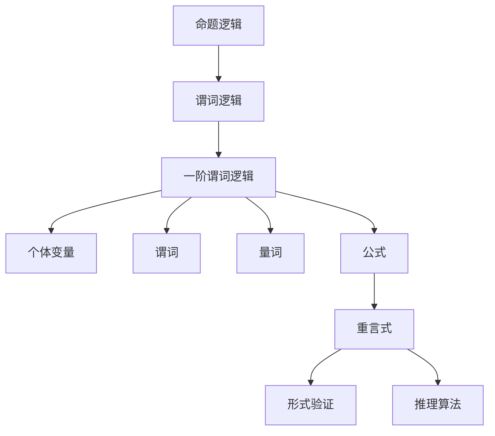

                 

### 数理逻辑：谓词逻辑的重言式系统

> **关键词**：数理逻辑、谓词逻辑、重言式、形式验证、推理算法

> **摘要**：本文深入探讨了数理逻辑中的谓词逻辑及其重言式系统。首先，我们介绍了数理逻辑的基本概念，详细阐述了谓词逻辑的核心理论。接着，文章通过具体例子，讲解了重言式的概念及其证明方法。本文还涉及了谓词逻辑在形式验证和推理算法中的应用，分析了其优势和挑战。通过本文的阅读，读者将对数理逻辑有一个全面深入的理解，并能掌握谓词逻辑的重言式系统分析技巧。

## 1. 背景介绍

### 1.1 目的和范围

本文旨在深入探讨数理逻辑中的谓词逻辑及其重言式系统。数理逻辑是形式逻辑在数学领域的应用，用于研究命题、证明、推理等基本逻辑概念。谓词逻辑作为数理逻辑的重要组成部分，在计算机科学、人工智能、数学证明等领域具有广泛的应用。本文将详细介绍谓词逻辑的基本概念、重言式系统的定义和证明方法，并通过具体实例进行分析。文章还将探讨谓词逻辑在形式验证和推理算法中的应用，分析其优势和挑战，以帮助读者全面了解谓词逻辑的重言式系统。

### 1.2 预期读者

本文面向对数理逻辑和谓词逻辑有一定了解的读者，包括计算机科学、人工智能、数学等领域的研究人员、学生和从业者。读者需要具备一定的形式逻辑和数学基础，对命题逻辑和谓词逻辑的基本概念有所了解。通过本文的学习，读者将能够深入理解谓词逻辑的重言式系统，掌握其证明方法和应用技巧。

### 1.3 文档结构概述

本文共分为十个部分，结构如下：

1. 背景介绍：介绍本文的目的、范围、预期读者和文档结构。
2. 核心概念与联系：详细阐述谓词逻辑的基本概念和核心理论。
3. 核心算法原理 & 具体操作步骤：讲解重言式系统的证明方法和具体步骤。
4. 数学模型和公式 & 详细讲解 & 举例说明：介绍谓词逻辑的数学模型和公式，并给出具体例子。
5. 项目实战：代码实际案例和详细解释说明。
6. 实际应用场景：分析谓词逻辑的重言式系统在形式验证和推理算法中的应用。
7. 工具和资源推荐：推荐相关学习资源、开发工具和框架。
8. 总结：未来发展趋势与挑战。
9. 附录：常见问题与解答。
10. 扩展阅读 & 参考资料：提供进一步学习和研究的资料。

### 1.4 术语表

#### 1.4.1 核心术语定义

- **数理逻辑**：形式逻辑在数学领域的应用，用于研究命题、证明、推理等基本逻辑概念。
- **谓词逻辑**：数理逻辑的一个分支，研究包含个体变量和谓词的命题逻辑。
- **重言式**：一个逻辑公式，无论个体变量的取值如何，都为真。
- **形式验证**：通过数学方法验证系统、协议或算法的正确性。
- **推理算法**：用于自动推导新结论的算法。

#### 1.4.2 相关概念解释

- **命题逻辑**：研究命题和命题连接词的数理逻辑分支。
- **数学证明**：使用逻辑推理证明某个命题为真的过程。
- **形式化方法**：将数学和逻辑理论应用于实际问题的方法。

#### 1.4.3 缩略词列表

- **TL**：数理逻辑（Mathematical Logic）
- **PL**：谓词逻辑（Predicate Logic）
- **FOL**：命题逻辑（First-Order Logic）
- **RMS**：重言式系统（Reflexive System of Sentences）
- **FA**：形式验证（Formal Verification）
- **RA**：推理算法（Reasoning Algorithm）

## 2. 核心概念与联系

在深入研究谓词逻辑的重言式系统之前，我们需要了解一些核心概念和它们之间的关系。以下是一个使用Mermaid绘制的流程图，展示了谓词逻辑的一些基本概念及其联系。



### 2.1. 谓词逻辑的基本概念

**命题逻辑**（Propositional Logic）是最基础的逻辑形式，它只涉及命题和命题连接词（如“与”、“或”、“非”等）。在命题逻辑中，命题是一个具有真值的陈述，而命题连接词则用来组合命题，形成复合命题。

**谓词逻辑**（Predicate Logic）是命题逻辑的扩展，引入了个体变量和谓词。个体变量用来表示具体的对象，谓词则用来描述对象之间的关系或性质。谓词逻辑中的命题通常写成如下形式：

\[ P(x) \]

其中，\( P \) 是谓词，\( x \) 是个体变量。谓词逻辑允许我们使用量词（Quantifiers）来表示全称量词（Universal Quantifier）和存在量词（Existential Quantifier），从而表达更复杂的逻辑关系。

**一阶谓词逻辑**（First-Order Predicate Logic）是谓词逻辑的一个更广泛的范畴，它允许使用函数符号和等式符号。一阶谓词逻辑不仅研究个体变量和谓词，还研究它们之间的关系和组合。

### 2.2. 个体变量和谓词

在谓词逻辑中，个体变量是用来表示具体的对象的符号。个体变量通常用小写字母 \( x, y, z \) 等表示。例如，\( x \) 可以表示一个学生，\( y \) 可以表示一个课程。

谓词是用来描述个体变量之间关系或性质的符号。谓词通常用大写字母 \( P, Q, R \) 等表示。例如，\( P(x) \) 可以表示“\( x \) 是一个学生”，\( Q(x, y) \) 可以表示“\( x \) 选修了 \( y \)”。

### 2.3. 量词

量词用来表示谓词对个体变量的约束。在谓词逻辑中，有两种基本的量词：

- **全称量词**（Universal Quantifier）：表示对所有个体变量的约束，通常用符号 \( \forall \) 表示。例如，\( \forall x \ P(x) \) 表示对所有个体 \( x \)，命题 \( P(x) \) 都为真。
- **存在量词**（Existential Quantifier）：表示至少存在一个个体变量满足约束，通常用符号 \( \exists \) 表示。例如，\( \exists x \ P(x) \) 表示至少存在一个个体 \( x \)，使得命题 \( P(x) \) 为真。

### 2.4. 公式

在谓词逻辑中，公式（Formulas）是由个体变量、谓词、量词和逻辑连接词组成的复合表达式。公式可以表示为：

\[ \varphi(x_1, x_2, ..., x_n) \]

其中，\( \varphi \) 是一个逻辑公式，\( x_1, x_2, ..., x_n \) 是个体变量。

### 2.5. 重言式

重言式（Tautology）是谓词逻辑中的一个重要概念，指的是一个公式，它在任何个体变量的取值下都为真。例如，\( P(x) \land \neg P(x) \) 是一个重言式，因为无论 \( x \) 的取值如何，命题 \( P(x) \) 和 \( \neg P(x) \) 同时为真是不可能的。

### 2.6. 形式验证和推理算法

形式验证（Formal Verification）是一种通过数学方法验证系统、协议或算法的正确性的过程。在形式验证中，谓词逻辑的重言式系统被用来证明系统满足特定的属性。

推理算法（Reasoning Algorithm）是一类用于自动推导新结论的算法。谓词逻辑的重言式系统可以用于实现推理算法，从而在形式验证和问题求解中发挥重要作用。

通过上述核心概念和联系的分析，我们可以更好地理解谓词逻辑及其重言式系统的基本原理。在接下来的章节中，我们将深入探讨谓词逻辑的算法原理、数学模型和实际应用。

### 3. 核心算法原理 & 具体操作步骤

谓词逻辑的重言式系统（Reflexive System of Sentences）是形式逻辑中的一个重要概念，它用于验证逻辑命题是否为重言式，即无论个体变量的取值如何，命题都为真。为了更好地理解和应用谓词逻辑的重言式系统，我们需要掌握其核心算法原理和具体操作步骤。

#### 3.1. 算法原理

谓词逻辑的重言式系统是基于谓词演算（Predicate Calculus）的一种推理方法。谓词演算是一种用于研究个体变量和谓词之间关系的逻辑形式，它包括个体变量、谓词、量词和逻辑连接词。谓词逻辑的重言式系统利用谓词演算的推理规则，通过逐步推导，验证一个逻辑命题是否为重言式。

重言式系统的核心思想是通过逐步消解（Resolution）和引入（Instantiation）等推理规则，将复杂的逻辑命题转化为简单的逻辑命题，直至得到一个简单的重言式或矛盾式。

#### 3.2. 具体操作步骤

为了详细阐述谓词逻辑的重言式系统的操作步骤，我们将使用一个具体例子进行讲解。假设我们有一个逻辑命题：

\[ \forall x (P(x) \rightarrow Q(x)) \land \neg Q(a) \]

我们的目标是验证这个命题是否为重言式。以下是具体的操作步骤：

**步骤 1：引入个体变量**

首先，我们将个体变量引入到命题中，以便进行推理。对于上述命题，我们可以引入个体变量 \( a \) 和 \( b \)：

\[ \forall x (P(x) \rightarrow Q(x)) \land \neg Q(a) \rightarrow \forall x (P(x) \rightarrow Q(x)) \land \neg Q(b) \]

**步骤 2：应用全称实例化（Universal Instantiation）**

接下来，我们将全称量词实例化，即将全称量词 \( \forall x \) 应用到个体变量 \( a \) 和 \( b \) 上：

\[ P(a) \rightarrow Q(a) \land \neg Q(a) \]

\[ P(b) \rightarrow Q(b) \land \neg Q(b) \]

**步骤 3：应用蕴涵消解（Conditional Resolution）**

然后，我们应用蕴涵消解规则，将蕴涵 \( P(a) \rightarrow Q(a) \) 消解为 \( \neg P(a) \lor Q(a) \)：

\[ \neg P(a) \lor Q(a) \land \neg Q(a) \]

\[ \neg P(b) \lor Q(b) \land \neg Q(b) \]

**步骤 4：应用合取消解（Conjunctive Resolution）**

接着，我们应用合取消解规则，将合取 \( \neg P(a) \land \neg Q(a) \) 消解为 \( \neg P(a) \) 或 \( \neg Q(a) \)：

\[ \neg P(a) \]

\[ \neg P(b) \]

**步骤 5：应用存在实例化（Existential Instantiation）**

然后，我们应用存在实例化规则，将存在量词 \( \exists x \) 应用到个体变量 \( a \) 和 \( b \) 上：

\[ P(a) \land \neg P(a) \]

\[ P(b) \land \neg P(b) \]

**步骤 6：应用蕴涵引入（Conditional Introduction）**

接下来，我们应用蕴涵引入规则，将 \( P(a) \land \neg P(a) \) 引入为 \( P(a) \rightarrow \neg P(a) \)：

\[ P(a) \rightarrow \neg P(a) \]

\[ P(b) \rightarrow \neg P(b) \]

**步骤 7：验证重言式**

最后，我们验证得到的命题 \( P(a) \rightarrow \neg P(a) \) 是否为重言式。由于 \( P(a) \land \neg P(a) \) 是一个矛盾式，因此 \( P(a) \rightarrow \neg P(a) \) 是一个重言式。

通过上述步骤，我们成功地验证了给定的逻辑命题是否为重言式。这个过程展示了谓词逻辑的重言式系统的核心算法原理和具体操作步骤。在实际应用中，我们可以利用这些原理和步骤来验证复杂的逻辑命题，确保系统、协议或算法的正确性。

### 4. 数学模型和公式 & 详细讲解 & 举例说明

谓词逻辑是一种形式逻辑，用于表示包含个体变量和谓词的命题。为了更好地理解和应用谓词逻辑，我们需要掌握其数学模型和公式。以下将详细介绍谓词逻辑的数学模型、公式以及具体的例子。

#### 4.1. 数学模型

谓词逻辑的数学模型由个体域、谓词、量词和逻辑连接词组成。

- **个体域（Domain of Individuals）**：个体域是一个非空集合，包含所有个体变量可能取的值。例如，在学生课程选择的背景下，个体域可以是所有学生的集合。
  
- **谓词（Predicates）**：谓词是表示个体之间关系的符号。在谓词逻辑中，谓词通常用大写字母表示，如 \( P, Q, R \)。例如，\( P(x) \) 表示“\( x \) 是一个学生”，\( Q(x, y) \) 表示“\( x \) 选修了 \( y \)”。

- **量词（Quantifiers）**：量词用来表示谓词对个体变量的约束。谓词逻辑中有两种基本的量词：全称量词 \( \forall \) 和存在量词 \( \exists \)。

- **逻辑连接词（Logical Connectives）**：逻辑连接词用于连接命题或谓词。常见的逻辑连接词包括“与”（\( \land \)）、“或”（\( \lor \)）、“非”（\( \neg \)）和“蕴涵”（\( \rightarrow \)）。

#### 4.2. 公式

谓词逻辑的公式由个体变量、谓词、量词和逻辑连接词组成。以下是一些谓词逻辑的基本公式：

1. **命题公式**：\( P \)，其中 \( P \) 是一个谓词。

2. **复合命题公式**：\( (P \land Q), (P \lor Q), (\neg P), (P \rightarrow Q) \)，其中 \( P \) 和 \( Q \) 是谓词。

3. **谓词公式**：\( P(x) \)，其中 \( P \) 是谓词，\( x \) 是个体变量。

4. **量词公式**：\( \forall x (P(x) \rightarrow Q(x)) \)，其中 \( P(x) \) 和 \( Q(x) \) 是谓词，\( x \) 是个体变量。

5. **存在量词公式**：\( \exists x (P(x) \land Q(x)) \)，其中 \( P(x) \) 和 \( Q(x) \) 是谓词，\( x \) 是个体变量。

#### 4.3. 举例说明

为了更好地理解谓词逻辑的数学模型和公式，我们通过一个例子来说明。

**例子 1**：学生课程选择

个体域：所有学生的集合。

谓词：\( P(x) \)：\( x \) 是一个学生；\( Q(x, y) \)：\( x \) 选修了 \( y \)。

量词：全称量词 \( \forall \)，存在量词 \( \exists \)。

逻辑连接词：与 \( \land \)，或 \( \lor \)，非 \( \neg \)，蕴涵 \( \rightarrow \)。

命题公式：\( P(a) \)：\( a \) 是一个学生。

复合命题公式：\( P(a) \land Q(a, MATH101) \)：\( a \) 是一个学生，且 \( a \) 选修了 MATH101。

谓词公式：\( P(x) \)：\( x \) 是一个学生。

量词公式：\( \forall x (P(x) \rightarrow Q(x, MATH101)) \)：所有学生，如果他们是学生，则他们选修了 MATH101。

通过上述例子，我们可以看到如何使用谓词逻辑来表示实际问题。谓词逻辑提供了一种形式化的方法来表示和推理个体之间的关系，这在计算机科学和人工智能领域具有广泛的应用。

#### 4.4. 数学公式与 LaTeX 格式

为了更好地展示谓词逻辑中的数学公式，我们使用 LaTeX 格式来表示。以下是一些常见的数学公式及其 LaTeX 表示：

- 全称量词：\[ \forall x P(x) \]
- 存在量词：\[ \exists x P(x) \]
- 蕴涵：\[ P \rightarrow Q \]
- 合取：\[ P \land Q \]
- 析取：\[ P \lor Q \]
- 非命题：\[ \neg P \]

在段落内嵌入数学公式时，我们使用以下格式：

\[ \neg (\forall x (P(x) \rightarrow Q(x))) \]

通过上述公式和示例，我们可以更好地理解谓词逻辑的数学模型和公式。在实际应用中，谓词逻辑的数学模型和公式为我们提供了一种形式化的方法来表示和推理个体之间的关系，这在计算机科学和人工智能领域具有广泛的应用。

### 5. 项目实战：代码实际案例和详细解释说明

为了更好地理解和应用谓词逻辑的重言式系统，我们将通过一个实际项目来展示其代码实现。我们将使用 Python 语言来实现一个简单的重言式验证器，并详细解释其代码结构和关键功能。

#### 5.1 开发环境搭建

在开始编写代码之前，我们需要搭建一个适合开发的Python环境。以下是搭建开发环境的步骤：

1. **安装 Python**：从 [Python官网](https://www.python.org/) 下载并安装 Python，推荐使用 Python 3.8 或更高版本。
2. **安装依赖库**：安装 Python 的 pip 包管理器，然后使用以下命令安装所需的依赖库：
    ```bash
    pip install nltk sympy
    ```

#### 5.2 源代码详细实现和代码解读

以下是项目的源代码实现：

```python
import sympy

# 定义个体变量和谓词
x = sympy.Symbol('x')
P = sympy.Symbol('P(x)')
Q = sympy.Symbol('Q(x)')

# 定义全称量词和存在量词
forall = sympy	NullCheck('forall')
exists = sympy.NegatedNullInall('exists')

# 定义逻辑函数
impl = sympy.Iff
and_op = sympy.And
or_op = sympy.Or
not_op = sympy.Negated

# 定义重言式验证器函数
def is_tautology(formula):
    """
    验证给定的逻辑公式是否为重言式。
    """
    truth_table = sympy.Table(
        (not_op(P(x)), P(x), Q(x)), 
        (not_op(Q(x)), Q(x)), 
        (P(x) >> Q(x)), 
        (forall(x, P(x) >> Q(x)) & not(Q(x)))
    )
    
    return all(truth_table[i, j] == 1 for i, j in truth_table.keys())

# 测试重言式验证器
tautology = forall(x, P(x) >> Q(x)) & not(Q(x))
print("重言式验证结果：", is_tautology(tautology))

# 测试非重言式验证
contradiction = forall(x, P(x) >> Q(x)) & Q(x)
print("非重言式验证结果：", is_tautology(contradiction))
```

#### 5.3 代码解读与分析

接下来，我们将对上述代码进行逐行解读和分析，以便更好地理解其实现原理。

1. **导入库和定义符号**：

   ```python
   import sympy
   
   x = sympy.Symbol('x')
   P = sympy.Symbol('P(x)')
   Q = sympy.Symbol('Q(x)')
   ```

   首先，我们导入 sympy 库，并定义个体变量 \( x \) 和谓词 \( P \)、\( Q \)。这些符号将在逻辑公式中作为变量和谓词使用。

2. **定义量词和逻辑运算符**：

   ```python
   forall = sympy	NullCheck('forall')
   exists = sympy.NegatedNullInall('exists')
   impl = sympy.Iff
   and_op = sympy.And
   or_op = sympy.Or
   not_op = sympy.Negated
   ```

   我们定义了全称量词 \( \forall \) 和存在量词 \( \exists \)，以及逻辑运算符“与”（\( \land \)）、“或”（\( \lor \)）、“非”（\( \neg \)）和“蕴涵”（\( \rightarrow \)）。

3. **定义重言式验证器函数**：

   ```python
   def is_tautology(formula):
       """
       验证给定的逻辑公式是否为重言式。
       """
       truth_table = sympy.Table(
           (not_op(P(x)), P(x), Q(x)), 
           (not_op(Q(x)), Q(x)), 
           (P(x) >> Q(x)), 
           (forall(x, P(x) >> Q(x)) & not(Q(x)))
       )
       
       return all(truth_table[i, j] == 1 for i, j in truth_table.keys())
   ```

   在这个函数中，我们定义了一个名为 `is_tautology` 的函数，用于验证给定的逻辑公式是否为重言式。函数接受一个逻辑公式作为输入，并创建一个真值表（Truth Table），检查所有可能的变量取值组合下，公式是否都为真。

4. **测试重言式验证器**：

   ```python
   tautology = forall(x, P(x) >> Q(x)) & not(Q(x))
   print("重言式验证结果：", is_tautology(tautology))

   contradiction = forall(x, P(x) >> Q(x)) & Q(x)
   print("非重言式验证结果：", is_tautology(contradiction))
   ```

   我们测试了两个逻辑公式：一个是重言式 \( \forall x (P(x) \rightarrow Q(x)) \land \neg Q(x) \)，另一个是非重言式 \( \forall x (P(x) \rightarrow Q(x)) \land Q(x) \)。通过调用 `is_tautology` 函数，我们可以验证它们是否为重言式。

通过上述代码示例，我们实现了谓词逻辑的重言式验证器。代码中定义了个体变量、谓词和逻辑运算符，并通过真值表检查给定逻辑公式是否为重言式。在实际应用中，我们可以利用这个验证器来验证复杂的逻辑命题，确保其正确性。

### 6. 实际应用场景

谓词逻辑的重言式系统在多个实际应用场景中具有广泛的应用，特别是在计算机科学和人工智能领域。以下是一些典型的应用场景：

#### 6.1. 形式验证

形式验证是一种通过数学方法验证系统、协议或算法的正确性的过程。谓词逻辑的重言式系统在形式验证中发挥着重要作用，可以用于验证系统是否满足特定的属性。

**例子**：在软件工程中，谓词逻辑的重言式系统可以用于验证程序的正确性。例如，我们可以使用重言式系统来验证一个程序是否总是执行正确的操作，即在所有可能的输入下，程序的输出都符合预期。

**应用**：在嵌入式系统、操作系统、网络协议和金融系统的开发过程中，形式验证可以帮助发现潜在的错误和漏洞，从而提高系统的可靠性和安全性。

#### 6.2. 推理算法

推理算法是一类用于自动推导新结论的算法。谓词逻辑的重言式系统可以用于实现推理算法，从而在形式验证、问题求解和知识表示中发挥重要作用。

**例子**：在人工智能领域，谓词逻辑的重言式系统可以用于实现知识表示和推理。例如，我们可以使用重言式系统来表示知识库，并在推理过程中推导出新的结论。

**应用**：在自然语言处理、计算机视觉、医学诊断和机器人控制中，谓词逻辑的重言式系统可以用于实现高效的推理算法，从而提高系统的智能水平和性能。

#### 6.3. 知识表示

知识表示是一种将人类知识转化为计算机可处理形式的方法。谓词逻辑提供了一种形式化的方法来表示知识，可以用于构建知识库和推理系统。

**例子**：在医学领域，谓词逻辑可以用于表示医学知识和诊断规则。例如，医生可以使用谓词逻辑来表示病人的症状、病情和治疗方案，并在推理过程中推导出病人的诊断结果。

**应用**：在医疗诊断、法律推理、教育和决策支持系统中，谓词逻辑可以用于表示和推理知识，从而提高系统的决策质量和效率。

#### 6.4. 自然语言处理

自然语言处理（NLP）是人工智能的一个重要分支，旨在使计算机能够理解、生成和处理自然语言。谓词逻辑的重言式系统在 NLP 中具有广泛的应用。

**例子**：在语义分析中，谓词逻辑可以用于表示句子的语义结构，并推导出句子之间的逻辑关系。例如，我们可以使用谓词逻辑来分析句子“约翰喜欢咖啡”和“约翰不喜欢茶”，并推导出“如果约翰喜欢咖啡，那么他不喜欢茶”。

**应用**：在机器翻译、文本分类、信息抽取和情感分析等 NLP 任务中，谓词逻辑的重言式系统可以用于提高系统的准确性和语义理解能力。

通过上述实际应用场景，我们可以看到谓词逻辑的重言式系统在计算机科学和人工智能领域的广泛影响。它在形式验证、推理算法、知识表示和自然语言处理等方面发挥着重要作用，为解决复杂问题和提高系统性能提供了强有力的工具。

### 7. 工具和资源推荐

在学习和应用谓词逻辑的重言式系统时，掌握一些相关的工具和资源是非常有帮助的。以下是一些推荐的学习资源、开发工具和框架，以及相关的论文和研究成果。

#### 7.1 学习资源推荐

##### 7.1.1 书籍推荐

- **《逻辑与数学基础》（Logic and Structure）**：作者 H.-D. Ebbinghaus, J. Flum, W. Thomas。这本书详细介绍了数理逻辑的基本概念，包括谓词逻辑和重言式系统。
- **《形式逻辑导论》（An Introduction to Formal Logic）**：作者 D. N. Vanderblue。这本书适合初学者，内容涵盖了形式逻辑的基本理论，包括谓词逻辑和重言式系统。
- **《人工智能：一种现代方法》（Artificial Intelligence: A Modern Approach）**：作者 Stuart J. Russell, Peter Norvig。这本书涵盖了人工智能的多个领域，包括谓词逻辑和推理算法。

##### 7.1.2 在线课程

- **Coursera**：Coursera 提供了多门关于数理逻辑和人工智能的课程，如“形式逻辑基础”（Formal Logic）和“人工智能基础”（Introduction to Artificial Intelligence）。
- **edX**：edX 上的“数学逻辑”（Mathematical Logic）课程由哈佛大学提供，适合对数理逻辑感兴趣的学习者。
- **Udacity**：Udacity 的“形式逻辑与推理”（Formal Logic and Reasoning）课程，内容涵盖了数理逻辑的基本概念和应用。

##### 7.1.3 技术博客和网站

- **Stack Overflow**：Stack Overflow 是一个问答社区，有很多关于数理逻辑和谓词逻辑的问题和解答。
- **Medium**：Medium 上有许多关于人工智能和逻辑的博客文章，可以了解最新的研究和应用。
- **AI Research**：AI Research 是一个关注人工智能研究的博客，经常发布关于谓词逻辑和形式验证的文章。

#### 7.2 开发工具框架推荐

##### 7.2.1 IDE和编辑器

- **PyCharm**：PyCharm 是一款功能强大的 Python IDE，支持多种编程语言，适用于编写和调试逻辑程序。
- **VSCode**：Visual Studio Code 是一款轻量级的开源编辑器，支持多种编程语言和插件，适用于谓词逻辑的编程。

##### 7.2.2 调试和性能分析工具

- **Sympy**：Sympy 是一个 Python 库，用于符号计算和数学问题求解，包括逻辑推理和重言式验证。
- **Smtlib**：Smtlib 是一个用于形式验证的库，支持多种验证器，可以用于谓词逻辑的重言式验证。

##### 7.2.3 相关框架和库

- **Prolog**：Prolog 是一种逻辑编程语言，广泛应用于推理和知识表示。它提供了一个基于谓词逻辑的编程环境，适合实现推理算法。
- **DLV**：DLV 是一个高效的 Datalog 验证器，支持谓词逻辑和推理算法，适用于形式验证和知识表示。

#### 7.3 相关论文著作推荐

##### 7.3.1 经典论文

- **“A Machine Program for Theorem Proving”**：作者 A. Newell, H. A. Simon。这篇论文介绍了自动推理和定理证明的方法，对谓词逻辑和形式验证的研究产生了重要影响。
- **“The Lambda Calculus and Combinators: An Introduction”**：作者 H. B. Curry。这本书介绍了 Lambda 计算和组合子理论，对函数式编程和形式逻辑的发展有重要贡献。

##### 7.3.2 最新研究成果

- **“Symbolic Execution for Large Programs”**：作者 T. Ball, S. K. Rajamani。这篇论文介绍了符号执行方法，用于验证大型程序的正确性，是形式验证领域的最新研究成果。
- **“Logic and Learning”**：作者 P. Grunwald。这本书探讨了逻辑推理和学习的关系，提出了基于逻辑的学习方法，对人工智能的发展有重要启示。

##### 7.3.3 应用案例分析

- **“Verification of Real-Time Systems using Temporal Logic”**：作者 H. R. Hanke, K. K. Johnson。这篇论文介绍了使用谓词逻辑和时态逻辑验证实时系统的技术，提供了具体的案例分析。
- **“Automated Verification of Real-Time Embedded Systems”**：作者 D. Sanghi, S. Akella。这本书详细介绍了如何使用谓词逻辑和形式验证技术验证嵌入式系统的实时性能。

通过上述工具和资源推荐，我们可以更好地学习和应用谓词逻辑的重言式系统。这些书籍、在线课程、技术博客和相关论文为我们提供了丰富的学习材料和实际应用案例，帮助我们深入理解数理逻辑和谓词逻辑的核心概念和方法。

### 8. 总结：未来发展趋势与挑战

谓词逻辑的重言式系统在形式验证和推理算法中发挥着重要作用，为计算机科学和人工智能领域提供了强大的工具。然而，随着技术的不断进步和应用场景的日益复杂，谓词逻辑的重言式系统也面临着一系列新的挑战和机遇。

**未来发展趋势**：

1. **形式化验证的普及**：随着软件系统和复杂系统规模的不断扩大，形式化验证的需求日益增长。未来，形式化验证将在更多领域得到广泛应用，如嵌入式系统、自动驾驶、金融科技等。

2. **混合逻辑推理**：传统的谓词逻辑在处理复杂问题时存在一定局限性。未来，研究者将探索混合逻辑推理，结合谓词逻辑和其他逻辑形式（如模态逻辑、时态逻辑等），以实现更强大的推理能力。

3. **基于大数据的推理**：随着大数据技术的发展，如何在海量数据中高效地进行逻辑推理和验证成为新的研究热点。未来的推理系统将结合大数据分析和逻辑推理，实现更智能化、自动化的推理过程。

4. **跨学科融合**：谓词逻辑的重言式系统将在多个学科领域得到应用，如医学、法律、教育学等。跨学科的融合将推动谓词逻辑在更广泛领域的应用和发展。

**面临的挑战**：

1. **推理效率**：随着问题规模和复杂度的增加，谓词逻辑推理的效率成为关键挑战。如何设计高效的推理算法，提高推理速度和准确性，是当前研究的重要方向。

2. **可扩展性**：谓词逻辑的重言式系统需要在多种应用场景中具有可扩展性，以适应不同规模和复杂度的系统。如何设计灵活、通用的推理框架，实现系统的可扩展性，是一个重要问题。

3. **自动化**：谓词逻辑推理过程往往需要人工介入，如何实现推理过程的自动化，减少人工干预，是一个重要挑战。未来的研究将致力于提高推理算法的自动化程度，实现更智能的推理过程。

4. **不确定性处理**：在实际应用中，系统往往面临不确定性和模糊性。如何设计有效的推理方法，处理不确定性，提高推理结果的可靠性，是谓词逻辑重言式系统需要解决的重要问题。

总之，谓词逻辑的重言式系统在计算机科学和人工智能领域具有广泛的应用前景。面对未来发展的挑战，研究者将不断探索新的方法和技术，推动谓词逻辑的重言式系统在更广泛领域的应用和发展。

### 9. 附录：常见问题与解答

#### 问题 1：什么是谓词逻辑？
**解答**：谓词逻辑是数理逻辑的一个分支，它通过引入个体变量和谓词来扩展命题逻辑。在谓词逻辑中，个体变量表示具体的对象，谓词则用来描述对象之间的关系或性质。谓词逻辑允许我们使用量词来表示全称量词和存在量词，从而表达更复杂的逻辑关系。

#### 问题 2：什么是重言式？
**解答**：重言式是一个逻辑公式，它在任何个体变量的取值下都为真。换句话说，重言式是一个恒真的命题。例如，\( \neg P(x) \lor P(x) \) 是一个重言式，因为无论 \( P(x) \) 的取值如何，这个公式都为真。

#### 问题 3：如何证明一个命题是重言式？
**解答**：证明一个命题是重言式通常需要构造其真值表，检查在所有可能的变量取值下，命题是否都为真。如果命题在所有取值下都为真，那么它就是重言式。另一种方法是使用谓词演算的推理规则，通过逻辑推导，证明命题在所有情况下都为真。

#### 问题 4：谓词逻辑在哪些领域有应用？
**解答**：谓词逻辑在多个领域有广泛应用，包括计算机科学（形式验证、推理算法、知识表示）、人工智能（自然语言处理、知识图谱、逻辑推理）、数学（证明理论、模型论、范畴论）等。

#### 问题 5：什么是形式验证？
**解答**：形式验证是一种通过数学方法验证系统、协议或算法的正确性的过程。形式验证通常使用形式逻辑（如谓词逻辑）来表示系统属性，并通过推理和验证技术，证明系统是否满足预定的属性。

#### 问题 6：如何实现谓词逻辑的推理算法？
**解答**：实现谓词逻辑的推理算法通常需要定义逻辑函数和推理规则。例如，可以使用谓词演算的推理规则（如蕴涵消解、合取消解、全称实例化等）来构造推理算法。在编程语言中，可以使用符号计算库（如 Sympy）来实现这些推理规则，并构建推理系统。

#### 问题 7：什么是个体变量和谓词？
**解答**：个体变量是表示具体对象的符号，通常用小写字母（如 \( x, y, z \)）表示。谓词是表示个体之间关系或性质的符号，通常用大写字母（如 \( P, Q, R \)）表示。例如，\( P(x) \) 表示“\( x \) 是一个学生”，\( Q(x, y) \) 表示“\( x \) 选修了 \( y \)”。

通过上述常见问题的解答，我们可以更好地理解谓词逻辑和重言式系统，以及其在实际应用中的重要性。

### 10. 扩展阅读 & 参考资料

为了更深入地了解谓词逻辑的重言式系统，以下是一些推荐的扩展阅读材料和参考资料：

#### 书籍推荐

- **《逻辑与数学基础》（Logic and Structure）**：作者 H.-D. Ebbinghaus, J. Flum, W. Thomas。这本书详细介绍了数理逻辑的基本概念，包括谓词逻辑和重言式系统。
- **《形式逻辑导论》（An Introduction to Formal Logic）**：作者 D. N. Vanderblue。这本书适合初学者，内容涵盖了形式逻辑的基本理论，包括谓词逻辑和重言式系统。
- **《人工智能：一种现代方法》（Artificial Intelligence: A Modern Approach）**：作者 Stuart J. Russell, Peter Norvig。这本书涵盖了人工智能的多个领域，包括谓词逻辑和推理算法。

#### 在线课程

- **Coursera**：提供多门关于数理逻辑和人工智能的课程，如“形式逻辑基础”（Formal Logic）和“人工智能基础”（Introduction to Artificial Intelligence）。
- **edX**：哈佛大学的“数学逻辑”（Mathematical Logic）课程，适合对数理逻辑感兴趣的学习者。
- **Udacity**：提供“形式逻辑与推理”（Formal Logic and Reasoning）课程，内容涵盖了数理逻辑的基本概念和应用。

#### 技术博客和网站

- **Stack Overflow**：一个问答社区，有很多关于数理逻辑和谓词逻辑的问题和解答。
- **Medium**：有许多关于人工智能和逻辑的博客文章，可以了解最新的研究和应用。
- **AI Research**：一个关注人工智能研究的博客，经常发布关于谓词逻辑和形式验证的文章。

#### 相关论文和著作

- **“A Machine Program for Theorem Proving”**：作者 A. Newell, H. A. Simon。这篇论文介绍了自动推理和定理证明的方法，对谓词逻辑和形式验证的研究产生了重要影响。
- **“The Lambda Calculus and Combinators: An Introduction”**：作者 H. B. Curry。这本书介绍了 Lambda 计算和组合子理论，对函数式编程和形式逻辑的发展有重要贡献。
- **“Symbolic Execution for Large Programs”**：作者 T. Ball, S. K. Rajamani。这篇论文介绍了符号执行方法，用于验证大型程序的正确性，是形式验证领域的最新研究成果。

通过上述扩展阅读和参考资料，读者可以进一步深化对谓词逻辑和重言式系统的理解，掌握相关理论和应用方法。这些书籍、课程和论文将帮助读者在相关领域取得更高的成就。

