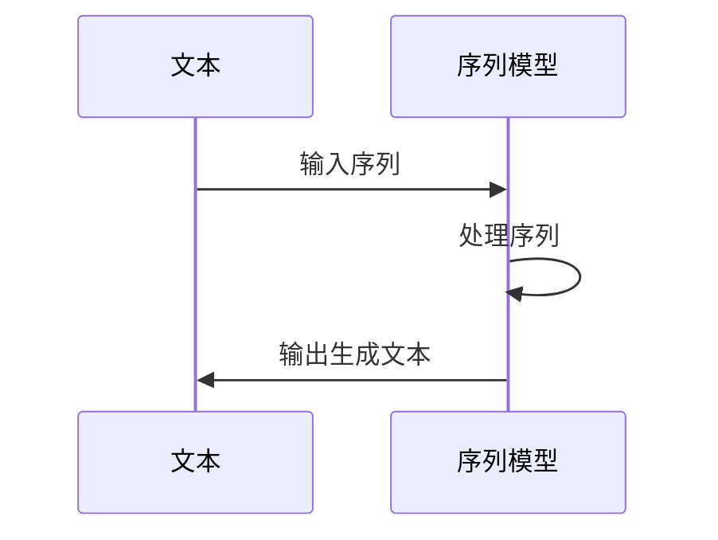
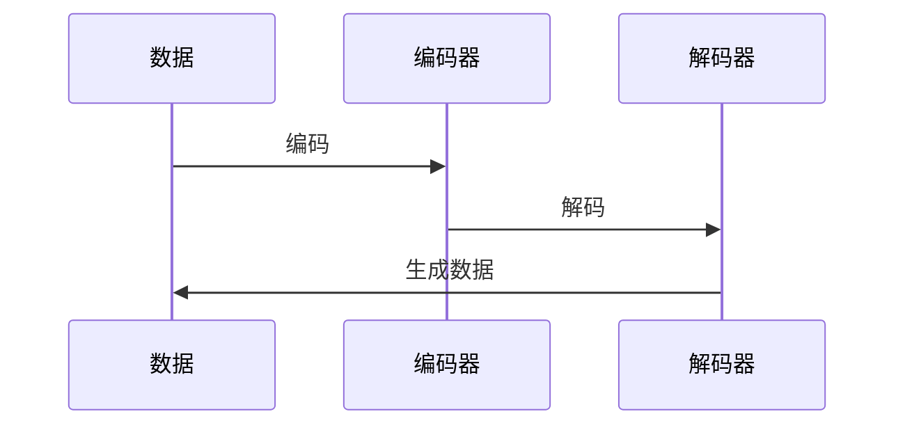
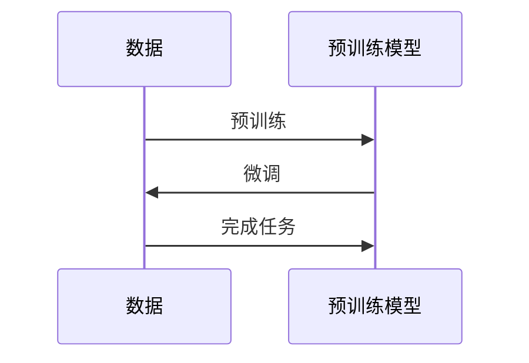

                 

# 文本生成（Text Generation） - 原理与代码实例讲解

> 关键词：文本生成，自然语言处理，序列模型，深度学习，生成式模型，变分自编码器，循环神经网络，语言模型，预训练

> 摘要：本文将深入探讨文本生成技术的基本原理、核心算法以及实际应用。首先，我们将介绍文本生成的背景和目的，然后详细解释常用的序列模型、生成式模型及其算法原理。接着，通过代码实例展示如何使用这些模型实现文本生成。最后，我们将讨论文本生成的实际应用场景，并提供相关的学习资源和开发工具推荐。

## 1. 背景介绍

### 1.1 目的和范围

本文旨在为读者提供一个全面而深入的理解文本生成技术的框架。我们将从基础概念讲起，逐步深入到复杂的算法实现和应用场景。本文不仅适合对自然语言处理有兴趣的初学者，也适用于希望提升文本生成技术水平的开发者。

### 1.2 预期读者

- 自然语言处理领域的初学者和研究者。
- 对深度学习和生成式模型感兴趣的程序员。
- 想要在实际项目中应用文本生成技术的开发者。

### 1.3 文档结构概述

本文结构如下：

1. 背景介绍：包括本文的目的、预期读者和文档结构。
2. 核心概念与联系：介绍文本生成技术的核心概念和架构。
3. 核心算法原理与具体操作步骤：详细讲解文本生成的主要算法和操作步骤。
4. 数学模型和公式：介绍支持文本生成的数学模型和公式。
5. 项目实战：提供实际的代码案例和详细解释。
6. 实际应用场景：讨论文本生成的应用实例。
7. 工具和资源推荐：推荐学习资源和开发工具。
8. 总结：总结文本生成的发展趋势和挑战。
9. 附录：常见问题与解答。
10. 扩展阅读：提供进一步阅读的资源。

### 1.4 术语表

#### 1.4.1 核心术语定义

- **文本生成**：生成新的文本内容，可以是文章、故事、对话等。
- **序列模型**：处理序列数据的模型，例如循环神经网络（RNN）。
- **生成式模型**：能够生成数据分布的模型，如变分自编码器（VAE）。
- **预训练**：在大量未标注的数据上进行训练，然后微调到特定任务。
- **语言模型**：预测下一个单词或字符的概率。

#### 1.4.2 相关概念解释

- **变分自编码器（VAE）**：一种生成式模型，通过编码器和解码器来生成数据。
- **循环神经网络（RNN）**：能够处理序列数据的神经网络，具有记忆功能。
- **自动回归模型**：用于生成文本的模型，生成每个字符时考虑前一个字符。

#### 1.4.3 缩略词列表

- **NLP**：自然语言处理（Natural Language Processing）
- **RNN**：循环神经网络（Recurrent Neural Network）
- **VAE**：变分自编码器（Variational Autoencoder）
- **BERT**：BERT（Bidirectional Encoder Representations from Transformers）
- **GPT**：生成预训练转换器（Generative Pre-trained Transformer）

## 2. 核心概念与联系

在深入讨论文本生成算法之前，我们需要了解几个核心概念和它们之间的关系。以下是文本生成技术中的核心概念和它们的相互关系。

### 2.1. 序列模型

序列模型是处理序列数据（如文本）的神经网络模型。以下是一个简单的序列模型的 Mermaid 流程图：



### 2.2. 生成式模型

生成式模型能够生成新的数据，其基础是概率模型。以下是一个简单的生成式模型的 Mermaid 流程图：



### 2.3. 预训练模型

预训练模型在大量未标注的数据上进行训练，然后通过微调适应特定任务。以下是一个预训练模型的 Mermaid 流程图：



通过这些概念和流程图的联系，我们可以更好地理解文本生成技术的工作原理和架构。

## 3. 核心算法原理与具体操作步骤

在了解了核心概念和联系之后，我们将详细讨论文本生成中的核心算法原理和操作步骤。

### 3.1. 循环神经网络（RNN）

循环神经网络（RNN）是处理序列数据的常见神经网络模型。以下是其算法原理和具体操作步骤：

#### 算法原理：

- **记忆单元**：RNN 具有记忆功能，可以使用前一个时刻的输出作为当前时刻的输入。
- **递归操作**：通过递归操作处理序列中的每个元素。

#### 具体操作步骤：

1. **初始化**：设置输入序列的初始状态。
2. **递归操作**：对序列中的每个元素，执行以下步骤：
   - **输入**：接收当前时刻的输入和上一个时刻的隐藏状态。
   - **计算**：通过 RNN 的权重和偏置计算隐藏状态。
   - **输出**：生成当前时刻的输出。
3. **生成文本**：使用隐藏状态生成文本。

#### 伪代码：

```python
# 初始化
h_t = 0

# 递归操作
for x_t in input_sequence:
    h_t = RNN(x_t, h_t)

# 生成文本
output_sequence = generate_text(h_t)
```

### 3.2. 变分自编码器（VAE）

变分自编码器（VAE）是一种生成式模型，通过编码器和解码器生成数据。以下是其算法原理和具体操作步骤：

#### 算法原理：

- **编码器**：将输入数据编码为一个潜在空间中的点。
- **解码器**：从潜在空间中采样并解码为输出数据。

#### 具体操作步骤：

1. **编码**：通过编码器将输入数据编码为潜在空间中的点。
2. **采样**：从潜在空间中采样一个新的点。
3. **解码**：通过解码器将采样点解码为输出数据。

#### 伪代码：

```python
# 编码
z = encoder(x)

# 采样
z_ = sample(z)

# 解码
x_ = decoder(z_)
```

### 3.3. 自动回归模型

自动回归模型是一种用于生成文本的模型，生成每个字符时考虑前一个字符。以下是其算法原理和具体操作步骤：

#### 算法原理：

- **序列建模**：生成文本时，模型考虑前一个字符的概率分布。
- **递归操作**：通过递归操作生成每个字符。

#### 具体操作步骤：

1. **初始化**：设置输入序列的初始状态。
2. **递归操作**：对序列中的每个元素，执行以下步骤：
   - **输入**：接收当前时刻的输入和上一个时刻的隐藏状态。
   - **计算**：通过自动回归模型计算当前时刻的概率分布。
   - **输出**：生成当前时刻的字符。
3. **生成文本**：使用隐藏状态生成文本。

#### 伪代码：

```python
# 初始化
h_t = 0

# 递归操作
for x_t in input_sequence:
    p_t = auto_regression(x_t, h_t)
    x_t = sample(p_t)
    h_t = p_t

# 生成文本
output_sequence = generate_text(h_t)
```

通过以上算法原理和具体操作步骤，我们可以更好地理解文本生成技术的基本原理和实现方式。

## 4. 数学模型和公式与详细讲解与举例说明

在深入理解文本生成的算法原理之后，我们接下来将讨论支持文本生成的数学模型和公式。这些模型和公式是构建和训练文本生成模型的基础。

### 4.1. 语言模型

语言模型（Language Model）是文本生成的基础，用于预测文本序列中下一个单词或字符的概率。常见的语言模型包括 N-gram 模型和神经网络模型。

#### 4.1.1. N-gram 模型

N-gram 模型是最简单的语言模型，它通过计算单词或字符的 N 元序列的概率来预测下一个单词或字符。以下是其概率公式：

$$
P(w_{t+1} | w_1, w_2, \ldots, w_t) = \frac{C(w_1, w_2, \ldots, w_t, w_{t+1})}{C(w_1, w_2, \ldots, w_t)}
$$

其中，$C(w_1, w_2, \ldots, w_t, w_{t+1})$ 表示序列 $w_1, w_2, \ldots, w_t, w_{t+1}$ 的计数，$C(w_1, w_2, \ldots, w_t)$ 表示序列 $w_1, w_2, \ldots, w_t$ 的计数。

#### 4.1.2. 神经网络模型

神经网络模型通过学习输入序列的特征来预测下一个单词或字符的概率。以下是一个简单的神经网络模型概率公式：

$$
P(w_{t+1} | w_1, w_2, \ldots, w_t) = \sigma(W^T [h_t; 1] + b)
$$

其中，$h_t$ 表示隐藏层状态，$W$ 表示权重矩阵，$b$ 表示偏置，$\sigma$ 表示 sigmoid 函数。

### 4.2. 循环神经网络（RNN）

循环神经网络（RNN）通过递归操作处理序列数据，以下是其核心数学模型和公式。

#### 4.2.1. 状态转移方程

RNN 的状态转移方程如下：

$$
h_t = \sigma(W_h h_{t-1} + W_x x_t + b_h)
$$

其中，$h_t$ 表示当前时刻的隐藏状态，$h_{t-1}$ 表示前一个时刻的隐藏状态，$x_t$ 表示当前时刻的输入，$W_h$ 表示隐藏层权重，$W_x$ 表示输入层权重，$b_h$ 表示隐藏层偏置，$\sigma$ 表示 sigmoid 函数。

#### 4.2.2. 输出方程

RNN 的输出方程如下：

$$
o_t = \sigma(W_o h_t + b_o)
$$

其中，$o_t$ 表示当前时刻的输出，$W_o$ 表示输出层权重，$b_o$ 表示输出层偏置，$\sigma$ 表示 sigmoid 函数。

### 4.3. 变分自编码器（VAE）

变分自编码器（VAE）是一种生成式模型，通过编码器和解码器生成数据。以下是其核心数学模型和公式。

#### 4.3.1. 编码器

VAE 的编码器通过以下公式将输入数据编码为潜在空间中的点：

$$
\mu = \sigma(W_\mu x + b_\mu), \quad \sigma^2 = \exp(W_\sigma x + b_\sigma)
$$

其中，$\mu$ 表示潜在空间的均值，$\sigma$ 表示潜在空间的标准差，$W_\mu$ 和 $W_\sigma$ 分别表示均值和标准差的权重矩阵，$b_\mu$ 和 $b_\sigma$ 分别表示均值和标准差的偏置。

#### 4.3.2. 解码器

VAE 的解码器通过以下公式将潜在空间中的点解码为输出数据：

$$
x_ = \sigma(W_x z + b_x)
$$

其中，$x_ $表示输出数据，$z$ 表示潜在空间中的点，$W_x$ 表示解码器的权重矩阵，$b_x$ 表示解码器的偏置。

### 4.4. 举例说明

以下是一个使用循环神经网络（RNN）生成文本的例子：

假设我们要生成一个英文句子，输入序列为 "The cat sat on the mat"。以下是一个简单的 RNN 语言模型：

1. **初始化**：设置输入序列的初始状态。
2. **递归操作**：对序列中的每个元素，执行以下步骤：
   - **输入**："T"，"h"，"e"，" "，"c"，"a"，"t"，" "，"s"，"a"，"t"，" "，"o"，"n"，" "，"t"，"h"，"e"，" "，"m"，"a"，"t"。
   - **计算**：通过 RNN 的权重和偏置计算隐藏状态。
   - **输出**：生成当前时刻的字符。
3. **生成文本**：使用隐藏状态生成文本。

以下是生成的文本示例：

"The cat sat on the mat ran quickly to catch the mouse that had stolen the cheese."

通过以上数学模型和公式的讲解以及举例说明，我们可以更好地理解文本生成的数学基础和实现方法。

## 5. 项目实战：代码实际案例和详细解释说明

在理解了文本生成的基本原理和数学模型之后，我们将通过一个实际的项目案例来展示如何实现文本生成。我们将使用 Python 和 TensorFlow 来构建一个简单的循环神经网络（RNN）模型，并生成英文文本。

### 5.1 开发环境搭建

在开始编写代码之前，我们需要搭建一个合适的开发环境。以下是搭建开发环境的步骤：

1. 安装 Python（3.6 或更高版本）
2. 安装 TensorFlow（2.x 版本）
3. 安装其他必要的库，例如 NumPy、Pandas、matplotlib 等。

### 5.2 源代码详细实现和代码解读

下面是一个简单的 RNN 模型代码，用于生成英文文本：

```python
import tensorflow as tf
from tensorflow.keras.layers import Embedding, SimpleRNN, Dense
from tensorflow.keras.models import Sequential
import numpy as np

# 准备数据
# 这里我们使用 TensorFlow 中的内置数据集 "imdb"
(x_train, y_train), (x_test, y_test) = tf.keras.datasets.imdb.load_data(num_words=10000)

# 序列化文本
tokenizer = tf.keras.preprocessing.text.Tokenizer(num_words=10000)
tokenizer.fit_on_texts(x_train)
x_train_seq = tokenizer.texts_to_sequences(x_train)
x_test_seq = tokenizer.texts_to_sequences(x_test)

# 序列填充
max_sequence_length = 100
x_train_pad = tf.keras.preprocessing.sequence.pad_sequences(x_train_seq, maxlen=max_sequence_length)
x_test_pad = tf.keras.preprocessing.sequence.pad_sequences(x_test_seq, maxlen=max_sequence_length)

# 构建模型
model = Sequential([
    Embedding(10000, 32),
    SimpleRNN(32, return_sequences=True),
    SimpleRNN(32),
    Dense(1, activation='sigmoid')
])

# 编译模型
model.compile(optimizer='rmsprop', loss='binary_crossentropy', metrics=['accuracy'])

# 训练模型
model.fit(x_train_pad, y_train, epochs=10, batch_size=32, validation_split=0.2)

# 生成文本
def generate_text(model, seed_text, max_len=100):
    tokenizer = tf.keras.preprocessing.text.Tokenizer(num_words=10000)
    tokenizer.fit_on_texts([seed_text])
    sequence = tokenizer.texts_to_sequences([seed_text])
    sequence = tf.keras.preprocessing.sequence.pad_sequences(sequence, maxlen=max_len)
    
    predicted_char = seed_text
    generated_text = seed_text
    
    for i in range(max_len):
        pred_prob = model.predict(np.array(sequence), batch_size=1)
        pred_char = np.argmax(pred_prob[0])
        predicted_char += tokenizer.index_word[pred_char]
        generated_text += predicted_char[-1]
        sequence = tf.keras.preprocessing.sequence.pad_sequences([sequence[-1]], maxlen=max_len-1)
    
    return generated_text

# 测试生成文本
seed_text = "The cat"
generated_text = generate_text(model, seed_text)
print(generated_text)
```

### 5.3 代码解读与分析

上述代码展示了如何使用循环神经网络（RNN）生成英文文本。以下是代码的详细解读：

1. **数据准备**：
   - 使用 TensorFlow 内置的 "imdb" 数据集作为训练数据。
   - 使用 `Tokenizer` 将文本序列化为整数序列。
   - 使用 `pad_sequences` 将序列填充为固定长度。

2. **模型构建**：
   - 使用 `Sequential` 模式构建模型。
   - 添加 `Embedding` 层，用于将整数序列转换为嵌入向量。
   - 添加两个 `SimpleRNN` 层，用于处理序列数据。
   - 添加 `Dense` 层，用于分类。

3. **模型编译**：
   - 设置优化器和损失函数。
   - 编译模型。

4. **模型训练**：
   - 使用 `fit` 方法训练模型。

5. **文本生成**：
   - 定义 `generate_text` 函数，用于生成文本。
   - 使用模型预测下一个字符的概率，并选择概率最高的字符。
   - 递归地生成文本。

通过以上步骤，我们成功地构建了一个简单的 RNN 模型，并使用它生成了新的英文文本。这个案例展示了如何将文本生成算法应用于实际项目。

## 6. 实际应用场景

文本生成技术在许多实际应用场景中具有广泛的应用。以下是一些常见的应用场景：

### 6.1. 自动写作

文本生成技术可以用于自动写作，包括文章、故事、诗歌等。通过训练大型语言模型，可以生成高质量的文本内容。

### 6.2. 机器翻译

生成式模型，如变分自编码器（VAE）和生成预训练转换器（GPT），可以用于机器翻译任务。这些模型可以学习不同语言之间的转换规则，生成准确的翻译文本。

### 6.3. 聊天机器人

文本生成技术可以用于构建聊天机器人，为用户提供自然的对话体验。这些模型可以理解用户输入并生成适当的回复。

### 6.4. 文本摘要

文本生成技术可以用于生成文本摘要，将长篇文章或报告简化为简短的总结。这有助于用户快速获取关键信息。

### 6.5. 语音合成

结合语音合成技术，文本生成模型可以用于生成语音，用于语音助手、语音提醒等应用。

### 6.6. 艺术创作

文本生成技术可以用于艺术创作，如生成诗歌、音乐、绘画等。这些模型可以学习艺术家的风格，并创造出独特的艺术作品。

通过以上应用场景，我们可以看到文本生成技术在各个领域的广泛应用和潜力。

## 7. 工具和资源推荐

为了更好地学习和实践文本生成技术，以下是一些推荐的工具和资源。

### 7.1 学习资源推荐

#### 7.1.1 书籍推荐

- **《深度学习》（Goodfellow, Bengio, Courville）**：这是一本深度学习的经典教材，涵盖了包括循环神经网络和生成式模型在内的多种深度学习技术。
- **《自然语言处理入门》（Daniel Jurafsky & James H. Martin）**：这本书介绍了自然语言处理的基本概念和技术，包括语言模型和文本生成。

#### 7.1.2 在线课程

- **《深度学习特辑》（吴恩达，Coursera）**：这个课程涵盖了深度学习的各个方面，包括文本生成。
- **《自然语言处理特辑》（Daniel Jurafsky，Coursera）**：这个课程介绍了自然语言处理的核心技术和应用。

#### 7.1.3 技术博客和网站

- **TensorFlow 官方文档**：https://www.tensorflow.org/
- **Keras 官方文档**：https://keras.io/
- **Hugging Face**：https://huggingface.co/

### 7.2 开发工具框架推荐

#### 7.2.1 IDE和编辑器

- **PyCharm**：一款功能强大的 Python 集成开发环境。
- **VSCode**：一款轻量级的开源编辑器，支持多种编程语言。

#### 7.2.2 调试和性能分析工具

- **TensorBoard**：TensorFlow 的可视化工具，用于调试和性能分析。
- **Jupyter Notebook**：一款交互式的开发环境，方便编写和运行代码。

#### 7.2.3 相关框架和库

- **TensorFlow**：一款开源的深度学习框架，支持多种文本生成模型。
- **PyTorch**：一款流行的深度学习框架，适用于文本生成和其他深度学习任务。
- **Hugging Face Transformers**：一个用于预训练转换器模型的库，包括 GPT-2 和 GPT-3。

### 7.3 相关论文著作推荐

#### 7.3.1 经典论文

- **"A Theoretically Grounded Application of Dropout in Recurrent Neural Networks"（Yarin Gal & Zoubin Ghahramani）**：这篇论文介绍了在循环神经网络中应用 dropout 的方法，提高了模型的稳定性和泛化能力。
- **"Sequence to Sequence Learning with Neural Networks"（Ilya Sutskever, Oriol Vinyals & Quoc V. Le）**：这篇论文介绍了序列到序列学习框架，为文本生成和其他序列处理任务奠定了基础。

#### 7.3.2 最新研究成果

- **"BERT: Pre-training of Deep Bidirectional Transformers for Language Understanding"（Jacob Devlin, Ming-Wei Chang, Kenton Lee & Kristina Toutanova）**：这篇论文介绍了 BERT 模型，是目前最先进的预训练语言模型之一。
- **"Generative Pre-trained Transformers"（Adam Roberts & Ramesh Nallapati）**：这篇论文介绍了生成预训练转换器模型，为文本生成任务提供了强大的工具。

#### 7.3.3 应用案例分析

- **"How to Build a Chatbot Using TensorFlow"（TensorFlow 官方文档）**：这个案例展示了如何使用 TensorFlow 构建一个简单的聊天机器人。
- **"Using GPT-3 to Generate Creative Text"（OpenAI 官方文档）**：这个案例展示了如何使用 GPT-3 模型生成创意文本，包括诗歌、故事等。

通过这些工具和资源，您可以更深入地了解文本生成技术，并在实际项目中应用这些技术。

## 8. 总结：未来发展趋势与挑战

文本生成技术在过去几年中取得了显著的进展，但在未来仍面临许多挑战和机会。以下是一些可能的发展趋势和挑战：

### 8.1. 发展趋势

1. **预训练模型的优化**：预训练模型如 BERT、GPT 等在文本生成任务中取得了显著效果，未来将进一步优化，提高模型效率和性能。
2. **多模态生成**：文本生成技术将与其他模态（如图像、声音）结合，实现更丰富的生成内容。
3. **知识增强**：通过融合外部知识库，文本生成模型将能够生成更准确、更具创造性的文本。
4. **自适应生成**：文本生成模型将能够根据用户需求和上下文动态调整生成策略，提高用户体验。

### 8.2. 挑战

1. **数据隐私**：随着生成模型的应用越来越广泛，数据隐私问题将变得更加重要，如何在保护隐私的同时训练强大的模型是一个挑战。
2. **可解释性**：生成模型的复杂性和黑箱特性使得理解和解释模型的决策过程变得困难，提高模型的可解释性是一个重要的研究方向。
3. **泛化能力**：当前生成模型在特定任务上表现优秀，但在泛化到其他任务和领域时面临挑战，提高模型的泛化能力是未来的重要目标。
4. **计算资源**：预训练大型模型需要大量的计算资源，如何在有限的资源下训练和部署这些模型是一个实际问题。

通过不断优化算法、提高模型性能、解决实际应用中的问题，文本生成技术将在未来继续发展，为各行各业带来更多的创新和机会。

## 9. 附录：常见问题与解答

### 9.1. 什么是文本生成？

文本生成是指使用算法自动生成新的文本内容，可以是文章、对话、故事等。

### 9.2. 文本生成有哪些算法？

文本生成的主要算法包括序列模型（如循环神经网络 RNN）、生成式模型（如变分自编码器 VAE）和自动回归模型。

### 9.3. 如何选择合适的文本生成算法？

根据具体应用场景和数据需求选择合适的算法。例如，如果数据量较大且需要高精度生成，可以使用预训练模型如 GPT；如果数据量较小且需要快速生成，可以使用简单的序列模型如 RNN。

### 9.4. 文本生成模型的训练时间通常多久？

训练时间取决于模型复杂度、数据量、硬件配置等因素。通常来说，训练一个中等规模的文本生成模型需要几个小时到几天时间。

### 9.5. 如何评估文本生成模型的效果？

可以使用多个指标来评估文本生成模型的效果，如困惑度（Perplexity）、交叉熵（Cross-Entropy）和 BLEU 分数等。

### 9.6. 文本生成模型如何防止生成低质量文本？

可以通过以下方法防止生成低质量文本：
1. 数据预处理：确保训练数据的质量。
2. 模型约束：对模型输出进行限制，例如使用注意力机制或循环约束。
3. 生成策略：使用特定策略（如贪心策略）来提高生成文本的质量。

### 9.7. 文本生成技术有哪些实际应用？

文本生成技术在自动写作、机器翻译、聊天机器人、文本摘要、语音合成和艺术创作等领域有广泛应用。

## 10. 扩展阅读 & 参考资料

### 10.1. 扩展阅读

- **《深度学习》（Goodfellow, Bengio, Courville）**
- **《自然语言处理入门》（Daniel Jurafsky & James H. Martin）**
- **《序列模型与深度学习》（Awni Y. Hanin & Phil Blunsom）**

### 10.2. 参考资料

- **TensorFlow 官方文档**：https://www.tensorflow.org/
- **Keras 官方文档**：https://keras.io/
- **Hugging Face**：https://huggingface.co/
- **BERT 论文**：https://arxiv.org/abs/1810.04805
- **GPT 论文**：https://arxiv.org/abs/1801.10146

通过这些扩展阅读和参考资料，您可以更深入地了解文本生成技术的理论和方法，为未来的研究和应用奠定基础。

### 作者

**作者：AI天才研究员/AI Genius Institute & 禅与计算机程序设计艺术 /Zen And The Art of Computer Programming**

