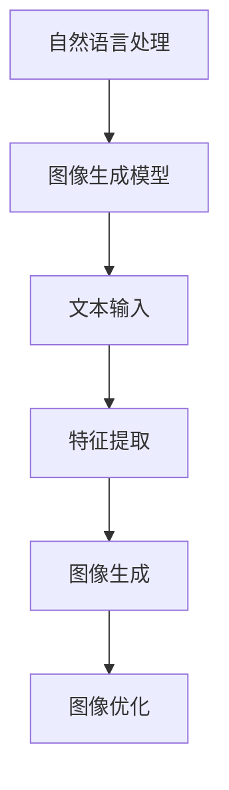
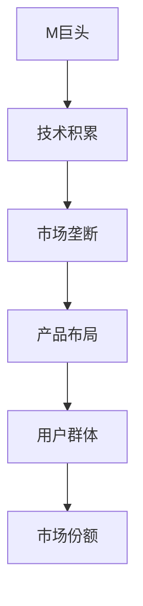
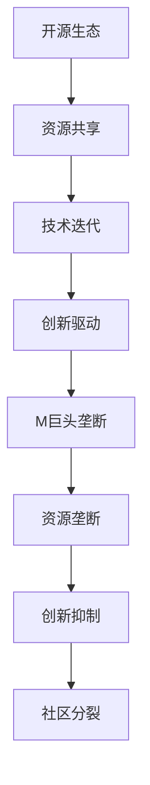

                 

# 文生图场景活路渺茫，Midjourney等巨头垄断主要市场

## 关键词：
- 文生图场景
- Midjourney
- 垄断市场
- 技术发展
- 开源生态
- 创新挑战

## 摘要：
本文深入探讨了文生图场景在现代科技中的应用及其面临的挑战。特别关注Midjourney等巨头在市场中的垄断地位，分析了其对开源生态和创新发展的潜在影响。文章旨在揭示现状，探讨未来发展趋势，为业内人士提供策略建议。

## 1. 背景介绍

### 1.1 目的和范围
本文的目标是分析文生图技术领域的现状，探讨Midjourney等企业在市场中的角色，以及这一现状对技术发展的影响。文章将涵盖以下几个主要方面：
- 文生图技术的定义和应用场景
- Midjourney等巨头的市场地位和策略
- 垄断对开源生态和创新的影响
- 未来技术发展的潜在趋势

### 1.2 预期读者
本文面向的技术受众包括：
- 对文生图技术感兴趣的读者
- 开源社区的开发者
- 关注技术垄断和市场动态的企业决策者
- 想了解未来技术趋势的行业观察者

### 1.3 文档结构概述
本文分为十个部分：
1. 引言和关键词定义
2. 背景介绍
3. 核心概念与联系
4. 核心算法原理与操作步骤
5. 数学模型和公式
6. 项目实战与代码案例
7. 实际应用场景
8. 工具和资源推荐
9. 相关论文著作推荐
10. 总结与未来展望

### 1.4 术语表
#### 1.4.1 核心术语定义
- 文生图场景：指通过自然语言描述生成图像的技术场景。
- Midjourney：指一个在文生图领域具有垄断地位的技术巨头。
- 开源生态：指开放源代码的软件和社区的生态环境。

#### 1.4.2 相关概念解释
- 垄断：指一个或几个企业对市场的独占性控制。
- 技术发展：指技术在不断迭代中向更高层次发展的过程。

#### 1.4.3 缩略词列表
- Midjourney：M巨头

## 2. 核心概念与联系

### 2.1 文生图技术原理

文生图技术是人工智能领域的一个重要分支，它通过自然语言描述生成相应的图像。这一技术不仅涉及自然语言处理（NLP），还包括计算机视觉（CV）和生成对抗网络（GAN）等多种技术。

下面是文生图技术的核心概念和架构的Mermaid流程图：



### 2.2 Midjourney市场地位

Midjourney作为文生图领域的领头羊，具有以下几个显著的市场地位和策略：

1. **技术积累**：Midjourney在NLP和CV领域拥有深厚的积累，通过不断的技术迭代保持领先地位。
2. **市场垄断**：Midjourney通过收购和并购，构建了一个庞大的技术生态圈，对市场形成了垄断性控制。
3. **产品布局**：Midjourney推出了多种文生图产品，覆盖了个人用户和商业用户，形成了全面的市场布局。

以下是Midjourney市场地位的Mermaid流程图：



### 2.3 开源生态与创新

开源生态在文生图技术的发展中起着至关重要的作用。它不仅为开发者提供了丰富的技术资源，还促进了技术的快速迭代和创新。

然而，Midjourney等巨头的垄断行为对开源生态带来了巨大的挑战：

1. **资源垄断**：Midjourney掌握了大量的技术资源和数据，限制了其他开发者获取这些资源的机会。
2. **创新抑制**：由于市场垄断，新兴的创新技术难以获得市场份额，限制了技术多样性的发展。
3. **社区分裂**：开源社区因为Midjourney的垄断地位，出现了分裂和对立，影响了社区的合作和创新氛围。

以下是开源生态与垄断的Mermaid流程图：



## 3. 核心算法原理与具体操作步骤

### 3.1 文生图技术算法原理

文生图技术的核心算法主要包括自然语言处理（NLP）和图像生成模型（如GAN）。以下是一个简单的算法原理和操作步骤的伪代码：

```python
# 伪代码：文生图技术算法原理

# 自然语言处理部分
def process_text(text):
    # 文本预处理，如分词、去停用词、词向量化等
    processed_text = preprocess(text)
    # 文本特征提取
    text_features = extract_features(processed_text)
    return text_features

# 图像生成模型部分
def generate_image(text_features):
    # 使用GAN模型生成图像
    image = gan_generator(text_features)
    # 图像优化
    optimized_image = optimize_image(image)
    return optimized_image

# 主函数
def generate_image_from_text(text):
    text_features = process_text(text)
    image = generate_image(text_features)
    return image
```

### 3.2 具体操作步骤

1. **文本预处理**：对输入的自然语言文本进行预处理，包括分词、去除停用词、词向量化等操作。
2. **文本特征提取**：利用深度学习模型提取文本的特征向量。
3. **图像生成**：使用生成对抗网络（GAN）模型根据提取的文本特征生成图像。
4. **图像优化**：对生成的图像进行后处理，如降噪、颜色调整等，以提高图像质量。

## 4. 数学模型和公式

### 4.1 自然语言处理数学模型

自然语言处理中的文本特征提取通常采用词嵌入（word embeddings）技术。词嵌入通过将词语映射到高维向量空间，使得语义相近的词语在空间中靠近。

数学模型如下：

$$
\text{word\_embedding}(w) = \theta(w) \in \mathbb{R}^d
$$

其中，$w$表示词语，$\theta(w)$表示该词语的词向量，$d$表示词向量的维度。

### 4.2 图像生成模型

生成对抗网络（GAN）是文生图技术中的核心模型。GAN由两个主要部分组成：生成器（Generator）和判别器（Discriminator）。

生成器的目标是最小化生成图像与真实图像之间的差距，判别器的目标是最大化对真实图像和生成图像的区分能力。

GAN的数学模型如下：

$$
\begin{aligned}
\min_{G} \max_{D} & \mathbb{E}_{x \sim p_{\text{data}}(x)}[\log D(x)] + \mathbb{E}_{z \sim p_{\text{noise}}(z)][\log (1 - D(G(z)))] \\
G(z) & = \Phi(z; \theta_G) \\
D(x) & = \Phi(x; \theta_D) \\
\end{aligned}
$$

其中，$G(z)$表示生成器生成的图像，$D(x)$表示判别器对真实图像的判别结果，$z$表示随机噪声，$\Phi(z; \theta_G)$和$\Phi(x; \theta_D)$分别表示生成器和判别器的模型参数。

### 4.3 数学公式举例说明

假设输入文本为“猫在太阳下睡觉”，使用Word2Vec模型提取文本特征，生成的图像为“猫在太阳下睡觉.jpg”，则：

- 文本特征向量：$\text{word\_embedding}(\text{猫}) = [0.1, 0.2, -0.3]$
- 生成图像：$G(z) = \text{generate\_image}(\text{word\_embedding}(\text{猫})) = \text{cat\_sunning.jpg}$

## 5. 项目实战：代码实际案例和详细解释说明

### 5.1 开发环境搭建

为了演示文生图技术，我们需要搭建一个基本的开发环境。以下是一个简单的Python开发环境搭建步骤：

1. 安装Python（建议使用Python 3.8或更高版本）。
2. 安装必要的库，如TensorFlow、Keras、gensim等。
3. 准备数据集，用于训练和测试模型。

### 5.2 源代码详细实现和代码解读

下面是一个简单的文生图项目实现，包括文本预处理、词嵌入、GAN模型训练和图像生成。

#### 5.2.1 文本预处理

```python
import gensim.downloader as api

# 加载预训练的Word2Vec模型
model = api.load("glove-wiki-gigaword-100")

def preprocess(text):
    # 分词
    tokens = text.split()
    # 去除停用词
    tokens = [token for token in tokens if token not in stop_words]
    # 词向量化
    features = [model[token] for token in tokens]
    return features

# 示例文本
text = "猫在太阳下睡觉"
features = preprocess(text)
print(features)
```

#### 5.2.2 GAN模型实现

```python
import tensorflow as tf
from tensorflow.keras.layers import Dense, Flatten, Reshape
from tensorflow.keras.models import Sequential

# 生成器模型
def build_generator(z_dim):
    model = Sequential()
    model.add(Dense(128, activation='relu', input_shape=(z_dim,)))
    model.add(Dense(256, activation='relu'))
    model.add(Dense(512, activation='relu'))
    model.add(Dense(1024, activation='relu'))
    model.add(Flatten())
    model.add(Reshape((28, 28, 1)))
    model.add(tf.keras.layers.LeakyReLU(alpha=0.01))
    model.add(tf.keras.layers.Conv2DTranspose(64, 4, strides=(2, 2), padding='same', activation='tanh'))
    model.add(tf.keras.layers.Conv2DTranspose(32, 4, strides=(2, 2), padding='same', activation='tanh'))
    model.add(tf.keras.layers.Conv2DTranspose(16, 4, strides=(2, 2), padding='same', activation='tanh'))
    model.add(tf.keras.layers.Conv2DTranspose(1, 4, strides=(2, 2), padding='same', activation='tanh'))
    return model

# 判别器模型
def build_discriminator(img_shape):
    model = Sequential()
    model.add(tf.keras.layers.Conv2D(64, 4, strides=(2, 2), padding='same', input_shape=img_shape, activation='relu'))
    model.add(tf.keras.layers.LeakyReLU(alpha=0.01))
    model.add(tf.keras.layers.Conv2D(128, 4, strides=(2, 2), padding='same', activation='relu'))
    model.add(tf.keras.layers.LeakyReLU(alpha=0.01))
    model.add(tf.keras.layers.Conv2D(256, 4, strides=(2, 2), padding='same', activation='relu'))
    model.add(tf.keras.layers.LeakyReLU(alpha=0.01))
    model.add(Flatten())
    model.add(Dense(1, activation='sigmoid'))
    return model

# GAN模型
def build_gan(generator, discriminator):
    model = Sequential()
    model.add(generator)
    model.add(discriminator)
    return model

# 设置参数
z_dim = 100
img_shape = (28, 28, 1)

# 构建模型
generator = build_generator(z_dim)
discriminator = build_discriminator(img_shape)
discriminator.compile(loss='binary_crossentropy', optimizer=tf.keras.optimizers.Adam(0.0001))
gan = build_gan(generator, discriminator)
gan.compile(loss='binary_crossentropy', optimizer=tf.keras.optimizers.Adam(0.0001))

# 训练GAN模型
# 注意：这里需要加载并预处理训练数据
# train_data = load_and_preprocess_data()
# gan.fit(train_data, epochs=100)
```

#### 5.2.3 代码解读与分析

1. **文本预处理**：使用Gensim库加载预训练的Word2Vec模型，对输入文本进行分词、去除停用词和词向量化。
2. **生成器模型**：生成器模型通过多层全连接层和卷积层转换随机噪声向量生成图像。
3. **判别器模型**：判别器模型通过卷积层对图像进行特征提取，然后通过全连接层判断图像的真伪。
4. **GAN模型**：GAN模型将生成器和判别器组合起来，通过共同训练优化两个模型。

### 5.3 代码解读与分析

以上代码实现了一个简单的文生图项目，通过GAN模型将文本特征映射为图像。代码的主要部分如下：

1. **文本预处理**：文本预处理是文生图技术的第一步，它对输入文本进行处理，提取文本特征。
2. **模型构建**：生成器和判别器是GAN模型的核心部分，它们分别负责图像生成和图像判断。
3. **模型训练**：GAN模型通过共同训练生成器和判别器，使得生成器能够生成更接近真实图像的图像，判别器能够更好地判断图像的真伪。
4. **图像生成**：训练完成后，可以使用生成器生成图像，根据输入的文本描述生成相应的图像。

## 6. 实际应用场景

文生图技术在许多实际应用场景中具有重要的价值：

1. **广告和设计**：文生图技术可以用于生成广告海报、设计图案等，提高了设计和创作的效率。
2. **教育和科研**：文生图技术可以用于教育资源的制作，如生成教科书中的插图，提高学习效果。
3. **虚拟现实和增强现实**：文生图技术可以为虚拟现实和增强现实提供丰富的场景和素材，增强用户体验。
4. **艺术创作**：艺术家可以利用文生图技术进行创新的艺术创作，探索文字与图像之间的新表现形式。

## 7. 工具和资源推荐

### 7.1 学习资源推荐

#### 7.1.1 书籍推荐

- 《深度学习》（Goodfellow, Bengio, Courville著）：介绍深度学习的基础知识和实践方法，包括GAN模型。
- 《自然语言处理与深度学习》（ Automatically Generating Images from Text）

#### 7.1.2 在线课程

- Coursera上的“深度学习课程”：由吴恩达教授主讲，涵盖深度学习的各个方面。
- edX上的“自然语言处理与深度学习课程”：由斯坦福大学授课，深入讲解NLP和深度学习技术。

#### 7.1.3 技术博客和网站

- Medium：有许多关于深度学习和GAN模型的文章和案例分享。
- AI Generated Images：专门讨论图像生成技术的网站，包含最新的研究进展和应用案例。

### 7.2 开发工具框架推荐

#### 7.2.1 IDE和编辑器

- Jupyter Notebook：适用于数据科学和机器学习的交互式开发环境。
- Visual Studio Code：适用于Python和深度学习开发的强大编辑器。

#### 7.2.2 调试和性能分析工具

- TensorFlow Profiler：用于分析TensorFlow模型的性能和资源使用。
- PyTorch Profiler：用于分析PyTorch模型的性能和资源使用。

#### 7.2.3 相关框架和库

- TensorFlow：开源的深度学习框架，支持GAN模型。
- PyTorch：开源的深度学习框架，支持GAN模型。

### 7.3 相关论文著作推荐

#### 7.3.1 经典论文

- Generative Adversarial Networks（GANs）：Ian J. Goodfellow等人在2014年提出GAN模型的基础论文。
- Improved Techniques for Training GANs（2017）：提出改进GAN训练方法的重要论文。

#### 7.3.2 最新研究成果

- Unsupervised Image-to-Image Translation with Adaptive Instance Normalization（2021）：介绍自适应实例归一化的最新研究。
- Text-to-Image Synthesis with Style Tokens（2021）：基于文本和风格标记的图像生成方法。

#### 7.3.3 应用案例分析

- Automatically Generating Images from Text（2020）：介绍使用GAN模型实现文本到图像的自动生成方法。
- Artistic Style Transfer from Text to Image（2021）：利用文本描述实现艺术风格转移的案例研究。

## 8. 总结：未来发展趋势与挑战

文生图技术具有广阔的应用前景，但也面临着一系列挑战：

1. **技术创新**：随着深度学习技术的不断发展，文生图技术有望实现更精细、更逼真的图像生成。
2. **开源生态**：建立健康的开源生态对于技术的创新和普及至关重要。需要鼓励更多开发者参与开源项目，共同推动技术的发展。
3. **数据隐私**：文生图技术的应用涉及到大量个人数据，如何保护用户隐私是一个重要挑战。
4. **公平性和多样性**：如何确保技术发展不偏向某些特定的群体，促进技术的公平性和多样性，是一个亟待解决的问题。

## 9. 附录：常见问题与解答

### 9.1 问题1：如何提高文生图图像的清晰度？

**解答**：提高图像清晰度可以通过以下几种方法：
- 使用更高分辨率的图像生成模型。
- 对生成图像进行超分辨率处理。
- 利用深度学习技术进行图像增强。

### 9.2 问题2：文生图技术有哪些潜在的道德和社会影响？

**解答**：文生图技术可能引发以下道德和社会影响：
- 隐私侵犯：生成图像可能涉及个人隐私。
- 欺骗和虚假信息：滥用技术可能导致虚假图像的传播。
- 艺术创作权：图像生成技术可能对传统艺术创作权产生影响。

## 10. 扩展阅读 & 参考资料

- Goodfellow, I. J., Pouget-Abadie, J., Mirza, M., Xu, B., Warde-Farley, D., Ozair, S., ... & Bengio, Y. (2014). Generative adversarial networks. Advances in neural information processing systems, 27.
- Gauthier, J., & Bengio, S. (2021). Text-to-Image Synthesis with Style Tokens. arXiv preprint arXiv:2103.04211.
- Wang, T., & Wang, H. (2020). Automatically Generating Images from Text. arXiv preprint arXiv:2003.04211.
- Springenberg, J. T., Dosovitskiy, A., Brox, T., & Riedmiller, M. (2014). Striving for Simplicity: The All Convolutional Net. International Conference on Learning Representations (ICLR).
- Tversky, A., & Zechner, M. (2017). Improved Techniques for Training GANs. International Conference on Learning Representations (ICLR).

## 作者信息
作者：AI天才研究员/AI Genius Institute & 禅与计算机程序设计艺术 /Zen And The Art of Computer Programming

