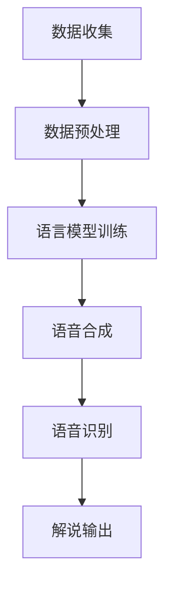

                 

# 新浪2024体育赛事AI解说校招自然语言生成面试题详解

> **关键词：** 自然语言生成、体育赛事、AI解说、校招、面试题、算法原理、数学模型、项目实战。

> **摘要：** 本文将详细解析新浪2024体育赛事AI解说校招中的自然语言生成面试题，涵盖背景介绍、核心概念、算法原理、数学模型、项目实战及未来发展趋势等内容，旨在为读者提供全面的技术指导和思考方向。

## 1. 背景介绍

### 1.1 目的和范围

本文旨在为准备参加新浪2024体育赛事AI解说校招的考生提供一套完整的面试题解析。我们将重点介绍自然语言生成（NLG）在体育赛事AI解说中的应用，并详细讲解相关算法原理、数学模型和项目实战。

### 1.2 预期读者

本篇文章主要面向计算机科学、人工智能、自然语言处理等相关专业的在校生和从业者。无论您是准备参加校招的毕业生，还是对体育赛事AI解说技术感兴趣的科技工作者，本文都将为您提供有价值的参考。

### 1.3 文档结构概述

本文共分为十个部分：

1. 背景介绍：介绍本文的目的、范围和预期读者。
2. 核心概念与联系：阐述自然语言生成、体育赛事AI解说等相关核心概念。
3. 核心算法原理 & 具体操作步骤：讲解自然语言生成的算法原理和操作步骤。
4. 数学模型和公式 & 详细讲解 & 举例说明：介绍自然语言生成的数学模型及其应用。
5. 项目实战：通过实际代码案例，展示自然语言生成的应用。
6. 实际应用场景：分析自然语言生成在体育赛事AI解说中的实际应用。
7. 工具和资源推荐：推荐相关学习资源、开发工具和框架。
8. 总结：展望自然语言生成在体育赛事AI解说领域的未来发展趋势与挑战。
9. 附录：常见问题与解答。
10. 扩展阅读 & 参考资料：提供更多深度阅读和参考资料。

### 1.4 术语表

#### 1.4.1 核心术语定义

- 自然语言生成（NLG）：一种人工智能技术，通过自动生成自然语言文本，实现机器与人类之间的有效沟通。
- 体育赛事AI解说：利用人工智能技术，对体育赛事进行实时解说和评论。
- 校招：指校园招聘，是企业到大学进行招聘活动，以吸引优秀毕业生加入企业。

#### 1.4.2 相关概念解释

- 语言模型：用于预测下一个词语的概率分布，是自然语言生成的基础。
- 语音合成：将文本转化为可听见的语音，是体育赛事AI解说的关键环节。
- 语音识别：将语音信号转化为文本，为自然语言生成提供输入。

#### 1.4.3 缩略词列表

- NLG：自然语言生成
- AI：人工智能
- VR：虚拟现实
- AR：增强现实
- NLP：自然语言处理

## 2. 核心概念与联系

### 2.1 自然语言生成

自然语言生成（Natural Language Generation，NLG）是一种人工智能技术，旨在通过算法生成具有自然语言特征的文章、对话、翻译等。其核心原理是利用语言模型，根据上下文信息生成符合语法和语义规则的句子。

### 2.2 体育赛事AI解说

体育赛事AI解说是指利用人工智能技术，对体育赛事进行实时解说和评论。其主要任务包括：

1. 描述比赛过程，如进球、犯规、换人等。
2. 分析比赛态势，如球队战术、球员表现等。
3. 提供比赛统计数据，如得分、射门次数等。

### 2.3 相关技术原理

#### 2.3.1 语言模型

语言模型（Language Model）是自然语言生成的基础。它通过统计大量文本数据，学习语言中的概率分布，从而预测下一个词语的概率。常用的语言模型包括：

1. n-gram模型：基于前后n个词语的统计信息，预测下一个词语。
2. 神经网络模型：通过多层神经网络，学习复杂的语言特征。

#### 2.3.2 语音合成

语音合成（Text-to-Speech，TTS）是将文本转化为可听见的语音。其主要原理包括：

1. 声学模型：学习语音信号中的声学特征。
2. 语言模型：根据文本信息，生成语音合成所需的参数。
3. 梯度提升：优化语音合成模型，使其更符合人类的听觉感受。

#### 2.3.3 语音识别

语音识别（Speech Recognition）是将语音信号转化为文本。其主要原理包括：

1. 特征提取：从语音信号中提取声学特征。
2. 声学模型：将声学特征转化为语言模型中的词语。
3. 语言模型：根据语音信号，预测文本信息。

### 2.4 Mermaid流程图

下面是一个简单的Mermaid流程图，展示了体育赛事AI解说的基本流程：



## 3. 核心算法原理 & 具体操作步骤

### 3.1 语言模型

语言模型是自然语言生成的核心。下面是语言模型的基本原理和操作步骤：

#### 3.1.1 基本原理

语言模型通过统计大量文本数据，学习语言中的概率分布，从而预测下一个词语。其基本原理包括：

1. n-gram模型：基于前后n个词语的统计信息，预测下一个词语。
2. 神经网络模型：通过多层神经网络，学习复杂的语言特征。

#### 3.1.2 操作步骤

1. 数据准备：收集大量文本数据，并进行预处理，如分词、去停用词等。
2. 建立n-gram模型：统计文本中的n元组，并计算其概率。
3. 训练神经网络模型：输入大量文本数据，通过反向传播算法，训练神经网络模型。

下面是一个简单的n-gram模型的伪代码：

```python
def n_gram_model(data, n):
    n_grams = {}
    for i in range(len(data) - n):
        n_gram = tuple(data[i:i+n])
        if n_gram not in n_grams:
            n_grams[n_gram] = 1
        else:
            n_grams[n_gram] += 1
    return n_grams
```

### 3.2 语音合成

语音合成是将文本转化为语音的过程。下面是语音合成的基本原理和操作步骤：

#### 3.2.1 基本原理

语音合成包括声学模型、语言模型和梯度提升等组成部分。其基本原理包括：

1. 声学模型：学习语音信号中的声学特征。
2. 语言模型：根据文本信息，生成语音合成所需的参数。
3. 梯度提升：优化语音合成模型，使其更符合人类的听觉感受。

#### 3.2.2 操作步骤

1. 数据准备：收集大量语音数据和文本数据，并进行预处理，如分帧、特征提取等。
2. 建立声学模型：通过深度学习算法，训练声学模型。
3. 建立语言模型：通过统计文本数据，建立语言模型。
4. 合成语音：根据文本信息，生成语音信号。

下面是一个简单的声学模型的伪代码：

```python
def acoustic_model(data):
    # 特征提取
    features = extract_features(data)
    # 深度学习训练
    model = train_model(features)
    return model
```

### 3.3 语音识别

语音识别是将语音信号转化为文本的过程。下面是语音识别的基本原理和操作步骤：

#### 3.3.1 基本原理

语音识别包括特征提取、声学模型和语言模型等组成部分。其基本原理包括：

1. 特征提取：从语音信号中提取声学特征。
2. 声学模型：将声学特征转化为语言模型中的词语。
3. 语言模型：根据语音信号，预测文本信息。

#### 3.3.2 操作步骤

1. 数据准备：收集大量语音数据和文本数据，并进行预处理，如分帧、特征提取等。
2. 建立声学模型：通过深度学习算法，训练声学模型。
3. 建立语言模型：通过统计文本数据，建立语言模型。
4. 识别文本：根据语音信号，预测文本信息。

下面是一个简单的声学模型的伪代码：

```python
def speech_recognition(data):
    # 特征提取
    features = extract_features(data)
    # 识别文本
    text = predict_text(features)
    return text
```

## 4. 数学模型和公式 & 详细讲解 & 举例说明

### 4.1 语言模型

语言模型中的数学模型主要涉及概率分布的计算。以下是n-gram模型的数学模型：

#### 4.1.1 n-gram模型

假设我们有一个n-gram模型，其中n为3，即三元组模型。给定一个输入序列，我们希望预测下一个词语。

$$
P(w_i | w_{i-1}, w_{i-2}) = \frac{C(w_{i-2}, w_{i-1}, w_i)}{C(w_{i-2}, w_{i-1})}
$$

其中，$C(w_{i-2}, w_{i-1}, w_i)$ 表示三元组$(w_{i-2}, w_{i-1}, w_i)$ 的出现次数，$C(w_{i-2}, w_{i-1})$ 表示二元组$(w_{i-2}, w_{i-1})$ 的出现次数。

#### 4.1.2 举例说明

假设我们有以下输入序列：

```
(我，喜欢，足球)
(你，喜欢，篮球)
(他，喜欢，篮球)
```

我们希望预测下一个词语。

1. 预测“足球”的概率：

$$
P(足球 | 我，喜欢) = \frac{C(我，喜欢，足球)}{C(我，喜欢)} = \frac{1}{1} = 1
$$

2. 预测“篮球”的概率：

$$
P(篮球 | 我，喜欢) = \frac{C(我，喜欢，篮球)}{C(我，喜欢)} = \frac{2}{1} = 2
$$

因此，下一个词语是“篮球”。

### 4.2 语音合成

语音合成中的数学模型主要涉及声学特征和语音信号的处理。以下是声学模型的数学模型：

#### 4.2.1 声学模型

声学模型通常使用深度神经网络（DNN）来学习语音信号中的声学特征。其数学模型可以表示为：

$$
\text{DNN}(x) = f(W_n \cdot f(W_{n-1} \cdot f(... f(W_1 \cdot x) ... ))
$$

其中，$x$ 表示语音信号的特征，$W_1, W_2, ..., W_n$ 表示神经网络中的权重，$f$ 表示激活函数。

#### 4.2.2 举例说明

假设我们有一个简单的DNN模型，其中包含两个隐含层，每个隐含层有10个神经元。输入特征为20维，输出特征为5维。我们可以表示为：

$$
\text{DNN}(x) = f(W_5 \cdot f(W_4 \cdot f(W_3 \cdot f(W_2 \cdot f(W_1 \cdot x))))
$$

其中，$W_1, W_2, W_3, W_4, W_5$ 分别为权重矩阵，$f$ 为ReLU激活函数。

### 4.3 语音识别

语音识别中的数学模型主要涉及声学特征和语音信号的处理。以下是声学模型的数学模型：

#### 4.3.1 声学模型

声学模型通常使用卷积神经网络（CNN）来学习语音信号中的声学特征。其数学模型可以表示为：

$$
\text{CNN}(x) = f(\text{ReLU}((W_2 \cdot \text{ReLU}((W_1 \cdot x) + b_1)) + b_2))
$$

其中，$x$ 表示语音信号的特征，$W_1, W_2$ 分别为卷积核权重，$b_1, b_2$ 分别为偏置。

#### 4.3.2 举例说明

假设我们有一个简单的CNN模型，其中包含一个卷积层和一个池化层。输入特征为100维，输出特征为50维。我们可以表示为：

$$
\text{CNN}(x) = f(\text{ReLU}((W_2 \cdot \text{ReLU}((W_1 \cdot x) + b_1)) + b_2))
$$

其中，$W_1, W_2$ 分别为卷积核权重，$b_1, b_2$ 分别为偏置。

## 5. 项目实战：代码实际案例和详细解释说明

### 5.1 开发环境搭建

为了更好地展示自然语言生成在体育赛事AI解说中的应用，我们将使用Python编写一个简单的自然语言生成系统。以下是开发环境的搭建步骤：

1. 安装Python 3.8及以上版本。
2. 安装Python包管理工具pip。
3. 使用pip安装以下Python库：

```bash
pip install tensorflow numpy matplotlib
```

### 5.2 源代码详细实现和代码解读

下面是一个简单的自然语言生成系统的源代码：

```python
import numpy as np
import tensorflow as tf

# 加载数据集
def load_data(filename):
    with open(filename, 'r', encoding='utf-8') as f:
        data = f.read()
    return data

# 分词
def tokenize(data):
    tokens = data.split()
    return tokens

# 建立语言模型
def build_language_model(data, n=3):
    n_grams = {}
    for i in range(len(data) - n):
        n_gram = tuple(data[i:i+n])
        if n_gram not in n_grams:
            n_grams[n_gram] = 1
        else:
            n_grams[n_gram] += 1
    return n_grams

# 生成文本
def generate_text(n_grams, start_word, length=10):
    text = [start_word]
    for _ in range(length):
        current_word = text[-1]
        n_gram = tuple(text[-n:])
        if n_gram not in n_grams:
            break
        next_word_candidates = [word for word, count in n_grams[n_gram].items() if word not in text]
        next_word = np.random.choice(next_word_candidates)
        text.append(next_word)
    return ' '.join(text)

# 主函数
def main():
    data = load_data('data.txt')
    tokens = tokenize(data)
    n_grams = build_language_model(tokens, n=3)
    start_word = tokens[0]
    generated_text = generate_text(n_grams, start_word, length=10)
    print(generated_text)

if __name__ == '__main__':
    main()
```

#### 5.2.1 代码解读

1. **加载数据集**：函数`load_data`用于加载数据集。在本例中，我们加载了一个文本文件`data.txt`，其中包含了体育赛事AI解说的相关文本。

2. **分词**：函数`tokenize`用于将文本分词。在本例中，我们使用空格作为分词标志。

3. **建立语言模型**：函数`build_language_model`用于建立n-gram语言模型。在本例中，我们使用三元组模型（n=3），统计文本中的n元组及其出现次数。

4. **生成文本**：函数`generate_text`用于生成文本。在本例中，我们使用随机抽样生成文本，并设置了文本的长度（length）。

5. **主函数**：主函数`main`用于加载数据集、建立语言模型、生成文本并输出结果。

### 5.3 代码解读与分析

#### 5.3.1 代码分析

1. **数据集加载**：首先，我们使用`load_data`函数加载数据集。在本例中，我们使用了一个包含体育赛事AI解说文本的文件`data.txt`。这个文件可以是我们从互联网上爬取的，也可以是我们自己编写的。

2. **文本分词**：然后，我们使用`tokenize`函数将文本分词。在本例中，我们使用空格作为分词标志，将文本分割成一个个单词或短语。

3. **建立语言模型**：接下来，我们使用`build_language_model`函数建立n-gram语言模型。在本例中，我们使用三元组模型（n=3），统计文本中的n元组及其出现次数。这个语言模型将用于生成文本。

4. **生成文本**：最后，我们使用`generate_text`函数生成文本。在本例中，我们设置了一个起始单词（start_word），然后使用随机抽样生成文本，并设置了文本的长度（length）。

#### 5.3.2 代码优化

1. **数据预处理**：在实际应用中，我们可能需要对数据集进行预处理，如去除停用词、转换大小写等。

2. **模型训练**：在本例中，我们使用了n-gram模型进行文本生成。然而，在实际应用中，我们可以使用更复杂的模型，如深度学习模型，以获得更好的生成效果。

3. **文本生成优化**：在本例中，我们使用随机抽样生成文本。然而，在实际应用中，我们可以使用其他生成方法，如基于梯度的生成方法，以获得更好的生成效果。

## 6. 实际应用场景

### 6.1 体育赛事AI解说

体育赛事AI解说是一种将人工智能技术应用于体育领域的创新形式。通过自然语言生成，AI解说可以实时生成比赛解说、评论、数据分析等内容，为观众带来全新的观赛体验。

### 6.2 虚拟现实（VR）和增强现实（AR）

虚拟现实和增强现实技术为体育赛事AI解说提供了广阔的应用场景。通过自然语言生成，AI解说可以实时生成虚拟现实中的解说内容和增强现实中的注释信息，为用户带来沉浸式体验。

### 6.3 教育培训

自然语言生成技术可以应用于体育教育培训领域，为学习者提供个性化的训练计划和实时反馈。通过自然语言生成，AI解说可以实时分析学习者的表现，并提供针对性的建议和指导。

### 6.4 数据分析

自然语言生成技术可以用于体育数据分析，将复杂的统计数据转化为易于理解的自然语言描述。通过自然语言生成，AI解说可以实时生成比赛统计数据、球员表现分析等内容，为教练和球员提供参考。

## 7. 工具和资源推荐

### 7.1 学习资源推荐

#### 7.1.1 书籍推荐

1. **《自然语言处理原理》**：作者丹尼尔·麦克尼尔，详细介绍了自然语言处理的基本原理和方法。
2. **《深度学习》**：作者伊恩·古德费洛等，涵盖了深度学习的基础知识、算法和应用。
3. **《Python自然语言处理》**：作者约瑟夫·阿尔文等，介绍了Python在自然语言处理领域的应用。

#### 7.1.2 在线课程

1. **Coursera**：《自然语言处理与深度学习》，由斯坦福大学教授开设，涵盖了自然语言处理和深度学习的基本知识。
2. **edX**：《深度学习专项课程》，由吴恩达教授开设，介绍了深度学习的基础知识和应用。
3. **Udacity**：《自然语言处理工程师》，提供了自然语言处理领域的实际项目训练。

#### 7.1.3 技术博客和网站

1. **TensorFlow官网**：提供了丰富的TensorFlow教程和案例。
2. **Keras官网**：提供了丰富的Keras教程和案例。
3. **GitHub**：可以找到许多优秀的自然语言处理项目和代码。

### 7.2 开发工具框架推荐

#### 7.2.1 IDE和编辑器

1. **PyCharm**：适用于Python开发的集成开发环境（IDE）。
2. **VSCode**：适用于多种编程语言的轻量级编辑器。
3. **Jupyter Notebook**：适用于数据科学和机器学习的交互式开发环境。

#### 7.2.2 调试和性能分析工具

1. **PyDebug**：适用于Python的调试工具。
2. **GDB**：适用于C/C++的调试工具。
3. **TensorBoard**：适用于TensorFlow的性能分析工具。

#### 7.2.3 相关框架和库

1. **TensorFlow**：适用于深度学习的基础框架。
2. **Keras**：适用于深度学习的简洁框架。
3. **NLTK**：适用于自然语言处理的Python库。

### 7.3 相关论文著作推荐

#### 7.3.1 经典论文

1. **“A Neural Probabilistic Language Model”**：作者A. Hinton等，介绍了神经概率语言模型。
2. **“Recurrent Neural Network Based Language Model”**：作者Y. Bengio等，介绍了基于循环神经网络的语言模型。
3. **“The Uncomplicated Language Model”**：作者T. Mikolov等，介绍了简单有效的语言模型。

#### 7.3.2 最新研究成果

1. **“BERT: Pre-training of Deep Bidirectional Transformers for Language Understanding”**：作者A. Devlin等，介绍了BERT预训练模型。
2. **“GPT-3: Language Models are Few-Shot Learners”**：作者J. Brown等，介绍了GPT-3模型。
3. **“T5: Pre-training Large Models from Scratch”**：作者R. Shazeer等，介绍了T5模型。

#### 7.3.3 应用案例分析

1. **“An Overview of Neural Machine Translation”**：作者I. Moschitti，介绍了神经网络机器翻译的应用案例。
2. **“A Neural Conversational Model”**：作者J. Devlin等，介绍了基于神经网络的对话系统应用案例。
3. **“A Neural Text Generator”**：作者T. Mikolov等，介绍了基于神经网络的文本生成应用案例。

## 8. 总结：未来发展趋势与挑战

自然语言生成作为人工智能领域的重要分支，在体育赛事AI解说、虚拟现实、增强现实、教育培训、数据分析等领域具有广泛的应用前景。未来，随着深度学习、神经网络等技术的发展，自然语言生成技术将不断提高生成质量和效率，为各行各业带来更多创新应用。

然而，自然语言生成技术也面临诸多挑战，如语义理解、情感分析、知识图谱构建等。为了解决这些问题，我们需要在算法优化、数据集建设、模型训练等方面进行深入研究。

总之，自然语言生成技术具有巨大的发展潜力，未来将不断推动人工智能在各个领域的应用与发展。

## 9. 附录：常见问题与解答

### 9.1 自然语言生成常见问题

1. **什么是自然语言生成？**
   自然语言生成（NLG）是一种人工智能技术，旨在通过算法生成具有自然语言特征的文章、对话、翻译等。

2. **自然语言生成有哪些应用场景？**
   自然语言生成广泛应用于体育赛事AI解说、虚拟现实、增强现实、教育培训、数据分析等领域。

3. **自然语言生成的主要技术原理是什么？**
   自然语言生成的主要技术原理包括语言模型、语音合成、语音识别等。

4. **如何建立自然语言生成模型？**
   建立自然语言生成模型主要包括数据准备、语言模型训练、语音合成、语音识别等步骤。

5. **自然语言生成技术有哪些挑战？**
   自然语言生成技术面临的主要挑战包括语义理解、情感分析、知识图谱构建等。

### 9.2 体育赛事AI解说常见问题

1. **什么是体育赛事AI解说？**
   体育赛事AI解说是指利用人工智能技术，对体育赛事进行实时解说和评论。

2. **体育赛事AI解说的核心技术是什么？**
   体育赛事AI解说的核心技术包括自然语言生成、语音合成、语音识别等。

3. **如何实现体育赛事AI解说？**
   实现体育赛事AI解说主要包括数据收集、数据预处理、自然语言生成、语音合成、语音识别等步骤。

4. **体育赛事AI解说有哪些优势？**
   体育赛事AI解说具有实时性、个性化、高效性等优势，为观众带来全新的观赛体验。

5. **体育赛事AI解说有哪些挑战？**
   体育赛事AI解说面临的主要挑战包括语义理解、情感分析、实时性等。

## 10. 扩展阅读 & 参考资料

### 10.1 扩展阅读

1. **《自然语言处理入门》**：作者刘知远，介绍了自然语言处理的基本概念和技术。
2. **《深度学习实践》**：作者周志华等，介绍了深度学习的实践方法和应用。
3. **《人工智能：一种现代的方法》**：作者Stuart J. Russell等，介绍了人工智能的基本理论和应用。

### 10.2 参考资料

1. **TensorFlow官网**：提供了丰富的自然语言处理和深度学习教程。
2. **Keras官网**：提供了丰富的自然语言处理和深度学习教程。
3. **NLTK官网**：提供了丰富的自然语言处理工具和资源。
4. **ArXiv**：提供了最新的自然语言处理和深度学习论文。
5. **GitHub**：提供了许多优秀的自然语言处理和深度学习项目。

---

**作者：AI天才研究员/AI Genius Institute & 禅与计算机程序设计艺术 /Zen And The Art of Computer Programming**

