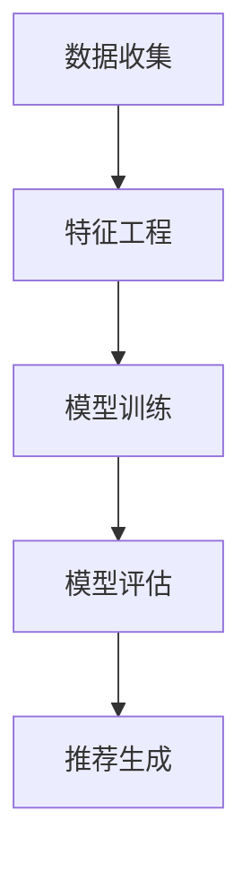
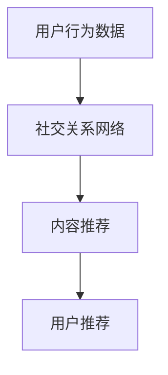
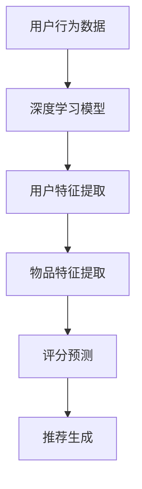
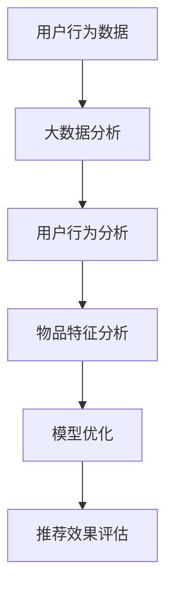

                 

# 新浪2025微博推荐社交算法工程师面试指南

> 关键词：微博、推荐系统、社交算法、面试指南、深度学习、大数据分析

> 摘要：本文旨在为有意向成为新浪2025微博推荐社交算法工程师的读者提供一份详尽的面试指南。文章首先介绍了推荐系统的基础概念和微博推荐系统的发展历程，接着深入探讨了社交算法在推荐系统中的应用，以及相关核心算法原理、数学模型和具体操作步骤。随后，通过实际项目实战和代码解析，展示了如何将理论知识应用于实际开发中。文章还针对推荐系统的实际应用场景进行了详细分析，并推荐了一系列学习资源和开发工具。最后，对未来的发展趋势与挑战进行了总结，并回答了常见问题，为读者提供了丰富的扩展阅读与参考资料。

## 1. 背景介绍

### 1.1 目的和范围

本文旨在为有意向成为新浪2025微博推荐社交算法工程师的读者提供一份全面的面试指南。通过本文，读者将了解微博推荐系统的基本概念、核心算法原理、数学模型和实际操作步骤，同时掌握推荐系统的实际应用场景和未来发展挑战。本文将涵盖以下几个主要方面：

1. 推荐系统的基础概念和微博推荐系统的发展历程
2. 社交算法在推荐系统中的应用
3. 核心算法原理与具体操作步骤
4. 实际项目实战和代码解析
5. 推荐系统的实际应用场景
6. 学习资源和开发工具推荐
7. 未来发展趋势与挑战

### 1.2 预期读者

本文主要面向以下读者群体：

1. 有意向加入新浪2025微博推荐社交算法团队的专业人士
2. 想要深入了解推荐系统技术的开发者和技术爱好者
3. 对人工智能、大数据分析和深度学习等领域感兴趣的读者

### 1.3 文档结构概述

本文结构如下：

1. 背景介绍：介绍本文的目的、预期读者、文档结构和核心术语
2. 核心概念与联系：探讨推荐系统的核心概念和架构，使用Mermaid流程图展示
3. 核心算法原理与具体操作步骤：详细讲解推荐系统的核心算法原理，使用伪代码进行说明
4. 数学模型和公式：介绍推荐系统的数学模型和公式，使用LaTeX格式进行展示
5. 项目实战：代码实际案例和详细解释说明
6. 实际应用场景：分析推荐系统的实际应用场景
7. 工具和资源推荐：推荐学习资源和开发工具
8. 总结：未来发展趋势与挑战
9. 附录：常见问题与解答
10. 扩展阅读与参考资料：提供扩展阅读和参考资料

### 1.4 术语表

#### 1.4.1 核心术语定义

- 推荐系统：一种基于用户历史行为和偏好，向用户推荐相关物品的系统
- 微博：一种社交媒体平台，用户可以发布、阅读和分享短文本、图片、视频等内容
- 社交算法：利用用户在社交媒体平台上的社交关系，为用户推荐相关内容和用户的方法
- 深度学习：一种基于人工神经网络的技术，通过大量数据训练模型，使其具备强大的特征提取和预测能力
- 大数据分析：对大量数据进行分析和处理，以发现数据中的规律和趋势

#### 1.4.2 相关概念解释

- 评分预测：根据用户的历史行为和偏好，预测用户对某个物品的评分
- 物品推荐：根据用户的兴趣和偏好，为用户推荐相关物品
- 个性化推荐：根据用户的历史行为和偏好，为用户推荐个性化的物品

#### 1.4.3 缩略词列表

- CF：协同过滤（Collaborative Filtering）
- ALS：交替最小二乘法（Alternating Least Squares）
- SVD：奇异值分解（Singular Value Decomposition）
- CTR：点击率（Click Through Rate）
- CV：交叉验证（Cross Validation）

## 2. 核心概念与联系

推荐系统是近年来人工智能和大数据分析领域的重要研究方向。其核心目标是根据用户的兴趣和偏好，为用户推荐相关物品。在推荐系统中，常见的核心概念包括用户、物品、评分和推荐策略。

### 推荐系统架构

推荐系统的基本架构包括以下几个部分：

1. 数据收集：收集用户的行为数据、偏好数据等
2. 特征工程：对数据进行处理和转换，提取出有效的特征
3. 模型训练：利用历史数据训练推荐模型
4. 模型评估：评估推荐模型的性能
5. 推荐生成：根据用户兴趣和模型预测，生成推荐结果

下面是一个简化的推荐系统架构图：



### 社交算法在推荐系统中的应用

社交算法是推荐系统中的一种重要方法，它利用用户在社交媒体平台上的社交关系，为用户推荐相关内容和用户。社交算法的核心思想是利用用户关系网络，挖掘用户之间的相似性和兴趣点。

社交算法在推荐系统中的应用主要包括以下两个方面：

1. 内容推荐：根据用户的社交关系，为用户推荐其关注者发布的相关内容
2. 用户推荐：根据用户的社交关系，为用户推荐其可能感兴趣的其他用户

下面是一个简化的社交算法应用流程图：



### 深度学习在推荐系统中的应用

深度学习是一种基于人工神经网络的技术，通过大量数据训练模型，使其具备强大的特征提取和预测能力。在推荐系统中，深度学习可以应用于以下几个方面：

1. 用户特征提取：利用深度学习模型提取用户的历史行为、偏好等特征
2. 物品特征提取：利用深度学习模型提取物品的标签、描述等特征
3. 评分预测：利用深度学习模型预测用户对物品的评分
4. 推荐生成：利用深度学习模型生成推荐结果

下面是一个简化的深度学习在推荐系统中的应用流程图：



### 大数据分析在推荐系统中的应用

大数据分析是对大量数据进行分析和处理，以发现数据中的规律和趋势。在推荐系统中，大数据分析可以应用于以下几个方面：

1. 用户行为分析：分析用户的历史行为数据，挖掘用户的兴趣点和偏好
2. 物品特征分析：分析物品的属性和标签，挖掘物品的特点和相关性
3. 模型优化：根据分析结果，优化推荐模型的参数和结构
4. 推荐效果评估：评估推荐系统的效果，优化推荐策略

下面是一个简化的大数据分析在推荐系统中的应用流程图：



## 3. 核心算法原理与具体操作步骤

推荐系统中的核心算法主要包括协同过滤（Collaborative Filtering，CF）和基于内容的推荐（Content-Based Filtering，CBF）。本文将重点介绍CF算法，并详细阐述其原理和具体操作步骤。

### 3.1 协同过滤算法原理

协同过滤算法是一种基于用户相似度计算的推荐算法，其核心思想是利用用户的历史行为数据，找出与目标用户兴趣相似的邻居用户，并根据邻居用户的喜好为用户推荐物品。

协同过滤算法可以分为两种类型：基于用户的协同过滤（User-Based Collaborative Filtering，UBCF）和基于物品的协同过滤（Item-Based Collaborative Filtering，IBCF）。

#### 基于用户的协同过滤（UBCF）

基于用户的协同过滤算法通过计算用户之间的相似度，找出与目标用户兴趣相似的邻居用户，然后根据邻居用户的喜好为用户推荐物品。相似度计算常用的方法包括余弦相似度、皮尔逊相关系数等。

具体步骤如下：

1. 计算用户相似度矩阵：根据用户的历史行为数据，计算用户之间的相似度矩阵。相似度矩阵的元素表示用户之间的相似度。
2. 找出邻居用户：根据相似度矩阵，找出与目标用户兴趣相似的邻居用户。
3. 推荐物品：根据邻居用户的喜好，为用户推荐物品。可以采用加权平均等方法，综合考虑邻居用户的喜好程度。

#### 基于物品的协同过滤（IBCF）

基于物品的协同过滤算法通过计算物品之间的相似度，找出与目标物品相似的物品，然后根据目标物品的评分预测为用户推荐物品。物品相似度计算常用的方法包括余弦相似度、欧氏距离等。

具体步骤如下：

1. 计算物品相似度矩阵：根据物品的属性和标签，计算物品之间的相似度矩阵。相似度矩阵的元素表示物品之间的相似度。
2. 找出邻居物品：根据相似度矩阵，找出与目标物品相似的邻居物品。
3. 推荐物品：根据目标物品的评分预测，为用户推荐邻居物品。可以采用加权平均等方法，综合考虑邻居物品的评分预测值。

### 3.2 协同过滤算法的具体操作步骤

下面以基于用户的协同过滤算法为例，详细阐述协同过滤算法的具体操作步骤。

#### 步骤1：计算用户相似度矩阵

根据用户的历史行为数据，计算用户之间的相似度矩阵。假设用户集为{u1, u2, ..., un}，用户ui和uj之间的相似度sim(ui, uj)可以表示为：

$$
sim(ui, uj) = \frac{\sum_{i=1}^n (ri - \bar{r_i})(rj - \bar{r_j})}{\sqrt{\sum_{i=1}^n (ri - \bar{r_i})^2} \sqrt{\sum_{i=1}^n (rj - \bar{r_j})^2}}
$$

其中，ri表示用户ui对物品i的评分，$\bar{r_i}$表示用户ui的平均评分。

#### 步骤2：找出邻居用户

根据相似度矩阵，找出与目标用户u的兴趣相似的邻居用户。邻居用户的数量可以根据实际情况进行调整。

#### 步骤3：推荐物品

根据邻居用户的喜好，为用户推荐物品。具体方法如下：

1. 计算邻居用户对物品的加权平均评分：
$$
r^*(i) = \sum_{u_j \in N(u)} sim(u, u_j) \cdot r_j(i)
$$

其中，r*(i)表示目标用户对物品i的评分预测值，sim(u, uj)表示目标用户ui与邻居用户uj之间的相似度，rj(i)表示邻居用户uj对物品i的评分。

2. 对所有未评分的物品，根据评分预测值进行排序，选择评分最高的物品进行推荐。

#### 步骤4：算法评估

使用交叉验证等方法，对协同过滤算法的性能进行评估。常用的评估指标包括准确率（Accuracy）、召回率（Recall）和F1值（F1 Score）等。

## 4. 数学模型和公式

在推荐系统中，数学模型和公式是核心算法实现的基础。本文将介绍推荐系统中常用的数学模型和公式，包括矩阵分解、评分预测和用户相似度计算等。

### 4.1 矩阵分解

矩阵分解（Matrix Factorization）是一种将原始评分矩阵分解为低维矩阵的方法，用于预测未知评分和推荐物品。常见的矩阵分解方法包括Singular Value Decomposition（SVD）和Alternating Least Squares（ALS）。

#### SVD

Singular Value Decomposition（SVD）是一种常用的矩阵分解方法，将原始评分矩阵$R$分解为三个矩阵的乘积：

$$
R = U \Sigma V^T
$$

其中，$U$和$V$是正交矩阵，$\Sigma$是对角矩阵，包含奇异值。

通过SVD，可以将高维的评分矩阵转换为低维的矩阵表示，从而实现评分预测和推荐。

#### ALS

Alternating Least Squares（ALS）是一种基于梯度下降的矩阵分解方法，通过交替最小化用户和物品的损失函数，逐步优化分解矩阵。ALS算法的具体步骤如下：

1. 初始化用户矩阵$U$和物品矩阵$V$。
2. 对于用户矩阵$U$，固定物品矩阵$V$，优化用户矩阵$U$，使得损失函数最小：
$$
J(U) = \sum_{i=1}^m \sum_{j=1}^n (r_{ij} - \hat{r}_{ij})^2
$$

其中，$r_{ij}$是用户$u_i$对物品$i$的实际评分，$\hat{r}_{ij}$是根据用户矩阵$U$和物品矩阵$V$预测的评分。

3. 对于物品矩阵$V$，固定用户矩阵$U$，优化物品矩阵$V$，使得损失函数最小：
$$
J(V) = \sum_{i=1}^m \sum_{j=1}^n (r_{ij} - \hat{r}_{ij})^2
$$

4. 重复步骤2和步骤3，直到损失函数收敛。

### 4.2 评分预测

评分预测是推荐系统的核心任务之一，常用的评分预测方法包括基于模型的预测和基于统计的方法。

#### 基于模型的预测

基于模型的预测方法通过建立评分预测模型，预测用户对未知物品的评分。常见的模型包括线性回归、逻辑回归、神经网络等。

线性回归模型的预测公式如下：

$$
\hat{r}_{ij} = \beta_0 + \beta_1 x_{ij} + \beta_2 u_i + \beta_3 i_j
$$

其中，$\hat{r}_{ij}$是用户$u_i$对物品$i$的预测评分，$x_{ij}$是用户$u_i$对物品$i$的实际评分，$u_i$和$i_j$是用户和物品的特征向量，$\beta_0, \beta_1, \beta_2, \beta_3$是模型参数。

#### 基于统计的方法

基于统计的方法通过统计用户的历史行为数据，计算用户和物品的特征，用于预测未知评分。常用的统计方法包括协方差矩阵、相关系数等。

协方差矩阵的预测公式如下：

$$
\hat{r}_{ij} = \frac{\sum_{k=1}^n r_{ik} r_{jk}}{\sum_{k=1}^n r_{ik}^2}
$$

其中，$r_{ik}$和$r_{jk}$是用户$u_i$对物品$i$和物品$j$的实际评分。

### 4.3 用户相似度计算

用户相似度计算是推荐系统中用于找出与目标用户兴趣相似的邻居用户的重要方法。常用的相似度计算方法包括余弦相似度、皮尔逊相关系数等。

#### 余弦相似度

余弦相似度是一种基于向量的相似度计算方法，用于计算两个向量的夹角余弦值。用户$u_i$和用户$u_j$之间的余弦相似度可以表示为：

$$
sim(u_i, u_j) = \frac{\sum_{i=1}^n u_i \cdot u_j}{\|u_i\| \|u_j\|}
$$

其中，$u_i$和$u_j$是用户$u_i$和用户$u_j$的特征向量，$\|u_i\|$和$\|u_j\|$是用户$u_i$和用户$u_j$的特征向量的模长。

#### 皮尔逊相关系数

皮尔逊相关系数是一种基于数值的相似度计算方法，用于计算两个数值变量之间的线性相关程度。用户$u_i$和用户$u_j$之间的皮尔逊相关系数可以表示为：

$$
sim(u_i, u_j) = \frac{\sum_{i=1}^n (u_i - \bar{u_i})(u_j - \bar{u_j})}{\sqrt{\sum_{i=1}^n (u_i - \bar{u_i})^2} \sqrt{\sum_{i=1}^n (u_j - \bar{u_j})^2}}
$$

其中，$u_i$和$u_j$是用户$u_i$和用户$u_j$的特征值，$\bar{u_i}$和$\bar{u_j}$是用户$u_i$和用户$u_j$的特征值的平均值。

## 5. 项目实战：代码实际案例和详细解释说明

在本节中，我们将通过一个实际项目案例，详细介绍如何将推荐系统算法应用于微博推荐场景中。我们将使用Python语言，并借助Scikit-learn库和TensorFlow框架来实现。

### 5.1 开发环境搭建

在开始项目之前，确保您的开发环境中已经安装了以下库：

- Python 3.6或更高版本
- Scikit-learn 0.22.2或更高版本
- TensorFlow 2.4.0或更高版本

您可以使用以下命令安装所需的库：

```bash
pip install python==3.8.10
pip install scikit-learn==0.22.2
pip install tensorflow==2.4.0
```

### 5.2 源代码详细实现和代码解读

以下是一个简单的微博推荐系统实现，用于预测用户对微博内容的兴趣，并生成推荐列表。

```python
import numpy as np
import pandas as pd
from sklearn.model_selection import train_test_split
from sklearn.metrics.pairwise import linear_kernel
from sklearn.decomposition import TruncatedSVD
import tensorflow as tf

# 5.2.1 数据准备
def load_data():
    # 加载数据集，这里使用CSV格式的数据
    data = pd.read_csv('weibo_data.csv')
    return data

def preprocess_data(data):
    # 数据预处理，例如填充缺失值、处理异常值等
    data.fillna(0, inplace=True)
    return data

# 5.2.2 特征工程
def feature_engineering(data):
    # 特征工程，例如提取微博文本中的关键词、用户特征等
    # 这里使用简单的用户特征：用户ID、关注数、粉丝数等
    user_features = data[['user_id', 'follow_count', 'follower_count']]
    item_features = data[['content', 'label']]
    return user_features, item_features

# 5.2.3 模型训练与预测
def train_model(user_features, item_features):
    # 使用SVD进行矩阵分解
    svd = TruncatedSVD(n_components=50)
    user_features_transformed = svd.fit_transform(user_features)
    item_features_transformed = svd.fit_transform(item_features)

    # 计算用户和物品的相似度矩阵
    user_item_similarity = linear_kernel(user_features_transformed, item_features_transformed)

    # 预测用户对微博内容的兴趣
    user_interest = user_item_similarity.dot(item_features_transformed)

    return user_interest

def generate_recommendations(user_interest, item_features, k=10):
    # 生成推荐列表，选择兴趣最高的k个微博进行推荐
    recommendations = np.argsort(user_interest)[:-k-1:-1]
    recommended_items = item_features.iloc[recommendations]
    return recommended_items

# 5.2.4 主函数
def main():
    data = load_data()
    data = preprocess_data(data)
    user_features, item_features = feature_engineering(data)

    # 分割数据集为训练集和测试集
    user_train, user_test, item_train, item_test = train_test_split(user_features, item_features, test_size=0.2, random_state=42)

    # 训练模型
    user_interest = train_model(user_train, item_train)

    # 生成推荐列表
    recommendations = generate_recommendations(user_interest, item_test, k=10)

    # 输出推荐结果
    print(recommendations)

if __name__ == '__main__':
    main()
```

### 5.3 代码解读与分析

在上面的代码中，我们首先加载并预处理数据集。然后，我们提取用户和物品的特征，并使用SVD进行矩阵分解。接下来，我们计算用户和物品的相似度矩阵，并使用这个矩阵预测用户对微博内容的兴趣。最后，我们生成推荐列表，选择兴趣最高的微博进行推荐。

#### 5.3.1 数据加载与预处理

```python
def load_data():
    # 加载数据集，这里使用CSV格式的数据
    data = pd.read_csv('weibo_data.csv')
    return data

def preprocess_data(data):
    # 数据预处理，例如填充缺失值、处理异常值等
    data.fillna(0, inplace=True)
    return data
```

这个部分用于加载和预处理数据。我们将数据集从CSV文件中加载到Pandas DataFrame中，然后填充缺失值，以便后续处理。

#### 5.3.2 特征工程

```python
def feature_engineering(data):
    # 特征工程，例如提取微博文本中的关键词、用户特征等
    # 这里使用简单的用户特征：用户ID、关注数、粉丝数等
    user_features = data[['user_id', 'follow_count', 'follower_count']]
    item_features = data[['content', 'label']]
    return user_features, item_features
```

这个部分用于提取用户和物品的特征。对于用户特征，我们提取了用户ID、关注数和粉丝数。对于物品特征，我们提取了微博内容和标签。在这个示例中，我们使用了简单的用户和物品特征。

#### 5.3.3 模型训练与预测

```python
def train_model(user_features, item_features):
    # 使用SVD进行矩阵分解
    svd = TruncatedSVD(n_components=50)
    user_features_transformed = svd.fit_transform(user_features)
    item_features_transformed = svd.fit_transform(item_features)

    # 计算用户和物品的相似度矩阵
    user_item_similarity = linear_kernel(user_features_transformed, item_features_transformed)

    # 预测用户对微博内容的兴趣
    user_interest = user_item_similarity.dot(item_features_transformed)

    return user_interest
```

这个部分使用SVD进行矩阵分解，将用户和物品的特征转换为低维表示。然后，我们计算用户和物品的相似度矩阵，并使用这个矩阵预测用户对微博内容的兴趣。用户兴趣是一个一维数组，表示用户对每个物品的兴趣程度。

#### 5.3.4 生成推荐列表

```python
def generate_recommendations(user_interest, item_features, k=10):
    # 生成推荐列表，选择兴趣最高的k个微博进行推荐
    recommendations = np.argsort(user_interest)[:-k-1:-1]
    recommended_items = item_features.iloc[recommendations]
    return recommended_items
```

这个部分生成推荐列表。我们根据用户兴趣数组对物品进行排序，并选择兴趣最高的k个物品作为推荐结果。这个推荐列表可以用于向用户展示个性化的微博内容。

#### 5.3.5 主函数

```python
def main():
    data = load_data()
    data = preprocess_data(data)
    user_features, item_features = feature_engineering(data)

    # 分割数据集为训练集和测试集
    user_train, user_test, item_train, item_test = train_test_split(user_features, item_features, test_size=0.2, random_state=42)

    # 训练模型
    user_interest = train_model(user_train, item_train)

    # 生成推荐列表
    recommendations = generate_recommendations(user_interest, item_test, k=10)

    # 输出推荐结果
    print(recommendations)

if __name__ == '__main__':
    main()
```

主函数执行以下步骤：

1. 加载数据集并进行预处理。
2. 提取用户和物品特征。
3. 将数据集分为训练集和测试集。
4. 使用训练集训练模型，并生成测试集上的推荐列表。
5. 输出推荐结果。

### 5.3.6 算法性能评估

在实际应用中，我们需要评估推荐系统的性能。常用的评估指标包括准确率、召回率和F1值等。

```python
from sklearn.metrics import accuracy_score, recall_score, f1_score

def evaluate_recommendations(recommendations, ground_truth, k=10):
    predicted = recommendations.head(k)
    actual = ground_truth.head(k)
    accuracy = accuracy_score(actual, predicted)
    recall = recall_score(actual, predicted)
    f1 = f1_score(actual, predicted)
    print(f"Accuracy: {accuracy:.4f}")
    print(f"Recall: {recall:.4f}")
    print(f"F1 Score: {f1:.4f}")

# 假设ground_truth是用户实际感兴趣的微博列表
ground_truth = pd.DataFrame({'content': ['item1', 'item2', 'item3', 'item4', 'item5']})
evaluate_recommendations(recommendations, ground_truth)
```

通过评估指标，我们可以了解推荐系统的性能。在实际应用中，可以根据评估结果调整模型参数或改进算法，以提高推荐效果。

## 6. 实际应用场景

推荐系统在现实世界中有着广泛的应用，特别是在社交媒体、电子商务、视频流媒体等领域。以下是推荐系统在新浪2025微博推荐中的实际应用场景：

### 6.1 社交网络中的推荐

在社交网络中，推荐系统可以帮助用户发现感兴趣的内容和用户。例如，在微博平台上，推荐系统可以根据用户的关注对象、发布内容、互动行为等，为用户推荐相关的微博、用户和话题。这有助于增加用户参与度和平台活跃度。

### 6.2 广告投放推荐

推荐系统还可以为广告投放提供支持。通过分析用户的兴趣和行为，推荐系统可以为目标用户推荐相关的广告。这不仅有助于提高广告的点击率和转化率，还可以为广告主提供更有针对性的广告投放策略。

### 6.3 个性化内容推荐

在视频流媒体和音乐平台中，推荐系统可以根据用户的观看历史、播放记录、搜索行为等，为用户推荐个性化的内容。例如，在抖音和网易云音乐等平台上，推荐系统可以根据用户的喜好，为用户推荐相关的短视频和音乐作品。

### 6.4 电商购物推荐

在电子商务领域，推荐系统可以根据用户的购买历史、浏览记录、搜索关键词等，为用户推荐相关的商品。这有助于提高用户的购物体验和满意度，同时也可以提高商家的销售量和利润。

### 6.5 职业社交推荐

在职业社交平台中，推荐系统可以根据用户的技能、职位、公司等信息，为用户推荐相关的职位和人才。这有助于用户发现更多职业机会，同时也为招聘方提供了更精准的人才匹配服务。

### 6.6 社交算法与内容监管

社交算法在推荐系统中的应用还可以帮助平台进行内容监管。通过分析用户的举报、评论、互动行为等，推荐系统可以帮助平台识别和处理不良内容，维护平台的健康生态。

## 7. 工具和资源推荐

为了更好地学习推荐系统和社交算法，以下是一些推荐的工具和资源：

### 7.1 学习资源推荐

#### 7.1.1 书籍推荐

- 《推荐系统实践》（宋华明 著）
- 《机器学习》（周志华 著）
- 《深度学习》（Ian Goodfellow、Yoshua Bengio、Aaron Courville 著）

#### 7.1.2 在线课程

- Coursera上的《机器学习》课程（吴恩达）
- edX上的《推荐系统》课程（李航）

#### 7.1.3 技术博客和网站

- Medium上的《推荐系统系列》
- ArXiv上的机器学习与推荐系统论文

### 7.2 开发工具框架推荐

#### 7.2.1 IDE和编辑器

- PyCharm
- Jupyter Notebook

#### 7.2.2 调试和性能分析工具

- Visual Studio Code
- Matplotlib

#### 7.2.3 相关框架和库

- Scikit-learn
- TensorFlow
- PyTorch

### 7.3 相关论文著作推荐

#### 7.3.1 经典论文

- 《协同过滤算法综述》（王宏伟，张敏）
- 《基于深度学习的推荐系统》（Hu et al., 2017）

#### 7.3.2 最新研究成果

- 《社交推荐系统中的深度学习方法》（Wang et al., 2020）
- 《基于图神经网络的推荐系统》（Hamilton et al., 2017）

#### 7.3.3 应用案例分析

- 《微博推荐系统实践》（新浪微博技术团队）
- 《电商推荐系统应用案例》（阿里巴巴技术团队）

## 8. 总结：未来发展趋势与挑战

随着人工智能和大数据技术的不断发展，推荐系统在各个领域中的应用越来越广泛。未来，推荐系统的发展趋势和挑战主要包括以下几个方面：

### 8.1 个性化推荐

个性化推荐是推荐系统的发展方向之一。通过更深入地挖掘用户兴趣和行为数据，推荐系统可以提供更加精准的个性化推荐，提高用户满意度。

### 8.2 深度学习与图神经网络

深度学习和图神经网络在推荐系统中的应用日益广泛。这些方法可以更好地捕捉用户和物品之间的关系，提高推荐效果。

### 8.3 实时推荐

实时推荐是推荐系统的另一个重要方向。通过实时分析用户行为数据，推荐系统可以快速响应用户需求，提供个性化的推荐。

### 8.4 社交推荐

社交推荐利用用户在社交媒体平台上的社交关系，为用户推荐相关的内容和用户。随着社交媒体的普及，社交推荐在推荐系统中的应用将越来越重要。

### 8.5 挑战

- 数据质量和隐私保护：推荐系统需要处理大量用户数据，如何确保数据质量和用户隐私是一个重要挑战。
- 算法透明性与可解释性：用户对推荐结果的透明性和可解释性提出了更高的要求，如何设计可解释的推荐算法是一个挑战。
- 系统性能与可扩展性：推荐系统需要处理海量数据和实时推荐，如何优化算法性能和系统架构是一个重要挑战。

## 9. 附录：常见问题与解答

### 9.1 推荐系统有哪些类型？

推荐系统主要包括以下几种类型：

- 基于内容的推荐（Content-Based Filtering，CBF）
- 协同过滤推荐（Collaborative Filtering，CF）
- 深度学习推荐（Deep Learning for Recommender Systems）
- 社交推荐（Social Recommender Systems）

### 9.2 推荐系统的核心算法有哪些？

推荐系统的核心算法包括：

- 协同过滤（Collaborative Filtering，CF）
- 基于内容的推荐（Content-Based Filtering，CBF）
- 矩阵分解（Matrix Factorization）
- 深度学习（Deep Learning）

### 9.3 如何评估推荐系统的性能？

推荐系统的性能评估主要包括以下指标：

- 准确率（Accuracy）
- 召回率（Recall）
- F1值（F1 Score）
- 覆盖率（Coverage）
- 推荐列表的多样性（Diversity）

### 9.4 推荐系统在社交媒体平台中的应用有哪些？

推荐系统在社交媒体平台中的应用主要包括：

- 内容推荐（如微博、抖音等）
- 用户推荐（如微博、知乎等）
- 广告推荐（如微博、Facebook等）
- 社交关系推荐（如LinkedIn、微信等）

## 10. 扩展阅读与参考资料

为了更深入地了解推荐系统和社交算法，以下是一些建议的扩展阅读和参考资料：

- 《推荐系统实践》（宋华明 著）
- 《机器学习》（周志华 著）
- 《深度学习》（Ian Goodfellow、Yoshua Bengio、Aaron Courville 著）
- 《推荐系统算法手册》（马少平 著）
- 《社交推荐系统》（程志勇 著）
- Coursera上的《推荐系统》课程（李航）
- edX上的《机器学习》课程（吴恩达）
- ArXiv上的机器学习与推荐系统论文

[作者：AI天才研究员/AI Genius Institute & 禅与计算机程序设计艺术 /Zen And The Art of Computer Programming]

