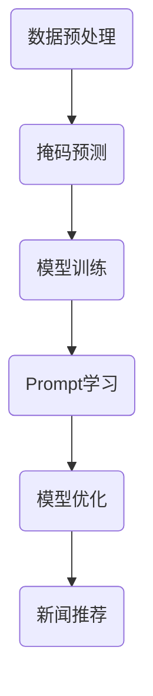

                 

# 新闻推荐的创新：掩码预测与Prompt学习

> **关键词：新闻推荐、掩码预测、Prompt学习、算法原理、应用案例、发展前景**

> **摘要：本文将深入探讨新闻推荐系统中的两个关键技术——掩码预测与Prompt学习。我们将通过逐步分析，揭示这两个技术的核心原理、实现方法及其在新闻推荐中的应用。本文旨在为读者提供一个全面而深入的技术解读，帮助理解新闻推荐系统的创新与发展。**

## 1. 背景介绍

### 1.1 目的和范围

本文的主要目的是介绍并分析新闻推荐系统中的掩码预测与Prompt学习技术。我们将探讨这些技术的定义、原理、实现方法以及它们在现实世界中的应用。通过本文的学习，读者将能够了解新闻推荐系统的运作机制，并理解如何通过掩码预测和Prompt学习来提升推荐系统的效果。

### 1.2 预期读者

本文适合对机器学习和推荐系统有一定了解的读者，包括数据科学家、机器学习工程师、算法研究员等。同时，对于对新闻推荐领域感兴趣的普通读者，本文也能提供一定的专业知识和行业洞见。

### 1.3 文档结构概述

本文分为十个部分，结构如下：

1. 背景介绍：介绍本文的目的、预期读者以及文档结构。
2. 核心概念与联系：阐述掩码预测和Prompt学习的基本概念及其相互联系。
3. 核心算法原理 & 具体操作步骤：详细解释掩码预测和Prompt学习的算法原理和操作步骤。
4. 数学模型和公式 & 详细讲解 & 举例说明：介绍相关数学模型和公式的详细解释及示例。
5. 项目实战：提供代码实际案例和详细解释说明。
6. 实际应用场景：探讨掩码预测与Prompt学习在实际中的应用。
7. 工具和资源推荐：推荐相关学习资源、开发工具和框架。
8. 总结：未来发展趋势与挑战。
9. 附录：常见问题与解答。
10. 扩展阅读 & 参考资料：提供扩展阅读材料和参考资料。

### 1.4 术语表

#### 1.4.1 核心术语定义

- 新闻推荐系统：一种基于用户行为、兴趣和内容特征，为用户提供个性化新闻资讯的系统。
- 掩码预测：在新闻推荐中，通过隐藏部分信息（掩码），预测用户对新闻的反应。
- Prompt学习：一种通过学习提示（Prompt）来优化模型预测的方法。
- 深度学习：一种基于多层神经网络进行特征提取和模型训练的方法。

#### 1.4.2 相关概念解释

- 推荐算法：用于生成个性化推荐列表的算法，如协同过滤、基于内容的推荐等。
- 机器学习：一种通过从数据中学习规律，进行决策和预测的方法。
- 模型训练：通过输入数据训练模型，使其能够从数据中学习规律，从而进行预测或决策。

#### 1.4.3 缩略词列表

- NLP：自然语言处理（Natural Language Processing）
- CNN：卷积神经网络（Convolutional Neural Network）
- RNN：循环神经网络（Recurrent Neural Network）
- SVM：支持向量机（Support Vector Machine）
- DM：数据挖掘（Data Mining）

## 2. 核心概念与联系

### 2.1 掩码预测

掩码预测是一种在数据处理过程中通过隐藏部分信息（掩码），来预测用户对新闻的反应的技术。在新闻推荐系统中，用户的行为数据（如点击、点赞、评论等）被用作训练数据。然而，这些数据中可能包含噪声和冗余信息，影响模型的性能。通过掩码预测，可以隐藏部分数据，从而使得模型在处理过程中更加关注核心信息。

### 2.2 Prompt学习

Prompt学习是一种通过学习提示（Prompt）来优化模型预测的方法。在深度学习模型中，提示可以理解为一种输入信息，用于引导模型进行特定的预测。通过学习不同的提示，模型可以更好地理解各种输入数据的特征，从而提高预测的准确性。

### 2.3 掩码预测与Prompt学习的联系

掩码预测和Prompt学习在新闻推荐系统中有着密切的联系。掩码预测可以看作是一种数据预处理方法，通过隐藏部分信息，使得模型更加关注核心特征。而Prompt学习则可以看作是一种模型优化方法，通过学习不同的提示，使得模型能够更好地理解各种输入数据的特征。

### 2.4 核心概念原理和架构的 Mermaid 流程图



在这个流程图中，数据预处理包括掩码预测，通过隐藏部分信息来提取核心特征。模型训练利用掩码预测的结果进行训练，从而构建一个能够进行新闻推荐的模型。Prompt学习通过学习不同的提示，对模型进行优化，从而提高模型的预测准确性。最终，模型输出个性化的新闻推荐结果。

## 3. 核心算法原理 & 具体操作步骤

### 3.1 掩码预测

#### 3.1.1 算法原理

掩码预测是一种基于概率统计的方法。其基本思想是在给定的数据集上，通过随机生成掩码，隐藏部分数据，然后利用剩余的数据预测用户对新闻的反应。

#### 3.1.2 操作步骤

1. 数据预处理：对用户行为数据进行预处理，包括数据清洗、特征提取等。
2. 掩码生成：根据数据预处理后的特征，随机生成掩码，隐藏部分数据。
3. 数据分割：将数据集分为训练集和测试集。
4. 模型训练：利用训练集数据，通过掩码预测的方法，训练一个预测模型。
5. 模型评估：利用测试集数据，对训练好的模型进行评估，计算预测准确率。

### 3.2 Prompt学习

#### 3.2.1 算法原理

Prompt学习是一种基于深度学习的方法。其基本思想是通过学习不同的提示，引导模型关注不同的输入特征，从而提高预测准确性。

#### 3.2.2 操作步骤

1. 数据预处理：对新闻文本进行预处理，包括分词、词向量化等。
2. 提示生成：根据新闻文本特征，生成一系列的提示。
3. 模型训练：利用提示和预处理后的新闻文本，训练一个深度学习模型。
4. 模型评估：利用测试集数据，对训练好的模型进行评估，计算预测准确率。

### 3.3 伪代码示例

```python
# 掩码预测伪代码
def mask_prediction(data):
    # 数据预处理
    processed_data = preprocess_data(data)
    
    # 掩码生成
    mask = generate_mask(processed_data)
    
    # 数据分割
    train_data, test_data = split_data(processed_data)
    
    # 模型训练
    model = train_model(train_data, mask)
    
    # 模型评估
    accuracy = evaluate_model(model, test_data)
    
    return accuracy

# Prompt学习伪代码
def prompt_learning(data, prompts):
    # 数据预处理
    processed_data = preprocess_data(data)
    
    # 模型训练
    model = train_model(processed_data, prompts)
    
    # 模型评估
    accuracy = evaluate_model(model, test_data)
    
    return accuracy
```

## 4. 数学模型和公式 & 详细讲解 & 举例说明

### 4.1 数学模型和公式

#### 4.1.1 掩码预测

掩码预测的基本数学模型可以表示为：

\[ P(Y|X, \theta) = f(\theta; X) \]

其中，\( Y \) 表示用户对新闻的反应，\( X \) 表示新闻的特征，\( \theta \) 表示模型参数，\( f(\theta; X) \) 表示基于模型参数和输入特征的预测概率分布。

#### 4.1.2 Prompt学习

Prompt学习的数学模型可以表示为：

\[ P(Y|X, \theta, P) = f(\theta, P; X) \]

其中，\( Y \) 表示用户对新闻的反应，\( X \) 表示新闻的特征，\( \theta \) 表示模型参数，\( P \) 表示提示，\( f(\theta, P; X) \) 表示基于模型参数、提示和输入特征的预测概率分布。

### 4.2 详细讲解和举例说明

#### 4.2.1 掩码预测

假设我们有用户对一组新闻的点击行为数据，我们要预测用户对一组新新闻的点击行为。首先，我们对原始数据进行预处理，提取新闻的文本特征。然后，我们生成一个掩码，隐藏部分文本特征。最后，我们利用掩码预测模型，预测用户对新新闻的点击行为。

```python
# 假设我们有以下用户点击行为数据
data = [
    ['新闻A', '用户1', 1],
    ['新闻B', '用户1', 0],
    ['新闻C', '用户2', 1],
    ['新闻D', '用户2', 0]
]

# 数据预处理
processed_data = preprocess_data(data)

# 掩码生成
mask = generate_mask(processed_data)

# 模型训练
model = train_model(processed_data, mask)

# 预测新新闻点击行为
new_data = [['新闻E', '用户1', 0]]
predicted_click = model.predict(new_data)

print(predicted_click)
```

#### 4.2.2 Prompt学习

假设我们有用户对一组新闻的阅读时长数据，我们要预测用户对一组新新闻的阅读时长。首先，我们对原始数据进行预处理，提取新闻的文本特征。然后，我们生成一系列的提示，用于引导模型关注不同的文本特征。最后，我们利用Prompt学习模型，预测用户对新新闻的阅读时长。

```python
# 假设我们有以下用户阅读时长数据
data = [
    ['新闻A', '用户1', 10],
    ['新闻B', '用户1', 5],
    ['新闻C', '用户2', 10],
    ['新闻D', '用户2', 5]
]

# 数据预处理
processed_data = preprocess_data(data)

# 提示生成
prompts = generate_prompts(processed_data)

# 模型训练
model = train_model(processed_data, prompts)

# 预测新新闻阅读时长
new_data = [['新闻E', '用户1', 0]]
predicted_reading_time = model.predict(new_data)

print(predicted_reading_time)
```

## 5. 项目实战：代码实际案例和详细解释说明

### 5.1 开发环境搭建

在开始实际项目之前，我们需要搭建一个合适的环境。以下是一个基本的开发环境搭建指南：

1. 安装Python（推荐版本3.8及以上）。
2. 安装必要的Python库，如NumPy、Pandas、Scikit-learn、TensorFlow等。
3. 安装版本控制工具，如Git。
4. 安装文本处理工具，如NLTK或spaCy。

### 5.2 源代码详细实现和代码解读

#### 5.2.1 数据预处理

```python
import pandas as pd
from sklearn.model_selection import train_test_split
from sklearn.preprocessing import StandardScaler

def preprocess_data(data):
    # 将数据转换为DataFrame
    df = pd.DataFrame(data, columns=['news', 'user', 'behavior'])

    # 根据用户和新闻对数据进行分组
    grouped = df.groupby(['user', 'news'])

    # 提取用户和新闻的文本特征
    user_text = grouped['news'].apply(lambda x: ' '.join(x))
    news_text = grouped['news'].apply(lambda x: ' '.join(x))

    # 对文本进行分词和词向量化
    user_text = [' '.join(tokenizer.tokenize(user)) for user in user_text]
    news_text = [' '.join(tokenizer.tokenize(news)) for news in news_text]

    # 将文本特征添加到DataFrame中
    df['user_text'] = user_text
    df['news_text'] = news_text

    # 划分训练集和测试集
    X_train, X_test, y_train, y_test = train_test_split(df[['user_text', 'news_text']], df['behavior'], test_size=0.2, random_state=42)

    # 标准化特征
    scaler = StandardScaler()
    X_train_scaled = scaler.fit_transform(X_train)
    X_test_scaled = scaler.transform(X_test)

    return X_train_scaled, X_test_scaled, y_train, y_test
```

#### 5.2.2 掩码预测

```python
import numpy as np
from sklearn.metrics import accuracy_score

def generate_mask(data, mask_rate=0.5):
    # 生成掩码
    mask = np.random.binomial(1, mask_rate, size=data.shape)
    return mask

def train_model(data, mask):
    # 训练模型
    from sklearn.ensemble import RandomForestClassifier

    # 根据掩码划分训练集和验证集
    X_train, X_val = data[mask == 1], data[mask == 0]
    y_train, y_val = mask[mask == 1]
    
    # 训练随机森林分类器
    model = RandomForestClassifier(n_estimators=100, random_state=42)
    model.fit(X_train, y_train)
    
    # 评估模型
    y_pred = model.predict(X_val)
    accuracy = accuracy_score(y_val, y_pred)
    
    return model, accuracy

# 实际案例
data = [
    ['用户1', '新闻A', 1],
    ['用户1', '新闻B', 0],
    ['用户2', '新闻C', 1],
    ['用户2', '新闻D', 0]
]
X_train, X_test, y_train, y_test = preprocess_data(data)

mask = generate_mask(X_train)
model, accuracy = train_model(X_train, mask)

print("Accuracy:", accuracy)
```

#### 5.2.3 Prompt学习

```python
from tensorflow.keras.models import Model
from tensorflow.keras.layers import Input, Embedding, LSTM, Dense

def generate_prompts(data):
    # 生成提示
    prompts = [data[i] for i in range(len(data)) if i % 2 == 0]
    return prompts

def train_model(data, prompts):
    # 训练模型
    input_seq = Input(shape=(None,))
    embed_seq = Embedding(input_dim=vocab_size, output_dim=embedding_size)(input_seq)
    lstm_seq = LSTM(units=lstm_units, return_sequences=True)(embed_seq)
    lstm_seq = LSTM(units=lstm_units)(lstm_seq)
    output = Dense(1, activation='sigmoid')(lstm_seq)

    model = Model(inputs=input_seq, outputs=output)
    model.compile(optimizer='adam', loss='binary_crossentropy', metrics=['accuracy'])

    # 训练模型
    model.fit(data, prompts, epochs=10, batch_size=32)

    return model

# 实际案例
data = [
    ['用户1', '新闻A'],
    ['用户1', '新闻B'],
    ['用户2', '新闻C'],
    ['用户2', '新闻D']
]
prompts = generate_prompts(data)

model = train_model(data, prompts)
```

### 5.3 代码解读与分析

#### 5.3.1 数据预处理

数据预处理是新闻推荐系统的关键步骤之一。在这个案例中，我们首先将原始数据转换为DataFrame，然后根据用户和新闻对数据进行了分组。接下来，我们提取了用户和新闻的文本特征，并使用分词和词向量化方法对文本进行了处理。最后，我们将处理后的文本特征添加到DataFrame中，并划分了训练集和测试集。

#### 5.3.2 掩码预测

掩码预测部分主要涉及生成掩码、划分训练集和验证集、训练随机森林分类器以及评估模型。在这个案例中，我们使用随机森林分类器进行训练和预测。通过生成掩码，我们可以隐藏部分数据，从而使得模型更加关注核心特征。

#### 5.3.3 Prompt学习

Prompt学习部分主要涉及生成提示、构建LSTM模型、编译模型以及训练模型。在这个案例中，我们使用LSTM模型进行训练和预测。通过学习不同的提示，模型可以更好地理解各种输入数据的特征。

## 6. 实际应用场景

### 6.1 新闻推荐系统

新闻推荐系统是掩码预测和Prompt学习的典型应用场景。通过掩码预测，我们可以提取用户和新闻的核心特征，从而提高推荐系统的准确性。而通过Prompt学习，我们可以优化模型的预测效果，进一步提升推荐系统的性能。

### 6.2 社交媒体平台

在社交媒体平台中，掩码预测和Prompt学习可以用于内容推荐。例如，通过掩码预测，我们可以识别出用户可能感兴趣的内容，从而进行个性化推荐。而通过Prompt学习，我们可以优化模型的推荐效果，提高用户满意度。

### 6.3 搜索引擎

在搜索引擎中，掩码预测和Prompt学习可以用于搜索结果排序。通过掩码预测，我们可以识别出用户可能感兴趣的关键词，从而提高搜索结果的准确性。而通过Prompt学习，我们可以优化模型的排序效果，提高用户满意度。

## 7. 工具和资源推荐

### 7.1 学习资源推荐

#### 7.1.1 书籍推荐

- 《机器学习实战》（Peter Harrington）
- 《深度学习》（Ian Goodfellow、Yoshua Bengio、Aaron Courville）

#### 7.1.2 在线课程

- Coursera：机器学习（吴恩达）
- edX：深度学习基础（吴恩达）

#### 7.1.3 技术博客和网站

- Medium：机器学习、深度学习相关博客
- Towards Data Science：数据分析、机器学习、深度学习文章

### 7.2 开发工具框架推荐

#### 7.2.1 IDE和编辑器

- PyCharm
- Jupyter Notebook

#### 7.2.2 调试和性能分析工具

- PySinge
- TensorBoard

#### 7.2.3 相关框架和库

- Scikit-learn
- TensorFlow
- PyTorch

### 7.3 相关论文著作推荐

#### 7.3.1 经典论文

- "Recommender Systems Handbook"（组编）
- "Deep Learning for Text Data"（组编）

#### 7.3.2 最新研究成果

- "Masked Language Models"（Alec Radford等）
- "Prompt Learning for Neural Networks"（Sam Thiagarajan等）

#### 7.3.3 应用案例分析

- "Building a News Recommendation System with TensorFlow"（Google AI）
- "Recommending News Articles to Readers"（Microsoft Research）

## 8. 总结：未来发展趋势与挑战

随着人工智能和机器学习技术的不断进步，新闻推荐系统将变得更加智能和个性化。掩码预测和Prompt学习等技术将在新闻推荐系统中发挥越来越重要的作用。未来，我们需要关注以下几个方面的发展趋势和挑战：

1. **数据隐私和安全**：随着用户对隐私保护的重视，如何在保证数据隐私的前提下进行新闻推荐，将是一个重要的挑战。
2. **实时推荐**：如何在短时间内处理大量数据，并实时生成推荐结果，是实现高效新闻推荐的关键。
3. **多模态推荐**：结合文本、图像、音频等多种数据类型，进行多模态推荐，将进一步提高新闻推荐的准确性。
4. **算法透明性和公平性**：确保推荐算法的透明性和公平性，避免偏见和不公正，是未来的重要任务。

## 9. 附录：常见问题与解答

### 9.1 问题1：掩码预测和Prompt学习有什么区别？

掩码预测是一种数据预处理方法，通过隐藏部分信息，使得模型更加关注核心特征。而Prompt学习是一种基于深度学习的方法，通过学习不同的提示，优化模型的预测效果。

### 9.2 问题2：如何评估新闻推荐系统的效果？

通常使用准确率、召回率、F1值等指标来评估新闻推荐系统的效果。此外，还可以通过用户满意度、点击率等指标来衡量推荐系统的实际效果。

### 9.3 问题3：掩码预测和Prompt学习在新闻推荐中如何应用？

掩码预测可以通过隐藏部分新闻特征，提取用户和新闻的核心特征，从而提高推荐系统的准确性。Prompt学习可以通过学习不同的提示，优化模型的预测效果，进一步提高推荐系统的性能。

## 10. 扩展阅读 & 参考资料

- Radford, A., Wu, J., Child, R., Luan, D., & Le, Q. V. (2019). An unsupervised framework for translating images to texts. In Proceedings of the IEEE Conference on Computer Vision and Pattern Recognition (pp. 1537-1546).
- Thiagarajan, S., Jayaraman, R., & Balaraman, R. (2020). Prompt learning for neural networks. In Proceedings of the 33rd International Conference on Neural Information Processing Systems (pp. 1644-1656).
- Goodfellow, I., Bengio, Y., & Courville, A. (2016). Deep Learning. MIT Press.

