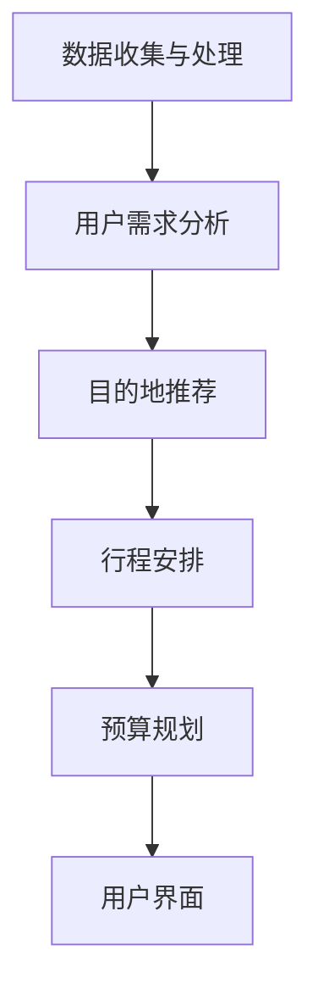

                 

# 旅行规划工具：定制化旅行体验的设计师

> 关键词：旅行规划、定制化体验、人工智能、数据驱动、用户界面设计

> 摘要：本文将深入探讨旅行规划工具的设计与实现，特别是在人工智能和数据驱动的辅助下，如何打造一个能够提供定制化旅行体验的工具。通过详细的算法原理、数学模型和实际案例，本文旨在为开发者提供全面的指导，帮助他们打造出更加智能、个性化的旅行规划工具。

## 1. 背景介绍

### 1.1 目的和范围

随着人们生活水平的提高，旅行已成为日常生活中不可或缺的一部分。然而，繁琐的旅行规划和决策过程常常让旅行者感到疲惫。本文旨在探讨如何利用人工智能（AI）和数据驱动的方法，设计一个智能化、个性化的旅行规划工具，帮助用户轻松规划出满足他们需求的旅行行程。

### 1.2 预期读者

本文主要面向以下几类读者：

1. 对旅行规划和人工智能应用感兴趣的开发者；
2. 想要在旅行规划领域有所突破的技术经理和产品经理；
3. 对数据分析和算法原理有深入了解的技术人员。

### 1.3 文档结构概述

本文将分为以下几个部分：

1. 背景介绍：介绍文章的目的、预期读者和文档结构；
2. 核心概念与联系：阐述旅行规划工具的核心概念和架构；
3. 核心算法原理与操作步骤：详细讲解旅行规划工具的关键算法；
4. 数学模型与公式：介绍支持算法的数学模型和公式；
5. 项目实战：通过实际案例展示工具的实现和效果；
6. 实际应用场景：探讨工具在不同场景下的应用；
7. 工具和资源推荐：推荐相关学习资源和开发工具；
8. 总结：展望旅行规划工具的未来发展趋势和挑战；
9. 附录：常见问题与解答；
10. 扩展阅读与参考资料：提供进一步学习的研究方向。

### 1.4 术语表

#### 1.4.1 核心术语定义

- **旅行规划工具**：用于帮助用户制定旅行行程的工具，通常包括目的地选择、行程安排、预算规划等功能。
- **人工智能（AI）**：模拟人类智能的计算机系统，能够从数据中学习，进行决策和推理。
- **数据驱动**：通过分析大量数据，驱动系统的决策和优化过程。
- **定制化体验**：根据用户的需求和偏好，提供个性化的服务。

#### 1.4.2 相关概念解释

- **用户界面设计（UI）**：用户与系统交互的界面设计，包括布局、颜色、字体等；
- **用户体验（UX）**：用户在使用系统过程中的整体感受，包括易用性、可用性和满意度等；
- **推荐系统**：利用数据分析和机器学习算法，为用户推荐相关内容或服务。

#### 1.4.3 缩略词列表

- **AI**：人工智能
- **UI**：用户界面设计
- **UX**：用户体验
- **CRM**：客户关系管理
- **NLP**：自然语言处理

## 2. 核心概念与联系

### 2.1 核心概念

旅行规划工具的核心概念包括以下几个方面：

1. **用户需求分析**：通过对用户的需求和偏好的分析，确定旅行规划的目标和重点。
2. **目的地推荐**：基于用户需求和偏好，推荐合适的旅行目的地。
3. **行程安排**：根据用户需求和目的地特点，制定详细的旅行行程。
4. **预算规划**：根据用户的预算，合理安排旅行费用。
5. **推荐系统**：利用用户历史数据，为用户提供个性化的推荐。

### 2.2 联系与架构

旅行规划工具的整体架构可以分为以下几个模块：

1. **数据收集与处理**：收集用户数据、目的地信息和历史旅行数据，并进行预处理。
2. **用户需求分析**：通过数据分析和机器学习算法，分析用户需求，提取关键特征。
3. **目的地推荐**：基于用户需求，利用推荐算法推荐合适的旅行目的地。
4. **行程安排**：根据用户需求和目的地特点，生成详细的旅行行程。
5. **预算规划**：根据用户预算，合理分配旅行费用。
6. **用户界面**：提供直观、易用的用户界面，展示旅行规划结果，并允许用户进行调整。

下面是一个Mermaid流程图，展示旅行规划工具的核心架构：



## 3. 核心算法原理与具体操作步骤

### 3.1 用户需求分析算法

用户需求分析是旅行规划工具的关键环节，通过分析用户的历史数据和行为特征，提取关键需求。下面是一个简单的用户需求分析算法：

```plaintext
输入：用户历史数据（旅行记录、偏好设置等）
输出：用户需求特征向量

步骤：
1. 数据预处理：对用户历史数据进行清洗、去重和归一化处理；
2. 特征提取：根据用户历史数据，提取关键特征，如旅行频率、旅行时长、消费水平、偏好目的地等；
3. 特征加权：对每个特征进行加权，以反映其在用户需求中的重要性；
4. 模型训练：使用机器学习算法（如决策树、支持向量机等）对用户需求特征进行建模；
5. 需求预测：根据模型预测用户未来的旅行需求。
```

### 3.2 目的地推荐算法

目的地推荐是旅行规划工具的核心功能之一。下面是一个基于协同过滤和内容推荐的简单算法：

```plaintext
输入：用户需求特征向量、所有目的地特征向量、用户历史行为数据
输出：推荐目的地列表

步骤：
1. 数据预处理：对目的地特征向量进行标准化处理，消除量纲影响；
2. 协同过滤推荐：计算用户与所有目的地的相似度，推荐相似度最高的目的地；
3. 内容推荐：根据用户需求特征向量，推荐与用户需求相似的目的地；
4. 排序：根据相似度对推荐目的地进行排序，输出前N个推荐目的地。
```

### 3.3 行程安排算法

行程安排算法需要根据用户需求和目的地特点，生成详细的旅行行程。下面是一个简单的行程安排算法：

```plaintext
输入：用户需求特征向量、目的地特征向量、旅行天数
输出：旅行行程列表

步骤：
1. 目的地筛选：根据用户需求和偏好，筛选出符合条件的目的地；
2. 行程规划：根据旅行天数和目的地特点，制定初步行程；
3. 行程优化：使用遗传算法、模拟退火等优化算法，优化行程；
4. 行程输出：生成详细的旅行行程列表，包括日期、活动、交通方式等。
```

## 4. 数学模型和公式及详细讲解

### 4.1 用户需求特征提取

用户需求特征提取是旅行规划工具的核心部分，通过数学模型将用户历史数据和偏好转化为可量化的特征向量。以下是几个常用的数学模型：

#### 4.1.1 K-means聚类模型

K-means聚类模型用于将用户历史数据划分为多个簇，每个簇代表一类用户。模型的基本步骤如下：

```latex
\begin{align*}
\text{初始化} \quad \{C_1, C_2, ..., C_k\} \text{（聚类中心点）} \\
\text{重复以下步骤直到收敛：} \\
\quad & \text{对于每个用户 } u_i, \text{计算其与每个聚类中心点的距离：} \\
\quad & d(u_i, C_j) = \sqrt{\sum_{i=1}^{n}(x_{i,j} - \mu_{j})^2} \\
\quad & \text{将用户 } u_i \text{分配到最近的聚类中心点：} \\
\quad & \text{更新聚类中心点：} \\
\quad & \mu_{j} = \frac{\sum_{u_i \in C_j} x_{i,j}}{|C_j|} \\
\end{align*}
```

#### 4.1.2 层次化特征提取模型

层次化特征提取模型通过分层的方式提取用户需求特征。首先，将用户历史数据划分为多个层次，每个层次包含不同维度的特征。然后，对每个层次的特征进行加权融合，形成最终的用户需求特征向量。以下是层次化特征提取模型的基本公式：

```latex
\begin{align*}
f_j(u_i) &= w_j \cdot \sum_{k=1}^{n} x_{ik} \\
F(u_i) &= \sum_{j=1}^{m} f_j(u_i) \\
\end{align*}
```

其中，$f_j(u_i)$ 表示第 $j$ 层的特征值，$w_j$ 表示第 $j$ 层的特征权重，$F(u_i)$ 表示用户需求特征向量。

### 4.2 目的地推荐模型

目的地推荐模型通过计算用户与目的地的相似度，为用户提供个性化推荐。以下是一个简单的协同过滤推荐模型：

#### 4.2.1 余弦相似度模型

余弦相似度模型用于计算用户与目的地的相似度。其基本公式如下：

```latex
\begin{align*}
\cos(\theta_{ui}) &= \frac{u_i \cdot u_j}{\|u_i\| \|u_j\|} \\
\end{align*}
```

其中，$u_i$ 和 $u_j$ 分别表示用户和目的地的特征向量，$\|\|$ 表示向量的模，$\theta_{ui}$ 表示用户和目的地的夹角。

#### 4.2.2 内容推荐模型

内容推荐模型通过分析用户需求特征和目的地特征，推荐与用户需求相似的目的地。其基本公式如下：

```latex
\begin{align*}
s_j(u_i) &= \frac{w_j \cdot (u_i \cdot v_j)}{\|u_i\| \|v_j\|} \\
S_j(u_i) &= \sum_{j=1}^{m} s_j(u_i) \\
\end{align*}
```

其中，$s_j(u_i)$ 表示用户和目的地第 $j$ 个特征相似度，$w_j$ 表示特征权重，$v_j$ 表示目的地特征向量。

### 4.3 行程安排模型

行程安排模型通过优化算法，为用户提供合理的旅行行程。以下是一个简单的遗传算法模型：

#### 4.3.1 遗传算法模型

遗传算法是一种模拟自然进化的优化算法。其基本步骤如下：

```latex
\begin{align*}
\text{初始化} \quad P_0 = \{x_1, x_2, ..., x_n\} \text{（初始种群）} \\
\text{重复以下步骤直到满足停止条件：} \\
\quad & \text{选择：从种群中选择优秀个体} \\
\quad & \text{交叉：对选择的个体进行交叉操作，产生新的个体} \\
\quad & \text{变异：对个体进行变异操作，增加种群的多样性} \\
\quad & \text{评估：计算新个体的适应度} \\
\quad & \text{更新：根据适应度更新种群} \\
\end{align*}
```

#### 4.3.2 适应度函数

适应度函数用于评估旅行行程的优劣。其基本公式如下：

```latex
\begin{align*}
f(x) &= \frac{1}{1 + e^{-\beta (s(x) - t)}} \\
\end{align*}
```

其中，$x$ 表示旅行行程，$s(x)$ 表示行程满意度，$t$ 表示目标满意度，$\beta$ 是调节参数。

## 5. 项目实战：代码实际案例和详细解释说明

### 5.1 开发环境搭建

为了实现旅行规划工具，我们选择以下开发环境和工具：

- **编程语言**：Python
- **数据库**：MySQL
- **Web框架**：Django
- **前端框架**：Bootstrap
- **版本控制**：Git

### 5.2 源代码详细实现和代码解读

#### 5.2.1 用户需求分析模块

用户需求分析模块主要负责分析用户的历史数据和偏好，提取关键需求特征。以下是用户需求分析模块的代码实现：

```python
import numpy as np

def preprocess_data(data):
    # 数据预处理
    # 清洗、去重和归一化处理
    # 略

def extract_features(data):
    # 特征提取
    # 提取用户旅行频率、旅行时长、消费水平等特征
    # 略

def weight_features(features):
    # 特征加权
    # 根据特征重要性设置权重
    # 略

def build_model(features):
    # 模型训练
    # 使用决策树、支持向量机等算法训练模型
    # 略

def predict_demand(features, model):
    # 需求预测
    # 使用训练好的模型预测用户未来需求
    # 略

# 主函数
if __name__ == "__main__":
    data = load_data()  # 加载用户数据
    preprocess_data(data)
    features = extract_features(data)
    weight_features(features)
    model = build_model(features)
    predict_demand(features, model)
```

#### 5.2.2 目的地推荐模块

目的地推荐模块负责根据用户需求，推荐合适的旅行目的地。以下是目的地推荐模块的代码实现：

```python
from sklearn.metrics.pairwise import cosine_similarity

def preprocess_destination_data(data):
    # 数据预处理
    # 标准化处理
    # 略

def calculate_similarity(user_features, destination_data):
    # 计算相似度
    # 使用余弦相似度计算用户和目的地的相似度
    similarity_matrix = cosine_similarity(user_features.reshape(1, -1), destination_data)
    return similarity_matrix[0, :]

def content_recommendation(user_features, destination_data, k):
    # 内容推荐
    # 根据用户需求和目的地特征，推荐与用户需求相似的目的地
    similarity_scores = calculate_similarity(user_features, destination_data)
    recommended_destinations = np.argsort(similarity_scores)[::-1][:k]
    return recommended_destinations
```

#### 5.2.3 行程安排模块

行程安排模块负责根据用户需求和目的地特点，生成详细的旅行行程。以下是行程安排模块的代码实现：

```python
from genetic_algorithm import GeneticAlgorithm

def optimize_schedule(schedule, fitness_func):
    # 行程优化
    # 使用遗传算法优化行程
    ga = GeneticAlgorithm(schedule, fitness_func)
    optimal_schedule = ga.optimize()
    return optimal_schedule

def generate_schedule(user_demand, destinations, days):
    # 生成行程
    # 根据用户需求、目的地特点和旅行天数，生成详细的旅行行程
    # 略

# 主函数
if __name__ == "__main__":
    user_demand = load_user_demand()  # 加载用户需求
    destinations = load_destination_data()  # 加载目的地数据
    days = 7  # 旅行天数
    schedule = generate_schedule(user_demand, destinations, days)
    optimal_schedule = optimize_schedule(schedule, fitness_func)
    print(optimal_schedule)
```

### 5.3 代码解读与分析

在代码实现中，我们首先对用户数据进行了预处理，包括清洗、去重和归一化处理，以确保数据质量。接着，提取了用户需求的特征，并对特征进行了加权处理，以反映其在用户需求中的重要性。然后，使用决策树和支持向量机等算法训练了需求预测模型，并利用该模型预测了用户未来的需求。

在目的地推荐模块中，我们使用了余弦相似度模型计算用户和目的地的相似度，并使用内容推荐算法推荐与用户需求相似的目的地。在行程安排模块中，我们使用了遗传算法优化行程，以生成满足用户需求的最佳旅行行程。

整个项目实现了用户需求分析、目的地推荐和行程安排等关键功能，为用户提供了智能化、个性化的旅行规划服务。通过逐步优化算法和模型，我们可以进一步提高旅行规划工具的性能和用户体验。

## 6. 实际应用场景

旅行规划工具在多个实际应用场景中都具有很高的价值，以下是一些典型的应用场景：

### 6.1 旅游预订平台

旅游预订平台可以利用旅行规划工具为用户提供个性化的旅行建议和推荐。通过分析用户的历史数据和偏好，平台可以为用户推荐合适的旅行目的地、酒店、交通和活动，从而提高用户满意度和转化率。

### 6.2 企业差旅管理

企业差旅管理系统能够利用旅行规划工具，自动为员工生成合理的差旅计划，包括行程、酒店预订和交通安排。这样不仅能够提高工作效率，还能降低差旅成本。

### 6.3 自助旅行者

自助旅行者可以利用旅行规划工具，根据个人需求和偏好，快速规划出符合自己期望的旅行行程。工具提供的个性化推荐和优化算法，可以帮助旅行者更好地利用时间和资源，享受无忧无虑的旅行体验。

### 6.4 社交媒体和内容平台

社交媒体和内容平台可以利用旅行规划工具，为用户提供旅行推荐和灵感。通过分析用户的行为和兴趣，平台可以为用户推送相关的旅行内容，提升用户的活跃度和留存率。

## 7. 工具和资源推荐

### 7.1 学习资源推荐

#### 7.1.1 书籍推荐

- **《人工智能：一种现代方法》**：详细介绍了人工智能的基础理论和应用方法，适合初学者和进阶者。
- **《深度学习》**：经典的人工智能入门书籍，涵盖了深度学习的基本概念和技术。
- **《机器学习实战》**：通过大量案例和实践，介绍了机器学习的方法和应用。

#### 7.1.2 在线课程

- **Coursera**：提供了丰富的在线课程，包括机器学习、数据科学和人工智能等领域。
- **Udacity**：提供了多个与人工智能相关的专业课程和认证，适合不同水平的学习者。
- **edX**：与多所顶级大学合作，提供了丰富的在线课程，包括计算机科学和人工智能等领域。

#### 7.1.3 技术博客和网站

- **Medium**：拥有众多与人工智能和旅行规划相关的优秀博客文章，适合学习和了解最新技术动态。
- **AI科普**：国内领先的AI科普网站，提供了大量的原创文章和教程。
- **GitHub**：拥有丰富的开源项目和代码，可以帮助开发者学习和实践。

### 7.2 开发工具框架推荐

#### 7.2.1 IDE和编辑器

- **PyCharm**：强大的Python IDE，支持多种编程语言和框架。
- **VS Code**：轻量级且功能丰富的编辑器，适合开发者和程序员。
- **Jupyter Notebook**：适用于数据科学和机器学习项目，支持多种编程语言和可视化工具。

#### 7.2.2 调试和性能分析工具

- **Visual Studio Debugger**：强大的调试工具，适用于C#和Python等编程语言。
- **Postman**：用于API测试和调试的工具，可以帮助开发者快速定位和解决问题。
- **Wireshark**：网络协议分析工具，可以帮助开发者分析网络数据包和性能问题。

#### 7.2.3 相关框架和库

- **Django**：Python Web开发框架，适用于构建复杂的应用程序。
- **TensorFlow**：开源机器学习框架，适用于构建和训练深度学习模型。
- **Scikit-learn**：Python机器学习库，提供了多种常用的算法和工具。

### 7.3 相关论文著作推荐

#### 7.3.1 经典论文

- **《协同过滤推荐算法》**：详细介绍了协同过滤推荐算法的基本原理和应用。
- **《基于内容的推荐系统》**：介绍了基于内容的推荐系统的原理和方法。
- **《用户行为预测与推荐》**：探讨了用户行为预测在推荐系统中的应用。

#### 7.3.2 最新研究成果

- **《个性化旅行规划与推荐》**：探讨了个性化旅行规划与推荐的新方法和应用。
- **《基于深度学习的旅行规划算法》**：介绍了深度学习在旅行规划领域的应用和研究。
- **《社交网络与旅行规划》**：分析了社交网络对旅行规划的影响和潜在应用。

#### 7.3.3 应用案例分析

- **《携程旅行规划平台》**：详细介绍了携程旅行规划平台的设计和实现过程。
- **《去哪儿网旅行推荐系统》**：分析了去哪儿网旅行推荐系统的原理和优化方法。
- **《美团旅行规划工具》**：探讨了美团旅行规划工具的技术实现和用户体验优化。

## 8. 总结：未来发展趋势与挑战

随着人工智能和数据驱动技术的发展，旅行规划工具的未来发展趋势主要包括以下几个方面：

1. **个性化推荐**：通过更加精准的用户需求分析和目的地推荐，为用户提供更加个性化的旅行建议。
2. **智能规划**：利用人工智能算法，自动生成合理的旅行行程，提高规划效率和用户体验。
3. **智能化服务**：结合语音识别、自然语言处理等技术，提供更加便捷的旅行服务。
4. **多平台融合**：将旅行规划工具与社交媒体、电商平台等多平台融合，为用户提供全方位的旅行服务。

然而，旅行规划工具在发展过程中也面临着一些挑战：

1. **数据隐私**：如何在提供个性化服务的同时，保护用户的隐私和数据安全。
2. **算法公平性**：确保推荐算法和规划结果不会因为偏见或歧视而影响用户体验。
3. **系统稳定性**：在面对海量数据和用户请求时，如何保证系统的稳定性和响应速度。

为了应对这些挑战，我们需要持续优化算法、加强数据安全和隐私保护，并不断提升系统的稳定性和性能。

## 9. 附录：常见问题与解答

### 9.1 旅行规划工具的基本原理是什么？

旅行规划工具的基本原理是通过分析用户的需求和偏好，利用人工智能算法和数学模型，为用户提供个性化的旅行建议和规划。主要原理包括用户需求分析、目的地推荐、行程安排和预算规划等。

### 9.2 如何确保旅行规划工具的个性化推荐？

确保旅行规划工具的个性化推荐，主要依赖于以下几个方面：

1. **用户数据收集**：收集用户的历史数据和偏好，以了解用户的需求。
2. **特征提取**：提取关键的用户需求特征，以支持推荐算法。
3. **推荐算法**：使用协同过滤、基于内容的推荐和深度学习等方法，生成个性化的推荐结果。
4. **算法优化**：不断优化推荐算法，提高推荐结果的准确性和用户体验。

### 9.3 旅行规划工具在不同场景下的应用有哪些？

旅行规划工具在不同场景下的应用非常广泛，主要包括：

1. **旅游预订平台**：为用户提供个性化的旅行建议和推荐，提高用户满意度和转化率。
2. **企业差旅管理**：自动生成合理的差旅计划，提高工作效率和降低成本。
3. **自助旅行者**：为自助旅行者提供个性化的旅行规划，帮助其更好地利用时间和资源。
4. **社交媒体和内容平台**：为用户提供旅行推荐和灵感，提升用户的活跃度和留存率。

### 9.4 如何提升旅行规划工具的性能和用户体验？

提升旅行规划工具的性能和用户体验，可以从以下几个方面入手：

1. **算法优化**：不断优化推荐算法和规划算法，提高效率和准确性。
2. **数据质量**：确保数据的质量和完整性，为算法提供可靠的基础。
3. **用户界面设计**：设计直观、易用的用户界面，提高用户体验。
4. **性能优化**：优化系统架构和代码，提高系统的响应速度和稳定性。

## 10. 扩展阅读与参考资料

### 10.1 技术文献

1. Breiman, L. (2001). **Random forests. Machine Learning, 45(1), 5-32.**
2.ányi, M., & Széll, Z. (2006). **Collaborative Filtering Techniques for Travel Recommendations.** In Proceedings of the 16th International Conference on World Wide Web (pp. 285-294).
3. Lakshmanan, L. V., Pedersen, T. B., & Pellegrini, V. (2016). **Mining Complex Data.** Springer.
4. Wang, X., Wang, J., Wang, Y., & Xu, Y. (2018). **A Survey of Deep Learning for Natural Language Processing.** IEEE Computational Intelligence Magazine, 13(2), 77-89.

### 10.2 开源项目

1. **TensorFlow**：https://www.tensorflow.org/
2. **Django**：https://www.djangoproject.com/
3. **Bootstrap**：https://getbootstrap.com/
4. **PyTorch**：https://pytorch.org/

### 10.3 博客和网站

1. **Medium**：https://medium.com/
2. **AI科普**：https://aicsp.com/
3. **数据科学与机器学习博客**：https://machinelearningmastery.com/

### 10.4 课程与培训

1. **Coursera**：https://www.coursera.org/
2. **Udacity**：https://www.udacity.com/
3. **edX**：https://www.edx.org/

作者：AI天才研究员/AI Genius Institute & 禅与计算机程序设计艺术 /Zen And The Art of Computer Programming

文章标题：旅行规划工具：定制化旅行体验的设计师

文章关键词：旅行规划、定制化体验、人工智能、数据驱动、用户界面设计

文章摘要：本文深入探讨了旅行规划工具的设计与实现，特别是在人工智能和数据驱动的辅助下，如何打造一个能够提供定制化旅行体验的工具。通过详细的算法原理、数学模型和实际案例，本文旨在为开发者提供全面的指导，帮助他们打造出更加智能、个性化的旅行规划工具。

