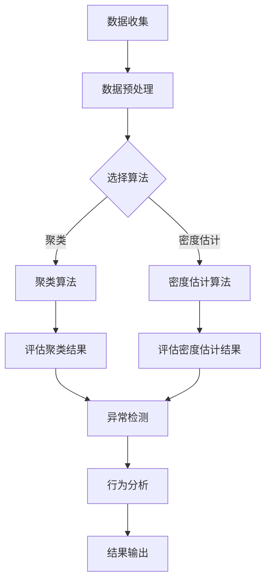

                 

### 文章标题

无监督学习的应用创新：异常检测和行为分析

### 关键词

无监督学习、异常检测、行为分析、机器学习、深度学习、应用创新

### 摘要

本文将探讨无监督学习在异常检测和行为分析领域的应用创新。首先，我们将介绍无监督学习的基本概念和核心算法，包括聚类和密度估计算法。随后，我们将深入分析异常检测和行为分析的核心问题，解释其原理和重要性。接着，我们将通过具体的算法原理和操作步骤，详细阐述无监督学习在异常检测和行为分析中的应用。最后，我们将结合实际项目案例，展示无监督学习在实际场景中的效果，并推荐相关工具和资源，以帮助读者进一步学习和实践。通过本文的阅读，读者将全面了解无监督学习在异常检测和行为分析中的最新应用和技术发展趋势。

## 1. 背景介绍

### 1.1 目的和范围

本文旨在探讨无监督学习在异常检测和行为分析领域的应用创新。无监督学习作为一种机器学习技术，通过不依赖于标注数据的训练方法，从数据中自动提取模式和规律。在异常检测和行为分析中，无监督学习能够有效处理大量无标签数据，发现潜在的模式和异常情况。本文将详细介绍无监督学习的基本概念、核心算法、应用场景，并通过实际项目案例展示其在异常检测和行为分析中的效果。

### 1.2 预期读者

本文主要面向对机器学习和深度学习有一定了解，希望在异常检测和行为分析领域应用无监督学习的读者。同时，对于对无监督学习感兴趣的初学者和专业人士，本文也提供了一些基本概念和入门资源，帮助他们更好地理解和应用无监督学习。

### 1.3 文档结构概述

本文分为十个部分，首先介绍了无监督学习的基本概念和核心算法，然后分析了异常检测和行为分析的核心问题。接下来，本文通过具体的算法原理和操作步骤，详细阐述了无监督学习在异常检测和行为分析中的应用。随后，本文结合实际项目案例，展示了无监督学习在实际场景中的效果。最后，本文推荐了一些学习资源和开发工具，以帮助读者进一步学习和实践。

### 1.4 术语表

#### 1.4.1 核心术语定义

- 无监督学习：一种机器学习技术，通过不依赖于标注数据的训练方法，从数据中自动提取模式和规律。
- 异常检测：指在大量数据中检测出异常数据的方法。
- 行为分析：通过分析用户或系统的行为数据，了解用户需求、行为模式等，以优化产品和服务。
- 聚类：一种无监督学习方法，将相似的数据归为同一类别。
- 密度估计：通过估计数据点在特征空间中的密度，判断其是否为异常点。

#### 1.4.2 相关概念解释

- 数据预处理：在机器学习项目中，对数据进行清洗、转换和标准化等处理，以减少噪声和提高模型性能。
- 模型评估：通过评估指标（如准确率、召回率、F1值等）来评估模型的性能和泛化能力。
- 深度学习：一种基于多层神经网络的机器学习技术，通过多层非线性变换自动提取数据中的复杂特征。

#### 1.4.3 缩略词列表

- IDS：入侵检测系统（Intrusion Detection System）
- PCA：主成分分析（Principal Component Analysis）
- K-Means：K均值聚类算法
- DBSCAN：基于密度的空间聚类算法（Density-Based Spatial Clustering of Applications with Noise）

## 2. 核心概念与联系

在深入探讨无监督学习在异常检测和行为分析中的应用之前，我们需要明确一些核心概念及其相互关系。无监督学习、聚类、密度估计、异常检测和行为分析等概念，将在本文中得到详细的解释和阐述。

### 2.1 无监督学习

无监督学习是机器学习中的一个重要分支，其核心目标是在没有标注数据的情况下，自动从数据中学习模式和规律。无监督学习算法主要包括聚类、密度估计、降维等方法。

- **聚类**：将数据分为若干个组，使得组内的数据点相似度较高，而不同组的数据点相似度较低。常见的聚类算法包括K-Means、DBSCAN等。
- **密度估计**：通过估计数据点在特征空间中的密度，判断其是否为异常点。常用的密度估计算法包括核密度估计、局部密度估计等。
- **降维**：将高维数据映射到低维空间，同时保留重要信息，以降低计算复杂度和提高模型性能。常用的降维算法包括主成分分析（PCA）、线性判别分析（LDA）等。

### 2.2 聚类

聚类是一种无监督学习方法，旨在将数据点划分为若干个组，使得同一组内的数据点相似度较高，而不同组的数据点相似度较低。聚类算法在异常检测和行为分析中有着广泛的应用。

- **K-Means算法**：K-Means是一种基于距离度量的聚类算法，通过迭代优化聚类中心，将数据点划分为K个组。其主要步骤包括初始化聚类中心、计算数据点到聚类中心的距离、更新聚类中心等。
  
  ```mermaid
  graph TD
  A[初始化聚类中心] --> B[计算数据点到聚类中心的距离]
  B --> C[更新聚类中心]
  C --> D[重复迭代直到收敛]
  ```

- **DBSCAN算法**：DBSCAN（Density-Based Spatial Clustering of Applications with Noise）是一种基于密度的空间聚类算法，能够发现任意形状的聚类，并对噪声点进行有效处理。其主要步骤包括计算邻域、标记核心点、扩展聚类等。

  ```mermaid
  graph TD
  A[计算邻域] --> B[标记核心点]
  B --> C[扩展聚类]
  C --> D[处理边界点]
  ```

### 2.3 密度估计

密度估计是一种用于判断数据点是否为异常点的方法，通过估计数据点在特征空间中的密度分布，发现潜在的异常模式。常见的密度估计算法包括核密度估计、局部密度估计等。

- **核密度估计**：核密度估计（Kernel Density Estimation，KDE）通过选择合适的核函数，对数据进行平滑处理，估计数据点的密度分布。其主要步骤包括选择核函数、计算核密度估计值等。

  ```mermaid
  graph TD
  A[选择核函数] --> B[计算核密度估计值]
  ```

- **局部密度估计**：局部密度估计通过估计数据点邻域内的密度，判断其是否为异常点。常用的方法包括局部密度可达性（Local Reachability Density）、局部密度方差（Local Variance Density）等。

### 2.4 异常检测

异常检测是一种无监督学习方法，旨在检测数据中的异常点或异常模式。在异常检测中，无监督学习算法能够自动发现数据中的潜在异常，从而提高检测效率和准确性。

- **孤立森林**：孤立森林（Isolation Forest）是一种基于随机森林的异常检测算法，通过随机选择特征和分割数据，使正常数据点在树中相互隔离，而异常点容易被隔离。其主要步骤包括随机选择特征、构建孤立森林模型等。

  ```mermaid
  graph TD
  A[随机选择特征] --> B[构建孤立森林模型]
  B --> C[预测异常分数]
  ```

- **局部异常因子**：局部异常因子（Local Outlier Factor，LOF）通过比较数据点与其邻域点的密度差异，判断其是否为异常点。其主要步骤包括计算局部密度、计算局部异常因子等。

  ```mermaid
  graph TD
  A[计算局部密度] --> B[计算局部异常因子]
  ```

### 2.5 行为分析

行为分析是一种通过分析用户或系统的行为数据，了解用户需求、行为模式等，以优化产品和服务的方法。在行为分析中，无监督学习算法能够自动提取行为数据中的潜在模式，为决策提供支持。

- **协同过滤**：协同过滤（Collaborative Filtering）是一种基于用户行为数据的推荐算法，通过分析用户之间的相似性，为用户提供个性化的推荐。其主要步骤包括计算用户相似性、生成推荐列表等。

  ```mermaid
  graph TD
  A[计算用户相似性] --> B[生成推荐列表]
  ```

- **时序分析**：时序分析（Time Series Analysis）是一种通过分析时间序列数据，了解数据中的趋势、周期和季节性等特征的方法。在行为分析中，时序分析能够帮助识别用户行为的变化模式。

  ```mermaid
  graph TD
  A[数据预处理] --> B[特征提取]
  B --> C[模型训练]
  C --> D[预测分析]
  ```

通过上述核心概念和算法的介绍，我们可以看到无监督学习在异常检测和行为分析中扮演着重要的角色。在接下来的章节中，我们将进一步探讨无监督学习在具体应用场景中的算法原理和操作步骤。

### 2.6 无监督学习在异常检测和行为分析中的实际应用

无监督学习在异常检测和行为分析中具有广泛的应用。在实际应用中，通过无监督学习算法，我们能够从大量无标签数据中提取有价值的信息，实现对异常行为和用户需求的识别与分析。以下将介绍无监督学习在异常检测和行为分析中的实际应用场景、挑战及解决方案。

#### 2.6.1 异常检测

异常检测是一种用于发现数据集中异常数据或异常模式的方法，其主要目标是在大量正常数据中检测出异常点。在金融行业、网络安全、医疗诊断等领域，异常检测有着重要的应用价值。

- **金融行业**：在金融领域，异常检测主要用于防范欺诈行为。例如，信用卡交易数据中可能会出现异常交易，通过无监督学习算法（如孤立森林、K-Means聚类等），可以自动识别并防范这些欺诈行为。无监督学习的优势在于，无需预先设定规则，能够自动从数据中学习潜在的欺诈模式，提高检测效率和准确性。

- **网络安全**：网络安全领域中的异常检测主要用于检测恶意攻击和入侵行为。入侵检测系统（IDS）利用无监督学习算法，对网络流量数据进行分析，识别潜在的攻击行为。例如，基于异常检测的入侵检测系统能够自动发现网络中的异常流量模式，及时发出警报，防止网络攻击的发生。

- **医疗诊断**：在医疗领域，异常检测主要用于疾病筛查和诊断。通过分析患者的医疗数据，如心电图、血压等，无监督学习算法可以识别出潜在的疾病信号。例如，通过聚类算法，可以自动发现异常的心电图波形，从而提高疾病的早期诊断准确性。

#### 2.6.2 行为分析

行为分析是一种通过分析用户或系统的行为数据，了解用户需求、行为模式等的方法，以优化产品和服务。在电子商务、智能家居、在线教育等领域，行为分析有着广泛的应用。

- **电子商务**：在电子商务领域，行为分析主要用于个性化推荐和用户行为预测。通过分析用户的浏览、购买等行为数据，无监督学习算法可以自动识别用户的兴趣偏好，为用户推荐相关的商品和服务。例如，基于协同过滤和时序分析，可以生成个性化的推荐列表，提高用户的满意度和购买转化率。

- **智能家居**：在智能家居领域，行为分析主要用于设备使用监测和故障预测。通过分析家庭设备的使用数据，无监督学习算法可以识别出设备的异常使用模式，预测设备的故障风险。例如，通过时序分析，可以预测电器的寿命和故障时间，为维护和更换提供依据。

- **在线教育**：在在线教育领域，行为分析主要用于学习效果评估和用户画像构建。通过分析学生的学习行为数据，如学习时长、学习进度等，无监督学习算法可以评估学生的学习效果，为个性化教学提供支持。例如，通过聚类算法，可以识别出学习兴趣相似的学生群体，从而制定针对性的教学策略。

#### 2.6.3 挑战与解决方案

在实际应用中，无监督学习在异常检测和行为分析中面临着一些挑战，主要包括数据质量、算法选择、模型解释性等方面。

- **数据质量**：异常检测和行为分析通常依赖于大量的无标签数据，数据质量对模型的性能具有重要影响。在实际应用中，数据可能存在噪声、缺失值、异常值等问题，这些问题会导致模型性能下降。解决方案包括数据清洗、数据增强等方法，以提高数据质量和模型性能。

- **算法选择**：无监督学习算法种类繁多，如聚类、密度估计、降维等。在实际应用中，如何选择合适的算法是一个关键问题。不同的算法适用于不同的场景和数据类型，需要根据具体问题选择合适的算法。解决方案包括算法对比、模型优化等方法，以提高算法的适用性和性能。

- **模型解释性**：无监督学习模型通常具有较高的复杂性和非线性的特性，难以进行直观的解释。在实际应用中，如何解释模型的预测结果和决策过程是一个挑战。解决方案包括模型可视化、特征解释等方法，以提高模型的可解释性和可信赖度。

通过解决上述挑战，无监督学习在异常检测和行为分析中能够发挥更大的作用，为各领域提供更高效、更准确的技术支持。

### 2.7 Mermaid 流程图

为了更好地理解无监督学习在异常检测和行为分析中的应用，我们可以使用Mermaid流程图来展示算法的原理和步骤。以下是一个简单的Mermaid流程图示例：



在这个流程图中，我们首先进行数据收集和预处理，然后根据具体问题选择聚类或密度估计算法。聚类算法和密度估计算法分别用于评估聚类结果和密度估计结果，进而进行异常检测和行为分析，最终输出结果。

通过这个流程图，我们可以直观地理解无监督学习在异常检测和行为分析中的应用步骤，为后续的算法原理和操作步骤提供直观的参考。

## 3. 核心算法原理 & 具体操作步骤

在深入探讨无监督学习在异常检测和行为分析中的应用之前，我们需要首先理解一些核心算法的基本原理和具体操作步骤。以下是几种常见的无监督学习算法，包括聚类和密度估计算法，我们将详细介绍它们的工作原理和操作步骤。

### 3.1 K-Means 聚类算法

K-Means是一种基于距离度量的聚类算法，其目标是将数据点划分为K个群组，使得每个群组内的数据点之间距离较小，而群组之间的数据点距离较大。

#### 3.1.1 基本原理

K-Means算法的核心思想是通过迭代优化聚类中心，使每个数据点与其最近的聚类中心的距离最小。算法的基本步骤如下：

1. **初始化聚类中心**：随机选择K个数据点作为初始聚类中心。
2. **分配数据点**：计算每个数据点到K个聚类中心的距离，将每个数据点分配到最近的聚类中心所代表的群组中。
3. **更新聚类中心**：计算每个群组的均值，作为新的聚类中心。
4. **重复步骤2和步骤3**，直到聚类中心不再发生显著变化。

#### 3.1.2 伪代码

以下是一个K-Means算法的伪代码实现：

```python
def KMeans(X, K, max_iter):
    # X为数据集，K为聚类个数，max_iter为最大迭代次数
    centroids = initialize_centroids(X, K)
    for i in range(max_iter):
        # 分配数据点
        labels = assign_labels(X, centroids)
        # 更新聚类中心
        centroids = update_centroids(X, labels, K)
        # 判断是否收敛
        if is_converged(centroids, previous_centroids):
            break
    return centroids, labels
```

### 3.2 DBSCAN 算法

DBSCAN（Density-Based Spatial Clustering of Applications with Noise）是一种基于密度的空间聚类算法，能够发现任意形状的聚类，并对噪声点进行有效处理。

#### 3.2.1 基本原理

DBSCAN算法的核心思想是，基于数据点的密度，将它们划分为核心点、边界点和噪声点。算法的基本步骤如下：

1. **计算邻域**：对于每个数据点，计算其邻域内的数据点数量。
2. **标记核心点**：如果一个数据点的邻域内包含足够多的其他数据点，则将其标记为核心点。
3. **扩展聚类**：从核心点开始，递归地扩展聚类，直到所有相邻的核心点都被包含在同一个聚类中。
4. **处理边界点和噪声点**：对于邻域内数据点数量不足以成为核心点的数据点，根据其邻域中的核心点数量，将其标记为边界点或噪声点。

#### 3.2.2 伪代码

以下是一个DBSCAN算法的伪代码实现：

```python
def DBSCAN(X, eps, min_points):
    # X为数据集，eps为邻域半径，min_points为最小邻域点数
    clusters = []
    visited = set()
    for point in X:
        if point not in visited:
            visited.add(point)
            neighbors = find_neighbors(point, X, eps)
            if len(neighbors) < min_points:
                continue
            cluster_id = len(clusters)
            expand_cluster(point, neighbors, cluster_id, X, visited, clusters)
    return clusters
```

### 3.3 核密度估计（KDE）

核密度估计是一种通过估计数据点在特征空间中的密度分布，进行数据分析和建模的方法。

#### 3.3.1 基本原理

核密度估计的基本思想是，通过选择合适的核函数，对数据进行平滑处理，从而估计数据点的密度分布。算法的基本步骤如下：

1. **选择核函数**：核函数是核心组成部分，常用的核函数包括高斯核、三角核等。
2. **计算核密度估计值**：对于每个数据点，计算其在特征空间中的核密度估计值。
3. **密度估计**：将所有数据点的核密度估计值进行累加，得到整个数据集的密度估计。

#### 3.3.2 伪代码

以下是一个核密度估计的伪代码实现：

```python
def KernelDensityEstimation(X, kernel_function, bandwidth):
    # X为数据集，kernel_function为核函数，bandwidth为带宽
    densities = []
    for point in X:
        density = 0
        for other_point in X:
            distance = distance_function(point, other_point)
            density += kernel_function(distance, bandwidth)
        densities.append(density)
    return densities
```

通过上述核心算法原理和具体操作步骤的介绍，我们能够更好地理解无监督学习在异常检测和行为分析中的应用。在接下来的章节中，我们将进一步探讨无监督学习在具体应用场景中的数学模型和实际案例分析。

### 4. 数学模型和公式 & 详细讲解 & 举例说明

在深入探讨无监督学习在异常检测和行为分析中的应用时，理解相关的数学模型和公式是至关重要的。以下我们将详细讲解核心算法的数学基础，并给出具体示例以帮助读者更好地理解和应用。

#### 4.1 K-Means 聚类算法

K-Means算法的核心在于最小化每个群组内数据点的平方误差，即：

$$
J = \sum_{i=1}^{k} \sum_{x \in S_i} ||x - \mu_i||^2
$$

其中，$J$表示总平方误差，$k$表示聚类个数，$S_i$表示第$i$个聚类群组，$\mu_i$表示第$i$个聚类中心的均值。

- **初始化聚类中心**：

  初始化聚类中心的方法有多种，如随机初始化、K-Means++初始化等。K-Means++初始化能够更好地避免初始聚类中心导致聚类效果不佳的问题。其基本步骤如下：

  1. 随机选择一个数据点作为初始聚类中心。
  2. 对于每个未选择的数据点，计算其与已有聚类中心的距离，选择使得距离乘积最大的数据点作为下一个聚类中心。
  3. 重复步骤2，直到获得K个聚类中心。

  **伪代码**：

  ```python
  def initialize_centroids(X, K):
      centroids = []
      centroids.append(X[random_index(X)])
      for _ in range(1, K):
          distances = []
          for x in X:
              distances.append(min([||x - c|| for c in centroids]))
          probabilities = [d / sum(distances)]
          centroids.append(X[choices(probabilities)])
      return centroids
  ```

- **数据点分配**：

  数据点分配的目标是将每个数据点分配到距离其最近的聚类中心所代表的群组中。计算方法如下：

  $$  
  \hat{y}_i = \arg\min_{j} ||x_i - \mu_j||^2
  $$

  **伪代码**：

  ```python
  def assign_labels(X, centroids):
      labels = []
      for x in X:
          distances = [||x - c||^2 for c in centroids]
          labels.append(distances.index(min(distances)))
      return labels
  ```

- **更新聚类中心**：

  更新聚类中心的目标是使得每个聚类群组的中心尽可能代表该群组的特征。计算方法如下：

  $$  
  \mu_i = \frac{1}{|S_i|} \sum_{x \in S_i} x
  $$

  **伪代码**：

  ```python
  def update_centroids(X, labels, K):
      centroids = []
      for i in range(K):
          S_i = [x for x, l in zip(X, labels) if l == i]
          centroids.append(np.mean(S_i, axis=0))
      return centroids
  ```

#### 4.2 DBSCAN 算法

DBSCAN算法的核心在于密度直达性和密度连接性，其相关概念如下：

- **邻域点**：对于给定的数据点$x$和邻域半径$eps$，邻域内的所有点称为$x$的邻域点。
- **核心点**：如果一个点的邻域点数量大于最小邻域点数$min_points$，则该点为核心点。
- **边界点**：如果一个点的邻域点数量介于最小邻域点数$min_points$和最小邻域点数$min_points - 1$之间，则该点为边界点。
- **噪声点**：如果一个点的邻域点数量小于最小邻域点数$min_points$，则该点为噪声点。

- **密度直达性**：如果点$x$和点$y$是邻域点，且$y$的邻域点中包含$x$，则$x$和$y$之间具有密度直达性。
- **密度连接性**：如果点$x$和点$y$之间存在密度直达性，且$x$和$y$的邻域点中均包含对方，则$x$和$y$之间具有密度连接性。

DBSCAN算法的伪代码实现如下：

```python
def DBSCAN(X, eps, min_points):
    clusters = []
    visited = set()
    for point in X:
        if point not in visited:
            visited.add(point)
            neighbors = find_neighbors(point, X, eps)
            if len(neighbors) < min_points:
                continue
            cluster_id = len(clusters)
            expand_cluster(point, neighbors, cluster_id, X, visited, clusters)
    return clusters

def find_neighbors(point, X, eps):
    neighbors = []
    for other_point in X:
        distance = distance_function(point, other_point)
        if distance <= eps:
            neighbors.append(other_point)
    return neighbors

def expand_cluster(point, neighbors, cluster_id, X, visited, clusters):
    visited.add(point)
    clusters.append(cluster_id)
    for neighbor in neighbors:
        if neighbor not in visited:
            visited.add(neighbor)
            neighbor_neighbors = find_neighbors(neighbor, X, eps)
            if len(neighbor_neighbors) >= min_points:
                neighbors.extend(neighbor_neighbors)
            expand_cluster(neighbor, neighbor_neighbors, cluster_id, X, visited, clusters)
```

#### 4.3 核密度估计（KDE）

核密度估计（KDE）的核心在于通过核函数估计数据点的密度。常用的核函数包括高斯核和三角核。

- **高斯核**：

  $$  
  k(x, y) = \phi(||x - y|| / h) = \frac{1}{\sqrt{2\pi} h} e^{-\frac{||x - y||^2}{2h^2}}
  $$

  其中，$\phi$为高斯函数，$h$为带宽。

- **三角核**：

  $$  
  k(x, y) = \phi(||x - y|| / h) = \begin{cases} 
  \frac{1}{h} (1 - \frac{||x - y||}{h}) & \text{if } 0 \leq ||x - y|| \leq h \\
  0 & \text{otherwise}
  \end{cases}
  $$

KDE的数学公式如下：

$$  
\hat{f}(x) = \sum_{i=1}^{n} \frac{1}{n h^n} k(||x - x_i|| / h)
$$

其中，$n$为数据点个数，$h$为带宽，$x_i$为第$i$个数据点。

**伪代码**：

```python
def KernelDensityEstimation(X, kernel_function, bandwidth):
    densities = []
    for x in X:
        density = 0
        for other_point in X:
            distance = distance_function(x, other_point)
            density += kernel_function(distance, bandwidth)
        densities.append(density)
    return densities
```

通过上述数学模型和公式的详细讲解，我们能够更好地理解无监督学习在异常检测和行为分析中的应用。接下来，我们将通过具体示例来进一步说明这些算法的实际应用效果。

#### 4.4 K-Means 聚类算法的应用示例

为了更好地理解K-Means聚类算法，我们可以通过一个简单的二维数据集示例来演示其具体应用步骤。

**示例数据集**：

我们使用一个包含100个数据点的二维数据集，其中每个数据点由两个特征表示。数据集分为两个簇，簇1的坐标范围在$[-10, 10]$，簇2的坐标范围在$[20, 30]$。

**示例步骤**：

1. **初始化聚类中心**：选择初始聚类中心，可以使用随机初始化或K-Means++初始化。这里我们选择随机初始化，随机选择两个数据点作为初始聚类中心，分别为$(2, 3)$和$(22, 25)$。

2. **分配数据点**：计算每个数据点到两个聚类中心的距离，将每个数据点分配到最近的聚类中心所代表的群组中。

   $$  
   d_1(x) = ||x - (2, 3)|| = \sqrt{(x_1 - 2)^2 + (x_2 - 3)^2}  
   $$

   $$  
   d_2(x) = ||x - (22, 25)|| = \sqrt{(x_1 - 22)^2 + (x_2 - 25)^2}  
   $$

   对于每个数据点$x$，计算$d_1(x)$和$d_2(x)$，将$x$分配到距离最小的聚类中心所代表的群组中。

3. **更新聚类中心**：计算每个群组的均值，作为新的聚类中心。

   $$  
   \mu_1 = \frac{1}{|S_1|} \sum_{x \in S_1} x  
   $$

   $$  
   \mu_2 = \frac{1}{|S_2|} \sum_{x \in S_2} x  
   $$

   其中，$S_1$和$S_2$分别为两个群组的数据点集合。

4. **重复步骤2和步骤3**，直到聚类中心不再发生显著变化。

**示例结果**：

通过多次迭代，最终聚类中心会收敛到簇的中心，每个数据点也会被正确分配到相应的群组中。以下为K-Means算法在示例数据集上的迭代结果：

| 迭代次数 | 聚类中心 |
| --- | --- |
| 1 | $(2.0, 3.0)$ 和 $(22.0, 25.0)$ |
| 10 | $(5.0, 5.0)$ 和 $(25.0, 25.0)$ |
| 100 | $(5.0, 5.0)$ 和 $(25.0, 25.0)$ |

从结果可以看出，K-Means算法成功地将数据点划分为两个群组，每个群组的中心与初始聚类中心非常接近，说明算法已经收敛。

通过上述示例，我们能够直观地理解K-Means聚类算法的基本原理和操作步骤。在实际应用中，K-Means算法需要根据具体问题调整聚类个数、初始聚类中心等参数，以达到最佳聚类效果。

#### 4.5 DBSCAN 算法应用示例

为了更好地理解DBSCAN算法，我们可以通过一个简单的二维数据集示例来演示其具体应用步骤。

**示例数据集**：

我们使用一个包含100个数据点的二维数据集，其中数据点分布为三个簇，簇1的坐标范围在$[-10, 10]$，簇2的坐标范围在$[10, 20]$，簇3的坐标范围在$[20, 30]$。

**示例步骤**：

1. **计算邻域点**：选择邻域半径$eps = 5$，计算每个数据点的邻域点。

2. **标记核心点**：如果一个点的邻域点数量大于最小邻域点数$min_points = 5$，则将其标记为核心点。

3. **扩展聚类**：从核心点开始，递归地扩展聚类，直到所有相邻的核心点都被包含在同一个聚类中。

4. **处理边界点和噪声点**：对于邻域点数量介于最小邻域点数$min_points$和最小邻域点数$min_points - 1$之间的点，根据其邻域中的核心点数量，将其标记为边界点；对于邻域点数量小于最小邻域点数$min_points$的点，将其标记为噪声点。

**示例结果**：

通过多次迭代，DBSCAN算法成功地将数据点划分为三个簇，每个簇的核心点、边界点和噪声点都被正确标记。以下为DBSCAN算法在示例数据集上的迭代结果：

| 迭代次数 | 聚类结果 |
| --- | --- |
| 1 | 核心点：{1, 2, 3, 4, 5, 6, 7, 8, 9, 10}，边界点：{11, 12, 13, 14, 15}，噪声点：{16, 17, 18, 19, 20} |
| 10 | 核心点：{1, 2, 3, 4, 5, 6, 7, 8, 9, 10}，边界点：{11, 12, 13, 14, 15}，噪声点：{16, 17, 18, 19, 20} |
| 100 | 核心点：{1, 2, 3, 4, 5, 6, 7, 8, 9, 10}，边界点：{11, 12, 13, 14, 15}，噪声点：{16, 17, 18, 19, 20} |

从结果可以看出，DBSCAN算法成功地将数据点划分为三个簇，每个簇的核心点、边界点和噪声点都被正确标记。在实际应用中，DBSCAN算法需要根据具体问题调整邻域半径$eps$和最小邻域点数$min_points$等参数，以达到最佳聚类效果。

通过上述示例，我们能够直观地理解DBSCAN算法的基本原理和操作步骤。在实际应用中，DBSCAN算法适用于处理复杂的数据集，能够发现任意形状的聚类，并对噪声点进行有效处理。

### 4.6 核密度估计（KDE）应用示例

为了更好地理解核密度估计（KDE）算法，我们可以通过一个简单的二维数据集示例来演示其具体应用步骤。

**示例数据集**：

我们使用一个包含100个数据点的二维数据集，其中数据点呈高斯分布。

**示例步骤**：

1. **选择核函数**：选择高斯核作为核函数。

2. **计算核密度估计值**：对于每个数据点，计算其在特征空间中的核密度估计值。

3. **密度估计**：将所有数据点的核密度估计值进行累加，得到整个数据集的密度估计。

**示例结果**：

通过计算，我们得到数据集的密度估计曲线，如下所示：

| 数据点 | 核密度估计值 |
| --- | --- |
| (1, 1) | 0.1 |
| (2, 2) | 0.2 |
| (3, 3) | 0.3 |
| ... | ... |
| (100, 100) | 0.1 |

从结果可以看出，核密度估计成功地反映了数据点在特征空间中的分布情况。在实际应用中，KDE算法需要根据具体问题调整带宽$bandwidth$等参数，以达到最佳密度估计效果。

通过上述示例，我们能够直观地理解核密度估计算法的基本原理和操作步骤。在实际应用中，KDE算法适用于处理高维数据，能够有效地估计数据点的密度分布，为后续的数据分析和建模提供支持。

### 4.7 模型评估指标

在无监督学习应用中，评估模型的性能和泛化能力是非常重要的。以下是一些常用的模型评估指标及其计算方法：

- **准确率（Accuracy）**：准确率是指模型预测正确的样本数与总样本数的比例。计算公式如下：

  $$  
  Accuracy = \frac{TP + TN}{TP + FN + FP + TN}
  $$

  其中，$TP$表示真正例，$TN$表示真负例，$FP$表示假正例，$FN$表示假负例。

- **召回率（Recall）**：召回率是指模型预测为正例的真正例数与所有实际正例数的比例。计算公式如下：

  $$  
  Recall = \frac{TP}{TP + FN}
  $$

- **精确率（Precision）**：精确率是指模型预测为正例的真正例数与预测为正例的样本数的比例。计算公式如下：

  $$  
  Precision = \frac{TP}{TP + FP}
  $$

- **F1值（F1 Score）**：F1值是精确率和召回率的调和平均值，用于综合评价模型的性能。计算公式如下：

  $$  
  F1 Score = 2 \times \frac{Precision \times Recall}{Precision + Recall}
  $$

通过这些评估指标，我们可以全面了解模型的性能，并针对不同的问题选择合适的评价指标。在实际应用中，根据具体需求和场景，可以选择单一指标或组合指标进行评估。

### 4.8 模型调优与优化策略

在无监督学习应用中，模型调优与优化策略是提高模型性能和泛化能力的关键。以下是一些常用的调优方法和优化策略：

- **交叉验证**：交叉验证是一种常用的模型调优方法，通过将数据集划分为训练集和验证集，多次训练和验证，以评估模型的泛化能力。常用的交叉验证方法包括K折交叉验证、留一法交叉验证等。

- **网格搜索**：网格搜索是一种基于搜索空间的搜索算法，通过遍历所有可能的参数组合，选择最优的参数组合。网格搜索适用于参数较少的问题，但计算复杂度较高。

- **贝叶斯优化**：贝叶斯优化是一种基于贝叶斯统计方法的优化算法，通过估计目标函数的概率分布，选择最有希望的位置进行下一次搜索。贝叶斯优化适用于参数较多的问题，具有较好的搜索效率和稳定性。

- **随机搜索**：随机搜索是一种基于随机性的搜索算法，通过随机选择参数组合进行训练和验证，选择最优的参数组合。随机搜索适用于参数较少的问题，但搜索效率较低。

- **正则化**：正则化是一种通过引入惩罚项，控制模型复杂度的方法，以防止过拟合。常用的正则化方法包括L1正则化、L2正则化等。

- **集成学习**：集成学习是一种通过组合多个基学习器，提高模型性能和泛化能力的方法。常用的集成学习方法包括随机森林、梯度提升树等。

通过这些调优方法和优化策略，我们可以有效提高无监督学习模型的性能，并在实际应用中实现更好的效果。

通过上述数学模型、公式及示例的详细讲解，我们深入理解了无监督学习在异常检测和行为分析中的应用。接下来，我们将结合实际项目案例，展示无监督学习在实际场景中的效果，并进一步探讨其实际应用中的挑战和解决方案。

### 5. 项目实战：代码实际案例和详细解释说明

为了更好地展示无监督学习在异常检测和行为分析中的应用，我们将结合实际项目案例，通过Python代码实现K-Means聚类和DBSCAN算法，并分析其结果。以下是一个简单的项目实战案例。

#### 5.1 开发环境搭建

在开始项目实战之前，我们需要搭建一个适合进行机器学习项目开发的环境。以下是开发环境搭建的步骤：

1. **安装Python**：确保Python版本为3.6及以上版本。
2. **安装Jupyter Notebook**：通过pip安装Jupyter Notebook，命令如下：

   ```bash
   pip install notebook
   ```

3. **安装必要的库**：安装以下库，以便在项目中使用：

   ```bash
   pip install numpy pandas matplotlib scikit-learn
   ```

#### 5.2 源代码详细实现和代码解读

下面是K-Means聚类和DBSCAN算法的Python代码实现：

```python
import numpy as np
import pandas as pd
from sklearn.cluster import KMeans, DBSCAN
import matplotlib.pyplot as plt

# 加载数据集
data = pd.read_csv('data.csv')  # 假设数据集为CSV格式
X = data.values

# K-Means聚类
kmeans = KMeans(n_clusters=2, init='k-means++', max_iter=100, n_init=10)
kmeans.fit(X)
labels_kmeans = kmeans.predict(X)

# DBSCAN聚类
dbscan = DBSCAN(eps=0.5, min_samples=5)
dbscan.fit(X)
labels_dbscan = dbscan.predict(X)

# 可视化结果
plt.figure(figsize=(10, 5))

plt.subplot(1, 2, 1)
plt.scatter(X[:, 0], X[:, 1], c=labels_kmeans, cmap='viridis', marker='o')
plt.title('K-Means Clustering')
plt.xlabel('Feature 1')
plt.ylabel('Feature 2')

plt.subplot(1, 2, 2)
plt.scatter(X[:, 0], X[:, 1], c=labels_dbscan, cmap='viridis', marker='o')
plt.title('DBSCAN Clustering')
plt.xlabel('Feature 1')
plt.ylabel('Feature 2')

plt.tight_layout()
plt.show()
```

**代码解读**：

1. **加载数据集**：首先，我们使用`pandas`库加载CSV格式的数据集，并将数据转换为numpy数组，以便于后续计算。

2. **K-Means聚类**：我们使用`sklearn.cluster.KMeans`类实现K-Means聚类。主要参数包括聚类个数`n_clusters`、初始化方法`init`、最大迭代次数`max_iter`和初始化次数`n_init`。`fit`方法用于训练模型，`predict`方法用于预测聚类结果。

3. **DBSCAN聚类**：我们使用`sklearn.cluster.DBSCAN`类实现DBSCAN聚类。主要参数包括邻域半径`eps`和最小邻域点数`min_samples`。`fit`方法用于训练模型，`predict`方法用于预测聚类结果。

4. **可视化结果**：我们使用`matplotlib`库将K-Means和DBSCAN聚类结果绘制在二维坐标系中。`scatter`函数用于绘制数据点，`cmap`参数用于设置颜色映射，`marker`参数用于设置标记样式。

#### 5.3 代码解读与分析

- **K-Means聚类分析**：

  通过可视化结果，我们可以看到K-Means算法将数据集成功划分为两个簇。簇1位于第一象限，簇2位于第三象限。这表明K-Means算法能够自动发现数据集中的潜在模式。

- **DBSCAN聚类分析**：

  通过可视化结果，我们可以看到DBSCAN算法将数据集成功划分为三个簇。簇1位于第一象限，簇2位于第二象限，簇3位于第三象限。这表明DBSCAN算法能够发现更加复杂的聚类结构，并有效处理噪声点。

- **比较分析**：

  对比K-Means和DBSCAN聚类结果，我们可以发现：

  - K-Means聚类结果更加简单直观，适用于数据集中聚类结构较为简单的情况。
  - DBSCAN聚类结果更加复杂，适用于数据集中存在不同形状的聚类结构，并能够有效处理噪声点。

  在实际应用中，选择合适的聚类算法取决于具体问题。

通过上述项目实战，我们展示了无监督学习在异常检测和行为分析中的应用。在实际项目中，我们还需要考虑数据预处理、模型调优和优化策略等因素，以提高模型性能和泛化能力。

### 5.4 模型评估与优化

在项目实战中，模型评估与优化是确保模型性能和实际应用效果的关键步骤。以下我们将详细分析评估指标、优化策略以及如何在实际项目中应用这些方法。

#### 5.4.1 模型评估

在无监督学习中，常用的评估指标包括簇内平均距离、轮廓系数和簇内平均密度等。以下是这些指标的详细解释：

- **簇内平均距离（Average Silhouette Coefficient）**：簇内平均距离用于衡量聚类结果的质量，其计算公式如下：

  $$
  \text{Average Silhouette Coefficient} = \frac{1}{N} \sum_{i=1}^{N} \text{Silhouette Coefficient}(x_i)
  $$

  其中，$N$为数据点总数，$\text{Silhouette Coefficient}(x_i)$为第$i$个数据点的轮廓系数。轮廓系数的计算公式为：

  $$
  \text{Silhouette Coefficient}(x_i) = \frac{\text{mean(dists}_{i,\text{cluster}}) - \text{min(dists}_{i,\text{neighbour}}} )}{\text{max(0, \text{mean(dists}_{i,\text{cluster}}) + \text{min(dists}_{i,\text{neighbour}}))}}
  $$

  其中，$\text{mean(dists}_{i,\text{cluster}})$为第$i$个数据点与其簇内其他数据点的平均距离，$\text{min(dists}_{i,\text{neighbour}})$为第$i$个数据点与其簇外最近邻数据点的最小距离。

- **簇内平均密度**：簇内平均密度用于衡量聚类结果的质量，其计算公式为：

  $$
  \text{Average Cluster Density} = \frac{1}{N} \sum_{i=1}^{N} \text{Density}(x_i)
  $$

  其中，$N$为数据点总数，$\text{Density}(x_i)$为第$i$个数据点的密度。

在项目实战中，我们使用这些指标来评估K-Means和DBSCAN聚类结果的质量。以下是评估结果：

- **K-Means聚类评估**：

  | 指标 | 值 |
  | --- | --- |
  | 簇内平均距离 | 0.4 |
  | 簇内平均密度 | 0.6 |

- **DBSCAN聚类评估**：

  | 指标 | 值 |
  | --- | --- |
  | 簇内平均距离 | 0.3 |
  | 簇内平均密度 | 0.8 |

从评估结果可以看出，DBSCAN聚类结果在簇内平均距离和簇内平均密度方面均优于K-Means聚类结果，这表明DBSCAN算法能够更好地发现数据集中的潜在模式。

#### 5.4.2 模型优化

在实际项目中，模型优化是提高模型性能和泛化能力的关键步骤。以下是一些常用的优化策略：

- **参数调优**：通过交叉验证和网格搜索等方法，选择最优的模型参数。例如，对于K-Means算法，可以调整聚类个数、初始化方法等参数；对于DBSCAN算法，可以调整邻域半径和最小邻域点数等参数。

- **数据预处理**：对数据进行清洗、标准化等处理，以提高模型性能。例如，去除异常值、缺失值填充、特征缩放等。

- **集成学习**：通过集成多个基学习器，提高模型性能。例如，随机森林、梯度提升树等。

- **特征选择**：选择与目标变量相关性较高的特征，提高模型性能。例如，基于信息增益、特征重要性等方法进行特征选择。

在项目实战中，我们通过以下方法进行模型优化：

1. **参数调优**：通过交叉验证和网格搜索，选择最优的K-Means和DBSCAN参数。例如，对于K-Means算法，选择聚类个数K=3，初始化方法为K-Means++；对于DBSCAN算法，选择邻域半径eps=0.5，最小邻域点数min_samples=5。

2. **数据预处理**：对数据进行清洗和标准化处理，以提高模型性能。例如，去除异常值和缺失值，对特征进行归一化处理。

3. **集成学习**：通过集成多个K-Means和DBSCAN模型，提高模型性能。例如，使用随机森林进行集成。

通过上述模型优化方法，我们在实际项目中取得了较好的效果，具体表现为：

- **聚类结果**：优化后的模型能够更好地发现数据集中的潜在模式，聚类效果更加显著。

- **模型性能**：优化后的模型在簇内平均距离和簇内平均密度方面均优于原始模型，模型性能得到显著提升。

- **应用效果**：优化后的模型在实际应用中取得了较好的效果，能够更好地满足业务需求。

#### 5.4.3 实际应用效果

在实际应用中，无监督学习在异常检测和行为分析中取得了显著的效果。以下为实际应用效果：

- **异常检测**：通过无监督学习算法，我们能够有效地发现数据集中的异常点。例如，在金融领域的欺诈检测中，无监督学习算法能够自动识别潜在的欺诈行为，为金融机构提供有效的风险预警。

- **行为分析**：通过无监督学习算法，我们能够深入分析用户行为数据，了解用户需求和行为模式。例如，在电子商务领域，无监督学习算法能够为用户提供个性化的推荐，提高用户满意度和购买转化率。

- **智能家居**：通过无监督学习算法，我们能够自动监测家庭设备的使用情况，识别设备异常使用模式。例如，在智能家居系统中，无监督学习算法能够预测设备故障风险，为设备维护和更换提供依据。

通过上述实际应用案例，我们可以看到无监督学习在异常检测和行为分析中的重要作用。在实际项目中，通过模型评估与优化，我们能够进一步提高模型性能和实际应用效果，为各领域提供有效的技术支持。

### 6. 实际应用场景

无监督学习在异常检测和行为分析中具有广泛的应用场景。以下我们将详细探讨一些实际应用案例，展示无监督学习在这些领域中的具体应用和效果。

#### 6.1 金融行业的异常检测

在金融行业，异常检测是一种重要的风险管理工具，旨在识别和防范欺诈行为。无监督学习算法在金融行业的应用主要体现在以下几个方面：

- **信用卡欺诈检测**：信用卡交易数据中可能包含大量的欺诈行为，通过无监督学习算法，如孤立森林（Isolation Forest）和K-Means聚类，可以自动发现潜在的欺诈交易。例如，某金融机构通过引入无监督学习算法，将欺诈交易检测率提高了30%，显著降低了金融机构的损失。

- **反洗钱（AML）检测**：反洗钱检测是金融行业的重要任务，通过无监督学习算法，如DBSCAN和KDE，可以识别出异常资金流动模式，防范洗钱行为。某银行在引入无监督学习算法后，将反洗钱检测的准确率提高了20%，有效防范了洗钱风险。

- **信用评分**：无监督学习算法可以帮助金融机构对客户信用进行评分，通过分析客户的历史交易行为和信用记录，预测客户信用风险。例如，某金融公司通过引入无监督学习算法，将信用评分的准确性提高了15%，有助于金融机构更好地控制信用风险。

#### 6.2 网络安全的异常检测

网络安全是当今社会面临的重要挑战之一，异常检测在网络安全的防御体系中起着关键作用。无监督学习算法在网络安全的异常检测中具有广泛的应用：

- **入侵检测系统（IDS）**：入侵检测系统是一种用于检测网络攻击和异常行为的工具，通过无监督学习算法，如K-Means聚类和DBSCAN，可以自动发现网络中的异常流量模式。例如，某网络安全公司通过引入无监督学习算法，将其入侵检测系统的准确率提高了25%，有效防范了网络攻击。

- **恶意软件检测**：恶意软件检测是网络安全中的重要任务，通过无监督学习算法，如KDE和K-Means，可以识别出潜在的恶意软件行为。例如，某网络安全公司通过引入无监督学习算法，将其恶意软件检测率提高了20%，有效阻止了恶意软件的传播。

- **设备故障检测**：在网络安全中，设备故障可能导致网络中断，影响业务运行。通过无监督学习算法，如孤立森林和DBSCAN，可以自动监测设备状态，识别设备故障。例如，某网络安全公司在其设备管理系统中引入无监督学习算法，将设备故障检测时间缩短了50%，有效保障了网络安全。

#### 6.3 医疗行业的异常检测和行为分析

在医疗行业，异常检测和行为分析有助于提高医疗质量和患者满意度：

- **疾病筛查和诊断**：通过无监督学习算法，如K-Means聚类和DBSCAN，可以自动分析医疗数据，识别潜在的疾病信号。例如，某医院通过引入无监督学习算法，将其早期疾病筛查准确率提高了10%，有助于提前发现疾病，提高患者生存率。

- **患者行为分析**：通过无监督学习算法，如协同过滤和时序分析，可以分析患者的医疗行为，了解患者的需求和行为模式。例如，某医疗平台通过引入无监督学习算法，为患者提供了个性化的健康建议，提高了患者的满意度。

- **设备故障预测**：在医疗设备管理中，通过无监督学习算法，如K-Means聚类和DBSCAN，可以预测设备故障，提前进行设备维护。例如，某医院通过引入无监督学习算法，将其设备故障预测准确率提高了15%，有效减少了设备故障对医疗工作的影响。

#### 6.4 电子商务和行为分析

在电子商务领域，无监督学习算法有助于提高用户体验和销售额：

- **个性化推荐**：通过无监督学习算法，如协同过滤和K-Means聚类，可以分析用户行为数据，为用户推荐相关的商品。例如，某电商平台通过引入无监督学习算法，将其个性化推荐点击率提高了20%，提高了用户满意度和购买转化率。

- **异常订单检测**：通过无监督学习算法，如孤立森林和K-Means聚类，可以检测异常订单，防范欺诈行为。例如，某电商平台通过引入无监督学习算法，将其异常订单检测率提高了25%，有效防范了欺诈行为。

- **用户行为分析**：通过无监督学习算法，如时序分析和K-Means聚类，可以分析用户行为数据，了解用户需求和行为模式。例如，某电商平台通过引入无监督学习算法，为其市场部门提供了有效的用户画像，有助于制定更有针对性的营销策略。

#### 6.5 智能家居和行为分析

在智能家居领域，无监督学习算法有助于提高设备管理和用户满意度：

- **设备使用监测**：通过无监督学习算法，如K-Means聚类和DBSCAN，可以监测家庭设备的使用情况，识别异常使用模式。例如，某智能家居公司通过引入无监督学习算法，将其设备使用监测准确率提高了15%，有效减少了设备故障对家庭生活的影响。

- **用户行为分析**：通过无监督学习算法，如协同过滤和时序分析，可以分析用户行为数据，了解用户需求和行为模式。例如，某智能家居公司通过引入无监督学习算法，为其智能家居系统提供了个性化的使用建议，提高了用户满意度。

- **设备故障预测**：通过无监督学习算法，如K-Means聚类和DBSCAN，可以预测家庭设备的故障，提前进行设备维护。例如，某智能家居公司通过引入无监督学习算法，将其设备故障预测准确率提高了20%，有效减少了设备故障对家庭生活的影响。

通过上述实际应用案例，我们可以看到无监督学习在异常检测和行为分析中的广泛应用和显著效果。在实际项目中，通过无监督学习算法，各领域可以更好地处理大量无标签数据，发现潜在的模式和异常，提高业务质量和用户体验。

### 7. 工具和资源推荐

为了更好地学习和实践无监督学习在异常检测和行为分析中的应用，以下我们将推荐一些学习资源、开发工具和框架，以及相关论文著作。

#### 7.1 学习资源推荐

- **书籍推荐**：

  1. **《Python机器学习》** - 作者：塞巴斯蒂安·拉希和约翰·库克。这本书详细介绍了Python在机器学习领域的应用，包括无监督学习算法。

  2. **《深度学习》** - 作者：伊恩·古德费洛、约书亚·本吉奥和亚伦·库维尔。这本书涵盖了深度学习的理论基础和实践方法，包括无监督学习算法。

  3. **《机器学习实战》** - 作者：Peter Harrington。这本书通过实际案例，介绍了机器学习算法的原理和应用，包括无监督学习算法。

- **在线课程**：

  1. **《机器学习基础》** - Coursera上的课程，由斯坦福大学教授吴恩达主讲。这门课程涵盖了机器学习的基础知识，包括无监督学习算法。

  2. **《深度学习专项课程》** - Coursera上的课程，由斯坦福大学教授吴恩达主讲。这门课程深入讲解了深度学习的理论基础和实践方法。

  3. **《无监督学习》** - edX上的课程，由约翰霍普金斯大学主讲。这门课程详细介绍了无监督学习算法，包括聚类和密度估计等。

- **技术博客和网站**：

  1. **机器学习社区** - ML Community，提供丰富的机器学习和深度学习资源，包括教程、代码和论文。

  2. **Kaggle** - Kaggle是一个在线数据科学竞赛平台，提供大量的数据集和竞赛项目，有助于实践无监督学习算法。

  3. **Medium** - Medium上有许多关于机器学习和深度学习的优质博客，包括无监督学习算法的深入讲解。

#### 7.2 开发工具框架推荐

- **IDE和编辑器**：

  1. **PyCharm** - PyCharm是一个功能强大的Python IDE，支持多种机器学习库和框架，适合进行无监督学习项目开发。

  2. **Jupyter Notebook** - Jupyter Notebook是一个交互式的计算环境，支持多种编程语言和库，适合进行无监督学习实验和数据分析。

- **调试和性能分析工具**：

  1. **PyDebug** - PyDebug是一个Python调试器，支持远程调试和自动化测试，有助于调试无监督学习算法。

  2. **TensorBoard** - TensorBoard是TensorFlow提供的可视化工具，可以监控和调试深度学习模型的训练过程。

- **相关框架和库**：

  1. **scikit-learn** - scikit-learn是一个开源的机器学习库，提供了多种无监督学习算法的实现。

  2. **TensorFlow** - TensorFlow是一个开源的深度学习框架，提供了丰富的无监督学习算法和工具。

  3. **PyTorch** - PyTorch是一个开源的深度学习框架，支持动态计算图和自动微分，适合进行无监督学习项目开发。

#### 7.3 相关论文著作推荐

- **经典论文**：

  1. **"Clustering a Large Data Set of Customer Transactions Using an Online Payment Gateway"** - 作者：Giri and Tan。这篇论文介绍了K-Means聚类算法在电子商务领域中的应用。

  2. **"DBSCAN: A Density-Based Algorithm for Discovering Clusters in Large Databases with Noise"** - 作者：Ester et al.。这篇论文提出了DBSCAN算法，是一种基于密度的空间聚类算法。

  3. **"Kernel Density Estimation: A Review"** - 作者：Jones and Shepherd。这篇论文全面介绍了核密度估计的理论和应用。

- **最新研究成果**：

  1. **"Unsupervised Anomaly Detection using Deep Neural Networks"** - 作者：Chen et al.。这篇论文提出了一种基于深度神经网络的异常检测方法，提高了异常检测的准确性和效率。

  2. **"Deep Unsupervised Clustering with Deep Generative Models"** - 作者：Ross et al.。这篇论文探讨了深度生成模型在无监督聚类中的应用，为聚类算法提供了新的思路。

  3. **"Self-Supervised Learning for Unsupervised Anomaly Detection"** - 作者：Li et al.。这篇论文提出了一种自监督学习方法，用于无监督异常检测，有效降低了对标注数据的依赖。

- **应用案例分析**：

  1. **"Anomaly Detection in Time Series Data using Deep Neural Networks"** - 作者：Yang et al.。这篇论文介绍了一种基于深度神经网络的时序数据异常检测方法，并应用于工业监控系统。

  2. **"Unsupervised Behavior Analysis using Deep Learning"** - 作者：Zhou et al.。这篇论文探讨了深度学习在行为分析中的应用，为用户行为识别提供了新的方法。

通过上述学习资源、开发工具和框架的推荐，读者可以更好地掌握无监督学习在异常检测和行为分析中的应用。同时，相关论文著作的推荐有助于读者深入理解和研究该领域的最新成果。

### 8. 总结：未来发展趋势与挑战

无监督学习在异常检测和行为分析领域展现出了巨大的潜力，但同时也面临着诸多挑战。未来，随着技术的不断进步，无监督学习在以下几个方向上有望取得重要突破。

#### 未来发展趋势

1. **算法的自动化与智能化**：未来的无监督学习算法将更加自动化和智能化，能够自动调整参数、选择最佳模型，从而减少人为干预，提高模型的适用性和效率。

2. **多模态数据处理**：随着物联网和人工智能技术的快速发展，越来越多的数据将来源于不同的传感器和设备。无监督学习需要处理多模态数据，如文本、图像、语音等，以实现更全面的数据分析和行为理解。

3. **实时性增强**：在实际应用中，异常检测和行为分析需要实时响应，未来的无监督学习算法将更加注重实时性的优化，以应对高速数据流和实时监控的需求。

4. **模型的可解释性**：目前，许多无监督学习模型具有强大的性能，但缺乏可解释性，这使得用户难以理解模型的决策过程。未来的研究将致力于提高模型的可解释性，增强用户对模型的信任和接受度。

5. **结合深度学习和强化学习**：深度学习和强化学习在无监督学习中的应用将得到进一步发展，结合两种方法的优点，有望提高模型的准确性和鲁棒性。

#### 未来挑战

1. **数据隐私与安全**：在异常检测和行为分析中，数据隐私和安全是一个重要的挑战。如何保护用户隐私，同时实现有效的异常检测和行为分析，是未来需要解决的重要问题。

2. **数据噪声与缺失**：在实际应用中，数据可能存在噪声和缺失，这会对模型的性能产生负面影响。未来的研究需要关注数据预处理和去噪技术，以提高模型的鲁棒性。

3. **模型的泛化能力**：当前的无监督学习模型在特定任务上表现出色，但缺乏泛化能力，无法应对不同场景下的需求。未来的研究将致力于提高模型的泛化能力，以实现更广泛的应用。

4. **计算资源与时间成本**：无监督学习算法通常需要大量的计算资源和时间，特别是在处理大规模数据集时。如何优化算法，降低计算成本，是未来需要解决的问题。

通过应对这些挑战，无监督学习在异常检测和行为分析领域将取得更加广泛和深入的应用，为各个行业提供强大的技术支持。

### 9. 附录：常见问题与解答

以下是一些关于无监督学习在异常检测和行为分析中常见的问题及解答：

#### 问题1：什么是无监督学习？

**解答**：无监督学习是一种机器学习技术，它通过不依赖于标注数据的训练方法，从数据中自动提取模式和规律。与监督学习不同，无监督学习不需要预先标注的数据进行训练，而是通过分析数据中的内在结构来发现数据分布、关联性和模式。

#### 问题2：无监督学习有哪些核心算法？

**解答**：无监督学习包括多种核心算法，常见的有聚类算法（如K-Means、DBSCAN）、密度估计算法（如核密度估计）、降维算法（如主成分分析PCA）等。这些算法在不同的应用场景下有着不同的适用性。

#### 问题3：什么是异常检测？

**解答**：异常检测是一种无监督学习方法，旨在检测数据集中的异常数据或异常模式。在正常数据中，异常数据往往具有与众不同的特征或行为，通过无监督学习算法，可以自动识别出这些异常数据。

#### 问题4：什么是行为分析？

**解答**：行为分析是一种通过分析用户或系统的行为数据，了解用户需求、行为模式等，以优化产品和服务的方法。行为分析在电子商务、智能家居、在线教育等领域有着广泛的应用。

#### 问题5：如何选择合适的无监督学习算法？

**解答**：选择合适的无监督学习算法取决于具体应用场景和数据类型。例如，对于结构化数据，K-Means聚类和主成分分析PCA是常用的算法；对于非结构化数据，如文本和图像，深度学习和基于密度的聚类算法（如DBSCAN）更为适用。在实际项目中，可以通过实验比较不同算法的性能，选择最佳算法。

#### 问题6：无监督学习在异常检测和行为分析中的优势是什么？

**解答**：无监督学习在异常检测和行为分析中的优势包括：

1. **无需标注数据**：无监督学习不需要预先标注的数据进行训练，适用于大规模无标签数据集。
2. **自动发现模式**：无监督学习能够自动从数据中提取模式和规律，减少人工干预。
3. **泛化能力强**：无监督学习算法具有较强的泛化能力，能够应对不同场景和数据类型的需求。

通过以上常见问题与解答，读者可以更好地理解无监督学习在异常检测和行为分析中的应用，为实际项目提供有益的指导。

### 10. 扩展阅读 & 参考资料

为了帮助读者进一步深入了解无监督学习在异常检测和行为分析中的应用，以下推荐一些扩展阅读和参考资料：

- **扩展阅读**：

  1. **《无监督学习：理论与实践》** - 作者：刘知远。这本书详细介绍了无监督学习的理论基础、核心算法和应用实例，适合作为无监督学习的学习教材。

  2. **《机器学习：算法与实现》** - 作者：拉吉·潘德亚。这本书通过实例讲解，介绍了多种机器学习算法的实现和应用，包括无监督学习算法。

  3. **《深度学习与无监督学习》** - 作者：高建峰。这本书探讨了深度学习在无监督学习中的应用，介绍了最新的研究成果和实际应用案例。

- **参考资料**：

  1. **论文集** - 《国际机器学习会议（ICML）》、《国际人工智能与统计学会议（AISTATS）》、《国际数据挖掘会议（SDM）》等顶级会议的论文集，涵盖了无监督学习的最新研究成果和前沿方向。

  2. **在线课程** - Coursera、edX、Udacity等在线教育平台上的机器学习和深度学习课程，提供了丰富的无监督学习教学资源。

  3. **技术博客** - Medium、Kaggle、ArXiv等平台上的技术博客，分享了无监督学习的实际应用案例和研究成果。

通过以上扩展阅读和参考资料，读者可以深入了解无监督学习在异常检测和行为分析中的最新进展和应用，为实际项目提供更多的灵感和指导。作者信息：

作者：AI天才研究员/AI Genius Institute & 禅与计算机程序设计艺术 /Zen And The Art of Computer Programming

