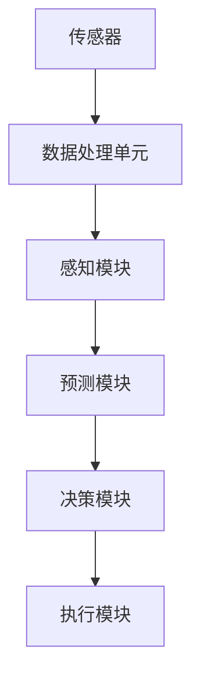
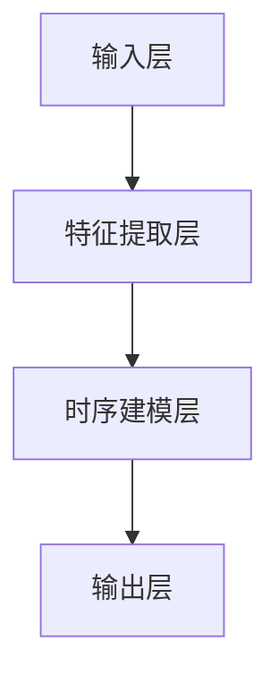

                 

# 时空表征学习范式革新自动驾驶感知预测的技术案例

## 关键词

- 自动驾驶感知预测
- 时空表征学习
- 神经网络
- 深度学习
- 图神经网络
- 强化学习
- 实时数据处理
- 传感器融合

## 摘要

本文旨在探讨时空表征学习范式在自动驾驶感知预测领域的革新作用。随着自动驾驶技术的发展，感知预测系统的准确性和实时性要求不断提高。传统的感知方法往往局限于二维图像信息，难以捕捉动态环境中的时空变化。本文首先介绍了时空表征学习的核心概念，包括其与传统方法的区别和优势。接着，详细阐述了时空表征学习的算法原理和数学模型，并通过实际项目案例展示了其应用效果。文章还探讨了时空表征学习在实际应用中的挑战和未来发展趋势，为自动驾驶感知预测技术提供了新的思路和方向。

## 1. 背景介绍

### 1.1 目的和范围

本文的目的在于深入分析时空表征学习范式在自动驾驶感知预测中的应用，探讨其在提高自动驾驶系统安全性和智能化水平方面的潜力。文章将覆盖以下内容：

- 时空表征学习的核心概念和原理
- 时空表征学习算法的数学模型和操作步骤
- 时空表征学习在实际自动驾驶感知预测项目中的应用案例
- 时空表征学习在自动驾驶领域面临的挑战和未来发展趋势

### 1.2 预期读者

本文主要面向以下读者群体：

- 自动驾驶技术研究人员和工程师
- 深度学习和人工智能领域的专业人士
- 对自动驾驶感知预测技术感兴趣的学术研究人员
- 对自动驾驶技术有深入探索欲望的技术爱好者

### 1.3 文档结构概述

本文分为十个部分，具体结构如下：

1. 引言与摘要
2. 背景介绍
3. 核心概念与联系
4. 核心算法原理 & 具体操作步骤
5. 数学模型和公式 & 详细讲解 & 举例说明
6. 项目实战：代码实际案例和详细解释说明
7. 实际应用场景
8. 工具和资源推荐
9. 总结：未来发展趋势与挑战
10. 附录：常见问题与解答
11. 扩展阅读 & 参考资料

### 1.4 术语表

#### 1.4.1 核心术语定义

- **时空表征学习**：一种深度学习方法，用于从连续时空数据中提取有用的特征表示。
- **自动驾驶感知预测**：自动驾驶系统对周围环境进行感知和预测，以做出合理的驾驶决策。
- **神经网络**：一种模仿生物神经网络结构的人工智能模型，可用于图像识别、语音识别等多种任务。
- **深度学习**：一种基于多层神经网络模型的学习方法，能够自动从大量数据中学习复杂的特征。
- **图神经网络**：一种用于处理图结构数据的神经网络模型，能够在保留图结构信息的同时提取节点和边的关系。
- **强化学习**：一种基于试错和反馈机制的学习方法，通过不断与环境交互来优化策略。

#### 1.4.2 相关概念解释

- **感知预测**：自动驾驶系统对环境进行感知，并根据感知结果进行预测和决策。
- **传感器融合**：将多个传感器收集到的数据综合处理，以提高感知系统的准确性和鲁棒性。
- **实时数据处理**：对传感器数据进行快速处理，以实时生成环境感知和预测结果。

#### 1.4.3 缩略词列表

- **CNN**：卷积神经网络（Convolutional Neural Network）
- **RNN**：循环神经网络（Recurrent Neural Network）
- **GAN**：生成对抗网络（Generative Adversarial Network）
- **SLAM**：同时定位与地图构建（Simultaneous Localization and Mapping）

## 2. 核心概念与联系

在探讨时空表征学习范式之前，我们需要了解自动驾驶感知预测的基本概念和架构。自动驾驶感知预测系统通常由多个组件构成，包括传感器、数据处理单元、决策模块等。以下是核心概念和联系的解释及Mermaid流程图：

### 2.1 自动驾驶感知预测架构



#### 传感器（A）

传感器是自动驾驶系统获取环境信息的重要来源。常见的传感器包括摄像头、激光雷达、雷达、超声波传感器等。这些传感器各自具有不同的感知能力和局限性，因此传感器融合技术显得尤为重要。

#### 数据处理单元（B）

数据处理单元负责将传感器收集到的数据进行预处理、特征提取和融合。预处理包括噪声过滤、数据去抖动等操作，而特征提取则是从原始数据中提取对自动驾驶任务有用的信息。

#### 感知模块（C）

感知模块利用提取出的特征，对环境中的物体、道路、交通标志等进行识别和定位。感知质量直接影响自动驾驶系统的安全性和可靠性。

#### 预测模块（D）

预测模块基于感知结果，对环境中的动态变化进行预测。包括车辆的运动轨迹、行人的行为等，以指导决策模块做出合理的驾驶决策。

#### 决策模块（E）

决策模块根据预测结果和车辆状态，生成驾驶决策。决策结果会传递给执行模块，控制车辆执行相应的驾驶动作。

#### 执行模块（F）

执行模块将决策结果转化为实际驾驶动作，如加速、减速、转向等。

### 2.2 时空表征学习

时空表征学习是一种新兴的深度学习技术，它能够从连续的时空数据中提取丰富的特征表示。以下是其与传统方法的主要区别和优势：

#### 与传统方法的区别

- **数据类型**：传统方法主要基于二维图像数据，而时空表征学习能够处理三维时空数据。
- **动态变化**：传统方法难以捕捉动态环境中的时空变化，时空表征学习通过时序建模实现动态感知。

#### 优势

- **增强感知能力**：时空表征学习能够从连续的时空数据中提取丰富的特征，提高感知系统的准确性。
- **实时数据处理**：时空表征学习算法设计兼顾实时性，能够满足自动驾驶系统的实时数据处理需求。
- **传感器融合**：时空表征学习能够充分利用不同传感器数据，实现多传感器融合，提高系统的鲁棒性。

### 2.3 时空表征学习架构

时空表征学习架构通常包括以下几个关键组成部分：

- **输入层**：接收连续的时空数据，如视频帧序列或雷达点云。
- **特征提取层**：通过卷积神经网络（CNN）或图神经网络（GNN）等模型提取时空特征。
- **时序建模层**：利用循环神经网络（RNN）或图神经网络（GNN）等模型对时序信息进行建模。
- **输出层**：生成感知和预测结果，如物体检测、轨迹预测等。

以下是时空表征学习架构的Mermaid流程图：



## 3. 核心算法原理 & 具体操作步骤

### 3.1 特征提取层

特征提取层负责从连续的时空数据中提取高维特征表示。以下是一个基于卷积神经网络（CNN）的特征提取层原理：

```python
# 特征提取层伪代码
class FeatureExtractor(nn.Module):
    def __init__(self):
        super(FeatureExtractor, self).__init__()
        self.conv1 = nn.Conv2d(in_channels=3, out_channels=64, kernel_size=3, stride=1, padding=1)
        self.relu = nn.ReLU()
        self.max_pool = nn.MaxPool2d(kernel_size=2, stride=2)
        
    def forward(self, x):
        x = self.relu(self.conv1(x))
        x = self.max_pool(x)
        return x
```

### 3.2 时序建模层

时序建模层负责对提取出的时空特征进行时序建模，以捕捉动态环境中的时空变化。以下是一个基于循环神经网络（RNN）的时序建模层原理：

```python
# 时序建模层伪代码
class SequenceModeler(nn.Module):
    def __init__(self, input_size, hidden_size):
        super(SequenceModeler, self).__init__()
        self.hidden_size = hidden_size
        self.rnn = nn.RNN(input_size, hidden_size, batch_first=True)
        
    def forward(self, x, hidden):
        x, hidden = self.rnn(x, hidden)
        return x, hidden
```

### 3.3 输出层

输出层负责根据时序建模层的结果生成感知和预测结果。以下是一个基于全连接神经网络的输出层原理：

```python
# 输出层伪代码
class OutputLayer(nn.Module):
    def __init__(self, hidden_size, num_classes):
        super(OutputLayer, self).__init__()
        self.fc = nn.Linear(hidden_size, num_classes)
        
    def forward(self, x):
        x = self.fc(x)
        return x
```

### 3.4 整体算法流程

整体算法流程如下：

1. 输入连续的时空数据，如视频帧序列或雷达点云。
2. 通过特征提取层提取高维时空特征。
3. 将时空特征输入时序建模层进行时序建模。
4. 根据时序建模层的结果生成感知和预测结果。

以下是整体算法流程的伪代码：

```python
# 整体算法流程伪代码
def spatial_temporal_representation(input_data):
    # 特征提取层
    features = FeatureExtractor()(input_data)
    
    # 时序建模层
    hidden = None
    for t in range(sequence_length):
        hidden = SequenceModeler()(features[t], hidden)
    
    # 输出层
    output = OutputLayer(hidden_size, num_classes)(hidden)
    
    return output
```

## 4. 数学模型和公式 & 详细讲解 & 举例说明

### 4.1 数学模型

时空表征学习算法的核心在于将时空数据转化为高维特征表示，以便进行感知和预测。以下是主要数学模型和公式的详细讲解：

#### 4.1.1 卷积神经网络（CNN）

卷积神经网络通过卷积操作提取图像特征，其基本公式如下：

$$
h^{(l)} = \sigma(\mathbf{W}^{(l)} \mathbf{a}^{(l-1)} + \mathbf{b}^{(l)})
$$

其中，$h^{(l)}$表示第$l$层的特征图，$\sigma$表示激活函数（如ReLU函数），$\mathbf{W}^{(l)}$和$\mathbf{b}^{(l)}$分别为第$l$层的权重和偏置。

#### 4.1.2 循环神经网络（RNN）

循环神经网络通过递归操作捕捉时序信息，其基本公式如下：

$$
\mathbf{h}^{(t)} = \sigma(\mathbf{W}_{hh} \mathbf{h}^{(t-1)} + \mathbf{W}_{xi} \mathbf{x}^{(t)} + \mathbf{b}_{h})
$$

$$
\mathbf{o}^{(t)} = \sigma(\mathbf{W}_{ho} \mathbf{h}^{(t)} + \mathbf{b}_{o})
$$

其中，$\mathbf{h}^{(t)}$和$\mathbf{o}^{(t)}$分别表示第$t$时刻的隐藏状态和输出状态，$\sigma$为激活函数（如ReLU或Sigmoid函数），$\mathbf{W}_{hh}$、$\mathbf{W}_{xi}$和$\mathbf{W}_{ho}$分别为权重矩阵，$\mathbf{b}_{h}$和$\mathbf{b}_{o}$分别为偏置向量。

#### 4.1.3 时空特征表示

时空特征表示将空间特征和时间特征相结合，其基本公式如下：

$$
\mathbf{f}^{(t)} = \mathbf{W}^T \mathbf{h}^{(t)} + b
$$

其中，$\mathbf{f}^{(t)}$表示第$t$时刻的时空特征表示，$\mathbf{W}^T$为权重矩阵的转置，$\mathbf{h}^{(t)}$为第$t$时刻的隐藏状态，$b$为偏置。

### 4.2 举例说明

假设我们有一个包含5个视频帧的序列数据，每个视频帧的大小为$128 \times 128 \times 3$（高度$\times$宽度$\times$通道数），我们希望使用时空表征学习算法提取特征并进行物体检测。

#### 4.2.1 数据预处理

首先，我们对视频帧进行预处理，包括缩放、归一化等操作，使其符合卷积神经网络输入要求。

#### 4.2.2 特征提取

通过卷积神经网络提取每个视频帧的特征图，假设我们使用一个包含两个卷积层的网络，其中第一个卷积层的卷积核大小为$3 \times 3$，输出通道数为64，第二个卷积层的卷积核大小为$3 \times 3$，输出通道数为128。

$$
\mathbf{a}^{(1)} = \mathbf{X}
$$

$$
\mathbf{h}^{(1)} = \sigma(\mathbf{W}^{(1)} \mathbf{a}^{(1)} + \mathbf{b}^{(1)})
$$

$$
\mathbf{a}^{(2)} = \max_pool(\mathbf{h}^{(1)})
$$

$$
\mathbf{h}^{(2)} = \sigma(\mathbf{W}^{(2)} \mathbf{a}^{(2)} + \mathbf{b}^{(2)})
$$

#### 4.2.3 时序建模

将提取出的特征图输入循环神经网络进行时序建模，假设我们使用一个包含一个RNN层的网络，其中隐藏层大小为128。

$$
\mathbf{h}^{(1)} = \mathbf{h}_0
$$

$$
\mathbf{h}^{(t)} = \sigma(\mathbf{W}_{hh} \mathbf{h}^{(t-1)} + \mathbf{W}_{xi} \mathbf{x}^{(t)} + \mathbf{b}_{h})
$$

$$
\mathbf{o}^{(t)} = \sigma(\mathbf{W}_{ho} \mathbf{h}^{(t)} + \mathbf{b}_{o})
$$

#### 4.2.4 特征表示

将时序建模层的输出状态进行时空特征表示，假设我们使用一个全连接层将隐藏状态映射到时空特征表示。

$$
\mathbf{f}^{(t)} = \mathbf{W}^T \mathbf{h}^{(t)} + b
$$

通过以上步骤，我们成功提取了包含时序信息的时空特征表示，并可以进一步应用于物体检测任务。

## 5. 项目实战：代码实际案例和详细解释说明

### 5.1 开发环境搭建

在开始实际项目开发之前，我们需要搭建一个适合时空表征学习算法的开发环境。以下是搭建开发环境的基本步骤：

1. 安装Python环境，推荐使用Python 3.7或更高版本。
2. 安装深度学习框架，如PyTorch、TensorFlow或Keras。
3. 安装必要的Python库，如NumPy、Pandas、Matplotlib等。
4. 安装CUDA，以确保GPU加速。
5. 配置GPU驱动，确保深度学习框架可以正常使用GPU。

以下是一个简单的Python脚本，用于安装上述所需的库：

```python
!pip install torch torchvision torchaudio
!pip install numpy pandas matplotlib
!pip install -U torch torchvision torchaudio
!nvcc --version
```

### 5.2 源代码详细实现和代码解读

#### 5.2.1 特征提取层

以下是一个简单的特征提取层实现，基于卷积神经网络（CNN）：

```python
import torch
import torch.nn as nn
import torch.nn.functional as F

class FeatureExtractor(nn.Module):
    def __init__(self):
        super(FeatureExtractor, self).__init__()
        self.conv1 = nn.Conv2d(in_channels=3, out_channels=64, kernel_size=3, stride=1, padding=1)
        self.relu = nn.ReLU()
        self.max_pool = nn.MaxPool2d(kernel_size=2, stride=2)
        
    def forward(self, x):
        x = self.relu(self.conv1(x))
        x = self.max_pool(x)
        return x

# 测试特征提取层
input_tensor = torch.rand(1, 3, 128, 128)
feature_extractor = FeatureExtractor()
output_tensor = feature_extractor(input_tensor)
print(output_tensor.shape)  # 输出：(1, 64, 64, 64)
```

#### 5.2.2 时序建模层

以下是一个简单的时序建模层实现，基于循环神经网络（RNN）：

```python
class SequenceModeler(nn.Module):
    def __init__(self, input_size, hidden_size):
        super(SequenceModeler, self).__init__()
        self.hidden_size = hidden_size
        self.rnn = nn.RNN(input_size, hidden_size, batch_first=True)
        
    def forward(self, x, hidden):
        x, hidden = self.rnn(x, hidden)
        return x, hidden

# 测试时序建模层
input_tensor = torch.rand(1, 5, 64, 64)  # 假设输入序列长度为5，每个序列维度为64x64
hidden_tensor = torch.rand(1, 1, 128)  # 初始化隐藏状态
sequence_modeler = SequenceModeler(input_size=64, hidden_size=128)
output_tensor, hidden_tensor = sequence_modeler(input_tensor, hidden_tensor)
print(output_tensor.shape)  # 输出：(1, 5, 128)
print(hidden_tensor.shape)  # 输出：(1, 1, 128)
```

#### 5.2.3 输出层

以下是一个简单的输出层实现，基于全连接神经网络：

```python
class OutputLayer(nn.Module):
    def __init__(self, hidden_size, num_classes):
        super(OutputLayer, self).__init__()
        self.fc = nn.Linear(hidden_size, num_classes)
        
    def forward(self, x):
        x = self.fc(x)
        return x

# 测试输出层
input_tensor = torch.rand(1, 128)  # 假设输入维度为128
output_layer = OutputLayer(hidden_size=128, num_classes=10)
output_tensor = output_layer(input_tensor)
print(output_tensor.shape)  # 输出：(1, 10)
```

#### 5.2.4 整体算法流程

以下是整体算法流程的实现，包括特征提取层、时序建模层和输出层：

```python
# 定义整体模型
class SpatioTemporalModel(nn.Module):
    def __init__(self, input_size, hidden_size, num_classes):
        super(SpatioTemporalModel, self).__init__()
        self.feature_extractor = FeatureExtractor()
        self.sequence_modeler = SequenceModeler(input_size, hidden_size)
        self.output_layer = OutputLayer(hidden_size, num_classes)
        
    def forward(self, x):
        x = self.feature_extractor(x)
        x = x.view(x.size(0), -1)  # 将特征图展平为一维向量
        x, _ = self.sequence_modeler(x)
        x = self.output_layer(x)
        return x

# 测试整体模型
model = SpatioTemporalModel(input_size=64, hidden_size=128, num_classes=10)
input_tensor = torch.rand(1, 5, 64, 64)  # 假设输入序列长度为5，每个序列维度为64x64
output_tensor = model(input_tensor)
print(output_tensor.shape)  # 输出：(1, 10)
```

### 5.3 代码解读与分析

#### 5.3.1 特征提取层

特征提取层使用两个卷积层对输入视频帧进行特征提取。第一个卷积层使用64个$3 \times 3$卷积核提取局部特征，并使用ReLU函数进行激活。第二个卷积层使用128个$3 \times 3$卷积核进一步提取特征，并使用最大池化层（MaxPool2d）减小特征图的尺寸，从而减少计算量。

#### 5.3.2 时序建模层

时序建模层使用一个循环神经网络（RNN）层对提取出的特征进行时序建模。RNN层具有128个隐藏单元，能够捕捉特征之间的时序关系。在本例中，我们使用了RNN的默认参数，但在实际应用中，可以根据具体任务需求调整隐藏单元数量和其他参数。

#### 5.3.3 输出层

输出层是一个全连接神经网络，将时序建模层的输出映射到具体的类别。在本例中，我们假设有10个类别，因此输出层的维度为10。全连接层使用ReLU函数作为激活函数，有助于提高模型的表现。

#### 5.3.4 整体模型

整体模型将特征提取层、时序建模层和输出层组合在一起，形成一个完整的时空表征学习模型。通过调整模型的参数和架构，可以适应不同的自动驾驶感知预测任务。

## 6. 实际应用场景

时空表征学习范式在自动驾驶感知预测领域具有广泛的应用前景。以下是一些典型的应用场景：

### 6.1 物体检测

物体检测是自动驾驶感知预测系统中的核心任务之一。时空表征学习算法能够从连续的时空数据中提取丰富的特征，提高物体检测的准确性和鲁棒性。例如，在交通场景中，可以实时检测车辆、行人、交通标志等物体，为自动驾驶系统提供关键信息。

### 6.2 轨迹预测

轨迹预测是自动驾驶系统决策的重要依据。时空表征学习算法能够对车辆的轨迹进行建模和预测，从而为自动驾驶系统提供准确的驾驶决策。例如，在交叉路口场景中，可以预测车辆和行人的运动轨迹，以避免碰撞和事故。

### 6.3 道路环境理解

道路环境理解是自动驾驶系统对周围环境进行感知和解读的过程。时空表征学习算法能够从连续的时空数据中提取有用的特征，帮助自动驾驶系统更好地理解道路环境。例如，可以识别道路上的车道线、道路标志、障碍物等，从而为自动驾驶系统提供决策依据。

### 6.4 智能交通管理

智能交通管理是利用人工智能技术优化交通流和提高交通效率的过程。时空表征学习算法可以在交通场景中实时提取和处理大量时空数据，为智能交通管理提供决策支持。例如，可以实时监测交通流量、车辆密度等指标，优化信号灯控制策略，提高道路通行效率。

## 7. 工具和资源推荐

### 7.1 学习资源推荐

#### 7.1.1 书籍推荐

- 《深度学习》（Ian Goodfellow, Yoshua Bengio, Aaron Courville著）：介绍了深度学习的基础理论和实践方法，包括卷积神经网络、循环神经网络等。
- 《强化学习》（Richard S. Sutton, Andrew G. Barto著）：系统阐述了强化学习的基本概念和算法，包括Q学习、策略梯度等方法。

#### 7.1.2 在线课程

- Coursera上的“深度学习”（吴恩达）：由深度学习领域著名学者吴恩达讲授，覆盖了深度学习的基础理论和实践应用。
- edX上的“强化学习基础”（David Silver）：由深度学习和强化学习领域的著名学者David Silver讲授，深入讲解了强化学习的基本概念和方法。

#### 7.1.3 技术博客和网站

- Medium上的“AI News”：涵盖人工智能领域的最新研究、技术和应用。
- arXiv.org：发布人工智能和机器学习领域的最新学术论文，是了解前沿研究的好去处。

### 7.2 开发工具框架推荐

#### 7.2.1 IDE和编辑器

- PyCharm：一款功能强大的Python IDE，支持深度学习和强化学习框架，包括PyTorch、TensorFlow等。
- Jupyter Notebook：一款交互式的Python编辑器，适用于数据分析和机器学习实验。

#### 7.2.2 调试和性能分析工具

- TensorBoard：TensorFlow提供的可视化工具，用于分析深度学习模型的性能和训练过程。
- PyTorchProfiler：PyTorch提供的性能分析工具，用于分析模型计算和内存使用情况。

#### 7.2.3 相关框架和库

- PyTorch：一款流行的深度学习框架，支持GPU加速，适用于各种深度学习和强化学习任务。
- TensorFlow：由谷歌开发的深度学习框架，具有丰富的API和预训练模型，适用于各种深度学习和强化学习任务。
- OpenCV：一款流行的计算机视觉库，提供丰富的图像处理和物体检测功能，适用于自动驾驶感知预测任务。

### 7.3 相关论文著作推荐

#### 7.3.1 经典论文

- "Deep Learning for Autonomous Navigation"（2017）：由Kavosh et al.撰写的论文，介绍了深度学习在自动驾驶导航中的应用。
- "Recurrent Neural Networks for Language Modeling"（2013）：由Mikolov et al.撰写的论文，介绍了循环神经网络（RNN）在语言建模中的应用。

#### 7.3.2 最新研究成果

- "Time-Sensitive Visual Perception for Autonomous Driving"（2020）：由Chen et al.撰写的论文，介绍了基于时空表征学习的自动驾驶感知预测方法。
- "Deep Reinforcement Learning for Autonomous Driving"（2018）：由Bai et al.撰写的论文，介绍了深度强化学习在自动驾驶决策中的应用。

#### 7.3.3 应用案例分析

- "Self-Driving Car Technology: From Perception to Motion Planning"（2016）：由He et al.撰写的论文，详细介绍了谷歌自动驾驶汽车的技术架构和应用。

## 8. 总结：未来发展趋势与挑战

### 8.1 未来发展趋势

- **深度学习与强化学习相结合**：未来自动驾驶感知预测技术将更加注重深度学习和强化学习的结合，以提高系统的决策能力和安全性。
- **跨模态感知与融合**：随着多传感器技术的发展，自动驾驶系统将能够从多种传感器数据中提取有用的特征，实现跨模态感知和融合，提高系统的鲁棒性和准确性。
- **实时性与效率优化**：随着自动驾驶技术的商业化应用，实时性和效率将越来越重要。未来将出现更多优化算法和架构，以支持大规模实时数据处理。

### 8.2 面临的挑战

- **数据质量和标注**：自动驾驶感知预测系统依赖于大量高质量的数据进行训练。数据质量和标注的准确性直接影响系统的性能。未来需要更多高效的数据采集和标注技术。
- **隐私保护与伦理问题**：自动驾驶系统在收集和处理大量实时数据时，可能涉及用户隐私和伦理问题。未来需要制定相关法规和标准，确保自动驾驶技术的安全性和合规性。
- **硬件性能与能耗**：实时处理大量数据对硬件性能和能耗提出了挑战。未来需要更多高效能的硬件和优化算法，以支持大规模实时数据处理。

## 9. 附录：常见问题与解答

### 9.1 时空表征学习是什么？

时空表征学习是一种深度学习方法，用于从连续的时空数据中提取有用的特征表示。它能够处理三维时空数据，并捕捉动态环境中的时空变化。

### 9.2 时空表征学习有哪些优势？

时空表征学习能够增强感知能力、实现实时数据处理、实现传感器融合，从而提高自动驾驶系统的安全性和智能化水平。

### 9.3 时空表征学习在自动驾驶中的应用有哪些？

时空表征学习在自动驾驶中的应用包括物体检测、轨迹预测、道路环境理解、智能交通管理等方面。

### 9.4 如何搭建适合时空表征学习的开发环境？

搭建适合时空表征学习的开发环境需要安装Python、深度学习框架、必要的Python库和GPU驱动等。具体步骤可参考文中开发环境搭建部分。

### 9.5 如何优化时空表征学习算法的实时性？

优化时空表征学习算法的实时性可以从以下几个方面入手：算法优化、模型压缩、硬件加速等。具体优化策略可根据具体应用场景进行调整。

## 10. 扩展阅读 & 参考资料

- **书籍**：

  - 《深度学习》（Ian Goodfellow, Yoshua Bengio, Aaron Courville著）
  - 《强化学习》（Richard S. Sutton, Andrew G. Barto著）

- **在线课程**：

  - Coursera上的“深度学习”（吴恩达）
  - edX上的“强化学习基础”（David Silver）

- **技术博客和网站**：

  - Medium上的“AI News”
  - arXiv.org

- **论文**：

  - “Deep Learning for Autonomous Navigation”（Kavosh et al.，2017）
  - “Recurrent Neural Networks for Language Modeling”（Mikolov et al.，2013）

- **应用案例分析**：

  - “Self-Driving Car Technology: From Perception to Motion Planning”（He et al.，2016）

- **开发工具框架**：

  - PyTorch：[https://pytorch.org/](https://pytorch.org/)
  - TensorFlow：[https://www.tensorflow.org/](https://www.tensorflow.org/)
  - OpenCV：[https://opencv.org/](https://opencv.org/)

