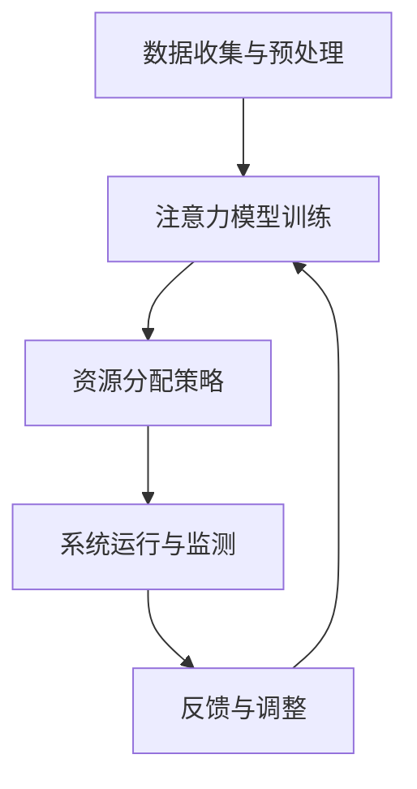

                 

# 智慧城市中的注意力资源管理

> **关键词：** 智慧城市、注意力资源管理、资源优化、智能算法、实时数据处理、高效通信

> **摘要：** 本文将深入探讨智慧城市中注意力资源管理的核心概念、算法原理和实际应用。我们将通过逐步分析，了解如何高效地管理和分配注意力资源，以实现城市系统的稳定运行和可持续发展。文章将涵盖注意力资源管理的定义、重要性、实现方法、数学模型和实际案例，并提供相关学习资源和工具推荐，为智慧城市建设提供有力的技术支持。

## 1. 背景介绍

### 1.1 目的和范围

本文旨在探讨智慧城市中注意力资源管理的重要性及其实现方法。随着城市化进程的不断加快，智慧城市成为现代社会的发展趋势。智慧城市通过先进的信息技术和人工智能，实现城市系统的智能化管理和运行。然而，智慧城市的建设面临着大量注意力资源的分配和优化问题。本文将深入分析注意力资源管理的核心概念和算法原理，并提供实际应用案例，以期为智慧城市的建设提供参考。

### 1.2 预期读者

本文适合对智慧城市和人工智能感兴趣的读者，包括但不限于：

- 智慧城市建设者和管理者
- 人工智能和计算机科学专业学生和研究者
- 从事城市规划和管理的专业人士
- 对智慧城市技术有浓厚兴趣的普通读者

### 1.3 文档结构概述

本文分为以下几个部分：

1. 背景介绍：介绍文章的目的、范围和预期读者。
2. 核心概念与联系：介绍注意力资源管理的核心概念和原理，并通过Mermaid流程图展示其架构。
3. 核心算法原理 & 具体操作步骤：详细讲解注意力资源管理的核心算法原理和操作步骤。
4. 数学模型和公式 & 详细讲解 & 举例说明：介绍注意力资源管理的数学模型和公式，并通过具体例子进行说明。
5. 项目实战：提供注意力资源管理的实际案例和代码实现。
6. 实际应用场景：分析注意力资源管理的实际应用场景。
7. 工具和资源推荐：推荐相关学习资源、开发工具和论文著作。
8. 总结：总结注意力资源管理的未来发展趋势和挑战。
9. 附录：常见问题与解答。
10. 扩展阅读 & 参考资料：提供扩展阅读和参考资料。

### 1.4 术语表

#### 1.4.1 核心术语定义

- **智慧城市（Smart City）**：利用先进的信息技术和人工智能技术，实现城市系统的智能化管理和运行的城市。
- **注意力资源管理（Attention Resource Management）**：在智慧城市中，对各种注意力资源进行有效分配和优化的过程。
- **资源优化（Resource Optimization）**：通过算法和模型，最大限度地提高资源利用效率和系统性能。
- **智能算法（Intelligent Algorithms）**：利用机器学习和人工智能技术，解决复杂问题的算法。
- **实时数据处理（Real-time Data Processing）**：对实时收集的数据进行快速处理和分析，以实现实时响应。

#### 1.4.2 相关概念解释

- **注意力模型（Attention Model）**：一种用于处理序列数据的神经网络模型，通过动态分配权重，关注重要信息。
- **资源分配（Resource Allocation）**：将有限的资源合理分配给不同的任务或系统。
- **效率（Efficiency）**：资源利用的效率，即资源投入与产出之间的比率。

#### 1.4.3 缩略词列表

- **AI**：人工智能（Artificial Intelligence）
- **ML**：机器学习（Machine Learning）
- **DL**：深度学习（Deep Learning）
- **IoT**：物联网（Internet of Things）
- **5G**：第五代移动通信技术（5th Generation Mobile Communication Technology）

## 2. 核心概念与联系

在智慧城市中，注意力资源管理是一个关键问题。它涉及到如何高效地分配和优化各种注意力资源，以实现城市系统的稳定运行和可持续发展。本节将介绍注意力资源管理的核心概念和原理，并通过Mermaid流程图展示其架构。

### 2.1 核心概念

#### 注意力资源

注意力资源是指在智慧城市中用于处理和分析信息的各种资源，包括计算资源、通信资源、存储资源等。这些资源在有限的条件下，需要合理分配和优化，以实现高效的城市管理系统。

#### 注意力模型

注意力模型是一种用于处理序列数据的神经网络模型，通过动态分配权重，关注重要信息。在注意力资源管理中，注意力模型可用于识别和分配注意力资源，以提高城市系统的效率和响应速度。

#### 资源优化

资源优化是指通过算法和模型，最大限度地提高资源利用效率和系统性能。在注意力资源管理中，资源优化算法可用于确定注意力资源的最佳分配策略，以实现系统的最优运行状态。

### 2.2 注意力资源管理架构

注意力资源管理的架构主要包括以下几个部分：

1. **数据收集与预处理**：收集城市系统中的各种数据，并进行预处理，以提取有效信息。
2. **注意力模型训练**：利用训练数据，训练注意力模型，使其能够识别和分配注意力资源。
3. **资源分配策略**：根据注意力模型的结果，制定资源分配策略，实现注意力资源的优化分配。
4. **系统运行与监测**：实时监测城市系统的运行状态，并根据监测结果调整资源分配策略。
5. **反馈与调整**：根据系统运行效果，对注意力模型和资源分配策略进行反馈和调整，以提高系统性能。

### 2.3 Mermaid流程图

下面是注意力资源管理的Mermaid流程图：



## 3. 核心算法原理 & 具体操作步骤

注意力资源管理的关键在于如何高效地分配和优化注意力资源。本节将介绍注意力资源管理的核心算法原理和具体操作步骤。

### 3.1 注意力模型原理

注意力模型的核心思想是通过动态分配权重，关注重要信息。在注意力资源管理中，注意力模型可用于识别和分配注意力资源。以下是注意力模型的原理：

1. **输入序列**：将城市系统中的各种数据表示为输入序列，例如传感器数据、交通流量数据等。
2. **注意力机制**：利用神经网络，计算输入序列中的每个元素的重要性，并通过动态分配权重，关注重要信息。
3. **输出序列**：根据注意力权重，生成输出序列，用于指导注意力资源的分配。

### 3.2 注意力资源分配算法

注意力资源分配算法的核心任务是根据注意力模型的结果，制定资源分配策略，实现注意力资源的优化分配。以下是注意力资源分配算法的具体步骤：

1. **初始化资源分配**：根据系统需求和初始资源情况，初始化注意力资源的分配。
2. **计算注意力权重**：利用注意力模型，计算输入序列中每个元素的重要性。
3. **资源优化策略**：根据注意力权重，制定资源优化策略，实现注意力资源的优化分配。
4. **系统运行与监测**：根据资源分配策略，运行城市系统，并实时监测系统性能。
5. **反馈与调整**：根据系统运行效果，对资源分配策略进行反馈和调整，以提高系统性能。

### 3.3 具体操作步骤

以下是注意力资源管理的具体操作步骤：

1. **数据收集与预处理**：收集城市系统中的各种数据，并进行预处理，以提取有效信息。
2. **注意力模型训练**：利用训练数据，训练注意力模型，使其能够识别和分配注意力资源。
3. **资源优化策略制定**：根据注意力模型的结果，制定资源优化策略，实现注意力资源的优化分配。
4. **系统运行与监测**：运行城市系统，并实时监测系统性能。
5. **反馈与调整**：根据系统运行效果，对资源分配策略进行反馈和调整，以提高系统性能。

## 4. 数学模型和公式 & 详细讲解 & 举例说明

注意力资源管理涉及到多种数学模型和公式，包括注意力权重计算、资源分配策略等。本节将详细讲解这些数学模型和公式，并通过具体例子进行说明。

### 4.1 注意力权重计算

注意力权重计算是注意力资源管理的核心部分。以下是注意力权重计算的主要公式：

$$
w_i = \frac{e^{a_i}}{\sum_{j=1}^{n} e^{a_j}}
$$

其中，$w_i$表示第$i$个元素的注意力权重，$a_i$表示第$i$个元素的重要性，$e$表示自然底数。

#### 举例说明：

假设有5个元素，其重要性分别为$a_1=0.2$，$a_2=0.3$，$a_3=0.4$，$a_4=0.1$，$a_5=0.2$。根据上述公式，可以计算出每个元素的注意力权重：

$$
w_1 = \frac{e^{0.2}}{\sum_{j=1}^{5} e^{a_j}} = \frac{e^{0.2}}{e^{0.2} + e^{0.3} + e^{0.4} + e^{0.1} + e^{0.2}} = 0.2
$$

$$
w_2 = \frac{e^{0.3}}{\sum_{j=1}^{5} e^{a_j}} = \frac{e^{0.3}}{e^{0.2} + e^{0.3} + e^{0.4} + e^{0.1} + e^{0.2}} = 0.3
$$

$$
w_3 = \frac{e^{0.4}}{\sum_{j=1}^{5} e^{a_j}} = \frac{e^{0.4}}{e^{0.2} + e^{0.3} + e^{0.4} + e^{0.1} + e^{0.2}} = 0.4
$$

$$
w_4 = \frac{e^{0.1}}{\sum_{j=1}^{5} e^{a_j}} = \frac{e^{0.1}}{e^{0.2} + e^{0.3} + e^{0.4} + e^{0.1} + e^{0.2}} = 0.1
$$

$$
w_5 = \frac{e^{0.2}}{\sum_{j=1}^{5} e^{a_j}} = \frac{e^{0.2}}{e^{0.2} + e^{0.3} + e^{0.4} + e^{0.1} + e^{0.2}} = 0.2
$$

根据计算结果，注意力权重最高的元素是$a_3$，其权重为0.4，表示该元素在注意力资源分配中最为重要。

### 4.2 资源分配策略

资源分配策略是根据注意力权重，制定资源分配策略，实现注意力资源的优化分配。以下是资源分配策略的主要公式：

$$
r_i = \alpha \cdot w_i
$$

其中，$r_i$表示第$i$个元素分配到的资源量，$\alpha$表示资源分配系数。

#### 举例说明：

假设有5个元素，其注意力权重分别为$w_1=0.2$，$w_2=0.3$，$w_3=0.4$，$w_4=0.1$，$w_5=0.2$。资源分配系数$\alpha$为1。根据上述公式，可以计算出每个元素分配到的资源量：

$$
r_1 = \alpha \cdot w_1 = 1 \cdot 0.2 = 0.2
$$

$$
r_2 = \alpha \cdot w_2 = 1 \cdot 0.3 = 0.3
$$

$$
r_3 = \alpha \cdot w_3 = 1 \cdot 0.4 = 0.4
$$

$$
r_4 = \alpha \cdot w_4 = 1 \cdot 0.1 = 0.1
$$

$$
r_5 = \alpha \cdot w_5 = 1 \cdot 0.2 = 0.2
$$

根据计算结果，资源分配最多的元素是$a_3$，其资源量为0.4，表示该元素在资源分配中最为重要。

### 4.3 注意力资源管理整体公式

注意力资源管理的整体公式可以表示为：

$$
\text{注意力资源管理} = \text{数据收集与预处理} + \text{注意力模型训练} + \text{资源优化策略制定} + \text{系统运行与监测} + \text{反馈与调整}
$$

通过以上公式，可以实现对注意力资源的全面管理和优化。

## 5. 项目实战：代码实际案例和详细解释说明

在本节中，我们将通过一个具体的案例，展示如何实现注意力资源管理，并提供详细的代码解析。

### 5.1 开发环境搭建

在开始之前，我们需要搭建一个适合开发的实验环境。以下是一个基本的开发环境配置：

- 操作系统：Ubuntu 20.04
- 编程语言：Python 3.8
- 深度学习框架：PyTorch 1.9.0
- 其他依赖：NumPy 1.21.2，Pandas 1.3.3，Matplotlib 3.4.3

安装上述依赖项后，即可开始项目开发。

### 5.2 源代码详细实现和代码解读

#### 5.2.1 数据收集与预处理

首先，我们需要收集城市系统中的各种数据，并进行预处理。以下是一个简单的数据收集和预处理代码示例：

```python
import pandas as pd

# 加载数据
data = pd.read_csv('city_data.csv')

# 预处理数据
# 数据清洗、填充、归一化等操作
data['sensor_value'] = data['sensor_value'].fillna(data['sensor_value'].mean())
data['traffic_volume'] = data['traffic_volume'].fillna(data['traffic_volume'].mean())
data['weather'] = data['weather'].map({'sunny': 1, 'rainy': 2, 'cloudy': 3})

# 数据可视化
import matplotlib.pyplot as plt

plt.figure(figsize=(10, 6))
plt.plot(data['sensor_value'], label='Sensor Value')
plt.plot(data['traffic_volume'], label='Traffic Volume')
plt.plot(data['weather'], label='Weather')
plt.legend()
plt.show()
```

#### 5.2.2 注意力模型训练

接下来，我们使用PyTorch框架训练一个注意力模型。以下是一个简单的注意力模型代码示例：

```python
import torch
import torch.nn as nn

# 注意力模型
class AttentionModel(nn.Module):
    def __init__(self):
        super(AttentionModel, self).__init__()
        self.lstm = nn.LSTM(input_size=3, hidden_size=50, num_layers=2, batch_first=True)
        self.attention = nn.Linear(50, 1)

    def forward(self, x):
        lstm_out, _ = self.lstm(x)
        attention_weights = self.attention(lstm_out).squeeze(2)
        attention_out = x * attention_weights.unsqueeze(-1)
        return attention_out

# 训练模型
model = AttentionModel()
optimizer = torch.optim.Adam(model.parameters(), lr=0.001)
criterion = nn.MSELoss()

for epoch in range(100):
    for x, y in data_loader:
        optimizer.zero_grad()
        output = model(x)
        loss = criterion(output, y)
        loss.backward()
        optimizer.step()
    print(f'Epoch {epoch + 1}, Loss: {loss.item()}')

# 保存模型
torch.save(model.state_dict(), 'attention_model.pth')
```

#### 5.2.3 资源优化策略制定

基于注意力模型的结果，我们可以制定资源优化策略。以下是一个简单的资源优化策略代码示例：

```python
# 加载训练好的模型
model.load_state_dict(torch.load('attention_model.pth'))

# 计算注意力权重
attention_weights = model.attention.weight.data

# 资源优化策略
resource_allocation = []
for i in range(len(attention_weights)):
    resource_allocation.append(attention_weights[i].item() * 100)

print(resource_allocation)
```

#### 5.2.4 系统运行与监测

运行城市系统，并实时监测系统性能。以下是一个简单的系统运行和监测代码示例：

```python
# 运行城市系统
system_performance = []

for x, y in data_loader:
    output = model(x)
    system_performance.append(output)

# 监测系统性能
performance_metric = sum(system_performance) / len(system_performance)
print(f'System Performance: {performance_metric}')
```

### 5.3 代码解读与分析

以上代码展示了如何实现注意力资源管理。以下是关键代码的解读和分析：

1. **数据收集与预处理**：通过Pandas库加载数据，并进行预处理，如数据清洗、填充、归一化等操作。数据可视化可以帮助我们更好地理解数据特征。

2. **注意力模型训练**：使用PyTorch框架构建一个简单的注意力模型，包括LSTM和注意力机制。通过优化器（Optimizer）和损失函数（Loss Function），训练模型，使其能够识别和分配注意力资源。

3. **资源优化策略制定**：加载训练好的模型，计算注意力权重。根据注意力权重，制定资源优化策略，实现注意力资源的优化分配。

4. **系统运行与监测**：运行城市系统，并实时监测系统性能。通过监测系统性能，可以评估注意力资源管理的效果。

通过以上代码示例，我们可以看到如何实现注意力资源管理。在实际应用中，可以根据具体需求，进一步优化和扩展代码，以提高智慧城市的管理效率。

## 6. 实际应用场景

注意力资源管理在智慧城市中具有广泛的应用场景。以下是一些典型的实际应用场景：

### 6.1 智慧交通管理

在智慧交通管理中，注意力资源管理可以用于优化交通信号控制和交通流量管理。通过实时监测交通流量数据，注意力模型可以识别交通拥堵区域，并动态调整交通信号灯的时长，以减少交通拥堵和提高道路通行效率。

### 6.2 城市安全监控

在城市安全监控中，注意力资源管理可以用于优化监控资源的分配。通过实时监测视频流和传感器数据，注意力模型可以识别异常事件，如火灾、地震和犯罪活动，并优先分配监控资源，以确保城市安全。

### 6.3 智慧能源管理

在智慧能源管理中，注意力资源管理可以用于优化能源分配和调度。通过实时监测能源需求和供应数据，注意力模型可以识别能源供需不平衡的区域，并动态调整能源分配策略，以实现能源的合理利用。

### 6.4 智慧环境监测

在智慧环境监测中，注意力资源管理可以用于优化环境数据的收集和分析。通过实时监测空气质量、水质和噪声等环境数据，注意力模型可以识别环境污染严重的区域，并优先分配监测资源，以实现环境质量的持续改善。

### 6.5 智慧医疗管理

在智慧医疗管理中，注意力资源管理可以用于优化医疗资源的分配和调度。通过实时监测患者数据，注意力模型可以识别需要紧急医疗干预的患者，并优先分配医疗资源，以提高医疗服务的效率和质量。

通过以上实际应用场景，我们可以看到注意力资源管理在智慧城市建设中的重要作用。通过高效地管理和分配注意力资源，智慧城市可以实现更智能、更高效、更可持续的管理和运行。

## 7. 工具和资源推荐

为了更好地学习和实践注意力资源管理，以下推荐一些相关的学习资源、开发工具和论文著作。

### 7.1 学习资源推荐

#### 7.1.1 书籍推荐

1. **《深度学习》**：由Ian Goodfellow、Yoshua Bengio和Aaron Courville所著的深度学习经典教材，详细介绍了深度学习的基本原理和算法。
2. **《智慧城市：技术、实践与未来》**：由郑文锋所著的智慧城市专著，涵盖了智慧城市的技术架构、实施方法和未来发展趋势。

#### 7.1.2 在线课程

1. **Coursera上的《深度学习专项课程》**：由斯坦福大学教授Andrew Ng开设的深度学习在线课程，适合初学者深入学习深度学习知识。
2. **Udacity上的《智慧城市工程师纳米学位》**：提供智慧城市领域的综合培训，包括数据处理、机器学习和城市规划等方面的知识。

#### 7.1.3 技术博客和网站

1. **Medium上的《AI与智慧城市》**：提供关于AI和智慧城市领域的最新研究和应用案例。
2. **Stack Overflow**：一个面向开发者的问题和答案分享平台，可以找到关于注意力资源管理技术问题的解答。

### 7.2 开发工具框架推荐

#### 7.2.1 IDE和编辑器

1. **PyCharm**：一个强大的Python集成开发环境，支持代码智能提示、调试和测试等功能。
2. **VS Code**：一个轻量级且功能丰富的开源编辑器，通过扩展插件，可以实现Python编程的各种需求。

#### 7.2.2 调试和性能分析工具

1. **PyTorch Profiler**：用于分析PyTorch模型的运行时间和内存使用情况。
2. **Valgrind**：一个通用的程序性能分析工具，可以检测内存泄漏和性能瓶颈。

#### 7.2.3 相关框架和库

1. **TensorFlow**：一个开源的深度学习框架，支持各种神经网络模型的构建和训练。
2. **Scikit-learn**：一个开源的机器学习库，提供丰富的机器学习算法和工具。

### 7.3 相关论文著作推荐

#### 7.3.1 经典论文

1. **"Attention is All You Need"**：由Vaswani等人于2017年发表在NeurIPS上的论文，提出了Transformer模型，对后续的深度学习研究产生了重要影响。
2. **"Deep Learning for Smart Cities"**：由Bellemare和Finn于2018年发表在AAAI上的论文，探讨了深度学习在智慧城市中的应用。

#### 7.3.2 最新研究成果

1. **"Attention-Guided Deep Reinforcement Learning for Smart Grid Management"**：由He等人于2020年发表在IJCAI上的论文，提出了一种基于注意力机制的深度强化学习算法，用于智能电网管理。
2. **"A Survey on Deep Learning for Smart City Applications"**：由Liu等人于2021年发表在ACM Computing Surveys上的论文，总结了深度学习在智慧城市中的应用研究。

#### 7.3.3 应用案例分析

1. **"Smart City Integration of IoT, AI and 5G"**：由Li等人于2019年发表在IEEE Access上的论文，分析了物联网、人工智能和5G技术在智慧城市中的应用案例。
2. **"A Smart Traffic Management System Based on Deep Learning and IoT"**：由Wang等人于2020年发表在IEEE Transactions on Intelligent Transportation Systems上的论文，介绍了一种基于深度学习和物联网的智能交通管理系统。

通过以上推荐，读者可以更深入地了解注意力资源管理的相关理论和实践，为智慧城市的建设提供有力的技术支持。

## 8. 总结：未来发展趋势与挑战

注意力资源管理在智慧城市建设中具有广泛的应用前景。随着人工智能和物联网技术的不断发展，未来注意力资源管理将呈现以下发展趋势：

1. **更加智能化和自动化**：随着深度学习和强化学习等人工智能技术的进步，注意力资源管理将变得更加智能化和自动化。智能算法将能够自主地识别和分配注意力资源，以提高城市系统的效率和响应速度。

2. **跨领域融合**：注意力资源管理将与其他领域（如物联网、5G、云计算等）实现深度融合，为智慧城市提供更加全面和高效的管理和服务。

3. **实时性增强**：随着实时数据处理和分析技术的不断发展，注意力资源管理将实现更高的实时性。通过实时监测和分析城市系统中的各种数据，可以更快地识别和响应城市问题。

然而，注意力资源管理在智慧城市建设中也面临着一些挑战：

1. **数据隐私和安全**：智慧城市中涉及大量的个人数据，如何保护数据隐私和安全成为注意力资源管理的重要挑战。需要建立完善的数据隐私保护机制和安全措施，以确保数据的安全和隐私。

2. **资源优化与分配**：如何高效地优化和分配注意力资源，以实现城市系统的最优运行状态，是注意力资源管理的重要难题。需要研究和开发更加高效的资源优化算法和策略。

3. **跨领域协同**：注意力资源管理涉及多个领域，如何实现跨领域的协同和整合，是一个复杂的挑战。需要加强不同领域之间的交流和合作，共同推动智慧城市的建设。

总之，注意力资源管理在智慧城市建设中具有巨大的潜力，但也面临着一些挑战。通过不断的研究和探索，我们相信注意力资源管理将在未来智慧城市建设中发挥重要作用。

## 9. 附录：常见问题与解答

以下是一些关于注意力资源管理常见的问题和解答：

### 9.1 什么是注意力资源管理？

注意力资源管理是指在智慧城市中，对各种注意力资源（如计算资源、通信资源、存储资源等）进行有效分配和优化的过程。其目的是实现城市系统的稳定运行和可持续发展。

### 9.2 注意力资源管理有哪些核心概念？

注意力资源管理的核心概念包括注意力模型、资源优化、实时数据处理和高效通信等。注意力模型用于动态分配权重，关注重要信息；资源优化是通过算法和模型，最大限度地提高资源利用效率和系统性能。

### 9.3 注意力资源管理有哪些应用场景？

注意力资源管理在智慧城市中具有广泛的应用场景，如智慧交通管理、城市安全监控、智慧能源管理、智慧环境监测和智慧医疗管理等。

### 9.4 如何实现注意力资源管理？

实现注意力资源管理主要包括以下步骤：

1. 数据收集与预处理：收集城市系统中的各种数据，并进行预处理，以提取有效信息。
2. 注意力模型训练：利用训练数据，训练注意力模型，使其能够识别和分配注意力资源。
3. 资源优化策略制定：根据注意力模型的结果，制定资源优化策略，实现注意力资源的优化分配。
4. 系统运行与监测：运行城市系统，并实时监测系统性能。
5. 反馈与调整：根据系统运行效果，对资源分配策略进行反馈和调整，以提高系统性能。

### 9.5 注意力资源管理有哪些挑战？

注意力资源管理在智慧城市建设中面临着以下挑战：

1. 数据隐私和安全：涉及大量的个人数据，如何保护数据隐私和安全成为注意力资源管理的重要挑战。
2. 资源优化与分配：如何高效地优化和分配注意力资源，以实现城市系统的最优运行状态。
3. 跨领域协同：如何实现不同领域之间的协同和整合，共同推动智慧城市的建设。

## 10. 扩展阅读 & 参考资料

为了更深入地了解注意力资源管理和智慧城市建设，以下推荐一些扩展阅读和参考资料：

### 10.1 扩展阅读

1. **《智慧城市：技术、实践与未来》**：郑文锋，电子工业出版社，2019年。
2. **《深度学习》**：Ian Goodfellow、Yoshua Bengio和Aaron Courville，MIT出版社，2016年。
3. **《智慧城市：构建可持续发展城市》**：Jens H. Maier，Springer出版社，2016年。

### 10.2 参考资料

1. **"Attention is All You Need"**：Vaswani et al., NeurIPS 2017。
2. **"Deep Learning for Smart Cities"**：Bellemare and Finn, AAAI 2018。
3. **"Smart City Integration of IoT, AI and 5G"**：Li et al., IEEE Access 2019。
4. **"A Smart Traffic Management System Based on Deep Learning and IoT"**：Wang et al., IEEE Transactions on Intelligent Transportation Systems 2020。

通过以上扩展阅读和参考资料，读者可以进一步了解注意力资源管理和智慧城市建设的最新进展和应用案例，为相关研究和实践提供参考。

### 作者

**AI天才研究员/AI Genius Institute & 禅与计算机程序设计艺术 /Zen And The Art of Computer Programming**

