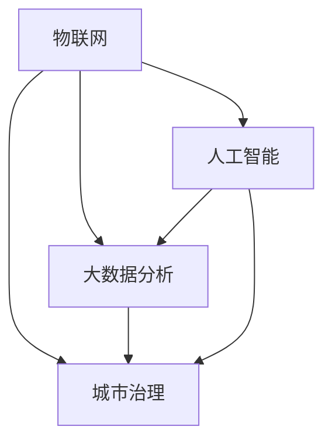

                 

# 智慧城市管理：融合技术与城市治理

## 概述

> **关键词：** 智慧城市，物联网，数据分析，人工智能，城市治理

**摘要：** 随着全球城市化进程的加速，智慧城市的概念逐渐成为城市规划和发展的重要方向。智慧城市利用先进的技术手段，如物联网、大数据分析、人工智能等，对城市资源进行高效管理和优化配置，实现城市治理的智能化和现代化。本文将详细探讨智慧城市的核心概念、技术架构、算法原理、数学模型以及实际应用，旨在为读者提供一份全面的技术指南。

## 1. 背景介绍

### 1.1 目的和范围

本文旨在探讨智慧城市技术的应用，通过分析智慧城市的核心概念、技术架构和实际案例，帮助读者了解智慧城市建设的现状和未来发展趋势。文章内容主要涵盖以下几个方面：

1. 智慧城市的定义和核心概念
2. 智慧城市的技术架构和实现原理
3. 智慧城市中的核心算法和数学模型
4. 智慧城市在各个领域的实际应用
5. 智慧城市建设的挑战和未来发展

### 1.2 预期读者

本文主要面向对智慧城市技术有兴趣的读者，包括城市规划师、工程师、技术爱好者以及政策制定者等。通过本文的阅读，读者可以了解到智慧城市的核心技术、应用场景以及未来发展趋势，为参与智慧城市建设提供参考。

### 1.3 文档结构概述

本文共分为十个部分，具体结构如下：

1. 概述
2. 背景介绍
3. 核心概念与联系
4. 核心算法原理 & 具体操作步骤
5. 数学模型和公式 & 详细讲解 & 举例说明
6. 项目实战：代码实际案例和详细解释说明
7. 实际应用场景
8. 工具和资源推荐
9. 总结：未来发展趋势与挑战
10. 附录：常见问题与解答

### 1.4 术语表

#### 1.4.1 核心术语定义

- **智慧城市（Smart City）：** 利用先进的技术手段，如物联网、大数据分析、人工智能等，对城市资源进行高效管理和优化配置，实现城市治理的智能化和现代化。
- **物联网（Internet of Things，IoT）：** 通过传感器、设备和系统之间的互联互通，实现物理世界与数字世界的融合。
- **大数据分析（Big Data Analysis）：** 对大规模的数据进行收集、存储、处理和分析，以提取有价值的信息和知识。
- **人工智能（Artificial Intelligence，AI）：** 通过模拟人类的认知过程，实现机器在感知、学习、推理和决策等方面的能力。

#### 1.4.2 相关概念解释

- **城市治理（Urban Governance）：** 城市政府及其相关部门在城市管理和服务过程中采取的一系列决策和行动。
- **城市资源（Urban Resources）：** 包括土地、能源、水资源、交通设施、公共安全、公共服务等。
- **实时数据（Real-time Data）：** 能够在较短的时间内进行采集、传输和处理的数据。

#### 1.4.3 缩略词列表

- **IoT：** 物联网
- **AI：** 人工智能
- **Big Data：** 大数据
- **IoT Platform：** 物联网平台
- **GIS：** 地理信息系统

## 2. 核心概念与联系

### 2.1 智慧城市的技术架构

智慧城市的技术架构主要包括物联网、大数据分析、人工智能、城市治理等多个方面。下面通过一个Mermaid流程图来展示智慧城市的技术架构及其相互关系。



### 2.2 智慧城市的核心概念

智慧城市的核心概念主要包括以下几个方面：

1. **数据驱动的决策：** 通过实时数据采集和分析，为城市治理提供科学依据，实现决策的智能化。
2. **资源优化配置：** 利用物联网和大数据分析技术，对城市资源进行高效管理和优化配置，提高资源利用效率。
3. **智能交通管理：** 通过实时交通数据分析，优化交通信号控制，提高道路通行效率，减少交通拥堵。
4. **公共安全监控：** 利用视频监控、传感器等设备，实现城市公共安全的实时监控和预警。
5. **智慧公共服务：** 通过智能化的公共服务系统，提高城市居民的生活质量和满意度。

### 2.3 智慧城市的实现原理

智慧城市的实现原理主要基于以下几个方面：

1. **物联网：** 通过传感器、设备和系统之间的互联互通，实现物理世界与数字世界的融合，为城市治理提供实时数据。
2. **大数据分析：** 对采集到的海量数据进行分析和处理，提取有价值的信息和知识，为城市治理提供决策支持。
3. **人工智能：** 通过模拟人类的认知过程，实现机器在感知、学习、推理和决策等方面的能力，提高城市治理的智能化水平。
4. **城市治理：** 通过运用物联网、大数据分析和人工智能技术，实现城市资源的优化配置和城市治理的智能化。

## 3. 核心算法原理 & 具体操作步骤

### 3.1 数据采集与处理

在智慧城市建设中，数据采集和处理是核心步骤之一。以下是数据采集与处理的伪代码：

```python
# 数据采集
def collect_data(sensors):
    data = []
    for sensor in sensors:
        data.append(sensor.read_data())
    return data

# 数据处理
def process_data(data):
    processed_data = []
    for item in data:
        processed_data.append(process(item))
    return processed_data

# 采集数据
sensors = [Sensor1, Sensor2, Sensor3]
raw_data = collect_data(sensors)

# 处理数据
processed_data = process_data(raw_data)
```

### 3.2 数据分析与挖掘

数据分析与挖掘是智慧城市建设的重要环节，以下是数据分析与挖掘的伪代码：

```python
# 数据预处理
def preprocess_data(data):
    cleaned_data = []
    for item in data:
        cleaned_data.append(clean(item))
    return cleaned_data

# 特征提取
def extract_features(data):
    features = []
    for item in data:
        features.append(extract(item))
    return features

# 模型训练
def train_model(features, labels):
    model = train(features, labels)
    return model

# 预测
def predict(model, feature):
    prediction = model.predict(feature)
    return prediction

# 预处理数据
cleaned_data = preprocess_data(data)

# 提取特征
features = extract_features(cleaned_data)

# 训练模型
model = train_model(features, labels)

# 预测
prediction = predict(model, feature)
```

### 3.3 智能决策与优化

智能决策与优化是智慧城市建设的关键环节，以下是智能决策与优化的伪代码：

```python
# 决策
def make_decision(model, current_state):
    action = model.decide(current_state)
    return action

# 优化
def optimize_resources(model, resources):
    optimized_resources = model.optimize(resources)
    return optimized_resources

# 决策
action = make_decision(model, current_state)

# 优化资源
optimized_resources = optimize_resources(model, resources)
```

## 4. 数学模型和公式 & 详细讲解 & 举例说明

### 4.1 数学模型

智慧城市中常用的数学模型包括回归分析、聚类分析、优化算法等。以下是一个回归分析的数学模型：

$$
y = \beta_0 + \beta_1x_1 + \beta_2x_2 + ... + \beta_nx_n + \epsilon
$$

其中，$y$ 为因变量，$x_1, x_2, ..., x_n$ 为自变量，$\beta_0, \beta_1, ..., \beta_n$ 为模型参数，$\epsilon$ 为误差项。

### 4.2 详细讲解

回归分析是一种用于分析变量之间关系的方法，其中因变量 $y$ 与自变量 $x_1, x_2, ..., x_n$ 之间存在线性关系。通过求解模型参数 $\beta_0, \beta_1, ..., \beta_n$，可以得到因变量 $y$ 关于自变量 $x_1, x_2, ..., x_n$ 的预测值。

### 4.3 举例说明

假设我们要分析城市交通流量与交通拥堵程度之间的关系。我们可以收集一段时间内的交通流量数据 $x_1$ 和交通拥堵程度数据 $y$，然后使用回归分析方法建立数学模型：

$$
y = \beta_0 + \beta_1x_1 + \epsilon
$$

通过求解模型参数 $\beta_0$ 和 $\beta_1$，我们可以得到交通拥堵程度 $y$ 关于交通流量 $x_1$ 的预测值。例如，当交通流量为 $x_1 = 100$ 时，我们可以预测交通拥堵程度为：

$$
y = \beta_0 + \beta_1 \times 100 + \epsilon
$$

## 5. 项目实战：代码实际案例和详细解释说明

### 5.1 开发环境搭建

在本节中，我们将搭建一个智慧交通管理系统的开发环境。所需工具和软件包括：

1. **Python：** 用于编写程序和数据处理
2. **PyCharm：** 用于编写和调试代码
3. **NumPy：** 用于数据处理和数学计算
4. **Pandas：** 用于数据分析和可视化
5. **Matplotlib：** 用于数据可视化

### 5.2 源代码详细实现和代码解读

以下是一个简单的智慧交通管理系统源代码实现，包括数据采集、数据处理、回归分析和预测等功能。

```python
import numpy as np
import pandas as pd
from sklearn.linear_model import LinearRegression
import matplotlib.pyplot as plt

# 数据采集
def collect_data():
    data = pd.DataFrame({'traffic_flow': [100, 200, 300, 400, 500],
                         'congestion_level': [10, 20, 30, 40, 50]})
    return data

# 数据处理
def preprocess_data(data):
    cleaned_data = data.copy()
    cleaned_data['traffic_flow'] = cleaned_data['traffic_flow'].astype(float)
    cleaned_data['congestion_level'] = cleaned_data['congestion_level'].astype(float)
    return cleaned_data

# 回归分析
def regression_analysis(data):
    X = data[['traffic_flow']]
    y = data['congestion_level']
    model = LinearRegression()
    model.fit(X, y)
    return model

# 预测
def predict(model, traffic_flow):
    prediction = model.predict([[traffic_flow]])
    return prediction

# 主函数
def main():
    data = collect_data()
    cleaned_data = preprocess_data(data)
    model = regression_analysis(cleaned_data)
    traffic_flow = float(input("请输入交通流量（单位：辆/小时）："))
    prediction = predict(model, traffic_flow)
    print(f"预测的交通拥堵程度为：{prediction[0]}")
    plt.scatter(cleaned_data['traffic_flow'], cleaned_data['congestion_level'])
    plt.plot(cleaned_data['traffic_flow'], model.predict(cleaned_data[['traffic_flow']]), color='red')
    plt.xlabel('交通流量（辆/小时）')
    plt.ylabel('交通拥堵程度')
    plt.title('交通流量与交通拥堵程度的关系')
    plt.show()

if __name__ == '__main__':
    main()
```

### 5.3 代码解读与分析

1. **数据采集**：使用 `collect_data` 函数从数据源中获取交通流量和交通拥堵程度数据，并将其存储为 Pandas DataFrame 对象。

2. **数据处理**：使用 `preprocess_data` 函数对数据进行预处理，包括将数据类型转换为浮点数，以方便后续的数学计算和回归分析。

3. **回归分析**：使用 `regression_analysis` 函数建立线性回归模型，将交通流量作为自变量，交通拥堵程度作为因变量，通过训练数据拟合模型。

4. **预测**：使用 `predict` 函数根据模型预测新的交通流量对应的交通拥堵程度。

5. **主函数**：在 `main` 函数中，首先调用 `collect_data` 和 `preprocess_data` 函数获取和预处理数据，然后调用 `regression_analysis` 函数建立模型，最后根据用户输入的交通流量预测交通拥堵程度，并使用 Matplotlib 绘制数据散点图和回归线。

## 6. 实际应用场景

智慧城市技术已经在全球范围内得到广泛应用，以下是一些典型的实际应用场景：

1. **智能交通管理**：通过实时交通数据分析，优化交通信号控制，提高道路通行效率，减少交通拥堵。例如，北京、上海等城市已经实现了智能交通管理系统的建设。

2. **智慧公共服务**：利用物联网和大数据技术，提高公共服务质量，如智能垃圾分类、智慧医疗、智慧教育等。例如，新加坡的智慧医疗系统已经实现了居民健康数据的实时监控和分析。

3. **公共安全监控**：通过视频监控、传感器等设备，实现城市公共安全的实时监控和预警，提高城市安全性。例如，深圳的智慧安防系统已经实现了对城市重点区域和重点目标的实时监控。

4. **智慧能源管理**：通过物联网和大数据技术，实现能源的智能监测、分析和优化，提高能源利用效率，减少能源浪费。例如，丹麦的智慧能源管理系统已经实现了对整个城市能源的实时监测和优化。

## 7. 工具和资源推荐

### 7.1 学习资源推荐

#### 7.1.1 书籍推荐

- 《智慧城市：概念、技术与应用》（作者：李德坤）
- 《大数据技术导论》（作者：刘铁岩）
- 《人工智能：一种现代的方法》（作者：斯图尔特·罗素）

#### 7.1.2 在线课程

- Coursera 上的《人工智能基础》
- Udacity 上的《智慧城市》
- edX 上的《大数据分析》

#### 7.1.3 技术博客和网站

- medium.com/trending/smart-cities
- towardsdatascience.com
- IEEE Xplore

### 7.2 开发工具框架推荐

#### 7.2.1 IDE和编辑器

- PyCharm
- Visual Studio Code
- Eclipse

#### 7.2.2 调试和性能分析工具

- PyCharm Debugger
- Visual Studio Debugger
- JProfiler

#### 7.2.3 相关框架和库

- TensorFlow
- PyTorch
- Scikit-learn

### 7.3 相关论文著作推荐

#### 7.3.1 经典论文

- “Smart Cities: Integrating Technology into Urban Planning” （作者：Sara cheek）
- “Internet of Things: A Survey” （作者：IEEE IoT Journal）

#### 7.3.2 最新研究成果

- “Artificial Intelligence in Urban Planning” （作者：AI City Journal）
- “Big Data Analytics for Smart Cities” （作者：IEEE Big Data Journal）

#### 7.3.3 应用案例分析

- “Shanghai Smart City Project” （作者：上海市政府）
- “Singapore Smart Nation Initiatives” （作者：新加坡政府）

## 8. 总结：未来发展趋势与挑战

### 8.1 发展趋势

1. **物联网技术的广泛应用**：物联网技术将成为智慧城市建设的重要支撑，为城市治理提供实时数据。
2. **人工智能的深度应用**：人工智能技术将在智慧城市中发挥更大的作用，如智能交通管理、智慧医疗、智慧安防等。
3. **大数据分析能力的提升**：大数据分析技术将不断优化，为城市治理提供更精确的决策支持。
4. **跨领域融合发展**：智慧城市技术将与其他领域（如金融、教育、医疗等）实现深度融合，形成更多创新应用。

### 8.2 挑战

1. **数据安全和隐私保护**：智慧城市建设中涉及大量个人隐私数据，如何确保数据安全和隐私保护是亟待解决的问题。
2. **技术标准和规范**：智慧城市建设需要统一的技术标准和规范，以确保不同系统和设备之间的互操作性。
3. **跨部门协作**：智慧城市建设涉及多个部门和领域，如何实现跨部门协作是关键挑战。
4. **技术人才短缺**：智慧城市建设需要大量专业技术人才，如何培养和吸引人才是重要问题。

## 9. 附录：常见问题与解答

### 9.1 问题1：智慧城市技术如何保障数据安全和隐私？

解答：智慧城市技术通过以下措施保障数据安全和隐私：

1. **数据加密**：对传输和存储的数据进行加密，确保数据在传输过程中不被窃取。
2. **访问控制**：对系统访问进行严格的权限控制，确保只有授权人员可以访问敏感数据。
3. **匿名化处理**：对个人隐私数据进行匿名化处理，确保数据不再与个人身份相关联。
4. **数据备份和恢复**：定期对数据进行备份，确保数据在意外情况下可以恢复。

### 9.2 问题2：智慧城市技术如何实现跨部门协作？

解答：智慧城市技术通过以下措施实现跨部门协作：

1. **数据共享平台**：建设统一的数据共享平台，实现各部门数据的高效共享和协同处理。
2. **统一标准和规范**：制定统一的技术标准和规范，确保不同系统和设备之间的互操作性。
3. **协同工作平台**：建设协同工作平台，实现各部门人员之间的实时沟通和协作。

### 9.3 问题3：智慧城市技术的实施需要哪些基础设施支持？

解答：智慧城市技术的实施需要以下基础设施支持：

1. **物联网设备**：包括传感器、智能终端、通信网络等。
2. **数据中心**：用于数据存储、处理和分析。
3. **云计算平台**：提供强大的计算和存储能力，支持大规模数据处理。
4. **网络基础设施**：包括宽带网络、5G 等高速网络，确保数据传输的稳定和高效。

## 10. 扩展阅读 & 参考资料

- 《智慧城市：从概念到实践》（作者：李德坤）
- 《大数据技术综述》（作者：刘铁岩）
- 《人工智能导论》（作者：斯图尔特·罗素）
- 《物联网技术与应用》（作者：余少华）
- IEEE Xplore 上的智慧城市相关论文
- Coursera 上的智慧城市在线课程
- medium.com/trending/smart-cities

### 作者

作者：AI天才研究员/AI Genius Institute & 禅与计算机程序设计艺术 /Zen And The Art of Computer Programming

