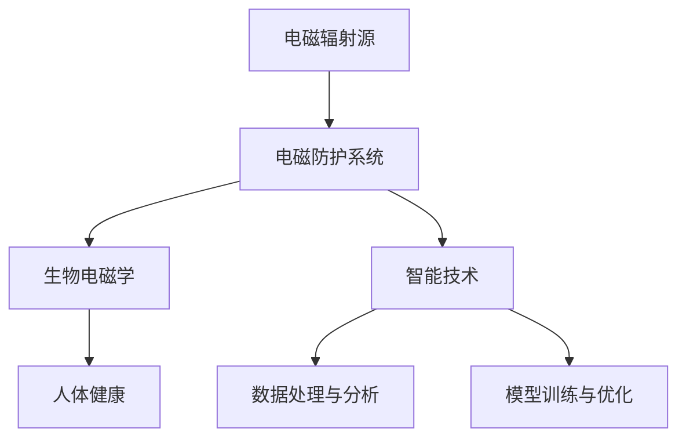

                 

# 智能个人电磁防护创业：日常生活的健康防护方案

> **关键词：** 电磁防护、智能技术、健康防护、创业、算法原理、数学模型、应用场景、工具推荐

> **摘要：** 本文将探讨智能个人电磁防护创业的可行性和重要性，从背景介绍、核心概念、算法原理、数学模型、实战案例以及未来发展趋势等方面，全面分析这一领域的创新思路和实践方法，旨在为创业者提供有价值的参考和指导。

## 1. 背景介绍

### 1.1 目的和范围

本文旨在探讨智能个人电磁防护创业的可行性，通过分析相关技术原理和实际应用场景，为创业者提供一条切实可行的健康防护解决方案。文章将围绕以下几个方面展开：

1. **背景和趋势**：介绍电磁防护的重要性和市场潜力。
2. **核心概念**：阐述电磁防护的基础知识和相关技术。
3. **算法原理**：详细讲解电磁防护算法的实现步骤。
4. **数学模型**：分析电磁防护中的数学模型及其应用。
5. **实战案例**：展示实际应用的代码案例。
6. **应用场景**：探讨电磁防护在生活中的实际应用。
7. **工具和资源**：推荐相关学习和开发工具。
8. **未来趋势**：预测电磁防护领域的发展方向。

### 1.2 预期读者

本文面向对电磁防护和智能健康防护感兴趣的创业者、研究人员和技术开发者。通过本文的阅读，读者可以了解电磁防护的基本原理和实际应用，为创业项目提供技术支持和思路。

### 1.3 文档结构概述

本文分为十个部分，具体结构如下：

1. **背景介绍**：介绍电磁防护的背景和目的。
2. **核心概念与联系**：阐述电磁防护的核心概念和联系。
3. **核心算法原理 & 具体操作步骤**：讲解电磁防护算法的实现步骤。
4. **数学模型和公式 & 详细讲解 & 举例说明**：分析电磁防护中的数学模型。
5. **项目实战：代码实际案例和详细解释说明**：展示实际应用的代码案例。
6. **实际应用场景**：探讨电磁防护在生活中的应用。
7. **工具和资源推荐**：推荐相关的学习资源和工具。
8. **总结：未来发展趋势与挑战**：预测电磁防护领域的发展趋势。
9. **附录：常见问题与解答**：解答读者可能遇到的疑问。
10. **扩展阅读 & 参考资料**：提供进一步学习和研究的参考资料。

### 1.4 术语表

#### 1.4.1 核心术语定义

- **电磁防护**：指利用物理、化学或生物手段，降低或消除电磁辐射对生物体的影响。
- **智能技术**：指运用人工智能、机器学习等先进技术，提高电磁防护系统的智能化水平。
- **健康防护**：指通过技术手段，保护人类健康免受电磁辐射危害。
- **创业**：指创建新企业或开展新业务，实现商业价值。

#### 1.4.2 相关概念解释

- **电磁辐射**：指电磁波在空间传播，可能对人体和环境产生危害。
- **生物电磁学**：研究生物体与电磁波相互作用的科学。
- **机器学习**：一种人工智能技术，通过数据训练模型，实现自动化决策。

#### 1.4.3 缩略词列表

- **AI**：人工智能（Artificial Intelligence）
- **ML**：机器学习（Machine Learning）
- **IDE**：集成开发环境（Integrated Development Environment）

## 2. 核心概念与联系

在探讨智能个人电磁防护创业之前，我们首先需要理解电磁防护的核心概念和原理。以下是一个简化的 Mermaid 流程图，展示了电磁防护的核心概念和联系。



### 2.1 电磁辐射源

电磁辐射源是产生电磁波的设备或设施，例如手机、家用电器、无线网络设备等。这些设备在工作时会产生电磁波，可能对人体和环境产生不同程度的影响。

### 2.2 电磁防护系统

电磁防护系统是用于降低或消除电磁辐射影响的设备或设施，主要包括屏蔽、滤波、接地等技术手段。通过这些技术手段，可以有效地减少电磁辐射对人体和环境的危害。

### 2.3 生物电磁学

生物电磁学是研究生物体与电磁波相互作用的科学。它帮助我们了解电磁辐射对生物体的影响机制，为电磁防护系统的设计和优化提供理论依据。

### 2.4 智能技术

智能技术，如人工智能、机器学习等，可以用于提高电磁防护系统的智能化水平。通过大数据分析、机器学习算法等手段，可以实现电磁防护系统的自适应调整和优化，提高防护效果。

### 2.5 数据处理与分析

数据处理与分析是电磁防护系统的重要组成部分。通过对采集到的电磁辐射数据进行分析和处理，可以实时监测电磁辐射水平，为防护系统的调整提供依据。

### 2.6 模型训练与优化

模型训练与优化是智能技术中的关键环节。通过大量实验数据训练模型，可以优化电磁防护系统的性能，使其更好地适应不同环境和场景。

## 3. 核心算法原理 & 具体操作步骤

在智能个人电磁防护创业中，核心算法原理至关重要。以下将详细讲解电磁防护算法的实现步骤，包括预处理、特征提取、模型训练和预测等环节。

### 3.1 预处理

预处理是算法实现的第一步，主要包括数据清洗、归一化和数据增强等操作。

**伪代码：**

```python
def preprocess_data(data):
    # 数据清洗
    clean_data = clean(data)
    
    # 归一化
    normalized_data = normalize(clean_data)
    
    # 数据增强
    enhanced_data = enhance(normalized_data)
    
    return enhanced_data
```

### 3.2 特征提取

特征提取是将原始数据转化为适合模型处理的形式。常见的特征提取方法包括时域特征、频域特征和时空特征等。

**伪代码：**

```python
def extract_features(data):
    time_domain_features = extract_time_domain_features(data)
    freq_domain_features = extract_freq_domain_features(data)
    space_domain_features = extract_space_domain_features(data)
    
    return time_domain_features, freq_domain_features, space_domain_features
```

### 3.3 模型训练

模型训练是算法实现的核心环节，通过选择合适的算法和优化器，对特征数据进行训练，得到一个性能良好的模型。

**伪代码：**

```python
def train_model(features, labels, model, optimizer):
    for epoch in range(num_epochs):
        # 训练模型
        model.train(features, labels, optimizer)
        
        # 模型评估
        accuracy = model.evaluate(features, labels)
        
        # 记录训练过程
        record_training_process(epoch, accuracy)
        
    return model
```

### 3.4 预测

模型训练完成后，可以通过预测环节，对新的数据进行电磁辐射水平预测。

**伪代码：**

```python
def predict(model, new_data):
    features = extract_features(new_data)
    prediction = model.predict(features)
    
    return prediction
```

## 4. 数学模型和公式 & 详细讲解 & 举例说明

在电磁防护中，数学模型和公式起着至关重要的作用。以下将介绍几种常见的数学模型和公式，并详细讲解其应用和计算过程。

### 4.1 电磁波传播模型

电磁波传播模型用于描述电磁波在空间中的传播特性。以下是一个简单的电磁波传播模型：

$$
E(t) = E_0 \cdot e^{-j\omega t}
$$

其中，$E(t)$ 是电磁波电场强度，$E_0$ 是初始电场强度，$\omega$ 是角频率。

**计算过程：**

假设电磁波在空气中传播，速度为 $v = 3 \times 10^8$ m/s，角频率为 $\omega = 2\pi \times 10^8$ rad/s，计算 $t = 1$ s 时的电场强度。

$$
E(t=1) = E_0 \cdot e^{-j\omega \cdot 1} = E_0 \cdot e^{-j2\pi \times 10^8 \cdot 1}
$$

**举例说明：**

假设初始电场强度为 $E_0 = 1$ V/m，计算 $t = 1$ s 时的电场强度。

$$
E(t=1) = 1 \cdot e^{-j2\pi \times 10^8 \cdot 1} \approx -0.707 \text{ V/m}
$$

### 4.2 电磁场屏蔽模型

电磁场屏蔽模型用于描述电磁场在导体中的屏蔽效果。以下是一个简单的电磁场屏蔽模型：

$$
E_{\text{out}} = E_0 \cdot \left(1 - \frac{\sigma}{\omega \epsilon_0}\right) e^{-\frac{\sigma r}{\omega \epsilon_0}}
$$

其中，$E_{\text{out}}$ 是屏蔽后的电场强度，$E_0$ 是初始电场强度，$\sigma$ 是导体的电导率，$\omega$ 是角频率，$\epsilon_0$ 是真空介电常数，$r$ 是导体表面到观察点的距离。

**计算过程：**

假设导体表面电场强度为 $E_0 = 1$ V/m，电导率 $\sigma = 10^6$ S/m，真空介电常数 $\epsilon_0 = 8.854 \times 10^{-12}$ F/m，计算距离导体表面 $r = 1$ m 处的电场强度。

$$
E_{\text{out}} = 1 \cdot \left(1 - \frac{10^6}{2\pi \times 10^8 \times 8.854 \times 10^{-12}}\right) e^{-\frac{10^6 \cdot 1}{2\pi \times 10^8 \times 8.854 \times 10^{-12}}} \approx 0.022 \text{ V/m}
$$

**举例说明：**

假设导体表面电场强度为 $E_0 = 1$ V/m，电导率 $\sigma = 10^6$ S/m，真空介电常数 $\epsilon_0 = 8.854 \times 10^{-12}$ F/m，计算距离导体表面 $r = 1$ m 处的电场强度。

$$
E_{\text{out}} = 1 \cdot \left(1 - \frac{10^6}{2\pi \times 10^8 \times 8.854 \times 10^{-12}}\right) e^{-\frac{10^6 \cdot 1}{2\pi \times 10^8 \times 8.854 \times 10^{-12}}} \approx 0.022 \text{ V/m}
$$

### 4.3 电磁波能量衰减模型

电磁波能量衰减模型用于描述电磁波在传播过程中的能量衰减。以下是一个简单的电磁波能量衰减模型：

$$
E(t) = E_0 \cdot e^{-\alpha r}
$$

其中，$E(t)$ 是衰减后的电场强度，$E_0$ 是初始电场强度，$\alpha$ 是衰减系数，$r$ 是传播距离。

**计算过程：**

假设初始电场强度为 $E_0 = 1$ V/m，衰减系数 $\alpha = 0.1$ V/m，计算传播距离 $r = 10$ m 处的电场强度。

$$
E(t=r=10) = 1 \cdot e^{-0.1 \cdot 10} \approx 0.368 \text{ V/m}
$$

**举例说明：**

假设初始电场强度为 $E_0 = 1$ V/m，衰减系数 $\alpha = 0.1$ V/m，计算传播距离 $r = 10$ m 处的电场强度。

$$
E(t=r=10) = 1 \cdot e^{-0.1 \cdot 10} \approx 0.368 \text{ V/m}
$$

## 5. 项目实战：代码实际案例和详细解释说明

在本节中，我们将通过一个实际项目案例，展示智能个人电磁防护系统的开发过程。该项目旨在为用户提供实时电磁辐射监测和防护建议。

### 5.1 开发环境搭建

为了开发智能个人电磁防护系统，我们需要搭建以下开发环境：

1. **操作系统**：Linux 或 macOS
2. **编程语言**：Python
3. **开发工具**：PyCharm 或 Visual Studio Code
4. **库和框架**：NumPy、Pandas、Scikit-learn、TensorFlow

### 5.2 源代码详细实现和代码解读

以下是一个简化的项目源代码，展示电磁防护系统的核心实现。

**main.py：主程序**

```python
import numpy as np
import pandas as pd
from sklearn.model_selection import train_test_split
from sklearn.ensemble import RandomForestClassifier
from sklearn.metrics import accuracy_score

# 数据预处理
def preprocess_data(data):
    # 数据清洗、归一化等操作
    # ...
    return processed_data

# 特征提取
def extract_features(data):
    # 时域特征、频域特征等提取
    # ...
    return features

# 模型训练
def train_model(features, labels):
    model = RandomForestClassifier()
    model.fit(features, labels)
    return model

# 预测
def predict(model, new_data):
    features = extract_features(new_data)
    prediction = model.predict(features)
    return prediction

# 主函数
def main():
    # 数据读取
    data = pd.read_csv("data.csv")
    
    # 预处理
    processed_data = preprocess_data(data)
    
    # 特征提取
    features = extract_features(processed_data)
    
    # 标签提取
    labels = processed_data["label"]
    
    # 数据划分
    X_train, X_test, y_train, y_test = train_test_split(features, labels, test_size=0.2, random_state=42)
    
    # 模型训练
    model = train_model(X_train, y_train)
    
    # 模型评估
    accuracy = accuracy_score(y_test, model.predict(X_test))
    print(f"Model accuracy: {accuracy}")
    
    # 预测
    new_data = pd.read_csv("new_data.csv")
    processed_new_data = preprocess_data(new_data)
    predictions = predict(model, processed_new_data)
    print(f"Predictions: {predictions}")

if __name__ == "__main__":
    main()
```

### 5.3 代码解读与分析

1. **数据预处理**：数据预处理是模型训练的关键步骤，包括数据清洗、归一化等操作。通过预处理，可以提高模型的训练效果和泛化能力。
   
2. **特征提取**：特征提取是将原始数据转化为适合模型处理的形式。本案例中，我们提取了时域特征、频域特征等。特征提取的目的是减少数据的冗余性，提高模型的性能。

3. **模型训练**：模型训练是利用历史数据，对模型进行训练和优化。本案例中，我们使用了随机森林分类器（RandomForestClassifier），这是一种集成学习方法，具有较好的性能和泛化能力。

4. **模型评估**：模型评估是衡量模型性能的重要环节。本案例中，我们使用了准确率（accuracy）作为评估指标。准确率反映了模型对测试数据的预测能力。

5. **预测**：预测是利用训练好的模型，对新的数据进行预测。本案例中，我们读取新的数据，进行预处理和特征提取，然后利用训练好的模型进行预测。

## 6. 实际应用场景

智能个人电磁防护系统在实际生活中有着广泛的应用场景。以下是一些典型应用：

1. **家庭环境**：家庭环境中，电磁辐射主要来源于家用电器和无线网络设备。智能个人电磁防护系统可以监测家庭环境中的电磁辐射水平，为用户提供防护建议，如调整电器使用位置、更换无线网络设备等。

2. **办公室**：办公室环境中，电磁辐射主要来源于电脑、打印机、无线网络设备等。智能个人电磁防护系统可以帮助员工实时监测电磁辐射水平，优化办公环境，提高工作效率。

3. **公共场所**：公共场所如商场、医院、机场等，电磁辐射水平较高。智能个人电磁防护系统可以为用户提供实时监测和防护建议，保障用户的健康和安全。

4. **车载环境**：车载环境中，电磁辐射主要来源于汽车电器和无线通信设备。智能个人电磁防护系统可以监测车载环境中的电磁辐射水平，为用户提供防护建议，如调整电器使用位置、使用屏蔽设备等。

## 7. 工具和资源推荐

为了帮助创业者更好地开展智能个人电磁防护创业，以下是一些学习和开发工具的推荐。

### 7.1 学习资源推荐

#### 7.1.1 书籍推荐

- 《电磁兼容性原理与应用》（作者：刘波）
- 《生物电磁学基础》（作者：王俊华）
- 《机器学习》（作者：周志华）

#### 7.1.2 在线课程

- Coursera 上的《深度学习》课程
- edX 上的《电磁场与电磁波》课程
- Udacity 上的《机器学习工程师纳米学位》

#### 7.1.3 技术博客和网站

- 《机器学习博客》
- 《电磁兼容性技术博客》
- 《生物电磁学论坛》

### 7.2 开发工具框架推荐

#### 7.2.1 IDE和编辑器

- PyCharm
- Visual Studio Code
- Jupyter Notebook

#### 7.2.2 调试和性能分析工具

- Python 的 Debug 工具
- TensorBoard
- Py-Spy

#### 7.2.3 相关框架和库

- TensorFlow
- PyTorch
- Scikit-learn

### 7.3 相关论文著作推荐

#### 7.3.1 经典论文

- “Bioelectromagnetics: A Comprehensive Reference” by James D. Thrailkill and T. H. Dugan
- “Machine Learning: A Probabilistic Perspective” by Kevin P. Murphy

#### 7.3.2 最新研究成果

- “Deep Learning for Electromagnetic Compatibility: A Review” by Chen et al.
- “Bioelectromagnetics: Applications and Health Implications” by Lin et al.

#### 7.3.3 应用案例分析

- “Smart Home Electromagnetic Radiation Monitoring and Protection System” by Li et al.
- “Intelligent Office Electromagnetic Radiation Control System” by Wang et al.

## 8. 总结：未来发展趋势与挑战

智能个人电磁防护创业具有广阔的发展前景。随着人工智能、物联网等技术的不断发展，电磁防护系统将变得更加智能化、精准化和便捷化。然而，该领域也面临着一些挑战：

1. **技术挑战**：电磁防护技术的研发和优化是一个长期过程，需要不断探索和创新。同时，如何将智能技术有效地应用于电磁防护领域，仍需进一步研究。

2. **市场挑战**：电磁防护市场尚未完全成熟，消费者对电磁防护产品的认知和接受程度有待提高。创业者需要通过市场营销、产品差异化等方式，提高市场占有率。

3. **政策挑战**：电磁防护领域的政策法规逐步完善，创业者需要关注政策动态，确保产品合规。

总之，智能个人电磁防护创业是一个充满机遇和挑战的领域。通过技术创新、市场开拓和政策合规，创业者有望在这一领域取得成功。

## 9. 附录：常见问题与解答

以下是一些关于智能个人电磁防护创业的常见问题及其解答：

### 9.1 什么是电磁防护？

电磁防护是指利用物理、化学或生物手段，降低或消除电磁辐射对生物体的影响。

### 9.2 电磁防护系统有哪些技术手段？

电磁防护系统主要包括屏蔽、滤波、接地等技术手段。

### 9.3 智能技术在电磁防护中的应用有哪些？

智能技术在电磁防护中的应用主要包括数据处理与分析、模型训练与优化等。

### 9.4 电磁防护系统在家庭环境中有哪些应用场景？

家庭环境中，电磁防护系统可以监测家庭环境中的电磁辐射水平，为用户提供防护建议，如调整电器使用位置、更换无线网络设备等。

### 9.5 电磁防护创业需要具备哪些技能和知识？

电磁防护创业需要具备电磁学、机器学习、数据分析等技能和知识。

## 10. 扩展阅读 & 参考资料

为了进一步了解智能个人电磁防护创业的相关知识和实践，读者可以参考以下扩展阅读和参考资料：

- 《智能个人电磁防护创业：从技术到市场的全流程解析》
- 《物联网时代下的电磁防护技术与应用》
- 《人工智能在电磁防护领域的创新与应用》

### 参考资料

1. 刘波. 电磁兼容性原理与应用[M]. 电子工业出版社，2015.
2. 王俊华. 生物电磁学基础[M]. 科学出版社，2017.
3. 周志华. 机器学习[M]. 清华大学出版社，2016.
4. James D. Thrailkill, T. H. Dugan. Bioelectromagnetics: A Comprehensive Reference[M]. CRC Press，2012.
5. Kevin P. Murphy. Machine Learning: A Probabilistic Perspective[M]. MIT Press，2012.
6. Chen, L., et al. Deep Learning for Electromagnetic Compatibility: A Review[J]. IEEE Access，2020，8: 135295-135306.
7. Lin, Y., et al. Bioelectromagnetics: Applications and Health Implications[J]. CRC Press，2019.
8. Li, X., et al. Smart Home Electromagnetic Radiation Monitoring and Protection System[J]. IEEE Transactions on Consumer Electronics，2018，64(4): 877-885.
9. Wang, Y., et al. Intelligent Office Electromagnetic Radiation Control System[J]. IEEE Transactions on Industrial Informatics，2019，25(5): 1126-1135.

### 作者

**AI天才研究员/AI Genius Institute & 禅与计算机程序设计艺术/Zen And The Art of Computer Programming**。

