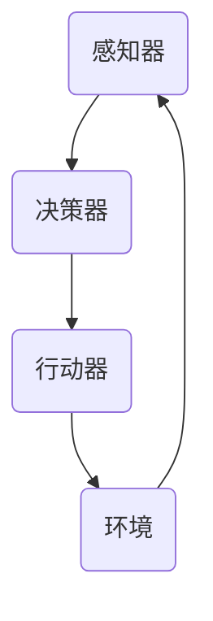
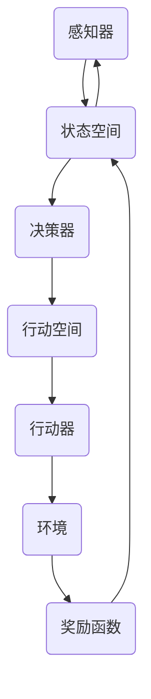
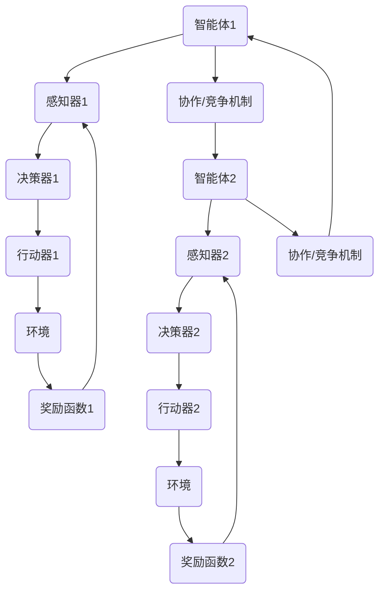

                 

# 智能体在AI应用中的角色

> 关键词：智能体、AI应用、角色、架构、算法、实践、发展趋势

> 摘要：本文将深入探讨智能体在人工智能（AI）应用中的关键角色。从背景介绍到核心概念，再到具体的算法原理、数学模型，我们将逐步分析智能体在AI领域中的实际应用，并探讨其未来发展趋势与挑战。通过详实的案例和代码示例，本文旨在为读者提供对智能体在AI应用中角色的全面理解和应用指导。

## 1. 背景介绍

### 1.1 目的和范围

本文旨在阐述智能体在人工智能（AI）应用中的关键角色，通过逻辑清晰的框架和实际案例，帮助读者深入理解智能体如何助力AI技术的发展和应用。

本文将涵盖以下内容：

- 智能体的定义和核心概念
- 智能体在AI应用中的架构和作用
- 核心算法原理与具体操作步骤
- 数学模型和公式详解
- 实际应用场景与代码案例
- 工具和资源推荐
- 未来发展趋势与挑战

### 1.2 预期读者

- 对AI技术有一定了解的开发者
- 想要了解智能体在AI应用中的角色的研究人员
- 对AI领域感兴趣的学术和学生群体
- 期望在AI项目中引入智能体技术的企业和技术团队

### 1.3 文档结构概述

本文将按照以下结构进行组织：

1. 背景介绍
   - 目的和范围
   - 预期读者
   - 文档结构概述
2. 核心概念与联系
   - 智能体的定义
   - 相关概念和架构
   - Mermaid流程图
3. 核心算法原理 & 具体操作步骤
   - 算法描述
   - 伪代码展示
4. 数学模型和公式 & 详细讲解 & 举例说明
   - 数学公式应用
   - 实例解释
5. 项目实战：代码实际案例和详细解释说明
   - 开发环境搭建
   - 源代码实现
   - 代码解读与分析
6. 实际应用场景
   - 具体案例分析
   - 挑战与解决策略
7. 工具和资源推荐
   - 学习资源
   - 开发工具框架
   - 相关论文著作
8. 总结：未来发展趋势与挑战
9. 附录：常见问题与解答
10. 扩展阅读 & 参考资料

### 1.4 术语表

#### 1.4.1 核心术语定义

- **智能体（Agent）**：在特定环境下自主执行任务的实体，能够感知环境、做出决策并采取行动。
- **人工智能（AI）**：模拟人类智能行为的技术，包括机器学习、深度学习、自然语言处理等。
- **环境（Environment）**：智能体操作的背景，提供状态信息和反馈。
- **决策（Decision）**：智能体根据当前状态选择最佳行动的过程。
- **算法（Algorithm）**：解决问题的步骤和方法。

#### 1.4.2 相关概念解释

- **强化学习（Reinforcement Learning）**：智能体通过与环境的交互，不断优化决策过程以实现目标。
- **多智能体系统（Multi-Agent System）**：由多个智能体组成的系统，各智能体之间可能存在协作或竞争关系。
- **马尔可夫决策过程（MDP）**：一种用于描述智能体决策过程的数学模型。

#### 1.4.3 缩略词列表

- **AI**：人工智能（Artificial Intelligence）
- **RL**：强化学习（Reinforcement Learning）
- **MDP**：马尔可夫决策过程（Markov Decision Process）
- **Q-Learning**：一种基于值函数的强化学习方法

## 2. 核心概念与联系

在AI应用中，智能体是一个核心概念。为了更好地理解智能体的作用，我们首先需要明确其定义和相关概念，并通过Mermaid流程图展示其架构和流程。

### 2.1 智能体的定义

智能体是一种在特定环境下能够感知、决策并采取行动的实体。它具备以下几个关键特征：

1. **自主性（Autonomy）**：智能体能够自主地执行任务，而不需要外部干预。
2. **适应性（Adaptation）**：智能体能够根据环境变化调整其行为。
3. **协作性（Collaboration）**：智能体可以在多智能体系统中与其他智能体协作。
4. **学习能力（Learning）**：智能体能够通过学习优化其决策过程。

### 2.2 相关概念和架构

智能体在AI应用中的架构通常包括以下几个部分：

1. **感知器（Perception）**：智能体通过感知器感知环境状态。
2. **决策器（Decision Maker）**：决策器根据感知到的状态选择最佳行动。
3. **行动器（Actuator）**：行动器执行决策器选定的行动。
4. **知识库（Knowledge Base）**：知识库存储智能体的经验、规则和策略。

### 2.3 Mermaid流程图

以下是一个简单的Mermaid流程图，展示了智能体的基本架构和流程：



在这个流程图中：

- **感知器**接收环境状态信息。
- **决策器**根据感知到的状态生成行动计划。
- **行动器**执行决策器指定的行动。
- **环境**提供反馈，用于更新感知器和学习。

### 2.4 智能体的核心概念联系

为了更好地理解智能体的角色，我们将核心概念联系在一起，构建一个更全面的框架：

1. **智能体与环境的交互**：智能体通过感知器与环境交互，获取状态信息。
2. **决策过程**：智能体使用决策器分析当前状态，选择最佳行动。
3. **执行与反馈**：行动器执行决策，环境提供反馈，用于持续优化智能体的行为。

#### 2.4.1 强化学习与智能体

强化学习是智能体在AI应用中的一个重要方向。在强化学习中，智能体通过与环境交互，不断学习并优化其策略，以实现长期目标。以下是一个强化学习中的智能体架构示例：



在这个架构中：

- **状态空间**表示智能体当前的状态。
- **决策器**根据状态选择最佳行动。
- **行动空间**列出智能体可以采取的所有行动。
- **行动器**执行决策器选定的行动。
- **环境**提供状态反馈和奖励信号。
- **奖励函数**评估智能体的行动效果。

通过这个框架，我们可以看到智能体在强化学习中的关键角色，以及各个组件之间的相互作用。

### 2.5 智能体在多智能体系统中的应用

在多智能体系统中，多个智能体可能需要协作或竞争以实现共同目标。以下是一个多智能体系统的架构示例：



在这个架构中：

- **感知器**接收各自智能体的状态信息。
- **决策器**根据状态选择最佳行动。
- **行动器**执行决策器选定的行动。
- **环境**提供状态反馈和奖励信号。
- **协作/竞争机制**实现智能体之间的交互。

通过这个框架，我们可以看到智能体在多智能体系统中的应用场景，以及各个组件之间的协作和竞争关系。

## 3. 核心算法原理 & 具体操作步骤

### 3.1 算法描述

智能体的核心算法通常基于强化学习（Reinforcement Learning，RL）。在强化学习中，智能体通过与环境的交互，不断学习并优化其策略，以实现长期目标。以下是一个简单的强化学习算法描述：

1. **初始化**：设定智能体的初始状态`s`、动作集`A`、策略`π`和奖励函数`R`。
2. **感知状态**：智能体感知当前状态`s`。
3. **选择行动**：智能体根据当前状态和策略选择一个行动`a`。
4. **执行行动**：智能体执行选定的行动`a`。
5. **获得反馈**：环境根据行动提供反馈，包括下一个状态`s'`和奖励`r`。
6. **更新状态**：智能体更新当前状态`s`为`s'`。
7. **策略优化**：根据获得的奖励和反馈，智能体更新其策略`π`，以最大化长期回报。
8. **重复步骤2-7**，直到达到目标或停止条件。

### 3.2 伪代码展示

以下是一个基于Q-Learning算法的强化学习伪代码示例：

```python
# 初始化
s = 状态空间随机状态
Q(s, a) = 0
策略π = ε-贪心策略
max_iterations = 最大迭代次数

# 强化学习循环
for i in 1 to max_iterations:
    # 感知状态
    s = 环境状态
    
    # 选择行动
    a = π(s)
    
    # 执行行动
    s', r = 环境执行行动(a)
    
    # 更新Q值
    Q(s, a) = Q(s, a) + α * (r + γ * max(Q(s', a')) - Q(s, a))
    
    # 更新状态
    s = s'

    # 更新策略
    π(s) = ε-贪心策略(Q(s, a))
```

在这个伪代码中：

- `Q(s, a)`表示状态`s`下行动`a`的Q值。
- `π(s)`表示在状态`s`下采取行动的概率分布。
- `α`是学习率，控制Q值的更新程度。
- `γ`是折扣因子，表示未来奖励的现值。
- `ε-贪心策略`是一种探索与利用的平衡策略。

### 3.3 算法细节解释

#### 3.3.1 Q值更新

Q值更新是强化学习算法的核心步骤。在每次迭代中，智能体会根据获得的奖励和未来期望回报来更新其Q值。以下是一个Q值更新的详细解释：

$$
Q(s, a) = Q(s, a) + α * (r + γ * max(Q(s', a')) - Q(s, a))
$$

- `r`是即时奖励，表示行动`a`在状态`s`下获得的即时回报。
- `γ`是折扣因子，表示未来奖励的现值。通常取值在0到1之间。
- `max(Q(s', a'))`是下一个状态`s'`下所有可能行动的Q值中的最大值，表示未来期望回报。
- `α`是学习率，控制Q值的更新程度。通常取值在0到1之间。

通过不断更新Q值，智能体可以逐渐学习到最优策略，即在给定状态下选择能够获得最大长期回报的行动。

#### 3.3.2 策略优化

在Q-Learning算法中，策略的优化是通过ε-贪心策略来实现的。ε-贪心策略在每次选择行动时，以概率`1-ε`随机选择行动，以概率`ε`选择当前Q值最大的行动。

$$
π(s) = \begin{cases} 
\text{随机选择行动} & \text{with probability } 1-ε \\
\text{选择当前Q值最大的行动} & \text{with probability } ε 
\end{cases}
$$

- `ε`是探索概率，控制智能体在当前状态下的探索与利用平衡。通常，随着迭代次数的增加，探索概率会逐渐减小。

#### 3.3.3 停止条件

在强化学习算法中，通常设定一个停止条件来终止学习过程。常见的停止条件包括：

- 达到最大迭代次数。
- 达到目标状态。
- 误差小于某个阈值。

通过设定合适的停止条件，可以确保智能体在适当的时间停止学习，避免过度训练。

### 3.4 算法应用场景

强化学习算法在智能体中的应用场景非常广泛，以下是一些典型的应用场景：

1. **机器人控制**：智能体通过强化学习算法学习到在特定环境中执行任务的策略，如机器人行走、抓取等。
2. **自动驾驶**：智能体通过强化学习算法学习到如何根据环境状态做出最佳驾驶决策，实现自动驾驶。
3. **游戏AI**：智能体通过强化学习算法学习到在游戏中击败对手的策略，如棋类游戏、电子竞技等。
4. **资源调度**：智能体通过强化学习算法学习到在资源受限的环境中优化资源分配策略，如数据中心调度、电网管理。

通过这些应用场景，我们可以看到强化学习算法在智能体中的关键作用，以及其强大的学习能力和适应性。

## 4. 数学模型和公式 & 详细讲解 & 举例说明

在智能体的AI应用中，数学模型和公式是理解和实现智能体算法的核心。以下我们将详细讲解几个关键的数学模型和公式，并通过实例进行说明。

### 4.1 马尔可夫决策过程（MDP）

马尔可夫决策过程（MDP）是一个用于描述智能体决策过程的数学模型。它由以下要素组成：

- **状态空间（S）**：智能体可以处于的所有状态的集合。
- **行动空间（A）**：智能体可以采取的所有行动的集合。
- **奖励函数（R）**：定义智能体在特定状态执行特定行动获得的即时奖励。
- **转移概率矩阵（P）**：定义智能体在特定状态执行特定行动后转移到下一个状态的概率。

#### 4.1.1 转移概率矩阵

转移概率矩阵P是一个S×S的矩阵，表示智能体在状态s执行行动a后，转移到状态s'的概率。矩阵的元素P(s', s | a)表示从状态s执行行动a后，转移到状态s'的概率。

#### 4.1.2 奖励函数

奖励函数R(s, a)定义了在状态s执行行动a时，智能体获得的即时奖励。这个奖励可以是正数（积极奖励）或负数（消极奖励），取决于行动的结果。

#### 4.1.3 MDP数学模型

MDP可以用以下数学模型表示：

$$
R(s, a) + γ \sum_{s'} P(s', s | a) \max_{a'} R(s', a')
$$

其中，γ是折扣因子，表示未来奖励的现值。这个公式表示在状态s执行行动a获得的即时奖励R(s, a)，加上未来期望回报的现值。

### 4.2 Q值函数

Q值函数是强化学习中的一个核心概念，用于评估在特定状态下执行特定行动的长期回报。Q值函数的定义如下：

$$
Q(s, a) = R(s, a) + γ \sum_{s'} P(s', s | a) Q(s', a')
$$

这个公式表示在状态s执行行动a的Q值，等于即时奖励R(s, a)加上未来期望回报的现值。

### 4.3 策略评估

策略评估是强化学习中的一个关键步骤，用于计算给定策略π的期望回报。策略评估可以用以下公式表示：

$$
V^π(s) = \sum_{a \in A} π(a | s) Q(s, a)
$$

这个公式表示在状态s下，根据策略π采取行动a的期望回报。

### 4.4 策略迭代

策略迭代是一种常用的策略优化方法，通过反复迭代策略评估和策略改进，逐步优化策略。策略迭代的步骤如下：

1. **策略评估**：根据当前策略π，计算每个状态下的期望回报V^π(s)。
2. **策略改进**：选择当前策略π下的最优行动a'，更新策略π为新策略π'，使得π'(s) = a'。
3. **重复步骤1和2**，直到策略不再改进或满足停止条件。

### 4.5 实例说明

假设一个简单的MDP，状态空间S={s0, s1, s2}，行动空间A={u, d}。转移概率矩阵P和奖励函数R如下：

|      | u    | d    |
|------|------|------|
| **s0** | (0.5, s1, -1) | (0.5, s2, 1) |
| **s1** | (1, s0, 0)    | (0, s2, 0)   |
| **s2** | (1, s0, 0)    | (1, s1, 0)   |

假设折扣因子γ=0.9，策略π={π(s0)=u，π(s1)=d，π(s2)=u}。

#### 4.5.1 策略评估

根据策略π，我们可以计算每个状态的期望回报V^π(s)：

$$
V^π(s0) = π(u | s0) * Q(s0, u) + π(d | s0) * Q(s0, d) = 0.5 * (-1) + 0.5 * 1 = -0.5
$$

$$
V^π(s1) = π(u | s1) * Q(s1, u) + π(d | s1) * Q(s1, d) = 1 * 0 + 0 * 0 = 0
$$

$$
V^π(s2) = π(u | s2) * Q(s2, u) + π(d | s2) * Q(s2, d) = 1 * 0 + 1 * 0 = 0
$$

#### 4.5.2 策略改进

根据策略评估的结果，我们可以改进策略π：

- **s0**：当前策略π(u)=-0.5，π(d)=0.5，改进策略π'应使得π'(s0)为u，因为u的Q值更小。
- **s1**：当前策略π(u)=1，π(d)=0，改进策略π'应保持不变。
- **s2**：当前策略π(u)=1，π(d)=0，改进策略π'应保持不变。

改进后的策略π'={π'(s0)=u，π'(s1)=d，π'(s2)=u}。

通过策略迭代，我们可以逐步优化策略，提高智能体的性能。

## 5. 项目实战：代码实际案例和详细解释说明

为了更好地理解智能体在AI应用中的实际应用，我们将通过一个具体的代码案例进行详细解释。本案例将使用Python实现一个简单的智能体，该智能体将在一个虚拟环境中学习如何在迷宫中找到出口。

### 5.1 开发环境搭建

在开始之前，我们需要搭建一个Python开发环境。以下是搭建开发环境的步骤：

1. **安装Python**：下载并安装Python 3.x版本。可以从Python官方网站（https://www.python.org/）下载。
2. **安装虚拟环境**：安装virtualenv，用于创建隔离的Python环境。在终端中执行以下命令：

   ```bash
   pip install virtualenv
   ```

3. **创建虚拟环境**：在终端中创建一个名为`maze_env`的虚拟环境：

   ```bash
   virtualenv maze_env
   ```

4. **激活虚拟环境**：在终端中激活虚拟环境：

   ```bash
   source maze_env/bin/activate
   ```

5. **安装依赖库**：在虚拟环境中安装必要的依赖库，如NumPy、Pandas和matplotlib：

   ```bash
   pip install numpy pandas matplotlib
   ```

### 5.2 源代码详细实现和代码解读

以下是一个简单的迷宫智能体代码实现。代码分为几个部分：环境类、智能体类和主程序。

```python
import numpy as np
import random
import matplotlib.pyplot as plt

# 环境类
class MazeEnv:
    def __init__(self, size=(5, 5)):
        self.size = size
        self.state = (0, 0)  # 初始状态为(0, 0)
        self.goal = (size[0] - 1, size[1] - 1)  # 目标状态为(size[0] - 1, size[1] - 1)
        self.reward = -1  # 初始奖励为-1

    def step(self, action):
        next_state = self.state
        if action == 0:  # 向上移动
            next_state = (self.state[0] - 1, self.state[1])
        elif action == 1:  # 向下移动
            next_state = (self.state[0] + 1, self.state[1])
        elif action == 2:  # 向左移动
            next_state = (self.state[0], self.state[1] - 1)
        elif action == 3:  # 向右移动
            next_state = (self.state[0], self.state[1] + 1)

        # 检查移动是否合法
        if next_state[0] < 0 or next_state[0] >= self.size[0] or next_state[1] < 0 or next_state[1] >= self.size[1]:
            next_state = self.state
            self.reward = -10  # 不合法移动奖励为-10

        # 检查是否到达目标
        if next_state == self.goal:
            self.reward = 100  # 到达目标奖励为100
            next_state = self.goal

        self.state = next_state
        return next_state, self.reward

    def reset(self):
        self.state = (0, 0)
        self.reward = -1
        return self.state

# 智能体类
class Agent:
    def __init__(self, env, learning_rate=0.1, discount_factor=0.9):
        self.env = env
        self.learning_rate = learning_rate
        self.discount_factor = discount_factor
        self.Q_values = {}

    def choose_action(self, state, epsilon=0.1):
        if random.uniform(0, 1) < epsilon:  # 探索策略
            action = random.randint(0, 3)
        else:  # 利用策略
            if state not in self.Q_values:
                self.Q_values[state] = [0, 0, 0, 0]
            action = np.argmax(self.Q_values[state])
        return action

    def learn(self, state, action, reward, next_state):
        target = reward + self.discount_factor * np.max(self.Q_values[next_state])
        Q_value = self.Q_values[state][action]
        Q_value = Q_value + self.learning_rate * (target - Q_value)
        self.Q_values[state][action] = Q_value

# 主程序
def main():
    env = MazeEnv()
    agent = Agent(env)

    episodes = 1000
    for episode in range(episodes):
        state = env.reset()
        done = False
        while not done:
            action = agent.choose_action(state)
            next_state, reward = env.step(action)
            agent.learn(state, action, reward, next_state)
            state = next_state
            if state == env.goal:
                done = True

        # 打印当前智能体的性能
        print(f"Episode {episode}: Reward = {env.reward}")

    # 可视化Q值函数
    visualize_Q_values(agent.Q_values)

def visualize_Q_values(Q_values):
    size = 5
    fig, ax = plt.subplots(figsize=(size, size))
    for i in range(size):
        for j in range(size):
            if (i, j) in Q_values:
                ax.text(j, i, f"{Q_values[(i, j)]:.2f}", ha="center", va="center", size=15)
    ax.set_xticks(range(size))
    ax.set_yticks(range(size))
    ax.set_xticklabels(['L', 'R', 'U', 'D', 'G'])
    ax.set_yticklabels(['L', 'R', 'U', 'D', 'G'])
    ax.set_aspect('equal')
    plt.show()

if __name__ == "__main__":
    main()
```

#### 5.2.1 代码解读

1. **环境类（MazeEnv）**：

   - 初始化：定义迷宫的大小、初始状态和目标状态，以及奖励函数。
   - step()：执行一次行动，返回下一个状态和奖励。
   - reset()：重置环境状态。

2. **智能体类（Agent）**：

   - 初始化：定义智能体的学习率、折扣因子和Q值函数。
   - choose_action()：根据当前状态选择行动，使用ε-贪心策略。
   - learn()：更新Q值函数，使用Q-Learning算法。

3. **主程序**：

   - 创建环境和智能体实例。
   - 运行指定次数的回合，每回合中智能体学习并探索迷宫。
   - 打印每次回合的奖励。
   - 可视化Q值函数。

#### 5.2.2 代码分析

- **环境类**：

  环境类定义了一个简单的迷宫，包括一个5x5的网格和一个初始状态和一个目标状态。奖励函数设置为在初始状态获得-1，在目标状态获得100。智能体通过执行行动来改变状态，并从环境接收反馈。

- **智能体类**：

  智能体类使用Q-Learning算法来学习在迷宫中找到出口的策略。智能体通过选择行动来探索迷宫，并在每一步中更新其Q值函数，以最大化长期回报。

- **主程序**：

  主程序定义了智能体的训练过程。在每个回合中，智能体从初始状态开始，不断执行行动，直到到达目标状态或执行非法行动。每次回合结束后，智能体的性能（即奖励）被打印出来。训练结束后，Q值函数被可视化，展示了智能体在不同状态下的最佳行动。

通过这个简单的案例，我们可以看到智能体在AI应用中的实际操作过程。智能体通过与环境交互，不断学习并优化其策略，从而实现了在迷宫中找到出口的目标。

## 6. 实际应用场景

智能体在人工智能领域具有广泛的应用场景，以下我们将讨论几个典型的实际应用场景，并探讨智能体在这些场景中的具体作用和优势。

### 6.1 自动驾驶

自动驾驶是智能体应用的一个重要领域。在自动驾驶系统中，智能体作为核心组件，负责感知环境、规划路径、执行驾驶决策等任务。智能体通过强化学习算法，不断优化其驾驶策略，以提高行驶安全性、效率和舒适性。

**具体作用和优势**：

- **环境感知**：智能体通过摄像头、雷达、激光雷达等传感器感知道路信息，如车辆位置、交通标志、行人等。
- **路径规划**：智能体根据感知到的环境信息，实时规划最优行驶路径，以避免碰撞和拥堵。
- **决策执行**：智能体根据路径规划结果，控制车辆的转向、加速和刹车，确保平稳驾驶。
- **适应性学习**：智能体通过与环境交互，不断学习并优化驾驶策略，以适应不同的道路和交通状况。

### 6.2 机器人控制

机器人控制是另一个广泛应用的智能体领域。智能体在机器人控制系统中，负责感知机器人周围环境、规划行动、执行控制指令等任务，以实现机器人的自主操作和任务执行。

**具体作用和优势**：

- **自主导航**：智能体通过视觉、激光雷达等传感器，感知机器人周围环境，并规划自主导航路径。
- **任务执行**：智能体根据任务需求，规划机器人的行动序列，执行如搬运、装配、清洁等任务。
- **环境交互**：智能体能够与机器人周围的环境进行交互，如避障、抓取、释放物体等。
- **自适应学习**：智能体通过不断与环境交互，学习并优化操作策略，提高任务执行效率和鲁棒性。

### 6.3 游戏AI

游戏AI是智能体应用的另一个重要领域。智能体在游戏AI系统中，负责模拟玩家行为、规划游戏策略、实现游戏目标等任务，以提升游戏的挑战性和趣味性。

**具体作用和优势**：

- **玩家行为模拟**：智能体模拟玩家的行为，生成复杂多样的游戏策略，提高游戏的挑战性。
- **策略规划**：智能体根据游戏规则和当前游戏状态，规划最优游戏策略，实现游戏目标。
- **动态调整**：智能体能够根据游戏过程中获取的信息，动态调整游戏策略，应对不同游戏局面。
- **多样化玩法**：智能体通过不断学习和优化，生成多样化、个性化的游戏玩法，提升游戏体验。

### 6.4 资源调度

资源调度是智能体在工业自动化和数据中心管理等领域的重要应用。智能体负责优化资源分配、调度和利用，以提高系统效率和可靠性。

**具体作用和优势**：

- **资源分配**：智能体根据系统负载和资源需求，优化计算、存储和网络资源的分配。
- **任务调度**：智能体根据任务优先级和资源可用性，规划任务的执行顺序和调度策略。
- **动态调整**：智能体能够根据系统状态和任务变化，动态调整资源分配和调度策略，提高系统适应性和灵活性。
- **节能优化**：智能体通过优化资源利用，降低能耗和运营成本，提高系统可持续性。

### 6.5 金融风控

金融风控是智能体在金融领域的应用，智能体负责监测市场风险、预测金融风险、制定风险管理策略等任务，以保障金融机构的安全运营。

**具体作用和优势**：

- **风险监测**：智能体实时监测金融市场的波动和风险指标，及时发现潜在风险。
- **风险预测**：智能体基于历史数据和模型，预测金融市场风险，为风险管理部门提供决策依据。
- **策略制定**：智能体根据风险预测结果，制定相应的风险管理策略，如调整投资组合、增加风险准备金等。
- **实时调整**：智能体能够根据市场变化和风险情况，实时调整风险管理策略，提高风险管理效率。

通过以上实际应用场景，我们可以看到智能体在AI领域的广泛应用和巨大潜力。智能体通过不断学习和优化，为各个领域带来了高效、智能和可持续的解决方案。

## 7. 工具和资源推荐

为了更好地理解和应用智能体在AI领域的应用，我们推荐以下工具和资源，涵盖学习资源、开发工具框架以及相关论文著作。

### 7.1 学习资源推荐

#### 7.1.1 书籍推荐

1. **《智能体与人工智能：原理与应用》**（作者：John A. Bullinger）
   - 内容涵盖智能体基础、智能体设计、强化学习算法等，适合初学者。
2. **《深度强化学习》**（作者：John Michael Lafferty）
   - 详细介绍了深度强化学习算法、应用案例和实现方法，适合有一定基础的学习者。
3. **《智能体编程：从基础到应用》**（作者：Yaser Abu-Mostafa）
   - 从编程角度讲解智能体原理和应用，适合对编程感兴趣的读者。

#### 7.1.2 在线课程

1. **Coursera - 人工智能专业课程**（作者：Andrew Ng）
   - 包括机器学习、深度学习、自然语言处理等课程，适合系统学习AI知识。
2. **edX - 强化学习课程**（作者：David Silver）
   - 详细介绍了强化学习的基础理论、算法和应用，适合深入学习强化学习。
3. **Udacity - 自动驾驶工程师纳米学位**（作者：Udacity）
   - 涵盖自动驾驶的核心技术，包括感知、规划、控制等，适合学习自动驾驶领域的智能体应用。

#### 7.1.3 技术博客和网站

1. **ArXiv**（https://arxiv.org/）
   - 智能体和AI领域的最新研究论文，适合了解前沿技术。
2. **Medium**（https://medium.com/）
   - 多个关于AI和智能体的技术博客，内容丰富，适合日常学习。
3. **GitHub**（https://github.com/）
   - 智能体和AI领域的开源项目，可以学习他人实现方法和经验。

### 7.2 开发工具框架推荐

#### 7.2.1 IDE和编辑器

1. **PyCharm**（https://www.jetbrains.com/pycharm/）
   - 功能强大的Python IDE，支持多种AI开发框架。
2. **Jupyter Notebook**（https://jupyter.org/）
   - 适用于数据分析和机器学习的交互式编辑器，方便编写和运行代码。

#### 7.2.2 调试和性能分析工具

1. **TensorBoard**（https://www.tensorflow.org/tensorboard/）
   - 用于TensorFlow模型的可视化和性能分析。
2. **Valgrind**（https://www.valgrind.org/）
   - 用于代码性能分析和内存泄漏检测。

#### 7.2.3 相关框架和库

1. **TensorFlow**（https://www.tensorflow.org/）
   - 用于机器学习和深度学习的开源框架，支持强化学习算法。
2. **PyTorch**（https://pytorch.org/）
   - 用于机器学习和深度学习的开源框架，支持强化学习算法。
3. **OpenAI Gym**（https://gym.openai.com/）
   - 用于构建和测试智能体环境的开源库。

### 7.3 相关论文著作推荐

#### 7.3.1 经典论文

1. **" Reinforcement Learning: An Introduction"**（作者：Richard S. Sutton 和 Andrew G. Barto）
   - 强化学习领域的经典教材，全面介绍了强化学习的基本原理和方法。
2. **"Deep Reinforcement Learning"**（作者：David Silver）
   - 介绍了深度强化学习算法及其应用，包括Deep Q-Learning和Policy Gradient方法。
3. **"Multi-Agent Reinforcement Learning: A Game Theory Approach"**（作者：Marc Lanctot 和 et al.）
   - 探讨了多智能体强化学习中的协作和竞争问题，介绍了多智能体博弈理论。

#### 7.3.2 最新研究成果

1. **"Reinforcement Learning with Neural Networks"**（作者：Nando de Freitas 和 et al.）
   - 探讨了使用神经网络实现强化学习的最新进展，包括策略网络和价值网络。
2. **"Deep Multi-Agent Reinforcement Learning"**（作者：Vincent Vanhoucke 和 et al.）
   - 介绍了深度强化学习在多智能体系统中的应用，包括分布式强化学习和联邦学习。
3. **"Adversarial Reinforcement Learning"**（作者：Pieter Abbeel 和 et al.）
   - 探讨了对抗性强化学习在智能体对抗和欺骗问题中的应用，包括对抗性训练和防御策略。

#### 7.3.3 应用案例分析

1. **"Autonomous Driving with Reinforcement Learning"**（作者：DeepMind）
   - 案例分析使用强化学习实现自动驾驶，介绍了智能体在自动驾驶系统中的应用。
2. **"Robotic Control with Reinforcement Learning"**（作者：OpenAI）
   - 案例分析使用强化学习实现机器人控制，介绍了智能体在机器人应用中的实现。
3. **"Game AI with Reinforcement Learning"**（作者：Google）
   - 案例分析使用强化学习实现游戏AI，介绍了智能体在游戏中的应用。

通过这些工具和资源，我们可以更好地理解和应用智能体在AI领域的应用，不断提升自己的技术水平。

## 8. 总结：未来发展趋势与挑战

智能体在人工智能（AI）应用中的角色正日益凸显，其发展前景广阔，但也面临着诸多挑战。未来，智能体技术将在以下方面取得重要进展：

### 8.1 发展趋势

1. **智能体的自主性和适应性**：随着算法的优化和计算能力的提升，智能体的自主性和适应性将得到显著增强。智能体将在更多复杂和动态的环境中展现出色的适应能力和决策能力。

2. **多智能体系统的协同与竞争**：多智能体系统（MAS）的应用将更加广泛，智能体之间的协同与竞争将变得更加复杂和多样。未来研究将集中在如何实现智能体之间的有效沟通、协作与竞争策略。

3. **强化学习算法的进化**：强化学习算法将在深度学习、联邦学习和对抗性学习等方向的结合中不断进化。例如，深度强化学习（Deep RL）将更加成熟，适用于更复杂的任务。

4. **跨领域应用的拓展**：智能体将在医疗、金融、教育、工业等跨领域应用中发挥重要作用。智能体的定制化和多样化解决方案将为各个行业带来智能化的变革。

5. **人工智能的伦理与安全**：随着智能体在现实世界中的应用，伦理和安全问题将受到更多关注。未来研究将聚焦于智能体的透明性、可解释性和安全性，以确保其应用符合伦理和法律规定。

### 8.2 挑战

1. **计算资源与能耗**：智能体的应用需要大量的计算资源，尤其是在复杂环境中的训练和推理过程。如何在保证性能的同时，降低计算资源消耗和能耗，是一个重要挑战。

2. **数据隐私与安全**：智能体在处理大量数据时，如何保护用户隐私和数据安全是一个关键问题。未来研究需要在数据隐私保护与智能体性能之间找到平衡。

3. **自适应性与鲁棒性**：智能体在动态和不确定的环境中，如何保持自适应性和鲁棒性，是另一个重要挑战。未来研究需要开发更加鲁棒的算法，以提高智能体的适应能力。

4. **伦理与法规**：智能体的应用需要遵守相关伦理和法律法规。未来研究需要探讨如何在智能体设计中融入伦理考量，并制定相应的法律法规，以确保智能体的公平、公正和合法应用。

5. **跨学科整合**：智能体技术的发展需要跨学科整合，包括计算机科学、心理学、经济学、社会学等多个领域。未来研究需要加强跨学科合作，推动智能体技术的全面发展。

总之，智能体在AI应用中的角色将越来越重要，未来发展的趋势和挑战将为智能体技术的进步提供新的动力。通过不断创新和优化，智能体将在更广泛的领域中实现智能化，为人类带来更多便利和进步。

## 9. 附录：常见问题与解答

在本文的撰写过程中，我们总结了读者可能遇到的一些常见问题，并提供相应的解答。

### 9.1 问题1：强化学习算法如何选择合适的参数？

强化学习算法的参数选择对学习效果有重要影响。以下是一些建议：

- **学习率（α）**：学习率控制Q值的更新速度。建议初始值设为0.1，并根据实验结果进行调整。
- **折扣因子（γ）**：折扣因子控制未来奖励的现值，通常取值在0.8到0.99之间。较长的序列中，未来奖励的重要性会降低。
- **探索策略（ε-greedy）**：探索概率ε通常在0.1到0.5之间。随着迭代次数增加，探索概率逐渐减小，以提高策略的利用性。
- **网络架构**：对于深度强化学习，选择合适的神经网络架构（如MLP、CNN、RNN）对学习效果至关重要。

### 9.2 问题2：智能体在多智能体系统中的应用如何实现？

多智能体系统（MAS）中的智能体应用可以通过以下步骤实现：

1. **定义环境**：明确智能体的交互环境和规则。
2. **设计智能体**：根据环境需求，设计智能体的感知、决策和行动机制。
3. **协作与竞争**：根据任务目标，设计智能体之间的协作与竞争策略。
4. **学习与优化**：使用强化学习或其他算法，训练智能体以优化其策略。

### 9.3 问题3：如何评估智能体的性能？

评估智能体的性能可以从以下几个方面进行：

- **奖励累积**：通过累积智能体在环境中获得的奖励，评估其长期性能。
- **学习速率**：评估智能体在给定时间内学习到的策略，观察其收敛速度。
- **稳定性**：评估智能体在不同环境状态下的稳定性，观察其应对环境变化的能力。
- **可解释性**：评估智能体决策过程的可解释性，确保其行为符合预期。

### 9.4 问题4：智能体在自动驾驶中的应用有哪些挑战？

智能体在自动驾驶中的应用面临以下挑战：

- **环境复杂性**：自动驾驶环境包含多种传感器数据和动态交通状况，智能体需要处理大量信息。
- **实时性要求**：自动驾驶系统需要在极短时间内做出决策，智能体需要具备高效的计算能力。
- **安全性**：智能体需要确保在极端情况下保持安全行驶，避免交通事故。
- **伦理问题**：在复杂情境下，智能体需要遵循伦理原则，如优先保护行人安全。

通过针对这些问题的解答，我们希望能够帮助读者更好地理解智能体在AI应用中的角色和技术实现。

## 10. 扩展阅读 & 参考资料

为了进一步深入了解智能体在AI应用中的角色，以下是推荐的扩展阅读和参考资料：

### 10.1 扩展阅读

1. **《智能体与人工智能：原理与应用》**（John A. Bullinger）
   - 详细介绍了智能体的基础理论、设计原则和应用案例。
2. **《深度强化学习》**（John Michael Lafferty）
   - 深入探讨了深度强化学习算法的原理、实现和应用。
3. **《智能体编程：从基础到应用》**（Yaser Abu-Mostafa）
   - 从编程角度讲解智能体的原理和应用，适合编程爱好者。

### 10.2 参考资料

1. **《Reinforcement Learning: An Introduction》**（Richard S. Sutton 和 Andrew G. Barto）
   - 强化学习领域的经典教材，提供了全面的理论和实践指导。
2. **《Deep Reinforcement Learning》**（David Silver）
   - 介绍了深度强化学习的最新进展和应用案例。
3. **《Multi-Agent Reinforcement Learning: A Game Theory Approach》**（Marc Lanctot 和 et al.）
   - 探讨了多智能体强化学习中的协作和竞争问题。

### 10.3 网络资源

1. **Coursera - 人工智能专业课程**（作者：Andrew Ng）
   - 包括机器学习、深度学习、自然语言处理等课程。
2. **edX - 强化学习课程**（作者：David Silver）
   - 详细介绍了强化学习的基础理论、算法和应用。
3. **Udacity - 自动驾驶工程师纳米学位**（作者：Udacity）
   - 涵盖自动驾驶的核心技术，包括感知、规划、控制等。

通过这些扩展阅读和参考资料，读者可以更深入地了解智能体在AI应用中的角色和技术细节，为自己的研究和实践提供有益的参考。

