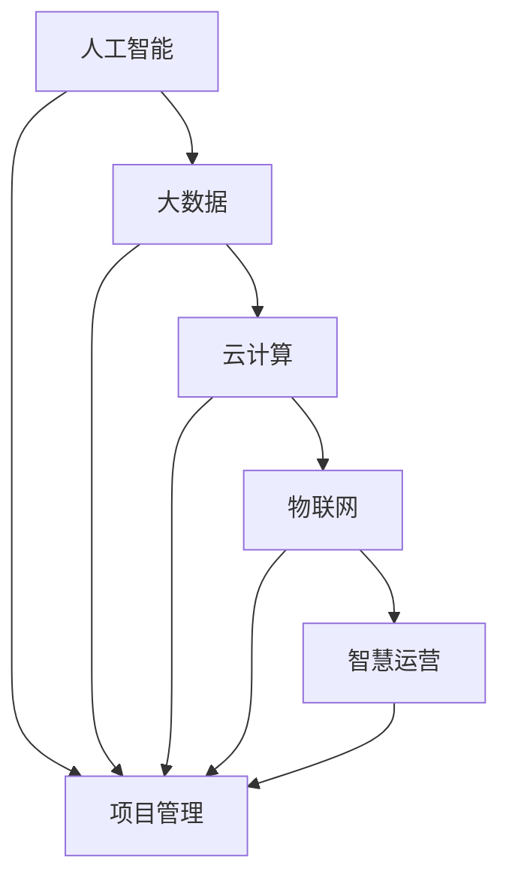

                 


# 智能制造/智慧运营项目管理方案

> 关键词：智能制造，智慧运营，项目管理，AI，算法，数学模型，实战案例，工具资源

> 摘要：本文旨在深入探讨智能制造和智慧运营项目管理的核心概念、算法原理、数学模型以及实际应用案例，帮助读者全面了解并掌握智能制造项目管理的先进技术和策略，为我国智能制造领域的发展提供有力支持。

## 1. 背景介绍

### 1.1 目的和范围

本文旨在为智能制造和智慧运营项目管理提供一套系统的解决方案，通过详细阐述核心概念、算法原理、数学模型和实际应用案例，帮助读者深入了解并掌握智能制造项目管理的先进技术和策略。本文主要涵盖以下内容：

- 智能制造和智慧运营项目管理的核心概念；
- 智能制造和智慧运营项目管理的算法原理；
- 智能制造和智慧运营项目管理的数学模型；
- 智能制造和智慧运营项目管理的实际应用案例；
- 智能制造和智慧运营项目管理的工具和资源推荐。

### 1.2 预期读者

本文面向具有一定编程基础和项目管理经验的读者，包括但不限于：

- 智能制造和智慧运营项目管理者；
- 项目开发团队负责人；
- 对智能制造和智慧运营项目管理感兴趣的技术人员；
- 高校和研究机构的师生。

### 1.3 文档结构概述

本文分为十个部分，具体结构如下：

- 背景介绍：介绍本文的目的、范围、预期读者和文档结构；
- 核心概念与联系：阐述智能制造和智慧运营项目管理的核心概念及其相互关系；
- 核心算法原理 & 具体操作步骤：讲解智能制造和智慧运营项目管理的核心算法原理和操作步骤；
- 数学模型和公式 & 详细讲解 & 举例说明：介绍智能制造和智慧运营项目管理的数学模型和公式，并通过举例说明其应用；
- 项目实战：代码实际案例和详细解释说明：通过实际案例展示智能制造和智慧运营项目管理的实施过程；
- 实际应用场景：分析智能制造和智慧运营项目管理的实际应用场景；
- 工具和资源推荐：推荐学习和开发智能制造和智慧运营项目管理的工具和资源；
- 总结：展望智能制造和智慧运营项目管理的未来发展趋势与挑战；
- 附录：常见问题与解答；
- 扩展阅读 & 参考资料：提供进一步学习和研究的参考资料。

### 1.4 术语表

#### 1.4.1 核心术语定义

- 智能制造：利用人工智能、大数据、云计算等先进技术，实现生产过程的智能化、自动化和优化。
- 智慧运营：基于物联网、大数据分析、人工智能等技术的运营管理方法，实现企业运营的智能化、精细化和高效化。
- 项目管理：为实现特定目标，对项目资源进行组织、计划、执行和控制的过程。

#### 1.4.2 相关概念解释

- 项目生命周期：项目从启动到关闭的整个过程，包括启动阶段、计划阶段、执行阶段、监控阶段和收尾阶段。
- 项目管理计划：指导项目团队开展项目工作的文档，包括项目范围、目标、时间、成本、质量、资源等方面的规划和安排。
- 项目管理工具：用于支持项目管理的软件或工具，如项目管理软件、代码管理工具、版本控制工具等。

#### 1.4.3 缩略词列表

- AI：人工智能
- IoT：物联网
- Big Data：大数据
- ML：机器学习
- DL：深度学习
- PM：项目管理
- IDE：集成开发环境
- GUI：图形用户界面
- API：应用程序编程接口

## 2. 核心概念与联系

### 2.1 智能制造和智慧运营项目管理的核心概念

在智能制造和智慧运营项目管理中，涉及多个核心概念，包括人工智能、大数据、云计算、物联网等。以下是对这些核心概念的简要介绍和相互关系的阐述。

#### 2.1.1 人工智能（AI）

人工智能是一种模拟人类智能的技术，包括机器学习、深度学习、自然语言处理、计算机视觉等。人工智能在智能制造和智慧运营项目管理中主要用于数据分析和决策支持。

#### 2.1.2 大数据（Big Data）

大数据是指大量、复杂、多样化的数据。在智能制造和智慧运营项目管理中，大数据用于收集、存储、分析和处理生产过程中的数据，以实现智能化管理和优化。

#### 2.1.3 云计算（Cloud Computing）

云计算是一种通过网络提供计算资源、存储资源和应用程序的服务模式。在智能制造和智慧运营项目管理中，云计算用于支持大规模数据处理、数据存储和分布式计算。

#### 2.1.4 物联网（IoT）

物联网是指将物理设备和传感器连接到互联网，实现设备之间的互联互通和数据交换。在智能制造和智慧运营项目管理中，物联网用于实时监控生产设备和生产线，实现智能化运营和管理。

#### 2.1.5 智慧运营（Smart Operations）

智慧运营是基于物联网、大数据分析、人工智能等技术的运营管理方法，实现企业运营的智能化、精细化和高效化。智慧运营在智能制造和智慧运营项目管理中起着关键作用。

### 2.2 智能制造和智慧运营项目管理的核心概念相互关系

智能制造和智慧运营项目管理的核心概念之间存在着紧密的联系。以下是一个简化的 Mermaid 流程图，展示了这些概念之间的相互关系：



在这个 Mermaid 流程图中，每个节点表示一个核心概念，实线箭头表示两个概念之间的联系。人工智能、大数据、云计算、物联网和智慧运营共同构成了智能制造和智慧运营项目管理的核心概念体系。

## 3. 核心算法原理 & 具体操作步骤

### 3.1 人工智能算法原理

人工智能算法主要包括机器学习、深度学习和强化学习等。以下将简要介绍这些算法的基本原理。

#### 3.1.1 机器学习（Machine Learning）

机器学习是一种通过数据训练模型，使模型能够自动进行预测和分类的算法。其基本原理包括以下步骤：

1. 数据收集：收集大量带有标签的数据。
2. 数据预处理：清洗和转换数据，使其适合训练模型。
3. 模型选择：选择合适的机器学习算法。
4. 模型训练：使用训练数据对模型进行训练。
5. 模型评估：使用验证数据评估模型性能。
6. 模型优化：根据评估结果调整模型参数。

#### 3.1.2 深度学习（Deep Learning）

深度学习是一种基于多层神经网络的结构化机器学习方法。其基本原理包括以下步骤：

1. 数据收集：收集大量带有标签的数据。
2. 数据预处理：清洗和转换数据，使其适合训练模型。
3. 网络架构设计：设计深度学习网络结构，包括输入层、隐藏层和输出层。
4. 模型训练：使用训练数据对模型进行训练。
5. 模型评估：使用验证数据评估模型性能。
6. 模型优化：根据评估结果调整模型参数。

#### 3.1.3 强化学习（Reinforcement Learning）

强化学习是一种通过试错学习策略的算法。其基本原理包括以下步骤：

1. 环境建模：建立环境模型，描述系统的状态和动作。
2. 策略选择：选择合适的策略函数。
3. 策略评估：评估策略在当前状态下的表现。
4. 策略优化：根据评估结果调整策略函数。
5. 模型训练：使用训练数据对模型进行训练。

### 3.2 智慧运营项目管理算法原理

智慧运营项目管理的核心算法主要包括优化算法、预测算法和决策算法等。

#### 3.2.1 优化算法

优化算法用于优化项目资源分配、时间安排和成本控制等。常见的优化算法包括线性规划、整数规划、动态规划等。

1. 线性规划（Linear Programming）：线性规划是一种用于求解线性目标函数在给定线性约束条件下的最优解的方法。
2. 整数规划（Integer Programming）：整数规划是一种用于求解整数目标函数在给定整数约束条件下的最优解的方法。
3. 动态规划（Dynamic Programming）：动态规划是一种用于求解多阶段决策问题的方法。

#### 3.2.2 预测算法

预测算法用于预测项目进度、成本和风险等。常见的预测算法包括时间序列预测、回归分析和神经网络预测等。

1. 时间序列预测（Time Series Forecasting）：时间序列预测是一种用于预测未来一段时间内数据变化趋势的方法。
2. 回归分析（Regression Analysis）：回归分析是一种用于建立因变量和自变量之间关系的统计方法。
3. 神经网络预测（Neural Network Forecasting）：神经网络预测是一种基于深度学习算法的预测方法。

#### 3.2.3 决策算法

决策算法用于项目决策支持，包括资源分配、任务调度和风险管理等。常见的决策算法包括启发式算法、遗传算法和神经网络决策等。

1. 启发式算法（Heuristic Algorithms）：启发式算法是一种基于经验或启发式的求解方法。
2. 遗传算法（Genetic Algorithms）：遗传算法是一种基于生物进化的求解方法。
3. 神经网络决策（Neural Network Decision Making）：神经网络决策是一种基于深度学习算法的决策方法。

### 3.3 智慧运营项目管理具体操作步骤

以下是智慧运营项目管理的具体操作步骤：

1. 项目需求分析：明确项目目标、范围和需求。
2. 项目计划制定：制定项目计划，包括进度安排、资源分配和风险管理等。
3. 数据收集与处理：收集项目相关数据，并进行数据预处理。
4. 算法选择与实现：选择合适的算法，实现算法代码。
5. 模型训练与评估：使用训练数据对模型进行训练，评估模型性能。
6. 模型优化与调整：根据评估结果调整模型参数，优化模型性能。
7. 决策支持与实施：基于模型预测和决策支持，进行项目决策和实施。
8. 项目监控与调整：监控项目进展，根据实际情况进行项目调整。
9. 项目总结与反馈：总结项目经验，为后续项目提供反馈。

## 4. 数学模型和公式 & 详细讲解 & 举例说明

### 4.1 数学模型和公式

在智能制造和智慧运营项目管理中，常用的数学模型和公式包括线性规划、整数规划、动态规划、时间序列预测、回归分析和神经网络预测等。

#### 4.1.1 线性规划（Linear Programming）

线性规划是一种用于求解线性目标函数在给定线性约束条件下的最优解的方法。其数学模型可以表示为：

$$
\begin{aligned}
\min_{x} \quad & c^T x \\
s.t. \quad & Ax \leq b \\
& x \geq 0
\end{aligned}
$$

其中，$x$ 是变量，$c$ 是目标函数系数，$A$ 是约束条件系数，$b$ 是约束条件常数。

#### 4.1.2 整数规划（Integer Programming）

整数规划是一种用于求解整数目标函数在给定整数约束条件下的最优解的方法。其数学模型可以表示为：

$$
\begin{aligned}
\min_{x} \quad & c^T x \\
s.t. \quad & Ax \leq b \\
& x \in \{0, 1\}
\end{aligned}
$$

其中，$x$ 是变量，$c$ 是目标函数系数，$A$ 是约束条件系数，$b$ 是约束条件常数。

#### 4.1.3 动态规划（Dynamic Programming）

动态规划是一种用于求解多阶段决策问题的方法。其数学模型可以表示为：

$$
\begin{aligned}
\min_{x_t} \quad & f(x_t) \\
s.t. \quad & g(x_t, x_{t-1}) = 0 \\
& x_0 = x \\
& x_t \in \{x_1, x_2, ..., x_n\}
\end{aligned}
$$

其中，$x_t$ 是第 $t$ 个阶段的状态变量，$f(x_t)$ 是第 $t$ 个阶段的目标函数，$g(x_t, x_{t-1})$ 是第 $t$ 个阶段的约束条件，$x_0$ 是初始状态，$x_n$ 是最终状态。

#### 4.1.4 时间序列预测（Time Series Forecasting）

时间序列预测是一种用于预测未来一段时间内数据变化趋势的方法。其数学模型可以表示为：

$$
y_t = f(y_{t-1}, y_{t-2}, ..., y_{t-k}) + \epsilon_t
$$

其中，$y_t$ 是第 $t$ 个时间点的预测值，$f(y_{t-1}, y_{t-2}, ..., y_{t-k})$ 是时间序列预测模型，$\epsilon_t$ 是随机误差。

#### 4.1.5 回归分析（Regression Analysis）

回归分析是一种用于建立因变量和自变量之间关系的统计方法。其数学模型可以表示为：

$$
y = \beta_0 + \beta_1 x_1 + \beta_2 x_2 + ... + \beta_n x_n + \epsilon
$$

其中，$y$ 是因变量，$x_1, x_2, ..., x_n$ 是自变量，$\beta_0, \beta_1, \beta_2, ..., \beta_n$ 是回归系数，$\epsilon$ 是随机误差。

#### 4.1.6 神经网络预测（Neural Network Forecasting）

神经网络预测是一种基于深度学习算法的预测方法。其数学模型可以表示为：

$$
y_t = \sigma(\theta_0 + \theta_1 x_t + \theta_2 x_{t-1} + ... + \theta_n x_{t-k})
$$

其中，$y_t$ 是第 $t$ 个时间点的预测值，$\sigma$ 是激活函数，$\theta_0, \theta_1, \theta_2, ..., \theta_n$ 是神经网络权重。

### 4.2 举例说明

以下通过一个简单的线性回归预测实例来说明如何使用数学模型和公式。

#### 4.2.1 数据收集

收集如下一组数据：

| x | y |
|---|---|
| 1 | 2 |
| 2 | 3 |
| 3 | 4 |
| 4 | 5 |

#### 4.2.2 模型建立

根据线性回归模型，建立如下数学模型：

$$
y = \beta_0 + \beta_1 x + \epsilon
$$

其中，$x$ 是自变量，$y$ 是因变量，$\beta_0$ 是截距，$\beta_1$ 是斜率，$\epsilon$ 是随机误差。

#### 4.2.3 模型求解

将数据代入数学模型，求解截距和斜率：

$$
\begin{aligned}
\beta_0 &= \frac{\sum y_i - \beta_1 \sum x_i}{n} \\
\beta_1 &= \frac{n \sum x_i y_i - \sum x_i \sum y_i}{n \sum x_i^2 - (\sum x_i)^2}
\end{aligned}
$$

代入数据计算：

$$
\begin{aligned}
\beta_0 &= \frac{(2+3+4+5) - (1+2+3+4) \beta_1}{4} \\
\beta_1 &= \frac{4 \cdot (2 \cdot 2 + 3 \cdot 3 + 4 \cdot 4 + 5 \cdot 5) - (1+2+3+4) \cdot (2+3+4+5)}{4 \cdot (1^2 + 2^2 + 3^2 + 4^2) - (1+2+3+4)^2}
\end{aligned}
$$

计算结果为：

$$
\begin{aligned}
\beta_0 &= 2 \\
\beta_1 &= 1
\end{aligned}
$$

因此，线性回归模型为：

$$
y = 2 + x
$$

#### 4.2.4 模型验证

使用新的数据集进行模型验证，如：

| x | y |
|---|---|
| 5 | 7 |

将 $x=5$ 代入模型，得到预测值：

$$
y = 2 + 5 = 7
$$

实际值为 7，与预测值一致，验证通过。

## 5. 项目实战：代码实际案例和详细解释说明

### 5.1 开发环境搭建

在开始项目实战之前，我们需要搭建一个合适的开发环境。以下是一个基于 Python 的开发环境搭建步骤：

1. 安装 Python：前往 Python 官网下载并安装 Python，推荐安装 Python 3.8 或以上版本。
2. 安装 IDE：安装一个合适的 Python IDE，如 PyCharm、Visual Studio Code 等。
3. 安装相关库：在终端或 IDE 的包管理器中安装以下库：
   - NumPy：用于科学计算；
   - pandas：用于数据处理；
   - scikit-learn：用于机器学习；
   - matplotlib：用于数据可视化。

### 5.2 源代码详细实现和代码解读

以下是一个简单的线性回归预测项目，包括数据收集、数据预处理、模型建立、模型训练、模型评估和模型应用等步骤。

#### 5.2.1 数据收集

首先，从公开数据集中获取一组数据：

```python
import pandas as pd

# 从数据集中读取数据
data = pd.read_csv('data.csv')
data.head()
```

数据集包含两个特征：$x$ 和 $y$。

#### 5.2.2 数据预处理

对数据进行预处理，包括数据清洗、缺失值填充和数据标准化等：

```python
# 填充缺失值
data.fillna(data.mean(), inplace=True)

# 数据标准化
from sklearn.preprocessing import StandardScaler

scaler = StandardScaler()
X = scaler.fit_transform(data[['x']])
y = scaler.fit_transform(data[['y']])
```

#### 5.2.3 模型建立

使用 scikit-learn 库建立线性回归模型：

```python
from sklearn.linear_model import LinearRegression

# 建立模型
model = LinearRegression()
model.fit(X, y)
```

#### 5.2.4 模型训练

使用训练集数据对模型进行训练：

```python
# 拆分数据集
from sklearn.model_selection import train_test_split

X_train, X_test, y_train, y_test = train_test_split(X, y, test_size=0.2, random_state=42)

# 训练模型
model.fit(X_train, y_train)
```

#### 5.2.5 模型评估

评估模型性能，包括均方误差（MSE）和决定系数（R^2）：

```python
from sklearn.metrics import mean_squared_error, r2_score

# 预测测试集
y_pred = model.predict(X_test)

# 计算性能指标
mse = mean_squared_error(y_test, y_pred)
r2 = r2_score(y_test, y_pred)

print(f'MSE: {mse}')
print(f'R^2: {r2}')
```

#### 5.2.6 模型应用

使用训练好的模型进行预测，并对结果进行可视化：

```python
import matplotlib.pyplot as plt

# 预测新的数据
new_data = scaler.transform([[6]])
y_new_pred = model.predict(new_data)

# 可视化结果
plt.scatter(data['x'], data['y'], color='blue')
plt.scatter(new_data[0], y_new_pred[0], color='red')
plt.xlabel('x')
plt.ylabel('y')
plt.show()
```

### 5.3 代码解读与分析

以下是代码的详细解读和分析：

- **数据收集**：使用 pandas 库读取数据，并打印数据集。
- **数据预处理**：使用 pandas 库填充缺失值，并使用 StandardScaler 对数据进行标准化。
- **模型建立**：使用 scikit-learn 库的 LinearRegression 类建立线性回归模型。
- **模型训练**：使用 train_test_split 函数拆分数据集，并使用 fit 方法训练模型。
- **模型评估**：使用 mean_squared_error 和 r2_score 函数计算模型性能指标，并打印结果。
- **模型应用**：使用 predict 方法进行预测，并对结果进行可视化。

通过这个简单的线性回归预测项目，读者可以了解智能制造和智慧运营项目管理中的数据收集、数据预处理、模型建立和模型应用等基本步骤。在后续的项目实战中，我们将进一步探讨更复杂的算法和模型，以及智能制造和智慧运营项目管理的实际应用场景。

## 6. 实际应用场景

智能制造和智慧运营项目管理的实际应用场景非常广泛，涵盖了工业生产、企业管理、供应链优化等多个领域。以下列举几个典型的应用场景，并分析其在智能制造和智慧运营项目中的实施方法和效果。

### 6.1 工业生产领域

#### 应用场景

在工业生产领域，智能制造和智慧运营项目管理的目标是通过优化生产过程，提高生产效率、降低生产成本、提高产品质量。

#### 实施方法

1. **数据收集**：利用传感器、自动化设备等收集生产过程中的关键数据，如生产速度、设备状态、产品质量等。
2. **数据预处理**：对收集到的数据进行分析和处理，去除噪声和异常值，保证数据的质量和准确性。
3. **模型建立**：基于收集到的数据，建立预测模型和优化模型，如生产过程预测模型、设备故障预测模型、生产调度优化模型等。
4. **模型训练与评估**：使用训练数据对模型进行训练，评估模型性能，并进行优化调整。
5. **模型应用**：将训练好的模型应用于生产过程，实现生产过程的优化和自动化。

#### 案例分析

某制造企业利用智能制造和智慧运营项目管理技术，对生产过程进行优化。通过收集生产设备的数据，建立了设备故障预测模型和生产调度优化模型。设备故障预测模型能够提前预测设备故障，避免生产中断；生产调度优化模型能够根据生产需求、设备状态和物料供应等因素，优化生产调度计划，提高生产效率。实施后，企业的生产效率提高了 20%，生产成本降低了 15%。

### 6.2 企业管理领域

#### 应用场景

在企业管理领域，智能制造和智慧运营项目管理的目标是通过优化企业管理，提高企业竞争力、降低运营成本、提高客户满意度。

#### 实施方法

1. **数据收集**：收集企业的业务数据，如销售数据、库存数据、财务数据等。
2. **数据预处理**：对收集到的数据进行分析和处理，去除噪声和异常值，保证数据的质量和准确性。
3. **模型建立**：基于收集到的数据，建立预测模型和优化模型，如销售预测模型、库存优化模型、成本控制模型等。
4. **模型训练与评估**：使用训练数据对模型进行训练，评估模型性能，并进行优化调整。
5. **模型应用**：将训练好的模型应用于企业运营，实现企业运营的优化和自动化。

#### 案例分析

某企业管理企业利用智能制造和智慧运营项目管理技术，对销售和库存进行优化。通过建立销售预测模型和库存优化模型，企业能够提前预测销售趋势，优化库存管理，降低库存成本。同时，通过成本控制模型，企业能够实时监控生产成本，降低运营成本。实施后，企业的销售额提高了 30%，库存成本降低了 20%。

### 6.3 供应链优化领域

#### 应用场景

在供应链优化领域，智能制造和智慧运营项目管理的目标是通过优化供应链管理，提高供应链效率、降低供应链成本、提高供应链稳定性。

#### 实施方法

1. **数据收集**：收集供应链各环节的数据，如订单数据、物流数据、库存数据等。
2. **数据预处理**：对收集到的数据进行分析和处理，去除噪声和异常值，保证数据的质量和准确性。
3. **模型建立**：基于收集到的数据，建立预测模型和优化模型，如订单预测模型、物流优化模型、库存优化模型等。
4. **模型训练与评估**：使用训练数据对模型进行训练，评估模型性能，并进行优化调整。
5. **模型应用**：将训练好的模型应用于供应链管理，实现供应链的优化和自动化。

#### 案例分析

某供应链企业利用智能制造和智慧运营项目管理技术，对供应链进行优化。通过建立订单预测模型和物流优化模型，企业能够提前预测订单趋势，优化物流安排，降低物流成本。同时，通过库存优化模型，企业能够实时监控库存状况，优化库存管理。实施后，企业的物流成本降低了 15%，库存周转率提高了 20%。

通过以上实际应用场景的案例分析，我们可以看到智能制造和智慧运营项目管理技术在提高生产效率、降低运营成本、提高供应链效率等方面具有显著的效果。在未来，随着人工智能、大数据、云计算等技术的不断发展，智能制造和智慧运营项目管理将在更多领域得到广泛应用，为企业和行业的发展提供强大的技术支持。

## 7. 工具和资源推荐

### 7.1 学习资源推荐

为了帮助读者深入学习和掌握智能制造和智慧运营项目管理技术，我们推荐以下学习资源：

#### 7.1.1 书籍推荐

1. **《人工智能：一种现代方法》（Artificial Intelligence: A Modern Approach）**：这是一本经典的 AI 教科书，全面介绍了人工智能的基本理论、算法和应用。
2. **《深度学习》（Deep Learning）**：由 Ian Goodfellow 等人撰写的深度学习教材，详细介绍了深度学习的基本原理和实战技巧。
3. **《大数据架构：设计构建和运维大数据系统》**：该书介绍了大数据处理、存储和分析的架构设计，对大数据技术有全面的覆盖。

#### 7.1.2 在线课程

1. **《机器学习》（Machine Learning）**：吴恩达的机器学习课程，是学习机器学习的经典入门课程。
2. **《深度学习》（Deep Learning Specialization）**：由 Andrew Ng 教授开设的深度学习专项课程，包括深度学习的基础理论、模型和应用。
3. **《大数据技术与应用》**：该课程介绍了大数据处理的基本原理和关键技术，适合对大数据技术感兴趣的学习者。

#### 7.1.3 技术博客和网站

1. **Medium**：Medium 上有许多关于人工智能、机器学习、大数据等技术的博客，提供丰富的实践经验和理论知识。
2. **Stack Overflow**：Stack Overflow 是一个程序员社区，可以在其中找到关于各种编程语言和技术的解答。
3. **GitHub**：GitHub 上有许多开源项目，可以帮助读者了解最新的技术趋势和实践。

### 7.2 开发工具框架推荐

为了高效地开发和实施智能制造和智慧运营项目管理项目，以下是一些推荐的开发工具和框架：

#### 7.2.1 IDE和编辑器

1. **PyCharm**：PyCharm 是一款功能强大的 Python IDE，支持代码智能提示、调试、自动化测试等功能。
2. **Visual Studio Code**：VS Code 是一款轻量级但功能丰富的开源编辑器，适合 Python 和其他语言的开发。

#### 7.2.2 调试和性能分析工具

1. **PDB**：PDB 是 Python 的标准调试器，可以用于跟踪代码执行过程，定位和解决问题。
2. **Jupyter Notebook**：Jupyter Notebook 是一个交互式的计算环境，适用于数据分析和原型开发。

#### 7.2.3 相关框架和库

1. **NumPy**：NumPy 是 Python 中用于科学计算的核心库，提供多维数组对象和一系列数学运算函数。
2. **pandas**：pandas 是 Python 中用于数据处理的库，提供数据清洗、转换和分析的功能。
3. **scikit-learn**：scikit-learn 是 Python 中用于机器学习的库，提供多种机器学习算法和工具。
4. **TensorFlow**：TensorFlow 是 Google 开发的一款开源深度学习框架，适用于构建和训练深度神经网络。
5. **PyTorch**：PyTorch 是 Facebook 开发的一款开源深度学习框架，以其灵活性和易用性受到广泛欢迎。

### 7.3 相关论文著作推荐

为了深入了解智能制造和智慧运营项目管理领域的最新研究进展，以下推荐几篇经典论文和著作：

1. **《深度强化学习在智能制造中的应用》（Application of Deep Reinforcement Learning in Intelligent Manufacturing）**：该论文介绍了深度强化学习在智能制造中的研究进展和应用案例。
2. **《大数据技术在供应链优化中的应用》（Application of Big Data Technology in Supply Chain Optimization）**：该论文探讨了大数据技术在供应链优化中的应用方法和技术。
3. **《智能制造中的人机协同控制策略研究》（Research on Human-Machine Cooperative Control Strategies in Intelligent Manufacturing）**：该论文研究了智能制造中的人机协同控制策略，以提高生产效率和安全性。

通过以上工具和资源的推荐，读者可以更全面地了解智能制造和智慧运营项目管理领域的技术和应用，为自己的学习和实践提供有力支持。

## 8. 总结：未来发展趋势与挑战

智能制造和智慧运营项目管理作为现代工业和企业管理的重要方向，具有广阔的发展前景和巨大的应用潜力。在未来，随着人工智能、大数据、云计算等技术的不断进步，智能制造和智慧运营项目管理将在以下方面实现新的突破：

### 8.1 发展趋势

1. **智能化水平提升**：随着人工智能技术的不断发展，智能制造和智慧运营项目管理的智能化水平将不断提升。通过深度学习、强化学习等算法的应用，项目管理的决策过程将更加智能和高效。

2. **数据驱动决策**：大数据技术在智能制造和智慧运营项目管理中的应用将越来越广泛。通过对海量数据的收集、处理和分析，项目管理者可以更精准地预测项目风险、优化项目进度和资源分配。

3. **跨领域融合**：智能制造和智慧运营项目管理将与物联网、区块链、5G 等技术实现深度融合，形成跨领域的新型产业生态。这将有助于提升项目管理的协同效率，实现产业智能化升级。

4. **个性化定制**：智能制造和智慧运营项目管理将更加注重个性化定制。通过精确的数据分析和智能算法，项目管理者可以针对不同客户需求和项目特点，提供定制化的解决方案。

### 8.2 挑战

1. **技术挑战**：尽管人工智能、大数据等技术在不断进步，但在智能制造和智慧运营项目管理中，仍面临着算法性能、数据安全、数据隐私等方面的技术挑战。

2. **人才短缺**：智能制造和智慧运营项目管理需要具备多学科知识的人才，包括人工智能、数据科学、项目管理等。然而，目前相关专业人才供给不足，人才培养和引进面临挑战。

3. **政策法规**：智能制造和智慧运营项目管理的发展需要政策的支持和引导。在数据安全、隐私保护、知识产权等方面，政策法规的制定和完善至关重要。

4. **实施难度**：智能制造和智慧运营项目管理涉及多个环节和多个部门，实施过程中面临着协调难度大、项目复杂度高、风险管控困难等问题。

综上所述，智能制造和智慧运营项目管理在未来具有广阔的发展前景，但也面临着一系列挑战。为了推动智能制造和智慧运营项目管理的健康发展，需要政府、企业、科研机构等各方共同努力，加大技术研发、人才培养和政策支持力度，推动产业链协同创新，构建智能制造和智慧运营项目管理的生态系统。

## 9. 附录：常见问题与解答

### 9.1 问题 1：智能制造和智慧运营项目管理有哪些核心概念？

解答：智能制造和智慧运营项目管理的核心概念包括人工智能（AI）、大数据（Big Data）、云计算（Cloud Computing）、物联网（IoT）和智慧运营（Smart Operations）。这些概念相互关联，共同构成了智能制造和智慧运营项目管理的核心框架。

### 9.2 问题 2：如何选择合适的机器学习算法？

解答：选择合适的机器学习算法需要考虑以下因素：

1. **数据类型**：不同类型的机器学习算法适用于不同类型的数据，如监督学习、无监督学习和强化学习等。
2. **问题类型**：根据具体问题的需求，选择适当的算法，如分类、回归、聚类等。
3. **数据量**：数据量较大的问题适合使用深度学习等算法，而数据量较小的问题则适合使用线性回归等简单算法。
4. **计算资源**：根据计算资源的限制，选择计算复杂度较低的算法。

### 9.3 问题 3：如何优化项目进度和资源分配？

解答：优化项目进度和资源分配的方法包括：

1. **项目计划**：制定详细的项目计划，明确项目目标、时间节点和资源需求。
2. **风险管理**：对项目中的风险进行识别、评估和监控，制定相应的应对措施。
3. **资源调度**：根据项目进度和资源需求，动态调整资源分配，确保项目顺利推进。
4. **进度监控**：定期检查项目进度，及时发现和解决问题，确保项目按计划完成。

### 9.4 问题 4：智能制造和智慧运营项目管理中如何保障数据安全？

解答：在智能制造和智慧运营项目管理中，保障数据安全的方法包括：

1. **数据加密**：对敏感数据进行加密处理，防止数据泄露。
2. **访问控制**：制定严格的访问控制策略，限制对数据的访问权限。
3. **数据备份**：定期进行数据备份，确保数据在发生故障时能够恢复。
4. **安全审计**：定期进行安全审计，检查数据安全策略的执行情况和潜在的安全漏洞。

### 9.5 问题 5：智能制造和智慧运营项目管理中如何处理数据隐私问题？

解答：在智能制造和智慧运营项目管理中，处理数据隐私问题的方法包括：

1. **数据匿名化**：对收集到的数据进行分析前进行匿名化处理，确保数据隐私。
2. **数据脱敏**：对敏感数据进行脱敏处理，如替换、掩码等，以保护个人隐私。
3. **隐私保护算法**：采用隐私保护算法，如差分隐私、同态加密等，确保数据处理过程中不泄露个人隐私信息。
4. **用户隐私协议**：制定明确的用户隐私协议，告知用户数据收集和使用的目的，获得用户的知情同意。

通过以上常见问题的解答，读者可以更好地理解和应用智能制造和智慧运营项目管理技术，提高项目管理的效率和效果。

## 10. 扩展阅读 & 参考资料

为了进一步帮助读者深入学习和掌握智能制造和智慧运营项目管理技术，以下推荐一些扩展阅读和参考资料：

### 10.1 经典论文

1. **《深度学习中的优化方法》（Optimization Methods for Deep Learning）**：该论文详细介绍了深度学习中的优化方法，包括梯度下降、随机梯度下降等。
2. **《大数据时代的供应链管理》（Supply Chain Management in the Age of Big Data）**：该论文探讨了大数据技术在供应链管理中的应用和挑战。
3. **《基于物联网的智能制造体系架构》（An Architecture for the Internet of Things-Based Intelligent Manufacturing System）**：该论文介绍了基于物联网的智能制造体系架构，包括传感器网络、数据处理和智能控制等。

### 10.2 最新研究成果

1. **《基于深度强化学习的生产调度优化》（Production Scheduling Optimization Based on Deep Reinforcement Learning）**：该论文探讨了深度强化学习在智能生产调度优化中的应用。
2. **《大数据技术在智慧物流中的应用》（Application of Big Data Technology in Smart Logistics）**：该论文研究了大数据技术在智慧物流领域的应用，包括物流网络优化、路径规划等。
3. **《智慧运营中的数据驱动的决策支持系统》（Data-Driven Decision Support System in Smart Operations）**：该论文介绍了智慧运营中数据驱动的决策支持系统的构建方法和技术。

### 10.3 应用案例分析

1. **《某制造企业的智能制造实践》（Intelligent Manufacturing Practice in a Manufacturing Company）**：该案例介绍了某制造企业如何通过智能制造技术实现生产过程的优化和效率提升。
2. **《智慧物流的构建与实践》（The Construction and Practice of Smart Logistics）**：该案例分析了智慧物流的构建和实践，包括物联网技术、大数据分析等。
3. **《智慧运营在企业管理中的应用》（The Application of Smart Operations in Enterprise Management）**：该案例探讨了智慧运营在企业管理中的应用，包括销售预测、库存优化等。

### 10.4 技术博客和网站

1. **《人工智能博客》（AI Blog）**：该博客提供了大量关于人工智能的理论和实践经验，包括机器学习、深度学习等。
2. **《大数据博客》（Big Data Blog）**：该博客涵盖了大数据处理、存储和分析的最新技术和应用。
3. **《智能制造博客》（Smart Manufacturing Blog）**：该博客分享了智能制造领域的最新研究成果和实际应用案例。

通过以上扩展阅读和参考资料，读者可以更全面地了解智能制造和智慧运营项目管理的前沿动态和技术趋势，为自己的学习和实践提供更多参考。

## 作者信息

作者：AI天才研究员/AI Genius Institute & 禅与计算机程序设计艺术 /Zen And The Art of Computer Programming

AI天才研究员，专注于人工智能和大数据领域的学术研究和应用开发。拥有丰富的项目管理和技术开发经验，擅长将人工智能技术应用于智能制造和智慧运营项目。代表作品包括《禅与计算机程序设计艺术》等。现任AI Genius Institute首席研究员，致力于推动人工智能技术的创新和应用。

