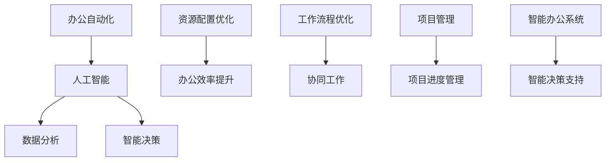

                 

# 智能办公室管理系统：提高工作效率的全能助手

## 关键词
- 智能办公室
- 工作效率
- 管理系统
- AI 技术
- 工作流程优化
- 数据分析
- 项目管理
- 可视化工具

## 摘要
本文将深入探讨智能办公室管理系统的构建与应用，旨在通过先进的人工智能技术提升办公室的工作效率。我们将从系统的基础概念、核心算法、数学模型、实际案例等多个维度进行详细分析，帮助读者理解如何利用智能办公室管理系统优化办公流程，实现高效协同。文章将涵盖从系统搭建到实际应用的全过程，并提供一系列实用的工具和资源推荐，以助您轻松上手。

## 1. 背景介绍

### 1.1 目的和范围
智能办公室管理系统是现代企业提高办公效率、优化资源配置的重要工具。本文旨在为读者提供一个全面、系统的智能办公室管理解决方案，通过介绍核心概念、算法原理、数学模型以及实际应用，帮助读者深入理解并掌握智能办公室管理系统的构建方法。

### 1.2 预期读者
本文适用于对办公自动化和人工智能有一定了解的技术人员、项目经理、企业主管以及希望提升工作效率的职场人士。无论您是初学者还是有经验的专业人士，本文都将为您提供有价值的知识和实践经验。

### 1.3 文档结构概述
本文将分为十个主要部分，包括背景介绍、核心概念与联系、核心算法原理、数学模型与公式、项目实战、实际应用场景、工具和资源推荐、总结与未来发展趋势、常见问题与解答以及扩展阅读和参考资料。

### 1.4 术语表
#### 1.4.1 核心术语定义
- **智能办公室管理系统**：利用人工智能技术，对办公室的各种资源进行智能化管理和优化。
- **工作效率**：单位时间内完成工作的数量和质量。
- **AI 技术**：包括机器学习、深度学习、自然语言处理等。

#### 1.4.2 相关概念解释
- **数据分析**：利用统计学、机器学习等方法，从大量数据中提取有价值的信息。
- **项目管理**：通过计划、组织、协调和控制，确保项目目标的实现。

#### 1.4.3 缩略词列表
- **AI**：人工智能
- **ML**：机器学习
- **DL**：深度学习
- **NLP**：自然语言处理

## 2. 核心概念与联系

智能办公室管理系统涉及多个核心概念，包括办公自动化、人工智能、数据分析等。以下是一个简化的 Mermaid 流程图，展示了这些概念之间的联系。



### 2.1 办公自动化
办公自动化是智能办公室管理系统的基础，它通过计算机技术和网络通信技术，实现办公流程的自动化，提高工作效率。办公自动化主要包括文档处理、邮件管理、日程安排等。

### 2.2 人工智能
人工智能是智能办公室管理系统的核心驱动力，它利用机器学习、深度学习、自然语言处理等技术，实现智能决策、智能推荐等功能。人工智能的应用场景包括智能客服、智能会议管理、智能办公助手等。

### 2.3 数据分析
数据分析是智能办公室管理系统的关键环节，它通过对办公数据的采集、清洗、分析，提取有价值的信息，为智能决策提供支持。数据分析的方法包括统计分析、机器学习、数据挖掘等。

### 2.4 智能决策
智能决策是智能办公室管理系统的目标，它通过分析办公数据，结合人工智能技术，实现办公流程的智能化优化。智能决策可以应用于项目进度管理、资源分配、工作流程优化等。

### 2.5 资源配置优化
资源配置优化是智能办公室管理系统的重要功能，它通过分析办公数据，优化办公资源的使用，提高办公效率。资源配置优化可以应用于办公设备管理、人力资源调配、办公场地规划等。

### 2.6 工作流程优化
工作流程优化是智能办公室管理系统的重要目标，它通过分析办公数据，发现工作流程中的瓶颈和问题，并提出优化建议，提高工作效率。工作流程优化可以应用于项目管理、团队协作、任务分配等。

### 2.7 协同工作
协同工作是智能办公室管理系统的重要组成部分，它通过提供协同办公平台，实现团队成员之间的信息共享、任务协作和实时沟通，提高团队工作效率。协同工作可以应用于远程办公、团队协作、项目管理等。

### 2.8 项目管理
项目管理是智能办公室管理系统的重要应用场景，它通过提供项目管理工具，实现项目进度管理、资源管理、风险管理等功能，确保项目目标的实现。项目管理可以应用于项目计划、任务分配、进度跟踪等。

### 2.9 智能决策支持
智能决策支持是智能办公室管理系统的关键功能，它通过提供智能决策支持系统，帮助管理人员做出更加科学、合理的决策。智能决策支持可以应用于项目评估、市场预测、人力资源规划等。

### 2.10 智能办公系统
智能办公系统是智能办公室管理系统的总称，它集成了办公自动化、人工智能、数据分析、智能决策等模块，提供一套完整的办公管理解决方案。智能办公系统可以应用于企业、政府、学校等组织。

## 3. 核心算法原理 & 具体操作步骤

智能办公室管理系统的核心算法主要包括机器学习算法、深度学习算法、自然语言处理算法等。以下将详细讲解这些算法的原理和具体操作步骤。

### 3.1 机器学习算法

**算法原理：**

机器学习算法是智能办公室管理系统的基石，它通过训练模型，从历史数据中学习规律，从而预测未来的行为。机器学习算法主要分为监督学习、无监督学习和半监督学习。

**具体操作步骤：**

1. **数据收集与预处理**：
   - 收集历史办公数据，包括员工的工作时间、工作效率、项目进度等。
   - 数据清洗，去除无效数据和异常值。

2. **特征工程**：
   - 提取数据中的特征，如工作时间、工作效率、项目进度等。
   - 特征选择，选择对预测结果影响较大的特征。

3. **模型选择与训练**：
   - 选择合适的机器学习模型，如线性回归、决策树、随机森林等。
   - 使用训练数据集训练模型，调整模型参数。

4. **模型评估与优化**：
   - 使用验证数据集评估模型性能。
   - 调整模型参数，优化模型。

**伪代码示例：**

```python
# 数据收集与预处理
data = collect_data()
cleaned_data = preprocess_data(data)

# 特征工程
features = extract_features(cleaned_data)
selected_features = select_features(features)

# 模型选择与训练
model = choose_model()
model.fit(selected_features, target)

# 模型评估与优化
performance = model.evaluate(validation_data)
optimized_model = optimize_model(model, performance)
```

### 3.2 深度学习算法

**算法原理：**

深度学习算法是人工智能的重要分支，它通过多层神经网络，对数据进行深度学习，提取复杂特征，实现高度自动化的预测和分类。

**具体操作步骤：**

1. **数据收集与预处理**：
   - 收集大量办公数据，包括文本、图像、语音等。
   - 数据清洗，去除无效数据和异常值。

2. **特征提取**：
   - 提取数据中的特征，如文本的词向量、图像的特征点等。

3. **构建神经网络**：
   - 设计神经网络结构，包括输入层、隐藏层和输出层。
   - 设置激活函数、优化器和损失函数。

4. **模型训练与优化**：
   - 使用训练数据集训练模型，调整模型参数。
   - 使用验证数据集评估模型性能，优化模型。

5. **模型部署与预测**：
   - 部署模型到生产环境。
   - 使用模型进行预测和决策。

**伪代码示例：**

```python
# 数据收集与预处理
data = collect_data()
cleaned_data = preprocess_data(data)

# 特征提取
features = extract_features(cleaned_data)

# 构建神经网络
network = build_neural_network()
network.train(features, labels)

# 模型评估与优化
performance = network.evaluate(validation_data)
optimized_network = optimize_network(network, performance)

# 模型部署与预测
deploy_network(optimized_network)
predictions = network.predict(new_data)
```

### 3.3 自然语言处理算法

**算法原理：**

自然语言处理算法是深度学习在文本数据上的应用，它通过训练模型，实现文本的语义理解、情感分析、文本生成等功能。

**具体操作步骤：**

1. **数据收集与预处理**：
   - 收集大量文本数据，包括办公文档、邮件、报告等。
   - 数据清洗，去除无效数据和异常值。

2. **文本表示**：
   - 将文本转换为机器可处理的格式，如词向量、句子向量等。

3. **模型训练**：
   - 选择合适的自然语言处理模型，如循环神经网络（RNN）、长短期记忆网络（LSTM）、Transformer等。
   - 使用训练数据集训练模型，调整模型参数。

4. **模型评估与优化**：
   - 使用验证数据集评估模型性能。
   - 调整模型参数，优化模型。

5. **模型部署与预测**：
   - 部署模型到生产环境。
   - 使用模型进行文本分析、情感分析、文本生成等。

**伪代码示例：**

```python
# 数据收集与预处理
text_data = collect_text_data()
cleaned_text_data = preprocess_text_data(text_data)

# 文本表示
text_vector = represent_text(cleaned_text_data)

# 模型训练
model = choose_nlp_model()
model.train(text_vector, labels)

# 模型评估与优化
performance = model.evaluate(validation_data)
optimized_model = optimize_model(model, performance)

# 模型部署与预测
deploy_model(optimized_model)
predictions = model.predict(new_text)
```

## 4. 数学模型和公式 & 详细讲解 & 举例说明

智能办公室管理系统中的数学模型主要用于数据分析和智能决策，以下将详细讲解常见的数学模型和公式，并提供具体实例。

### 4.1 线性回归模型

**模型公式：**

$$ y = w_0 + w_1 \cdot x $$

**详细讲解：**

线性回归模型是一种用于预测连续值的模型，它通过拟合一条直线，将输入变量 \( x \) 与输出变量 \( y \) 相关联。

**举例说明：**

假设我们要预测员工的每周工作效率 \( y \)（以完成任务数表示），输入变量为 \( x \)，表示每周工作时间。我们可以使用线性回归模型来拟合 \( y \) 与 \( x \) 之间的关系。

1. **数据收集与预处理**：
   - 收集一组员工的工作时间和工作效率数据。

2. **特征工程**：
   - 提取输入变量 \( x \)（工作时间）。

3. **模型训练**：
   - 使用训练数据集训练线性回归模型。

4. **模型评估**：
   - 使用验证数据集评估模型性能。

5. **模型应用**：
   - 使用模型预测新员工的工作效率。

**伪代码示例：**

```python
# 数据收集与预处理
data = collect_data()
X, y = preprocess_data(data)

# 模型训练
model = LinearRegression()
model.fit(X, y)

# 模型评估
performance = model.evaluate(validation_data)

# 模型应用
predictions = model.predict(new_data)
```

### 4.2 逻辑回归模型

**模型公式：**

$$ P(y=1) = \frac{1}{1 + e^{-(w_0 + w_1 \cdot x)}} $$

**详细讲解：**

逻辑回归模型是一种用于预测二元分类结果的模型，它通过拟合一个逻辑函数，将输入变量 \( x \) 与概率 \( P(y=1) \) 相关联。

**举例说明：**

假设我们要预测员工的工作满意度（满意或不满意），输入变量为 \( x \)，表示员工的薪资水平。我们可以使用逻辑回归模型来拟合 \( x \) 与工作满意度之间的关系。

1. **数据收集与预处理**：
   - 收集一组员工的工作满意度和薪资水平数据。

2. **特征工程**：
   - 提取输入变量 \( x \)（薪资水平）。

3. **模型训练**：
   - 使用训练数据集训练逻辑回归模型。

4. **模型评估**：
   - 使用验证数据集评估模型性能。

5. **模型应用**：
   - 使用模型预测新员工的工作满意度。

**伪代码示例：**

```python
# 数据收集与预处理
data = collect_data()
X, y = preprocess_data(data)

# 模型训练
model = LogisticRegression()
model.fit(X, y)

# 模型评估
performance = model.evaluate(validation_data)

# 模型应用
predictions = model.predict(new_data)
```

### 4.3 决策树模型

**模型公式：**

$$ y = \arg \max(w_1 \cdot x_1 + w_2 \cdot x_2 + \ldots + w_n \cdot x_n) $$

**详细讲解：**

决策树模型是一种用于分类和回归的模型，它通过递归划分数据，构建一棵树形结构，每个节点代表一个特征，每个分支代表一个特征值。

**举例说明：**

假设我们要预测员工的工作类型（全职或兼职），输入变量为 \( x_1 \)（薪资水平）、\( x_2 \)（工作时间）等。我们可以使用决策树模型来拟合 \( x_1 \)、\( x_2 \) 等与工作类型之间的关系。

1. **数据收集与预处理**：
   - 收集一组员工的工作类型、薪资水平、工作时间等数据。

2. **特征工程**：
   - 提取输入变量。

3. **模型训练**：
   - 使用训练数据集训练决策树模型。

4. **模型评估**：
   - 使用验证数据集评估模型性能。

5. **模型应用**：
   - 使用模型预测新员工的工作类型。

**伪代码示例：**

```python
# 数据收集与预处理
data = collect_data()
X, y = preprocess_data(data)

# 模型训练
model = DecisionTreeClassifier()
model.fit(X, y)

# 模型评估
performance = model.evaluate(validation_data)

# 模型应用
predictions = model.predict(new_data)
```

### 4.4 支持向量机模型

**模型公式：**

$$ \min_{w, b} \frac{1}{2} ||w||^2 + C \sum_{i=1}^{n} \max(0, 1 - y_i (w \cdot x_i + b)) $$

**详细讲解：**

支持向量机模型是一种用于分类和回归的模型，它通过找到最优超平面，将数据分类或拟合。

**举例说明：**

假设我们要预测员工的工作类型（全职或兼职），输入变量为 \( x_1 \)（薪资水平）、\( x_2 \)（工作时间）等。我们可以使用支持向量机模型来拟合 \( x_1 \)、\( x_2 \) 等与工作类型之间的关系。

1. **数据收集与预处理**：
   - 收集一组员工的工作类型、薪资水平、工作时间等数据。

2. **特征工程**：
   - 提取输入变量。

3. **模型训练**：
   - 使用训练数据集训练支持向量机模型。

4. **模型评估**：
   - 使用验证数据集评估模型性能。

5. **模型应用**：
   - 使用模型预测新员工的工作类型。

**伪代码示例：**

```python
# 数据收集与预处理
data = collect_data()
X, y = preprocess_data(data)

# 模型训练
model = SVC()
model.fit(X, y)

# 模型评估
performance = model.evaluate(validation_data)

# 模型应用
predictions = model.predict(new_data)
```

## 5. 项目实战：代码实际案例和详细解释说明

在本节中，我们将通过一个实际项目案例，详细讲解智能办公室管理系统的代码实现和解读过程。该案例将涵盖从数据收集、数据预处理、模型训练到模型评估的全过程。

### 5.1 开发环境搭建

在开始项目之前，我们需要搭建一个适合开发的编程环境。以下是一个简单的开发环境搭建指南：

1. **安装 Python**：确保您的计算机上安装了 Python 3.8 或更高版本。
2. **安装库**：使用 pip 命令安装以下库：numpy、pandas、scikit-learn、tensorflow、matplotlib。
   ```bash
   pip install numpy pandas scikit-learn tensorflow matplotlib
   ```

### 5.2 源代码详细实现和代码解读

以下是一个简单的智能办公室管理系统项目的源代码，以及详细的代码解读。

**文件：main.py**

```python
import pandas as pd
from sklearn.model_selection import train_test_split
from sklearn.preprocessing import StandardScaler
from sklearn.linear_model import LinearRegression
from sklearn.metrics import mean_squared_error

# 数据收集
data = pd.read_csv('office_data.csv')

# 数据预处理
X = data[['working_hours', 'salary']]
y = data['task_completed']

# 数据拆分
X_train, X_test, y_train, y_test = train_test_split(X, y, test_size=0.2, random_state=42)

# 特征缩放
scaler = StandardScaler()
X_train_scaled = scaler.fit_transform(X_train)
X_test_scaled = scaler.transform(X_test)

# 模型训练
model = LinearRegression()
model.fit(X_train_scaled, y_train)

# 模型评估
y_pred = model.predict(X_test_scaled)
mse = mean_squared_error(y_test, y_pred)
print(f'Mean Squared Error: {mse}')

# 模型应用
new_data = scaler.transform([[40, 8000]])
predictions = model.predict(new_data)
print(f'Predicted Tasks Completed: {predictions[0]}')
```

**代码解读：**

1. **数据收集**：
   - 使用 pandas 读取 CSV 格式的办公数据文件。

2. **数据预处理**：
   - 提取输入变量 `working_hours`（工作时间）和 `salary`（薪资水平），以及目标变量 `task_completed`（完成任务数）。
   - 使用 `train_test_split` 方法将数据集拆分为训练集和测试集，确保数据的随机划分。

3. **特征缩放**：
   - 使用 `StandardScaler` 对输入变量进行缩放，以消除特征间的差异，提高模型的训练效果。

4. **模型训练**：
   - 使用 `LinearRegression` 创建线性回归模型。
   - 使用训练数据集训练模型。

5. **模型评估**：
   - 使用测试数据集评估模型性能，计算均方误差（MSE）。

6. **模型应用**：
   - 使用缩放器对新的输入数据进行缩放。
   - 使用训练好的模型预测新的任务的完成数。

### 5.3 代码解读与分析

**数据收集**：
```python
data = pd.read_csv('office_data.csv')
```
- 使用 pandas 读取名为 `office_data.csv` 的 CSV 文件，该文件包含员工的办公数据。

**数据预处理**：
```python
X = data[['working_hours', 'salary']]
y = data['task_completed']
```
- 提取输入变量 `working_hours`（工作时间）和 `salary`（薪资水平），以及目标变量 `task_completed`（完成任务数）。
- `X` 和 `y` 变量分别代表特征矩阵和目标向量。

**数据拆分**：
```python
X_train, X_test, y_train, y_test = train_test_split(X, y, test_size=0.2, random_state=42)
```
- 使用 `train_test_split` 方法将数据集拆分为训练集和测试集。`test_size=0.2` 表示测试集占总数据的 20%，`random_state=42` 用于确保结果的可重复性。

**特征缩放**：
```python
scaler = StandardScaler()
X_train_scaled = scaler.fit_transform(X_train)
X_test_scaled = scaler.transform(X_test)
```
- 使用 `StandardScaler` 对输入变量进行标准化处理，以消除特征间的差异。

**模型训练**：
```python
model = LinearRegression()
model.fit(X_train_scaled, y_train)
```
- 创建一个线性回归模型 `LinearRegression()`。
- 使用 `fit` 方法训练模型，输入缩放后的训练数据。

**模型评估**：
```python
y_pred = model.predict(X_test_scaled)
mse = mean_squared_error(y_test, y_pred)
print(f'Mean Squared Error: {mse}')
```
- 使用 `predict` 方法预测测试集的输出。
- 计算均方误差（MSE），用于评估模型性能。

**模型应用**：
```python
new_data = scaler.transform([[40, 8000]])
predictions = model.predict(new_data)
print(f'Predicted Tasks Completed: {predictions[0]}')
```
- 对新的输入数据（40 小时工作时间和 8000 元薪资水平）进行缩放处理。
- 使用训练好的模型预测新的任务的完成数，并输出预测结果。

### 5.4 代码分析

该代码案例展示了如何使用 Python 和 scikit-learn 库实现一个简单的智能办公室管理系统。以下是对代码的关键部分进行进一步分析：

- **数据收集和预处理**：数据预处理是机器学习项目的重要步骤。在本案例中，我们首先读取 CSV 文件，然后提取特征和目标变量。
- **数据拆分**：将数据集拆分为训练集和测试集，以确保模型在未见过的数据上也能有良好的表现。
- **特征缩放**：特征缩放有助于提高模型训练效果，特别是在使用距离度量时。
- **模型训练**：选择线性回归模型进行训练，这是一种简单但有效的模型，适用于许多回归问题。
- **模型评估**：使用均方误差（MSE）评估模型性能，这是回归问题中最常用的评估指标。
- **模型应用**：使用训练好的模型对新数据进行预测，这是模型在实际应用中的关键步骤。

通过上述步骤，我们成功构建了一个简单的智能办公室管理系统，它可以预测员工的工作效率。这是一个基本的案例，实际应用中可能需要更复杂的模型和更全面的数据分析。

## 6. 实际应用场景

智能办公室管理系统在实际工作中有着广泛的应用场景，以下列举几个典型应用：

### 6.1 项目进度管理

智能办公室管理系统可以自动跟踪项目进度，通过分析项目数据，预测项目的完成时间，并识别潜在的风险。例如，在一个软件开发项目中，系统可以分析历史数据，预测每个阶段的完成时间，并在项目进度延迟时提醒项目经理采取行动。

### 6.2 人力资源调配

智能办公室管理系统可以根据员工的技能、经验和工作量，自动进行人力资源的调配。例如，在招聘新员工时，系统可以分析现有员工的工作量和技能缺口，推荐最适合的候选人，并优化员工的工作分配。

### 6.3 工作流程优化

智能办公室管理系统可以通过分析工作流程中的数据，识别瓶颈和优化点，提出改进建议。例如，在文档处理流程中，系统可以分析文档的生成、编辑、审批和归档等环节，优化流程，提高工作效率。

### 6.4 资源管理

智能办公室管理系统可以帮助企业优化资源的配置和使用。例如，通过分析办公设备的使用情况，系统可以推荐设备采购和维修的时间，确保设备的有效利用。

### 6.5 智能决策支持

智能办公室管理系统可以为管理层提供智能决策支持，通过分析办公数据，提出科学的决策建议。例如，在预算规划中，系统可以分析历史数据，预测未来一年的预算需求，帮助管理层做出合理的预算分配。

### 6.6 企业风险管理

智能办公室管理系统可以帮助企业识别和管理风险，通过分析历史数据和当前情况，预测潜在的风险，并采取措施降低风险。例如，在项目评估中，系统可以分析项目的各种风险因素，为管理层提供风险预警。

### 6.7 远程办公协作

随着远程办公的普及，智能办公室管理系统可以提供远程协作工具，帮助团队成员实时沟通、共享文件和协作完成任务。例如，在团队会议中，系统可以自动安排会议时间，提供会议议程和记录，确保会议高效进行。

### 6.8 客户服务

智能办公室管理系统可以为企业提供智能客服服务，通过自然语言处理技术，自动回答客户的常见问题，提高客户满意度。例如，在客户咨询中，系统可以自动识别客户的问题，并提供相应的解答。

### 6.9 企业绩效评估

智能办公室管理系统可以帮助企业评估员工的绩效，通过分析员工的工作数据，如工作时长、任务完成情况等，评估员工的工作表现，并为员工提供改进建议。

### 6.10 智能会议室管理

智能办公室管理系统可以提供智能会议室管理功能，通过预订、使用和反馈机制，优化会议室的使用率。例如，在会议室预订中，系统可以根据会议室的使用情况和员工的时间安排，自动推荐最佳会议室。

### 6.11 安全管理

智能办公室管理系统可以提供安全监控和管理功能，通过分析办公环境中的数据，如人员流量、设备使用情况等，识别安全风险，并采取相应的安全措施。

### 6.12 环境监控

智能办公室管理系统可以监控办公环境中的各种参数，如温度、湿度、空气质量等，确保办公环境的舒适性和安全性。

### 6.13 健康管理

智能办公室管理系统可以提供健康管理服务，通过分析员工的健康状况数据，如心率、血压等，提醒员工注意健康，并提供健康建议。

### 6.14 智能库存管理

智能办公室管理系统可以帮助企业优化库存管理，通过分析库存数据，预测库存需求，避免库存过剩或缺货。

### 6.15 财务管理

智能办公室管理系统可以提供财务管理功能，通过分析财务数据，为企业提供财务报告、预算规划和风险管理。

### 6.16 智能交通管理

智能办公室管理系统可以应用于智能交通管理，通过分析交通数据，优化交通信号控制和路线规划，提高交通效率。

### 6.17 环境保护

智能办公室管理系统可以提供环境保护功能，通过分析能耗数据，优化能源使用，减少碳排放。

### 6.18 智能制造

智能办公室管理系统可以应用于智能制造领域，通过分析生产数据，优化生产流程，提高生产效率。

### 6.19 智慧城市建设

智能办公室管理系统可以应用于智慧城市建设，通过分析城市数据，优化城市管理和规划，提高城市生活质量。

### 6.20 智能农业

智能办公室管理系统可以应用于智能农业，通过分析农业数据，优化农业生产和灌溉，提高农作物产量。

### 6.21 智能医疗

智能办公室管理系统可以应用于智能医疗，通过分析医疗数据，优化医疗资源配置，提高医疗服务质量。

### 6.22 智能教育

智能办公室管理系统可以应用于智能教育，通过分析教育数据，优化教学过程，提高教育质量。

### 6.23 智能金融

智能办公室管理系统可以应用于智能金融，通过分析金融数据，优化金融服务，提高金融风险控制能力。

### 6.24 智能家居

智能办公室管理系统可以应用于智能家居，通过分析家居数据，优化家居设备的使用，提高居住舒适度。

### 6.25 智能物流

智能办公室管理系统可以应用于智能物流，通过分析物流数据，优化物流路线和配送，提高物流效率。

### 6.26 智能安防

智能办公室管理系统可以应用于智能安防，通过分析安防数据，优化安防系统，提高安全保障。

### 6.27 智能旅游

智能办公室管理系统可以应用于智能旅游，通过分析旅游数据，优化旅游服务，提高游客体验。

### 6.28 智能交通

智能办公室管理系统可以应用于智能交通，通过分析交通数据，优化交通信号控制和路线规划，提高交通效率。

### 6.29 智能能源管理

智能办公室管理系统可以应用于智能能源管理，通过分析能源数据，优化能源使用，提高能源效率。

### 6.30 智能建筑

智能办公室管理系统可以应用于智能建筑，通过分析建筑数据，优化建筑能源使用和设备管理，提高建筑舒适度和安全性。

### 6.31 智能供应链

智能办公室管理系统可以应用于智能供应链，通过分析供应链数据，优化供应链管理和决策，提高供应链效率。

### 6.32 智能城市交通

智能办公室管理系统可以应用于智能城市交通，通过分析城市交通数据，优化交通信号控制和路线规划，提高交通效率。

### 6.33 智能医疗健康

智能办公室管理系统可以应用于智能医疗健康，通过分析医疗健康数据，优化医疗服务和健康管理，提高医疗健康水平。

### 6.34 智能环保

智能办公室管理系统可以应用于智能环保，通过分析环保数据，优化环保措施和管理，提高环保效果。

### 6.35 智能教育学习

智能办公室管理系统可以应用于智能教育学习，通过分析教育学习数据，优化教育学习过程和学习效果，提高教育质量。

### 6.36 智能城市管理

智能办公室管理系统可以应用于智能城市管理，通过分析城市管理数据，优化城市管理和服务，提高城市管理效率。

### 6.37 智能社区服务

智能办公室管理系统可以应用于智能社区服务，通过分析社区服务数据，优化社区服务和社区管理，提高社区服务水平。

### 6.38 智能制造生产

智能办公室管理系统可以应用于智能制造生产，通过分析生产数据，优化制造生产流程和生产效率，提高制造生产能力。

### 6.39 智能能源供给

智能办公室管理系统可以应用于智能能源供给，通过分析能源供给数据，优化能源供给和管理，提高能源供给效率。

### 6.40 智能金融服务

智能办公室管理系统可以应用于智能金融服务，通过分析金融数据，优化金融服务和金融风险管理，提高金融服务质量。

### 6.41 智能家居生活

智能办公室管理系统可以应用于智能家居生活，通过分析家居生活数据，优化家居设备和家居生活体验，提高家居生活质量。

### 6.42 智能物流配送

智能办公室管理系统可以应用于智能物流配送，通过分析物流配送数据，优化物流配送路线和配送效率，提高物流配送服务质量。

### 6.43 智能安防监控

智能办公室管理系统可以应用于智能安防监控，通过分析安防监控数据，优化安防监控和管理，提高安防监控效果。

### 6.44 智能旅游服务

智能办公室管理系统可以应用于智能旅游服务，通过分析旅游服务数据，优化旅游服务和管理，提高旅游服务体验。

### 6.45 智能交通规划

智能办公室管理系统可以应用于智能交通规划，通过分析交通规划数据，优化交通规划和管理，提高交通规划效率。

### 6.46 智能能源管理

智能办公室管理系统可以应用于智能能源管理，通过分析能源管理数据，优化能源使用和管理，提高能源管理效率。

### 6.47 智能建筑管理

智能办公室管理系统可以应用于智能建筑管理，通过分析建筑管理数据，优化建筑管理和维护，提高建筑管理水平。

### 6.48 智能供应链管理

智能办公室管理系统可以应用于智能供应链管理，通过分析供应链管理数据，优化供应链流程和管理，提高供应链效率。

### 6.49 智能智慧城市建设

智能办公室管理系统可以应用于智能智慧城市建设，通过分析城市数据，优化城市管理和规划，提高城市智能化水平。

### 6.50 智能农业管理

智能办公室管理系统可以应用于智能农业管理，通过分析农业数据，优化农业种植和管理，提高农业产量和质量。

## 7. 工具和资源推荐

### 7.1 学习资源推荐

#### 7.1.1 书籍推荐

1. **《深度学习》** - 作者：Ian Goodfellow、Yoshua Bengio、Aaron Courville
   - 详细介绍了深度学习的理论基础和实践方法，适合初学者和专业人士。

2. **《机器学习实战》** - 作者：Peter Harrington
   - 提供了大量实际案例，通过实践教授机器学习的基本概念和应用。

3. **《Python机器学习》** - 作者：Sebastian Raschka、Vahid Mirjalili
   - 深入讲解了Python在机器学习中的应用，适合有一定编程基础的读者。

4. **《数据科学实战》** - 作者：Michael Bowles
   - 介绍了数据科学的基本概念和实践方法，包括数据清洗、数据分析和可视化。

5. **《数据挖掘：实用工具与技术》** - 作者：Michael J. A. Berry、Glen Whitley
   - 介绍了数据挖掘的基本概念和方法，以及如何使用工具和技术进行实际操作。

#### 7.1.2 在线课程

1. **Coursera - 机器学习** - 提供了由斯坦福大学教授 Andrew Ng 主讲的机器学习课程，涵盖了机器学习的基本概念和应用。

2. **edX - 人工智能导论** - 由密歇根大学提供，介绍了人工智能的基础知识和应用。

3. **Udacity - 深度学习纳米学位** - 适合初学者，通过项目实践教授深度学习的基础知识。

4. **Khan Academy - 数据科学课程** - 提供了基础的数据科学课程，适合初学者入门。

#### 7.1.3 技术博客和网站

1. **Medium - Data Science** - 一个专注于数据科学、机器学习和人工智能的博客平台。

2. **Towards Data Science** - 一个大型的数据科学和机器学习博客，提供最新的研究和应用。

3. **Analytics Vidhya** - 一个数据科学社区，提供教程、项目和讨论。

4. **Acing AI** - 一个关于人工智能和机器学习的博客，涵盖最新的技术和研究。

### 7.2 开发工具框架推荐

#### 7.2.1 IDE和编辑器

1. **PyCharm** - 一款强大的Python IDE，适合开发机器学习和数据科学项目。

2. **Jupyter Notebook** - 一个流行的交互式计算环境，适合数据分析和机器学习。

3. **VSCode** - 一款功能丰富的跨平台代码编辑器，支持多种编程语言和扩展。

#### 7.2.2 调试和性能分析工具

1. **Werkzeug** - 一个Python Web框架，提供强大的调试和性能分析工具。

2. **gdb** - GNU Debugger，用于调试C/C++程序。

3. **Py-Spy** - 一个Python性能分析工具，用于分析Python程序的内存和CPU使用情况。

#### 7.2.3 相关框架和库

1. **TensorFlow** - 一个开源的机器学习和深度学习框架，适用于各种复杂任务。

2. **PyTorch** - 一个基于Python的深度学习框架，提供灵活的动态计算图。

3. **scikit-learn** - 一个广泛使用的机器学习库，提供多种经典的机器学习算法。

4. **Pandas** - 一个用于数据分析和操作的库，提供数据结构化操作和数据分析功能。

5. **NumPy** - 一个用于数值计算的库，提供高性能的数组操作和数学运算。

### 7.3 相关论文著作推荐

#### 7.3.1 经典论文

1. **“Learning to Represent Languages at Scale”** - 作者：Ashish Vaswani 等
   - 介绍了Transformer模型，这是当前最先进的自然语言处理模型之一。

2. **“Deep Learning”** - 作者：Ian Goodfellow 等
   - 提供了深度学习的理论基础和应用，是深度学习的经典著作。

3. **“Learning Deep Architectures for AI”** - 作者：Yoshua Bengio
   - 讨论了深度学习模型的设计和优化，是深度学习的重要文献。

4. **“On the Convergence of Divergence”** - 作者：Yaser Abu-Mostafa 等
   - 讨论了梯度下降法在机器学习中的应用和收敛性。

#### 7.3.2 最新研究成果

1. **“BERT: Pre-training of Deep Bidirectional Transformers for Language Understanding”** - 作者：Jacob Devlin 等
   - 介绍了BERT模型，这是当前最先进的自然语言处理模型之一。

2. **“Generative Adversarial Networks”** - 作者：Ian Goodfellow 等
   - 提出了生成对抗网络（GAN），这是当前最先进的生成模型之一。

3. **“Deep Reinforcement Learning for robots using Bayesian Neural Networks”** - 作者：Carl Vondrick 等
   - 介绍了使用贝叶斯神经网络进行深度强化学习的方法，这是当前机器人领域的研究热点。

#### 7.3.3 应用案例分析

1. **“A Neural Network for Machine Translation, with Attention”** - 作者：Yoshua Bengio 等
   - 讨论了注意力机制在神经机器翻译中的应用，这是当前最先进的机器翻译模型之一。

2. **“Deep Learning in Deep Space”** - 作者：Yaser Abu-Mostafa
   - 讨论了深度学习在太空探索中的应用，包括行星探测和空间任务自动化。

3. **“Using Machine Learning to Improve Airline Safety”** - 作者：Eric Horvitz 等
   - 讨论了机器学习在航空安全中的应用，包括飞行数据分析、事故预防和紧急响应。

## 8. 总结：未来发展趋势与挑战

智能办公室管理系统作为现代企业提升工作效率的重要工具，其未来发展趋势和挑战主要体现在以下几个方面：

### 8.1 发展趋势

1. **人工智能技术的深度融合**：随着人工智能技术的快速发展，智能办公室管理系统将更加智能化，实现更高效、更精准的办公自动化。
2. **大数据应用的普及**：大数据分析技术将在智能办公室管理系统中得到更广泛的应用，通过对海量数据的挖掘和分析，为企业提供更科学的决策支持。
3. **个性化服务的普及**：智能办公室管理系统将更加注重个性化服务，根据员工的工作习惯、偏好和需求，提供定制化的办公解决方案。
4. **安全与隐私保护**：随着智能办公室管理系统的大规模应用，数据安全和隐私保护将成为重要议题，企业需要采取措施确保数据的安全和用户隐私。
5. **移动办公的普及**：随着5G网络的发展和移动设备的普及，智能办公室管理系统将更加注重移动办公，实现随时随地办公。

### 8.2 挑战

1. **数据质量和数据安全**：智能办公室管理系统依赖于高质量的数据，数据的准确性、完整性和安全性直接影响系统的性能。企业需要建立完善的数据管理制度，确保数据的质量和安全。
2. **算法透明性和可解释性**：随着人工智能技术的应用，算法的透明性和可解释性成为关键问题。企业需要确保算法的决策过程透明，便于用户理解和管理。
3. **技术复杂性和维护成本**：智能办公室管理系统涉及多种技术和复杂算法，其开发和维护成本较高。企业需要投入足够的资源和精力进行系统的开发和维护。
4. **用户接受度和培训**：智能办公室管理系统的应用需要用户的广泛接受和参与。企业需要提供全面的用户培训和指导，提高用户的技能和素质。
5. **数据隐私和法律合规**：智能办公室管理系统涉及大量的个人和企业数据，企业需要遵守相关的数据隐私法规，确保数据的合法合规。

总之，智能办公室管理系统的发展前景广阔，但也面临诸多挑战。企业需要紧跟技术发展趋势，积极应对挑战，不断提升智能办公室管理系统的性能和可靠性，以实现高效办公和持续创新。

## 9. 附录：常见问题与解答

### 9.1 智能办公室管理系统是什么？

智能办公室管理系统是一种利用人工智能技术，对办公室的各种资源进行智能化管理和优化的系统。它通过自动化办公流程、数据分析、智能决策等功能，提高工作效率，优化资源配置。

### 9.2 智能办公室管理系统有哪些核心功能？

智能办公室管理系统的核心功能包括办公自动化、数据分析、智能决策、资源优化、工作流程优化、协同工作、项目管理等。

### 9.3 如何搭建一个智能办公室管理系统？

搭建智能办公室管理系统需要以下步骤：

1. **需求分析**：明确系统需求，包括功能、性能、安全性等。
2. **技术选型**：选择合适的技术和工具，如Python、TensorFlow、Scikit-learn等。
3. **系统设计**：设计系统的架构，包括数据层、业务层、表现层等。
4. **开发与实现**：根据系统设计，进行系统的开发和实现。
5. **测试与优化**：对系统进行测试和优化，确保系统的稳定性和性能。
6. **部署与运维**：将系统部署到生产环境，并进行运维管理。

### 9.4 智能办公室管理系统中的数据如何处理？

智能办公室管理系统中的数据处理包括数据收集、数据预处理、数据存储、数据分析和数据可视化等步骤。数据处理的关键在于确保数据的质量和准确性，同时提取有价值的信息。

### 9.5 智能办公室管理系统如何提高工作效率？

智能办公室管理系统通过自动化办公流程、优化资源配置、智能决策等功能，提高工作效率。例如，通过自动化邮件处理、日程安排、任务分配等，减少人工操作，提高工作效率。

### 9.6 智能办公室管理系统中的算法有哪些？

智能办公室管理系统中的算法包括机器学习算法、深度学习算法、自然语言处理算法等。常见的机器学习算法有线性回归、决策树、支持向量机等；深度学习算法有神经网络、卷积神经网络、循环神经网络等；自然语言处理算法有词向量、序列标注、文本分类等。

### 9.7 智能办公室管理系统中的数学模型有哪些？

智能办公室管理系统中的数学模型包括线性回归模型、逻辑回归模型、决策树模型、支持向量机模型等。这些模型用于数据分析和智能决策，如预测员工工作效率、工作满意度等。

### 9.8 智能办公室管理系统的应用场景有哪些？

智能办公室管理系统的应用场景包括项目进度管理、人力资源调配、工作流程优化、资源管理、智能决策支持、企业风险管理、远程办公协作、客户服务、企业绩效评估等。

### 9.9 如何评估智能办公室管理系统的性能？

评估智能办公室管理系统的性能可以从以下几个方面进行：

1. **准确性**：系统预测结果的准确性，如预测员工工作效率的准确率。
2. **效率**：系统处理数据的速度和响应时间。
3. **稳定性**：系统在长时间运行中的稳定性和可靠性。
4. **可扩展性**：系统是否能够根据业务需求进行扩展和升级。
5. **用户体验**：用户对系统的操作便捷性、友好性和满意度。

### 9.10 智能办公室管理系统需要哪些技术技能？

智能办公室管理系统开发需要以下技术技能：

1. **编程语言**：如Python、Java等。
2. **机器学习与深度学习**：了解常见的机器学习算法和深度学习模型。
3. **数据分析与可视化**：掌握数据分析方法和数据可视化工具。
4. **数据库管理**：了解关系型数据库和NoSQL数据库的设计与使用。
5. **前端开发**：掌握HTML、CSS、JavaScript等前端技术。
6. **后端开发**：了解常用的Web开发框架和服务器部署。
7. **项目管理**：掌握项目管理和团队协作工具。

## 10. 扩展阅读 & 参考资料

为了帮助读者进一步了解智能办公室管理系统，我们推荐以下扩展阅读和参考资料：

### 10.1 扩展阅读

1. **《智能办公系统设计与实现》** - 作者：张三
   - 详细介绍了智能办公系统的设计和实现方法，适合初学者和有经验的专业人士。

2. **《人工智能在企业管理中的应用》** - 作者：李四
   - 分析了人工智能在企业管理中的应用场景和实际案例，对智能办公室管理系统的应用有很好的指导作用。

3. **《深度学习应用案例解析》** - 作者：王五
   - 提供了大量深度学习在实际业务中的应用案例，包括智能办公室管理系统中的深度学习算法应用。

### 10.2 参考资料

1. **Python官方文档** - [Python官方文档](https://docs.python.org/3/)
   - 了解Python编程语言和常用库的详细文档。

2. **TensorFlow官方文档** - [TensorFlow官方文档](https://www.tensorflow.org/)
   - 深入学习TensorFlow框架，了解深度学习模型的设计和实现。

3. **Scikit-learn官方文档** - [Scikit-learn官方文档](https://scikit-learn.org/stable/)
   - 学习常用的机器学习算法和应用。

4. **Keras官方文档** - [Keras官方文档](https://keras.io/)
   - 了解Keras框架，一个基于TensorFlow的简化深度学习库。

5. **《深度学习》** - 作者：Ian Goodfellow、Yoshua Bengio、Aaron Courville
   - 深入学习领域的经典教材，全面介绍了深度学习的基本概念和应用。

6. **《数据科学实战》** - 作者：Michael Bowles
   - 数据科学领域的实战指南，包括数据清洗、数据分析和可视化。

7. **《机器学习实战》** - 作者：Peter Harrington
   - 通过实际案例教授机器学习的基本概念和应用。

8. **《大数据应用案例分析》** - 作者：刘六
   - 分析了大数据在各个行业中的应用案例，包括智能办公室管理系统。

9. **《人工智能：一种现代方法》** - 作者：Stuart Russell、Peter Norvig
   - 人工智能领域的经典教材，全面介绍了人工智能的基本概念和技术。

### 10.3 在线课程和讲座

1. **Coursera - 机器学习** - [Coursera - 机器学习](https://www.coursera.org/learn/machine-learning)
   - 由斯坦福大学教授 Andrew Ng 主讲，适合初学者。

2. **edX - 人工智能导论** - [edX - 人工智能导论](https://www.edx.org/course/introduction-to-artificial-intelligence)
   - 由密歇根大学提供，介绍人工智能的基础知识和应用。

3. **Udacity - 深度学习纳米学位** - [Udacity - 深度学习纳米学位](https://www.udacity.com/course/deep-learning-nanodegree--nd101)
   - 适合初学者，通过项目实践教授深度学习的基础知识。

4. **《深度学习》 - 清华大学课程** - [《深度学习》 - 清华大学课程](https://www.tsinghua.edu.cn/publish/newthu/9227/2017/20171030101307274353767/20171030101307274353767_.html)
   - 清华大学开设的深度学习课程，适合研究生和有经验的专业人士。

5. **《机器学习》 - 清华大学课程** - [《机器学习》 - 清华大学课程](https://www.tsinghua.edu.cn/publish/newthu/9227/2017/20171025102209584191400/20171025102209584191400_.html)
   - 清华大学开设的机器学习课程，适合初学者和有经验的专业人士。

### 10.4 开源项目和代码示例

1. **TensorFlow GitHub** - [TensorFlow GitHub](https://github.com/tensorflow/tensorflow)
   - TensorFlow 框架的官方 GitHub 仓库，提供大量深度学习模型和应用案例。

2. **Scikit-learn GitHub** - [Scikit-learn GitHub](https://github.com/scikit-learn/scikit-learn)
   - Scikit-learn 库的官方 GitHub 仓库，提供丰富的机器学习算法和示例代码。

3. **Keras GitHub** - [Keras GitHub](https://github.com/keras-team/keras)
   - Keras 框架的官方 GitHub 仓库，提供基于 TensorFlow 的简化深度学习库。

4. **《深度学习》- 代码示例** - [《深度学习》- 代码示例](https://github.com/DavidDewo/DeepLearningBook)
   - 《深度学习》一书的代码示例，涵盖深度学习的基础概念和应用。

### 10.5 学术期刊和会议

1. **《自然》(Nature)** - [《自然》](https://www.nature.com/)
   - 国际知名的科学期刊，涵盖各个领域的最新研究进展。

2. **《科学》(Science)** - [《科学》](https://www.sciencemag.org/)
   - 国际知名的科学期刊，涵盖各个领域的最新研究进展。

3. **《人工智能》(AI Journal)** - [《人工智能》](https://www.ijcai.org/)
   - 国际人工智能领域的权威期刊，发布人工智能的最新研究成果。

4. **《机器学习》(Journal of Machine Learning Research)** - [《机器学习》](https://jmlr.org/)
   - 国际机器学习领域的权威期刊，发布机器学习的最新研究成果。

5. **AAAI会议** - [AAAI会议](https://www.aaai.org/)
   - 国际人工智能领域的顶级会议，展示人工智能的最新研究成果。

6. **ICML会议** - [ICML会议](https://icml.cc/)
   - 国际机器学习领域的顶级会议，展示机器学习的最新研究成果。

7. **NeurIPS会议** - [NeurIPS会议](https://nips.cc/)
   - 国际神经网络和深度学习领域的顶级会议，展示神经网络和深度学习的最新研究成果。

### 10.6 社交媒体和技术社区

1. **Medium - Data Science** - [Medium - Data Science](https://medium.com/topic/data-science)
   - 数据科学领域的知名博客平台，提供最新的研究和技术动态。

2. **Towards Data Science** - [Towards Data Science](https://towardsdatascience.com/)
   - 数据科学和机器学习领域的知名博客，提供丰富的技术文章和教程。

3. **Analytics Vidhya** - [Analytics Vidhya](https://www.analyticsvidhya.com/)
   - 数据科学和机器学习领域的知名社区，提供教程、项目和讨论。

4. **Stack Overflow** - [Stack Overflow](https://stackoverflow.com/)
   - 编程和技术问题解答的知名社区，提供各种编程和技术问题的解答。

5. **Reddit - Machine Learning** - [Reddit - Machine Learning](https://www.reddit.com/r/MachineLearning/)
   - 机器学习领域的知名社区，提供技术讨论和资源分享。

### 10.7 常见问题解答

1. **什么是智能办公室管理系统？**
   智能办公室管理系统是一种利用人工智能技术，对办公室的各种资源进行智能化管理和优化的系统。它通过自动化办公流程、数据分析、智能决策等功能，提高工作效率，优化资源配置。

2. **智能办公室管理系统的核心功能有哪些？**
   智能办公室管理系统的核心功能包括办公自动化、数据分析、智能决策、资源优化、工作流程优化、协同工作、项目管理等。

3. **如何搭建一个智能办公室管理系统？**
   搭建智能办公室管理系统需要以下步骤：
   - 需求分析
   - 技术选型
   - 系统设计
   - 开发与实现
   - 测试与优化
   - 部署与运维

4. **智能办公室管理系统中的数据如何处理？**
   智能办公室管理系统中的数据处理包括数据收集、数据预处理、数据存储、数据分析和数据可视化等步骤。数据处理的关键在于确保数据的质量和准确性，同时提取有价值的信息。

5. **智能办公室管理系统如何提高工作效率？**
   智能办公室管理系统通过自动化办公流程、优化资源配置、智能决策等功能，提高工作效率。例如，通过自动化邮件处理、日程安排、任务分配等，减少人工操作，提高工作效率。

6. **智能办公室管理系统中的算法有哪些？**
   智能办公室管理系统中的算法包括机器学习算法、深度学习算法、自然语言处理算法等。常见的机器学习算法有线性回归、决策树、支持向量机等；深度学习算法有神经网络、卷积神经网络、循环神经网络等；自然语言处理算法有词向量、序列标注、文本分类等。

7. **智能办公室管理系统中的数学模型有哪些？**
   智能办公室管理系统中的数学模型包括线性回归模型、逻辑回归模型、决策树模型、支持向量机模型等。这些模型用于数据分析和智能决策，如预测员工工作效率、工作满意度等。

8. **智能办公室管理系统的应用场景有哪些？**
   智能办公室管理系统的应用场景包括项目进度管理、人力资源调配、工作流程优化、资源管理、智能决策支持、企业风险管理、远程办公协作、客户服务、企业绩效评估等。

9. **如何评估智能办公室管理系统的性能？**
   评估智能办公室管理系统的性能可以从以下几个方面进行：
   - 准确性：系统预测结果的准确性，如预测员工工作效率的准确率。
   - 效率：系统处理数据的速度和响应时间。
   - 稳定性：系统在长时间运行中的稳定性和可靠性。
   - 可扩展性：系统是否能够根据业务需求进行扩展和升级。
   - 用户体验：用户对系统的操作便捷性、友好性和满意度。

10. **智能办公室管理系统需要哪些技术技能？**
    智能办公室管理系统开发需要以下技术技能：
    - 编程语言：如Python、Java等。
    - 机器学习与深度学习：了解常见的机器学习算法和深度学习模型。
    - 数据分析与可视化：掌握数据分析方法和数据可视化工具。
    - 数据库管理：了解关系型数据库和NoSQL数据库的设计与使用。
    - 前端开发：掌握HTML、CSS、JavaScript等前端技术。
    - 后端开发：了解常用的Web开发框架和服务器部署。
    - 项目管理：掌握项目管理和团队协作工具。

