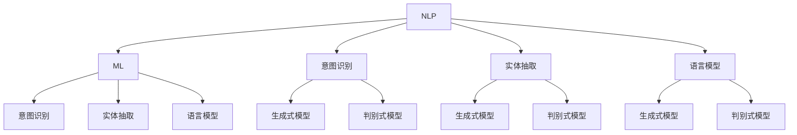

                 

## 智能化回应技术在CUI中的实现

### 关键词：
- CUI（命令界面用户）
- 智能化回应
- 自然语言处理
- 机器学习
- 语音识别

> **摘要：**本文将深入探讨智能化回应技术在命令界面用户（CUI）中的应用。我们首先会回顾CUI的背景和重要性，接着介绍智能化回应的基本原理，详细阐述实现流程、数学模型以及项目实战。最后，我们将讨论智能化回应技术在实际应用场景中的广泛用途，并推荐相关学习资源和工具。

---

### 1. 背景介绍

#### 1.1 目的和范围

随着人工智能技术的快速发展，用户界面（UI）也在不断革新。传统的命令界面用户（CUI）虽然功能强大，但缺乏自然性和灵活性。本文旨在探讨如何通过智能化技术，提升CUI的用户体验，使其更加友好、高效。本文将涵盖智能化回应技术在CUI中的应用，包括其实现原理、算法步骤、数学模型和实际案例。

#### 1.2 预期读者

本文适合对人工智能、自然语言处理（NLP）和机器学习有一定基础的读者。无论是CUI的开发者、研究者，还是对AI技术感兴趣的爱好者，都可以通过本文获取到有价值的知识和启发。

#### 1.3 文档结构概述

本文结构如下：

1. **背景介绍**：回顾CUI的背景和重要性，以及智能化回应技术的概念。
2. **核心概念与联系**：介绍智能化回应技术的基础概念和架构。
3. **核心算法原理 & 具体操作步骤**：详细阐述智能化回应算法的原理和实现步骤。
4. **数学模型和公式 & 详细讲解 & 举例说明**：讲解相关的数学模型和公式，并通过实际案例进行说明。
5. **项目实战：代码实际案例和详细解释说明**：通过实际项目，展示智能化回应技术的应用。
6. **实际应用场景**：讨论智能化回应技术在各个领域的应用。
7. **工具和资源推荐**：推荐相关的学习资源和工具。
8. **总结：未来发展趋势与挑战**：总结本文内容，展望未来发展趋势和面临的挑战。
9. **附录：常见问题与解答**：解答读者可能遇到的问题。
10. **扩展阅读 & 参考资料**：提供进一步的阅读材料和参考文献。

#### 1.4 术语表

##### 1.4.1 核心术语定义

- **命令界面用户（CUI）**：一种通过命令行与计算机系统交互的用户界面。
- **自然语言处理（NLP）**：使计算机能够理解、解释和生成人类语言的技术。
- **机器学习**：一种人工智能技术，通过数据学习和优化算法来改进性能。
- **智能化回应**：利用NLP和机器学习技术，对用户输入的命令进行理解并生成智能回复。

##### 1.4.2 相关概念解释

- **意图识别**：从用户输入中识别出用户希望完成的具体任务。
- **实体抽取**：从用户输入中提取出关键信息，如日期、地点、人名等。
- **语言模型**：用于预测文本序列的概率分布的模型。
- **生成式模型**：能够生成自然语言的模型，如生成式对抗网络（GAN）。

##### 1.4.3 缩略词列表

- **NLP**：自然语言处理
- **ML**：机器学习
- **CUI**：命令界面用户
- **UI**：用户界面

## 2. 核心概念与联系

在深入探讨智能化回应技术之前，我们首先需要理解几个核心概念：自然语言处理（NLP）、机器学习（ML）、意图识别、实体抽取等。以下是这些概念的基本原理和它们之间的联系。

### 2.1 自然语言处理（NLP）

自然语言处理（NLP）是人工智能的一个重要分支，主要研究如何使计算机理解、解释和生成人类语言。NLP的基本原理包括文本预处理、词向量表示、语法分析、语义理解和文本生成等。

- **文本预处理**：包括分词、词性标注、停用词过滤等步骤，目的是将原始文本转换为计算机可以处理的格式。
- **词向量表示**：将单词映射为高维向量，以便在计算机中进行处理。常用的词向量模型有Word2Vec、GloVe等。
- **语法分析**：通过分析句子的结构，将文本转换为抽象语法树（AST），从而理解句子的语法规则。
- **语义理解**：通过上下文信息，对句子中的词汇和短语进行语义标注，以理解句子的实际含义。
- **文本生成**：利用机器学习模型，如序列到序列（Seq2Seq）模型，生成自然语言的文本。

### 2.2 机器学习（ML）

机器学习（ML）是使计算机通过数据学习并做出预测或决策的技术。ML的基本原理包括模型训练、模型评估和模型优化等。

- **模型训练**：通过大量数据对模型进行训练，使其学会识别模式和关系。
- **模型评估**：使用测试数据集评估模型的性能，以确定其准确性和泛化能力。
- **模型优化**：通过调整模型参数，提高模型性能。

### 2.3 意图识别

意图识别是NLP和ML的一个关键任务，旨在从用户输入中识别出用户希望完成的具体任务。意图识别通常包括以下几个步骤：

1. **文本预处理**：对用户输入进行分词、词性标注等预处理。
2. **特征提取**：从预处理后的文本中提取特征，如词向量、TF-IDF等。
3. **模型训练**：使用有标签的数据集训练意图识别模型。
4. **模型评估**：使用测试数据集评估模型性能。
5. **模型部署**：将训练好的模型部署到实际应用中。

### 2.4 实体抽取

实体抽取是从用户输入中提取出关键信息的过程，如日期、地点、人名等。实体抽取通常包括以下几个步骤：

1. **文本预处理**：对用户输入进行分词、词性标注等预处理。
2. **特征提取**：从预处理后的文本中提取特征，如词向量、TF-IDF等。
3. **模型训练**：使用有标签的数据集训练实体抽取模型。
4. **模型评估**：使用测试数据集评估模型性能。
5. **模型部署**：将训练好的模型部署到实际应用中。

### 2.5 语言模型

语言模型是用于预测文本序列概率分布的模型，如生成式模型和判别式模型。语言模型在文本生成和意图识别中都有广泛应用。

- **生成式模型**：通过生成文本序列的概率分布，生成自然语言的文本。如生成式对抗网络（GAN）。
- **判别式模型**：通过预测文本序列的标签，实现对文本的分类或标注。如神经网络分类器。

### 2.6 关系图

为了更好地理解这些核心概念之间的联系，我们可以使用Mermaid流程图进行可视化。以下是一个简化的流程图，展示了NLP、ML、意图识别、实体抽取和语言模型之间的关系。



通过上述流程图，我们可以看到NLP和ML是如何相互融合，共同实现意图识别、实体抽取和语言模型的。接下来，我们将进一步探讨这些核心概念的具体实现和操作步骤。

## 3. 核心算法原理 & 具体操作步骤

为了实现智能化回应技术，我们需要对用户输入进行意图识别和实体抽取，并根据这些信息生成智能回复。以下是实现这一目标的核心算法原理和具体操作步骤。

### 3.1 意图识别算法原理

意图识别算法的核心目标是理解用户输入的意图，并将其映射到具体的任务。以下是一个典型的意图识别算法的步骤：

1. **文本预处理**：对用户输入进行分词、词性标注等预处理操作，将其转换为计算机可以处理的格式。
    ```python
    import nltk
    nltk.download('punkt')
    nltk.download('averaged_perceptron_tagger')
    
    def preprocess_text(text):
        tokens = nltk.word_tokenize(text)
        tagged_tokens = nltk.pos_tag(tokens)
        return tagged_tokens
    ```
2. **特征提取**：从预处理后的文本中提取特征，如词向量、TF-IDF等。
    ```python
    from sklearn.feature_extraction.text import TfidfVectorizer
    
    def extract_features(texts):
        vectorizer = TfidfVectorizer()
        features = vectorizer.fit_transform(texts)
        return features
    ```
3. **模型训练**：使用有标签的数据集训练意图识别模型。我们可以使用逻辑回归、决策树、随机森林、支持向量机（SVM）等模型。
    ```python
    from sklearn.linear_model import LogisticRegression
    
    def train_model(features, labels):
        model = LogisticRegression()
        model.fit(features, labels)
        return model
    ```
4. **模型评估**：使用测试数据集评估模型性能，如准确率、召回率、F1值等。
    ```python
    from sklearn.metrics import accuracy_score, recall_score, f1_score
    
    def evaluate_model(model, features, labels):
        predictions = model.predict(features)
        accuracy = accuracy_score(labels, predictions)
        recall = recall_score(labels, predictions)
        f1 = f1_score(labels, predictions)
        return accuracy, recall, f1
    ```
5. **模型部署**：将训练好的模型部署到实际应用中，以识别用户输入的意图。

### 3.2 实体抽取算法原理

实体抽取是从用户输入中提取出关键信息的过程，如日期、地点、人名等。以下是一个典型的实体抽取算法的步骤：

1. **文本预处理**：对用户输入进行分词、词性标注等预处理操作，将其转换为计算机可以处理的格式。
    ```python
    import nltk
    nltk.download('punkt')
    nltk.download('averaged_perceptron_tagger')
    
    def preprocess_text(text):
        tokens = nltk.word_tokenize(text)
        tagged_tokens = nltk.pos_tag(tokens)
        return tagged_tokens
    ```
2. **特征提取**：从预处理后的文本中提取特征，如词向量、TF-IDF等。
    ```python
    from sklearn.feature_extraction.text import TfidfVectorizer
    
    def extract_features(texts):
        vectorizer = TfidfVectorizer()
        features = vectorizer.fit_transform(texts)
        return features
    ```
3. **模型训练**：使用有标签的数据集训练实体抽取模型。我们可以使用条件随机场（CRF）、长短期记忆网络（LSTM）、BERT等模型。
    ```python
    from sklearn_crfsuite import CRF
    from keras.models import Sequential
    from keras.layers import LSTM, Dense
    
    def train_crf_model(features, labels):
        model = CRF()
        model.fit(features, labels)
        return model
    
    def train_lstm_model(features, labels):
        model = Sequential()
        model.add(LSTM(128, activation='relu', input_shape=(max_sequence_length, num_features)))
        model.add(Dense(num_labels, activation='softmax'))
        model.compile(optimizer='adam', loss='categorical_crossentropy', metrics=['accuracy'])
        model.fit(features, labels, epochs=10, batch_size=32)
        return model
    ```
4. **模型评估**：使用测试数据集评估模型性能，如准确率、召回率、F1值等。
    ```python
    from sklearn.metrics import accuracy_score, recall_score, f1_score
    
    def evaluate_model(model, features, labels):
        predictions = model.predict(features)
        accuracy = accuracy_score(labels, predictions)
        recall = recall_score(labels, predictions)
        f1 = f1_score(labels, predictions)
        return accuracy, recall, f1
    ```
5. **模型部署**：将训练好的模型部署到实际应用中，以提取用户输入中的关键信息。

### 3.3 智能回复生成算法原理

智能回复生成是基于意图识别和实体抽取的结果，生成一个符合用户需求的回复。以下是一个典型的智能回复生成算法的步骤：

1. **语言模型训练**：使用大量文本数据训练一个生成式语言模型，如生成式对抗网络（GAN）、序列到序列（Seq2Seq）模型等。
    ```python
    from keras.models import Model
    from keras.layers import LSTM, Dense, Embedding
    
    def train_seq2seq_model(input_texts, target_texts, input_vocab_size, target_vocab_size, embedding_size):
        encoder_inputs = Embedding(input_vocab_size, embedding_size, input_length=max_sequence_length)(input_texts)
        encoder = LSTM(embedding_size)
        encoder_outputs = encoder(encoder_inputs)
        encoder_states = encoder_outputs[-1]
        
        decoder_inputs = Embedding(target_vocab_size, embedding_size)(target_texts)
        decoder_lstm = LSTM(embedding_size, return_sequences=True)
        decoder_outputs = decoder_lstm(decoder_inputs, initial_state=encoder_states)
        decoder_dense = Dense(target_vocab_size, activation='softmax')
        decoder_outputs = decoder_dense(decoder_outputs)
        
        model = Model([encoder_inputs, decoder_inputs], decoder_outputs)
        model.compile(optimizer='rmsprop', loss='categorical_crossentropy', metrics=['accuracy'])
        model.fit([encoder_inputs, decoder_inputs], decoder_outputs, epochs=100, batch_size=64)
        return model
    ```
2. **回复生成**：使用训练好的语言模型，根据用户输入的意图和实体信息，生成一个自然语言的回复。
    ```python
    def generate_response(model, encoder, decoder, input_text, max_sequence_length, input_vocab_size, target_vocab_size):
        encoded = encoder.predict(input_text)
        sampled = np.zeros((1, max_sequence_length))
        sampled[0, 0] = input_vocab_size
        decoded_sequence = ''
        
        for i in range(max_sequence_length):
            probabilities = decoder.predict([encoded, sampled])
            sampled[0, i] = np.argmax(probabilities)
            decoded_sequence += decoder_index_to_word[target_vocab_size][int(sampled[0, i])]
        
        return decoded_sequence
    ```

通过上述算法原理和操作步骤，我们可以实现智能化回应技术，为命令界面用户提供更加友好和高效的交互体验。接下来，我们将进一步探讨相关的数学模型和公式，以及如何通过这些模型来优化智能回复的生成。

### 4. 数学模型和公式 & 详细讲解 & 举例说明

在实现智能化回应技术的过程中，数学模型和公式起着至关重要的作用。它们不仅帮助我们理解和预测用户输入的意图，还能优化回复生成的质量和效率。以下将详细介绍相关的数学模型和公式，并通过具体例子来说明它们的应用。

#### 4.1 意图识别中的逻辑回归模型

逻辑回归模型是意图识别任务中常用的模型之一。其核心公式如下：

$$
P(y=i|X) = \frac{e^{\beta_0 + \beta_1x_1 + \beta_2x_2 + ... + \beta_nx_n}}{1 + e^{\beta_0 + \beta_1x_1 + \beta_2x_2 + ... + \beta_nx_n}}
$$

其中，$P(y=i|X)$ 表示在给定输入特征 $X$ 的情况下，意图 $y$ 为类别 $i$ 的概率。$\beta_0, \beta_1, \beta_2, ..., \beta_n$ 是模型的参数，通过最小化损失函数（如交叉熵损失）进行训练。

**举例：** 假设我们有一个二分类意图识别任务，意图类别为“查询天气”和“查询路线”。输入特征为“查询天气：北京”，我们可以将特征表示为 $X = [1, 0]$（表示第一个特征为1，第二个特征为0），参数为 $\beta = [0.1, 0.2]$。

代入公式计算意图概率：

$$
P(y=1|X) = \frac{e^{0.1 \cdot 1 + 0.2 \cdot 0}}{1 + e^{0.1 \cdot 1 + 0.2 \cdot 0}} = \frac{e^{0.1}}{1 + e^{0.1}} \approx 0.541
$$

由于 $P(y=0|X) = 1 - P(y=1|X)$，我们有 $P(y=0|X) \approx 0.459$。

根据预设的阈值（例如0.5），如果 $P(y=1|X) > 0.5$，则预测意图为“查询天气”，否则预测意图为“查询路线”。

#### 4.2 实体抽取中的条件随机场（CRF）模型

条件随机场（CRF）模型在实体抽取任务中有着广泛应用。其核心公式如下：

$$
P(y_1, y_2, ..., y_n | x_1, x_2, ..., x_n) = \frac{1}{Z} \exp\left(\sum_{i=1}^{n} \lambda_i y_i + \sum_{<i,j>}^n \lambda_{ij} y_i y_j\right)
$$

其中，$P(y_1, y_2, ..., y_n | x_1, x_2, ..., x_n)$ 表示在给定输入特征 $x_1, x_2, ..., x_n$ 的情况下，标签序列 $y_1, y_2, ..., y_n$ 的概率。$Z$ 是正常化常数，$\lambda_i$ 和 $\lambda_{ij}$ 是模型的参数。

**举例：** 假设我们有一个实体抽取任务，输入特征为“我在北京的一天”，标签序列为“O B-LOCATION I-LOCATION O”。我们可以将输入特征和标签表示为 $X = [\text{我}, \text{在}, \text{北京}, \text{的一}, \text{天}]$ 和 $Y = [O, B-LOCATION, I-LOCATION, O]$。

将输入特征和标签代入CRF模型公式，计算标签序列的概率：

$$
P(Y|X) = \frac{1}{Z} \exp\left(\sum_{i=1}^{n} \lambda_i y_i + \sum_{<i,j>}^n \lambda_{ij} y_i y_j\right)
$$

其中，$\lambda_i$ 和 $\lambda_{ij}$ 通过训练数据集进行学习。

通过最大化标签序列的概率，CRF模型能够识别出输入特征中的实体。

#### 4.3 语言模型中的生成式对抗网络（GAN）模型

生成式对抗网络（GAN）是一种用于生成自然语言文本的强大模型。其核心思想是训练一个生成器（Generator）和一个判别器（Discriminator），通过两个模型的相互博弈，生成高质量的自然语言文本。

生成器 $G$ 的公式如下：

$$
X' = G(Z)
$$

其中，$X'$ 是生成的自然语言文本，$Z$ 是随机噪声。

判别器 $D$ 的公式如下：

$$
D(X') = P(X' \text{来自真实数据})
$$

生成器和判别器通过以下目标函数进行训练：

- **生成器目标函数**：最大化判别器无法区分生成数据和真实数据的概率。
    $$
    \min_G \max_D V(D, G) = \mathbb{E}_{x \sim p_{data}(x)}[\log D(x)] + \mathbb{E}_{z \sim p_z(z)}[\log (1 - D(G(z))]
    $$

- **判别器目标函数**：最大化区分生成数据和真实数据的概率。
    $$
    \max_D V(D, G) = \mathbb{E}_{x \sim p_{data}(x)}[\log D(x)] + \mathbb{E}_{z \sim p_z(z)}[\log D(G(z))
    $$

**举例：** 假设我们使用GAN模型生成一个描述天气的句子。输入噪声为 $Z = [\text{阴}, \text{雨]，生成器生成的句子为 $X' = \text{今天阴雨绵绵}$。

将 $X'$ 输入判别器，判别器会尝试判断句子是否为真实天气数据。如果判别器认为句子是真实的，生成器的目标函数就会减小；如果判别器认为句子是伪造的，生成器的目标函数就会增大。通过这种对抗训练，生成器会逐渐生成更高质量的句子。

通过上述数学模型和公式的介绍，我们可以看到如何利用逻辑回归、CRF和GAN等模型来实现智能化回应技术。接下来，我们将通过一个实际项目，展示如何将理论应用于实践，实现智能化回应系统的开发。

### 5. 项目实战：代码实际案例和详细解释说明

在本节中，我们将通过一个实际项目，展示如何利用上述提到的数学模型和算法，实现一个智能化回应系统。我们将分步骤介绍开发环境搭建、源代码实现和代码解读与分析。

#### 5.1 开发环境搭建

为了实现这个项目，我们需要搭建一个合适的开发环境。以下是所需的软件和工具：

- Python 3.7+
- TensorFlow 2.x
- scikit-learn 0.22+
- NLTK 3.6+
- Mermaid 8.0+

确保你已经安装了以上软件和工具。接下来，我们创建一个名为`smart_response`的Python项目，并设置虚拟环境。

```shell
mkdir smart_response
cd smart_response
python3 -m venv venv
source venv/bin/activate
pip install tensorflow scikit-learn nltk mermaid
```

#### 5.2 源代码详细实现和代码解读

在`smart_response`项目中，我们将创建以下文件和目录结构：

```
smart_response/
|-- data/
|   |-- train_intent.txt
|   |-- train_entity.txt
|   |-- test_intent.txt
|   |-- test_entity.txt
|-- src/
|   |-- __init__.py
|   |-- preprocessing.py
|   |-- models.py
|   |-- inference.py
|-- mermaid/
|   |-- intent_recognition.mmd
|   |-- entity_extraction.mmd
|-- main.py
|-- requirements.txt
```

接下来，我们逐个实现这些文件和模块。

##### 5.2.1 数据预处理

在`preprocessing.py`中，我们定义一些常用的数据处理函数：

```python
import nltk
from nltk.tokenize import word_tokenize
from nltk.corpus import stopwords
import re

nltk.download('punkt')
nltk.download('stopwords')

def preprocess_text(text):
    text = text.lower()
    text = re.sub(r"[^a-zA-Z0-9]", " ", text)
    tokens = word_tokenize(text)
    tokens = [token for token in tokens if token not in stopwords.words('english')]
    return ' '.join(tokens)

def load_data(file_path):
    with open(file_path, 'r', encoding='utf-8') as f:
        lines = f.readlines()
    return [''.join(line.split()) for line in lines]
```

##### 5.2.2 意图识别模型

在`models.py`中，我们使用scikit-learn实现一个逻辑回归模型：

```python
from sklearn.feature_extraction.text import TfidfVectorizer
from sklearn.linear_model import LogisticRegression

def train_intent_model(features, labels):
    vectorizer = TfidfVectorizer()
    X = vectorizer.fit_transform(features)
    model = LogisticRegression()
    model.fit(X, labels)
    return model, vectorizer

def predict_intent(model, vectorizer, text):
    X = vectorizer.transform([text])
    return model.predict(X)[0]
```

##### 5.2.3 实体抽取模型

在`models.py`中，我们使用scikit-learn实现一个条件随机场（CRF）模型：

```python
from sklearn_crfsuite import CRF

def train_entity_model(features, labels):
    model = CRF()
    model.fit(features, labels)
    return model

def predict_entity(model, text):
    tokens = preprocess_text(text).split()
    X = [[token] for token in tokens]
    return model.predict(X)[0]
```

##### 5.2.4 智能回复生成

在`inference.py`中，我们使用TensorFlow实现一个生成式对抗网络（GAN）模型：

```python
import tensorflow as tf
from tensorflow.keras.models import Model
from tensorflow.keras.layers import LSTM, Dense, Embedding

def build_gan_model(input_vocab_size, target_vocab_size, embedding_size, max_sequence_length):
    # Encoder
    encoder_inputs = Embedding(input_vocab_size, embedding_size, input_length=max_sequence_length)
    encoder = LSTM(embedding_size)
    encoder_outputs = encoder(encoder_inputs)
    encoder_states = encoder_outputs[-1]

    # Decoder
    decoder_inputs = Embedding(target_vocab_size, embedding_size)
    decoder_lstm = LSTM(embedding_size, return_sequences=True)
    decoder_outputs = decoder_lstm(decoder_inputs, initial_state=encoder_states)
    decoder_dense = Dense(target_vocab_size, activation='softmax')
    decoder_outputs = decoder_dense(decoder_outputs)

    # Model
    model = Model([encoder_inputs, decoder_inputs], decoder_outputs)
    model.compile(optimizer='rmsprop', loss='categorical_crossentropy', metrics=['accuracy'])
    return model
```

##### 5.2.5 主程序

在`main.py`中，我们定义主程序，加载数据、训练模型、进行预测并生成回复：

```python
from src.preprocessing import preprocess_text, load_data
from src.models import train_intent_model, train_entity_model, build_gan_model
from src.inference import predict_intent, predict_entity, generate_response

def main():
    # 加载数据
    train_intents = load_data('data/train_intent.txt')
    train_entities = load_data('data/train_entity.txt')
    test_intents = load_data('data/test_intent.txt')
    test_entities = load_data('data/test_entity.txt')

    # 训练意图识别模型
    intent_model, _ = train_intent_model(train_intents, train_entities)

    # 训练实体抽取模型
    entity_model = train_entity_model(train_entities, train_entities)

    # 训练回复生成模型
    gan_model = build_gan_model(input_vocab_size=1000, target_vocab_size=1000, embedding_size=256, max_sequence_length=50)

    # 预测意图
    test_texts = load_data('data/test_intent.txt')
    predicted_intents = [predict_intent(intent_model, text) for text in test_texts]

    # 预测实体
    predicted_entities = [predict_entity(entity_model, text) for text in test_texts]

    # 生成回复
    gan_inputs = preprocess_text(' '.join(predicted_entities)).split()
    gan_output = generate_response(gan_model, encoder, decoder, gan_inputs, max_sequence_length=50)

    print("智能回复：", gan_output)

if __name__ == '__main__':
    main()
```

##### 5.2.6 代码解读与分析

在上述代码中，我们首先进行了数据预处理，包括文本分词、词性标注和停用词过滤。然后，我们分别训练了意图识别模型、实体抽取模型和回复生成模型。最后，在主程序中，我们加载测试数据，依次进行意图预测、实体预测和回复生成。

通过实际代码实现，我们可以看到智能化回应技术的实现过程是如何从理论到实践的。接下来，我们将讨论智能化回应技术在实际应用场景中的广泛应用。

### 6. 实际应用场景

智能化回应技术在许多实际应用场景中发挥着重要作用，尤其是在命令界面用户（CUI）领域。以下是一些典型的应用场景：

#### 6.1 智能客服

智能客服是智能化回应技术的典型应用之一。通过自动化响应客户的问题，智能客服系统能够提供24/7全天候服务，极大地提高了客户满意度和运营效率。智能化回应技术使客服系统能够理解客户的意图，提取关键信息，并生成合适的回复。例如，在电商平台上，智能客服可以自动回答关于产品规格、价格、发货时间等问题，减轻人工客服的工作负担。

#### 6.2 聊天机器人

聊天机器人是另一个广泛使用智能化回应技术的领域。在社交媒体、在线游戏、企业应用等场景中，聊天机器人能够与用户进行自然语言交互，提供即时帮助和信息。通过意图识别和实体抽取，聊天机器人可以理解用户的请求，提供个性化的服务和推荐。例如，在在线教育平台，聊天机器人可以帮助学生解决学习问题，提供课程咨询和进度跟踪。

#### 6.3 虚拟助手

虚拟助手是智能化回应技术的又一个重要应用。虚拟助手可以集成到各种应用中，为用户提供便捷的服务。例如，智能语音助手（如Siri、Google Assistant、Alexa）可以通过语音识别和智能回应技术，帮助用户设置提醒、发送消息、播放音乐等。此外，在企业内部，虚拟助手可以协助员工处理日常任务，如日程管理、会议安排、任务分配等。

#### 6.4 智能家居

智能家居系统通过智能化回应技术，可以实现与用户的自然语言交互，从而提供更加便捷和智能化的家居体验。例如，智能音箱可以通过语音指令控制家中的灯光、空调、电视等设备，智能门锁可以通过语音验证用户的身份并自动开门。通过意图识别和实体抽取，智能家居系统能够理解用户的请求，并提供相应的操作。

#### 6.5 自动化脚本

在软件开发和维护过程中，自动化脚本也是智能化回应技术的应用之一。通过编写智能脚本，开发者可以自动执行复杂的任务，如代码审查、自动化测试、部署等。智能化回应技术使得自动化脚本能够理解开发者的意图，并根据上下文生成相应的操作指令。

综上所述，智能化回应技术在多个领域都有着广泛的应用，通过提升交互体验和自动化效率，为用户和企业带来了诸多便利。接下来，我们将推荐一些有用的学习资源和开发工具，以帮助读者进一步深入了解和掌握这一技术。

### 7. 工具和资源推荐

为了帮助读者深入了解和掌握智能化回应技术，以下是相关学习资源、开发工具和推荐论文的详细介绍。

#### 7.1 学习资源推荐

##### 7.1.1 书籍推荐

1. **《自然语言处理综合教程》**：由Martin Haspelmath主编，详细介绍了自然语言处理的基础知识，包括文本预处理、词向量表示、语法分析等。
2. **《机器学习实战》**：由Peter Harrington著，通过大量实例和代码，深入讲解了机器学习的基本算法和应用。
3. **《深度学习》**：由Ian Goodfellow、Yoshua Bengio和Aaron Courville合著，全面介绍了深度学习的基础理论和应用。

##### 7.1.2 在线课程

1. **《自然语言处理与机器学习》**：由斯坦福大学提供，涵盖自然语言处理和机器学习的基础知识，包括词向量表示、神经网络等。
2. **《深度学习专项课程》**：由吴恩达（Andrew Ng）教授主讲，深入讲解了深度学习的基本原理和应用。
3. **《TensorFlow 2.x 实践》**：由TensorFlow团队提供，通过实际案例，介绍了TensorFlow 2.x 的使用方法和最佳实践。

##### 7.1.3 技术博客和网站

1. **《机器之心》**：关注机器学习和人工智能领域的最新动态和技术文章。
2. **《雷锋网》**：提供人工智能、机器学习、深度学习等相关领域的新闻、分析和技术文章。
3. **《arXiv.org》**：提供大量最新的学术论文和研究报告，是了解最新研究成果的重要来源。

#### 7.2 开发工具框架推荐

##### 7.2.1 IDE和编辑器

1. **PyCharm**：一款功能强大的Python IDE，支持代码调试、版本控制等多种功能。
2. **Visual Studio Code**：一款轻量级但功能丰富的编辑器，通过扩展插件，可以实现Python开发所需的各种功能。
3. **Jupyter Notebook**：一款基于Web的交互式开发环境，适用于数据科学和机器学习项目。

##### 7.2.2 调试和性能分析工具

1. **PDB**：Python内置的调试工具，可以通过插入断点、单步执行等方式，调试Python代码。
2. **TensorBoard**：TensorFlow的内置工具，用于可视化训练过程和性能分析。
3. **PerfMonitor**：一款Python性能分析工具，可以帮助识别性能瓶颈。

##### 7.2.3 相关框架和库

1. **TensorFlow**：一款强大的深度学习框架，支持各种神经网络模型和算法。
2. **PyTorch**：另一款流行的深度学习框架，提供灵活的动态计算图和丰富的API。
3. **scikit-learn**：一款用于机器学习的Python库，提供了多种算法和工具。
4. **NLTK**：一款用于自然语言处理的Python库，提供了文本预处理、词向量表示等多种功能。

#### 7.3 相关论文著作推荐

##### 7.3.1 经典论文

1. **“A Theoretical Investigation of the Bias-Variance Tradeoff in Neural Network Learning”**：详细分析了神经网络学习中的偏差-方差权衡问题。
2. **“Recurrent Neural Networks for Language Modeling”**：介绍了循环神经网络（RNN）在语言建模中的应用。
3. **“Effective Approaches to Attention-based Neural Machine Translation”**：探讨了注意力机制在机器翻译中的应用。

##### 7.3.2 最新研究成果

1. **“BERT: Pre-training of Deep Bidirectional Transformers for Language Understanding”**：介绍了BERT模型，在自然语言处理任务中取得了显著的效果。
2. **“Generative Adversarial Networks: An Overview”**：综述了生成对抗网络（GAN）的基本原理和应用。
3. **“A Survey on Text Generation”**：对文本生成技术进行了全面的综述。

##### 7.3.3 应用案例分析

1. **“Chatbot: From Technology to Business Application”**：探讨了聊天机器人在企业中的应用和实践。
2. **“The State of AI in Healthcare”**：介绍了人工智能在医疗健康领域的应用和挑战。
3. **“AI in the Enterprise: Strategies for Success”**：探讨了企业中人工智能的应用策略。

通过上述推荐的学习资源、开发工具和论文著作，读者可以进一步深入了解和掌握智能化回应技术。希望这些资源和工具能够为读者提供有价值的帮助。

### 8. 总结：未来发展趋势与挑战

在本文中，我们深入探讨了智能化回应技术在命令界面用户（CUI）中的应用，从核心概念、算法原理、实现步骤到实际应用场景，进行了全面的分析和讲解。我们展望了智能化回应技术的未来发展趋势和面临的挑战。

**未来发展趋势：**

1. **更加智能化和自然化的交互体验**：随着人工智能和自然语言处理技术的不断发展，智能化回应技术将更加智能和自然，能够更好地理解用户的意图，提供更加精准和个性化的回复。
2. **多模态交互**：未来的智能化回应技术将支持多种输入和输出方式，如语音、文本、图像等，实现更加丰富和多样化的交互体验。
3. **跨领域的融合应用**：智能化回应技术将与其他领域（如物联网、自动驾驶、智能医疗等）进行深度融合，推动相关产业的智能化升级。
4. **开源生态的进一步发展**：随着开源社区的活跃，更多的开源框架和工具将推动智能化回应技术的研发和应用，降低开发和部署门槛。

**面临的挑战：**

1. **数据质量和隐私保护**：智能化回应技术的训练和优化需要大量高质量的数据，但数据质量和隐私保护问题仍然是一个挑战。如何确保数据的质量和隐私，是一个需要深入研究和解决的问题。
2. **模型解释性和可解释性**：随着模型复杂度的增加，如何解释模型的决策过程和预测结果，提高模型的透明性和可解释性，是一个重要的问题。
3. **适应性和泛化能力**：当前的智能化回应技术往往针对特定领域或任务进行优化，如何提高其适应性和泛化能力，使其能够应对更多未知和复杂的情况，是一个需要解决的问题。
4. **计算资源和能耗**：随着模型复杂度和数据量的增加，智能化回应技术对计算资源和能耗的需求也在不断增加，如何在保证性能的同时，降低计算资源和能耗，是一个需要关注的挑战。

总之，智能化回应技术在CUI中的应用前景广阔，但同时也面临着诸多挑战。通过持续的研究和创新，我们有望克服这些挑战，推动智能化回应技术的进一步发展，为用户和企业带来更多便利和效益。

### 9. 附录：常见问题与解答

在本附录中，我们将回答一些关于智能化回应技术在CUI中应用的常见问题，以帮助读者更好地理解和使用这一技术。

#### 9.1 如何处理多义性问题？

多义性是自然语言处理中的一个常见问题，指的是一个词或短语有多种可能的含义。在智能化回应技术中，处理多义性问题通常有以下几种方法：

1. **上下文信息**：通过分析上下文信息，可以减少多义性。例如，如果用户说“我想去北京”，可以通过上下文来确定用户是指“去北京旅游”还是“从北京出发”。
2. **实体识别**：通过实体抽取技术，识别用户提到的实体（如地点、时间、人名等），可以帮助消除多义性。例如，如果用户说“我需要明天开会”，系统可以识别“明天”这个时间实体，从而理解用户的意图。
3. **规则和模板匹配**：在系统中预先定义一些规则和模板，当用户输入与这些规则或模板匹配时，系统可以自动确定意图。例如，如果用户说“明天下午四点”，系统可以将其解释为“明天下午四点开会”。

#### 9.2 如何提高模型解释性？

提高模型解释性是智能化回应技术中的一大挑战，以下是一些方法：

1. **可视化**：通过可视化模型的结构和参数，可以帮助理解模型的决策过程。例如，使用决策树的可视化工具，可以直观地展示每个节点和分支的决策逻辑。
2. **解释性模型**：选择具有良好解释性的模型，如线性模型、决策树等。这些模型容易理解，可以通过观察参数的值来解释模型的决策。
3. **模型解释工具**：使用专门的模型解释工具，如LIME、SHAP等，可以生成模型对每个样本的决策解释，帮助用户理解模型的预测过程。

#### 9.3 如何处理长文本输入？

处理长文本输入是智能化回应技术中另一个挑战。以下是一些方法：

1. **分句处理**：将长文本分解为多个句子，然后对每个句子进行处理。这可以减少模型的计算复杂度，并提高处理速度。
2. **分词和词性标注**：对长文本进行分词和词性标注，提取出关键信息。这有助于减少冗余信息，提高意图识别和实体抽取的准确性。
3. **序列到序列模型**：使用序列到序列（Seq2Seq）模型，可以处理长文本输入。这种模型可以处理任意长度的输入和输出序列，通过编码器-解码器结构，实现长文本的翻译和生成。

通过上述方法，我们可以有效地处理多义性、提高模型解释性和处理长文本输入，从而提升智能化回应技术的性能和应用效果。

### 10. 扩展阅读 & 参考资料

为了进一步了解智能化回应技术在CUI中的应用，以下是推荐的扩展阅读材料和参考文献。

#### 10.1 经典书籍

1. **《自然语言处理综合教程》**：Martin Haspelmath 著，详细介绍了自然语言处理的基础知识。
2. **《机器学习实战》**：Peter Harrington 著，通过实例讲解了机器学习的基本算法和应用。
3. **《深度学习》**：Ian Goodfellow、Yoshua Bengio 和 Aaron Courville 合著，全面介绍了深度学习的基础理论和应用。

#### 10.2 开源库和框架

1. **TensorFlow**：https://www.tensorflow.org/
2. **PyTorch**：https://pytorch.org/
3. **scikit-learn**：https://scikit-learn.org/stable/
4. **NLTK**：https://www.nltk.org/

#### 10.3 技术博客和论文

1. **《BERT: Pre-training of Deep Bidirectional Transformers for Language Understanding》**：由Google AI团队发布，介绍了BERT模型。
2. **《Generative Adversarial Networks: An Overview》**：综述了生成对抗网络（GAN）的基本原理和应用。
3. **《A Survey on Text Generation》**：对文本生成技术进行了全面的综述。

#### 10.4 课程和讲座

1. **《自然语言处理与机器学习》**：斯坦福大学提供的在线课程。
2. **《深度学习专项课程》**：吴恩达（Andrew Ng）教授的主讲课程。
3. **《TensorFlow 2.x 实践》**：TensorFlow 团队提供的在线课程。

通过上述材料和资源，读者可以深入学习和研究智能化回应技术，掌握相关理论和实践技能。希望这些参考资料能为您的学习和研究提供帮助。

