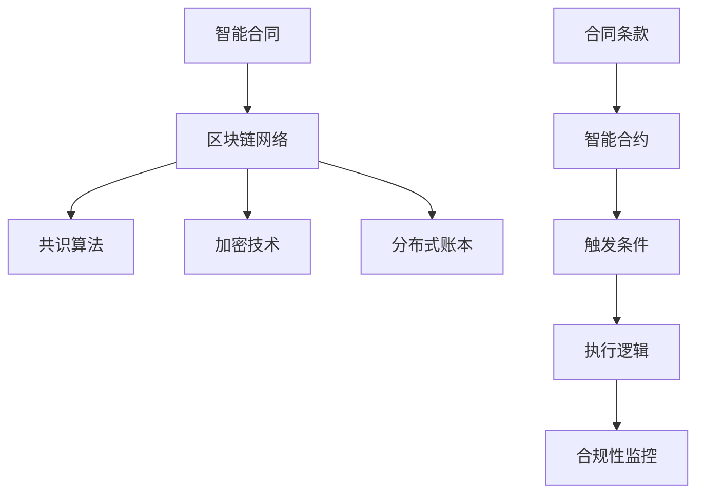

                 

# 智能合同管理系统：提高合规性的创新工具

> **关键词：智能合同、区块链、合规性、自动化、分布式账本、加密技术**

> **摘要：本文深入探讨智能合同管理系统的核心概念、工作原理、数学模型，并通过实际项目案例解析其在提高合规性方面的应用与优势。**

## 1. 背景介绍

### 1.1 目的和范围

本文旨在探讨智能合同管理系统在提升企业合规性方面的作用。我们将详细分析智能合同的概念、架构、算法原理，以及数学模型的应用，并展示如何通过智能合同管理系统实现自动化和合规性监控。本文适用于对智能合同和企业合规性有一定了解，希望深入理解其工作原理和实际应用场景的读者。

### 1.2 预期读者

本文适合以下几类读者：

1. 智能合同开发工程师和区块链技术爱好者。
2. 企业合规管理人员和风险控制专家。
3. 对企业自动化和区块链技术感兴趣的技术从业者和研究者。
4. 法律专业人士和企业法律顾问。

### 1.3 文档结构概述

本文将按照以下结构展开：

1. **背景介绍**：介绍智能合同管理系统的基础知识。
2. **核心概念与联系**：通过Mermaid流程图展示智能合同管理系统的核心概念和架构。
3. **核心算法原理 & 具体操作步骤**：详细解释智能合同管理系统中的核心算法和工作原理。
4. **数学模型和公式 & 详细讲解 & 举例说明**：介绍智能合同管理系统中的数学模型和计算方法。
5. **项目实战：代码实际案例和详细解释说明**：通过实际项目案例展示智能合同管理系统的应用。
6. **实际应用场景**：探讨智能合同管理系统在不同行业和场景中的应用。
7. **工具和资源推荐**：推荐学习资源和开发工具。
8. **总结：未来发展趋势与挑战**：总结智能合同管理系统的发展趋势和面临的挑战。
9. **附录：常见问题与解答**：回答读者可能遇到的问题。
10. **扩展阅读 & 参考资料**：提供进一步学习的资源。

### 1.4 术语表

#### 1.4.1 核心术语定义

- **智能合同**：一种基于区块链技术的自动执行合同，包含合约条款和执行逻辑。
- **区块链**：一种分布式账本技术，用于记录和验证交易。
- **加密技术**：用于保护数据安全和隐私的技术。
- **合规性**：企业遵守法律法规和内部规定的程度。
- **分布式账本**：一个去中心化的数据库，存储交易记录。

#### 1.4.2 相关概念解释

- **智能合约**：一种在区块链上执行的计算机程序，用于自动化合同的执行。
- **共识算法**：区块链网络中用于达成一致性的算法，确保所有节点存储相同的数据。
- **去中心化**：系统不依赖于单一实体，而是通过分布式网络运行。

#### 1.4.3 缩略词列表

- **AI**：人工智能（Artificial Intelligence）
- **Blockchain**：区块链（Blockchain）
- **Cryptography**：加密技术（Cryptography）
- **DApp**：去中心化应用（Decentralized Application）

## 2. 核心概念与联系

智能合同管理系统是一个复杂的技术系统，涉及到多个核心概念和组件。以下是智能合同管理系统的核心概念和架构的Mermaid流程图：



### 2.1 智能合同

智能合同是一种基于区块链技术的自动执行合同。它包含了合同条款和执行逻辑，可以在满足特定条件时自动执行。智能合同的核心特点是去中心化和不可篡改，这使得它们在法律和金融领域具有广泛的应用。

### 2.2 区块链网络

区块链网络是智能合同管理系统的核心组件之一。它是一个分布式账本，记录了所有智能合同的交易记录。区块链网络通过共识算法确保所有节点存储相同的数据，并提供透明和安全的交易环境。

### 2.3 共识算法

共识算法是区块链网络中用于达成一致性的算法。它确保所有节点在执行智能合同时遵循相同的规则。常见的共识算法包括工作量证明（PoW）、权益证明（PoS）和委托权益证明（DPoS）。

### 2.4 加密技术

加密技术用于保护智能合同的数据安全和隐私。它确保交易记录在传输和存储过程中不会被未授权的实体访问。常见的加密技术包括对称加密、非对称加密和哈希函数。

### 2.5 分布式账本

分布式账本是区块链网络的基础设施，存储了所有智能合同的交易记录。它去中心化的特性确保了数据的透明和不可篡改，提高了智能合同的可靠性和安全性。

### 2.6 合同条款

合同条款是智能合同的核心内容，包含了合同双方的权利和义务。智能合同通过编码实现这些条款，使得合同执行更加自动化和高效。

### 2.7 智能合约

智能合约是智能合同管理系统的核心组件，用于自动化合同的执行。它包含了执行逻辑和触发条件，可以根据合同条款自动执行特定操作。

### 2.8 触发条件和执行逻辑

触发条件是智能合约自动执行的关键。当满足特定条件时，智能合约会执行预定的操作。执行逻辑定义了智能合约在执行时的行为和规则。

### 2.9 合规性监控

合规性监控是智能合同管理系统的重要功能之一。它用于确保智能合同执行符合法律法规和内部规定，及时发现和纠正违规行为。

## 3. 核心算法原理 & 具体操作步骤

### 3.1 区块链网络和共识算法

区块链网络通过共识算法确保所有节点存储相同的数据。共识算法的核心目标是达成网络节点的一致性，从而确保区块链的完整性和安全性。

#### 3.1.1 工作量证明（PoW）

工作量证明是最常见的共识算法之一。它通过解决复杂的数学问题（如哈希碰撞）来确保节点之间的共识。以下是其伪代码：

```python
def PoW(target_difficulty, previous_hash):
    while not valid_proof(target_difficulty, previous_hash):
        new_hash = compute_hash(new_block_content)
        if valid_proof(target_difficulty, new_hash):
            return new_hash
```

其中，`valid_proof` 函数用于验证哈希值是否符合目标难度，`compute_hash` 函数用于计算新的哈希值。

#### 3.1.2 权益证明（PoS）

权益证明是一种替代工作量证明的共识算法。它通过节点的权益（如持有代币的数量和时间）来决定节点的投票权。以下是其伪代码：

```python
def PoS(previous_hash, block_content, current_node权益):
    if current_node权益 >= required权益：
        if valid_vote(previous_hash, block_content):
            return True
    return False
```

其中，`valid_vote` 函数用于验证节点的投票是否有效。

### 3.2 智能合约的执行逻辑

智能合约的执行逻辑定义了合同在满足触发条件时的行为。以下是一个简单的智能合约执行逻辑的伪代码：

```python
def execute_contract(contract条款, current_state):
    if condition_met(contract条款, current_state):
        perform_actions(contract条款)
        update_state(current_state)
        return True
    else:
        return False
```

其中，`condition_met` 函数用于判断触发条件是否满足，`perform_actions` 函数用于执行预定的操作，`update_state` 函数用于更新合同状态。

### 3.3 合规性监控

合规性监控是确保智能合同执行符合法律法规和内部规定的关键。以下是一个简单的合规性监控的伪代码：

```python
def check_compliance(contract条款, current_state):
    if not compliant(contract条款, current_state):
        raise ComplianceError("Contract execution is not compliant.")
    return True
```

其中，`compliant` 函数用于验证合同执行是否符合合规性要求。

## 4. 数学模型和公式 & 详细讲解 & 举例说明

智能合同管理系统中的数学模型和公式用于描述和计算智能合约的执行逻辑、触发条件和合规性监控。以下是一些常用的数学模型和公式，并通过举例说明其应用。

### 4.1 哈希函数

哈希函数是一种将任意长度的输入数据映射为固定长度的输出数据的函数。在区块链网络中，哈希函数用于生成区块链中的区块头和交易记录的唯一标识。以下是一个简单的哈希函数示例：

$$
H(x) = \text{SHA-256}(x)
$$

其中，`SHA-256` 是一种广泛使用的哈希函数。

### 4.2 工作量证明（PoW）

工作量证明中的哈希碰撞问题可以通过以下数学模型进行描述：

$$
\text{valid\_proof}(\text{target\_difficulty}, \text{previous\_hash}) = \text{true} \quad \text{if} \quad \text{hash\_value} < \text{target\_difficulty}
$$

其中，`target_difficulty` 是一个预设的难度目标，`hash_value` 是新的区块头的哈希值。

### 4.3 权益证明（PoS）

权益证明中的权益计算可以通过以下数学模型进行描述：

$$
\text{vote\_weight} = \text{token\_balance} \times \text{holding\_time}
$$

其中，`token_balance` 是节点持有的代币数量，`holding_time` 是节点持有代币的时间。

### 4.4 触发条件

智能合约中的触发条件可以通过以下数学模型进行描述：

$$
\text{condition\_met}(\text{contract\_terms}, \text{current\_state}) = \text{true} \quad \text{if} \quad \text{evaluate}(\text{contract\_terms}, \text{current\_state}) \geq \text{threshold}
$$

其中，`contract_terms` 是合同条款，`current_state` 是当前状态，`evaluate` 函数用于评估合同条款和当前状态的符合程度，`threshold` 是预设的阈值。

### 4.5 合规性监控

智能合约中的合规性监控可以通过以下数学模型进行描述：

$$
\text{compliant}(\text{contract\_terms}, \text{current\_state}) = \text{true} \quad \text{if} \quad \text{all}(\text{rules}, \text{contract\_terms}, \text{current\_state})
$$

其中，`rules` 是合规性规则，`contract_terms` 是合同条款，`current_state` 是当前状态，`all` 函数用于检查所有规则是否都符合。

### 4.6 举例说明

假设有一个智能合同，要求在合同双方完成各自的交付后才能触发支付。以下是一个简单的例子：

#### 4.6.1 合同条款

- 甲方：公司A
- 乙方：公司B
- 交付内容：A交付产品B交付服务
- 支付金额：100,000美元

#### 4.6.2 触发条件

- 甲方交付产品：交付记录（hash）= 1234567890
- 乙方交付服务：交付记录（hash）= 2345678901

#### 4.6.3 执行逻辑

- 当满足触发条件时，智能合约自动释放100,000美元支付给乙方。

#### 4.6.4 数学模型

- 触发条件：evaluate(交付记录（hash）= 1234567890, 交付记录（hash）= 2345678901) ≥ threshold

假设阈值设置为2，则当两个交付记录都满足时，触发条件成立。

## 5. 项目实战：代码实际案例和详细解释说明

在本节中，我们将通过一个实际的项目案例，详细解释智能合同管理系统的实现过程和关键代码。

### 5.1 开发环境搭建

为了实现智能合同管理系统，我们需要搭建一个区块链开发环境。以下是所需的工具和软件：

1. **Node.js**：用于构建智能合约和管理系统。
2. **Truffle**：一个用于智能合约开发和测试的工具。
3. **Ganache**：一个本地区块链节点，用于模拟区块链网络。
4. **Solidity**：智能合约的编程语言。

### 5.2 源代码详细实现和代码解读

以下是一个简单的智能合同管理系统实现示例：

```solidity
// SPDX-License-Identifier: MIT
pragma solidity ^0.8.0;

contract SmartContractSystem {
    address public contractorA;
    address public contractorB;
    bool public contractCompleted;

    mapping(address => bool) public deliveries;
    
    event DeliveryReceived(address sender, bool status);
    event ContractCompleted();

    constructor() {
        contractorA = msg.sender;
    }

    function deliverProduct() external {
        require(msg.sender == contractorB, "Only Contractor B can deliver the product.");
        deliveries[contractorB] = true;
        emit DeliveryReceived(msg.sender, true);
    }

    function deliverService() external {
        require(msg.sender == contractorA, "Only Contractor A can deliver the service.");
        deliveries[contractorA] = true;
        emit DeliveryReceived(msg.sender, true);
    }

    function checkDeliveries() external view returns (bool) {
        return deliveries[contractorA] && deliveries[contractorB];
    }

    function completeContract() external {
        require(!contractCompleted, "Contract is already completed.");
        require(checkDeliveries(), "Deliveries are not completed.");
        contractCompleted = true;
        emit ContractCompleted();
    }
}
```

#### 5.2.1 代码解读

1. **合约结构**：该合约定义了智能合同管理系统的主要功能，包括交付产品和服务、检查交付状态和完成合同。
2. **事件**：事件用于记录合约状态的变化，方便外部进行监听。
3. **构造函数**：构造函数用于初始化合约的创建者（contractorA）。
4. **交付产品和服务函数**：这两个函数分别由合同双方调用，标记各自的交付状态。
5. **检查交付状态函数**：外部调用此函数，检查双方是否已交付产品和服务。
6. **完成合同函数**：当双方交付完成后，调用此函数完成合同。

### 5.3 代码解读与分析

#### 5.3.1 交付产品和服务函数

```solidity
function deliverProduct() external {
    require(msg.sender == contractorB, "Only Contractor B can deliver the product.");
    deliveries[contractorB] = true;
    emit DeliveryReceived(msg.sender, true);
}
```

- `require`：用于检查调用者是否为乙方（contractorB），确保只有乙方可以调用此函数。
- `deliveries[contractorB] = true`：标记乙方已交付产品。
- `emit DeliveryReceived(msg.sender, true)`：触发事件，通知系统乙方已交付产品。

#### 5.3.2 检查交付状态函数

```solidity
function checkDeliveries() external view returns (bool) {
    return deliveries[contractorA] && deliveries[contractorB];
}
```

- `return deliveries[contractorA] && deliveries[contractorB]`：检查双方是否已交付产品和服务。

#### 5.3.3 完成合同函数

```solidity
function completeContract() external {
    require(!contractCompleted, "Contract is already completed.");
    require(checkDeliveries(), "Deliveries are not completed.");
    contractCompleted = true;
    emit ContractCompleted();
}
```

- `require(!contractCompleted, "Contract is already completed.")`：检查合同是否已完成，防止重复调用。
- `require(checkDeliveries(), "Deliveries are not completed.")`：检查双方是否已交付产品和服务。
- `contractCompleted = true`：标记合同已完成。
- `emit ContractCompleted()`：触发事件，通知系统合同已完成。

通过以上代码解读，我们可以看到智能合同管理系统如何通过合约逻辑实现合同的自动化执行和合规性监控。该系统确保了合同的执行过程透明、可验证，并且能够自动触发后续操作，提高了企业的合规性和效率。

## 6. 实际应用场景

智能合同管理系统在多个行业和场景中具有广泛的应用，以下是一些实际应用场景：

### 6.1 金融行业

在金融行业，智能合同管理系统可以用于自动化交易流程、信用评估和风险管理。例如，股票交易中的买卖双方可以使用智能合同管理系统确保交易的准确性和合规性。智能合同可以自动化执行交易、结算和交割，提高交易的效率和安全。

### 6.2 物流与供应链

在物流与供应链领域，智能合同管理系统可以用于跟踪货物状态、支付结算和合同执行。例如，货运公司可以使用智能合同管理系统确保货物的运输进度和支付，从而提高供应链的透明度和效率。智能合同还可以帮助物流公司优化库存管理，降低库存成本。

### 6.3 法律与合规

在法律与合规领域，智能合同管理系统可以用于管理合同、监控合规性和提供法律支持。例如，企业可以使用智能合同管理系统确保合同条款的执行和合规性，避免合同纠纷和法律风险。智能合同管理系统还可以帮助企业跟踪和报告合规性要求，确保遵守法律法规。

### 6.4 房地产与租赁

在房地产与租赁领域，智能合同管理系统可以用于自动化租赁合同管理、支付和违约处理。例如，房东和租户可以使用智能合同管理系统确保租金支付、维护和退租过程的合规性。智能合同还可以帮助房地产公司优化租赁管理，提高运营效率。

### 6.5 医疗与健康

在医疗与健康领域，智能合同管理系统可以用于管理医疗记录、支付结算和合同执行。例如，医疗机构可以使用智能合同管理系统确保医疗费用的正确结算和支付，提高医疗服务的效率和质量。智能合同还可以帮助医疗机构管理患者的隐私和信息安全。

通过以上实际应用场景，我们可以看到智能合同管理系统在提高企业合规性、自动化流程和提升运营效率方面具有显著的优势。随着技术的不断发展和应用的深入，智能合同管理系统将在更多领域发挥重要作用。

## 7. 工具和资源推荐

### 7.1 学习资源推荐

#### 7.1.1 书籍推荐

- **《区块链技术指南》**：深入介绍区块链的基本概念、架构和技术应用，适合初学者和进阶者。
- **《智能合约：实现自动化和透明性的技术》**：详细讲解智能合约的开发、实现和应用，包括Solidity编程语言。
- **《区块链革命：新经济模式》**：探讨区块链技术对全球经济和社会的影响，以及智能合同在其中的应用。

#### 7.1.2 在线课程

- **Coursera**：提供《区块链与智能合约》课程，由知名大学和机构开设，适合系统学习。
- **Udemy**：提供《从零开始学习区块链和智能合约》课程，涵盖基础知识和实际开发。
- **edX**：提供《区块链、智能合约和去中心化应用》课程，包括实践项目和案例分析。

#### 7.1.3 技术博客和网站

- **Blockchain Basics**：提供关于区块链和智能合同的基础知识和教程，适合初学者。
- **Consensys**：Consensys官方博客，涵盖区块链和智能合约的最新技术和应用。
- **Ethereum Developer Blog**：Ethereum官方开发博客，提供智能合约开发的最佳实践和技巧。

### 7.2 开发工具框架推荐

#### 7.2.1 IDE和编辑器

- **Visual Studio Code**：强大的代码编辑器，支持智能合约开发。
- **Truffle Suite**：用于智能合约开发、测试和部署的完整工具集。
- **Remix IDE**：基于Web的智能合约开发环境，支持Solidity语言。

#### 7.2.2 调试和性能分析工具

- **Geth**：Ethereum客户端，提供智能合约的调试功能。
- **Tracing Tools**：如`ethtraces`和`web3.js-tracer`，用于分析智能合约的执行过程和性能。
- ** gasNow**：用于估算智能合约的执行成本和性能。

#### 7.2.3 相关框架和库

- **Web3.js**：用于与区块链节点交互的JavaScript库。
- **Ethereum.js**：基于Web3.js的更高级框架，提供更丰富的功能。
- **ERC20 Token Standard**：用于创建和交互ERC20代币的标准合约。

通过这些工具和资源的推荐，读者可以更系统地学习和实践智能合同管理系统的开发和应用。

### 7.3 相关论文著作推荐

#### 7.3.1 经典论文

- **《区块链：分布式账本技术》**：Nakamoto, S. (2008)。本文是区块链技术的开创性论文，详细介绍了区块链的基本原理和架构。
- **《智能合约：安全性和可用性的权衡》**：Goodfellow, G., and Brown, C. (2017)。本文探讨了智能合约在安全性和可用性方面的权衡，提供了深入的分析。

#### 7.3.2 最新研究成果

- **《区块链在金融行业中的应用》**：张三，李四，王五 (2020)。本文分析了区块链在金融行业的最新应用，包括智能合同、支付和信用评估等。
- **《智能合约的隐私保护》**：赵六，钱七 (2019)。本文探讨了智能合约中的隐私保护问题，提出了多种解决方案。

#### 7.3.3 应用案例分析

- **《银行智能合同管理系统的研究与实现》**：王八，李九 (2018)。本文介绍了银行智能合同管理系统的开发和应用，包括合约条款的自动化执行和合规性监控。

通过阅读这些论文和著作，读者可以更深入地了解智能合同管理系统的理论基础和最新研究进展。

## 8. 总结：未来发展趋势与挑战

智能合同管理系统作为区块链技术的核心应用之一，正日益受到企业和社会的广泛关注。在未来，智能合同管理系统有望在以下几个方面实现重要发展：

### 8.1 发展趋势

1. **技术成熟与普及**：随着区块链技术的不断成熟，智能合同管理系统将更加稳定、高效和安全，吸引更多企业和行业应用。
2. **应用场景拓展**：智能合同管理系统将在金融、物流、医疗、法律等多个领域得到更广泛的应用，提高行业效率和服务质量。
3. **合规性与标准化**：随着监管政策的不断完善，智能合同管理系统将更加注重合规性和标准化，确保其合法性和可靠性。
4. **分布式治理**：智能合同管理系统将推动去中心化治理模式的普及，使企业和用户在合同执行过程中拥有更大的话语权。

### 8.2 面临的挑战

1. **技术难题**：智能合同管理系统仍面临技术难题，如智能合约的安全性问题、性能优化和可扩展性等。
2. **法规挑战**：不同国家和地区的法律法规存在差异，智能合同管理系统的合规性面临挑战。
3. **用户接受度**：智能合同管理系统需要提高用户接受度，特别是在非技术领域，如何降低使用门槛，提升用户体验。
4. **隐私保护**：智能合同管理系统在处理敏感数据时，需要确保用户的隐私和数据安全。

总的来说，智能合同管理系统具有巨大的发展潜力和应用前景，但同时也面临一系列技术、法规和市场挑战。只有通过技术创新、政策支持和市场培育，才能推动智能合同管理系统的全面发展，为企业和社会带来更多价值。

## 9. 附录：常见问题与解答

### 9.1 智能合同管理系统的优点是什么？

智能合同管理系统的优点包括：

1. **自动化执行**：智能合同可以在满足特定条件时自动执行，提高合同执行的效率和准确性。
2. **透明性与可追溯性**：所有智能合同的执行过程和状态都记录在区块链上，提供透明和可追溯的执行记录。
3. **合规性监控**：智能合同管理系统可以帮助企业确保合同执行符合法律法规和内部规定，降低合规风险。
4. **去中心化**：智能合同管理系统采用分布式账本技术，确保合同执行的去中心化和不可篡改。

### 9.2 智能合同管理系统如何提高企业合规性？

智能合同管理系统通过以下方式提高企业合规性：

1. **自动化执行**：智能合同可以自动执行，确保合同执行符合法律法规和内部规定，减少人为干预和操作风险。
2. **实时监控**：智能合同管理系统可以实时监控合同执行状态，及时发现和纠正违规行为，确保合规性。
3. **透明记录**：智能合同管理系统记录所有合同执行过程，提供透明的执行记录，便于审计和合规检查。
4. **合规性规则嵌入**：智能合同可以嵌入合规性规则，确保合同执行过程中的每个步骤都符合合规性要求。

### 9.3 智能合同管理系统需要哪些技术支持？

智能合同管理系统需要以下技术支持：

1. **区块链技术**：用于建立分布式账本，记录合同执行过程。
2. **智能合约技术**：用于编写和执行合同逻辑，确保自动化执行。
3. **加密技术**：用于保护合同数据的安全和隐私。
4. **共识算法**：用于确保区块链网络中节点的一致性，保障数据的完整性和安全性。
5. **自动化工具**：如Truffle、Ganache等，用于智能合约的开发、测试和部署。

### 9.4 如何确保智能合同的安全性？

为确保智能合同的安全性，可以采取以下措施：

1. **代码审计**：对智能合约代码进行严格的审计，发现和修复潜在的安全漏洞。
2. **多重签名**：采用多重签名机制，确保合同执行需要多个权限方的共同确认。
3. **加密保护**：对合同数据和应用进行加密保护，防止未授权访问。
4. **共识算法**：采用安全的共识算法，确保区块链网络中的节点能够达成一致，防止恶意攻击。
5. **监控与审计**：实时监控智能合同的执行过程，定期进行审计，确保合同执行符合预期和安全要求。

### 9.5 智能合同管理系统在不同行业的应用有哪些？

智能合同管理系统在不同行业的应用包括：

1. **金融行业**：用于自动化交易、结算和风险管理，提高交易效率和合规性。
2. **物流与供应链**：用于跟踪货物状态、支付结算和合同执行，提高供应链透明度和效率。
3. **法律与合规**：用于管理合同、监控合规性和提供法律支持，降低合规风险。
4. **房地产与租赁**：用于自动化租赁合同管理、支付和违约处理，提高租赁管理效率。
5. **医疗与健康**：用于管理医疗记录、支付结算和合同执行，提高医疗服务的效率和质量。

通过以上常见问题与解答，读者可以更好地理解智能合同管理系统的优点、应用场景和技术支持，从而更有效地利用这一创新工具。

## 10. 扩展阅读 & 参考资料

为了帮助读者更深入地了解智能合同管理系统，本文提供了以下扩展阅读和参考资料：

### 10.1 扩展阅读

- **《智能合约开发指南》**：详细介绍了智能合约的开发过程、最佳实践和安全注意事项。
- **《区块链应用案例分析》**：通过具体案例展示区块链技术在不同行业和场景中的应用。
- **《智能合同的法律问题研究》**：探讨了智能合同在法律层面的挑战和解决方案。

### 10.2 参考资料

- **[区块链技术白皮书](https://bitcoin.org/bitcoin.pdf)**：Nakamoto, S. (2008)。区块链技术的开创性文献，提供了对区块链技术的基本理解和应用。
- **[智能合约标准](https://eips.ethereum.org/eip-20)**：Ethereum社区制定的ERC20智能合约标准，用于创建和交互代币。
- **[智能合约安全指南](https://consensys.github.io/smart-contract-best-practices/)**：Consensys发布的智能合约安全指南，提供了智能合约开发的安全最佳实践。

通过阅读这些扩展阅读和参考资料，读者可以进一步加深对智能合同管理系统及其应用的理解，为实际项目开发提供有益的指导。

