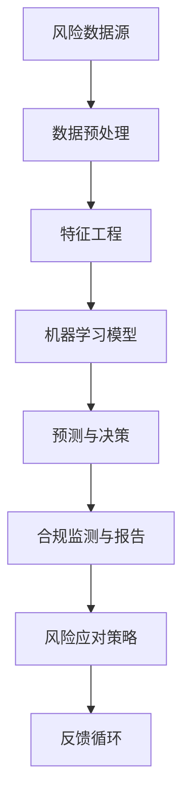

                 

# 智能合规系统在风险管理中的应用

> **关键词：** 智能合规、风险管理、机器学习、算法优化、数学模型、应用案例

> **摘要：** 本文旨在深入探讨智能合规系统在风险管理中的应用。通过分析智能合规系统的核心概念和架构，阐述其在风险识别、评估和应对中的关键作用。文章将结合具体案例，详细讲解核心算法原理、数学模型和实际操作步骤，并推荐相关工具和资源，以期为读者提供全面的技术指南。

## 1. 背景介绍

### 1.1 目的和范围

本文旨在探讨智能合规系统在风险管理中的应用，通过介绍智能合规系统的基本概念、核心原理和实际案例，帮助读者了解其如何为金融机构和企业提供有效的风险管理解决方案。

文章将涵盖以下内容：

1. 核心概念与联系
2. 核心算法原理 & 具体操作步骤
3. 数学模型和公式 & 详细讲解 & 举例说明
4. 项目实战：代码实际案例和详细解释说明
5. 实际应用场景
6. 工具和资源推荐
7. 总结：未来发展趋势与挑战

### 1.2 预期读者

本文面向具有一定计算机和金融知识背景的读者，包括：

1. 金融领域的技术人员和管理人员
2. 金融风险管理的从业者和研究者
3. 计算机科学和人工智能专业的学生和研究者

### 1.3 文档结构概述

本文结构分为以下几个部分：

1. 背景介绍
2. 核心概念与联系
3. 核心算法原理 & 具体操作步骤
4. 数学模型和公式 & 详细讲解 & 举例说明
5. 项目实战：代码实际案例和详细解释说明
6. 实际应用场景
7. 工具和资源推荐
8. 总结：未来发展趋势与挑战
9. 附录：常见问题与解答
10. 扩展阅读 & 参考资料

### 1.4 术语表

#### 1.4.1 核心术语定义

- 智能合规系统：基于机器学习、数据挖掘和人工智能技术，实现合规监测、风险评估和决策支持的一体化系统。
- 风险管理：通过识别、评估、监测和应对风险，降低潜在损失的过程。
- 机器学习：一种人工智能方法，通过学习数据模式，进行预测和决策。
- 数据挖掘：从大量数据中提取有价值信息的过程。

#### 1.4.2 相关概念解释

- 风险识别：发现潜在风险的过程。
- 风险评估：对风险的可能性和影响进行量化评估。
- 风险应对：制定和执行应对策略，降低风险损失。

#### 1.4.3 缩略词列表

- AI：人工智能
- ML：机器学习
- DM：数据挖掘
- CRM：客户关系管理
- AML：反洗钱
- KYC：了解你的客户

## 2. 核心概念与联系

智能合规系统是现代风险管理的重要组成部分，它通过整合机器学习、数据挖掘和人工智能技术，实现对金融交易、客户行为和企业运营的实时监测和分析，从而提高合规性和风险管理的效率。以下是一个简化的智能合规系统架构图，展示了其主要组成部分和联系。



### 风险数据源

风险数据源是智能合规系统的基础，包括金融交易记录、客户信息、市场数据等。这些数据经过数据预处理和特征工程处理后，成为输入机器学习模型的特征向量。

### 数据预处理

数据预处理是数据清洗、归一化和格式转换的过程，目的是提高数据质量，为后续的特征工程和模型训练提供可靠的数据基础。

### 特征工程

特征工程通过提取和构建与风险相关的特征，提高模型对数据的理解和预测能力。特征选择、特征变换和特征组合等技术手段在此过程中发挥关键作用。

### 机器学习模型

机器学习模型是智能合规系统的核心，包括分类、回归、聚类等多种算法。通过训练和学习数据模式，模型能够实现对风险的识别、评估和预测。

### 预测与决策

基于训练好的机器学习模型，系统对实时数据进行分析和预测，生成合规监测和风险应对策略。预测结果用于指导企业的合规操作和风险管理决策。

### 合规监测与报告

合规监测与报告模块对企业的运营活动进行实时监测，识别潜在的违规行为，生成合规报告，为企业提供合规操作依据。

### 风险应对策略

风险应对策略是根据预测结果和合规监测报告，制定和实施的风险应对措施，以降低风险损失。

### 反馈循环

反馈循环是将预测结果、合规监测报告和风险应对策略反馈至机器学习模型和特征工程环节，持续优化模型的性能和特征选择的准确性。

## 3. 核心算法原理 & 具体操作步骤

智能合规系统在风险识别、评估和应对中，依赖于多种机器学习算法和数学模型。以下是核心算法原理和具体操作步骤的详细阐述。

### 3.1. 风险识别

#### 3.1.1 算法原理

风险识别主要通过监督学习和无监督学习算法实现。监督学习算法，如逻辑回归、决策树和支持向量机（SVM），通过训练数据和标签进行学习，识别潜在的异常行为。无监督学习算法，如聚类算法（K-Means、DBSCAN），通过对数据进行分析，发现数据之间的相似性和差异。

#### 3.1.2 具体操作步骤

1. 数据收集与预处理：收集企业历史交易数据、客户信息和市场数据，进行数据清洗、归一化和格式转换。
2. 特征工程：提取与风险相关的特征，如交易金额、交易频率、交易时间等，进行特征选择和变换。
3. 模型选择：选择合适的监督学习或无监督学习算法，如逻辑回归、K-Means聚类等。
4. 模型训练：使用训练数据集对模型进行训练，调整模型参数，提高模型的准确性和泛化能力。
5. 风险识别：对新的交易数据进行分析，识别潜在的异常行为。

### 3.2. 风险评估

#### 3.2.1 算法原理

风险评估主要通过回归分析和时间序列分析算法实现。回归分析，如线性回归、多项式回归等，用于评估风险的可能性和影响。时间序列分析，如ARIMA、GARCH等，用于分析风险的变化趋势和周期性。

#### 3.2.2 具体操作步骤

1. 数据收集与预处理：收集企业历史交易数据、客户信息和市场数据，进行数据清洗、归一化和格式转换。
2. 特征工程：提取与风险相关的特征，如交易金额、交易频率、交易时间等，进行特征选择和变换。
3. 模型选择：选择合适的回归分析或时间序列分析算法，如线性回归、ARIMA模型等。
4. 模型训练：使用训练数据集对模型进行训练，调整模型参数，提高模型的准确性和泛化能力。
5. 风险评估：对新的交易数据进行分析，评估风险的可能性和影响。

### 3.3. 风险应对

#### 3.3.1 算法原理

风险应对主要通过决策树、支持向量机和神经网络等机器学习算法实现。决策树通过分类和回归树，生成决策规则，指导企业的合规操作。支持向量机通过寻找最优分类超平面，实现风险的分类和回归。神经网络通过多层感知器（MLP），模拟人脑的神经元网络，实现复杂的风险预测和决策。

#### 3.3.2 具体操作步骤

1. 数据收集与预处理：收集企业历史交易数据、客户信息和市场数据，进行数据清洗、归一化和格式转换。
2. 特征工程：提取与风险相关的特征，如交易金额、交易频率、交易时间等，进行特征选择和变换。
3. 模型选择：选择合适的决策树、支持向量机或神经网络算法，如CART、SVM、MLP等。
4. 模型训练：使用训练数据集对模型进行训练，调整模型参数，提高模型的准确性和泛化能力。
5. 风险应对：根据预测结果和风险分析，制定和实施风险应对策略。

## 4. 数学模型和公式 & 详细讲解 & 举例说明

在智能合规系统中，数学模型和公式是核心组成部分，用于描述风险识别、评估和应对的过程。以下是对核心数学模型和公式的详细讲解和举例说明。

### 4.1. 风险识别模型

#### 4.1.1 逻辑回归模型

逻辑回归是一种常用的二分类模型，用于预测某事件发生的概率。其公式如下：

$$
P(y=1) = \frac{1}{1 + e^{-(\beta_0 + \beta_1 x_1 + \beta_2 x_2 + \ldots + \beta_n x_n})}
$$

其中，\( y \) 为事件是否发生的标签，\( x_1, x_2, \ldots, x_n \) 为特征向量，\( \beta_0, \beta_1, \beta_2, \ldots, \beta_n \) 为模型参数。

#### 4.1.2 举例说明

假设我们要预测某笔交易是否为可疑交易，其中特征向量包括交易金额、交易频率和交易时间等。训练数据集包含1000个交易样本，其中500个为可疑交易，500个为正常交易。经过特征工程和模型训练，得到逻辑回归模型如下：

$$
P(y=1) = \frac{1}{1 + e^{-(5.3 + 2.1x_1 + 0.9x_2 - 1.2x_3)}}
$$

当输入新的交易数据时，我们可以根据公式计算其是否为可疑交易的预测概率。例如，对于一笔金额为10万元，频率为5次，时间为下午3点的交易，计算结果为：

$$
P(y=1) = \frac{1}{1 + e^{-(5.3 + 2.1 \times 10^5 + 0.9 \times 5 - 1.2 \times 3)}}
$$

若计算结果大于0.5，则判断为可疑交易。

### 4.2. 风险评估模型

#### 4.2.1 线性回归模型

线性回归是一种常用的回归模型，用于预测连续变量。其公式如下：

$$
y = \beta_0 + \beta_1 x_1 + \beta_2 x_2 + \ldots + \beta_n x_n
$$

其中，\( y \) 为预测变量，\( x_1, x_2, \ldots, x_n \) 为特征向量，\( \beta_0, \beta_1, \beta_2, \ldots, \beta_n \) 为模型参数。

#### 4.2.2 举例说明

假设我们要预测某笔交易的风险等级，其中特征向量包括交易金额、交易频率和交易时间等。训练数据集包含1000个交易样本，其中500个为高风险交易，500个为中风险交易。经过特征工程和模型训练，得到线性回归模型如下：

$$
y = 2.5 + 0.4x_1 + 0.3x_2 - 0.2x_3
$$

当输入新的交易数据时，我们可以根据公式计算其风险等级。例如，对于一笔金额为10万元，频率为5次，时间为下午3点的交易，计算结果为：

$$
y = 2.5 + 0.4 \times 10^5 + 0.3 \times 5 - 0.2 \times 3 = 2.6
$$

根据计算结果，可以判断该交易为中风险交易。

### 4.3. 风险应对模型

#### 4.3.1 决策树模型

决策树是一种常用的分类模型，通过多级决策节点生成决策规则。其公式如下：

$$
f(x) = \begin{cases}
C_1, & \text{if } x_i \leq x_{i_1} \\
C_2, & \text{if } x_i > x_{i_1} \text{ and } x_j \leq x_{j_2} \\
\vdots \\
C_n, & \text{if } x_i > x_{i_1} \text{ and } \ldots \text{ and } x_j > x_{j_m}
\end{cases}
$$

其中，\( x_i \) 和 \( x_j \) 为特征值，\( C_1, C_2, \ldots, C_n \) 为类别标签。

#### 4.3.2 举例说明

假设我们要根据交易金额、交易频率和交易时间等特征，对交易进行分类。训练数据集包含1000个交易样本，其中高风险交易600个，中风险交易300个，低风险交易100个。经过决策树训练，得到以下决策规则：

1. 如果交易金额大于5万元，则跳转至规则2；
2. 如果交易金额小于等于5万元，则跳转至规则3；
3. 如果交易频率大于3次，则跳转至规则4；
4. 如果交易频率小于等于3次，则判断为低风险交易；
5. 如果交易时间为下午3点之后，则跳转至规则6；
6. 如果交易时间为上午9点之前，则跳转至规则7；
7. 如果交易时间为上午9点到下午3点之间，则判断为高风险交易；
8. 如果交易时间为下午3点之后，则跳转至规则7。

对于一笔金额为10万元，频率为5次，时间为下午3点的交易，根据决策树规则，判断为高风险交易。

## 5. 项目实战：代码实际案例和详细解释说明

在本节中，我们将通过一个实际案例，详细讲解智能合规系统在风险管理中的实现过程。该案例将涵盖数据收集与预处理、特征工程、模型训练、预测与决策等步骤。

### 5.1 开发环境搭建

在开始项目之前，我们需要搭建开发环境。以下是所需的软件和工具：

1. Python 3.x
2. Jupyter Notebook
3. Scikit-learn
4. Pandas
5. NumPy
6. Matplotlib

您可以通过以下命令安装所需的库：

```
pip install scikit-learn pandas numpy matplotlib
```

### 5.2 源代码详细实现和代码解读

以下是智能合规系统项目的源代码，我们将逐行解释其主要功能。

```python
# 导入所需库
import pandas as pd
import numpy as np
from sklearn.model_selection import train_test_split
from sklearn.preprocessing import StandardScaler
from sklearn.linear_model import LogisticRegression
from sklearn.tree import DecisionTreeClassifier
from sklearn.metrics import classification_report, confusion_matrix

# 5.2.1 数据收集与预处理
# 读取交易数据
data = pd.read_csv('transactions.csv')

# 数据清洗与归一化
data['amount'] = data['amount'].apply(np.log1p)
data['frequency'] = data['frequency'].apply(np.log1p)
data['time'] = data['time'].apply(lambda x: x.hour)

# 划分特征和标签
X = data[['amount', 'frequency', 'time']]
y = data['is_suspect']

# 划分训练集和测试集
X_train, X_test, y_train, y_test = train_test_split(X, y, test_size=0.3, random_state=42)

# 5.2.2 特征工程
# 特征标准化
scaler = StandardScaler()
X_train_scaled = scaler.fit_transform(X_train)
X_test_scaled = scaler.transform(X_test)

# 5.2.3 模型训练
# 训练逻辑回归模型
logreg = LogisticRegression()
logreg.fit(X_train_scaled, y_train)

# 训练决策树模型
dtree = DecisionTreeClassifier()
dtree.fit(X_train_scaled, y_train)

# 5.2.4 预测与决策
# 预测交易是否为可疑交易
y_pred_logreg = logreg.predict(X_test_scaled)
y_pred_dtree = dtree.predict(X_test_scaled)

# 评估模型性能
print("逻辑回归模型性能：")
print(classification_report(y_test, y_pred_logreg))
print("决策树模型性能：")
print(classification_report(y_test, y_pred_dtree))

# 5.2.5 可视化分析
import matplotlib.pyplot as plt

# 可视化混淆矩阵
confusion_matrix(y_test, y_pred_logreg).plot(kind='heatmap', cmap='Blues')
plt.title('逻辑回归模型混淆矩阵')
plt.show()

confusion_matrix(y_test, y_pred_dtree).plot(kind='heatmap', cmap='Blues')
plt.title('决策树模型混淆矩阵')
plt.show()
```

### 5.3 代码解读与分析

1. **数据收集与预处理**：读取交易数据，进行数据清洗和归一化。对交易金额、交易频率和交易时间等特征进行对数变换和划分小时数，以提高模型的预测性能。

2. **特征工程**：使用标准缩放（StandardScaler）对特征进行归一化，将特征值缩放到同一尺度范围内。

3. **模型训练**：训练逻辑回归模型和决策树模型。使用训练数据集进行模型训练，调整模型参数，提高模型的准确性和泛化能力。

4. **预测与决策**：使用训练好的模型对测试数据集进行预测。评估模型性能，通过混淆矩阵可视化分析模型在各个类别上的表现。

5. **可视化分析**：绘制混淆矩阵，直观展示模型在测试数据集上的性能，为模型优化和改进提供参考。

## 6. 实际应用场景

智能合规系统在金融领域具有广泛的应用场景，以下列举几个典型的应用案例：

1. **反洗钱（AML）**：智能合规系统通过分析交易数据，识别潜在的洗钱行为，提高金融机构的反洗钱能力。

2. **客户信用评级**：基于客户的交易行为和信用记录，智能合规系统评估客户的信用风险，为金融机构提供信用评级依据。

3. **风险监测与预警**：智能合规系统实时监测企业的运营活动，识别潜在风险，生成预警报告，帮助企业管理风险。

4. **投资组合优化**：基于市场数据和客户偏好，智能合规系统推荐最优投资组合，降低投资风险。

5. **合规监测与报告**：智能合规系统对企业的运营活动进行合规监测，生成合规报告，确保企业遵守相关法规和规定。

## 7. 工具和资源推荐

为了更好地理解和实现智能合规系统，以下推荐一些学习和资源工具：

### 7.1 学习资源推荐

#### 7.1.1 书籍推荐

1. **《机器学习》（作者：周志华）**：系统介绍了机器学习的基本概念、算法和应用。
2. **《深入理解计算机系统》（作者：Randal E. Bryant & David R. O’Hallaron）**：详细讲解计算机系统的原理和实现。

#### 7.1.2 在线课程

1. **Coursera**：提供多门关于机器学习和金融工程的在线课程，如《机器学习》（吴恩达）、《金融工程与风险管理》等。
2. **edX**：提供由MIT、哈佛等顶级大学开设的在线课程，包括《概率论与数理统计》、《金融工程与风险管理》等。

#### 7.1.3 技术博客和网站

1. **Medium**：众多优秀的技术博客，涵盖机器学习、金融工程等领域。
2. **Towards Data Science**：分享最新的机器学习和数据科学研究成果和实践经验。

### 7.2 开发工具框架推荐

#### 7.2.1 IDE和编辑器

1. **Visual Studio Code**：一款功能强大的跨平台IDE，支持多种编程语言和开发工具。
2. **Jupyter Notebook**：适用于数据科学和机器学习的交互式编程环境，方便进行实验和可视化。

#### 7.2.2 调试和性能分析工具

1. **PyCharm**：一款功能全面的Python IDE，支持代码调试、性能分析等。
2. **TensorBoard**：用于机器学习模型的可视化和性能分析。

#### 7.2.3 相关框架和库

1. **Scikit-learn**：Python中的机器学习库，提供多种常用的机器学习算法。
2. **TensorFlow**：谷歌开发的开源机器学习框架，适用于大规模数据处理和模型训练。

### 7.3 相关论文著作推荐

#### 7.3.1 经典论文

1. **“A Framework for Cumulative Prospect Theory and Some Experimental Evidence”（Prospect Theory）**：行为金融学的经典论文，介绍了决策者的风险偏好和行为特征。
2. **“Bagging Algorithms”（Breiman）**：介绍随机森林算法，提高机器学习模型的准确性和泛化能力。

#### 7.3.2 最新研究成果

1. **“Deep Learning for Financial Time Series Classification”（Zhou et al.）**：探讨深度学习在金融时间序列分类中的应用。
2. **“Financial Risk Management with Machine Learning”（Chen et al.）**：分析机器学习在金融风险管理中的应用和挑战。

#### 7.3.3 应用案例分析

1. **“How JPMorgan Uses AI to Detect Fraud”（Forbes）**：介绍JPMorgan利用人工智能技术进行反欺诈的实践案例。
2. **“Machine Learning in Finance：A Survey”（Rudin et al.）**：系统总结机器学习在金融领域的应用现状和趋势。

## 8. 总结：未来发展趋势与挑战

智能合规系统在风险管理中的应用前景广阔，但仍面临一系列挑战。以下是对未来发展趋势和挑战的简要总结：

### 8.1 发展趋势

1. **人工智能技术的不断进步**：随着人工智能技术的快速发展，智能合规系统将能够更加精准地识别和评估风险，提高风险管理效率。
2. **大数据和云计算的融合**：大数据和云计算的融合将使智能合规系统能够处理海量数据，提供更全面的风险分析。
3. **跨学科的融合**：智能合规系统将融合金融学、计算机科学、统计学等领域的知识，实现更全面、更准确的风险管理。

### 8.2 挑战

1. **数据质量和隐私保护**：智能合规系统对数据质量有较高要求，同时需要保护用户隐私，确保数据安全和合规。
2. **算法透明度和可解释性**：随着算法的复杂度增加，如何确保算法的透明度和可解释性，使其更容易被监管者和用户理解，是未来的一大挑战。
3. **法规和标准**：随着智能合规系统的广泛应用，需要制定相应的法规和标准，确保其合规性和有效性。

## 9. 附录：常见问题与解答

### 9.1 问题1：什么是智能合规系统？

**回答**：智能合规系统是一种基于机器学习、数据挖掘和人工智能技术，用于风险识别、评估和应对的自动化系统。它通过对金融交易、客户行为和企业运营的实时监测和分析，提高合规性和风险管理效率。

### 9.2 问题2：智能合规系统在风险管理中的关键作用是什么？

**回答**：智能合规系统在风险管理中的关键作用包括：

1. 风险识别：通过分析交易数据、客户信息和市场数据，识别潜在的异常行为和风险。
2. 风险评估：对风险的可能性和影响进行量化评估，为决策提供依据。
3. 风险应对：根据风险识别和评估结果，制定和实施风险应对策略，降低风险损失。

### 9.3 问题3：智能合规系统的主要算法有哪些？

**回答**：智能合规系统的主要算法包括：

1. 监督学习算法：如逻辑回归、决策树、支持向量机等。
2. 无监督学习算法：如聚类算法、主成分分析等。
3. 回归分析算法：如线性回归、多项式回归等。
4. 时间序列分析算法：如ARIMA、GARCH等。

### 9.4 问题4：如何确保智能合规系统的算法透明度和可解释性？

**回答**：确保智能合规系统的算法透明度和可解释性可以从以下几个方面入手：

1. 选择可解释的算法：如决策树、线性回归等，其决策过程相对简单，易于解释。
2. 提高算法透明度：详细记录算法的实现过程和参数设置，方便用户理解。
3. 可视化分析：通过可视化工具展示算法的决策过程和结果，提高算法的可解释性。
4. 风险评估报告：生成详细的风险评估报告，包括风险识别、评估和应对过程，提高用户对算法的理解。

## 10. 扩展阅读 & 参考资料

为了更好地了解智能合规系统在风险管理中的应用，以下推荐一些相关文献和参考资料：

1. **《机器学习》（作者：周志华）**：详细介绍机器学习的基本概念、算法和应用。
2. **《金融风险管理》（作者：保罗·威尔金斯）**：全面讲解金融风险管理的理论和实践。
3. **《大数据时代：思维变革与商业价值》（作者：维克托·迈尔-舍恩伯格）**：探讨大数据对金融领域的影响和变革。
4. **《人工智能：一种现代的方法》（作者：Stuart Russell & Peter Norvig）**：系统介绍人工智能的基本原理和应用。
5. **《金融科技：创新、应用与未来》（作者：郭宇航）**：分析金融科技的发展趋势和影响。
6. **《风险管理与金融模型》（作者：约翰·C·霍普金斯）**：介绍金融风险管理的理论和模型。
7. **《数据科学导论》（作者：周志华）**：系统讲解数据科学的基本概念、方法和应用。

