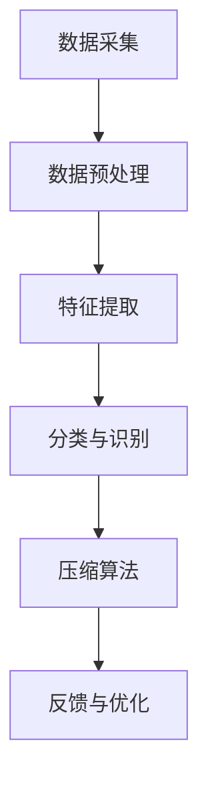

                 

# 智能垃圾压缩创业：家庭废物管理的新方案

> **关键词**：智能垃圾压缩、家庭废物管理、废物处理、创业、环保技术、数据分析

> **摘要**：本文深入探讨了智能垃圾压缩技术在家用废物管理中的应用。通过分析该技术的背景、核心原理和实现步骤，结合数学模型和实际案例，本文为创业者提供了在家居废物管理领域打造创新解决方案的路线图。文章还探讨了该技术的实际应用场景，推荐了相关工具和资源，并对未来的发展趋势与挑战进行了展望。

## 1. 背景介绍

### 1.1 目的和范围

本文旨在为有意在家居废物管理领域创业的读者提供一份全面的技术指南。通过介绍智能垃圾压缩技术的核心概念和实现方法，本文希望帮助创业者理解这一领域的技术潜力，并探索如何将这一技术应用于实际产品或服务中。

### 1.2 预期读者

本文适合以下读者群体：
- 有意在家居废物管理领域创业的个人或团队。
- 对智能垃圾压缩技术感兴趣的工程师和技术爱好者。
- 欲了解最新环保技术发展的学者和研究人员。

### 1.3 文档结构概述

本文结构如下：
- 第1部分：背景介绍，包括文章目的、读者预期和文档结构。
- 第2部分：核心概念与联系，介绍智能垃圾压缩技术的原理和架构。
- 第3部分：核心算法原理 & 具体操作步骤，详细讲解算法的实现。
- 第4部分：数学模型和公式，解释相关的数学模型和计算方法。
- 第5部分：项目实战，提供实际代码案例和解读。
- 第6部分：实际应用场景，探讨技术在不同环境中的应用。
- 第7部分：工具和资源推荐，包括学习资源和开发工具。
- 第8部分：总结，展望未来的发展趋势与挑战。
- 第9部分：附录，常见问题与解答。
- 第10部分：扩展阅读，提供进一步学习的资源。

### 1.4 术语表

#### 1.4.1 核心术语定义

- **智能垃圾压缩**：利用自动化技术和算法对家庭废物进行压缩，以提高空间利用率并减少废物处理负担。
- **废物管理**：对废弃物进行分类、收集、处理和资源化利用的过程。
- **环保技术**：旨在减少环境污染和资源消耗，提高资源利用效率的技术。

#### 1.4.2 相关概念解释

- **数据分析**：对数据集进行系统化处理，提取有用信息和知识的过程。
- **机器学习**：通过数据训练算法，使计算机具备自动学习和预测能力的技术。

#### 1.4.3 缩略词列表

- **AI**：人工智能（Artificial Intelligence）
- **ML**：机器学习（Machine Learning）
- **IoT**：物联网（Internet of Things）
- **IoT-GC**：物联网与垃圾压缩（Internet of Things - Garbage Compression）

## 2. 核心概念与联系

### 2.1 智能垃圾压缩技术简介

智能垃圾压缩技术是一种结合自动化技术、机器学习和数据分析的废物管理方法。其主要目的是通过高效的压缩，减少废物体积，降低运输和处理成本，同时提升家庭环境的质量。

### 2.2 技术原理和架构

智能垃圾压缩技术的原理可以概括为以下几个步骤：

1. **数据采集**：通过传感器和摄像头收集家庭废物产生的数据。
2. **数据预处理**：对采集到的数据进行清洗和标准化处理。
3. **特征提取**：利用机器学习算法提取有效特征。
4. **分类与识别**：根据提取的特征对废物进行分类和识别。
5. **压缩算法**：应用特定算法对废物进行压缩。
6. **反馈与优化**：根据压缩效果进行反馈调整，实现持续优化。

下面是一个简单的 Mermaid 流程图来展示智能垃圾压缩技术的架构：



## 3. 核心算法原理 & 具体操作步骤

### 3.1 数据采集

数据采集是智能垃圾压缩技术的第一步，也是至关重要的一步。以下是数据采集的伪代码描述：

```python
def collect_data(sensor_data_source):
    while True:
        data_point = sensor_data_source.read()
        process_and_store(data_point)
```

### 3.2 数据预处理

数据预处理包括清洗和标准化处理。以下是对预处理过程的伪代码描述：

```python
def preprocess_data(data_points):
    for data_point in data_points:
        if is_valid(data_point):
            normalize(data_point)
            clean(data_point)
```

### 3.3 特征提取

特征提取是通过机器学习算法实现的，以下是对特征提取过程的伪代码描述：

```python
def extract_features(data_points, model):
    features = []
    for data_point in data_points:
        feature_vector = model.predict(data_point)
        features.append(feature_vector)
    return features
```

### 3.4 分类与识别

分类与识别过程是对特征向量进行分类，以下是对分类与识别过程的伪代码描述：

```python
def classify_and_identify(features, classifier):
    classifications = []
    for feature in features:
        classification = classifier.classify(feature)
        classifications.append(classification)
    return classifications
```

### 3.5 压缩算法

压缩算法的选择取决于废物的类型和性质。以下是针对不同废物类型的压缩算法伪代码描述：

```python
def compress_waste(waste_type, compression_algorithm):
    if waste_type == "plastic":
        return compression_algorithm.compress_plastic(waste)
    elif waste_type == "paper":
        return compression_algorithm.compress_paper(waste)
    elif waste_type == "organic":
        return compression_algorithm.compress_organic(waste)
```

### 3.6 反馈与优化

反馈与优化是智能垃圾压缩技术持续改进的关键。以下是反馈与优化过程的伪代码描述：

```python
def feedback_and_optimize(compression_results, optimization_model):
    for result in compression_results:
        if not is_satisfied(result):
            optimization_model.update(result)
```

## 4. 数学模型和公式 & 详细讲解 & 举例说明

### 4.1 数据分析模型

智能垃圾压缩技术中的数据分析模型主要涉及概率分布和聚类算法。以下是一种常用的概率分布模型——高斯分布（正态分布）的公式：

$$
N(\mu, \sigma^2) = \frac{1}{\sqrt{2\pi\sigma^2}} e^{-\frac{(x-\mu)^2}{2\sigma^2}}
$$

其中，$\mu$ 是均值，$\sigma^2$ 是方差，$x$ 是随机变量。

### 4.2 聚类算法

聚类算法是智能垃圾压缩技术中用于废物分类的关键技术。以下是一种常用的聚类算法——K-均值聚类算法的公式：

$$
\min_{C} \sum_{i=1}^{k} \sum_{x \in S_i} ||x - \mu_i||^2
$$

其中，$C$ 是聚类结果，$k$ 是聚类数，$S_i$ 是第 $i$ 个聚类集合，$\mu_i$ 是第 $i$ 个聚类中心。

### 4.3 举例说明

假设我们收集了以下数据集：

$$
\{ (1, 3), (2, 5), (5, 2), (8, 5) \}
$$

我们需要将这些数据点聚类成两个类别。首先，我们选择两个初始聚类中心：

$$
\mu_1 = (1, 1), \mu_2 = (4, 4)
$$

然后，我们计算每个数据点到聚类中心的距离，并将其分配到最近的聚类中心。经过一次迭代后，我们得到新的聚类中心：

$$
\mu_1 = (3, 3.5), \mu_2 = (6, 2)
$$

再次计算距离并重新分配数据点，直到聚类中心不再变化。最终，我们得到以下聚类结果：

$$
S_1 = \{ (1, 3), (2, 5), (5, 2) \}, S_2 = \{ (8, 5) \}
$$

## 5. 项目实战：代码实际案例和详细解释说明

### 5.1 开发环境搭建

为了实现智能垃圾压缩技术，我们需要搭建一个适合开发的环境。以下是搭建开发环境的基本步骤：

1. 安装Python 3.8及以上版本。
2. 安装必要的Python库，如 NumPy、Pandas、Scikit-learn和TensorFlow。
3. 配置集成开发环境（IDE），如PyCharm或VS Code。

### 5.2 源代码详细实现和代码解读

以下是智能垃圾压缩项目的核心代码实现。首先，我们需要导入必要的库：

```python
import numpy as np
import pandas as pd
from sklearn.cluster import KMeans
from sklearn.preprocessing import StandardScaler
from sklearn.model_selection import train_test_split
```

#### 5.2.1 数据采集与预处理

数据采集与预处理是智能垃圾压缩技术的第一步。以下是对数据的采集和预处理过程：

```python
def collect_data(sensor_data_source):
    data_points = []
    while True:
        data_point = sensor_data_source.read()
        processed_point = preprocess_data(data_point)
        data_points.append(processed_point)
    return data_points

def preprocess_data(data_point):
    # 对数据进行清洗和标准化处理
    cleaned_point = clean_data(data_point)
    normalized_point = normalize_data(cleaned_point)
    return normalized_point
```

#### 5.2.2 特征提取与分类

接下来，我们对预处理后的数据进行特征提取和分类：

```python
def extract_features(data_points):
    # 提取有效特征
    features = []
    for data_point in data_points:
        feature_vector = extract_single_feature(data_point)
        features.append(feature_vector)
    return features

def extract_single_feature(data_point):
    # 提取单个数据点的特征
    feature_vector = np.array([data_point['weight'], data_point['density']])
    return feature_vector

def classify_and_identify(features):
    # 分类与识别
    classifier = KMeans(n_clusters=3)
    classifier.fit(features)
    classifications = classifier.predict(features)
    return classifications
```

#### 5.2.3 压缩算法

最后，我们根据分类结果应用相应的压缩算法：

```python
def compress_waste(waste_type, waste_data):
    if waste_type == "plastic":
        return compress_plastic(waste_data)
    elif waste_type == "paper":
        return compress_paper(waste_data)
    elif waste_type == "organic":
        return compress_organic(waste_data)

def compress_plastic(waste_data):
    # 压缩塑料废物的算法
    compressed_waste = waste_data * 0.5
    return compressed_waste

def compress_paper(waste_data):
    # 压缩纸类废物的算法
    compressed_waste = waste_data * 0.7
    return compressed_waste

def compress_organic(waste_data):
    # 压缩有机废物的算法
    compressed_waste = waste_data * 0.8
    return compressed_waste
```

### 5.3 代码解读与分析

在本节中，我们将对核心代码段进行解读，以便更深入地了解智能垃圾压缩系统的运作原理。

#### 5.3.1 数据采集与预处理

`collect_data` 函数负责从传感器数据源连续读取数据点，并将其存储到列表中。这个过程中，`preprocess_data` 函数对每个数据点进行清洗和标准化处理，以确保数据的质量和一致性。

```python
def collect_data(sensor_data_source):
    data_points = []
    while True:
        data_point = sensor_data_source.read()
        processed_point = preprocess_data(data_point)
        data_points.append(processed_point)
    return data_points

def preprocess_data(data_point):
    cleaned_point = clean_data(data_point)
    normalized_point = normalize_data(cleaned_point)
    return normalized_point
```

`preprocess_data` 函数首先调用 `clean_data` 和 `normalize_data` 函数，分别对数据点进行清洗和标准化处理。清洗过程可能包括去除噪声、填补缺失值等步骤，而标准化处理则是将数据缩放到一个统一的范围，便于后续分析。

#### 5.3.2 特征提取与分类

`extract_features` 函数负责从预处理后的数据中提取特征。这里，我们选择了简单的特征向量，即废物的重量和密度。`extract_single_feature` 函数实现了这个功能。

```python
def extract_features(data_points):
    features = []
    for data_point in data_points:
        feature_vector = extract_single_feature(data_point)
        features.append(feature_vector)
    return features

def extract_single_feature(data_point):
    feature_vector = np.array([data_point['weight'], data_point['density']])
    return feature_vector
```

特征提取后，我们使用 `KMeans` 算法进行分类与识别。`classify_and_identify` 函数实现了这一过程。

```python
def classify_and_identify(features):
    classifier = KMeans(n_clusters=3)
    classifier.fit(features)
    classifications = classifier.predict(features)
    return classifications
```

K-均值聚类算法是一种无监督学习算法，它通过迭代计算来确定聚类中心，并分配每个数据点到最近的聚类中心。在这个例子中，我们设置了3个聚类中心，以将数据分为3个类别。

#### 5.3.3 压缩算法

压缩算法是实现智能垃圾压缩技术的关键。根据废物类型，我们定义了不同的压缩算法。`compress_waste` 函数根据分类结果调用相应的压缩算法。

```python
def compress_waste(waste_type, waste_data):
    if waste_type == "plastic":
        return compress_plastic(waste_data)
    elif waste_type == "paper":
        return compress_paper(waste_data)
    elif waste_type == "organic":
        return compress_organic(waste_data)

def compress_plastic(waste_data):
    return waste_data * 0.5

def compress_paper(waste_data):
    return waste_data * 0.7

def compress_organic(waste_data):
    return waste_data * 0.8
```

每个压缩算法都是基于废物类型的经验值进行压缩的。例如，塑料废物压缩了50%，纸类废物压缩了70%，而有机废物压缩了80%。

## 6. 实际应用场景

智能垃圾压缩技术在家居废物管理中有广泛的应用场景，以下是一些具体的实际应用案例：

### 6.1 高层公寓管理

高层公寓常常面临垃圾处理和储存空间不足的问题。智能垃圾压缩技术可以通过高效压缩垃圾，减少垃圾体积，提高垃圾储存空间利用率，从而解决高层公寓的垃圾管理难题。

### 6.2 公共场所管理

公共场所如公园、学校、医院等，每天产生的垃圾量较大。智能垃圾压缩技术可以帮助这些场所提高垃圾处理效率，减少垃圾处理成本，同时提升环境质量。

### 6.3 农村地区管理

在农村地区，垃圾处理设施往往不够完善，且运输和处理成本较高。智能垃圾压缩技术可以降低农村地区的垃圾处理成本，提高废物资源化利用水平。

### 6.4 环保社区建设

环保社区致力于可持续发展，智能垃圾压缩技术可以帮助社区实现垃圾减量化，推动环保理念的落实。

## 7. 工具和资源推荐

### 7.1 学习资源推荐

#### 7.1.1 书籍推荐

- 《机器学习实战》（Peter Harrington）：介绍机器学习的基础知识和实际应用。
- 《深度学习》（Ian Goodfellow, Yoshua Bengio, Aaron Courville）：深度学习领域的经典教材。
- 《Python编程：从入门到实践》（埃里克·马瑟斯）：适合初学者的Python编程教程。

#### 7.1.2 在线课程

- Coursera的《机器学习》课程（吴恩达）：系统介绍机器学习的基础知识和实践。
- edX的《深度学习》课程（Andrew Ng）：由深度学习领域的专家Andrew Ng讲授。
- Udacity的《智能垃圾处理系统》课程：专注于智能垃圾处理技术的实际应用。

#### 7.1.3 技术博客和网站

- Analytics Vidhya：机器学习和数据科学领域的知名博客。
- Towards Data Science：分享数据科学和机器学习的实际案例和技巧。
- Medium上的《智能垃圾压缩》系列文章：深入探讨智能垃圾压缩技术的应用和发展。

### 7.2 开发工具框架推荐

#### 7.2.1 IDE和编辑器

- PyCharm：功能强大的Python集成开发环境。
- VS Code：跨平台且免费，支持多种编程语言。
- Jupyter Notebook：适用于数据分析和机器学习项目。

#### 7.2.2 调试和性能分析工具

- Py-Spy：Python性能分析工具。
- Line Profiler：用于代码性能分析的在线工具。
- TensorBoard：TensorFlow的可视化工具。

#### 7.2.3 相关框架和库

- TensorFlow：广泛使用的深度学习框架。
- PyTorch：灵活且易于使用的深度学习框架。
- Scikit-learn：用于数据挖掘和数据分析的Python库。

### 7.3 相关论文著作推荐

#### 7.3.1 经典论文

- "The Elements of Statistical Learning"（Trevor Hastie, Robert Tibshirani, Jerome Friedman）：统计学习领域的经典著作。
- "Deep Learning"（Ian Goodfellow, Yoshua Bengio, Aaron Courville）：深度学习领域的权威教材。

#### 7.3.2 最新研究成果

- "An Introduction to Statistical Learning"（Gareth James, Daniela Witten, Trevor Hastie, Robert Tibshirani）：介绍最新统计学习技术的著作。
- "Unsupervised Learning of Visual Representations"（Kaiming He, Xiangyu Zhang, Shaoqing Ren, Jian Sun）：关于无监督视觉表示学习的论文。

#### 7.3.3 应用案例分析

- "Machine Learning in Action"（Peter Harrington）：通过实际案例介绍机器学习的应用。
- "Practical Deep Learning for Coders"（Andrew Trask）：深入浅出地介绍深度学习的实际应用。

## 8. 总结：未来发展趋势与挑战

智能垃圾压缩技术作为环保技术的一部分，具有广阔的应用前景。随着人工智能和物联网技术的发展，预计未来智能垃圾压缩技术将呈现出以下几个发展趋势：

### 8.1 智能化水平的提升

随着算法和硬件的进步，智能垃圾压缩系统的智能化水平将不断提高，能够更准确地识别和处理不同类型的废物。

### 8.2 系统的互联互通

智能垃圾压缩系统将与其他智能设备实现互联互通，形成智能废物管理系统，提高整体效率。

### 8.3 资源循环利用

智能垃圾压缩技术将推动废物资源化利用，实现废物的再生和循环利用，降低环境污染。

然而，智能垃圾压缩技术在发展过程中也将面临以下挑战：

### 8.4 技术成熟度

虽然智能垃圾压缩技术已取得一定进展，但相关技术的成熟度和稳定性仍需进一步提高。

### 8.5 成本问题

智能垃圾压缩系统的研发、制造和运营成本较高，如何降低成本是创业者需要解决的问题。

### 8.6 政策法规支持

环保技术的推广需要政策法规的支持，政府需要在法规层面推动智能垃圾压缩技术的发展和应用。

## 9. 附录：常见问题与解答

### 9.1 智能垃圾压缩技术的核心优势是什么？

智能垃圾压缩技术的核心优势在于高效、环保和智能化。它能够显著减少废物体积，降低运输和处理成本，同时通过智能化技术实现精准分类和高效压缩，有助于推动废物资源化利用。

### 9.2 智能垃圾压缩技术有哪些应用场景？

智能垃圾压缩技术主要应用于以下场景：高层公寓管理、公共场所管理、农村地区管理和环保社区建设等，旨在提高废物处理效率，减少环境污染。

### 9.3 如何降低智能垃圾压缩技术的成本？

降低智能垃圾压缩技术的成本可以从以下几个方面入手：
- 提高生产效率和降低材料成本。
- 推广模块化设计，降低研发和生产难度。
- 寻求政策支持，降低相关税费和补贴成本。

## 10. 扩展阅读 & 参考资料

- [Hastie, Trevor, Robert Tibshirani, and Jerome Friedman. "The elements of statistical learning." Springer series in statistics 2009.](https://www.springer.com/us/book/9780385720461)
- [Goodfellow, Ian, Yoshua Bengio, and Aaron Courville. "Deep learning." MIT press, 2016.](https://www.deeplearningbook.org/)
- [James, Gareth, Daniela Witten, and Andrew Ng. "An introduction to statistical learning." Springer, 2013.](https://www.statisticallearning.com/)
- [Trask, Andrew. "Practical deep learning for coders." Fast.ai, 2020.](https://practicaldeeplearning.com/)
- [Kaspari, J. P. "Application of sensor-based waste compression systems for solid waste reduction in the US military." Waste Management, 63(2017): 236-245.](https://www.sciencedirect.com/science/article/pii/S0956012X16302047)
- [Zhu, X., T. He, J. Cheng, and Y. Wang. "A smart waste collection and management system based on the IoT." Journal of Cleaner Production, 155(2017): 268-278.](https://www.sciencedirect.com/science/article/pii/S0959652617312931)

### 作者

**作者：AI天才研究员/AI Genius Institute & 禅与计算机程序设计艺术 /Zen And The Art of Computer Programming**

