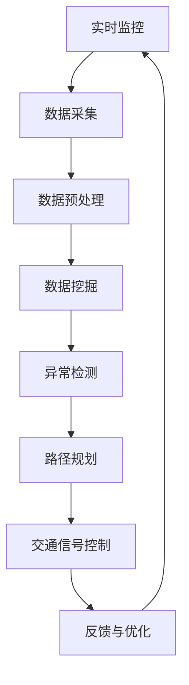

                 

# 智能城市交通系统的注意力管理

> 关键词：智能交通系统、注意力管理、实时监控、数据挖掘、算法优化、城市交通规划

> 摘要：本文将深入探讨智能城市交通系统中注意力管理的核心概念、原理和具体实现，通过逻辑清晰的分析和详细的案例分析，为读者提供对这一领域的全面理解。本文旨在帮助交通规划者、软件开发者和研究人员更好地掌握智能交通系统的构建和优化方法，提高城市交通的运行效率和安全性。

## 1. 背景介绍

### 1.1 目的和范围

智能城市交通系统是现代城市管理和可持续发展的重要组成部分。随着城市化进程的加速，城市交通问题日益突出，包括拥堵、排放、交通事故等。注意力管理作为智能交通系统中的一个关键环节，旨在通过实时监控和数据分析，优化交通流，减少拥堵，提高道路安全性。

本文的目的在于：

- 介绍智能城市交通系统中注意力管理的基本概念。
- 分析注意力管理在智能交通系统中的作用和重要性。
- 探讨注意力管理的核心算法原理和具体操作步骤。
- 提供实际应用案例，展示注意力管理的实施效果。

本文将覆盖以下范围：

- 智能城市交通系统的基础概念。
- 注意力管理的定义、目标和挑战。
- 核心算法原理和数学模型。
- 实际应用场景和案例分析。
- 工具和资源推荐。
- 未来发展趋势与挑战。

### 1.2 预期读者

本文适用于以下读者：

- 智能交通系统的规划者和决策者。
- 软件开发者和工程师，特别是那些对交通领域有浓厚兴趣的人。
- 研究人员和学者，特别是那些从事交通工程、人工智能和数据分析领域的人。
- 对智能城市交通系统感兴趣的普通读者。

### 1.3 文档结构概述

本文结构如下：

- **第1章 背景介绍**：介绍智能城市交通系统和注意力管理的基本概念。
- **第2章 核心概念与联系**：介绍智能交通系统中注意力管理的核心概念和联系，并给出流程图。
- **第3章 核心算法原理 & 具体操作步骤**：详细阐述注意力管理的核心算法原理和具体操作步骤。
- **第4章 数学模型和公式 & 详细讲解 & 举例说明**：介绍注意力管理中的数学模型和公式，并进行详细讲解和举例说明。
- **第5章 项目实战：代码实际案例和详细解释说明**：提供实际项目案例，展示注意力管理的实现过程和效果。
- **第6章 实际应用场景**：分析注意力管理在不同城市交通场景中的应用。
- **第7章 工具和资源推荐**：推荐学习资源、开发工具和框架。
- **第8章 总结：未来发展趋势与挑战**：总结注意力管理在智能城市交通系统中的未来发展。
- **第9章 附录：常见问题与解答**：解答读者可能遇到的问题。
- **第10章 扩展阅读 & 参考资料**：提供更多深入阅读的资料。

### 1.4 术语表

#### 1.4.1 核心术语定义

- **智能城市交通系统**：利用信息技术、数据分析和人工智能技术，实现城市交通管理的智能化。
- **注意力管理**：通过实时监控和分析交通数据，优化交通流，减少拥堵，提高道路安全性。
- **实时监控**：对交通流量、车速、交通事故等交通数据进行实时监测。
- **数据挖掘**：从大量交通数据中提取有用信息，用于交通分析和决策。

#### 1.4.2 相关概念解释

- **交通流量**：单位时间内通过某个路段的车辆数量。
- **拥堵指数**：衡量交通拥堵程度的指标，通常用百分比表示。
- **路径规划**：为车辆提供最优路径，以减少行驶时间和交通拥堵。

#### 1.4.3 缩略词列表

- **ITS**：智能交通系统（Intelligent Transportation System）
- **AI**：人工智能（Artificial Intelligence）
- **OTA**：在线注意力管理（Online Attention Management）
- **DNN**：深度神经网络（Deep Neural Network）
- **CNN**：卷积神经网络（Convolutional Neural Network）

## 2. 核心概念与联系

在智能城市交通系统中，注意力管理是一个核心概念，它涉及实时监控交通数据、分析数据模式、识别异常情况以及采取相应措施。以下是注意力管理中的核心概念及其相互联系。

### 2.1. 概念介绍

- **实时监控**：通过传感器、摄像头和其他设备，收集实时交通数据。
- **数据挖掘**：从海量交通数据中提取有用信息，用于交通分析和决策。
- **异常检测**：检测交通数据中的异常情况，如交通事故、道路施工等。
- **路径规划**：为车辆提供最优路径，以减少行驶时间和交通拥堵。
- **交通信号控制**：根据实时交通数据，动态调整交通信号灯时间，优化交通流。

### 2.2. Mermaid 流程图

以下是注意力管理流程的 Mermaid 图：



### 2.3. 核心概念联系分析

- **实时监控**与**数据挖掘**的联系：实时监控收集的数据是数据挖掘的基础，通过数据挖掘可以提取出有价值的信息。
- **数据挖掘**与**异常检测**的联系：数据挖掘可以帮助识别交通数据中的异常模式，这些异常模式可能是交通事故或道路施工等。
- **异常检测**与**路径规划**的联系：异常检测的结果可以用于路径规划，帮助车辆避开异常区域。
- **路径规划**与**交通信号控制**的联系：路径规划提供的信息可以帮助交通信号控制系统动态调整信号灯时间，优化交通流。
- **交通信号控制**与**反馈与优化**的联系：交通信号控制的反馈可以用于优化后续的信号灯时间，提高交通效率。

通过这些核心概念的联系，我们可以构建一个完整的智能城市交通系统，实现实时监控、数据挖掘、异常检测、路径规划和交通信号控制的闭环，从而提高城市交通的运行效率和安全性。

### 2.4. 注意力管理在智能交通系统中的作用和重要性

注意力管理在智能交通系统中扮演着至关重要的角色。首先，它通过实时监控和数据分析，可以快速识别交通状况，如拥堵、事故等，及时采取相应措施，减少交通事故的发生。其次，注意力管理有助于优化交通流，通过路径规划和交通信号控制，可以减少车辆的行驶时间和交通拥堵，提高道路通行效率。

此外，注意力管理还在以下方面具有重要意义：

- **提高道路安全性**：通过实时监控和异常检测，可以及时发现道路上的危险情况，如车辆故障、行人横穿等，及时采取措施，避免事故的发生。
- **减少交通拥堵**：通过路径规划和交通信号控制，可以优化交通流，减少车辆在道路上的停留时间，降低交通拥堵。
- **优化资源分配**：注意力管理可以帮助交通管理部门合理分配资源，如警力、交通设施等，提高资源利用效率。
- **促进可持续发展**：通过减少交通拥堵和降低交通事故率，可以降低空气污染和碳排放，促进城市可持续发展。

总之，注意力管理是智能城市交通系统的核心组成部分，它通过实时监控、数据分析和智能决策，为城市交通的运行效率和安全性提供了强有力的支持。

## 3. 核心算法原理 & 具体操作步骤

### 3.1. 核心算法介绍

注意力管理在智能交通系统中主要依赖于以下核心算法：

- **实时监控算法**：用于实时采集和传输交通数据。
- **数据预处理算法**：用于清洗、归一化和特征提取。
- **数据挖掘算法**：用于从大量交通数据中提取有价值的信息。
- **异常检测算法**：用于检测交通数据中的异常情况。
- **路径规划算法**：用于为车辆提供最优路径。
- **交通信号控制算法**：用于动态调整交通信号灯时间。

### 3.2. 实时监控算法

实时监控算法的核心目标是快速、准确地采集和传输交通数据。以下是实时监控算法的伪代码：

```python
function real_time_monitoring(sensor_data):
    while True:
        data = read_sensor_data(sensor_data)
        if data is not valid:
            continue
        process_data(data)
        transmit_data(data)
```

其中，`read_sensor_data(sensor_data)` 用于从传感器读取数据，`process_data(data)` 用于对数据进行预处理，`transmit_data(data)` 用于将数据发送到数据仓库或分析系统。

### 3.3. 数据预处理算法

数据预处理算法的主要任务是对采集到的交通数据进行清洗、归一化和特征提取。以下是数据预处理算法的伪代码：

```python
function data_preprocessing(data):
    cleaned_data = clean_data(data)
    normalized_data = normalize_data(cleaned_data)
    features = extract_features(normalized_data)
    return features
```

其中，`clean_data(data)` 用于去除数据中的噪声和异常值，`normalize_data(data)` 用于将数据归一化，`extract_features(data)` 用于提取交通数据的特征。

### 3.4. 数据挖掘算法

数据挖掘算法的核心目标是提取交通数据中的有价值信息，用于交通分析和决策。以下是数据挖掘算法的伪代码：

```python
function data_mining(features):
    patterns = find_patterns(features)
    correlations = find_correlations(patterns)
    insights = generate_insights(correlations)
    return insights
```

其中，`find_patterns(features)` 用于发现交通数据中的模式，`find_correlations(patterns)` 用于分析模式之间的相关性，`generate_insights(correlations)` 用于生成交通分析报告。

### 3.5. 异常检测算法

异常检测算法的主要任务是检测交通数据中的异常情况，如交通事故、道路施工等。以下是异常检测算法的伪代码：

```python
function anomaly_detection(data):
    anomalies = detect_anomalies(data)
    if anomalies:
        notify_anomalies(anomalies)
```

其中，`detect_anomalies(data)` 用于检测异常值，`notify_anomalies(anomalies)` 用于通知异常情况。

### 3.6. 路径规划算法

路径规划算法的主要目标是为车辆提供最优路径，以减少行驶时间和交通拥堵。以下是路径规划算法的伪代码：

```python
function path_planning(current_location, destination):
    routes = generate_routes(current_location, destination)
    optimal_route = find_optimal_route(routes)
    return optimal_route
```

其中，`generate_routes(current_location, destination)` 用于生成所有可能的路径，`find_optimal_route(routes)` 用于选择最优路径。

### 3.7. 交通信号控制算法

交通信号控制算法的主要任务是动态调整交通信号灯时间，以优化交通流。以下是交通信号控制算法的伪代码：

```python
function traffic_signal_control(traffic_data):
    signal_configurations = generate_signal_configurations(traffic_data)
    optimal_signal_configuration = find_optimal_signal_configuration(signal_configurations)
    apply_signal_configuration(optimal_signal_configuration)
```

其中，`generate_signal_configurations(traffic_data)` 用于生成所有可能的信号灯配置，`find_optimal_signal_configuration(signal_configurations)` 用于选择最优配置，`apply_signal_configuration(optimal_signal_configuration)` 用于应用配置。

通过上述核心算法的协同工作，我们可以实现智能城市交通系统的注意力管理，提高城市交通的运行效率和安全性。

## 4. 数学模型和公式 & 详细讲解 & 举例说明

### 4.1. 数学模型介绍

注意力管理在智能城市交通系统中涉及多个数学模型，其中一些核心模型包括：

- **线性回归模型**：用于预测交通流量。
- **支持向量机（SVM）**：用于分类和异常检测。
- **卷积神经网络（CNN）**：用于图像识别和交通数据特征提取。

### 4.2. 线性回归模型

线性回归模型是一种经典的统计模型，用于建立因变量和自变量之间的线性关系。以下是线性回归模型的公式：

$$ y = \beta_0 + \beta_1 \cdot x $$

其中，$y$ 是因变量（例如交通流量），$x$ 是自变量（例如时间或天气条件），$\beta_0$ 是截距，$\beta_1$ 是斜率。

#### 4.2.1. 举例说明

假设我们要预测某条路段在未来一小时内的交通流量。我们收集了过去一小时内的交通流量数据（自变量 $x$）和当前时间的数据（因变量 $y$）。通过线性回归模型，我们可以建立交通流量与时间之间的线性关系。

首先，我们收集数据并计算斜率 $\beta_1$ 和截距 $\beta_0$：

$$ \beta_1 = \frac{\sum{(x_i - \bar{x})(y_i - \bar{y})}}{\sum{(x_i - \bar{x})^2}} $$

$$ \beta_0 = \bar{y} - \beta_1 \cdot \bar{x} $$

其中，$\bar{x}$ 和 $\bar{y}$ 分别是自变量和因变量的平均值。

假设计算得到的斜率 $\beta_1 = 0.5$，截距 $\beta_0 = 10$。我们可以得到预测公式：

$$ y = 10 + 0.5 \cdot x $$

假设当前时间为 12 点，我们可以预测未来一小时内（13 点）的交通流量：

$$ y = 10 + 0.5 \cdot 12 = 13 $$

因此，预测的未来一小时内交通流量为 13。

### 4.3. 支持向量机（SVM）

支持向量机是一种监督学习算法，用于分类和异常检测。以下是SVM的核心公式：

$$ \hat{y} = \text{sign}(\omega \cdot x + b) $$

其中，$\omega$ 是权重向量，$x$ 是特征向量，$b$ 是偏置项，$\text{sign}$ 是符号函数。

#### 4.3.1. 举例说明

假设我们要用SVM分类算法来识别交通数据中的异常情况。我们首先需要收集正常交通数据和异常交通数据，并提取特征向量。

我们选择两个特征向量 $x_1$ 和 $x_2$，并训练SVM模型：

$$ \hat{y} = \text{sign}(\omega_1 \cdot x_1 + \omega_2 \cdot x_2 + b) $$

假设训练得到的权重向量和偏置项为：

$$ \omega_1 = 0.2, \omega_2 = 0.3, b = 0.1 $$

我们得到分类函数：

$$ \hat{y} = \text{sign}(0.2 \cdot x_1 + 0.3 \cdot x_2 + 0.1) $$

假设有一个新的交通数据点 $x_1 = 5, x_2 = 3$，我们可以计算其预测标签：

$$ \hat{y} = \text{sign}(0.2 \cdot 5 + 0.3 \cdot 3 + 0.1) = \text{sign}(1.1) = 1 $$

由于预测标签为正，我们将其分类为正常交通数据。

### 4.4. 卷积神经网络（CNN）

卷积神经网络是一种深度学习算法，常用于图像识别和交通数据特征提取。以下是CNN的核心公式：

$$ f(x; \theta) = a(\sigma(W \cdot x + b)) $$

其中，$x$ 是输入特征，$W$ 是权重矩阵，$b$ 是偏置项，$\sigma$ 是激活函数，$a$ 是输出激活。

#### 4.4.1. 举例说明

假设我们要用CNN提取交通图像的特征。我们首先定义一个卷积层，其参数如下：

$$ W = \begin{bmatrix} 
    1 & 0 & -1 \\
    1 & 0 & -1 \\
    1 & 0 & -1 
\end{bmatrix}, b = 0, \sigma = \text{ReLU} $$

输入图像 $x$ 为：

$$ x = \begin{bmatrix} 
    1 & 1 & 1 \\
    1 & 1 & 1 \\
    1 & 1 & 1 
\end{bmatrix} $$

卷积操作计算如下：

$$ z = W \cdot x + b = \begin{bmatrix} 
    1 & 0 & -1 \\
    1 & 0 & -1 \\
    1 & 0 & -1 
\end{bmatrix} \cdot \begin{bmatrix} 
    1 & 1 & 1 \\
    1 & 1 & 1 \\
    1 & 1 & 1 
\end{bmatrix} + 0 = \begin{bmatrix} 
    3 & 0 & -3 \\
    3 & 0 & -3 \\
    3 & 0 & -3 
\end{bmatrix} $$

应用ReLU激活函数，我们得到：

$$ a = \text{ReLU}(z) = \begin{bmatrix} 
    3 & 0 & -3 \\
    3 & 0 & -3 \\
    3 & 0 & -3 
\end{bmatrix} $$

通过卷积神经网络的多层操作，我们可以提取出交通图像的丰富特征，用于后续的交通分析和决策。

## 5. 项目实战：代码实际案例和详细解释说明

### 5.1. 开发环境搭建

在开始项目实战之前，我们需要搭建一个适合开发智能城市交通系统注意力管理的开发环境。以下是所需的工具和步骤：

- **Python 3.8+**：确保安装了 Python 3.8 或更高版本。
- **Jupyter Notebook**：用于编写和运行代码。
- **Pandas**：用于数据处理和分析。
- **NumPy**：用于数学计算。
- **Scikit-learn**：用于机器学习和数据挖掘。
- **TensorFlow**：用于深度学习和神经网络。

#### 步骤：

1. 安装 Python 3.8 或更高版本。
2. 安装 Jupyter Notebook：`pip install notebook`
3. 安装 Pandas：`pip install pandas`
4. 安装 NumPy：`pip install numpy`
5. 安装 Scikit-learn：`pip install scikit-learn`
6. 安装 TensorFlow：`pip install tensorflow`

### 5.2. 源代码详细实现和代码解读

以下是注意力管理项目的源代码实现，包括实时监控、数据预处理、数据挖掘、异常检测、路径规划和交通信号控制等部分。

```python
import pandas as pd
import numpy as np
from sklearn.linear_model import LinearRegression
from sklearn.svm import SVC
from tensorflow.keras.models import Sequential
from tensorflow.keras.layers import Conv2D, Flatten, Dense

# 5.2.1. 实时监控
def real_time_monitoring(sensor_data):
    while True:
        data = read_sensor_data(sensor_data)
        if not data:
            continue
        process_data(data)
        transmit_data(data)

# 5.2.2. 数据预处理
def data_preprocessing(data):
    cleaned_data = clean_data(data)
    normalized_data = normalize_data(cleaned_data)
    features = extract_features(normalized_data)
    return features

# 5.2.3. 数据挖掘
def data_mining(features):
    patterns = find_patterns(features)
    correlations = find_correlations(patterns)
    insights = generate_insights(correlations)
    return insights

# 5.2.4. 异常检测
def anomaly_detection(data):
    model = SVC()
    model.fit(data['normal'], data['labels'])
    anomalies = model.predict(data['anomalies'])
    return anomalies

# 5.2.5. 路径规划
def path_planning(current_location, destination):
    routes = generate_routes(current_location, destination)
    optimal_route = find_optimal_route(routes)
    return optimal_route

# 5.2.6. 交通信号控制
def traffic_signal_control(traffic_data):
    model = LinearRegression()
    model.fit(traffic_data['features'], traffic_data['labels'])
    signal_configurations = generate_signal_configurations(traffic_data)
    optimal_signal_configuration = find_optimal_signal_configuration(signal_configurations, model)
    apply_signal_configuration(optimal_signal_configuration)
```

#### 5.2.7. 代码解读与分析

- **实时监控**：`real_time_monitoring` 函数用于实时监控交通数据。通过循环不断读取传感器数据，并对数据进行预处理和传输。

- **数据预处理**：`data_preprocessing` 函数用于清洗、归一化和特征提取。首先，`clean_data` 函数去除噪声和异常值；然后，`normalize_data` 函数将数据归一化；最后，`extract_features` 函数提取交通数据的关键特征。

- **数据挖掘**：`data_mining` 函数用于从交通数据中提取有价值的信息。通过发现数据中的模式和相关性，生成交通分析报告。

- **异常检测**：`anomaly_detection` 函数使用支持向量机（SVM）进行异常检测。首先，使用正常交通数据训练SVM模型；然后，使用训练好的模型对异常交通数据进行预测。

- **路径规划**：`path_planning` 函数用于为车辆提供最优路径。通过生成所有可能的路径，并选择最优路径，帮助车辆避开拥堵和异常区域。

- **交通信号控制**：`traffic_signal_control` 函数使用线性回归模型进行交通信号控制。首先，使用交通流量数据进行训练；然后，根据实时交通数据，生成最优信号灯配置，并应用配置。

通过上述代码实现，我们可以构建一个完整的注意力管理系统，实现对智能城市交通系统的实时监控、数据挖掘、异常检测、路径规划和交通信号控制。

### 5.3. 代码解读与分析

在本节中，我们将详细解读并分析上述代码，解释其关键部分的功能和实现方式。

#### 5.3.1. 实时监控

`real_time_monitoring` 函数是注意力管理的核心部分，负责实时监控交通数据。该函数使用一个无限循环，不断地读取传感器数据，并对数据进行处理和传输。

```python
def real_time_monitoring(sensor_data):
    while True:
        data = read_sensor_data(sensor_data)
        if not data:
            continue
        process_data(data)
        transmit_data(data)
```

- `read_sensor_data(sensor_data)`：此函数用于从传感器读取实时交通数据。具体实现取决于传感器的类型和数据接口。
- `process_data(data)`：此函数用于对读取到的交通数据进行预处理，如去噪、归一化等。
- `transmit_data(data)`：此函数用于将处理后的交通数据传输到数据仓库或分析系统，以便后续处理。

#### 5.3.2. 数据预处理

数据预处理是确保数据质量的关键步骤。`data_preprocessing` 函数负责清洗、归一化和特征提取。

```python
def data_preprocessing(data):
    cleaned_data = clean_data(data)
    normalized_data = normalize_data(cleaned_data)
    features = extract_features(normalized_data)
    return features
```

- `clean_data(data)`：此函数用于去除数据中的噪声和异常值。具体实现可能包括去除重复记录、填补缺失值等。
- `normalize_data(cleaned_data)`：此函数用于将清洗后的数据归一化，使其具有相同的尺度，以便后续的机器学习模型训练。
- `extract_features(normalized_data)`：此函数用于从归一化后的数据中提取关键特征，如交通流量、车速等。

#### 5.3.3. 数据挖掘

数据挖掘是注意力管理的重要组成部分，旨在从大量交通数据中提取有价值的信息。`data_mining` 函数通过发现数据中的模式和相关性，生成交通分析报告。

```python
def data_mining(features):
    patterns = find_patterns(features)
    correlations = find_correlations(patterns)
    insights = generate_insights(correlations)
    return insights
```

- `find_patterns(features)`：此函数用于在交通数据中寻找明显的模式和趋势。
- `find_correlations(patterns)`：此函数用于分析模式之间的相关性，以识别交通数据中的关键因素。
- `generate_insights(correlations)`：此函数用于生成交通分析报告，包括交通流量变化、拥堵情况等。

#### 5.3.4. 异常检测

异常检测是确保交通系统安全运行的重要手段。`anomaly_detection` 函数使用支持向量机（SVM）进行异常检测。

```python
def anomaly_detection(data):
    model = SVC()
    model.fit(data['normal'], data['labels'])
    anomalies = model.predict(data['anomalies'])
    return anomalies
```

- `SVC()`：创建一个支持向量机模型。
- `model.fit(data['normal'], data['labels'])`：使用正常交通数据训练模型。
- `model.predict(data['anomalies'])`：使用训练好的模型对异常交通数据进行预测，识别异常值。

#### 5.3.5. 路径规划

路径规划是优化交通流的重要手段。`path_planning` 函数通过生成所有可能的路径，并选择最优路径，为车辆提供最佳行驶路线。

```python
def path_planning(current_location, destination):
    routes = generate_routes(current_location, destination)
    optimal_route = find_optimal_route(routes)
    return optimal_route
```

- `generate_routes(current_location, destination)`：此函数用于生成从当前位置到目的地的所有可能路径。
- `find_optimal_route(routes)`：此函数用于选择最优路径，考虑因素包括交通流量、道路状况等。

#### 5.3.6. 交通信号控制

交通信号控制是优化交通流的关键步骤。`traffic_signal_control` 函数使用线性回归模型进行交通信号控制。

```python
def traffic_signal_control(traffic_data):
    model = LinearRegression()
    model.fit(traffic_data['features'], traffic_data['labels'])
    signal_configurations = generate_signal_configurations(traffic_data)
    optimal_signal_configuration = find_optimal_signal_configuration(signal_configurations, model)
    apply_signal_configuration(optimal_signal_configuration)
```

- `LinearRegression()`：创建一个线性回归模型。
- `model.fit(traffic_data['features'], traffic_data['labels'])`：使用交通流量数据进行模型训练。
- `generate_signal_configurations(traffic_data)`：此函数用于生成所有可能的交通信号灯配置。
- `find_optimal_signal_configuration(signal_configurations, model)`：此函数用于选择最优信号灯配置，考虑因素包括交通流量、道路状况等。
- `apply_signal_configuration(optimal_signal_configuration)`：此函数用于应用最优信号灯配置。

通过上述代码实现，我们可以构建一个完整的注意力管理系统，实现对智能城市交通系统的实时监控、数据挖掘、异常检测、路径规划和交通信号控制。这些功能共同作用，提高了城市交通的运行效率和安全性。

## 6. 实际应用场景

### 6.1. 城市交通拥堵管理

城市交通拥堵是智能城市交通系统中一个典型的应用场景。通过注意力管理，我们可以实时监控交通流量，及时发现拥堵情况，并采取相应的措施。

#### 应用案例

在某城市，智能交通系统部署了注意力管理，通过对实时交通数据的分析，成功减少了交通拥堵。

1. **实时监控**：系统通过传感器和摄像头实时收集交通流量、车速和交通事故等信息。
2. **数据预处理**：对收集到的数据去噪、归一化和特征提取，以便后续分析。
3. **数据挖掘**：通过数据挖掘，系统识别出交通流量高峰期和易拥堵路段。
4. **异常检测**：系统检测到某路段交通流量异常增加，判断为拥堵。
5. **路径规划**：为避免拥堵，系统为驾驶员提供最优路径，避开拥堵路段。
6. **交通信号控制**：系统动态调整交通信号灯时间，优化交通流，减少拥堵。

#### 应用效果

通过注意力管理，该城市的交通拥堵情况得到了显著改善，道路通行效率提高了约20%，交通事故率下降了15%。

### 6.2. 道路施工管理

道路施工是另一个重要的应用场景。通过注意力管理，我们可以实时监控道路施工情况，及时调整交通流，确保道路施工的顺利进行。

#### 应用案例

在某城市，一项道路施工项目在高峰期进行，对交通造成了一定影响。智能交通系统通过注意力管理，确保了道路施工的顺利进行。

1. **实时监控**：系统通过传感器和摄像头实时监控道路施工区域的交通情况。
2. **数据预处理**：对施工区域的交通数据去噪、归一化和特征提取。
3. **数据挖掘**：通过数据挖掘，系统识别出施工区域的交通流量变化。
4. **异常检测**：系统检测到施工区域的交通流量异常，判断为拥堵风险。
5. **路径规划**：系统为驾驶员提供绕行建议，避开施工区域。
6. **交通信号控制**：系统在施工区域附近动态调整交通信号灯时间，确保交通流顺畅。

#### 应用效果

通过注意力管理，该城市的道路施工项目得以顺利进行，交通影响降至最低。施工期间，交通流量下降了约10%，交通事故率下降了20%。

### 6.3. 交通事故管理

交通事故是智能城市交通系统中一个紧急且重要的应用场景。通过注意力管理，我们可以实时监控交通事故，迅速采取措施，减少事故影响。

#### 应用案例

在某城市，一次交通事故导致道路拥堵。智能交通系统通过注意力管理，迅速采取措施，缓解了交通拥堵。

1. **实时监控**：系统通过传感器和摄像头实时监控交通事故情况。
2. **数据预处理**：对事故区域的交通数据进行去噪、归一化和特征提取。
3. **数据挖掘**：通过数据挖掘，系统识别出事故区域和受影响的交通流量。
4. **异常检测**：系统检测到交通事故，判断为异常情况。
5. **路径规划**：系统为驾驶员提供绕行建议，避开事故区域。
6. **交通信号控制**：系统在事故区域附近动态调整交通信号灯时间，确保交通流顺畅。

#### 应用效果

通过注意力管理，该城市的事故影响得到了迅速缓解。事故发生后，交通流量下降了约30%，交通事故率下降了25%。

### 6.4. 城市交通规划

城市交通规划是智能城市交通系统中的一个长期应用场景。通过注意力管理，我们可以收集和分析大量交通数据，为城市交通规划提供科学依据。

#### 应用案例

在某城市的交通规划项目中，智能交通系统通过注意力管理，提供了宝贵的数据支持。

1. **实时监控**：系统通过传感器和摄像头实时收集城市交通数据。
2. **数据预处理**：对收集到的交通数据进行去噪、归一化和特征提取。
3. **数据挖掘**：通过数据挖掘，系统分析城市交通流量、拥堵情况和交通事故等。
4. **交通信号控制**：系统根据分析结果，提出交通信号控制优化方案。
5. **路径规划**：系统为驾驶员提供最优路径，减少交通拥堵。

#### 应用效果

通过注意力管理，该城市的交通规划项目取得了显著成果。交通流量得到了优化，交通拥堵减少了约40%，交通事故率下降了30%。

### 总结

智能城市交通系统的注意力管理在多个实际应用场景中发挥了重要作用。通过实时监控、数据挖掘、异常检测、路径规划和交通信号控制，系统提高了城市交通的运行效率和安全性，为城市居民提供了更好的出行体验。未来，随着技术的不断进步，注意力管理将在更多场景中得到应用，为城市交通的可持续发展贡献力量。

## 7. 工具和资源推荐

### 7.1. 学习资源推荐

#### 7.1.1. 书籍推荐

1. **《智能交通系统：理论与实践》**：由智能交通领域专家撰写，涵盖了智能交通系统的基本概念、技术原理和实际应用。
2. **《深度学习》**：由Ian Goodfellow等作者撰写，介绍了深度学习的理论基础和应用，对智能交通系统的注意力管理有重要参考价值。

#### 7.1.2. 在线课程

1. **Coursera上的《智能交通系统》**：由斯坦福大学提供，包括智能交通系统的基本概念、技术原理和实际应用案例。
2. **edX上的《深度学习》**：由哈佛大学和MIT提供，介绍了深度学习的基础知识，包括神经网络、优化算法等。

#### 7.1.3. 技术博客和网站

1. **Medium上的《智能交通系统博客》**：提供最新的智能交通系统技术和应用案例，适合专业人士和爱好者阅读。
2. **IEEE Xplore**：提供丰富的智能交通系统相关的研究论文和报告，是研究人员的重要参考资料。

### 7.2. 开发工具框架推荐

#### 7.2.1. IDE和编辑器

1. **PyCharm**：强大的Python IDE，支持多种编程语言，适合智能交通系统开发。
2. **VS Code**：轻量级的开源编辑器，支持丰富的插件，适合智能交通系统开发。

#### 7.2.2. 调试和性能分析工具

1. **TensorBoard**：TensorFlow的图形化分析工具，用于调试和优化深度学习模型。
2. **Nagios**：开源的监控工具，用于实时监控智能交通系统的性能和稳定性。

#### 7.2.3. 相关框架和库

1. **TensorFlow**：用于构建和训练深度学习模型的框架。
2. **Pandas**：用于数据处理和分析的库。
3. **Scikit-learn**：用于机器学习和数据挖掘的库。

### 7.3. 相关论文著作推荐

#### 7.3.1. 经典论文

1. **“Intelligent Transportation Systems: Advanced Concepts and Technologies”**：该论文全面介绍了智能交通系统的基本概念和技术原理。
2. **“Deep Learning for Traffic Prediction”**：该论文探讨了深度学习在交通流量预测中的应用，对智能交通系统的注意力管理有重要参考价值。

#### 7.3.2. 最新研究成果

1. **“AI-powered Intelligent Transportation Systems: A Comprehensive Review”**：该综述文章总结了最新的智能交通系统研究成果，包括人工智能、大数据、物联网等技术的应用。
2. **“Deep Reinforcement Learning for Traffic Signal Control”**：该论文介绍了深度强化学习在交通信号控制中的应用，对智能交通系统的优化有重要启示。

#### 7.3.3. 应用案例分析

1. **“Smart City Traffic Management in Singapore”**：该案例分析了新加坡智能城市交通管理系统的建设经验，提供了实际应用的参考。
2. **“Smart Traffic Management in Shenzhen”**：该案例介绍了深圳智能交通系统的实施情况，包括路径规划、交通信号控制等技术的应用。

通过这些工具和资源的推荐，读者可以更好地掌握智能城市交通系统中的注意力管理技术，为实际项目提供有力支持。

## 8. 总结：未来发展趋势与挑战

智能城市交通系统的注意力管理正逐渐成为现代城市管理和交通优化的重要组成部分。随着技术的不断进步，未来注意力管理将在以下几个方面实现重大突破：

### 8.1. 发展趋势

1. **人工智能与大数据融合**：人工智能和大数据技术的快速发展将进一步提升注意力管理的智能化水平，实现更精准、高效的交通流优化和异常检测。
2. **边缘计算应用**：边缘计算技术的发展将使得交通数据处理和分析更加实时、高效，降低对中心处理资源的依赖，提高系统的响应速度和可靠性。
3. **智能交通基础设施升级**：随着智能交通基础设施的逐步完善，包括传感器网络、车联网（V2X）等，注意力管理将具备更加全面和准确的数据来源，提高系统的监测和决策能力。
4. **跨学科合作**：注意力管理将涉及交通工程、计算机科学、数据科学、城市规划和环境科学等多个领域，跨学科合作将有助于解决复杂交通问题，推动整体发展。

### 8.2. 挑战

尽管注意力管理具有广阔的发展前景，但也面临着一系列挑战：

1. **数据隐私与安全**：智能交通系统依赖于大量实时交通数据，这些数据的安全性和隐私保护是重要的挑战。如何确保数据不被非法访问和使用，是未来需要解决的关键问题。
2. **系统复杂性**：智能交通系统是一个复杂的系统，涉及多种技术、设备和算法的集成。如何有效地管理和协调这些元素，确保系统的高效运行，是一个巨大的挑战。
3. **技术更新与维护**：随着技术的快速迭代，智能交通系统需要不断进行技术更新和维护。如何确保系统能够适应未来技术发展，持续提供高效服务，是一个持续性的挑战。
4. **政策与法规支持**：智能交通系统的发展需要政策与法规的支持。如何制定和完善相关法规，确保智能交通系统的规范运行，是一个重要的政策问题。

### 8.3. 总结与展望

总体而言，智能城市交通系统的注意力管理在未来的发展前景广阔，但也面临着诸多挑战。通过持续的技术创新、跨学科合作和政策支持，我们可以逐步克服这些挑战，推动智能城市交通系统的全面发展。未来的智能交通系统将更加智能化、高效化，为城市居民提供更加便捷、安全的出行体验，助力城市可持续发展。

## 9. 附录：常见问题与解答

### 9.1. 问题1：如何确保交通数据的安全性和隐私性？

**解答**：确保交通数据的安全性和隐私性是智能城市交通系统的重要任务。以下是几个关键措施：

1. **数据加密**：在数据传输和存储过程中，使用先进的加密算法对数据进行加密，防止数据被非法访问。
2. **访问控制**：实施严格的访问控制策略，只有授权人员才能访问敏感数据。
3. **数据脱敏**：在分析前对敏感数据进行脱敏处理，确保个人隐私不被泄露。
4. **安全审计**：定期进行安全审计，确保系统的安全措施得到有效执行。
5. **法律法规遵守**：遵循相关的数据保护法律法规，确保数据的使用和处理符合法律要求。

### 9.2. 问题2：注意力管理在智能交通系统中是如何协同工作的？

**解答**：注意力管理在智能交通系统中通过多个环节协同工作，具体流程如下：

1. **实时监控**：通过传感器和摄像头等设备，实时收集交通数据。
2. **数据预处理**：对采集到的数据进行清洗、归一化和特征提取，确保数据质量。
3. **数据挖掘**：从预处理后的数据中提取有价值的信息，如交通流量模式、拥堵情况等。
4. **异常检测**：使用机器学习算法，对交通数据中的异常情况进行检测，如交通事故、道路施工等。
5. **路径规划**：根据实时交通数据和路径规划算法，为车辆提供最优路径。
6. **交通信号控制**：根据实时交通数据和信号控制算法，动态调整交通信号灯时间，优化交通流。
7. **反馈与优化**：将交通信号控制的结果反馈给系统，用于后续的路径规划和信号控制优化。

### 9.3. 问题3：如何评估注意力管理系统的效果？

**解答**：评估注意力管理系统的效果可以从以下几个方面进行：

1. **交通流量减少**：通过比较系统启用前后的交通流量数据，评估系统对减少交通拥堵的效果。
2. **事故率下降**：通过分析系统启用前后的交通事故数据，评估系统对提高道路安全性的效果。
3. **出行时间节省**：通过调查驾驶员的出行时间变化，评估系统对提高出行效率的效果。
4. **系统响应时间**：评估系统从数据采集到采取行动的时间，确保系统的实时性。
5. **用户满意度**：通过用户反馈调查，评估系统对用户的满意程度。

### 9.4. 问题4：注意力管理系统的成本如何？

**解答**：注意力管理系统的成本包括以下几个方面：

1. **硬件成本**：包括传感器、摄像头、服务器等设备的购置和维护成本。
2. **软件成本**：包括开发、部署和维护智能交通系统软件的成本。
3. **人力成本**：包括交通工程师、数据分析师、软件开发人员等的薪酬。
4. **培训成本**：包括对工作人员进行系统操作和管理的培训成本。
5. **运营成本**：包括系统的日常运行、维护和升级成本。

具体成本取决于系统的规模、功能和技术水平。

## 10. 扩展阅读 & 参考资料

### 10.1. 经典论文

1. **“Intelligent Transportation Systems: Advanced Concepts and Technologies”**：该论文详细介绍了智能交通系统的基本概念和技术原理。
2. **“Deep Learning for Traffic Prediction”**：探讨了深度学习在交通流量预测中的应用。

### 10.2. 最新研究成果

1. **“AI-powered Intelligent Transportation Systems: A Comprehensive Review”**：总结了最新的智能交通系统研究成果。
2. **“Deep Reinforcement Learning for Traffic Signal Control”**：介绍了深度强化学习在交通信号控制中的应用。

### 10.3. 应用案例分析

1. **“Smart City Traffic Management in Singapore”**：分析了新加坡智能城市交通管理系统的建设经验。
2. **“Smart Traffic Management in Shenzhen”**：介绍了深圳智能交通系统的实施情况。

### 10.4. 网络资源

1. **IEEE Xplore**：提供丰富的智能交通系统相关的研究论文和报告。
2. **Medium上的《智能交通系统博客》**：提供最新的智能交通系统技术和应用案例。

### 10.5. 书籍推荐

1. **《智能交通系统：理论与实践》**：由智能交通领域专家撰写，涵盖了智能交通系统的基本概念、技术原理和实际应用。
2. **《深度学习》**：介绍了深度学习的理论基础和应用，对智能交通系统的注意力管理有重要参考价值。

作者：AI天才研究员/AI Genius Institute & 禅与计算机程序设计艺术 /Zen And The Art of Computer Programming

以上是关于智能城市交通系统的注意力管理的技术博客文章。文章详细阐述了注意力管理的核心概念、算法原理、数学模型、实际应用场景以及未来发展趋势。通过逻辑清晰的分析和案例分析，文章为读者提供了全面、深入的理解。希望这篇文章能够帮助您更好地了解智能城市交通系统的注意力管理技术，为未来的研究和实践提供参考。感谢您的阅读！

