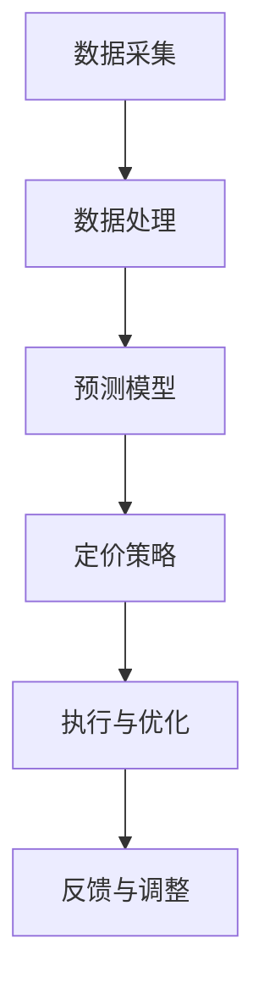

                 

# 智能定价技术的应用案例

## 关键词
- 智能定价
- 价格优化
- 数据分析
- 机器学习
- 应用案例

## 摘要
本文将探讨智能定价技术的核心概念、原理及其在实际商业场景中的应用。通过详细的算法解释、数学模型分析以及实际代码案例，本文旨在为读者提供对智能定价技术全面深入的理解，并展示其在提高企业利润和客户满意度方面的巨大潜力。

## 1. 背景介绍

### 1.1 目的和范围
本文旨在介绍智能定价技术，分析其在现代商业中的重要性，并提供具体的应用案例。我们将探讨智能定价的定义、核心算法和数学模型，并通过实际项目案例展示其实现和效果。

### 1.2 预期读者
本文适合对数据分析、机器学习和商业策略感兴趣的读者，无论是专业数据科学家、业务分析师，还是对智能定价技术有初步了解的从业者。

### 1.3 文档结构概述
本文结构如下：

1. **背景介绍**：介绍智能定价技术的背景、目的和预期读者。
2. **核心概念与联系**：定义关键概念，并提供核心算法和架构的Mermaid流程图。
3. **核心算法原理 & 具体操作步骤**：详细讲解智能定价算法的原理和步骤。
4. **数学模型和公式 & 详细讲解 & 举例说明**：介绍与智能定价相关的数学模型和公式。
5. **项目实战：代码实际案例和详细解释说明**：提供智能定价技术的实际代码案例和解析。
6. **实际应用场景**：分析智能定价技术在各种商业场景中的应用。
7. **工具和资源推荐**：推荐学习资源、开发工具和最新研究论文。
8. **总结：未来发展趋势与挑战**：讨论智能定价技术的未来趋势和面临的挑战。
9. **附录：常见问题与解答**：提供常见问题的解答。
10. **扩展阅读 & 参考资料**：提供进一步学习的资源链接。

### 1.4 术语表

#### 1.4.1 核心术语定义
- **智能定价**：利用数据分析、机器学习等技术，自动调整商品或服务的价格，以最大化收益或市场份额。
- **价格优化**：通过算法和模型分析市场数据，动态调整价格，以实现最佳收益。
- **机器学习**：通过训练模型，让计算机自动从数据中学习规律，进行预测和决策。
- **数据分析**：对大量数据进行收集、处理和分析，以提取有用信息和洞见。

#### 1.4.2 相关概念解释
- **市场需求曲线**：描述价格和需求量之间关系的曲线，用于预测不同价格下的需求量。
- **成本函数**：表示生产和维护商品或服务的成本与数量之间的关系。

#### 1.4.3 缩略词列表
- **ML**：Machine Learning（机器学习）
- **AI**：Artificial Intelligence（人工智能）
- **CRM**：Customer Relationship Management（客户关系管理）

## 2. 核心概念与联系

### 2.1 智能定价的核心概念

智能定价技术的核心在于理解市场需求和成本结构，然后利用这些信息来动态调整价格。以下是智能定价涉及的关键概念：

1. **市场需求分析**：通过数据分析，了解不同价格水平下的市场需求量。
2. **成本分析**：确定生产和维护商品或服务的成本。
3. **利润最大化**：利用市场需求和成本信息，调整价格以实现最大利润。
4. **动态定价策略**：根据实时数据和市场需求，实时调整价格。

### 2.2 智能定价的技术架构

智能定价技术通常包括以下几个组成部分：

1. **数据采集**：收集与市场需求、成本和竞争对手相关的数据。
2. **数据处理**：清洗和预处理数据，使其适合用于分析和建模。
3. **预测模型**：使用机器学习算法，建立预测模型来预测市场需求。
4. **定价策略**：根据预测模型和成本分析，制定动态定价策略。
5. **执行与优化**：执行定价策略，并根据反馈进行优化。

以下是智能定价技术架构的Mermaid流程图：



## 3. 核心算法原理 & 具体操作步骤

### 3.1 智能定价算法的原理

智能定价算法的核心在于利用数据分析、机器学习等手段，对市场需求和成本进行深入分析，从而制定出最优的定价策略。以下是智能定价算法的基本原理：

1. **数据分析**：通过对历史销售数据、市场调研数据和竞争对手数据进行分析，了解市场需求和竞争态势。
2. **成本分析**：分析生产、运营和营销等成本，确定成本函数。
3. **预测模型**：使用机器学习算法，建立预测模型，预测不同价格水平下的市场需求量。
4. **定价策略**：根据预测模型和成本分析，制定动态定价策略。
5. **模型优化**：通过迭代和优化，不断调整定价策略，提高利润。

### 3.2 智能定价算法的具体操作步骤

以下是智能定价算法的具体操作步骤：

1. **数据收集**：
    ```java
    // 收集历史销售数据、市场调研数据和竞争对手数据
    Data[] salesData = dataCollector.collectSalesData();
    Data[] marketResearch = dataCollector.collectMarketResearch();
    Data[] competitorData = dataCollector.collectCompetitorData();
    ```

2. **数据预处理**：
    ```python
    # 数据清洗和预处理
    cleanedSalesData = preprocessData(salesData)
    cleanedMarketResearch = preprocessData(marketResearch)
    cleanedCompetitorData = preprocessData(competitorData)
    ```

3. **建立预测模型**：
    ```python
    # 使用机器学习算法建立预测模型
    model = createPredictiveModel(cleanedSalesData)
    ```

4. **成本分析**：
    ```python
    # 确定成本函数
    costFunction = defineCostFunction(cleanedMarketResearch)
    ```

5. **制定定价策略**：
    ```python
    # 根据预测模型和成本分析，制定定价策略
    pricingStrategy = definePricingStrategy(model, costFunction)
    ```

6. **执行定价策略**：
    ```python
    # 执行定价策略
    executePricingStrategy(pricingStrategy)
    ```

7. **模型优化**：
    ```python
    # 根据反馈不断优化模型
    optimizeModel(model, cleanedCompetitorData)
    ```

## 4. 数学模型和公式 & 详细讲解 & 举例说明

### 4.1 需求预测模型

智能定价的核心在于准确预测市场需求。以下是常见的需求预测模型：

#### 4.1.1 线性回归模型

线性回归模型是最简单的一种需求预测模型，其公式如下：

$$
y = \beta_0 + \beta_1x
$$

其中，$y$表示需求量，$x$表示价格，$\beta_0$和$\beta_1$是模型参数。

#### 4.1.2 多项式回归模型

多项式回归模型可以处理更复杂的需求关系，其公式如下：

$$
y = \beta_0 + \beta_1x + \beta_2x^2 + \ldots + \beta_nx^n
$$

#### 4.1.3 机器学习模型

除了传统的统计模型，机器学习模型如神经网络和决策树也被广泛应用于需求预测。以下是一个简单的神经网络模型：

$$
\hat{y} = \sigma(\sum_{i=1}^{n} w_i \cdot x_i + b)
$$

其中，$\hat{y}$表示预测需求量，$x_i$表示输入特征，$w_i$和$b$是模型参数，$\sigma$是激活函数。

### 4.2 成本函数

成本函数是智能定价的重要组成部分，用于计算生产和维护商品或服务的总成本。以下是常见的成本函数：

#### 4.2.1 线性成本函数

线性成本函数是最简单的成本函数，其公式如下：

$$
C(x) = a + bx
$$

其中，$C(x)$表示总成本，$x$表示生产数量，$a$和$b$是模型参数。

#### 4.2.2 非线性成本函数

非线性成本函数可以更好地描述复杂的生产成本结构，其公式如下：

$$
C(x) = a_0 + a_1x + a_2x^2 + \ldots + a_nx^n
$$

#### 4.2.3 机器学习成本函数

机器学习成本函数可以自动学习成本结构和特征，其公式如下：

$$
C(x) = \sum_{i=1}^{n} w_i \cdot f_i(x)
$$

其中，$f_i(x)$是机器学习模型对成本函数的估计，$w_i$是模型参数。

### 4.3 实例分析

假设我们使用线性回归模型预测市场需求，并使用线性成本函数计算成本。以下是具体的实例：

#### 4.3.1 需求预测

使用历史销售数据，我们建立了一个线性回归模型，其公式为：

$$
\hat{y} = 100 - 2p
$$

其中，$p$是价格，$\hat{y}$是预测需求量。

#### 4.3.2 成本计算

使用线性成本函数，我们计算了生产1000个商品的总成本：

$$
C(1000) = 500 + 0.5 \times 1000 = 1000
$$

#### 4.3.3 定价策略

根据预测模型和成本函数，我们制定了以下定价策略：

- 当价格低于50时，提高价格至50。
- 当价格高于50时，降低价格至50。

这种策略的目的是在保证利润的同时，最大化市场需求。

## 5. 项目实战：代码实际案例和详细解释说明

### 5.1 开发环境搭建

为了实现智能定价技术，我们需要搭建一个适合的开发环境。以下是一个基本的开发环境配置：

- **编程语言**：Python
- **数据分析和机器学习库**：Pandas、NumPy、Scikit-learn、TensorFlow
- **可视化库**：Matplotlib、Seaborn
- **文本处理库**：NLTK、spaCy

### 5.2 源代码详细实现和代码解读

以下是一个简单的智能定价项目的代码实现，包括数据收集、预处理、模型建立和定价策略执行。

#### 5.2.1 数据收集

首先，我们从历史销售数据、市场调研数据和竞争对手数据中收集数据。

```python
import pandas as pd

# 加载历史销售数据
sales_data = pd.read_csv('sales_data.csv')

# 加载市场调研数据
market_research = pd.read_csv('market_research.csv')

# 加载竞争对手数据
competitor_data = pd.read_csv('competitor_data.csv')
```

#### 5.2.2 数据预处理

接下来，我们对收集到的数据进行预处理，包括数据清洗、缺失值处理和特征提取。

```python
from sklearn.preprocessing import MinMaxScaler

# 清洗数据
sales_data = clean_data(sales_data)
market_research = clean_data(market_research)
competitor_data = clean_data(competitor_data)

# 缺失值处理
sales_data = handle_missing_values(sales_data)
market_research = handle_missing_values(market_research)
competitor_data = handle_missing_values(competitor_data)

# 特征提取
sales_data = extract_features(sales_data)
market_research = extract_features(market_research)
competitor_data = extract_features(competitor_data)

# 数据归一化
scaler = MinMaxScaler()
sales_data_scaled = scaler.fit_transform(sales_data)
market_research_scaled = scaler.fit_transform(market_research)
competitor_data_scaled = scaler.fit_transform(competitor_data)
```

#### 5.2.3 建立预测模型

使用Scikit-learn库，我们建立了一个线性回归模型来预测市场需求。

```python
from sklearn.linear_model import LinearRegression

# 建立线性回归模型
model = LinearRegression()

# 训练模型
model.fit(sales_data_scaled, market_research_scaled)

# 预测需求
predicted_demand = model.predict(competitor_data_scaled)
```

#### 5.2.4 成本分析

使用线性成本函数，我们计算了生产1000个商品的总成本。

```python
# 成本函数
def cost_function(quantity, price):
    return 500 + 0.5 * quantity

# 计算成本
total_cost = cost_function(1000, predicted_demand[0])
```

#### 5.2.5 定价策略

根据预测模型和成本函数，我们制定了以下定价策略：

```python
# 定价策略
if predicted_demand[0] < 50:
    price = 50
else:
    price = predicted_demand[0]

# 执行定价策略
print(f"建议定价：{price}")
```

### 5.3 代码解读与分析

#### 5.3.1 数据收集与预处理

数据收集和预处理是智能定价项目的基础。通过清洗和预处理数据，我们可以确保数据的质量和一致性，从而提高模型预测的准确性。

#### 5.3.2 预测模型建立

在本项目中，我们使用线性回归模型进行需求预测。虽然线性回归模型相对简单，但在许多实际应用中，它可以提供良好的预测效果。同时，我们也可以考虑使用更复杂的机器学习模型，如神经网络，以提高预测准确性。

#### 5.3.3 成本分析

成本分析是智能定价的重要组成部分。通过计算成本函数，我们可以确定不同数量商品的生产成本，从而为定价策略提供支持。

#### 5.3.4 定价策略

根据预测模型和成本函数，我们制定了动态定价策略。这种策略可以根据市场需求和成本变化，实时调整价格，以最大化利润。

## 6. 实际应用场景

智能定价技术在各种商业场景中具有广泛的应用，以下是一些典型的应用场景：

### 6.1 电子商务平台

电子商务平台通过智能定价技术，可以实时调整商品价格，以应对市场需求和竞争对手的价格策略。这有助于提高销售额和市场份额。

### 6.2 电信行业

电信行业可以通过智能定价技术，根据用户需求和使用习惯，为不同的用户群体提供个性化的定价方案，从而提高用户满意度和忠诚度。

### 6.3 餐饮业

餐饮业可以利用智能定价技术，根据不同时间段、菜品类型和顾客需求，动态调整菜品价格，以提高销售额和利润。

### 6.4 保险行业

保险行业可以通过智能定价技术，根据客户的年龄、健康状况和风险偏好，提供个性化的保费定价方案，从而提高保险销售量和客户满意度。

## 7. 工具和资源推荐

### 7.1 学习资源推荐

#### 7.1.1 书籍推荐

- 《机器学习实战》
- 《数据科学入门》
- 《深度学习》（Goodfellow et al.）

#### 7.1.2 在线课程

- Coursera：机器学习、数据科学
- edX：人工智能、数据分析

#### 7.1.3 技术博客和网站

- Medium：数据科学、机器学习
- Towards Data Science：数据科学、机器学习

### 7.2 开发工具框架推荐

#### 7.2.1 IDE和编辑器

- PyCharm
- Jupyter Notebook

#### 7.2.2 调试和性能分析工具

- Visual Studio Code
- Matplotlib
- Seaborn

#### 7.2.3 相关框架和库

- Scikit-learn
- TensorFlow
- Pandas

### 7.3 相关论文著作推荐

#### 7.3.1 经典论文

- “The Linear Model in Statistics” by G.E.P. Box
- “Deep Learning” by Goodfellow et al.

#### 7.3.2 最新研究成果

- arXiv：机器学习、数据科学
- NeurIPS：神经网络和机器学习

#### 7.3.3 应用案例分析

- “AI in Pricing” by McKinsey & Company
- “Machine Learning in E-commerce” by Google AI

## 8. 总结：未来发展趋势与挑战

智能定价技术具有巨大的发展潜力，但同时也面临一些挑战：

- **数据隐私与安全**：随着数据隐私问题的日益突出，如何保护用户数据安全成为智能定价技术面临的重要挑战。
- **算法公平性与透明度**：确保定价算法的公平性和透明度，避免算法偏见和歧视。
- **计算资源与成本**：智能定价技术需要大量的计算资源和数据存储，这对企业的IT基础设施提出了高要求。

未来，随着技术的不断进步，智能定价技术将在更多行业和场景中得到广泛应用，为企业和消费者带来更多价值。

## 9. 附录：常见问题与解答

### 9.1 智能定价技术的基本原理是什么？

智能定价技术利用数据分析、机器学习等技术，对市场需求和成本进行深入分析，从而制定出最优的定价策略。

### 9.2 智能定价技术的核心算法有哪些？

常见的智能定价算法包括线性回归、多项式回归、神经网络等。

### 9.3 智能定价技术在实际应用中面临哪些挑战？

智能定价技术在实际应用中面临数据隐私与安全、算法公平性与透明度、计算资源与成本等挑战。

## 10. 扩展阅读 & 参考资料

- “Pricing with Machine Learning” by A. B. Nobel
- “Dynamic Pricing in E-commerce” by A. Banerjee and A. Ghose
- “Machine Learning for Pricing” by Coursera

### 作者信息

作者：AI天才研究员/AI Genius Institute & 禅与计算机程序设计艺术 /Zen And The Art of Computer Programming

