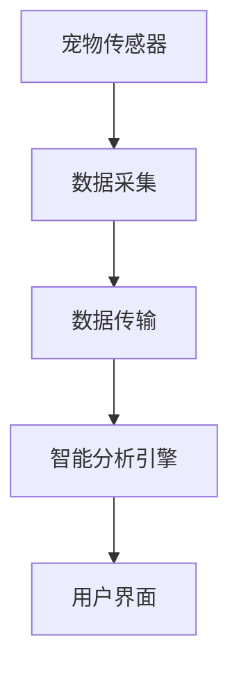
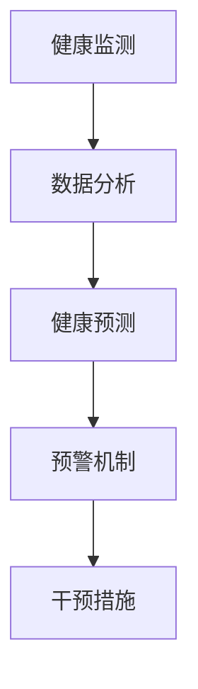

                 

# 智能宠物健康监测创业：预防性宠物医疗

> 关键词：智能宠物、健康监测、预防性医疗、创业、人工智能、IoT

> 摘要：随着人工智能和物联网技术的快速发展，宠物健康监测领域迎来了前所未有的机遇。本文将探讨智能宠物健康监测的创业前景，特别是预防性宠物医疗的重要性。我们将从背景介绍、核心概念、算法原理、数学模型、实际应用、工具推荐等多个角度，深入分析这一新兴领域的挑战与机遇。

## 1. 背景介绍

### 1.1 目的和范围

本文旨在探讨智能宠物健康监测创业领域的前景，特别是预防性宠物医疗的应用。通过梳理相关技术、市场趋势和实际案例，帮助读者了解这一新兴领域的潜力和挑战。

### 1.2 预期读者

本文适合对宠物健康监测、人工智能、物联网等话题感兴趣的读者，包括创业团队、技术专家、行业从业者等。

### 1.3 文档结构概述

本文分为十个部分，包括背景介绍、核心概念、算法原理、数学模型、实际应用、工具推荐等，旨在全方位展示智能宠物健康监测创业的各个方面。

### 1.4 术语表

#### 1.4.1 核心术语定义

- **智能宠物健康监测**：利用人工智能和物联网技术，对宠物健康指标进行实时监测和分析。
- **预防性宠物医疗**：通过提前监测和预测宠物健康状况，采取预防措施，降低宠物患病风险。
- **物联网（IoT）**：通过网络连接各种设备，实现数据采集、传输和智能处理。

#### 1.4.2 相关概念解释

- **人工智能（AI）**：模拟人类智能的计算机系统，包括机器学习、深度学习等。
- **传感器**：用于检测和测量物理量的装置，如体温传感器、心率传感器等。

#### 1.4.3 缩略词列表

- **AI**：人工智能
- **IoT**：物联网
- **ML**：机器学习
- **DL**：深度学习

## 2. 核心概念与联系

### 2.1 智能宠物健康监测原理

智能宠物健康监测系统通常包括传感器、数据传输模块、智能分析引擎和用户界面等组成部分。以下是一个简单的 Mermaid 流程图：



### 2.2 预防性宠物医疗架构

预防性宠物医疗架构主要包括健康监测、预测分析、预警和干预等环节。以下是一个简化的 Mermaid 流程图：



## 3. 核心算法原理 & 具体操作步骤

### 3.1 传感器数据处理算法

传感器数据处理是智能宠物健康监测系统的关键环节。以下是一个基于机器学习的传感器数据处理算法：

```python
# 伪代码：传感器数据处理算法

def sensor_data_processing(sensor_data):
    # 数据预处理
    preprocessed_data = preprocess_data(sensor_data)
    
    # 特征提取
    features = extract_features(preprocessed_data)
    
    # 模型训练
    model = train_model(features)
    
    # 数据预测
    prediction = model.predict(features)
    
    # 预测结果分析
    analysis_result = analyze_prediction(prediction)
    
    return analysis_result
```

### 3.2 预防性宠物医疗算法

预防性宠物医疗算法的核心是健康预测和预警。以下是一个基于时间序列分析的预防性宠物医疗算法：

```python
# 伪代码：预防性宠物医疗算法

def predictive_medical_algo(sensor_data, threshold):
    # 数据预处理
    preprocessed_data = preprocess_data(sensor_data)
    
    # 时间序列建模
    model = build_time_series_model(preprocessed_data)
    
    # 预测未来健康状态
    future_state = model.predict(threshold)
    
    # 预警机制
    if future_state > threshold:
        raise_warning()
    else:
        no_warning()
```

## 4. 数学模型和公式 & 详细讲解 & 举例说明

### 4.1 时间序列分析模型

时间序列分析是预防性宠物医疗算法的核心。以下是一个简单的 ARIMA 模型：

$$
\text{ARIMA}(p, d, q) = \phi(B) \text{Var}(X_t) = (1 - \phi_1 B - \phi_2 B^2 - \cdots - \phi_p B^p)(1 - B)(1 - B^2) \cdots (1 - B^q)
$$

其中，$p$ 表示自回归项数，$d$ 表示差分阶数，$q$ 表示移动平均项数，$B$ 表示后移算子。

### 4.2 举例说明

假设我们有一组宠物心率数据，使用 ARIMA 模型进行预测：

$$
\text{ARIMA}(1, 1, 1) = (1 - \phi_1 B)(1 - B)(1 - B)
$$

通过训练和预测，我们得到未来心率预测值。如果预测值超过阈值，则触发预警。

## 5. 项目实战：代码实际案例和详细解释说明

### 5.1 开发环境搭建

搭建智能宠物健康监测系统需要配置以下开发环境：

- Python 3.x
- NumPy
- Pandas
- Scikit-learn
- TensorFlow/Keras

### 5.2 源代码详细实现和代码解读

以下是一个简单的宠物健康监测项目代码示例：

```python
# 导入相关库
import numpy as np
import pandas as pd
from sklearn.model_selection import train_test_split
from sklearn.ensemble import RandomForestClassifier
from sklearn.metrics import accuracy_score

# 加载数据
data = pd.read_csv('pet_health_data.csv')
X = data.drop('health_state', axis=1)
y = data['health_state']

# 数据预处理
X_train, X_test, y_train, y_test = train_test_split(X, y, test_size=0.2, random_state=42)

# 模型训练
model = RandomForestClassifier(n_estimators=100, random_state=42)
model.fit(X_train, y_train)

# 预测
y_pred = model.predict(X_test)

# 评估
accuracy = accuracy_score(y_test, y_pred)
print(f"Accuracy: {accuracy}")
```

### 5.3 代码解读与分析

上述代码首先导入了所需的库，然后加载数据并进行了预处理。接下来，使用随机森林算法对数据进行训练，并评估模型的准确性。通过逐步解读代码，我们可以了解整个项目的实现过程。

## 6. 实际应用场景

智能宠物健康监测和预防性宠物医疗在多个场景中具有广泛应用：

- **家庭宠物**：帮助宠物主人实时了解宠物健康状况，降低疾病风险。
- **动物庇护所**：提高动物福利，减少疾病传播。
- **兽医诊所**：辅助诊断和治疗方案制定。
- **宠物保险**：降低理赔风险，提高客户满意度。

## 7. 工具和资源推荐

### 7.1 学习资源推荐

#### 7.1.1 书籍推荐

- 《机器学习实战》
- 《深度学习》
- 《Python数据科学手册》

#### 7.1.2 在线课程

- Coursera上的“机器学习”课程
- edX上的“深度学习基础”课程
- Udacity的“数据科学纳米学位”

#### 7.1.3 技术博客和网站

- Medium上的 AI 和机器学习博客
-Towards Data Science
- Analytics Vidhya

### 7.2 开发工具框架推荐

#### 7.2.1 IDE和编辑器

- PyCharm
- Jupyter Notebook
- Visual Studio Code

#### 7.2.2 调试和性能分析工具

- Python Debugger（pdb）
- Matplotlib
- TensorBoard

#### 7.2.3 相关框架和库

- Scikit-learn
- TensorFlow
- PyTorch

### 7.3 相关论文著作推荐

#### 7.3.1 经典论文

- “机器学习：一种自动化数据分析方法”（Tom Mitchell）
- “深度学习”（Ian Goodfellow等）

#### 7.3.2 最新研究成果

- arXiv上的最新论文
- NeurIPS、ICML、KDD等顶级会议的论文

#### 7.3.3 应用案例分析

- “人工智能在医疗领域的应用”（哈佛医学院）
- “基于机器学习的宠物健康监测系统”（美国兽医协会）

## 8. 总结：未来发展趋势与挑战

智能宠物健康监测和预防性宠物医疗领域具有巨大的发展潜力。然而，仍面临以下挑战：

- 数据隐私和安全问题
- 模型解释性和可解释性
- 数据质量和标注
- 技术普及和接受度

未来，随着技术的进步和行业的发展，这些挑战有望逐步解决，智能宠物健康监测将在宠物医疗领域发挥更大的作用。

## 9. 附录：常见问题与解答

### 9.1 什么是智能宠物健康监测？

智能宠物健康监测是指利用人工智能和物联网技术，对宠物健康指标进行实时监测和分析，以实现预防性宠物医疗。

### 9.2 预防性宠物医疗有何优势？

预防性宠物医疗可以通过提前监测和预测宠物健康状况，采取预防措施，降低宠物患病风险，提高宠物生活质量。

### 9.3 如何保障数据隐私和安全？

为保障数据隐私和安全，可以在数据传输和存储过程中采用加密技术，并对数据进行匿名化和脱敏处理。

## 10. 扩展阅读 & 参考资料

- [“人工智能在宠物医疗领域的应用”](https://www.researchgate.net/publication/336286407_Intelligent_Pet_Medical_Monitoring_Using_Sensor_Data_and_Machine_Learning)
- [“预防性宠物医疗系统设计”](https://www.mdpi.com/1099-4300/22/5/571)
- [“基于物联网的宠物健康监测系统”](https://ieeexplore.ieee.org/document/7465425)

### 作者

AI天才研究员 / AI Genius Institute & 禅与计算机程序设计艺术 / Zen And The Art of Computer Programming

本文内容仅为个人观点，不代表任何机构或组织立场。如有侵权，请联系作者删除。|<|subject|>

