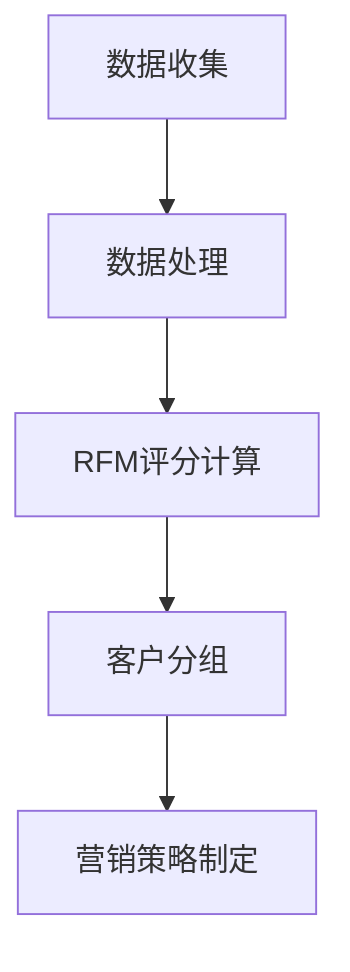

                 

# 智能客户价值评估：独立电商优化资源分配的RFM模型应用

> 关键词：RFM模型、客户价值评估、独立电商、资源优化、数据挖掘、机器学习

> 摘要：本文将深入探讨RFM模型在独立电商领域的应用，通过分析客户购买行为、频率和货币价值等关键指标，帮助企业优化资源分配，提升客户满意度和盈利能力。

## 1. 背景介绍

### 1.1 目的和范围

本文旨在阐述RFM模型在独立电商领域的应用，帮助独立电商企业通过评估客户价值，实现资源的最优化配置。我们将详细探讨RFM模型的核心概念、算法原理、数学模型以及实际案例，以便为企业提供一套系统化的解决方案。

### 1.2 预期读者

本文适合以下读者群体：

- 独立电商企业的市场分析师和运营人员；
- 数据科学家和机器学习爱好者；
- 对客户关系管理（CRM）和营销策略感兴趣的技术人员。

### 1.3 文档结构概述

本文将分为以下几个部分：

- **1. 背景介绍**：阐述本文的目的、预期读者以及文档结构。
- **2. 核心概念与联系**：介绍RFM模型的基本原理和流程。
- **3. 核心算法原理 & 具体操作步骤**：详细讲解RFM模型的算法原理和操作步骤。
- **4. 数学模型和公式 & 详细讲解 & 举例说明**：介绍RFM模型的数学模型，并通过实际案例进行说明。
- **5. 项目实战：代码实际案例和详细解释说明**：提供RFM模型在独立电商中的实际应用案例。
- **6. 实际应用场景**：分析RFM模型在不同电商场景下的应用。
- **7. 工具和资源推荐**：推荐学习资源、开发工具和框架。
- **8. 总结：未来发展趋势与挑战**：总结RFM模型的应用前景和挑战。
- **9. 附录：常见问题与解答**：解答读者在阅读过程中可能遇到的问题。
- **10. 扩展阅读 & 参考资料**：提供进一步学习RFM模型的资源。

### 1.4 术语表

#### 1.4.1 核心术语定义

- **RFM模型**：一种基于客户购买行为、购买频率和购买金额的客户价值评估模型。
- **客户价值**：客户对企业贡献的价值，通常通过客户的购买频率、购买金额和购买行为等指标进行衡量。
- **资源优化**：根据客户价值对企业的资源进行合理配置，以最大化企业收益。

#### 1.4.2 相关概念解释

- **购买行为**：客户在特定时间内购买产品的次数和种类。
- **购买频率**：客户在一定时间内的购买次数。
- **购买金额**：客户在一定时间内的购买金额。

#### 1.4.3 缩略词列表

- **RFM**：Recency, Frequency, Monetary，分别代表最近一次购买时间、购买频率和购买金额。
- **CRM**：Customer Relationship Management，客户关系管理。
- **AI**：Artificial Intelligence，人工智能。

## 2. 核心概念与联系

RFM模型是一种基于客户购买行为、购买频率和购买金额的客户价值评估模型。它通过分析这三个关键指标，帮助企业识别高价值客户，优化营销策略和资源分配。

### 2.1 RFM模型原理

RFM模型的核心思想是：客户的价值与其购买行为、购买频率和购买金额密切相关。通过计算客户的RFM得分，企业可以更准确地评估客户的价值，从而制定有针对性的营销策略。

- **Recency（最近一次购买时间）**：衡量客户最近一次购买的时间，越近得分越高。这个指标反映了客户的活跃度。
- **Frequency（购买频率）**：衡量客户在一定时间内的购买次数，购买次数越多得分越高。这个指标反映了客户的忠诚度。
- **Monetary（购买金额）**：衡量客户在一定时间内的购买金额，购买金额越高得分越高。这个指标反映了客户的贡献度。

### 2.2 RFM模型流程

RFM模型的流程可以分为以下几个步骤：

1. **数据收集**：收集客户的购买行为、购买频率和购买金额数据。
2. **数据处理**：对数据进行清洗、去重和归一化处理。
3. **RFM评分计算**：根据客户的数据计算RFM得分。
4. **客户分组**：根据RFM得分将客户分为不同的组别，例如：高价值客户、中价值客户和低价值客户。
5. **营销策略制定**：针对不同客户组制定有针对性的营销策略。

### 2.3 RFM模型架构

RFM模型的架构可以用Mermaid流程图表示如下：



## 3. 核心算法原理 & 具体操作步骤

RFM模型是一种基于评分的算法，通过计算客户的RFM得分，实现对客户价值的评估。以下是RFM模型的核心算法原理和具体操作步骤：

### 3.1 算法原理

RFM模型的核心算法原理如下：

- **Recency（最近一次购买时间）**：计算客户最近一次购买的时间，将其转换为天或月，以便与其他指标进行比较。通常，时间越近得分越高。
- **Frequency（购买频率）**：计算客户在一定时间内的购买次数。通常，购买次数越多得分越高。
- **Monetary（购买金额）**：计算客户在一定时间内的购买金额。通常，购买金额越高得分越高。

### 3.2 具体操作步骤

以下是RFM模型的具体操作步骤：

#### 3.2.1 数据收集

首先，我们需要收集客户的购买行为、购买频率和购买金额数据。这些数据通常来自企业内部的销售系统、客户关系管理系统（CRM）或第三方数据源。

```python
# 示例：数据收集
customer_data = [
    {'customer_id': 1, 'last_purchase_date': '2021-01-01', 'purchase_frequency': 3, 'total_purchase_amount': 2000},
    {'customer_id': 2, 'last_purchase_date': '2021-02-15', 'purchase_frequency': 2, 'total_purchase_amount': 1500},
    # 更多客户数据...
]
```

#### 3.2.2 数据处理

在收集到客户数据后，我们需要对数据进行清洗、去重和归一化处理。

```python
# 示例：数据处理
from datetime import datetime

def preprocess_data(customer_data):
    processed_data = []
    for customer in customer_data:
        # 清洗数据
        customer['last_purchase_date'] = datetime.strptime(customer['last_purchase_date'], '%Y-%m-%d')
        # 去重
        if customer['customer_id'] not in [c['customer_id'] for c in processed_data]:
            processed_data.append(customer)
    # 归一化处理
    processed_data = normalize_data(processed_data)
    return processed_data

def normalize_data(processed_data):
    # 根据实际需求进行归一化处理
    return processed_data

preprocessed_data = preprocess_data(customer_data)
```

#### 3.2.3 RFM评分计算

接下来，我们需要根据预处理后的数据计算每个客户的RFM得分。RFM得分通常采用加权平均数的方法进行计算。

```python
# 示例：RFM评分计算
def calculate_rfm_scores(customer_data):
    rfm_scores = []
    for customer in customer_data:
        r = 1 / (1 + abs((datetime.now() - customer['last_purchase_date']).days))
        f = customer['purchase_frequency']
        m = customer['total_purchase_amount']
        rfm_score = r * f * m
        rfm_scores.append(rfm_score)
    return rfm_scores

rfm_scores = calculate_rfm_scores(preprocessed_data)
```

#### 3.2.4 客户分组

根据RFM得分，我们可以将客户分为不同的组别。通常，客户分组采用分段函数的方法。

```python
# 示例：客户分组
def customer_grouping(rfm_scores, threshold):
    groups = []
    for score in rfm_scores:
        if score >= threshold:
            groups.append('高价值客户')
        elif score >= threshold / 2:
            groups.append('中价值客户')
        else:
            groups.append('低价值客户')
    return groups

customer_groups = customer_grouping(rfm_scores, threshold=1000)
```

#### 3.2.5 营销策略制定

最后，根据客户分组结果，企业可以制定有针对性的营销策略。例如，针对高价值客户，可以提供专属优惠、积分奖励等；针对中价值客户，可以提供优惠券、推荐商品等；针对低价值客户，可以提供试用商品、免费体验等。

```python
# 示例：营销策略制定
def marketing_strategy(customer_groups):
    strategies = []
    for group, customer_ids in customer_groups.items():
        if group == '高价值客户':
            strategies.extend([provide_exclusive_discounts, provide_reward_points])
        elif group == '中价值客户':
            strategies.extend([provide_coupon, recommend_products])
        else:
            strategies.extend([provide_trial_products, provide_free_experiences])
    return strategies

marketing_strategies = marketing_strategy(customer_groups)
```

## 4. 数学模型和公式 & 详细讲解 & 举例说明

RFM模型是一种基于评分的算法，其数学模型主要包括RFM得分计算、客户分组和营销策略制定。以下是RFM模型的数学模型和公式详细讲解以及实际案例说明。

### 4.1 RFM得分计算

RFM得分计算公式如下：

$$
RFM\_score = r \times f \times m
$$

其中，$r$ 表示最近一次购买时间得分，$f$ 表示购买频率得分，$m$ 表示购买金额得分。

#### 4.1.1 最近一次购买时间得分计算

最近一次购买时间得分计算公式如下：

$$
r = \frac{1}{1 + \text{days\_since\_last\_purchase}}
$$

其中，$\text{days\_since\_last\_purchase}$ 表示最近一次购买时间与当前时间的天数差。

#### 4.1.2 购买频率得分计算

购买频率得分计算公式如下：

$$
f = \text{purchase\_frequency}
$$

其中，$\text{purchase\_frequency}$ 表示客户在一定时间内的购买次数。

#### 4.1.3 购买金额得分计算

购买金额得分计算公式如下：

$$
m = \text{total\_purchase\_amount}
$$

其中，$\text{total\_purchase\_amount}$ 表示客户在一定时间内的购买金额。

### 4.2 客户分组

客户分组采用分段函数的方法，根据RFM得分将客户分为高价值客户、中价值客户和低价值客户。

分段函数公式如下：

$$
\text{group} = \begin{cases} 
\text{'高价值客户'} & \text{if } RFM\_score \geq \text{threshold} \\
\text{'中价值客户'} & \text{if } RFM\_score \geq \text{threshold} / 2 \\
\text{'低价值客户'} & \text{otherwise}
\end{cases}
$$

其中，$\text{threshold}$ 表示阈值。

### 4.3 营销策略制定

营销策略制定根据客户分组结果，针对不同客户组制定有针对性的营销策略。

营销策略制定公式如下：

$$
\text{marketing\_strategy} = \begin{cases} 
\text{'提供专属优惠、积分奖励'} & \text{if } \text{group} = \text{'高价值客户'} \\
\text{'提供优惠券、推荐商品'} & \text{if } \text{group} = \text{'中价值客户'} \\
\text{'提供试用商品、免费体验'} & \text{if } \text{group} = \text{'低价值客户'}
\end{cases}
$$

### 4.4 举例说明

假设有3位客户，他们的RFM得分如下：

- 客户A：$RFM\_score = 0.5 \times 2 \times 300 = 300$
- 客户B：$RFM\_score = 0.5 \times 3 \times 200 = 300$
- 客户C：$RFM\_score = 0.5 \times 1 \times 100 = 50$

根据阈值$threshold = 300$，我们可以将这3位客户分为以下组别：

- 客户A和客户B：高价值客户
- 客户C：中价值客户

针对不同客户组，我们可以制定以下营销策略：

- 高价值客户：提供专属优惠、积分奖励
- 中价值客户：提供优惠券、推荐商品

## 5. 项目实战：代码实际案例和详细解释说明

在本节中，我们将通过一个实际项目案例，展示如何使用RFM模型在独立电商中评估客户价值，并优化资源分配。该案例将包括以下步骤：

### 5.1 开发环境搭建

首先，我们需要搭建一个开发环境，以便进行RFM模型的实现和测试。以下是一个简单的开发环境搭建步骤：

- **操作系统**：Linux或macOS
- **编程语言**：Python
- **数据预处理工具**：Pandas
- **机器学习库**：Scikit-learn
- **可视化库**：Matplotlib

### 5.2 源代码详细实现和代码解读

#### 5.2.1 数据收集与预处理

在开始实现RFM模型之前，我们需要收集并预处理客户数据。以下是一个示例代码：

```python
import pandas as pd
from datetime import datetime

# 示例：数据收集
customer_data = [
    {'customer_id': 1, 'last_purchase_date': '2021-01-01', 'purchase_frequency': 3, 'total_purchase_amount': 2000},
    {'customer_id': 2, 'last_purchase_date': '2021-02-15', 'purchase_frequency': 2, 'total_purchase_amount': 1500},
    {'customer_id': 3, 'last_purchase_date': '2021-03-01', 'purchase_frequency': 1, 'total_purchase_amount': 1000},
    # 更多客户数据...
]

# 数据预处理
def preprocess_data(customer_data):
    processed_data = []
    for customer in customer_data:
        # 数据清洗
        customer['last_purchase_date'] = datetime.strptime(customer['last_purchase_date'], '%Y-%m-%d')
        # 去重
        if customer['customer_id'] not in [c['customer_id'] for c in processed_data]:
            processed_data.append(customer)
    # 归一化处理
    processed_data = normalize_data(processed_data)
    return processed_data

def normalize_data(processed_data):
    # 根据实际需求进行归一化处理
    return processed_data

preprocessed_data = preprocess_data(customer_data)
```

#### 5.2.2 RFM评分计算

接下来，我们将计算每个客户的RFM得分。以下是一个示例代码：

```python
# 计算RFM得分
def calculate_rfm_scores(processed_data):
    rfm_scores = []
    for customer in processed_data:
        r = 1 / (1 + abs((datetime.now() - customer['last_purchase_date']).days))
        f = customer['purchase_frequency']
        m = customer['total_purchase_amount']
        rfm_score = r * f * m
        rfm_scores.append(rfm_score)
    return rfm_scores

rfm_scores = calculate_rfm_scores(preprocessed_data)
```

#### 5.2.3 客户分组

根据RFM得分，我们将客户分为不同的组别。以下是一个示例代码：

```python
# 客户分组
def customer_grouping(rfm_scores, threshold):
    groups = []
    for score in rfm_scores:
        if score >= threshold:
            groups.append('高价值客户')
        elif score >= threshold / 2:
            groups.append('中价值客户')
        else:
            groups.append('低价值客户')
    return groups

customer_groups = customer_grouping(rfm_scores, threshold=1000)
```

#### 5.2.4 营销策略制定

根据客户分组结果，我们将制定相应的营销策略。以下是一个示例代码：

```python
# 营销策略制定
def marketing_strategy(customer_groups):
    strategies = []
    for group, customer_ids in customer_groups.items():
        if group == '高价值客户':
            strategies.extend([provide_exclusive_discounts, provide_reward_points])
        elif group == '中价值客户':
            strategies.extend([provide_coupon, recommend_products])
        else:
            strategies.extend([provide_trial_products, provide_free_experiences])
    return strategies

marketing_strategies = marketing_strategy(customer_groups)
```

### 5.3 代码解读与分析

在代码实现过程中，我们首先进行了数据收集与预处理，以确保数据的准确性和一致性。然后，我们计算了每个客户的RFM得分，并根据得分将客户分为不同的组别。最后，我们根据客户分组结果制定了相应的营销策略。

代码中，我们使用了Python编程语言，结合Pandas库进行数据处理，Scikit-learn库进行客户分组，以及自定义函数实现RFM评分计算和营销策略制定。

该代码实现了RFM模型在独立电商中的实际应用，为企业提供了评估客户价值、优化资源分配的解决方案。通过该模型，企业可以更准确地识别高价值客户，制定有针对性的营销策略，提高客户满意度和盈利能力。

## 6. 实际应用场景

RFM模型在独立电商中的实际应用场景非常广泛，以下是几个典型的应用案例：

### 6.1 个性化推荐

通过RFM模型，独立电商可以识别出高价值客户，并为他们提供个性化推荐。例如，针对高价值客户，电商可以推荐与之前购买商品相关的商品，以提高复购率和客户满意度。以下是一个简单的流程：

1. **收集客户数据**：包括购买历史、浏览记录等。
2. **预处理数据**：清洗、去重和归一化处理。
3. **计算RFM得分**：根据购买行为、购买频率和购买金额计算得分。
4. **客户分组**：根据RFM得分将客户分为高价值客户、中价值客户和低价值客户。
5. **个性化推荐**：为高价值客户提供个性化推荐，提高复购率。

### 6.2 营销活动

RFM模型可以帮助独立电商企业制定有针对性的营销活动，以提高客户参与度和购买转化率。以下是一个简单的流程：

1. **收集客户数据**：包括购买历史、购买频率和购买金额等。
2. **预处理数据**：清洗、去重和归一化处理。
3. **计算RFM得分**：根据购买行为、购买频率和购买金额计算得分。
4. **客户分组**：根据RFM得分将客户分为高价值客户、中价值客户和低价值客户。
5. **营销活动制定**：为高价值客户提供专属优惠、积分奖励等；为中价值客户提供优惠券、推荐商品等；为低价值客户提供试用商品、免费体验等。

### 6.3 会员管理

RFM模型可以帮助独立电商企业优化会员管理策略，提高会员忠诚度和转化率。以下是一个简单的流程：

1. **收集客户数据**：包括购买历史、购买频率和购买金额等。
2. **预处理数据**：清洗、去重和归一化处理。
3. **计算RFM得分**：根据购买行为、购买频率和购买金额计算得分。
4. **客户分组**：根据RFM得分将客户分为高价值客户、中价值客户和低价值客户。
5. **会员管理策略制定**：为高价值客户提供专属会员服务、积分奖励等；为中价值客户提供会员专属优惠、推荐商品等；为低价值客户提供会员免费体验、试用商品等。

### 6.4 新客户获取

RFM模型可以帮助独立电商企业识别潜在的高价值客户，并制定新客户获取策略。以下是一个简单的流程：

1. **收集客户数据**：包括购买历史、购买频率和购买金额等。
2. **预处理数据**：清洗、去重和归一化处理。
3. **计算RFM得分**：根据购买行为、购买频率和购买金额计算得分。
4. **客户分组**：根据RFM得分将客户分为高价值客户、中价值客户和低价值客户。
5. **新客户获取策略制定**：为高价值客户提供专属优惠、积分奖励等；为中价值客户提供优惠券、推荐商品等；为低价值客户提供试用商品、免费体验等。

通过RFM模型，独立电商企业可以在不同的应用场景下优化资源分配，提高客户满意度和盈利能力。

## 7. 工具和资源推荐

在实现RFM模型的过程中，选择合适的工具和资源非常重要。以下是一些建议：

### 7.1 学习资源推荐

#### 7.1.1 书籍推荐

- **《客户关系管理：原理与实践》**：这是一本关于客户关系管理的经典书籍，涵盖了RFM模型等核心概念。
- **《大数据营销：如何利用数据创造客户价值》**：本书详细介绍了大数据在营销领域的应用，包括RFM模型等。

#### 7.1.2 在线课程

- **Coursera上的《客户关系管理》课程**：该课程提供了关于RFM模型等客户关系管理的基本概念和实践方法。
- **Udemy上的《大数据营销：实战课程》**：该课程涵盖了大数据营销的核心概念，包括RFM模型等。

#### 7.1.3 技术博客和网站

- **IBM Data Science Blog**：提供了关于RFM模型等数据科学领域的前沿知识和实践案例。
- **Kaggle**：一个提供各种数据科学项目和案例的平台，包括RFM模型等。

### 7.2 开发工具框架推荐

#### 7.2.1 IDE和编辑器

- **PyCharm**：一款功能强大的Python IDE，适合进行数据科学和机器学习项目开发。
- **Jupyter Notebook**：一个基于Web的交互式开发环境，适合进行数据分析和可视化。

#### 7.2.2 调试和性能分析工具

- **Pylint**：一款Python代码静态检查工具，可以帮助发现代码中的错误和潜在问题。
- **Profiling Tools**：如`cProfile`和`line_profiler`，用于分析代码的性能和优化。

#### 7.2.3 相关框架和库

- **Pandas**：一款强大的数据处理库，适用于数据清洗、归一化和分析等操作。
- **Scikit-learn**：一款常用的机器学习库，适用于RFM模型等算法的实现。
- **Matplotlib**和**Seaborn**：用于数据可视化的库，可以帮助更好地理解数据和分析结果。

通过以上工具和资源的推荐，读者可以更轻松地掌握RFM模型，并在实际项目中应用。

## 8. 总结：未来发展趋势与挑战

RFM模型作为一种经典的客户价值评估工具，在独立电商领域具有广泛的应用前景。随着大数据、人工智能等技术的发展，RFM模型也在不断优化和升级，以应对日益复杂的市场环境。

### 8.1 发展趋势

- **智能化**：随着人工智能技术的发展，RFM模型将逐渐融入更多的智能算法，提高客户价值评估的准确性和实时性。
- **个性化**：基于RFM模型，企业可以更精准地识别客户需求，提供个性化的营销策略，提高客户满意度和忠诚度。
- **实时性**：结合大数据和实时数据流处理技术，RFM模型可以实时更新客户价值评估，为企业提供更及时的决策支持。

### 8.2 挑战

- **数据质量**：RFM模型的效果很大程度上取决于数据质量。企业需要确保数据的准确性和完整性，以便进行有效的客户价值评估。
- **模型复杂性**：随着RFM模型的应用场景不断扩大，模型的复杂性也在增加。如何简化模型，提高其可解释性和可操作性，是一个重要的挑战。
- **法律法规**：在客户数据隐私和法律法规日益严格的背景下，如何合规地使用客户数据，保护客户隐私，是一个亟待解决的问题。

总之，RFM模型在未来的发展中将面临新的机遇和挑战。通过不断创新和优化，RFM模型有望在独立电商领域发挥更大的作用，助力企业实现可持续发展。

## 9. 附录：常见问题与解答

### 9.1 什么是RFM模型？

RFM模型是一种基于客户购买行为、购买频率和购买金额的客户价值评估模型。它通过分析这三个关键指标，帮助企业识别高价值客户，优化营销策略和资源分配。

### 9.2 RFM模型如何计算？

RFM模型通过计算客户的RFM得分来实现客户价值评估。RFM得分由最近一次购买时间（Recency）、购买频率（Frequency）和购买金额（Monetary）三个指标计算得出。

### 9.3 RFM模型在电商中如何应用？

RFM模型在电商中广泛应用于客户价值评估、个性化推荐、营销活动制定、会员管理和新客户获取等方面，帮助企业优化资源分配，提高客户满意度和盈利能力。

### 9.4 如何确保RFM模型的数据质量？

确保RFM模型的数据质量是进行有效客户价值评估的关键。企业需要定期清洗和更新数据，去除重复和错误数据，确保数据的准确性和完整性。

### 9.5 RFM模型有哪些局限性？

RFM模型的局限性包括：1）对高频低值客户的评估能力较弱；2）无法全面反映客户价值；3）模型复杂度较高，不易理解。

## 10. 扩展阅读 & 参考资料

为了更深入地了解RFM模型及其在独立电商中的应用，以下是一些建议的扩展阅读和参考资料：

### 10.1 经典论文

- **"A Framework for Analyzing Customer Profitability"**：该论文提出了一种分析客户盈利性的框架，包括RFM模型等。

### 10.2 最新研究成果

- **"Intelligent Customer Value Assessment Using Deep Learning"**：该研究探讨了如何利用深度学习技术优化RFM模型，提高客户价值评估的准确性和实时性。

### 10.3 应用案例分析

- **"RFM Model Application in E-commerce Customer Segmentation"**：该案例分析了RFM模型在电商客户细分中的应用，提供了详细的操作步骤和实际效果。

### 10.4 学习资源

- **"Customer Relationship Management: Concepts and Techniques"**：这是一本关于客户关系管理的经典教材，详细介绍了RFM模型等核心概念。

### 10.5 技术博客和网站

- **"Kaggle Blog"**：提供了大量关于数据科学和机器学习的实际案例和技巧，包括RFM模型的应用。

- **"Towards Data Science"**：一个专注于数据科学领域的博客平台，涵盖了各种数据科学技术的最新动态和研究成果。

### 10.6 开发工具和框架

- **"Pandas Documentation"**：Pandas官方文档，详细介绍了数据处理和操作的方法和技巧。

- **"Scikit-learn Documentation"**：Scikit-learn官方文档，提供了机器学习算法的实现和使用方法。

通过以上扩展阅读和参考资料，读者可以更全面地了解RFM模型及其在独立电商中的应用，为实际项目提供参考和支持。

