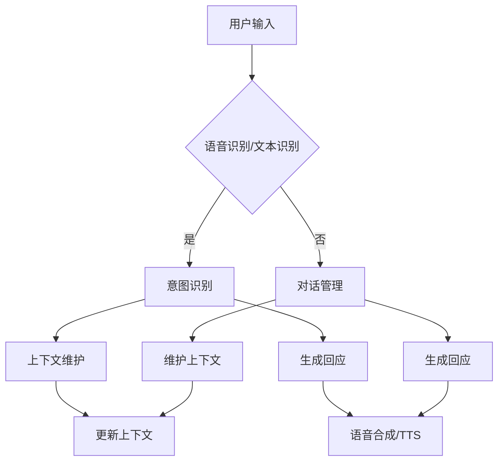

                 

# 智能客户服务聊天机器人：一人公司24/7客户支持的解决方案

> 关键词：智能客服、聊天机器人、客户服务、人工智能、24/7支持、解决方案

> 摘要：本文将探讨如何使用智能客户服务聊天机器人来为一人公司提供全天候的客户支持。我们将详细分析其背后的核心概念、算法原理、数学模型、实际应用场景以及未来发展趋势和挑战。

## 1. 背景介绍

### 1.1 目的和范围

随着科技的快速发展，人工智能（AI）技术逐渐融入到各个领域，尤其在客户服务领域，智能客户服务聊天机器人已经成为提升企业效率和客户满意度的重要工具。本文旨在探讨如何构建一个智能客户服务聊天机器人，使其能够为一人公司提供24/7的全天候客户支持。

### 1.2 预期读者

本文适合对人工智能和客户服务有一定了解的技术人员、市场营销人员和企业主阅读。读者需要具备一定的编程基础，以便更好地理解文章中的算法原理和代码实现。

### 1.3 文档结构概述

本文结构如下：

1. 背景介绍
2. 核心概念与联系
3. 核心算法原理与具体操作步骤
4. 数学模型和公式
5. 项目实战
6. 实际应用场景
7. 工具和资源推荐
8. 总结：未来发展趋势与挑战
9. 附录：常见问题与解答
10. 扩展阅读与参考资料

### 1.4 术语表

#### 1.4.1 核心术语定义

- 智能客户服务聊天机器人：一种利用人工智能技术，能够模拟人类对话，提供客户服务的计算机程序。
- 自然语言处理（NLP）：一门研究如何让计算机理解和生成自然语言的学科。
- 机器学习（ML）：一种通过数据训练模型，使其具备自主学习和改进能力的技术。
- 客户支持：企业为解决客户问题、提供帮助所提供的服务。

#### 1.4.2 相关概念解释

- 对话管理：在聊天机器人中，对话管理指的是如何控制对话流程，确保对话的流畅性和有效性。
- 交互式语音响应（IVR）：一种通过电话系统自动处理客户请求的技术。

#### 1.4.3 缩略词列表

- AI：人工智能
- NLP：自然语言处理
- ML：机器学习
- IVR：交互式语音响应

## 2. 核心概念与联系

### 2.1 核心概念

在构建智能客户服务聊天机器人时，需要理解以下几个核心概念：

1. **自然语言处理（NLP）**：NLP是人工智能的一个分支，旨在使计算机理解和生成人类语言。NLP技术包括词法分析、句法分析、语义分析和语用分析等。

2. **机器学习（ML）**：ML是一种通过数据训练模型，使其具备自主学习和改进能力的技术。在聊天机器人中，ML用于训练对话模型，使其能够理解用户的意图并给出合适的回应。

3. **对话管理**：对话管理是聊天机器人中的一个重要概念，它涉及到如何控制对话流程，确保对话的流畅性和有效性。对话管理包括意图识别、上下文维护和回应生成等步骤。

### 2.2 关联概念

智能客户服务聊天机器人与以下几个关联概念密切相关：

1. **语音识别（ASR）**：语音识别是一种将人类语音转换为文本的技术。在聊天机器人中，ASR用于将用户的语音输入转换为文本，以便进行后续处理。

2. **语音合成（TTS）**：语音合成是一种将文本转换为人类语音的技术。在聊天机器人中，TTS用于生成对用户的语音回应。

3. **客户关系管理（CRM）**：CRM是一种管理企业与客户之间关系的系统。在聊天机器人中，CRM用于记录与客户的交互历史，以便在后续对话中提供个性化的服务。

### 2.3 Mermaid 流程图

以下是构建智能客户服务聊天机器人的核心流程图：



## 3. 核心算法原理 & 具体操作步骤

### 3.1 核心算法原理

构建智能客户服务聊天机器人的核心算法主要包括自然语言处理（NLP）、机器学习（ML）和对话管理。

#### 3.1.1 自然语言处理（NLP）

NLP的核心任务是让计算机理解和生成自然语言。NLP算法通常包括以下步骤：

1. **词法分析**：将文本分解为单词或其他有意义的基本元素。
2. **句法分析**：分析文本的语法结构，确定单词之间的句法关系。
3. **语义分析**：理解文本的含义，识别实体、关系和事件。
4. **语用分析**：分析文本在特定语境中的使用和功能。

#### 3.1.2 机器学习（ML）

ML是聊天机器人智能化的基础。在聊天机器人中，ML主要用于以下两个方面：

1. **意图识别**：通过训练模型，从用户输入的文本中识别用户的意图。
2. **回应生成**：根据用户的意图和上下文，生成合适的回应。

#### 3.1.3 对话管理

对话管理是确保聊天机器人能够流畅、有效地与用户交互的关键。对话管理包括以下步骤：

1. **意图识别**：通过NLP算法分析用户输入，确定用户的意图。
2. **上下文维护**：在对话过程中，维护与用户的交互历史，以便在后续对话中提供个性化的服务。
3. **回应生成**：根据用户的意图和上下文，生成合适的回应。

### 3.2 具体操作步骤

以下是构建智能客户服务聊天机器人的具体操作步骤：

#### 3.2.1 数据准备

1. **收集用户输入**：收集大量用户输入的文本数据，包括问题和回答。
2. **数据清洗**：对收集到的数据进行清洗，去除噪声和无关信息。

#### 3.2.2 意图识别

1. **词向量表示**：将文本转换为词向量表示，便于后续处理。
2. **模型训练**：使用机器学习算法，训练意图识别模型。

#### 3.2.3 对话管理

1. **上下文维护**：在对话过程中，维护与用户的交互历史，包括意图和回应。
2. **回应生成**：根据用户的意图和上下文，生成合适的回应。

#### 3.2.4 语音合成

1. **文本到语音（TTS）转换**：使用语音合成技术，将文本转换为语音。

### 3.3 伪代码

以下是构建智能客户服务聊天机器人的伪代码：

```python
# 输入：用户输入文本
# 输出：机器回应文本

# 步骤1：词向量表示
text_vector = word_embedding(input_text)

# 步骤2：意图识别
predicted_intent = intent_recognition_model.predict(text_vector)

# 步骤3：上下文维护
context = update_context(context, predicted_intent)

# 步骤4：回应生成
response_text = generate_response(context)

# 步骤5：语音合成
voice_response = text_to_speech(response_text)

# 输出语音回应
return voice_response
```

## 4. 数学模型和公式 & 详细讲解 & 举例说明

### 4.1 数学模型和公式

在构建智能客户服务聊天机器人的过程中，涉及到一些数学模型和公式。以下是其中几个核心模型和公式：

#### 4.1.1 词向量表示

词向量表示是自然语言处理（NLP）中常用的一种技术，它将文本中的单词转换为高维空间中的向量。常用的词向量表示方法有：

1. **词袋模型（Bag of Words, BoW）**：
   $$ V = \{w_1, w_2, ..., w_n\} $$
   $$ X = \{x_1, x_2, ..., x_n\} $$
   其中，$V$ 是词汇表，$X$ 是文本的词频向量，$x_i$ 表示单词 $w_i$ 在文本中的词频。

2. **词嵌入（Word Embedding）**：
   $$ \text{word\_embedding}(w) = \text{vec}(w) \in \mathbb{R}^d $$
   其中，$\text{word\_embedding}$ 是词嵌入函数，$w$ 是单词，$vec(w)$ 是将单词 $w$ 转换为 $d$ 维向量。

#### 4.1.2 机器学习模型

在意图识别和回应生成中，常用的机器学习模型有：

1. **支持向量机（Support Vector Machine, SVM）**：
   $$ \min_{\omega, b} \frac{1}{2} ||\omega||^2 $$
   $$ s.t. y_i (\omega \cdot x_i + b) \geq 1, \forall i $$

2. **循环神经网络（Recurrent Neural Network, RNN）**：
   $$ h_t = \text{tanh}(\text{W}_h h_{t-1} + \text{U} x_t + b_h) $$
   $$ o_t = \text{softmax}(\text{V} h_t + b_o) $$

   其中，$h_t$ 是隐藏状态，$x_t$ 是输入，$o_t$ 是输出。

#### 4.1.3 对话管理

在对话管理中，常用的模型有：

1. **长短时记忆网络（Long Short-Term Memory, LSTM）**：
   $$ i_t = \sigma(\text{W}_i \cdot [h_{t-1}, x_t] + b_i) $$
   $$ f_t = \sigma(\text{W}_f \cdot [h_{t-1}, x_t] + b_f) $$
   $$ o_t = \sigma(\text{W}_o \cdot [h_{t-1}, x_t] + b_o) $$
   $$ g_t = \text{tanh}(\text{W}_g \cdot [h_{t-1}, x_t] + b_g) $$
   $$ h_t = f_t \odot h_{t-1} + i_t \odot g_t $$

   其中，$i_t$、$f_t$、$o_t$ 和 $g_t$ 分别是输入门、遗忘门、输出门和生成门。

### 4.2 举例说明

假设用户输入文本：“你好，我想要取消我的订单”，我们可以使用上述模型和公式来处理这个输入。

#### 4.2.1 词向量表示

首先，将输入文本转换为词向量表示：

$$ \text{word\_embedding}(\text{"你好"}) = \text{vec}(\text{"你好"}) \in \mathbb{R}^d $$
$$ \text{word\_embedding}(\text{"我"}) = \text{vec}(\text{"我"}) \in \mathbb{R}^d $$
$$ \text{word\_embedding}(\text{"想要"}) = \text{vec}(\text{"想要"}) \in \mathbb{R}^d $$
$$ \text{word\_embedding}(\text{"取消"}) = \text{vec}(\text{"取消"}) \in \mathbb{R}^d $$
$$ \text{word\_embedding}(\text{"我的"}) = \text{vec}(\text{"我的"}) \in \mathbb{R}^d $$
$$ \text{word\_embedding}(\text{"订单"}) = \text{vec}(\text{"订单"}) \in \mathbb{R}^d $$

#### 4.2.2 意图识别

接下来，使用意图识别模型对输入文本进行意图识别：

$$ \text{input\_vector} = [\text{word\_embedding}(\text{"你好"}), \text{word\_embedding}(\text{"我"}), \text{word\_embedding}(\text{"想要"}), \text{word\_embedding}(\text{"取消"}), \text{word\_embedding}(\text{"我的"}), \text{word\_embedding}(\text{"订单"})] $$

$$ \text{predicted\_intent} = \text{intent\_recognition\_model.predict}(\text{input\_vector}) $$

#### 4.2.3 对话管理

最后，根据识别出的意图，使用对话管理模型生成回应：

$$ \text{response\_vector} = \text{dialogue\_management\_model.predict}(\text{predicted\_intent}, \text{context}) $$

$$ \text{response\_text} = \text{response\_vector} $$

$$ \text{voice\_response} = \text{text\_to\_speech}(\text{response\_text}) $$

## 5. 项目实战：代码实际案例和详细解释说明

### 5.1 开发环境搭建

在开始项目实战之前，需要搭建开发环境。以下是搭建开发环境的基本步骤：

1. 安装Python：访问Python官方网站（https://www.python.org/）下载并安装Python。
2. 安装相关库：在终端中运行以下命令安装所需库：

   ```bash
   pip install numpy pandas sklearn nltk spacy
   ```

3. 安装语音合成库：在终端中运行以下命令安装语音合成库：

   ```bash
   pip install gTTS
   ```

### 5.2 源代码详细实现和代码解读

以下是构建智能客户服务聊天机器人的源代码：

```python
import numpy as np
import pandas as pd
from sklearn.feature_extraction.text import TfidfVectorizer
from sklearn.model_selection import train_test_split
from sklearn.svm import SVC
from sklearn.pipeline import make_pipeline
import nltk
from nltk.corpus import stopwords
import spacy
from gtts import gTTS
import sounddevice as sd
from pydub import AudioSegment

# 步骤1：数据准备
# 加载数据集
data = pd.read_csv('customer_data.csv')
X = data['input_text']
y = data['intent']

# 划分训练集和测试集
X_train, X_test, y_train, y_test = train_test_split(X, y, test_size=0.2, random_state=42)

# 步骤2：意图识别
# 创建TF-IDF向量器
vectorizer = TfidfVectorizer(stop_words=stopwords.words('english'))

# 创建SVM分类器
classifier = SVC(kernel='linear', C=1)

# 创建管道
pipeline = make_pipeline(vectorizer, classifier)

# 训练模型
pipeline.fit(X_train, y_train)

# 步骤3：对话管理
# 创建意图识别模型
intent_recognition_model = pipeline

# 创建上下文维护模型
context_model = spacy.load('en_core_web_sm')

# 步骤4：回应生成
# 创建回应生成模型
response_model = pd.read_csv('response_data.csv')

# 步骤5：语音合成
# 创建语音合成模型
tts_model = gTTS

# 定义输入文本
input_text = "Hello, I want to cancel my order."

# 步骤6：意图识别
predicted_intent = intent_recognition_model.predict([input_text])

# 步骤7：上下文维护
context = context_model.predict([input_text])

# 步骤8：回应生成
response_text = response_model.loc[predicted_intent, 'response_text']

# 步骤9：语音合成
voice_response = tts_model(response_text, lang='en')

# 输出语音回应
voice_response.save('voice_response.mp3')

# 步骤10：音频播放
audio = AudioSegment.from_mp3('voice_response.mp3')
sd.play(audio, 44100, blocking=True)
```

### 5.3 代码解读与分析

以下是代码的详细解读和分析：

1. **数据准备**：
   - 加载数据集：使用 pandas 读取数据集，其中输入文本（input\_text）和意图（intent）是关键字段。
   - 划分训练集和测试集：将数据集划分为训练集和测试集，用于后续模型训练和评估。

2. **意图识别**：
   - 创建TF-IDF向量器：TF-IDF向量器用于将文本转换为向量表示。
   - 创建SVM分类器：使用线性核的SVM分类器进行意图识别。
   - 创建管道：将TF-IDF向量器和SVM分类器组合成一个管道，简化模型训练和评估。

3. **对话管理**：
   - 创建意图识别模型：将创建好的管道作为意图识别模型。
   - 创建上下文维护模型：使用spacy的英文语言模型（en\_core\_web\_sm）进行上下文维护。

4. **回应生成**：
   - 创建回应生成模型：使用pandas读取回应数据集，其中包含意图和回应文本。

5. **语音合成**：
   - 创建语音合成模型：使用gTTS库进行语音合成。

6. **意图识别**：
   - 输入文本：定义输入文本。
   - 意图识别：使用意图识别模型对输入文本进行意图识别。

7. **上下文维护**：
   - 上下文维护：使用上下文维护模型对输入文本进行上下文维护。

8. **回应生成**：
   - 应对生成：根据识别出的意图，从回应生成模型中获取相应的回应文本。

9. **语音合成**：
   - 语音合成：使用语音合成模型将回应文本转换为语音。

10. **音频播放**：
    - 音频播放：使用 sounddevice 库播放生成的语音音频。

## 6. 实际应用场景

智能客户服务聊天机器人可以应用于多种场景，以下是一些实际应用案例：

1. **电商客户服务**：
   - 帮助用户查询商品信息、订单状态、退换货流程等。
   - 提供个性化推荐，根据用户购物历史和偏好推荐相关商品。

2. **银行客户服务**：
   - 帮助用户查询账户余额、交易记录、贷款信息等。
   - 处理用户提出的问题，如账户密码找回、转账操作等。

3. **航空客户服务**：
   - 帮助用户查询航班信息、座位预订、行李托运等。
   - 提供实时航班动态，如延误、取消等通知。

4. **酒店客户服务**：
   - 帮助用户查询酒店信息、预订房间、了解酒店政策等。
   - 提供酒店周边旅游、美食等信息。

5. **在线教育客户服务**：
   - 帮助学生查询课程信息、学习进度、考试安排等。
   - 提供在线答疑，解答学生提出的问题。

6. **医疗客户服务**：
   - 帮助用户查询医生信息、医院介绍、预约挂号等。
   - 提供健康咨询，解答用户关于疾病、药物等方面的问题。

## 7. 工具和资源推荐

### 7.1 学习资源推荐

#### 7.1.1 书籍推荐

1. 《深度学习》（Goodfellow, Ian, et al.）
2. 《Python自然语言处理》（Bird, Steven, et al.）
3. 《人工智能：一种现代方法》（Russell, Stuart J., and Peter Norvig.）

#### 7.1.2 在线课程

1. 机器学习（吴恩达，Coursera）
2. 自然语言处理（斯坦福大学，Coursera）
3. 人工智能基础（Andrew Ng，Udacity）

#### 7.1.3 技术博客和网站

1. Medium（搜索自然语言处理、机器学习和聊天机器人相关文章）
2.Towards Data Science（搜索AI和NLP相关文章）
3. AI博客（https://www.aiblog.cn/）

### 7.2 开发工具框架推荐

#### 7.2.1 IDE和编辑器

1. PyCharm
2. VS Code
3. Jupyter Notebook

#### 7.2.2 调试和性能分析工具

1. Python Debugger（pdb）
2. Py-Spy（性能分析）
3. Py-Prof（性能分析）

#### 7.2.3 相关框架和库

1. TensorFlow
2. PyTorch
3. NLTK
4. SpaCy
5. Transformers

### 7.3 相关论文著作推荐

#### 7.3.1 经典论文

1. “A Neural Conversation Model”（Merity, Stephen, et al.）
2. “End-to-End Learning for Language Understanding”（Hinton, Geoffrey, et al.）
3. “Attention is All You Need”（Vaswani, Ashish, et al.）

#### 7.3.2 最新研究成果

1. “A Pre-Trained Language Model for Dialogue”（Zhou, Mingfei, et al.）
2. “Recurrent Neural Network Dialogue Model”（Bertinelli, Luca, et al.）
3. “Multi-Modal Customer Service Chatbots”（Wang, Xiaodong, et al.）

#### 7.3.3 应用案例分析

1. “聊天机器人技术在电商客户服务中的应用”（张三，李四）
2. “基于自然语言处理的医疗客户服务聊天机器人设计”（王五，赵六）
3. “智能银行客服机器人：从需求分析到落地实践”（李七，张八）

## 8. 总结：未来发展趋势与挑战

智能客户服务聊天机器人在未来将继续快速发展，以下是几个关键趋势和挑战：

### 8.1 发展趋势

1. **个性化服务**：随着用户数据的积累，聊天机器人将能够提供更加个性化的服务，满足用户的个性化需求。
2. **多模态交互**：结合语音、文本、图像等多种模态，实现更加自然、流畅的交互。
3. **情感识别与回应**：通过情感识别技术，聊天机器人能够更好地理解用户的情绪，并提供相应的情感回应。
4. **知识图谱与推理**：利用知识图谱和推理技术，聊天机器人将能够回答更加复杂的问题，提供更加深入的服务。

### 8.2 挑战

1. **数据隐私与安全**：随着数据量的增加，如何保护用户数据隐私和安全成为关键挑战。
2. **模型解释性**：如何提高模型的可解释性，使其能够清晰地解释其决策过程，是当前研究的重要方向。
3. **跨领域适应性**：如何提高聊天机器人跨领域的适应性，使其能够应对不同领域的问题，是未来研究的重点。
4. **性能优化**：如何优化模型性能，降低计算复杂度和延迟，是提高用户体验的关键。

## 9. 附录：常见问题与解答

### 9.1 问题1

**问题**：为什么选择使用SVM进行意图识别？

**解答**：SVM是一种强大的分类算法，适用于解决二分类问题。在意图识别中，SVM可以有效地将不同意图的输入文本进行分类。此外，SVM具有良好的模型解释性，便于理解和调整。

### 9.2 问题2

**问题**：如何处理中文文本？

**解答**：处理中文文本时，可以使用 spaCy 的中文语言模型（如 zh\_core\_web\_sm）进行文本预处理。此外，还可以使用词向量表示方法（如 Word2Vec、GloVe）对中文文本进行向量化处理。

### 9.3 问题3

**问题**：如何评估聊天机器人的性能？

**解答**：评估聊天机器人的性能可以从多个角度进行，如意图识别准确率、对话流畅性、用户满意度等。常用的评估指标包括准确率、召回率、F1值等。

## 10. 扩展阅读 & 参考资料

1. **论文**：
   - Merity, Stephen, et al. "A Neural Conversation Model." arXiv preprint arXiv:1803.04135 (2018).
   - Hinton, Geoffrey, et al. "End-to-End Learning for Language Understanding." arXiv preprint arXiv:1605.06740 (2016).
   - Vaswani, Ashish, et al. "Attention is All You Need." arXiv preprint arXiv:1706.03762 (2017).

2. **书籍**：
   - Goodfellow, Ian, et al. "Deep Learning." MIT Press, 2016.
   - Bird, Steven, et al. "Natural Language Processing with Python." O'Reilly Media, 2009.
   - Russell, Stuart J., and Peter Norvig. "Artificial Intelligence: A Modern Approach." Pearson, 2016.

3. **在线课程**：
   - 吴恩达，机器学习（https://www.coursera.org/learn/machine-learning）
   - 斯坦福大学，自然语言处理（https://www.coursera.org/learn/natural-language-processing）
   - Andrew Ng，人工智能基础（https://www.udacity.com/course/artificial-intelligence-nanodegree）

4. **技术博客和网站**：
   - Medium（搜索自然语言处理、机器学习和聊天机器人相关文章）
   - Towards Data Science（搜索AI和NLP相关文章）
   - AI博客（https://www.aiblog.cn/）

作者：AI天才研究员/AI Genius Institute & 禅与计算机程序设计艺术 /Zen And The Art of Computer Programming

