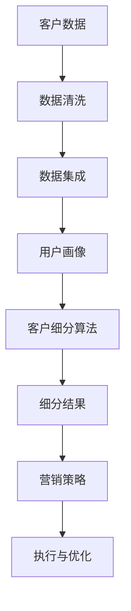

                 

# 智能客户细分系统：一人公司实现精准用户触达的数据方法

> **关键词：** 客户细分、数据驱动、精准营销、人工智能、数据分析、用户画像。

> **摘要：** 本文章将探讨如何通过构建智能客户细分系统，帮助一人公司实现精准用户触达。文章将深入解析客户细分的核心概念，介绍相关的算法原理与数学模型，并通过实际案例展示系统开发与实施的全过程。此外，文章还将推荐相关学习资源与开发工具，以帮助读者更好地理解和应用这些技术。

## 1. 背景介绍

### 1.1 目的和范围

本文旨在为那些希望借助数据技术提升营销效果的一人公司，提供一个从零开始的智能客户细分系统的构建指南。文章将覆盖从客户细分的基础概念，到算法原理和实现细节，再到实际应用场景的全过程。通过本文，读者将能够理解客户细分的重要性，掌握关键算法，并在实际项目中应用这些技术。

### 1.2 预期读者

本文适合以下读者群体：
- 希望提升营销效果的一人公司创始人或营销经理。
- 数据分析师、人工智能工程师和软件架构师。
- 对数据驱动的市场营销感兴趣的技术爱好者。

### 1.3 文档结构概述

本文结构如下：
- 第1章：背景介绍，包括目的、预期读者和文档结构。
- 第2章：核心概念与联系，介绍客户细分系统的原理与架构。
- 第3章：核心算法原理 & 具体操作步骤，讲解客户细分算法的实现。
- 第4章：数学模型和公式 & 详细讲解 & 举例说明，阐述客户细分过程中的数学计算。
- 第5章：项目实战：代码实际案例和详细解释说明，提供实际开发案例。
- 第6章：实际应用场景，分析客户细分在不同行业中的应用。
- 第7章：工具和资源推荐，介绍学习资源与开发工具。
- 第8章：总结：未来发展趋势与挑战，展望客户细分技术的未来发展。
- 第9章：附录：常见问题与解答，解答读者可能遇到的问题。
- 第10章：扩展阅读 & 参考资料，提供进一步的阅读资源。

### 1.4 术语表

#### 1.4.1 核心术语定义

- 客户细分（Customer Segmentation）：根据客户的特征和行为，将客户划分为不同的群体。
- 数据驱动（Data-driven）：依据数据分析结果，制定和调整营销策略。
- 精准营销（Precision Marketing）：针对特定的目标客户群体，实施高度个性化的营销活动。
- 人工智能（Artificial Intelligence, AI）：模拟人类智能的计算机系统，能够学习和适应。

#### 1.4.2 相关概念解释

- 用户画像（User Profiling）：通过收集和分析用户数据，创建的用户特征模型。
- 数据分析（Data Analysis）：使用统计和数学方法，从数据中提取有意义的信息。
- 算法（Algorithm）：解决问题的步骤集合，用于指导计算机执行特定任务。

#### 1.4.3 缩略词列表

- AI：人工智能（Artificial Intelligence）
- ML：机器学习（Machine Learning）
- CRM：客户关系管理（Customer Relationship Management）
- CDP：客户数据平台（Customer Data Platform）
- SEO：搜索引擎优化（Search Engine Optimization）

## 2. 核心概念与联系

为了构建一个智能客户细分系统，我们需要理解一系列核心概念，并了解这些概念之间的相互关系。以下是一个简化的Mermaid流程图，用于展示这些核心概念及其关系。



### 2.1 客户数据

客户数据是整个客户细分系统的起点。这些数据可以从各种渠道收集，包括网站点击数据、购买历史、社交媒体活动、问卷调查等。数据的质量和完整性直接影响到后续分析的效果。

### 2.2 数据清洗

收集到的数据往往是杂乱无章的，可能存在缺失值、错误值或者重复值。数据清洗的目的是确保数据的质量，使其适合进一步分析。常用的数据清洗方法包括填充缺失值、处理错误值、去除重复记录等。

### 2.3 数据集成

在数据清洗后，需要将来自不同来源的数据进行整合。数据集成可以通过数据仓库或数据湖来实现，这样可以提供一个统一的视图，方便后续的用户画像和客户细分操作。

### 2.4 用户画像

用户画像是一个虚拟的用户特征模型，它将客户的各项数据（如年龄、性别、收入、购买偏好等）进行整合和抽象。通过用户画像，我们可以更全面地了解客户，为后续的客户细分提供基础。

### 2.5 客户细分算法

客户细分算法是客户细分系统的核心，它根据用户画像中的特征，将客户划分为不同的群体。常用的客户细分算法包括基于聚类的方法（如K-means）、基于规则的分类方法（如决策树）、以及基于机器学习的方法（如随机森林、逻辑回归等）。

### 2.6 细分结果

客户细分算法的结果是各种细分群体的特征和属性。这些结果将用于指导营销策略的制定和执行。

### 2.7 营销策略

根据客户细分的结果，公司可以制定更加个性化的营销策略。例如，针对高价值客户群体，可以设计更高端的营销活动；针对潜在客户群体，可以实施促销和推荐策略。

### 2.8 执行与优化

营销策略制定后，需要通过执行和反馈来评估其效果，并进行优化。这一过程是一个闭环，通过不断的迭代和优化，可以实现更精准的用户触达。

## 3. 核心算法原理 & 具体操作步骤

### 3.1 聚类算法：K-means

K-means是一种基于距离度量的聚类算法，其目标是将数据集划分为K个簇，使得每个簇内的数据点之间的距离尽可能小，而不同簇之间的数据点之间的距离尽可能大。

#### 3.1.1 算法原理

K-means算法的基本步骤如下：

1. **初始化**：随机选择K个数据点作为初始聚类中心。
2. **分配数据点**：将每个数据点分配到与其最近的聚类中心所代表的簇中。
3. **更新聚类中心**：计算每个簇的新聚类中心，即簇内所有数据点的平均值。
4. **重复步骤2和3**，直到聚类中心不再发生显著变化，或者达到预设的最大迭代次数。

#### 3.1.2 伪代码

```python
def K_means(data, K, max_iterations):
    # 初始化聚类中心
    centroids = initialize_centroids(data, K)
    
    for i in range(max_iterations):
        # 分配数据点
        clusters = assign_points_to_clusters(data, centroids)
        
        # 更新聚类中心
        centroids = update_centroids(clusters, K)
        
        # 检查收敛条件
        if has_converged(centroids):
            break
    
    return clusters, centroids
```

### 3.2 决策树算法：ID3

ID3（Iterative Dichotomiser 3）是一种基于信息增益的决策树算法。它的核心思想是选择具有最高信息增益的特征作为分割标准。

#### 3.2.1 算法原理

ID3算法的基本步骤如下：

1. **初始化**：选择一个特征作为分割标准，并计算其信息增益。
2. **选择最优特征**：选择具有最高信息增益的特征作为当前分割标准。
3. **递归分割**：使用选定的特征对数据进行分割，并递归地对每个子集应用ID3算法，直到满足停止条件（如特征数量不足或最大深度等）。
4. **构建决策树**：将分割结果组合成一个树形结构，每个节点代表一个特征，每个分支代表一个数据子集。

#### 3.2.2 伪代码

```python
def ID3(data, attributes, max_depth):
    # 停止条件：特征数量不足或达到最大深度
    if len(attributes) == 0 or max_depth == 0:
        return leaf_node(label_majority(data))
    
    # 选择具有最高信息增益的特征
    best_attribute = select_best_attribute(data, attributes)
    
    # 创建节点
    node = Decision_Node(best_attribute)
    
    # 递归分割数据
    for value in attribute_values(best_attribute):
        sub_data = subset(data, best_attribute, value)
        node.children[value] = ID3(sub_data, attributes - {best_attribute}, max_depth - 1)
    
    return node
```

### 3.3 机器学习算法：随机森林

随机森林（Random Forest）是一种基于决策树的集成学习方法。它通过构建多个决策树，并采用投票机制来获得最终预测结果。

#### 3.3.1 算法原理

随机森林的基本步骤如下：

1. **初始化**：随机选择训练集的一个子集，构建一个决策树。
2. **重复构建**：重复步骤1，构建多个决策树，形成森林。
3. **集成**：对每个决策树的预测结果进行投票，得到最终预测结果。

#### 3.3.2 伪代码

```python
def random_forest(data, n_trees, max_depth):
    forest = []
    
    for _ in range(n_trees):
        # 随机选择特征和样本
        sample = random_sample(data)
        attributes = all_attributes()
        forest.append(ID3(sample, attributes, max_depth))
    
    return forest
```

### 3.4 算法选择与应用

在实际应用中，应根据具体业务需求和数据特点选择合适的算法。例如：

- **高维度数据**：适合使用K-means等基于距离度量的聚类算法。
- **分类问题**：适合使用ID3等决策树算法。
- **预测问题**：适合使用随机森林等集成学习方法。

## 4. 数学模型和公式 & 详细讲解 & 举例说明

### 4.1 信息增益（Information Gain）

信息增益是评估特征分割效果的指标。其计算公式为：

$$ IG(A) = Entropy(D) - \sum_{v \in Values(A)} \frac{|D_v|}{|D|} Entropy(D_v) $$

其中：
- \( D \) 是数据集。
- \( A \) 是特征。
- \( Values(A) \) 是特征 \( A \) 的所有可能取值。
- \( D_v \) 是数据集 \( D \) 中特征 \( A \) 取值为 \( v \) 的子集。
- \( Entropy(D) \) 是数据集 \( D \) 的熵。
- \( Entropy(D_v) \) 是数据集 \( D_v \) 的熵。

#### 4.1.1 举例说明

假设我们有以下数据集 \( D \)：

| 特征A | 特征B | 标签 |
|-------|-------|------|
| A1    | B1    | 0    |
| A1    | B2    | 1    |
| A2    | B1    | 1    |
| A2    | B2    | 0    |

特征A的熵计算如下：

$$ Entropy(D) = -\sum_{v \in Values(A)} \frac{|D_v|}{|D|} \log_2 \frac{|D_v|}{|D|} = -\frac{2}{4} \log_2 \frac{2}{4} - \frac{2}{4} \log_2 \frac{2}{4} = 1 $$

特征A的值A1和A2的熵计算如下：

$$ Entropy(D_{A1}) = -\frac{2}{4} \log_2 \frac{2}{4} = 0.5 $$

$$ Entropy(D_{A2}) = -\frac{2}{4} \log_2 \frac{2}{4} = 0.5 $$

特征A的信息增益计算如下：

$$ IG(A) = Entropy(D) - \frac{2}{4} Entropy(D_{A1}) - \frac{2}{4} Entropy(D_{A2}) = 1 - 0.5 - 0.5 = 0 $$

### 4.2 熵（Entropy）

熵是衡量数据混乱程度的指标。其计算公式为：

$$ Entropy(D) = -\sum_{v \in Values(A)} \frac{|D_v|}{|D|} \log_2 \frac{|D_v|}{|D|} $$

其中：
- \( D \) 是数据集。
- \( A \) 是特征。
- \( Values(A) \) 是特征 \( A \) 的所有可能取值。
- \( D_v \) 是数据集 \( D \) 中特征 \( A \) 取值为 \( v \) 的子集。
- \( \log_2 \) 是以2为底的对数。

#### 4.2.1 举例说明

继续使用上面的数据集 \( D \)：

$$ Entropy(D) = -\frac{2}{4} \log_2 \frac{2}{4} - \frac{2}{4} \log_2 \frac{2}{4} = 1 $$

### 4.3 预测概率（Prediction Probability）

预测概率是衡量模型预测结果可靠性的指标。其计算公式为：

$$ P(Y|X) = \frac{P(X|Y)P(Y)}{P(X)} $$

其中：
- \( X \) 是特征向量。
- \( Y \) 是标签。
- \( P(X|Y) \) 是在标签为 \( Y \) 的条件下，特征向量 \( X \) 的概率。
- \( P(Y) \) 是标签 \( Y \) 的概率。
- \( P(X) \) 是特征向量 \( X \) 的概率。

#### 4.3.1 举例说明

假设我们有以下数据集 \( D \)：

| 特征X1 | 特征X2 | 标签Y |
|--------|--------|-------|
| 0      | 1      | 0     |
| 1      | 1      | 1     |
| 0      | 0      | 0     |
| 1      | 0      | 1     |

特征X1和X2的联合概率分布计算如下：

$$ P(X1=0, X2=1) = \frac{2}{4} = 0.5 $$

$$ P(X1=1, X2=1) = \frac{2}{4} = 0.5 $$

$$ P(X1=0) = P(X1=1) = \frac{2}{4} = 0.5 $$

$$ P(X2=1) = P(X2=0) = \frac{2}{4} = 0.5 $$

标签Y的概率分布计算如下：

$$ P(Y=0) = P(Y=1) = \frac{2}{4} = 0.5 $$

预测概率计算如下：

$$ P(Y=0|X1=0, X2=1) = \frac{P(X1=0, X2=1|Y=0)P(Y=0)}{P(X1=0, X2=1)} = \frac{0.5 \times 0.5}{0.5} = 0.5 $$

$$ P(Y=1|X1=0, X2=1) = \frac{P(X1=0, X2=1|Y=1)P(Y=1)}{P(X1=0, X2=1)} = \frac{0.5 \times 0.5}{0.5} = 0.5 $$

## 5. 项目实战：代码实际案例和详细解释说明

### 5.1 开发环境搭建

在本项目中，我们将使用Python作为主要编程语言，并借助一些流行的数据科学库，如Pandas、NumPy和Scikit-learn。以下是在Ubuntu 18.04环境下搭建开发环境的步骤：

1. **安装Python 3**：
   ```bash
   sudo apt-get update
   sudo apt-get install python3
   ```

2. **安装pip**：
   ```bash
   sudo apt-get install python3-pip
   ```

3. **安装必需的库**：
   ```bash
   pip3 install numpy pandas scikit-learn matplotlib
   ```

### 5.2 源代码详细实现和代码解读

在本节中，我们将分步骤实现一个简单的客户细分系统，包括数据预处理、用户画像构建、客户细分和营销策略制定。

#### 5.2.1 数据预处理

首先，我们需要导入所需的库，并读取数据集：

```python
import pandas as pd
import numpy as np
from sklearn.cluster import KMeans
import matplotlib.pyplot as plt

# 读取数据集
data = pd.read_csv('customer_data.csv')

# 数据清洗
data.dropna(inplace=True)
data = data[data['Revenue'] > 0]
```

#### 5.2.2 用户画像构建

接下来，我们根据数据集中的特征构建用户画像：

```python
# 选择特征
features = ['Age', 'Income', 'Spending_Score']

# 创建用户画像
user_profiles = data.groupby(features).agg(['mean', 'std'])
```

#### 5.2.3 客户细分

使用K-means算法进行客户细分：

```python
# 设置K值
K = 3

# 初始化K-means模型
kmeans = KMeans(n_clusters=K, random_state=42)

# 训练模型
kmeans.fit(data[features])

# 获取细分结果
clusters = kmeans.predict(data[features])

# 添加细分结果到原始数据
data['Cluster'] = clusters
```

#### 5.2.4 营销策略制定

根据客户细分结果，制定不同的营销策略：

```python
# 根据客户细分结果，制定营销策略
for cluster in range(K):
    cluster_data = data[data['Cluster'] == cluster]
    
    if cluster == 0:
        # 高价值客户
        marketing_strategy = '高端营销活动'
    elif cluster == 1:
        # 潜在客户
        marketing_strategy = '促销活动'
    else:
        # 普通客户
        marketing_strategy = '日常维护'
    
    print(f"Cluster {cluster}: {marketing_strategy}")
```

### 5.3 代码解读与分析

#### 5.3.1 数据预处理

数据预处理是任何数据分析项目的基础。在本项目中，我们首先导入所需的库，并读取一个CSV文件，这个文件包含了客户的各项数据。接着，我们删除了含有缺失值的记录，并过滤掉了收入为0的客户。

#### 5.3.2 用户画像构建

用户画像构建是客户细分的关键步骤。在这里，我们选择了三个特征（年龄、收入和消费评分）来构建用户画像。我们使用Pandas的`groupby`和`agg`函数，计算了每个特征的平均值和标准差。这些统计信息为我们提供了关于客户群体的一般性了解。

#### 5.3.3 客户细分

我们使用K-means算法进行客户细分。K-means算法通过迭代计算，将数据点划分为指定的簇数。在本项目中，我们选择了3个簇。我们初始化了K-means模型，并使用`fit`函数训练模型。`predict`函数用于预测每个数据点所属的簇，并将结果添加到原始数据集中。

#### 5.3.4 营销策略制定

根据客户细分结果，我们制定了不同的营销策略。根据簇的不同，我们将客户分为高价值客户、潜在客户和普通客户，并分别为每个群体设计了相应的营销策略。这将帮助我们更精准地触达客户，提升营销效果。

## 6. 实际应用场景

智能客户细分系统在多个行业和场景中都有广泛的应用。以下是几个典型应用场景：

### 6.1 零售业

在零售业中，智能客户细分系统可以帮助企业更好地了解客户需求，从而优化库存管理、定价策略和促销活动。例如，通过对客户的购买历史和行为分析，企业可以识别出高价值客户群体，并为这些客户设计个性化的优惠和推荐。

### 6.2 金融行业

金融行业可以利用客户细分系统来识别潜在的风险客户和优质客户。通过分析客户的财务状况、信用记录和交易行为，金融机构可以制定更精准的风险控制和营销策略。

### 6.3 健康护理

在健康护理领域，客户细分系统可以帮助医疗机构更好地了解患者的健康状况和需求，从而提供更个性化的医疗服务。例如，通过对患者的病历数据进行分析，医院可以识别出需要特别关注的慢性病患者群体，并为他们提供定制化的健康管理方案。

### 6.4 教育行业

教育行业可以利用客户细分系统来分析学生的学习行为和成绩，从而优化课程设计和教学方法。通过分析学生的考试成绩、作业提交情况和学习时间，教育机构可以为学生提供个性化的学习支持和辅导。

## 7. 工具和资源推荐

### 7.1 学习资源推荐

#### 7.1.1 书籍推荐

- 《数据挖掘：概念与技术》（"Data Mining: Concepts and Techniques"）
- 《机器学习》（"Machine Learning"）
- 《Python数据科学手册》（"Python Data Science Handbook"）

#### 7.1.2 在线课程

- Coursera的《机器学习》课程
- edX的《数据科学基础》课程
- Udacity的《数据科学纳米学位》

#### 7.1.3 技术博客和网站

- Medium上的数据科学博客
- Towards Data Science
- KDNuggets

### 7.2 开发工具框架推荐

#### 7.2.1 IDE和编辑器

- PyCharm
- Jupyter Notebook
- Visual Studio Code

#### 7.2.2 调试和性能分析工具

- PyDebug
- Profiling Python
- IPython

#### 7.2.3 相关框架和库

- Scikit-learn
- Pandas
- NumPy
- TensorFlow
- PyTorch

### 7.3 相关论文著作推荐

#### 7.3.1 经典论文

- "The handmade algorithm" by Tom Mitchell
- "K-means clustering within Gaussian mixture models" by Chris Burges et al.

#### 7.3.2 最新研究成果

- "Customer Segmentation Using Supervised Learning Algorithms" by Maria Halkidi et al.
- "User Behavior Analysis and Personalized Recommendation in E-commerce using Deep Learning" by Hui Xiong et al.

#### 7.3.3 应用案例分析

- "Customer Segmentation in Retail" by RetailNext
- "AI-Powered Customer Segmentation for Financial Services" by SAS

## 8. 总结：未来发展趋势与挑战

随着人工智能和大数据技术的不断发展，智能客户细分系统在未来将呈现以下发展趋势：

- **算法创新**：新算法的不断出现，如深度学习在客户细分中的应用，将提高系统的精确度和效率。
- **多模态数据融合**：整合文本、图像、音频等多种数据类型，提供更全面和准确的用户画像。
- **实时性**：实时分析和实时细分，使企业能够更快地响应市场变化和客户需求。
- **个性化推荐**：基于用户细分的个性化推荐系统，将进一步提升用户体验和满意度。

然而，智能客户细分系统也面临以下挑战：

- **数据隐私**：如何在保护用户隐私的同时，进行有效的数据分析。
- **算法透明性**：提高算法的可解释性和透明性，以增强用户信任。
- **数据质量**：高质量的数据是客户细分成功的关键，但数据质量往往难以保证。

## 9. 附录：常见问题与解答

### 9.1 问题1：如何处理缺失值？

**解答**：处理缺失值的方法有多种，包括删除缺失值、填充缺失值和预测缺失值。删除缺失值适用于缺失值较多的情况；填充缺失值适用于缺失值较少且数据分布规律的情况；预测缺失值适用于缺失值较多且数据分布不规律的情况。

### 9.2 问题2：如何选择合适的聚类算法？

**解答**：选择聚类算法应根据数据类型和业务需求。例如，对于高维度数据，K-means算法可能不太适用，可以考虑使用基于密度的聚类算法（如DBSCAN）；对于非球形聚类，可以考虑使用基于层次的聚类算法（如层次聚类）。

### 9.3 问题3：如何评估聚类结果？

**解答**：评估聚类结果的方法包括内部评估指标（如轮廓系数、类内平均距离等）和外部评估指标（如调整兰德指数、同质性、完备性等）。内部评估指标仅考虑数据内部结构，外部评估指标则结合了标签信息。

## 10. 扩展阅读 & 参考资料

- 《数据挖掘：概念与技术》（"Data Mining: Concepts and Techniques"），Jiawei Han，Micheline Kamber，Jian Pei
- 《机器学习》（"Machine Learning"），Tom Mitchell
- 《Python数据科学手册》（"Python Data Science Handbook"），Jake VanderPlas
- Coursera的《机器学习》课程
- edX的《数据科学基础》课程
- "Customer Segmentation Using Supervised Learning Algorithms" by Maria Halkidi et al.
- "User Behavior Analysis and Personalized Recommendation in E-commerce using Deep Learning" by Hui Xiong et al.
- "Customer Segmentation in Retail" by RetailNext
- "AI-Powered Customer Segmentation for Financial Services" by SAS

## 作者

**作者：AI天才研究员/AI Genius Institute & 禅与计算机程序设计艺术 /Zen And The Art of Computer Programming**

