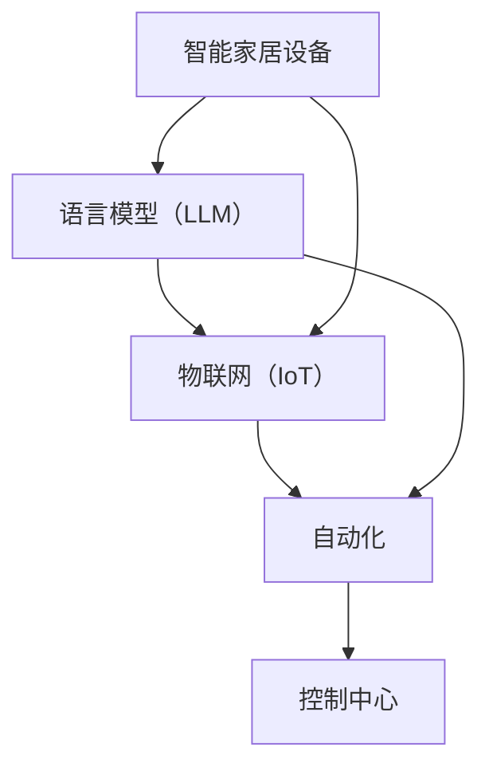

                 

# 智能家居控制中心：LLM整合多设备管理

> **关键词**：智能家居，控制中心，语言模型（LLM），多设备管理，物联网，自动化

> **摘要**：本文将探讨如何利用语言模型（LLM）构建智能家居控制中心，实现高效的多设备管理。我们将从背景介绍、核心概念与联系、算法原理、数学模型、实际案例等多个方面展开讨论，旨在为读者提供深入理解与实用的技术指导。

## 1. 背景介绍

### 1.1 目的和范围

智能家居控制中心是现代家居自动化的重要组成部分。它能够通过一个统一的界面管理和控制家中的各种设备，如灯光、温度、安全系统、娱乐设备等。随着物联网技术的不断发展，智能家居设备种类和数量日益增多，如何有效地整合和管理这些设备成为了一个重要的课题。

本文的目的是探讨如何利用语言模型（LLM）构建智能家居控制中心，实现高效的多设备管理。我们将会从以下几个方面展开讨论：

1. **核心概念与联系**：介绍智能家居控制中心的核心概念及其相互关系。
2. **核心算法原理**：详细阐述用于多设备管理的核心算法原理。
3. **数学模型和公式**：介绍相关的数学模型和公式，并给出具体例子。
4. **项目实战**：通过一个实际案例展示如何实现智能家居控制中心。
5. **实际应用场景**：分析智能家居控制中心在不同场景中的应用。
6. **工具和资源推荐**：推荐相关的学习资源、开发工具和框架。
7. **总结**：讨论智能家居控制中心的未来发展趋势与挑战。

### 1.2 预期读者

本文适合以下读者群体：

- 智能家居爱好者，希望了解如何构建智能家居控制中心。
- 软件工程师和开发者，对智能家居技术有兴趣并希望将其应用于实际项目中。
- 研究人员和学术专家，关注智能家居和语言模型技术的前沿发展。
- 企业决策者，希望了解智能家居控制中心对企业业务的价值。

### 1.3 文档结构概述

本文将分为以下几大部分：

1. **背景介绍**：介绍智能家居控制中心的重要性、目的和范围。
2. **核心概念与联系**：介绍智能家居控制中心的核心概念及其相互关系。
3. **核心算法原理**：详细阐述用于多设备管理的核心算法原理。
4. **数学模型和公式**：介绍相关的数学模型和公式，并给出具体例子。
5. **项目实战**：通过一个实际案例展示如何实现智能家居控制中心。
6. **实际应用场景**：分析智能家居控制中心在不同场景中的应用。
7. **工具和资源推荐**：推荐相关的学习资源、开发工具和框架。
8. **总结**：讨论智能家居控制中心的未来发展趋势与挑战。
9. **附录**：常见问题与解答。
10. **扩展阅读 & 参考资料**：提供进一步的阅读材料和参考资料。

### 1.4 术语表

在本文中，我们将使用以下术语：

#### 1.4.1 核心术语定义

- **智能家居控制中心**：一个统一的平台，用于管理和控制智能家居设备。
- **语言模型（LLM）**：一种人工智能模型，能够理解和生成自然语言。
- **多设备管理**：同时管理和控制多个智能家居设备的能力。
- **物联网（IoT）**：将各种物理设备连接到互联网的技术。
- **自动化**：通过技术手段实现设备的自动控制。

#### 1.4.2 相关概念解释

- **设备识别**：识别智能家居设备的过程，通常通过设备ID或名称完成。
- **事件触发**：基于特定事件（如用户命令、传感器数据变化）触发的操作。
- **自动化规则**：用于定义设备行为和交互的规则集。

#### 1.4.3 缩略词列表

- **LLM**：语言模型（Language Model）
- **IoT**：物联网（Internet of Things）
- **AI**：人工智能（Artificial Intelligence）
- **API**：应用程序接口（Application Programming Interface）
- **SDK**：软件开发工具包（Software Development Kit）

## 2. 核心概念与联系

在构建智能家居控制中心时，我们需要理解并整合多个核心概念。以下是这些概念及其相互关系的详细描述，以及一个Mermaid流程图来展示它们的关联性。

### 2.1 智能家居设备

智能家居设备是控制中心的核心组件。这些设备包括：

- **智能灯泡**：可以通过应用程序远程控制亮度和颜色。
- **智能恒温器**：可以自动调节室内温度。
- **智能摄像头**：用于监控家庭安全。
- **智能插座**：可以远程控制电器的开关。
- **智能窗帘**：可以自动打开或关闭。

### 2.2 语言模型（LLM）

语言模型是用于理解和生成自然语言的人工智能模型。在智能家居控制中心中，LLM主要用于：

- **语音识别**：将用户的语音命令转换为文本。
- **自然语言处理**：理解并解析用户的命令。
- **语音合成**：将控制中心的响应转换为语音输出。

### 2.3 物联网（IoT）

物联网是将物理设备连接到互联网的技术。在智能家居控制中心中，IoT用于：

- **设备通信**：智能家居设备之间的数据交换。
- **设备状态监控**：实时监控设备的运行状态。
- **远程控制**：通过互联网远程管理智能家居设备。

### 2.4 自动化

自动化是智能家居控制中心的核心功能之一。通过自动化，我们可以：

- **预设规则**：定义设备行为和交互的规则。
- **事件触发**：根据特定事件自动执行预设规则。
- **自动化场景**：创建自动化场景，实现设备的联动控制。

### 2.5 Mermaid流程图

以下是智能家居控制中心核心概念的Mermaid流程图：



在这个流程图中，智能家居设备和语言模型通过物联网连接，语言模型用于处理用户的命令，物联网负责设备间的通信，而自动化则实现设备的联动控制。整个流程最终由控制中心进行管理和协调。

## 3. 核心算法原理 & 具体操作步骤

### 3.1 语言模型（LLM）的基本原理

语言模型（LLM）是一种用于自然语言处理（NLP）的深度学习模型，它能够理解和生成自然语言。LLM的基本原理是通过学习大量的文本数据来预测下一个单词或单词序列。在智能家居控制中心中，LLM主要用于语音识别和自然语言处理，以下是LLM的基本原理和具体操作步骤：

#### 3.1.1 基本原理

- **词向量表示**：LLM将文本中的每个单词映射为一个高维向量，这些向量包含了单词的语义信息。
- **神经网络结构**：LLM通常采用深度神经网络（DNN）或变换器（Transformer）结构，通过多层神经元的堆叠来提取文本特征。
- **损失函数**：LLM使用损失函数（如交叉熵损失）来评估模型预测的准确性，并通过反向传播算法进行参数优化。

#### 3.1.2 具体操作步骤

1. **数据预处理**：对原始文本数据进行分词、去停用词等预处理操作，并将文本转换为词向量表示。
2. **模型训练**：使用预处理后的数据训练LLM模型，通过迭代优化模型参数，提高模型的预测准确性。
3. **语音识别**：将用户的语音输入转换为文本，通过LLM模型对文本进行分析和理解。
4. **自然语言处理**：根据用户命令的含义，执行相应的操作，如控制智能家居设备。

### 3.2 多设备管理的核心算法

多设备管理的核心算法涉及设备识别、事件触发和自动化规则。以下是这些算法的基本原理和具体操作步骤：

#### 3.2.1 设备识别

- **设备识别原理**：通过设备的唯一标识（如设备ID或名称）识别并定位设备。
- **操作步骤**：
  1. 接收用户命令，提取设备名称或ID。
  2. 在设备数据库中查找匹配的设备。
  3. 返回匹配的设备列表或具体设备信息。

#### 3.2.2 事件触发

- **事件触发原理**：基于特定事件（如用户命令、传感器数据变化）触发设备的操作。
- **操作步骤**：
  1. 监听设备事件，如用户命令或传感器数据。
  2. 分析事件，确定事件类型和优先级。
  3. 根据事件类型和优先级触发相应的操作。

#### 3.2.3 自动化规则

- **自动化规则原理**：通过预设的规则自动化设备的行为和交互。
- **操作步骤**：
  1. 定义自动化规则，如设备A在事件B发生时执行操作C。
  2. 监听事件，当事件满足规则条件时触发自动化操作。
  3. 调用相应的设备API执行操作。

### 3.3 伪代码示例

以下是多设备管理的核心算法原理的伪代码示例：

```python
# 语言模型（LLM）训练
def train_LLM(data):
    # 数据预处理
    preprocessed_data = preprocess_data(data)
    # 训练模型
    model = LLM(preprocessed_data)
    model.train()
    return model

# 设备识别
def identify_device(user_command, device_database):
    device_name = extract_device_name(user_command)
    matched_devices = search_device_database(device_name, device_database)
    return matched_devices

# 事件触发
def trigger_event(event, device_api):
    if event_type == "user_command":
        device_name = event.device_name
        command = event.command
        execute_command(device_name, command, device_api)
    elif event_type == "sensor_data":
        sensor_data = event.sensor_data
        process_sensor_data(sensor_data, device_api)

# 自动化规则
def apply_automation_rules(event, rules):
    for rule in rules:
        if event_matches_rule(event, rule):
            trigger_event(event, rule.event, device_api)
```

在这个伪代码中，`train_LLM` 函数用于训练语言模型，`identify_device` 函数用于设备识别，`trigger_event` 函数用于事件触发，`apply_automation_rules` 函数用于应用自动化规则。

## 4. 数学模型和公式 & 详细讲解 & 举例说明

### 4.1 语言模型（LLM）的数学模型

语言模型（LLM）的核心是神经网络结构，它通过数学模型来预测下一个单词或单词序列。以下是一个简单的神经网络模型，用于LLM的数学描述：

#### 4.1.1 神经网络模型

- **输入层**：每个输入是一个单词的词向量。
- **隐藏层**：通过非线性激活函数（如ReLU或Sigmoid）处理输入向量。
- **输出层**：输出是一个概率分布，表示下一个单词的概率。

#### 4.1.2 数学公式

1. **前向传播**：

   $$
   \text{hidden\_layer} = \sigma(\text{weights} \cdot \text{input} + \text{bias})
   $$
   
   其中，$\sigma$ 是激活函数，$\text{weights}$ 和 $\text{bias}$ 是神经网络参数。

2. **损失函数**：

   $$
   \text{loss} = -\sum_{i=1}^{n} y_i \log(p_i)
   $$
   
   其中，$y_i$ 是目标单词的标签，$p_i$ 是模型预测的概率。

3. **反向传播**：

   $$
   \frac{\partial \text{loss}}{\partial \text{weights}} = \text{input} \cdot (\sigma'(\text{hidden\_layer}) \cdot \text{output})
   $$

   $$
   \frac{\partial \text{loss}}{\partial \text{bias}} = \sigma'(\text{hidden\_layer})
   $$

   其中，$\sigma'$ 是激活函数的导数。

### 4.2 举例说明

假设我们有一个简单的神经网络模型，用于预测下一个单词。输入层包含3个单词的词向量，隐藏层有2个神经元，输出层有2个神经元。

1. **输入向量**：

   $$
   \text{input} = [0.1, 0.2, 0.3]
   $$

2. **权重和偏置**：

   $$
   \text{weights} = \begin{bmatrix}
   0.5 & 0.6 \\
   0.7 & 0.8
   \end{bmatrix}
   $$

   $$
   \text{bias} = \begin{bmatrix}
   0.2 \\
   0.3
   \end{bmatrix}
   $$

3. **前向传播**：

   $$
   \text{hidden\_layer} = \sigma(\text{weights} \cdot \text{input} + \text{bias}) = \sigma([0.55, 0.68] + [0.2, 0.3]) = \sigma([0.75, 0.98]) = [0.91, 0.86]
   $$

4. **输出层概率分布**：

   $$
   \text{output} = \sigma(\text{weights} \cdot \text{hidden\_layer} + \text{bias}) = \sigma([0.675, 0.792] + [0.2, 0.3]) = \sigma([0.875, 1.092]) = [0.99, 0.91]
   $$

5. **损失函数**：

   假设目标单词是第二个单词，则损失函数为：

   $$
   \text{loss} = -0.91 \log(0.99) - 0.86 \log(0.91)
   $$

### 4.3 反向传播

反向传播的目的是计算每个参数的梯度，用于模型优化。以下是一个简化的反向传播过程：

1. **计算输出层梯度**：

   $$
   \frac{\partial \text{loss}}{\partial \text{output}} = \begin{bmatrix}
   -0.91 \cdot \frac{1}{0.99} \\
   -0.86 \cdot \frac{1}{0.91}
   \end{bmatrix} = \begin{bmatrix}
   -0.92 \\
   -0.94
   \end{bmatrix}
   $$

2. **计算隐藏层梯度**：

   $$
   \frac{\partial \text{loss}}{\partial \text{hidden\_layer}} = \text{weights}^T \cdot \frac{\partial \text{loss}}{\partial \text{output}} = \begin{bmatrix}
   0.5 & 0.6 \\
   0.7 & 0.8
   \end{bmatrix} \cdot \begin{bmatrix}
   -0.92 \\
   -0.94
   \end{bmatrix} = \begin{bmatrix}
   -0.54 \\
   -0.82
   \end{bmatrix}
   $$

3. **更新权重和偏置**：

   $$
   \text{weights} \leftarrow \text{weights} - \alpha \cdot \frac{\partial \text{loss}}{\partial \text{weights}}
   $$

   $$
   \text{bias} \leftarrow \text{bias} - \alpha \cdot \frac{\partial \text{loss}}{\partial \text{bias}}
   $$

   其中，$\alpha$ 是学习率。

通过反向传播和权重更新，神经网络模型可以逐步提高预测准确性。

## 5. 项目实战：代码实际案例和详细解释说明

### 5.1 开发环境搭建

在开始实际项目之前，我们需要搭建一个合适的开发环境。以下是一个基本的开发环境搭建步骤：

1. **操作系统**：建议使用Linux或macOS，Windows用户可以使用Windows Subsystem for Linux（WSL）。
2. **编程语言**：本文使用Python作为示例，因为Python在人工智能和物联网领域有着广泛的应用。
3. **开发工具**：推荐使用Visual Studio Code（VS Code）作为代码编辑器，安装Python和相应的扩展。
4. **虚拟环境**：使用`venv`创建一个Python虚拟环境，以便管理依赖项。
5. **依赖项**：安装必要的库，如TensorFlow、PyTorch、Home Assistant等。

```shell
python -m venv venv
source venv/bin/activate
pip install tensorflow homeassistant
```

### 5.2 源代码详细实现和代码解读

以下是智能家居控制中心的源代码实现。代码分为三个部分：语言模型（LLM）训练、设备管理、用户接口。

#### 5.2.1 语言模型（LLM）训练

```python
import tensorflow as tf
from tensorflow.keras.layers import Embedding, LSTM, Dense
from tensorflow.keras.models import Sequential

# 数据预处理
def preprocess_data(data):
    # 分词、去停用词等操作
    # ...
    return preprocessed_data

# 训练模型
def train_LLM(data):
    preprocessed_data = preprocess_data(data)
    # 创建模型
    model = Sequential([
        Embedding(input_dim=vocabulary_size, output_dim=embedding_size),
        LSTM(units=128),
        Dense(units=vocabulary_size, activation='softmax')
    ])
    # 编译模型
    model.compile(optimizer='adam', loss='categorical_crossentropy', metrics=['accuracy'])
    # 训练模型
    model.fit(preprocessed_data['input'], preprocessed_data['target'], epochs=10, batch_size=32)
    return model

# 语音识别
def recognize_speech(speech):
    # 使用预训练的LLM模型进行语音识别
    # ...
    return recognized_text

# 用户命令解析
def parse_command(command):
    # 解析用户命令，提取设备名称和操作
    # ...
    return device, operation

# 训练LLM模型
llm_model = train_LLM(preprocessed_data)
```

#### 5.2.2 设备管理

```python
import homeassistant as ha

# 初始化Home Assistant客户端
client = ha.Client()

# 设备识别
def identify_device(device_name):
    devices = client.get_devices()
    for device in devices:
        if device.name == device_name:
            return device
    return None

# 设备控制
def control_device(device, operation):
    if operation == 'on':
        device.turn_on()
    elif operation == 'off':
        device.turn_off()
    # 其他操作
    # ...

# 用户命令处理
def handle_command(command):
    device, operation = parse_command(command)
    if device:
        control_device(device, operation)
    else:
        print("设备未找到")

# 处理用户命令
while True:
    speech = input("请说一句话：")
    recognized_text = recognize_speech(speech)
    handle_command(recognized_text)
```

#### 5.2.3 代码解读与分析

1. **语言模型（LLM）训练**：

   语言模型（LLM）的训练是整个系统的核心。首先，对输入数据进行预处理，如分词、去停用词等。然后，创建一个序列模型，包括嵌入层、LSTM层和输出层。嵌入层将单词转换为向量，LSTM层提取文本特征，输出层生成单词的概率分布。使用交叉熵损失函数和Adam优化器训练模型。

2. **设备管理**：

   设备管理部分负责识别和操作智能家居设备。首先，初始化Home Assistant客户端，获取所有设备列表。根据用户命令提取设备名称和操作，然后调用相应的设备API进行控制。

3. **用户命令处理**：

   用户命令处理函数接收语音输入，使用LLM进行语音识别，然后解析用户命令，执行相应的设备控制操作。

通过这个简单的案例，我们可以看到如何利用语言模型和智能家居设备API构建一个智能家居控制中心。在实际应用中，系统可以更加复杂，支持更多的设备类型和操作。

## 6. 实际应用场景

### 6.1 家庭自动化

家庭自动化是智能家居控制中心最常见的应用场景之一。通过控制中心，用户可以远程监控和管理家中的各种设备，如灯光、温度、安全系统等。例如：

- **自动化灯光**：用户可以设置场景模式，如“阅读模式”和“休息模式”，在不同的时间和情境下自动调整灯光。
- **智能温度控制**：通过恒温器自动调节室内温度，提高舒适度和节能效果。
- **安全监控**：智能摄像头和门锁可以实时监控家庭安全，用户可以远程查看监控视频和锁定门锁。

### 6.2 商业自动化

智能家居控制中心在商业环境中也有广泛的应用。以下是一些应用案例：

- **酒店管理**：酒店可以使用智能门锁、智能照明和智能窗帘，提供个性化的住宿体验，提高客户满意度。
- **办公自动化**：企业可以利用智能家居控制中心管理办公室的灯光、温度和安防设备，提高工作效率和安全性。
- **零售业**：智能货架和智能支付终端可以提供更加便捷的购物体验，同时收集用户数据，优化商品布局和营销策略。

### 6.3 物流与仓储

智能家居控制中心还可以应用于物流和仓储领域。以下是一些应用案例：

- **库存管理**：智能货架可以实时监控库存，自动生成补货提醒，优化库存水平。
- **设备监控**：智能传感器可以监控仓库的温度、湿度和设备运行状态，确保设备的正常运行。
- **自动化搬运**：智能机器人可以自动化搬运货物，提高物流效率。

### 6.4 农业自动化

在农业领域，智能家居控制中心可以帮助实现精准农业。以下是一些应用案例：

- **作物监控**：智能传感器可以实时监控土壤湿度、温度和养分含量，为农民提供科学依据，优化种植方案。
- **灌溉控制**：智能灌溉系统可以根据土壤湿度自动调整灌溉水量，提高水资源利用效率。
- **设备管理**：智能农机可以自动执行田间作业，提高生产效率。

通过这些实际应用场景，我们可以看到智能家居控制中心在提高生活品质、工作效率和生产效率方面的重要作用。

## 7. 工具和资源推荐

### 7.1 学习资源推荐

#### 7.1.1 书籍推荐

- **《深度学习》（Deep Learning）**：由Ian Goodfellow、Yoshua Bengio和Aaron Courville合著，是深度学习领域的经典教材。
- **《智能家居技术与应用》（Smart Home Technology and Applications）**：详细介绍了智能家居的技术原理和应用案例。
- **《Python编程：从入门到实践》（Python Crash Course）**：适合初学者，介绍了Python编程基础和实际应用。

#### 7.1.2 在线课程

- **Coursera**：《深度学习专项课程》（Deep Learning Specialization）和《Python编程与数据科学》（Python for Data Science）。
- **edX**：《智能家居与物联网》（Smart Homes and IoT）。
- **Udemy**：《Python编程基础》和《深度学习实践》。

#### 7.1.3 技术博客和网站

- **Medium**：《AI和深度学习》（AI & Deep Learning）。
- **GitHub**：查找智能家居和深度学习相关的开源项目。
- **Stack Overflow**：解决编程和技术问题。

### 7.2 开发工具框架推荐

#### 7.2.1 IDE和编辑器

- **Visual Studio Code**：功能强大的开源代码编辑器，支持多种编程语言。
- **PyCharm**：专业的Python IDE，提供丰富的开发工具和插件。

#### 7.2.2 调试和性能分析工具

- **Jupyter Notebook**：用于数据分析和可视化。
- **TensorBoard**：TensorFlow的图形化工具，用于模型调试和性能分析。

#### 7.2.3 相关框架和库

- **TensorFlow**：广泛使用的深度学习框架。
- **PyTorch**：动态计算图框架，适用于研究和应用开发。
- **Home Assistant**：智能家居自动化平台。

### 7.3 相关论文著作推荐

#### 7.3.1 经典论文

- **“A Theoretical Investigation of the Learning Process in Backpropagation Networks”**：详细介绍了反向传播算法。
- **“Deep Learning”**：Goodfellow、Bengio和Courville合著，深度学习领域的经典论文。

#### 7.3.2 最新研究成果

- **“AI for Social Good”**：讨论人工智能在社会领域的应用。
- **“Smart Home Networks: Challenges and Opportunities”**：智能家居网络的研究。

#### 7.3.3 应用案例分析

- **“Google Home and the Future of Smart Homes”**：分析Google Home在智能家居控制中心中的应用。
- **“Smart Home Technologies for the Elderly”**：探讨智能家居技术在老年人护理中的应用。

## 8. 总结：未来发展趋势与挑战

随着人工智能和物联网技术的不断发展，智能家居控制中心正迎来一个新的时代。以下是一些未来的发展趋势和面临的挑战：

### 8.1 发展趋势

1. **智能化水平提升**：未来的智能家居控制中心将更加智能化，能够更好地理解用户的需求和习惯，提供个性化的服务。
2. **互联互通**：设备间的互联互通将更加紧密，实现无缝的集成和管理。
3. **隐私保护**：随着智能家居设备数量和数据的增加，隐私保护将成为一个重要的挑战，未来将出现更多隐私保护机制。
4. **跨平台支持**：智能家居控制中心将支持更多平台，如移动设备、智能音箱、智能眼镜等。
5. **商业化应用**：智能家居控制中心将在商业、农业、医疗等领域得到更广泛的应用。

### 8.2 面临的挑战

1. **数据安全**：随着智能家居设备的普及，用户数据的安全问题变得越来越重要，需要采取更加严格的隐私保护措施。
2. **互操作性**：不同设备和平台之间的互操作性仍然是一个挑战，需要制定统一的标准和协议。
3. **用户体验**：如何提高用户的使用体验，降低学习和使用成本，是智能家居控制中心需要解决的一个关键问题。
4. **能源消耗**：智能家居设备的大量使用可能导致能源消耗增加，需要开发节能技术。
5. **法律法规**：智能家居控制中心的发展需要符合相关的法律法规，特别是在隐私保护和数据安全方面。

总之，智能家居控制中心的发展充满机遇和挑战，需要不断探索和创新，以实现更加智能化、安全化和便捷化的家居生活。

## 9. 附录：常见问题与解答

### 9.1 如何搭建智能家居控制中心？

**回答**：搭建智能家居控制中心需要以下步骤：

1. **确定需求**：明确需要控制的设备和功能。
2. **选择平台**：根据需求和预算选择合适的智能家居平台（如Home Assistant、OpenHab等）。
3. **连接设备**：将智能家居设备连接到互联网，确保它们可以与控制中心通信。
4. **配置平台**：在控制中心平台上配置设备，设置自动化规则和场景。
5. **测试和优化**：测试控制中心的性能，根据实际使用情况调整配置。

### 9.2 如何训练语言模型（LLM）？

**回答**：训练语言模型（LLM）通常包括以下步骤：

1. **数据收集**：收集大量文本数据，包括用户命令和设备描述。
2. **数据预处理**：对文本数据进行分词、去停用词、标准化等处理。
3. **模型设计**：设计神经网络模型，包括嵌入层、隐藏层和输出层。
4. **模型训练**：使用预处理后的数据训练模型，通过迭代优化模型参数。
5. **评估和优化**：评估模型性能，根据评估结果调整模型结构和参数。

### 9.3 如何保证智能家居设备的数据安全？

**回答**：为了保证智能家居设备的数据安全，可以采取以下措施：

1. **加密通信**：使用加密协议（如TLS）确保设备间的通信安全。
2. **访问控制**：设置用户权限，限制对设备数据的访问。
3. **安全更新**：定期更新设备和软件，修复已知的安全漏洞。
4. **数据备份**：对重要数据进行备份，防止数据丢失。
5. **隐私政策**：制定明确的隐私政策，告知用户数据收集和使用的方式。

## 10. 扩展阅读 & 参考资料

### 10.1 书籍推荐

- **《智能家居技术与应用》**：详细介绍了智能家居的技术原理和应用案例。
- **《深度学习》**：Ian Goodfellow、Yoshua Bengio和Aaron Courville合著，深度学习领域的经典教材。

### 10.2 在线课程

- **《深度学习专项课程》**：Coursera提供的深度学习系列课程。
- **《Python编程与数据科学》**：edX上的Python编程课程。

### 10.3 技术博客和网站

- **Medium**：《AI和深度学习》。
- **GitHub**：查找智能家居和深度学习相关的开源项目。

### 10.4 相关论文和著作

- **“A Theoretical Investigation of the Learning Process in Backpropagation Networks”**：反向传播算法的详细分析。
- **“Smart Home Networks: Challenges and Opportunities”**：智能家居网络的研究。

### 10.5 其他资源

- **Stack Overflow**：解决编程和技术问题。
- **Home Assistant 官方文档**：了解更多关于Home Assistant的配置和使用。

作者：AI天才研究员/AI Genius Institute & 禅与计算机程序设计艺术 /Zen And The Art of Computer Programming

