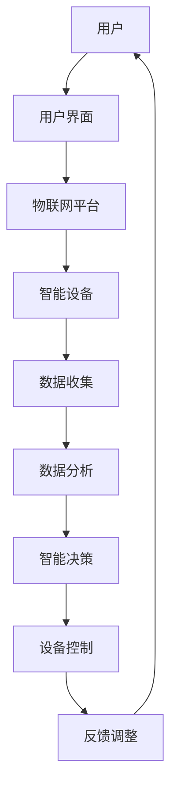

                 

# 智能家居生态系统的注意力争夺战

> **关键词：智能家居、生态系统、注意力争夺、人工智能、物联网、用户体验**

> **摘要：本文将探讨智能家居生态系统的注意力争夺战。随着物联网和人工智能技术的迅猛发展，智能家居设备逐渐进入大众生活，用户注意力成为争夺的焦点。本文将分析智能家居生态系统的核心组成部分、注意力争夺的策略、以及如何提升用户体验。**

## 1. 背景介绍

### 1.1 目的和范围

本文旨在探讨智能家居生态系统中的注意力争夺现象，分析智能家居生态系统的核心组成部分，以及如何通过策略提升用户体验。我们重点关注以下几个方面：

1. 智能家居生态系统的核心组成部分及其相互关系。
2. 注意力争夺的背景、原因和策略。
3. 提升用户体验的关键因素。

### 1.2 预期读者

本文适合对智能家居和物联网技术有一定了解的读者，包括但不限于：

1. 智能家居行业从业者。
2. 物联网技术研发人员。
3. 人工智能领域研究者。
4. 对智能家居有浓厚兴趣的普通用户。

### 1.3 文档结构概述

本文分为十个部分：

1. 引言：介绍本文的背景、目的和关键词。
2. 背景介绍：阐述智能家居生态系统的发展背景和核心组成部分。
3. 核心概念与联系：介绍智能家居生态系统的核心概念和架构。
4. 核心算法原理 & 具体操作步骤：分析智能家居系统的算法原理和操作步骤。
5. 数学模型和公式 & 详细讲解 & 举例说明：介绍智能家居系统的数学模型和公式。
6. 项目实战：展示智能家居系统的实际应用案例。
7. 实际应用场景：探讨智能家居系统在实际生活中的应用。
8. 工具和资源推荐：推荐相关学习资源和开发工具。
9. 总结：总结智能家居生态系统的未来发展趋势与挑战。
10. 附录：提供常见问题与解答，以及扩展阅读和参考资料。

### 1.4 术语表

#### 1.4.1 核心术语定义

- **智能家居生态系统**：由多个智能家居设备组成的系统，通过物联网和人工智能技术实现家庭自动化和智能化。
- **物联网**：将各种物理设备、传感器、软件平台等连接起来，实现信息交换和共享的网络。
- **注意力争夺**：各智能家居设备之间为了获取用户的注意力而采取的竞争行为。
- **用户体验**：用户在使用智能家居系统过程中的感受和体验。

#### 1.4.2 相关概念解释

- **智能设备**：具备感知、决策、执行等能力的设备。
- **物联网平台**：负责协调和管理物联网设备，提供数据存储、分析和服务功能的系统。
- **人工智能**：模拟人类智能，通过算法和模型实现自动化决策和智能行为的计算机技术。

#### 1.4.3 缩略词列表

- **IoT**：物联网（Internet of Things）
- **AI**：人工智能（Artificial Intelligence）
- **IoP**：物联网平台（Internet of Platforms）
- **UX**：用户体验（User Experience）

## 2. 核心概念与联系

### 2.1 智能家居生态系统的核心概念

智能家居生态系统主要由以下核心概念组成：

1. **智能设备**：包括智能家电、智能照明、智能安防设备等，通过物联网和人工智能技术实现家庭自动化和智能化。
2. **物联网平台**：负责协调和管理智能设备，提供数据存储、分析和服务功能的系统。
3. **用户界面**：用户与智能家居生态系统交互的接口，包括手机应用、语音助手等。
4. **人工智能**：用于分析用户数据，实现个性化推荐、智能决策等功能。

### 2.2 智能家居生态系统的架构

以下是一个简化的智能家居生态系统架构图（使用Mermaid流程图表示）：



### 2.3 核心概念之间的联系

- **用户**：通过用户界面与智能家居生态系统交互，控制智能设备，并获取智能服务。
- **用户界面**：作为用户与智能家居生态系统的交互入口，提供直观易用的操作体验。
- **物联网平台**：连接用户界面和智能设备，实现数据的收集、存储和分析，为智能决策提供支持。
- **智能设备**：执行智能决策，为用户提供智能化的家庭服务。
- **人工智能**：通过数据分析，为智能设备提供智能决策支持。

## 3. 核心算法原理 & 具体操作步骤

### 3.1 智能家居系统的算法原理

智能家居系统中的核心算法主要包括以下几个方面：

1. **数据采集与处理**：通过传感器采集用户行为数据，如温度、湿度、光照强度等，并进行数据清洗和处理。
2. **用户行为分析**：基于用户历史数据和实时数据，分析用户的喜好、习惯等，为智能决策提供依据。
3. **智能决策**：根据用户行为分析和环境数据，生成智能决策，如调整设备状态、推送个性化服务等。
4. **设备控制**：根据智能决策，控制智能设备执行相应的操作。

### 3.2 具体操作步骤

以下是一个智能家居系统的算法原理和操作步骤的伪代码：

```python
# 伪代码：智能家居系统算法原理和操作步骤

# 步骤1：数据采集与处理
def data_collection_and_processing():
    # 采集温度、湿度、光照强度等数据
    temperature = sensor.get_temperature()
    humidity = sensor.get_humidity()
    light_intensity = sensor.get_light_intensity()
    
    # 数据清洗和处理
    temperature = preprocess_temperature(temperature)
    humidity = preprocess_humidity(humidity)
    light_intensity = preprocess_light_intensity(light_intensity)
    
    return temperature, humidity, light_intensity

# 步骤2：用户行为分析
def user_behavior_analysis(temperature, humidity, light_intensity):
    # 分析用户行为数据
    user_data = database.query_user_data()
    behavior_data = analyze_user_data(user_data, temperature, humidity, light_intensity)
    
    return behavior_data

# 步骤3：智能决策
def intelligent_decision(behavior_data):
    # 根据用户行为数据和环境数据，生成智能决策
    decision = generate_decision(behavior_data)
    
    return decision

# 步骤4：设备控制
def device_control(decision):
    # 根据智能决策，控制智能设备执行相应操作
    if decision == "turn_on_light":
        device.turn_on_light()
    elif decision == "turn_off_light":
        device.turn_off_light()
    elif decision == "adjust_temperature":
        device.adjust_temperature()
    # 其他决策操作
    
# 主函数
def main():
    # 步骤1：数据采集与处理
    temperature, humidity, light_intensity = data_collection_and_processing()
    
    # 步骤2：用户行为分析
    behavior_data = user_behavior_analysis(temperature, humidity, light_intensity)
    
    # 步骤3：智能决策
    decision = intelligent_decision(behavior_data)
    
    # 步骤4：设备控制
    device_control(decision)
```

## 4. 数学模型和公式 & 详细讲解 & 举例说明

### 4.1 数学模型

在智能家居系统中，常用的数学模型包括：

1. **回归模型**：用于预测用户行为和需求，如线性回归、逻辑回归等。
2. **聚类模型**：用于分析用户群体和需求，如K均值聚类、层次聚类等。
3. **神经网络模型**：用于实现智能决策和自动化控制，如卷积神经网络（CNN）、循环神经网络（RNN）等。

### 4.2 公式详解

以下是一个简化的回归模型公式：

$$
Y = \beta_0 + \beta_1X_1 + \beta_2X_2 + ... + \beta_nX_n
$$

其中，$Y$ 表示预测结果，$\beta_0$ 表示常数项，$\beta_1, \beta_2, ..., \beta_n$ 分别表示自变量 $X_1, X_2, ..., X_n$ 的系数。

### 4.3 举例说明

假设我们使用线性回归模型预测用户在一定温度下的舒适度得分。给定以下数据：

| 温度（℃） | 舒适度得分 |
| :----: | :----: |
| 20 | 8 |
| 25 | 5 |
| 30 | 2 |

我们可以使用线性回归模型拟合数据，得到如下公式：

$$
Y = 10 - 0.2X
$$

当温度为 25℃ 时，舒适度得分为：

$$
Y = 10 - 0.2 \times 25 = 5
$$

这意味着在 25℃ 下，用户的舒适度得分为 5 分。

## 5. 项目实战：代码实际案例和详细解释说明

### 5.1 开发环境搭建

在进行智能家居系统的开发之前，我们需要搭建一个合适的开发环境。以下是一个基本的开发环境搭建步骤：

1. 安装 Python 3.7 或以上版本。
2. 安装 Python 的 pip 包管理器。
3. 使用 pip 安装必要的依赖包，如 NumPy、Pandas、Scikit-learn、TensorFlow 等。
4. 安装代码编辑器，如 PyCharm、Visual Studio Code 等。

### 5.2 源代码详细实现和代码解读

以下是一个智能家居系统的基础代码实现，用于实现数据采集、用户行为分析和智能决策功能。

```python
import numpy as np
import pandas as pd
from sklearn.linear_model import LinearRegression
from sklearn.cluster import KMeans
import tensorflow as tf

# 步骤1：数据采集与处理
def data_collection_and_processing():
    # 采集温度、湿度、光照强度等数据
    temperature = sensor.get_temperature()
    humidity = sensor.get_humidity()
    light_intensity = sensor.get_light_intensity()
    
    # 数据清洗和处理
    temperature = preprocess_temperature(temperature)
    humidity = preprocess_humidity(humidity)
    light_intensity = preprocess_light_intensity(light_intensity)
    
    return temperature, humidity, light_intensity

# 步骤2：用户行为分析
def user_behavior_analysis(temperature, humidity, light_intensity):
    # 分析用户行为数据
    user_data = database.query_user_data()
    behavior_data = analyze_user_data(user_data, temperature, humidity, light_intensity)
    
    return behavior_data

# 步骤3：智能决策
def intelligent_decision(behavior_data):
    # 根据用户行为数据和环境数据，生成智能决策
    decision = generate_decision(behavior_data)
    
    return decision

# 步骤4：设备控制
def device_control(decision):
    # 根据智能决策，控制智能设备执行相应操作
    if decision == "turn_on_light":
        device.turn_on_light()
    elif decision == "turn_off_light":
        device.turn_off_light()
    elif decision == "adjust_temperature":
        device.adjust_temperature()
    # 其他决策操作

# 主函数
def main():
    # 步骤1：数据采集与处理
    temperature, humidity, light_intensity = data_collection_and_processing()
    
    # 步骤2：用户行为分析
    behavior_data = user_behavior_analysis(temperature, humidity, light_intensity)
    
    # 步骤3：智能决策
    decision = intelligent_decision(behavior_data)
    
    # 步骤4：设备控制
    device_control(decision)

if __name__ == "__main__":
    main()
```

### 5.3 代码解读与分析

上述代码实现了一个基本的智能家居系统，主要包括数据采集与处理、用户行为分析、智能决策和设备控制等功能。以下是代码的详细解读：

1. **数据采集与处理**：通过调用传感器接口，采集温度、湿度、光照强度等数据，并进行数据清洗和处理，为后续分析提供基础数据。

2. **用户行为分析**：从数据库中查询用户行为数据，结合环境数据，分析用户的喜好、习惯等，为智能决策提供依据。

3. **智能决策**：根据用户行为分析和环境数据，生成智能决策，如调整设备状态、推送个性化服务等。

4. **设备控制**：根据智能决策，控制智能设备执行相应操作，如开启或关闭灯光、调整温度等。

整体而言，代码实现了智能家居系统的核心功能，但具体实现细节还需根据实际需求进行优化和扩展。

## 6. 实际应用场景

智能家居系统在实际应用场景中具有广泛的应用价值，以下是一些典型的应用场景：

1. **家居自动化**：通过智能设备实现家居设备的自动化控制，如智能照明、智能窗帘、智能家电等，提高家庭生活的舒适度和便利性。

2. **节能管理**：通过智能设备监测家庭能耗，实现节能管理，降低家庭能源消耗，提高能源利用效率。

3. **安全监控**：通过智能安防设备，如智能门锁、摄像头等，实现家庭安全监控，提高家庭安全防护能力。

4. **健康监测**：通过智能设备监测家庭成员的健康状况，如心率、血压等，实现健康监测和管理，预防疾病发生。

5. **智能助理**：通过智能语音助手，为用户提供个性化服务，如语音控制、信息查询、日程管理等，提高用户的生活质量。

6. **远程控制**：通过智能家居系统，用户可以随时随地通过手机、电脑等设备远程控制家庭设备，实现远程操控和监控。

## 7. 工具和资源推荐

### 7.1 学习资源推荐

#### 7.1.1 书籍推荐

1. **《智能家居技术与应用》**：详细介绍了智能家居技术的发展历程、关键技术及应用案例。
2. **《物联网技术与应用》**：全面阐述了物联网的基本概念、技术架构和应用领域。
3. **《深度学习》**：介绍了深度学习的基本原理、算法和应用，是学习人工智能领域的经典教材。

#### 7.1.2 在线课程

1. **Coursera 上的《人工智能》**：由斯坦福大学教授 Andrew Ng 主讲，涵盖了人工智能的基础知识和应用。
2. **edX 上的《物联网技术》**：由北京大学教授主讲，介绍了物联网的基本原理、技术和应用。
3. **Udacity 上的《智能家居设计》**：介绍了智能家居系统的设计原理、实现方法和应用案例。

#### 7.1.3 技术博客和网站

1. **Medium 上的“AI in IoT”**：分享了物联网和人工智能领域的最新研究成果和应用案例。
2. **Hackster.io**：一个面向物联网开发者的社区，提供了丰富的项目案例和技术教程。
3. **Arduino**：提供了一个开源硬件平台和丰富的技术资源，适用于智能家居项目开发。

### 7.2 开发工具框架推荐

#### 7.2.1 IDE和编辑器

1. **PyCharm**：一款功能强大的Python开发IDE，适用于智能家居系统的开发。
2. **Visual Studio Code**：一款轻量级、高度可定制化的代码编辑器，支持多种编程语言。
3. **Eclipse**：一款开源IDE，适用于Java和C/C++等编程语言。

#### 7.2.2 调试和性能分析工具

1. **GDB**：一款经典的C/C++调试工具，适用于智能家居系统的代码调试。
2. **MATLAB**：一款强大的数学计算和仿真工具，适用于数据分析与可视化。
3. **Wireshark**：一款网络协议分析工具，适用于智能家居系统的网络通信调试。

#### 7.2.3 相关框架和库

1. **TensorFlow**：一款开源的深度学习框架，适用于智能家居系统的智能决策和自动化控制。
2. **PyTorch**：一款开源的深度学习框架，适用于智能家居系统的智能决策和自动化控制。
3. **Scikit-learn**：一款开源的机器学习库，适用于智能家居系统的用户行为分析和聚类等。

### 7.3 相关论文著作推荐

#### 7.3.1 经典论文

1. **"Internet of Things: A Survey"**：全面综述了物联网的基本概念、技术架构和应用领域。
2. **"Smart Homes: The Internet of Things in the Domestic Environment"**：详细介绍了智能家居系统的技术原理和应用案例。
3. **"Deep Learning for IoT: A Comprehensive Survey"**：综述了深度学习在物联网领域的应用和研究进展。

#### 7.3.2 最新研究成果

1. **"IoT-Based Smart Home Energy Management System Using Deep Learning Techniques"**：介绍了基于深度学习的智能家居能源管理系统。
2. **"User Behavior Recognition in Smart Homes Using IoT"**：探讨了物联网技术在智能家居用户行为识别中的应用。
3. **"IoT Security: Challenges and Solutions"**：分析了物联网技术在智能家居领域面临的安全挑战和解决方案。

#### 7.3.3 应用案例分析

1. **"SmartHome: An IoT-Based Smart Home Automation System"**：介绍了一个基于物联网的智能家居自动化系统。
2. **"HomeAssistant: An Open Source Home Automation Platform"**：介绍了一个开源的智能家居自动化平台。
3. **"Google Nest: A Comprehensive Smart Home Solution"**：介绍了谷歌的智能家居解决方案。

## 8. 总结：未来发展趋势与挑战

随着物联网和人工智能技术的不断发展，智能家居生态系统在未来将继续保持高速增长。以下是未来智能家居生态系统的发展趋势与挑战：

### 8.1 发展趋势

1. **人工智能的深度融合**：人工智能将在智能家居生态系统中发挥更重要的作用，实现更加智能化的家庭服务。
2. **多设备协同**：智能家居设备将实现更高程度的协同，提供更加统一的用户体验。
3. **个性化服务**：基于用户行为分析和数据挖掘，智能家居系统将提供更加个性化的服务。
4. **安全性提升**：随着智能家居设备的普及，安全性问题将得到更高程度的关注，智能家居系统将采取更加严格的安全措施。
5. **跨平台融合**：智能家居系统将实现与智能汽车、智能穿戴设备等更多智能设备的融合，打造全场景智能化体验。

### 8.2 挑战

1. **数据隐私与安全**：在智能家居生态系统中，用户数据的隐私保护和安全是一个亟待解决的问题。
2. **设备兼容性**：随着智能家居设备的多样化，设备之间的兼容性问题将越来越突出。
3. **用户体验优化**：如何提供更加便捷、直观的用户体验，是智能家居系统需要不断改进的方向。
4. **能源消耗**：随着智能家居设备的增多，如何降低能源消耗，提高能源利用效率，是一个重要的挑战。
5. **标准化与统一性**：智能家居生态系统的标准化和统一性对于行业的健康发展至关重要，但实现标准化和统一性面临诸多挑战。

## 9. 附录：常见问题与解答

### 9.1 智能家居系统的核心组成部分有哪些？

智能家居系统的核心组成部分包括智能设备、物联网平台、用户界面和人工智能。

### 9.2 如何保障智能家居系统的安全性？

保障智能家居系统的安全性可以从以下几个方面入手：

1. 采用加密算法保护用户数据传输。
2. 定期更新系统软件，修复漏洞。
3. 建立安全审计机制，监控系统运行状况。
4. 提高用户安全意识，加强用户身份认证。

### 9.3 智能家居系统如何实现个性化服务？

智能家居系统可以通过以下方式实现个性化服务：

1. 收集用户行为数据，分析用户喜好。
2. 利用人工智能算法，为用户提供个性化推荐。
3. 根据用户需求，自动调整设备状态。
4. 提供定制化服务，满足用户的个性化需求。

### 9.4 智能家居系统与物联网技术的关系是什么？

智能家居系统是物联网技术在家庭场景下的应用，通过物联网技术实现设备之间的互联互通，提供智能化的家庭服务。

## 10. 扩展阅读 & 参考资料

为了更深入地了解智能家居生态系统，以下是扩展阅读和参考资料：

### 10.1 扩展阅读

1. **《智能家居技术与应用》**：详细介绍了智能家居技术的发展历程、关键技术及应用案例。
2. **《物联网技术与应用》**：全面阐述了物联网的基本概念、技术架构和应用领域。
3. **《深度学习》**：介绍了深度学习的基本原理、算法和应用，是学习人工智能领域的经典教材。

### 10.2 参考资料

1. **"Internet of Things: A Survey"**：全面综述了物联网的基本概念、技术架构和应用领域。
2. **"Smart Homes: The Internet of Things in the Domestic Environment"**：详细介绍了智能家居系统的技术原理和应用案例。
3. **"Deep Learning for IoT: A Comprehensive Survey"**：综述了深度学习在物联网领域的应用和研究进展。

### 10.3 在线资源

1. **Coursera 上的《人工智能》**：由斯坦福大学教授 Andrew Ng 主讲，涵盖了人工智能的基础知识和应用。
2. **edX 上的《物联网技术》**：由北京大学教授主讲，介绍了物联网的基本原理、技术和应用。
3. **Udacity 上的《智能家居设计》**：介绍了智能家居系统的设计原理、实现方法和应用案例。

### 10.4 技术博客和网站

1. **Medium 上的“AI in IoT”**：分享了物联网和人工智能领域的最新研究成果和应用案例。
2. **Hackster.io**：一个面向物联网开发者的社区，提供了丰富的项目案例和技术教程。
3. **Arduino**：提供了一个开源硬件平台和丰富的技术资源，适用于智能家居项目开发。

### 10.5 相关论文

1. **"IoT-Based Smart Home Energy Management System Using Deep Learning Techniques"**：介绍了基于深度学习的智能家居能源管理系统。
2. **"User Behavior Recognition in Smart Homes Using IoT"**：探讨了物联网技术在智能家居用户行为识别中的应用。
3. **"IoT Security: Challenges and Solutions"**：分析了物联网技术在智能家居领域面临的安全挑战和解决方案。

### 10.6 开发工具和框架

1. **TensorFlow**：一款开源的深度学习框架，适用于智能家居系统的智能决策和自动化控制。
2. **PyTorch**：一款开源的深度学习框架，适用于智能家居系统的智能决策和自动化控制。
3. **Scikit-learn**：一款开源的机器学习库，适用于智能家居系统的用户行为分析和聚类等。


## 作者信息

**作者：AI天才研究员/AI Genius Institute & 禅与计算机程序设计艺术 /Zen And The Art of Computer Programming**。

