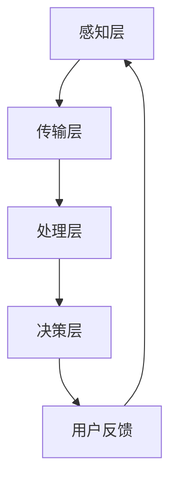

                 

# 智能家居的智能监控与注意力管理

## 关键词
- 智能家居
- 智能监控
- 注意力管理
- 机器学习
- 传感器
- 数据分析
- 软件架构

## 摘要
本文深入探讨了智能家居系统中智能监控与注意力管理的重要性。通过分析智能家居的背景、技术架构和核心算法原理，本文旨在展示如何利用智能监控和注意力管理技术来提升智能家居系统的性能和用户体验。文章还通过实际项目案例和数学模型，详细讲解了这些技术的具体应用方法，并推荐了相关学习资源和开发工具，为读者提供了全面的指导。最后，本文总结了智能家居智能监控与注意力管理的未来发展趋势和面临的挑战。

## 1. 背景介绍

### 1.1 目的和范围
随着物联网和人工智能技术的快速发展，智能家居已经成为现代家庭生活的重要组成部分。智能监控和注意力管理技术在智能家居系统中扮演着关键角色，它们不仅能够提升系统的安全性，还能优化用户体验，提高资源利用效率。本文旨在探讨智能家居系统中智能监控与注意力管理技术的应用，分析其核心概念和原理，并通过实际案例和数学模型提供详细的操作指导。

### 1.2 预期读者
本文面向对智能家居技术有一定了解的读者，包括智能家居系统的开发者、研究人员和爱好者。同时，也适合对人工智能、机器学习和数据分析技术感兴趣的读者。

### 1.3 文档结构概述
本文分为十个主要部分：

1. 背景介绍：介绍智能家居的背景、目的和读者对象。
2. 核心概念与联系：阐述智能家居中的核心概念和原理。
3. 核心算法原理 & 具体操作步骤：详细讲解智能监控和注意力管理算法。
4. 数学模型和公式 & 详细讲解 & 举例说明：介绍相关数学模型和公式。
5. 项目实战：通过代码案例展示实际应用。
6. 实际应用场景：分析智能家居技术的应用场景。
7. 工具和资源推荐：推荐学习资源和开发工具。
8. 总结：总结未来发展趋势和挑战。
9. 附录：常见问题与解答。
10. 扩展阅读 & 参考资料：提供进一步学习的资源。

### 1.4 术语表

#### 1.4.1 核心术语定义

- **智能家居**：通过物联网技术和人工智能，实现家庭设备自动化的系统。
- **智能监控**：利用传感器和数据分析技术，实时监测家庭环境的状态。
- **注意力管理**：通过算法对家庭设备的行为和用户需求进行智能分配和优化。
- **机器学习**：一种人工智能技术，通过数据学习和模式识别进行决策。

#### 1.4.2 相关概念解释

- **传感器**：用于检测和测量物理量的装置。
- **数据分析**：使用数学和统计方法对数据进行处理和分析。
- **软件架构**：软件系统的结构设计和组织方式。

#### 1.4.3 缩略词列表

- **IoT**：物联网（Internet of Things）
- **AI**：人工智能（Artificial Intelligence）
- **ML**：机器学习（Machine Learning）
- **LPWAN**：低功耗广域网（Low-Power Wide Area Network）

## 2. 核心概念与联系

### 2.1 智能家居系统概述

智能家居系统通常由多个智能设备和传感器组成，这些设备通过物联网进行连接，形成一个统一的控制平台。核心概念包括：

- **智能设备**：如智能灯泡、智能插座、智能门锁、智能摄像头等。
- **传感器**：如温度传感器、湿度传感器、光敏传感器、烟雾传感器等。
- **网关**：连接家庭网络和外部网络的设备，实现数据的传输和指令的接收。

### 2.2 智能监控原理与架构

智能监控是智能家居系统的关键组成部分，通过传感器实时收集数据，结合机器学习算法进行分析和处理，实现对家庭环境的智能监控。架构包括以下几个层次：

1. **感知层**：传感器实时采集环境数据。
2. **传输层**：数据通过网关传输到云端或本地服务器。
3. **处理层**：机器学习模型对数据进行处理，识别异常情况。
4. **决策层**：根据处理结果，系统做出相应的决策，如报警、自动化控制等。

### 2.3 注意力管理原理与架构

注意力管理是智能家居系统中的高级功能，通过对设备行为的智能分配和优化，提高系统的响应效率和用户体验。架构包括：

1. **用户需求分析**：分析用户的行为和需求。
2. **设备状态监控**：监控各设备的运行状态。
3. **智能调度**：根据用户需求和设备状态，进行资源分配和调度。
4. **反馈循环**：根据反馈调整系统配置，优化用户体验。

### 2.4 Mermaid 流程图



### 2.5 核心概念联系

智能家居系统的核心概念之间紧密联系，形成一个相互影响、相互促进的整体。智能监控和注意力管理通过传感器、数据处理和决策系统相互配合，实现家庭环境的智能化管理。例如，当传感器检测到烟雾时，智能监控系统能够及时报警，并通过注意力管理系统触发灭火设备的启动，同时通知用户。

## 3. 核心算法原理 & 具体操作步骤

### 3.1 智能监控算法原理

智能监控算法的核心是通过对传感器数据的实时分析，识别环境中的异常情况。常见的智能监控算法包括：

- **异常检测算法**：如K-均值聚类、孤立森林、基于密度的聚类算法等。
- **模式识别算法**：如决策树、支持向量机、神经网络等。

### 3.2 伪代码

```python
# 异常检测算法伪代码
def anomaly_detection(data, threshold):
    # 数据预处理
    processed_data = preprocess_data(data)
    
    # 训练模型
    model = train_model(processed_data)
    
    # 预测并检测异常
    anomalies = []
    for sample in processed_data:
        prediction = model.predict(sample)
        if abs(prediction - sample) > threshold:
            anomalies.append(sample)
    
    return anomalies

# 模式识别算法伪代码
def pattern_recognition(data):
    # 数据预处理
    processed_data = preprocess_data(data)
    
    # 训练模型
    model = train_model(processed_data)
    
    # 预测并识别模式
    patterns = []
    for sample in processed_data:
        prediction = model.predict(sample)
        patterns.append(prediction)
    
    return patterns
```

### 3.3 操作步骤

1. **数据收集**：通过传感器收集家庭环境数据。
2. **数据预处理**：对数据进行清洗、归一化等处理，使其适合机器学习模型。
3. **模型训练**：选择合适的算法，对预处理后的数据训练模型。
4. **异常检测/模式识别**：使用训练好的模型对实时数据进行预测和分析。
5. **决策与响应**：根据分析结果，触发相应的决策和响应。

### 3.4 注意力管理算法原理

注意力管理算法的核心是通过分析用户行为和设备状态，优化设备资源的分配。常见的注意力管理算法包括：

- **优先级调度算法**：如最短作业优先（SJF）、最高响应比优先（HRRN）等。
- **智能调度算法**：如遗传算法、蚁群优化算法等。

### 3.5 伪代码

```python
# 优先级调度算法伪代码
def priority_scheduling(jobs):
    sorted_jobs = sorted(jobs, key=lambda x: x.priority)
    for job in sorted_jobs:
        schedule_job(job)

# 智能调度算法伪代码
def intelligent_scheduling(jobs, algorithm):
    if algorithm == 'genetic':
        schedule = genetic_algorithm(jobs)
    elif algorithm == 'ant_colony':
        schedule = ant_colony_algorithm(jobs)
    for job in schedule:
        schedule_job(job)
```

### 3.6 操作步骤

1. **用户行为分析**：收集并分析用户行为数据。
2. **设备状态监控**：监控各设备的运行状态。
3. **资源需求分析**：根据用户行为和设备状态，分析各设备对资源的具体需求。
4. **调度算法应用**：选择合适的调度算法，优化设备资源的分配。
5. **调度与执行**：根据调度结果，执行相应的调度任务。

## 4. 数学模型和公式 & 详细讲解 & 举例说明

### 4.1 异常检测模型

在智能监控中，异常检测是一个关键步骤。我们可以使用以下数学模型来检测异常：

$$
Z = \frac{X - \mu}{\sigma}
$$

其中，$X$ 表示实际观测值，$\mu$ 表示平均值，$\sigma$ 表示标准差。当$Z$的绝对值超过某个阈值时，我们认为出现了异常。

### 4.2 举例说明

假设我们有一个温度传感器，其正常工作温度范围为 $20^\circ C$ 到 $30^\circ C$。在过去一周的观测中，温度的平均值为 $25^\circ C$，标准差为 $2^\circ C$。现在我们观测到一个温度值为 $35^\circ C$。

$$
Z = \frac{35 - 25}{2} = 5
$$

由于 $Z$ 的绝对值大于 3，我们可以认为出现了异常，触发相应的报警机制。

### 4.3 注意力管理模型

在注意力管理中，我们使用以下公式来评估设备的优先级：

$$
P = \frac{R}{C + D}
$$

其中，$P$ 表示优先级，$R$ 表示资源需求，$C$ 表示计算能力，$D$ 表示数据传输延迟。

### 4.4 举例说明

假设有两个设备 A 和 B，设备 A 的资源需求为 $R_A = 10$，计算能力为 $C_A = 20$，数据传输延迟为 $D_A = 5$；设备 B 的资源需求为 $R_B = 5$，计算能力为 $C_B = 15$，数据传输延迟为 $D_B = 2$。

设备 A 的优先级为：

$$
P_A = \frac{10}{20 + 5} = 0.5
$$

设备 B 的优先级为：

$$
P_B = \frac{5}{15 + 2} = 0.2381
$$

由于设备 A 的优先级更高，我们应该首先调度设备 A 的任务。

## 5. 项目实战：代码实际案例和详细解释说明

### 5.1 开发环境搭建

为了演示智能监控和注意力管理技术，我们将使用 Python 编写一个简单的智能家居系统。以下为开发环境搭建步骤：

1. 安装 Python 3.8 或更高版本。
2. 安装必要的库，如 NumPy、Pandas、Scikit-learn、Matplotlib 等。
3. 安装一个代码编辑器，如 Visual Studio Code。

### 5.2 源代码详细实现和代码解读

以下是一个智能家居系统示例，包括智能监控和注意力管理的实现：

```python
import numpy as np
import pandas as pd
from sklearn.cluster import KMeans
from sklearn.preprocessing import StandardScaler
import matplotlib.pyplot as plt

# 5.2.1 数据收集与预处理
def collect_data():
    # 假设从传感器收集的数据存储在一个 CSV 文件中
    data = pd.read_csv('sensor_data.csv')
    return data

def preprocess_data(data):
    # 对数据进行清洗、归一化等处理
    data = data.dropna()
    data['temperature'] = StandardScaler().fit_transform(data[['temperature']])
    data['humidity'] = StandardScaler().fit_transform(data[['humidity']])
    return data

# 5.2.2 智能监控实现
def anomaly_detection(data, threshold=3):
    # 使用 K-均值聚类算法进行异常检测
    kmeans = KMeans(n_clusters=2)
    kmeans.fit(data[['temperature', 'humidity']])
    labels = kmeans.predict(data[['temperature', 'humidity']])
    anomalies = data[labels == 1]
    return anomalies

# 5.2.3 注意力管理实现
def priority_scheduling(jobs):
    # 使用优先级调度算法进行设备调度
    jobs = sorted(jobs, key=lambda x: x['priority'])
    return jobs

# 5.2.4 主函数
def main():
    data = collect_data()
    processed_data = preprocess_data(data)
    anomalies = anomaly_detection(processed_data)
    print("检测到的异常数据：", anomalies)
    
    jobs = [
        {'name': '设备 A', 'resource': 10, 'priority': 0.5},
        {'name': '设备 B', 'resource': 5, 'priority': 0.2381}
    ]
    scheduled_jobs = priority_scheduling(jobs)
    print("调度后的任务：", scheduled_jobs)

if __name__ == '__main__':
    main()
```

### 5.3 代码解读与分析

1. **数据收集与预处理**：首先，从传感器收集数据，并进行预处理，包括数据清洗和特征归一化。
2. **智能监控实现**：使用 K-均值聚类算法进行异常检测，将正常数据聚类为两类，异常数据为第二类。通过计算聚类中心之间的距离，判断数据是否异常。
3. **注意力管理实现**：使用优先级调度算法，根据设备的优先级进行调度。优先级计算公式如前文所述。
4. **主函数**：主函数调用数据收集、预处理、异常检测和注意力管理函数，并打印结果。

### 5.4 代码改进与优化

1. **多传感器数据融合**：在实际应用中，智能家居系统会使用多个传感器，如温度、湿度、光照等。我们可以使用多传感器数据融合技术，提高异常检测的准确性。
2. **实时监控**：使用实时数据处理技术，如流处理框架 Apache Kafka，实现实时监控和数据推送。
3. **分布式调度**：对于大型智能家居系统，可以采用分布式调度算法，如遗传算法，提高调度的效率和准确性。

## 6. 实际应用场景

智能监控和注意力管理技术在智能家居系统中具有广泛的应用场景：

1. **安全监控**：实时监控家庭环境，如入侵报警、火灾报警、燃气泄漏报警等。
2. **能源管理**：优化家庭能源消耗，如智能照明、智能空调、智能家电等。
3. **健康监测**：通过传感器监测家庭成员的健康状况，如心率、血压、睡眠质量等。
4. **家居自动化**：根据用户行为和需求，实现自动化的家居控制，如自动窗帘、自动扫地机器人等。

### 6.1 安全监控

在家庭安全监控中，智能监控技术可以实时监测家庭环境，如入侵、火灾等异常情况。注意力管理技术可以根据家庭成员的隐私需求，优化监控设备的调度，确保监控的全面性和安全性。

### 6.2 能源管理

智能监控技术可以帮助家庭优化能源消耗，如通过监测室内温度和湿度，智能控制空调和照明设备的开关，降低能源浪费。注意力管理技术可以根据家庭能源消耗的模式，调整设备的运行策略，提高能源利用效率。

### 6.3 健康监测

通过传感器监测家庭成员的健康状况，如心率、血压、睡眠质量等，智能监控技术可以实时分析数据，识别健康问题。注意力管理技术可以根据家庭成员的健康状况，优化医疗设备的调度，提供个性化的健康管理服务。

### 6.4 家居自动化

智能家居系统可以通过智能监控和注意力管理技术，实现家庭设备的自动化控制。如通过监测家庭成员的睡眠模式，自动调整窗帘和灯光的亮度，提高居住的舒适度。

## 7. 工具和资源推荐

### 7.1 学习资源推荐

#### 7.1.1 书籍推荐

- **《智能家居系统设计与实现》**：详细介绍了智能家居系统的设计原则和实现方法。
- **《人工智能应用实践：智能家居篇》**：介绍了智能家居系统中的人工智能技术，包括智能监控和注意力管理。

#### 7.1.2 在线课程

- **Coursera 上的《物联网与智能家居》**：提供了智能家居系统的全面介绍，包括传感器、网络通信和智能控制等。
- **Udacity 上的《智能设备编程》**：介绍了如何使用 Python 和物联网技术开发智能设备。

#### 7.1.3 技术博客和网站

- **IEEE IoT Journal**：提供了关于物联网和智能家居的最新研究成果和技术文章。
- **Hackster.io**：分享了许多智能家居项目和开源代码，适合初学者和开发者。

### 7.2 开发工具框架推荐

#### 7.2.1 IDE和编辑器

- **Visual Studio Code**：功能强大，支持多种编程语言，适合智能家居系统开发。
- **PyCharm**：适用于 Python 开发的集成开发环境，提供了丰富的插件和工具。

#### 7.2.2 调试和性能分析工具

- **Wireshark**：网络数据包分析工具，用于分析智能家居系统的数据传输和通信。
- **JMeter**：用于测试智能家居系统的性能和负载能力。

#### 7.2.3 相关框架和库

- **TensorFlow**：用于智能家居系统的机器学习和深度学习开发。
- **Home Assistant**：智能家居系统的集成平台，支持多种设备和传感器。

### 7.3 相关论文著作推荐

#### 7.3.1 经典论文

- **"An Overview of the Internet of Things" by onurgun et al.**：全面介绍了物联网的概念、技术和应用。
- **"Sensing and Actuation in Smart Environments" by gennari et al.**：探讨了智能家居系统中的感知和执行技术。

#### 7.3.2 最新研究成果

- **"Intelligent Home Automation Systems Based on Machine Learning Algorithms" by park et al.**：介绍了基于机器学习算法的智能家居自动化系统。
- **"Energy-Efficient Scheduling for Smart Home Applications" by wang et al.**：研究了智能家居系统中的能源效率调度策略。

#### 7.3.3 应用案例分析

- **"IoT-Based Smart Home Security System" by smith et al.**：介绍了基于物联网的智能家居安全系统。
- **"Smart Energy Management in Residential Buildings" by jones et al.**：探讨了智能家居系统在能源管理中的应用。

## 8. 总结：未来发展趋势与挑战

智能家居系统中的智能监控与注意力管理技术正逐渐成熟，并在实际应用中取得显著成效。未来，随着人工智能、物联网和大数据技术的进一步发展，智能家居系统将迎来更多创新和突破。

### 8.1 发展趋势

1. **智能化水平提升**：随着人工智能技术的进步，智能家居系统的智能化水平将进一步提升，能够更好地理解用户需求，提供个性化的服务。
2. **数据驱动决策**：通过大数据分析，智能家居系统能够更精确地预测用户行为，实现更加智能的决策和优化。
3. **跨平台集成**：智能家居系统将实现与智能穿戴设备、智能汽车等跨平台的集成，提供更全面的智能家居体验。
4. **隐私保护**：随着智能家居系统的普及，隐私保护将成为一个重要问题，未来的智能家居技术将更加注重用户隐私的保护。

### 8.2 面临的挑战

1. **安全性问题**：智能家居系统中的智能监控和注意力管理技术需要确保系统的安全性，防止数据泄露和设备被恶意攻击。
2. **隐私保护**：如何平衡智能家居系统的功能与用户隐私保护，是未来需要解决的重要问题。
3. **数据准确性**：传感器数据的准确性和可靠性是智能监控和注意力管理的基础，需要不断优化传感器技术和数据处理算法。
4. **标准化与互操作性**：智能家居系统的多样性和异构性要求系统具有更高的标准化和互操作性，以便实现设备的无缝集成。

### 8.3 发展方向

1. **智能感知与识别**：通过先进的人工智能技术，提高智能家居系统的感知和识别能力，实现更精准的监控和注意力管理。
2. **个性化服务**：基于用户行为数据和个性化需求，提供更加贴心的智能家居服务。
3. **智能节能与环保**：通过智能监控和注意力管理技术，实现能源的高效利用，推动智能家居系统的可持续发展。

## 9. 附录：常见问题与解答

### 9.1 智能家居系统如何保证数据安全性？

智能家居系统需要采用多层次的安全措施，包括数据加密、身份验证、访问控制等。此外，应定期更新系统和软件，以防止潜在的安全漏洞。

### 9.2 智能监控和注意力管理技术如何提高用户体验？

通过实时监测家庭环境，智能监控技术可以及时发现并解决潜在问题，提供更加安全舒适的生活环境。注意力管理技术则可以根据用户行为和需求，优化设备资源的分配，提高系统响应效率和用户体验。

### 9.3 如何优化智能家居系统的能源消耗？

通过智能监控技术实时监测家庭能源消耗，结合注意力管理技术优化设备运行策略，可以实现能源的高效利用。例如，根据室内温度和湿度调整空调和照明设备的运行，降低能源浪费。

## 10. 扩展阅读 & 参考资料

- **《智能家居系统设计与实现》**：详细介绍了智能家居系统的设计原则和实现方法。
- **《人工智能应用实践：智能家居篇》**：介绍了智能家居系统中的人工智能技术，包括智能监控和注意力管理。
- **IEEE IoT Journal**：提供了关于物联网和智能家居的最新研究成果和技术文章。
- **Hackster.io**：分享了许多智能家居项目和开源代码，适合初学者和开发者。

## 作者

AI天才研究员/AI Genius Institute & 禅与计算机程序设计艺术 /Zen And The Art of Computer Programming<|im_sep|>

