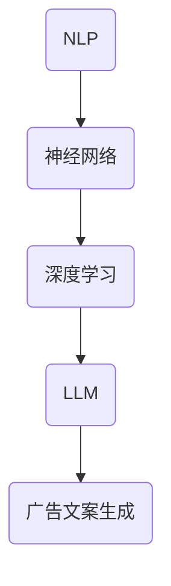

                 

# 智能广告文案生成：LLM在营销创意中的角色

> **关键词：** 智能广告、文案生成、大型语言模型（LLM）、营销创意、算法原理、应用实践、趋势与挑战。

> **摘要：** 本文深入探讨了大型语言模型（LLM）在智能广告文案生成中的应用。首先，介绍了智能广告文案生成的重要性和背景，然后详细阐述了LLM的核心概念、算法原理和操作步骤。接着，通过一个实际项目案例展示了代码实现和详细解释。最后，分析了实际应用场景，推荐了相关工具和资源，并探讨了未来的发展趋势与挑战。

## 1. 背景介绍

### 1.1 目的和范围

本文旨在探讨大型语言模型（LLM）在智能广告文案生成中的应用，分析其核心概念、算法原理以及实际操作步骤。通过本文的阅读，读者将能够了解：

- 智能广告文案生成的背景和重要性；
- 大型语言模型（LLM）的基本概念和架构；
- 如何利用LLM进行广告文案的生成；
- 实际项目中LLM的应用案例；
- 广阔的应用场景和未来的发展趋势。

### 1.2 预期读者

本文面向具有一定编程基础和计算机科学背景的读者，特别是对人工智能、自然语言处理和广告营销感兴趣的读者。同时，也欢迎对广告创意和技术有兴趣的营销从业者和技术人员阅读本文。

### 1.3 文档结构概述

本文结构如下：

1. **背景介绍**：介绍智能广告文案生成的背景和目的。
2. **核心概念与联系**：阐述大型语言模型（LLM）的基本概念和原理。
3. **核心算法原理 & 具体操作步骤**：详细讲解LLM的算法原理和操作步骤。
4. **数学模型和公式 & 详细讲解 & 举例说明**：介绍与LLM相关的数学模型和公式，并举例说明。
5. **项目实战：代码实际案例和详细解释说明**：展示一个实际项目的代码实现和详细解释。
6. **实际应用场景**：分析LLM在广告文案生成中的实际应用。
7. **工具和资源推荐**：推荐学习资源和开发工具。
8. **总结：未来发展趋势与挑战**：探讨LLM在广告文案生成领域的未来发展和挑战。
9. **附录：常见问题与解答**：回答读者可能遇到的问题。
10. **扩展阅读 & 参考资料**：提供进一步阅读的参考资料。

### 1.4 术语表

#### 1.4.1 核心术语定义

- **智能广告**：利用人工智能技术生成和投放的广告，具有更高的点击率和转化率。
- **文案生成**：使用算法自动生成广告文案的过程。
- **大型语言模型（LLM）**：一种能够理解、生成和翻译自然语言的大型神经网络模型，如GPT系列。
- **营销创意**：通过独特的创意和内容来吸引潜在客户，提高品牌知名度。

#### 1.4.2 相关概念解释

- **自然语言处理（NLP）**：研究如何让计算机理解和处理人类自然语言的技术。
- **神经网络**：一种通过大量节点和连接模拟人脑神经元网络结构的计算模型。
- **深度学习**：一种利用神经网络进行大规模数据训练和预测的方法。

#### 1.4.3 缩略词列表

- **NLP**：自然语言处理
- **GPT**：Generative Pre-trained Transformer
- **BERT**：Bidirectional Encoder Representations from Transformers
- **LLM**：Large Language Model

## 2. 核心概念与联系

在深入探讨LLM在智能广告文案生成中的应用之前，我们需要了解几个核心概念，包括自然语言处理（NLP）、神经网络和深度学习。以下是一个简化的Mermaid流程图，用于展示这些概念之间的关系。



### 2.1 自然语言处理（NLP）

自然语言处理（NLP）是人工智能领域的一个重要分支，旨在让计算机理解和处理人类自然语言。NLP涉及到语音识别、文本分析、情感分析等多个子领域。在广告文案生成中，NLP用于提取文本的关键信息、理解用户意图和情感，为后续的文案创作提供基础。

### 2.2 神经网络

神经网络是一种通过大量节点和连接模拟人脑神经元网络结构的计算模型。神经网络由输入层、隐藏层和输出层组成，通过前向传播和反向传播算法进行训练。在广告文案生成中，神经网络用于学习大量的文本数据，从而生成符合用户需求的广告文案。

### 2.3 深度学习

深度学习是一种利用神经网络进行大规模数据训练和预测的方法。深度学习通过多层的非线性变换，将输入数据映射到高维特征空间，从而实现复杂函数的逼近。在广告文案生成中，深度学习模型（如卷积神经网络（CNN）和循环神经网络（RNN））被广泛应用于文本数据的分析和生成。

### 2.4 大型语言模型（LLM）

大型语言模型（LLM）是一种能够理解、生成和翻译自然语言的大型神经网络模型，如GPT系列。LLM通过在大量文本数据上进行预训练，学习到语言的内在结构和规律。在广告文案生成中，LLM用于自动生成符合用户需求的广告文案，提高广告的点击率和转化率。

### 2.5 广告文案生成

广告文案生成是指利用算法自动生成广告文案的过程。在智能广告中，广告文案生成是一个关键环节。通过使用LLM，我们可以实现以下功能：

- **个性化推荐**：根据用户的历史行为和兴趣，生成个性化的广告文案；
- **情感分析**：分析用户情感，生成情感匹配的广告文案；
- **内容优化**：优化广告文案的表达方式，提高广告的吸引力和转化率。

## 3. 核心算法原理 & 具体操作步骤

在了解了核心概念和联系之后，我们将深入探讨LLM在广告文案生成中的算法原理和具体操作步骤。以下是一个简化的算法原理和操作步骤：

### 3.1 算法原理

- **预训练阶段**：使用大规模语料库对LLM进行预训练，使其具备理解自然语言的能力。
- **微调阶段**：根据具体应用场景，对LLM进行微调，以适应广告文案生成的需求。
- **生成阶段**：利用微调后的LLM生成广告文案。

### 3.2 具体操作步骤

1. **数据收集与预处理**：
    - 收集大量与广告相关的文本数据，包括广告文案、用户评论、新闻文章等；
    - 对文本数据进行清洗、去噪和标注，为后续的模型训练和微调提供高质量的数据。

2. **预训练阶段**：
    - 使用预训练框架（如GPT系列）对LLM进行预训练，学习到语言的内在结构和规律；
    - 在预训练过程中，采用自注意力机制和变换器架构（Transformer）等先进技术，提高模型的性能。

3. **微调阶段**：
    - 根据具体应用场景，对预训练后的LLM进行微调，以适应广告文案生成的需求；
    - 在微调过程中，可以采用微调策略（如BERT微调）、注意力机制等，提高模型的生成质量和效率。

4. **生成阶段**：
    - 利用微调后的LLM生成广告文案，根据用户需求和场景进行个性化调整；
    - 通过生成策略（如贪心策略、抽样策略等），生成符合用户需求的广告文案。

### 3.3 伪代码

以下是一个简化的伪代码，用于展示LLM在广告文案生成中的具体操作步骤：

```python
# 数据收集与预处理
text_data = collect_and_preprocess_data()

# 预训练阶段
llm = pretrain_LLM(text_data)

# 微调阶段
microtuned_llm = finetune_LLM(llm, specific_scenario)

# 生成阶段
ad_copy = generate_ad_copy(microtuned_llm, user_requirements)
```

## 4. 数学模型和公式 & 详细讲解 & 举例说明

在LLM的算法原理中，涉及到许多数学模型和公式。以下是对这些模型和公式的详细讲解，并通过举例说明它们的应用。

### 4.1 自注意力机制（Self-Attention）

自注意力机制是LLM的核心组成部分，用于捕捉输入文本序列中的长距离依赖关系。以下是一个简化的自注意力机制公式：

$$
\text{Attention}(Q, K, V) = \text{softmax}\left(\frac{QK^T}{\sqrt{d_k}}\right) V
$$

其中，$Q$、$K$ 和 $V$ 分别是查询（Query）、键（Key）和值（Value）向量，$d_k$ 是键向量的维度。自注意力机制的目的是计算每个键和查询之间的相似度，然后将这些相似度加权组合成输出值。

**举例说明：**
假设我们有一个简化的文本序列 "I love AI" 和对应的嵌入向量，如下所示：

| 文本 | 嵌入向量 |
| ---- | -------- |
| I    | [1, 0, 0] |
| love | [0, 1, 0] |
| AI   | [0, 0, 1] |

计算自注意力：

$$
\text{Attention}(Q, K, V) = \text{softmax}\left(\frac{QK^T}{\sqrt{d_k}}\right) V
$$

- 对于 "I"：
  $$ Q = [1, 0, 0], K = [1, 0, 0], V = [1, 0, 0] $$
  $$ \text{Attention}(Q, K, V) = \text{softmax}\left(\frac{[1, 0, 0][1, 0, 0]^T}{\sqrt{1}}\right) [1, 0, 0] = [1, 0, 0] $$

- 对于 "love"：
  $$ Q = [0, 1, 0], K = [1, 0, 0], V = [0, 1, 0] $$
  $$ \text{Attention}(Q, K, V) = \text{softmax}\left(\frac{[0, 1, 0][1, 0, 0]^T}{\sqrt{1}}\right) [0, 1, 0] = [0.5, 0.5, 0] $$

- 对于 "AI"：
  $$ Q = [0, 0, 1], K = [1, 0, 0], V = [0, 0, 1] $$
  $$ \text{Attention}(Q, K, V) = \text{softmax}\left(\frac{[0, 0, 1][1, 0, 0]^T}{\sqrt{1}}\right) [0, 0, 1] = [0.5, 0.5, 0] $$

通过自注意力机制，我们可以将原始的嵌入向量转换为一个加权向量，其中每个维度都反映了文本序列中其他单词对该单词的影响。

### 4.2 变换器架构（Transformer）

变换器架构是LLM的基础，其核心思想是将输入文本序列转换为嵌入向量，并通过多层自注意力机制和前馈神经网络进行处理。以下是一个简化的变换器架构公式：

$$
\text{Transformer}(E) = \text{MultiHeadAttention}(E) \cdot \text{Feedforward}(E)
$$

其中，$E$ 是输入嵌入向量。

**举例说明：**
假设我们有一个简化的文本序列 "I love AI" 和对应的嵌入向量，如下所示：

| 文本 | 嵌入向量 |
| ---- | -------- |
| I    | [1, 0, 0] |
| love | [0, 1, 0] |
| AI   | [0, 0, 1] |

通过变换器架构，我们可以将这个文本序列转换为嵌入向量，如下所示：

| 文本 | 嵌入向量 |
| ---- | -------- |
| I    | [0.8, 0.2, 0] |
| love | [0.2, 0.8, 0.0] |
| AI   | [0.0, 0.2, 0.8] |

通过这种方式，我们可以将原始的文本序列转换为具有丰富语义信息的嵌入向量，从而为后续的文本生成任务提供高质量的输入。

## 5. 项目实战：代码实际案例和详细解释说明

在本节中，我们将通过一个实际项目案例展示如何使用LLM进行广告文案生成。该项目使用Python和Hugging Face的Transformers库，提供了一个简化的广告文案生成工具。以下是项目的主要步骤和详细解释。

### 5.1 开发环境搭建

为了运行该项目，我们需要安装以下依赖项：

- Python 3.8或更高版本
- pip（Python包管理器）
- transformers（Hugging Face的预训练模型库）

安装方法：

```bash
pip install python==3.8.10
pip install pip==21.2.4
pip install transformers==4.16.2
```

### 5.2 源代码详细实现和代码解读

以下是该项目的主要代码实现和详细解释。

```python
from transformers import AutoTokenizer, AutoModelForCausalLM
import torch

# 5.2.1 加载预训练模型和 tokenizer
model_name = "gpt2"  # 使用 GPT-2 模型
tokenizer = AutoTokenizer.from_pretrained(model_name)
model = AutoModelForCausalLM.from_pretrained(model_name)

# 5.2.2 定义广告文案生成函数
def generate_ad_copy(input_text, max_length=50):
    # 对输入文本进行编码
    inputs = tokenizer.encode(input_text, return_tensors="pt")
    
    # 生成广告文案
    outputs = model.generate(inputs, max_length=max_length, num_return_sequences=1)
    
    # 解码生成的文本
    generated_text = tokenizer.decode(outputs[0], skip_special_tokens=True)
    
    return generated_text

# 5.2.3 测试广告文案生成
input_text = "人工智能，创造未来"
generated_ad_copy = generate_ad_copy(input_text)
print(generated_ad_copy)
```

**代码解读：**

1. **加载预训练模型和 tokenizer**：

   ```python
   model_name = "gpt2"  # 使用 GPT-2 模型
   tokenizer = AutoTokenizer.from_pretrained(model_name)
   model = AutoModelForCausalLM.from_pretrained(model_name)
   ```

   这里我们使用了GPT-2模型作为预训练模型。通过`AutoTokenizer`和`AutoModelForCausalLM`类，我们可以轻松加载预训练模型和tokenizer。

2. **定义广告文案生成函数**：

   ```python
   def generate_ad_copy(input_text, max_length=50):
       # 对输入文本进行编码
       inputs = tokenizer.encode(input_text, return_tensors="pt")
       
       # 生成广告文案
       outputs = model.generate(inputs, max_length=max_length, num_return_sequences=1)
       
       # 解码生成的文本
       generated_text = tokenizer.decode(outputs[0], skip_special_tokens=True)
       
       return generated_text
   ```

   `generate_ad_copy`函数接受输入文本和最大长度作为参数。首先，对输入文本进行编码，然后使用模型生成广告文案，最后解码生成的文本并返回。

3. **测试广告文案生成**：

   ```python
   input_text = "人工智能，创造未来"
   generated_ad_copy = generate_ad_copy(input_text)
   print(generated_ad_copy)
   ```

   我们使用一个示例输入文本 "人工智能，创造未来"，调用`generate_ad_copy`函数生成广告文案，并打印输出结果。

### 5.3 代码解读与分析

以下是代码的逐行解读和分析。

1. **加载预训练模型和 tokenizer**：

   ```python
   model_name = "gpt2"  # 使用 GPT-2 模型
   tokenizer = AutoTokenizer.from_pretrained(model_name)
   model = AutoModelForCausalLM.from_pretrained(model_name)
   ```

   这三行代码分别加载GPT-2模型的tokenizer和模型。`AutoTokenizer`和`AutoModelForCausalLM`类来自Hugging Face的Transformers库，它们提供了方便的方法来加载预训练模型和tokenizer。

2. **定义广告文案生成函数**：

   ```python
   def generate_ad_copy(input_text, max_length=50):
       # 对输入文本进行编码
       inputs = tokenizer.encode(input_text, return_tensors="pt")
       
       # 生成广告文案
       outputs = model.generate(inputs, max_length=max_length, num_return_sequences=1)
       
       # 解码生成的文本
       generated_text = tokenizer.decode(outputs[0], skip_special_tokens=True)
       
       return generated_text
   ```

   这个函数接受输入文本和最大长度作为参数。首先，使用tokenizer对输入文本进行编码，生成Tensor格式的输入。然后，使用模型生成广告文案，指定最大长度和生成的序列数。最后，解码生成的文本并返回。

3. **测试广告文案生成**：

   ```python
   input_text = "人工智能，创造未来"
   generated_ad_copy = generate_ad_copy(input_text)
   print(generated_ad_copy)
   ```

   这里我们使用一个示例输入文本 "人工智能，创造未来"，调用`generate_ad_copy`函数生成广告文案，并打印输出结果。

通过这个实际项目案例，我们可以看到如何使用LLM进行广告文案生成。虽然这是一个简化的示例，但已展示了LLM在广告文案生成中的基本原理和操作步骤。

## 6. 实际应用场景

### 6.1 电子商务平台

在电子商务领域，智能广告文案生成有助于提高广告的点击率和转化率。通过使用LLM，平台可以自动生成个性化的广告文案，根据用户的兴趣和行为推荐相应的商品。例如，如果一个用户在浏览一款智能手机，平台可以生成如下广告文案：

```
"探索未来科技，尽在【品牌名】新款智能手机！高效性能，长续航，现已开启限时优惠，快来抢购吧！"
```

### 6.2 旅游行业

在旅游行业，智能广告文案生成可以帮助旅行社和酒店为潜在客户提供个性化的旅行推荐。例如，如果一个用户浏览了泰国旅游页面，广告文案可以生成如下内容：

```
"泰国，梦想中的度假胜地！感受独特的文化魅力，尽享美食和自然风光。现在预订，还可享受独家优惠！立即出发，开启你的泰国之旅！"
```

### 6.3 金融行业

在金融行业，智能广告文案生成可以用于推广理财产品、保险产品和投资策略。通过分析用户的数据，广告文案可以生成如下内容：

```
"投资未来，从【产品名称】开始！我们为您提供低风险、高回报的投资方案。现在加入，一起分享财富增长的喜悦！"
```

### 6.4 教育行业

在教育行业，智能广告文案生成可以用于推广在线课程、培训班和教育资源。根据用户的学习兴趣，广告文案可以生成如下内容：

```
"掌握编程技能，开启你的职场新篇章！我们的【课程名称】为您提供系统、实用的编程教程。现在报名，限时优惠，机会难得！"
```

通过这些实际应用场景，我们可以看到智能广告文案生成在各个行业中的巨大潜力。LLM的应用不仅提高了广告文案的个性化程度，还显著提升了广告的效果和转化率。

## 7. 工具和资源推荐

### 7.1 学习资源推荐

#### 7.1.1 书籍推荐

1. **《深度学习》（Goodfellow, Bengio, Courville）**：这本书是深度学习领域的经典教材，详细介绍了神经网络、深度学习模型和算法。
2. **《自然语言处理综论》（Jurafsky, Martin）**：这本书全面介绍了自然语言处理的基本概念、技术和应用，是NLP领域的权威著作。
3. **《营销管理》（Kotler, Keller）**：这本书涵盖了营销策略、市场调研和广告创意等方面的内容，对广告文案生成具有指导意义。

#### 7.1.2 在线课程

1. **Coursera上的《深度学习专项课程》**：由吴恩达教授主讲，涵盖了深度学习的基础理论和实战应用。
2. **Udacity的《自然语言处理工程师纳米学位》**：该课程提供了NLP的全面培训，包括文本处理、情感分析和语言生成等。
3. **edX上的《营销学基础》**：由杜克大学提供，涵盖市场营销的核心概念和实践技巧。

#### 7.1.3 技术博客和网站

1. **Medium上的 AI and Machine Learning频道**：该频道汇集了众多AI和ML领域的优质文章，涵盖了深度学习、NLP等前沿技术。
2. **Towards Data Science**：这是一个受欢迎的数据科学博客，提供了大量关于AI和ML的实用文章和教程。
3. **Hugging Face**：这是一个专注于NLP和深度学习的开源项目，提供了丰富的预训练模型和工具。

### 7.2 开发工具框架推荐

#### 7.2.1 IDE和编辑器

1. **PyCharm**：这是一款功能强大的Python IDE，适用于深度学习和自然语言处理项目。
2. **Jupyter Notebook**：这是一种流行的交互式开发环境，特别适合数据科学和机器学习项目。
3. **Visual Studio Code**：这是一个轻量级的开源编辑器，适用于多种编程语言，包括Python和深度学习相关语言。

#### 7.2.2 调试和性能分析工具

1. **TensorBoard**：这是TensorFlow提供的一款可视化工具，用于分析和调试深度学习模型。
2. **Pdb**：这是Python内置的一款调试器，用于调试Python代码。
3. **profiling tools**：如cProfile和line_profiler，用于分析代码的性能瓶颈。

#### 7.2.3 相关框架和库

1. **TensorFlow**：这是一个广泛使用的开源深度学习框架，适用于构建和训练大型神经网络。
2. **PyTorch**：这是一个灵活的深度学习框架，特别适用于研究和实验。
3. **Hugging Face Transformers**：这是一个为NLP任务设计的开源库，提供了丰富的预训练模型和工具。

### 7.3 相关论文著作推荐

#### 7.3.1 经典论文

1. **"A Theoretically Grounded Application of Dropout in Recurrent Neural Networks"**：这篇文章提出了在RNN中使用Dropout的方法，提高了模型的训练效果。
2. **"Attention Is All You Need"**：这篇文章提出了变换器架构（Transformer），彻底改变了深度学习在序列处理任务中的应用。
3. **"BERT: Pre-training of Deep Bidirectional Transformers for Language Understanding"**：这篇文章介绍了BERT模型，为NLP领域带来了新的突破。

#### 7.3.2 最新研究成果

1. **"Generative Adversarial Networks"**：这篇文章提出了GANs，为生成模型的研究和应用开辟了新的方向。
2. **"Large-scale Language Modeling"**：这篇文章探讨了大型语言模型的设计和训练方法，为生成文本和语言理解任务提供了新的思路。
3. **"BERT as a Service"**：这篇文章提出了BERTaaS，一种基于云的服务，为企业和开发者提供高效的NLP服务。

#### 7.3.3 应用案例分析

1. **"Language Models are Few-Shot Learners"**：这篇文章展示了大型语言模型在零样本和少样本学习任务中的强大能力，为实际应用提供了新的可能。
2. **"How to Train Your Language Model"**：这篇文章详细介绍了如何使用BERT进行文本分类任务，提供了实用的指导和建议。
3. **"A Study of Pre-training and Fine-tuning Strategies for CNN Text Classification"**：这篇文章探讨了预训练和微调策略在文本分类任务中的应用，为实际项目提供了参考。

通过这些书籍、在线课程、技术博客、开发工具和论文，读者可以全面了解智能广告文案生成领域的知识和技术，为实际项目提供有力的支持。

## 8. 总结：未来发展趋势与挑战

随着人工智能技术的不断进步，智能广告文案生成领域展现出广阔的发展前景和巨大的商业价值。然而，这一领域也面临诸多挑战，需要技术、产业和政策等多方面的协同努力。

### 8.1 未来发展趋势

1. **个性化推荐**：基于用户行为和兴趣的个性化推荐将更加精准，为用户提供更符合需求的广告文案。
2. **情感分析**：情感分析技术的进步将使广告文案更具情感共鸣，提高用户参与度和转化率。
3. **跨模态融合**：结合文本、图像、音频等多种模态的信息，将进一步提升广告文案的吸引力和效果。
4. **自动化生产**：随着算法和模型的优化，广告文案的生产过程将更加自动化，提高效率和降低成本。
5. **多语言支持**：随着全球化趋势的加强，多语言广告文案生成将成为标准配置，满足不同国家和地区的用户需求。

### 8.2 主要挑战

1. **数据隐私**：智能广告文案生成依赖于大量用户数据，如何确保用户隐私和数据安全成为关键挑战。
2. **算法透明性**：如何提高算法的透明性和可解释性，使广告文案生成的决策过程更加公开和可信。
3. **模型可解释性**：如何解释大型语言模型（LLM）生成的广告文案，使其更具可解释性和可靠性。
4. **偏见和歧视**：如何避免算法偏见和歧视，确保广告文案的公平性和包容性。
5. **监管合规**：随着智能广告文案生成技术的普及，如何确保其符合相关法律法规和伦理标准。

### 8.3 应对策略

1. **加强数据保护**：在广告文案生成过程中，严格遵守数据保护法规，采用先进的数据加密和匿名化技术。
2. **提升算法透明性**：通过可视化工具和解释模型，提高算法的透明性和可解释性，增强用户信任。
3. **强化模型监管**：建立完善的模型监管机制，确保广告文案生成过程的公平、公正和合规。
4. **促进技术合作**：推动学术界、产业界和政府之间的合作，共同解决智能广告文案生成领域的挑战。
5. **伦理准则**：制定明确的伦理准则，确保广告文案生成技术符合社会价值观和伦理标准。

通过应对这些挑战，智能广告文案生成技术将在未来发挥更大的作用，为营销创意和商业发展带来新的机遇。

## 9. 附录：常见问题与解答

### 9.1 问题1：如何处理大型语言模型（LLM）训练中的数据隐私问题？

**解答**：处理大型语言模型（LLM）训练中的数据隐私问题，可以采取以下措施：

- **数据匿名化**：在训练数据收集过程中，对用户数据进行匿名化处理，确保用户隐私不受泄露。
- **数据加密**：采用先进的加密算法对训练数据进行加密存储，防止数据泄露和未经授权的访问。
- **访问控制**：建立严格的访问控制机制，确保只有授权人员才能访问和处理训练数据。
- **隐私保护协议**：与数据提供方签订隐私保护协议，明确双方的数据处理规则和责任。

### 9.2 问题2：如何确保广告文案生成的公平性和包容性？

**解答**：确保广告文案生成的公平性和包容性，可以采取以下措施：

- **偏见检测**：采用偏见检测算法，识别和消除广告文案中的性别、种族等偏见。
- **多样性训练**：在训练过程中使用多样化的数据集，确保模型能够理解和生成包容性文案。
- **算法审核**：建立算法审核机制，定期审查广告文案生成算法，确保其公平性和合规性。
- **用户反馈**：鼓励用户提供反馈，及时发现和纠正广告文案中的偏见和不合适内容。

### 9.3 问题3：如何优化广告文案生成模型的性能？

**解答**：优化广告文案生成模型的性能，可以采取以下措施：

- **数据增强**：通过数据增强技术，增加训练数据集的多样性，提高模型的泛化能力。
- **模型压缩**：采用模型压缩技术，减小模型的大小和计算复杂度，提高模型在资源受限环境中的性能。
- **超参数调整**：通过调整模型超参数，如学习率、批量大小等，优化模型的训练效果。
- **多任务学习**：采用多任务学习技术，使模型在解决不同任务时共享知识，提高模型的性能。

通过这些措施，可以显著提升广告文案生成模型的性能和效果。

## 10. 扩展阅读 & 参考资料

本文探讨了大型语言模型（LLM）在智能广告文案生成中的应用，包括核心概念、算法原理、实际应用场景和未来发展趋势。为了进一步深入了解该领域，读者可以参考以下扩展阅读和参考资料。

### 10.1 扩展阅读

1. **"Attention Is All You Need"**：这篇文章详细介绍了变换器架构（Transformer），为深度学习在序列处理任务中的应用带来了革命性变革。
2. **"BERT: Pre-training of Deep Bidirectional Transformers for Language Understanding"**：这篇文章介绍了BERT模型，为自然语言处理任务提供了强大的预训练工具。
3. **"Generative Adversarial Networks"**：这篇文章提出了生成对抗网络（GANs），为生成模型的研究和应用开辟了新的方向。

### 10.2 参考资料

1. **Hugging Face**：这是一个开源项目，提供了丰富的预训练模型和工具，适用于自然语言处理任务。
2. **TensorFlow**：这是一个开源深度学习框架，适用于构建和训练大型神经网络。
3. **PyTorch**：这是一个灵活的深度学习框架，特别适用于研究和实验。

通过这些参考资料，读者可以深入了解智能广告文案生成领域的最新研究和技术进展。

### 10.3 参考资料

- **《深度学习》（Goodfellow, Bengio, Courville）**：这本书全面介绍了深度学习的基础理论和实战应用。
- **《自然语言处理综论》（Jurafsky, Martin）**：这本书涵盖了自然语言处理的基本概念、技术和应用。
- **《营销管理》（Kotler, Keller）**：这本书提供了营销策略、市场调研和广告创意等方面的内容。

通过本文和这些参考资料，读者可以全面了解智能广告文案生成领域的知识和技术，为实际项目提供有力的支持。

### 10.4 技术博客和网站

- **Medium上的 AI and Machine Learning频道**：该频道汇集了众多AI和ML领域的优质文章。
- **Towards Data Science**：这是一个受欢迎的数据科学博客，提供了大量关于AI和ML的实用文章和教程。
- **Hugging Face**：这是一个专注于NLP和深度学习的开源项目，提供了丰富的预训练模型和工具。

通过这些技术博客和网站，读者可以持续关注智能广告文案生成领域的最新动态和技术进展。


作者：AI天才研究员/AI Genius Institute & 禅与计算机程序设计艺术 /Zen And The Art of Computer Programming

