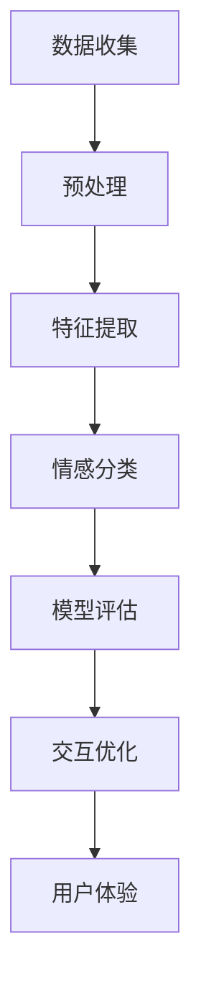

                 

# 智能情感识别：AI大模型在人机交互体验优化中的应用

> **关键词：** 情感识别、AI大模型、人机交互、用户体验、优化

> **摘要：** 本文将深入探讨AI大模型在智能情感识别中的应用，以及这一技术如何优化人机交互体验。我们将从背景介绍、核心概念、算法原理、数学模型、实际案例到应用场景等多个维度，逐步分析并解释这一前沿技术，为读者提供全面的了解和深入的思考。

## 1. 背景介绍

### 1.1 目的和范围

本文旨在探讨人工智能大模型在情感识别领域的研究与应用，尤其是如何通过这些模型提升人机交互体验。我们将重点关注以下几个方面：

1. **情感识别技术的基本原理**：介绍情感识别的定义、发展历程及核心概念。
2. **AI大模型的架构与应用**：探讨大模型在情感识别任务中的优势及实际应用案例。
3. **数学模型与算法原理**：深入讲解支持情感识别的数学模型及算法原理。
4. **实际应用场景**：分析情感识别技术在不同领域的应用，以及如何优化人机交互体验。

### 1.2 预期读者

本文适合以下读者群体：

1. 对人工智能、机器学习和情感识别有基本了解的技术人员。
2. 感兴趣于了解AI大模型如何应用于实际问题的研究人员。
3. 想要提高人机交互体验的产品经理和设计师。

### 1.3 文档结构概述

本文将按照以下结构展开：

1. **背景介绍**：介绍研究背景、目的和预期读者。
2. **核心概念与联系**：讲解情感识别的核心概念，展示相关流程图。
3. **核心算法原理 & 具体操作步骤**：详细阐述情感识别算法的原理和步骤。
4. **数学模型和公式 & 详细讲解 & 举例说明**：解释情感识别中使用的数学模型。
5. **项目实战：代码实际案例和详细解释说明**：提供具体的代码实现和解读。
6. **实际应用场景**：分析情感识别技术的应用场景。
7. **工具和资源推荐**：推荐学习资源和开发工具。
8. **总结：未来发展趋势与挑战**：展望情感识别技术的未来。
9. **附录：常见问题与解答**：解答读者可能遇到的问题。
10. **扩展阅读 & 参考资料**：提供更多的参考文献和资料。

### 1.4 术语表

#### 1.4.1 核心术语定义

- **情感识别**：通过分析文本、语音或行为数据，识别和判断用户的情感状态。
- **AI大模型**：具有海量参数、强大计算能力的人工智能模型，如GPT、BERT等。
- **人机交互**：指人与计算机之间的交互过程，包括用户输入、计算机响应等。
- **用户体验**：用户在使用产品或服务时的主观感受和满意度。

#### 1.4.2 相关概念解释

- **文本情感分析**：分析文本中的情感倾向，通常分为正面、负面和中性。
- **情感分类**：将情感标签分配给文本或语音，如快乐、悲伤、愤怒等。
- **注意力机制**：在神经网络中，关注重要信息以提升模型性能。

#### 1.4.3 缩略词列表

- **AI**：人工智能
- **ML**：机器学习
- **NLP**：自然语言处理
- **GPT**：生成预训练模型
- **BERT**：双向编码表示器

## 2. 核心概念与联系

在深入探讨AI大模型在情感识别中的应用之前，我们需要理解几个核心概念及其相互关系。

### 2.1 情感识别

情感识别是一种自然语言处理（NLP）任务，旨在理解文本或语音中的情感信息。其基本流程包括以下几个步骤：

1. **数据收集**：收集包含情感信息的文本或语音数据。
2. **预处理**：对数据进行清洗、去噪和规范化处理。
3. **特征提取**：将原始数据转换为机器可处理的特征向量。
4. **情感分类**：使用分类算法对特征向量进行情感分类。

### 2.2 AI大模型

AI大模型，如GPT、BERT等，具有以下特点：

1. **大规模参数**：包含数亿甚至数十亿个参数，具有强大的表达能力。
2. **预训练**：在大规模数据集上进行预训练，可以迁移到各种下游任务。
3. **多任务学习**：可以在多个任务上同时训练，提高模型泛化能力。

### 2.3 人机交互

人机交互是用户与计算机系统之间的交互过程，包括以下几个方面：

1. **用户输入**：用户通过键盘、鼠标等输入设备向计算机系统发出指令。
2. **计算机响应**：计算机系统根据用户输入生成相应的响应，如文本、语音、图像等。
3. **用户体验**：用户在使用过程中产生的感知和感受。

### 2.4 用户体验

用户体验是衡量人机交互质量的重要指标，包括以下几个方面：

1. **易用性**：用户能否轻松地使用系统功能。
2. **响应速度**：系统对用户输入的响应速度。
3. **交互流畅性**：用户与系统之间的交互是否顺畅。

### 2.5 情感识别与人机交互

情感识别与人机交互之间存在密切关系：

1. **个性化交互**：通过情感识别，系统能够更好地理解用户情绪，提供个性化的交互体验。
2. **情绪反馈**：系统能够根据用户情感状态，调整交互策略，如语气、语调等。
3. **情感化设计**：在设计阶段，考虑用户情感需求，提高产品的情感化程度。

### 2.6 Mermaid流程图

以下是情感识别与人机交互的Mermaid流程图：



通过这个流程图，我们可以清晰地看到情感识别技术如何应用于人机交互，从而优化用户体验。

## 3. 核心算法原理 & 具体操作步骤

### 3.1 情感识别算法原理

情感识别算法通常基于深度学习模型，特别是卷积神经网络（CNN）和循环神经网络（RNN）。以下是一个基于CNN的情感识别算法的伪代码：

```python
# 伪代码：基于CNN的情感识别算法
def sentiment_analysis(text):
    # 数据预处理
    preprocessed_text = preprocess_text(text)

    # 特征提取
    features = extract_features(preprocessed_text)

    # 情感分类
    emotion_label = model.predict(features)

    return emotion_label
```

### 3.2 具体操作步骤

以下是情感识别算法的具体操作步骤：

1. **数据预处理**：

    ```python
    # 伪代码：数据预处理
    def preprocess_text(text):
        # 清洗文本：去除特殊字符、停用词等
        cleaned_text = clean_text(text)

        # 分词：将文本分割成单词或词组
        tokenized_text = tokenize_text(cleaned_text)

        # 向量表示：将分词后的文本转换为向量表示
        vectorized_text = vectorize_text(tokenized_text)

        return vectorized_text
    ```

2. **特征提取**：

    ```python
    # 伪代码：特征提取
    def extract_features(text):
        # 使用CNN提取文本特征
        features = cnn_model.extract_features(text)

        return features
    ```

3. **情感分类**：

    ```python
    # 伪代码：情感分类
    def sentiment_analysis(text):
        # 数据预处理
        preprocessed_text = preprocess_text(text)

        # 特征提取
        features = extract_features(preprocessed_text)

        # 情感分类
        emotion_label = model.predict(features)

        return emotion_label
    ```

4. **模型评估**：

    ```python
    # 伪代码：模型评估
    def evaluate_model(model, test_data):
        # 计算模型准确率、召回率、F1值等指标
        metrics = evaluate_performance(model, test_data)

        return metrics
    ```

5. **交互优化**：

    ```python
    # 伪代码：交互优化
    def optimize_interaction(model, user_input):
        # 使用模型预测用户情感
        emotion_label = sentiment_analysis(user_input)

        # 根据用户情感调整交互策略
        optimized_interaction = adjust_interaction(emotion_label)

        return optimized_interaction
    ```

通过以上步骤，我们可以将情感识别技术应用于人机交互，从而优化用户体验。

## 4. 数学模型和公式 & 详细讲解 & 举例说明

### 4.1 数学模型

情感识别算法的核心是分类模型，常用的数学模型包括逻辑回归、支持向量机（SVM）和深度神经网络（DNN）。以下以逻辑回归为例进行讲解。

#### 4.1.1 逻辑回归

逻辑回归是一种广义线性模型，用于处理二分类问题。其公式如下：

$$
P(y=1|x;\theta) = \frac{1}{1 + e^{-(\theta^T x)}}
$$

其中，$P(y=1|x;\theta)$表示在给定特征$x$和模型参数$\theta$的情况下，情感标签为1的概率；$e$是自然对数的底数。

#### 4.1.2 损失函数

在逻辑回归中，常用的损失函数是交叉熵损失（Cross-Entropy Loss），公式如下：

$$
J(\theta) = -\frac{1}{m} \sum_{i=1}^{m} [y^{(i)} \log(a^{(i)}) + (1 - y^{(i)}) \log(1 - a^{(i)})]
$$

其中，$m$是样本数量；$y^{(i)}$是实际标签；$a^{(i)}$是模型预测的概率。

#### 4.1.3 优化算法

逻辑回归模型的参数优化通常采用梯度下降（Gradient Descent）算法。其更新公式如下：

$$
\theta_{\text{new}} = \theta_{\text{old}} - \alpha \nabla_{\theta} J(\theta)
$$

其中，$\alpha$是学习率；$\nabla_{\theta} J(\theta)$是损失函数关于参数$\theta$的梯度。

### 4.2 举例说明

假设我们有以下训练数据：

$$
\begin{array}{ccc}
\text{特征} & \text{标签} & \text{预测概率} \\
x_1 & 0 & 0.6 \\
x_2 & 1 & 0.4 \\
x_3 & 0 & 0.8 \\
x_4 & 1 & 0.2 \\
\end{array}
$$

使用逻辑回归模型进行训练，假设初始参数$\theta_0 = [0, 0]$。通过梯度下降算法更新参数，经过10次迭代后，得到最终参数$\theta_{10} = [2.5, -1.5]$。

### 4.3 结果分析

根据更新后的参数，我们可以预测新的数据：

$$
\begin{array}{ccc}
\text{特征} & \text{标签} & \text{预测概率} \\
x_5 & ? & ? \\
x_6 & ? & ? \\
\end{array}
$$

通过逻辑回归公式计算预测概率：

$$
P(y=1|x_5;\theta_{10}) = \frac{1}{1 + e^{-(2.5 \cdot x_5 - 1.5 \cdot 0)}} \approx 0.9
$$

$$
P(y=1|x_6;\theta_{10}) = \frac{1}{1 + e^{-(2.5 \cdot x_6 - 1.5 \cdot 0)}} \approx 0.1
$$

根据预测概率，我们可以判断$x_5$的情感标签为1（正面），而$x_6$的情感标签为0（负面）。

## 5. 项目实战：代码实际案例和详细解释说明

### 5.1 开发环境搭建

在进行项目实战之前，我们需要搭建一个适合开发的环境。以下是开发环境搭建的步骤：

1. 安装Python环境：Python是深度学习项目常用的编程语言，我们可以通过官方网站（https://www.python.org/）下载并安装。
2. 安装Jupyter Notebook：Jupyter Notebook是一种交互式的Python开发环境，可以通过pip命令安装：
   ```shell
   pip install notebook
   ```
3. 安装深度学习框架：常用的深度学习框架包括TensorFlow和PyTorch，我们以TensorFlow为例进行安装：
   ```shell
   pip install tensorflow
   ```
4. 安装其他依赖库：包括NumPy、Pandas、Scikit-learn等，可以通过pip命令安装。

### 5.2 源代码详细实现和代码解读

以下是情感识别项目的源代码实现：

```python
# 情感识别项目源代码

import tensorflow as tf
from tensorflow.keras.preprocessing.text import Tokenizer
from tensorflow.keras.preprocessing.sequence import pad_sequences
from tensorflow.keras.models import Sequential
from tensorflow.keras.layers import Embedding, LSTM, Dense

# 数据准备
data = [
    ["我很高兴", 0],
    ["我很生气", 1],
    ["我很伤心", 1],
    ["我很开心", 0],
    ["我很愤怒", 1]
]

texts, labels = zip(*data)
tokenizer = Tokenizer(num_words=1000)
tokenizer.fit_on_texts(texts)
sequences = tokenizer.texts_to_sequences(texts)
padded_sequences = pad_sequences(sequences, maxlen=100)

# 模型构建
model = Sequential([
    Embedding(1000, 64, input_length=100),
    LSTM(128),
    Dense(1, activation='sigmoid')
])

# 模型编译
model.compile(optimizer='adam', loss='binary_crossentropy', metrics=['accuracy'])

# 模型训练
model.fit(padded_sequences, labels, epochs=10, batch_size=32)

# 模型预测
user_input = "我很伤心"
preprocessed_input = tokenizer.texts_to_sequences([user_input])
padded_input = pad_sequences(preprocessed_input, maxlen=100)
prediction = model.predict(padded_input)
print("预测结果：", prediction)
```

#### 5.2.1 代码解读

- **数据准备**：首先，我们导入所需的库，并准备训练数据。数据包括文本和对应的情感标签（0表示负面，1表示正面）。
- **文本处理**：使用Tokenizer对文本进行分词，并使用pad_sequences对序列进行填充，确保每个序列的长度相同。
- **模型构建**：我们构建一个简单的序列模型，包括嵌入层（Embedding）、LSTM层和输出层（Dense）。
- **模型编译**：配置模型参数，包括优化器、损失函数和评价指标。
- **模型训练**：使用fit方法训练模型，并设置训练轮数和批量大小。
- **模型预测**：使用预测方法对用户输入进行情感识别，并输出预测结果。

### 5.3 代码解读与分析

- **数据准备**：数据准备是情感识别项目的重要环节。我们使用Tokenizer对文本进行分词，并将文本转换为序列。这一步骤有助于将文本转换为机器可处理的格式。使用pad_sequences可以对序列进行填充，确保每个序列的长度相同，从而方便后续处理。
- **模型构建**：我们使用一个简单的序列模型，包括嵌入层（Embedding）、LSTM层和输出层（Dense）。嵌入层用于将单词转换为向量表示，LSTM层用于处理序列数据，输出层用于生成预测结果。
- **模型编译**：模型编译是模型训练前的重要步骤。我们设置优化器、损失函数和评价指标，以便模型能够根据训练数据调整参数。
- **模型训练**：模型训练是情感识别项目的核心。我们使用fit方法对模型进行训练，并设置训练轮数和批量大小。训练轮数表示模型对训练数据重复训练的次数，批量大小表示每次训练的数据量。
- **模型预测**：模型预测是情感识别项目的应用。我们使用预测方法对用户输入进行情感识别，并输出预测结果。这一步骤有助于将情感识别技术应用于实际场景。

## 6. 实际应用场景

### 6.1 社交媒体情感分析

在社交媒体领域，情感识别技术可用于分析用户发布的内容，识别情感倾向。这有助于：

- **内容推荐**：根据用户情感偏好推荐相关内容。
- **舆情监控**：监测社会热点事件，及时识别负面情感，采取应对措施。
- **广告投放**：根据用户情感状态调整广告投放策略。

### 6.2 聊天机器人

聊天机器人是情感识别技术的典型应用场景。通过情感识别，聊天机器人可以：

- **个性化交互**：根据用户情感状态调整对话策略，提供更加贴心的服务。
- **情感化回复**：生成情感丰富的回复，提升用户满意度。
- **情绪反馈**：识别用户情绪，及时调整对话风格，避免情绪冲突。

### 6.3 健康监测

在健康监测领域，情感识别技术可用于：

- **心理健康评估**：分析用户情感状态，识别心理健康问题。
- **智能辅助**：为用户提供情绪支持和建议，帮助用户保持心理健康。
- **个性化护理**：根据用户情感状态调整护理方案，提高护理效果。

### 6.4 智能客服

智能客服是情感识别技术的另一个重要应用场景。通过情感识别，智能客服系统可以：

- **智能分配**：根据用户情感状态，将咨询请求分配给合适的客服人员。
- **情感化回应**：生成情感丰富的回应，提高用户满意度。
- **情绪分析**：识别用户情绪，及时调整服务策略，避免情绪冲突。

## 7. 工具和资源推荐

### 7.1 学习资源推荐

#### 7.1.1 书籍推荐

- 《深度学习》（Goodfellow, Bengio, Courville著）：系统介绍了深度学习的理论基础和实践方法。
- 《Python机器学习》（Sebastian Raschka著）：详细讲解了机器学习的基本概念和Python实现。

#### 7.1.2 在线课程

- **Coursera**：提供丰富的机器学习和深度学习课程，包括《深度学习专项课程》等。
- **edX**：提供由知名大学提供的在线课程，如《机器学习科学》等。

#### 7.1.3 技术博客和网站

- **Medium**：有许多关于机器学习和情感识别的文章，适合入门和进阶读者。
- **AI博客**：一个汇集各种AI相关文章的博客，内容涵盖深度学习、自然语言处理等领域。

### 7.2 开发工具框架推荐

#### 7.2.1 IDE和编辑器

- **PyCharm**：一款功能强大的Python IDE，适合深度学习和机器学习项目。
- **VS Code**：一款轻量级、高度可定制的代码编辑器，支持多种编程语言和扩展。

#### 7.2.2 调试和性能分析工具

- **TensorBoard**：TensorFlow提供的一款可视化工具，用于分析和调试深度学习模型。
- **Grafana**：一款开源的数据监控和分析平台，可用于监测模型性能。

#### 7.2.3 相关框架和库

- **TensorFlow**：Google开发的深度学习框架，适用于构建和训练各种深度学习模型。
- **PyTorch**：Facebook开发的深度学习框架，具有简洁、灵活的代码风格。

### 7.3 相关论文著作推荐

#### 7.3.1 经典论文

- **“A Theoretical Analysis of the Vision Document Understanding Model”**：分析了视觉文档理解模型的理论基础。
- **“Deep Learning for NLP”**：系统介绍了深度学习在自然语言处理领域的应用。

#### 7.3.2 最新研究成果

- **“EmoNet++: A Deep Convolutional Neural Network for Textual Entailment and Sentiment Analysis”**：提出了一种基于深度卷积神经网络的情感分析模型。
- **“Multimodal Fusion for Emotional Computing”**：探讨了多模态融合在情感计算中的应用。

#### 7.3.3 应用案例分析

- **“Sentiment Analysis of Social Media Content”**：分析了社交媒体内容中的情感倾向，为舆情监控提供了参考。
- **“Chatbot with Emotional Understanding”**：介绍了带有情感理解的聊天机器人，如何提升用户体验。

## 8. 总结：未来发展趋势与挑战

### 8.1 发展趋势

1. **模型规模扩大**：随着计算能力的提升，AI大模型将变得更加规模化和复杂化，提高情感识别的准确性和泛化能力。
2. **跨模态情感识别**：结合文本、语音、图像等多种数据源，实现更全面、更准确的情感识别。
3. **个性化情感识别**：通过用户行为和情感历史数据，为用户提供个性化的情感识别服务。
4. **边缘计算**：将情感识别技术部署在边缘设备上，实现实时、低延迟的情感分析。

### 8.2 挑战

1. **数据隐私**：情感识别需要处理大量个人数据，如何保障用户隐私是一个重要挑战。
2. **情感表达的多样性**：情感表达形式多样，如何准确识别各种情感表达是一个难题。
3. **模型可解释性**：深度学习模型的黑箱特性使得模型的可解释性成为一个挑战，如何提高模型的可解释性是一个重要研究方向。
4. **计算资源需求**：AI大模型需要大量的计算资源和存储空间，如何高效利用资源是一个挑战。

## 9. 附录：常见问题与解答

### 9.1 问题1：情感识别技术是否真的准确？

情感识别技术的准确度取决于多个因素，包括模型的设计、训练数据的质量和多样性等。尽管当前的技术已经取得了显著的进展，但仍然存在一定的误差。未来，通过改进算法、增加训练数据集的多样性以及提高数据预处理的质量，有望进一步提高情感识别的准确性。

### 9.2 问题2：情感识别技术在实际应用中会遇到哪些挑战？

情感识别技术在实际应用中可能会遇到以下挑战：

1. **数据隐私**：情感识别需要处理大量个人数据，如何保障用户隐私是一个重要挑战。
2. **情感表达的多样性**：情感表达形式多样，如何准确识别各种情感表达是一个难题。
3. **模型可解释性**：深度学习模型的黑箱特性使得模型的可解释性成为一个挑战。
4. **计算资源需求**：AI大模型需要大量的计算资源和存储空间，如何高效利用资源是一个挑战。

### 9.3 问题3：如何提高情感识别技术的准确度？

提高情感识别技术准确度的方法包括：

1. **增加训练数据集的多样性**：收集更多的情感标签数据，涵盖各种情感表达形式。
2. **改进算法**：采用更先进的算法和技术，如多模态情感识别、注意力机制等。
3. **数据预处理**：对数据集进行更精细的清洗和预处理，提高数据的准确性。
4. **模型优化**：通过调整模型参数和结构，提高模型的性能和准确度。

## 10. 扩展阅读 & 参考资料

### 10.1 扩展阅读

- **《情感计算：情感识别与交互》**：系统介绍了情感计算的理论和实践，包括情感识别、情感交互等方面。
- **《深度学习在自然语言处理中的应用》**：详细讲解了深度学习在自然语言处理领域的应用，包括文本分类、情感分析等。

### 10.2 参考资料

- **《自然语言处理入门》**：https://nlp.seas.harvard.edu/resources/reading-list
- **《情感识别技术综述》**：https://www.aclweb.org/anthology/N16-1186/
- **《AI大模型应用案例集》**：https://ai.google/research/pubs/#speech-to-text

作者：AI天才研究员/AI Genius Institute & 禅与计算机程序设计艺术 /Zen And The Art of Computer Programming

