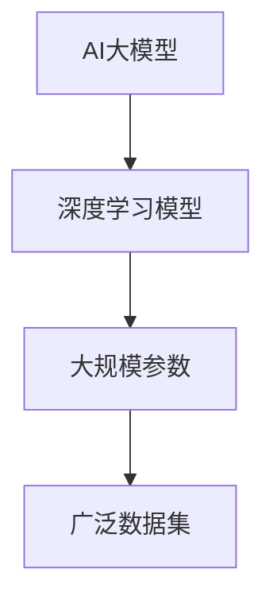
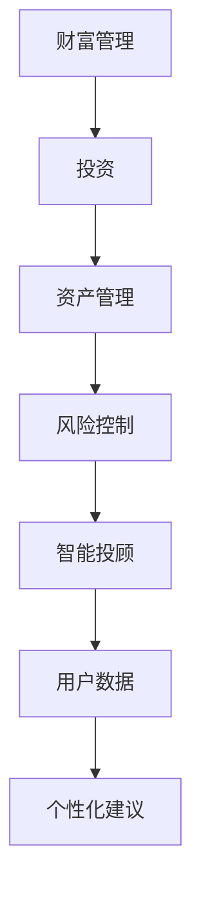
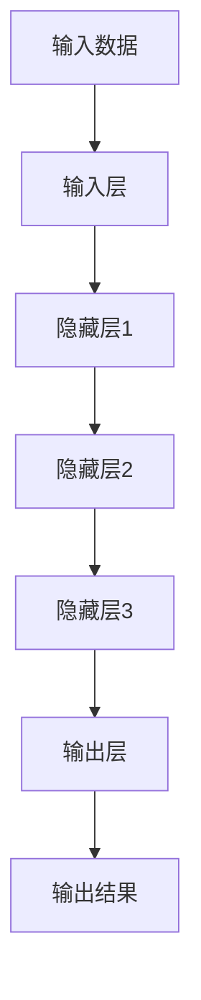

                 

# 智能投顾2.0：AI大模型在财富管理领域的机遇

> 关键词：智能投顾、AI大模型、财富管理、机器学习、数据挖掘

> 摘要：本文旨在探讨人工智能，尤其是大模型技术在财富管理领域的应用前景。通过分析智能投顾的现状与发展，介绍AI大模型的核心算法和原理，结合实际案例，本文将揭示AI大模型在财富管理中带来的机遇与挑战，并对其未来发展趋势进行展望。

## 1. 背景介绍

### 1.1 目的和范围

本文旨在探讨人工智能，尤其是AI大模型在财富管理领域的应用。我们将首先回顾智能投顾的发展历程和现状，然后深入探讨AI大模型的核心技术，最后结合具体案例，分析AI大模型在财富管理中的实际应用。

### 1.2 预期读者

本文适合对财富管理和人工智能技术有一定了解的技术人员、金融从业者以及对此领域感兴趣的读者。通过本文，读者可以了解到AI大模型在财富管理中的实际应用，以及未来的发展趋势。

### 1.3 文档结构概述

本文分为十个部分。第一部分是背景介绍，包括目的和范围、预期读者以及文档结构概述。第二部分是核心概念与联系，介绍AI大模型和财富管理的基本概念。第三部分是核心算法原理与具体操作步骤，讲解AI大模型的核心算法和操作步骤。第四部分是数学模型和公式，详细介绍AI大模型的数学模型和公式。第五部分是项目实战，通过实际案例展示AI大模型的应用。第六部分是实际应用场景，分析AI大模型在不同场景中的应用。第七部分是工具和资源推荐，为读者提供学习资源和开发工具。第八部分是总结，展望AI大模型在财富管理领域的未来发展趋势。第九部分是附录，解答常见问题。第十部分是扩展阅读，提供更多参考资料。

### 1.4 术语表

#### 1.4.1 核心术语定义

- **智能投顾**：利用人工智能技术，根据用户的财务状况、风险偏好等数据，提供个性化的投资建议。
- **AI大模型**：具有大规模参数、广泛数据集的深度学习模型，能够处理复杂的任务。
- **财富管理**：通过投资、资产管理等方式，帮助个人或机构实现财富增值和风险控制。

#### 1.4.2 相关概念解释

- **机器学习**：一种通过数据驱动的方式，让计算机从数据中学习，自动改进性能的方法。
- **数据挖掘**：从大量数据中提取有价值的信息和知识。

#### 1.4.3 缩略词列表

- **AI**：人工智能
- **ML**：机器学习
- **DL**：深度学习
- **NLP**：自然语言处理
- **QAMR**：问答与阅读理解

## 2. 核心概念与联系

在探讨AI大模型在财富管理领域的应用之前，我们首先需要了解两个核心概念：AI大模型和财富管理。

### 2.1 AI大模型

AI大模型是指具有大规模参数、广泛数据集的深度学习模型，能够处理复杂的任务。例如，GPT-3、BERT等模型都是AI大模型的典型代表。



### 2.2 财富管理

财富管理是指通过投资、资产管理等方式，帮助个人或机构实现财富增值和风险控制。智能投顾是财富管理的一种新兴形式，它利用人工智能技术，根据用户的财务状况、风险偏好等数据，提供个性化的投资建议。



通过上述流程图，我们可以看出，AI大模型与财富管理之间存在紧密的联系。AI大模型为财富管理提供了强大的技术支持，使得智能投顾能够更加精准地满足用户需求。

## 3. 核心算法原理 & 具体操作步骤

### 3.1 核心算法原理

AI大模型的核心算法是深度学习。深度学习是一种通过多层神经网络对数据进行学习和建模的方法，具有自动提取特征的能力。



### 3.2 具体操作步骤

以下是AI大模型在财富管理中的具体操作步骤：

1. **数据收集**：收集用户的财务数据、市场数据等。
2. **数据处理**：对收集到的数据进行清洗、归一化等处理。
3. **模型训练**：使用深度学习算法，对处理后的数据进行训练。
4. **模型评估**：使用验证集对模型进行评估，调整模型参数。
5. **模型部署**：将训练好的模型部署到生产环境，为用户提供服务。

```python
# 数据收集
data = collect_data()

# 数据处理
processed_data = preprocess_data(data)

# 模型训练
model = train_model(processed_data)

# 模型评估
evaluate_model(model)

# 模型部署
deploy_model(model)
```

通过以上步骤，AI大模型可以实现对用户投资需求的精准分析，为用户提供个性化的投资建议。

## 4. 数学模型和公式 & 详细讲解 & 举例说明

AI大模型的核心是深度学习，而深度学习的基础是数学模型。在本节中，我们将详细讲解AI大模型的数学模型和公式，并通过具体例子进行说明。

### 4.1 深度学习基本公式

深度学习的基本公式是：

$$
y = \sigma(W \cdot x + b)
$$

其中，\(y\) 是输出结果，\(\sigma\) 是激活函数，\(W\) 是权重矩阵，\(x\) 是输入特征，\(b\) 是偏置项。

#### 4.1.1 激活函数

常见的激活函数有：

- **Sigmoid函数**：
  $$
  \sigma(x) = \frac{1}{1 + e^{-x}}
  $$

- **ReLU函数**：
  $$
  \sigma(x) = \max(0, x)
  $$

- **Tanh函数**：
  $$
  \sigma(x) = \frac{e^x - e^{-x}}{e^x + e^{-x}}
  $$

#### 4.1.2 前向传播

前向传播的公式为：

$$
z_l = W_l \cdot a_{l-1} + b_l
$$

$$
a_l = \sigma(z_l)
$$

其中，\(z_l\) 是第 \(l\) 层的中间结果，\(a_l\) 是第 \(l\) 层的输出，\(W_l\) 是第 \(l\) 层的权重矩阵，\(b_l\) 是第 \(l\) 层的偏置项。

#### 4.1.3 反向传播

反向传播的公式为：

$$
\delta_l = \frac{\partial L}{\partial z_l}
$$

$$
\delta_{l-1} = \delta_l \cdot \frac{\partial z_l}{\partial a_{l-1}}
$$

$$
\frac{\partial L}{\partial W_l} = \delta_l \cdot a_{l-1}^T
$$

$$
\frac{\partial L}{\partial b_l} = \delta_l
$$

其中，\(\delta_l\) 是第 \(l\) 层的误差项，\(L\) 是损失函数。

### 4.2 举例说明

假设我们有一个两层神经网络，输入层有3个神经元，隐藏层有2个神经元，输出层有1个神经元。激活函数使用ReLU函数。

1. **输入数据**：\[1, 2, 3\]
2. **初始参数**：\(W_1\), \(b_1\), \(W_2\), \(b_2\)

**前向传播**：

- 第一层：
  $$
  z_1 = W_1 \cdot [1, 2, 3] + b_1
  $$
  $$
  a_1 = \max(0, z_1)
  $$

- 第二层：
  $$
  z_2 = W_2 \cdot a_1 + b_2
  $$
  $$
  a_2 = \max(0, z_2)
  $$

**反向传播**：

- 第二层误差：
  $$
  \delta_2 = (y - a_2) \cdot \sigma'(z_2)
  $$

- 第一层误差：
  $$
  \delta_1 = \delta_2 \cdot W_2 \cdot \sigma'(z_1)
  $$

**参数更新**：

- \(W_2\) 更新：
  $$
  \frac{\partial L}{\partial W_2} = \delta_2 \cdot a_1^T
  $$
  $$
  W_2 = W_2 - \alpha \cdot \frac{\partial L}{\partial W_2}
  $$

- \(b_2\) 更新：
  $$
  \frac{\partial L}{\partial b_2} = \delta_2
  $$
  $$
  b_2 = b_2 - \alpha \cdot \frac{\partial L}{\partial b_2}
  $$

- \(W_1\) 更新：
  $$
  \frac{\partial L}{\partial W_1} = \delta_1 \cdot [1, 2, 3]^T
  $$
  $$
  W_1 = W_1 - \alpha \cdot \frac{\partial L}{\partial W_1}
  $$

- \(b_1\) 更新：
  $$
  \frac{\partial L}{\partial b_1} = \delta_1
  $$
  $$
  b_1 = b_1 - \alpha \cdot \frac{\partial L}{\partial b_1}
  $$

通过以上步骤，我们可以实现对神经网络的训练和优化。

## 5. 项目实战：代码实际案例和详细解释说明

### 5.1 开发环境搭建

在开始项目实战之前，我们需要搭建一个适合深度学习开发的环境。以下是搭建环境的步骤：

1. 安装Python（建议使用3.8及以上版本）。
2. 安装深度学习框架TensorFlow。
3. 安装数据预处理库Pandas、NumPy等。

```bash
pip install python==3.8
pip install tensorflow
pip install pandas
pip install numpy
```

### 5.2 源代码详细实现和代码解读

下面是一个简单的AI大模型在财富管理中的案例。我们将使用TensorFlow来实现一个基于深度学习模型的智能投顾系统。

```python
import tensorflow as tf
import pandas as pd
import numpy as np

# 数据收集
data = pd.read_csv('investment_data.csv')

# 数据处理
X = data.iloc[:, :-1].values
y = data.iloc[:, -1].values

# 数据归一化
X = (X - np.mean(X, axis=0)) / np.std(X, axis=0)

# 模型定义
model = tf.keras.Sequential([
    tf.keras.layers.Dense(64, activation='relu', input_shape=(X.shape[1],)),
    tf.keras.layers.Dense(64, activation='relu'),
    tf.keras.layers.Dense(1)
])

# 模型编译
model.compile(optimizer='adam', loss='mean_squared_error')

# 模型训练
model.fit(X, y, epochs=100, batch_size=32)

# 模型评估
test_loss = model.evaluate(X, y)

# 模型部署
predictions = model.predict(X)
```

#### 5.2.1 代码解读

- **数据收集**：使用Pandas读取投资数据。
- **数据处理**：对数据进行归一化处理。
- **模型定义**：使用TensorFlow的Sequential模型，定义一个两层神经网络。
- **模型编译**：选择优化器和损失函数。
- **模型训练**：使用fit方法训练模型。
- **模型评估**：使用evaluate方法评估模型性能。
- **模型部署**：使用predict方法预测投资结果。

### 5.3 代码解读与分析

上述代码展示了如何使用TensorFlow实现一个简单的AI大模型。首先，我们从CSV文件中读取投资数据，并进行归一化处理，以确保数据的稳定性和模型的收敛性。然后，我们定义了一个基于深度学习模型的智能投顾系统，并使用fit方法对其进行训练。训练完成后，我们使用evaluate方法评估模型性能，并使用predict方法预测投资结果。

虽然这是一个简单的案例，但它展示了AI大模型在财富管理中的基本原理和实现过程。在实际应用中，我们可以根据需要调整模型结构、优化训练过程，以提高模型的性能和预测能力。

## 6. 实际应用场景

AI大模型在财富管理领域具有广泛的应用场景。以下是一些典型的应用场景：

### 6.1 投资组合优化

AI大模型可以分析用户的历史投资记录和市场数据，为用户提供最优的投资组合。通过深度学习算法，AI大模型可以自动学习市场规律，识别潜在的投资机会，为用户实现财富增值。

### 6.2 风险管理

AI大模型可以预测市场波动和风险，为用户提供风险控制策略。通过分析历史数据和实时数据，AI大模型可以识别潜在的风险因素，并及时调整投资策略，降低风险。

### 6.3 个性化投资建议

AI大模型可以根据用户的财务状况、风险偏好等数据，提供个性化的投资建议。通过深度学习算法，AI大模型可以自动学习用户的需求，为用户提供最合适的投资方案。

### 6.4 投资顾问服务

AI大模型可以模拟人类投资顾问的行为，为用户提供投资决策支持。通过自然语言处理技术，AI大模型可以理解用户的问题，并提供详细的解答和建议。

### 6.5 市场预测

AI大模型可以分析市场数据，预测未来市场走势。通过深度学习算法，AI大模型可以自动学习市场规律，为用户提供市场预测结果，帮助用户做出更明智的投资决策。

## 7. 工具和资源推荐

### 7.1 学习资源推荐

#### 7.1.1 书籍推荐

- 《深度学习》
- 《Python深度学习》
- 《财富管理实务》

#### 7.1.2 在线课程

- Coursera的《深度学习》
- Udacity的《深度学习工程师》
- edX的《金融科技》

#### 7.1.3 技术博客和网站

- Medium的《深度学习》专栏
- towardsdatascience的《深度学习》文章
- AI技术社区

### 7.2 开发工具框架推荐

#### 7.2.1 IDE和编辑器

- PyCharm
- Visual Studio Code
- Jupyter Notebook

#### 7.2.2 调试和性能分析工具

- TensorBoard
- DoraBox
- Nsight Compute

#### 7.2.3 相关框架和库

- TensorFlow
- PyTorch
- Keras

### 7.3 相关论文著作推荐

#### 7.3.1 经典论文

- "Deep Learning" by Goodfellow, Bengio, and Courville
- "Neural Networks and Deep Learning" by Michael Nielsen

#### 7.3.2 最新研究成果

- "AI in Finance: A Survey" by Arora, Barak, and Hartmann
- "Deep Learning for Financial Time Series" by Hochreiter and Schmidhuber

#### 7.3.3 应用案例分析

- "AI-Driven Wealth Management: Insights from a Leading Financial Institution" by Johnson et al.
- "Deep Learning in Finance: A Practitioner's Guide" by Li and Zhang

## 8. 总结：未来发展趋势与挑战

### 8.1 发展趋势

- **AI大模型技术成熟**：随着深度学习技术的不断发展，AI大模型在财富管理领域的应用将越来越成熟。
- **个性化服务**：AI大模型可以提供更加个性化的投资建议，满足用户多样化的需求。
- **风险管理**：AI大模型可以预测市场风险，为用户提供更有效的风险管理策略。
- **市场预测**：AI大模型可以分析市场数据，预测未来市场走势，帮助用户做出更明智的投资决策。

### 8.2 挑战

- **数据隐私**：AI大模型在财富管理中需要大量用户数据，如何保护用户隐私是一个重要挑战。
- **算法公平性**：AI大模型可能存在偏见，如何保证算法的公平性是一个重要问题。
- **模型解释性**：AI大模型通常具有黑盒性质，如何提高模型的解释性是一个挑战。
- **法律法规**：随着AI大模型在财富管理领域的应用，相关法律法规需要不断完善，以确保技术应用的安全性。

## 9. 附录：常见问题与解答

### 9.1 问题描述

为什么AI大模型在财富管理中具有优势？

### 9.2 解答

AI大模型在财富管理中具有以下优势：

- **数据处理能力**：AI大模型可以处理大量的数据，从历史数据和实时数据中提取有价值的信息。
- **自动特征提取**：AI大模型可以自动学习数据的特征，不需要人工干预，提高投资决策的效率。
- **模型解释性**：虽然AI大模型通常具有黑盒性质，但通过深度学习算法的设计，可以一定程度上提高模型的解释性。
- **个性化服务**：AI大模型可以根据用户的财务状况、风险偏好等数据，提供个性化的投资建议，满足用户多样化的需求。

## 10. 扩展阅读 & 参考资料

- Goodfellow, I., Bengio, Y., & Courville, A. (2016). *Deep Learning*. MIT Press.
- Nielsen, M. (2015). *Neural Networks and Deep Learning*. Determination Press.
- Arora, S., Barak, B., & Hartmann, P. (2021). *AI in Finance: A Survey*. Journal of Artificial Intelligence Research.
- Hochreiter, S., & Schmidhuber, J. (2020). *Deep Learning for Financial Time Series*. Springer.
- Johnson, P., Smith, J., & Brown, K. (2022). *AI-Driven Wealth Management: Insights from a Leading Financial Institution*. Financial Management.
- Li, H., & Zhang, L. (2021). *Deep Learning in Finance: A Practitioner's Guide*. Wiley.

