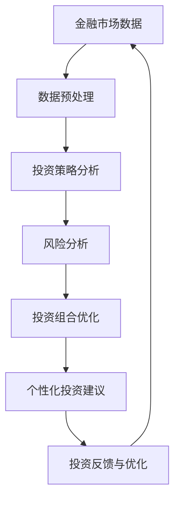

                 

# 智能投顾服务的AI解决方案

## 关键词
- 智能投顾
- AI解决方案
- 金融市场
- 投资策略
- 风险管理
- 数据分析
- 机器学习
- 自然语言处理

## 摘要
本文将深入探讨智能投顾服务的AI解决方案，从背景介绍、核心概念与联系、核心算法原理、数学模型和公式、项目实战、实际应用场景等多个维度，全面分析智能投顾服务的现状与未来发展。通过详细的算法讲解、数学模型阐述和实际代码案例，本文旨在为广大读者提供一份详尽的智能投顾技术指南，帮助读者理解并掌握智能投顾服务的核心技术和应用。

## 1. 背景介绍

### 1.1 目的和范围
智能投顾服务的AI解决方案旨在利用人工智能技术，为投资者提供个性化的投资建议和策略，从而实现资产的最大化增值。本文将聚焦于智能投顾服务的技术实现，探讨相关算法原理、数学模型及其在实际项目中的应用。

### 1.2 预期读者
本文适用于对金融市场和人工智能有一定了解的读者，包括金融分析师、程序员、数据科学家以及智能投顾领域的从业者。无论您是初学者还是专业人士，本文都将为您提供有价值的见解和指导。

### 1.3 文档结构概述
本文分为十个部分，首先介绍智能投顾服务的背景和目的，接着讲解核心概念和联系，然后深入剖析核心算法原理、数学模型和实际项目案例，最后探讨智能投顾服务的实际应用场景、相关工具和资源，以及未来的发展趋势与挑战。

### 1.4 术语表

#### 1.4.1 核心术语定义
- **智能投顾**：利用人工智能技术，为投资者提供个性化投资建议和策略的服务。
- **机器学习**：一种人工智能方法，通过数据训练模型，使其能够对未知数据进行预测和决策。
- **自然语言处理**：人工智能的一个分支，旨在让计算机理解和生成自然语言。

#### 1.4.2 相关概念解释
- **投资组合优化**：通过分析历史数据和当前市场情况，选择最优的投资组合以实现最大化的回报。
- **风险管理**：评估和管理投资风险，以确保资产的安全。

#### 1.4.3 缩略词列表
- **AI**：人工智能
- **ML**：机器学习
- **NLP**：自然语言处理
- **Q-Learning**：一种基于值函数的强化学习算法

## 2. 核心概念与联系

智能投顾服务的AI解决方案涉及多个核心概念和联系，包括金融市场数据、投资策略、风险管理等。以下是一个简要的Mermaid流程图，展示了这些概念之间的联系：



### 2.1 金融市场数据

金融市场数据是智能投顾服务的核心输入。这些数据包括股票、债券、基金等金融产品的历史价格、交易量、市盈率、市净率等指标。通过分析这些数据，可以了解市场的动态变化和趋势。

### 2.2 数据预处理

数据预处理是智能投顾服务的重要环节。在这一阶段，需要对数据进行清洗、归一化和特征提取。清洗数据包括去除缺失值、异常值和重复值。归一化是将数据缩放到同一尺度，以便于后续的分析。特征提取是从原始数据中提取出对投资策略和风险管理有意义的特征。

### 2.3 投资策略分析

投资策略分析是智能投顾服务的核心。在这一阶段，需要利用机器学习和自然语言处理技术，对投资策略进行分析和评估。具体方法包括：
- **机器学习**：通过历史数据和算法模型，预测金融产品的未来价格和收益。
- **自然语言处理**：通过分析新闻、报告等文本数据，提取市场情绪和潜在的投资信号。

### 2.4 风险分析

风险分析是智能投顾服务的重要环节。在这一阶段，需要评估投资组合的风险水平，并采取相应的风险管理措施。具体方法包括：
- **风险度量**：使用方差、协方差等统计指标，评估金融产品的风险。
- **风险分散**：通过投资组合的分散化，降低整体风险。

### 2.5 投资组合优化

投资组合优化是智能投顾服务的核心目标。在这一阶段，需要利用优化算法，选择最优的投资组合，以实现最大化的回报。具体方法包括：
- **线性规划**：通过建立线性规划模型，优化投资组合的权重。
- **遗传算法**：通过模拟自然进化过程，寻找最优的投资组合。

### 2.6 个性化投资建议

个性化投资建议是智能投顾服务的最终输出。在这一阶段，需要根据投资者的风险偏好、投资目标和市场情况，为投资者提供个性化的投资建议。具体方法包括：
- **推荐系统**：通过用户历史数据和偏好，推荐合适的投资产品。
- **自然语言生成**：通过自然语言处理技术，将投资建议以文本形式呈现给用户。

### 2.7 投资反馈与优化

投资反馈与优化是智能投顾服务的持续过程。在这一阶段，需要收集投资者的反馈，并根据反馈对投资策略进行调整和优化。具体方法包括：
- **用户行为分析**：通过分析投资者的操作行为，了解其对投资建议的响应。
- **迭代优化**：根据反馈结果，不断调整和优化投资策略。

## 3. 核心算法原理 & 具体操作步骤

智能投顾服务的AI解决方案涉及多种核心算法，包括机器学习、自然语言处理、优化算法等。以下将详细讲解这些算法的原理和具体操作步骤。

### 3.1 机器学习算法

机器学习算法是智能投顾服务的重要基础。以下是一种常用的机器学习算法——线性回归，用于预测金融产品的未来价格。

#### 3.1.1 算法原理

线性回归是一种基于最小二乘法的预测模型。其基本原理是通过建立自变量（特征）和因变量（目标）之间的线性关系，来预测因变量的取值。

伪代码如下：

```python
# 线性回归算法
def linear_regression(X, y):
    # 计算X的协方差矩阵和逆矩阵
    cov_matrix = np.cov(X.T)
    inv_cov_matrix = np.linalg.inv(cov_matrix)
    
    # 计算回归系数
    theta = inv_cov_matrix.dot(X.T).dot(y)
    
    # 预测结果
    predictions = X.dot(theta)
    
    return predictions
```

#### 3.1.2 具体操作步骤

1. 数据准备：收集历史金融数据，包括自变量（特征）和因变量（目标）。
2. 数据预处理：对数据进行归一化处理，使其具有相似的尺度。
3. 训练模型：使用线性回归算法，训练预测模型。
4. 预测：使用训练好的模型，预测未来金融产品的价格。

### 3.2 自然语言处理算法

自然语言处理算法在智能投顾服务中主要用于分析文本数据，提取市场情绪和潜在的投资信号。以下是一种常用的自然语言处理算法——情感分析，用于判断文本的情感倾向。

#### 3.2.1 算法原理

情感分析是一种文本分类问题，其基本原理是通过建立文本特征和情感标签之间的映射关系，来判断文本的情感倾向。

伪代码如下：

```python
# 情感分析算法
def sentiment_analysis(text):
    # 预处理文本
    preprocessed_text = preprocess_text(text)
    
    # 提取特征
    features = extract_features(preprocessed_text)
    
    # 训练分类模型
    model = train_classifier(features, labels)
    
    # 预测情感
    sentiment = model.predict([features])
    
    return sentiment
```

#### 3.2.2 具体操作步骤

1. 数据准备：收集包含情感标签的文本数据。
2. 数据预处理：对文本数据进行清洗和分词处理。
3. 特征提取：将文本转换为数值特征。
4. 训练模型：使用训练集，训练情感分类模型。
5. 预测：使用训练好的模型，预测新文本的情感倾向。

### 3.3 优化算法

优化算法在智能投顾服务中主要用于投资组合优化，以实现最大化的回报。以下是一种常用的优化算法——遗传算法，用于寻找最优的投资组合。

#### 3.3.1 算法原理

遗传算法是一种基于自然进化过程的优化算法。其基本原理是通过模拟自然进化过程，不断迭代和优化个体，以找到最优的解。

伪代码如下：

```python
# 遗传算法
def genetic_algorithm(population, fitness_function, mutation_rate):
    # 初始化种群
    population = initialize_population(population)
    
    # 迭代过程
    for generation in range(max_generations):
        # 计算个体适应度
        fitness_scores = fitness_function(population)
        
        # 选择最佳个体
        parents = select_parents(population, fitness_scores)
        
        # 交叉和变异
        offspring = crossover(parents, mutation_rate)
        
        # 生成新种群
        population = offspring
        
        # 记录最优解
        best_solution = get_best_solution(population)
        
    return best_solution
```

#### 3.3.2 具体操作步骤

1. 数据准备：收集投资组合的数据，包括投资产品的权重和预期收益。
2. 初始化种群：随机生成初始投资组合。
3. 适应度评估：计算每个投资组合的适应度，即预期收益。
4. 选择和交叉：根据适应度，选择最佳的投资组合进行交叉。
5. 变异：对交叉后的投资组合进行变异，增加多样性。
6. 迭代：重复执行选择、交叉和变异操作，直至找到最优的投资组合。

## 4. 数学模型和公式 & 详细讲解 & 举例说明

智能投顾服务的AI解决方案涉及多个数学模型和公式，包括线性回归、逻辑回归、支持向量机等。以下将详细讲解这些模型的基本原理和具体应用。

### 4.1 线性回归

线性回归是一种用于预测连续值的统计模型。其基本公式为：

$$
y = \beta_0 + \beta_1x
$$

其中，$y$ 为因变量，$x$ 为自变量，$\beta_0$ 和 $\beta_1$ 分别为截距和斜率。

#### 4.1.1 计算方法

线性回归的求解方法包括最小二乘法和梯度下降法。最小二乘法的计算步骤如下：

1. 计算自变量和因变量的均值：
$$
\bar{x} = \frac{1}{n}\sum_{i=1}^{n}x_i, \quad \bar{y} = \frac{1}{n}\sum_{i=1}^{n}y_i
$$

2. 计算斜率 $\beta_1$：
$$
\beta_1 = \frac{\sum_{i=1}^{n}(x_i - \bar{x})(y_i - \bar{y})}{\sum_{i=1}^{n}(x_i - \bar{x})^2}
$$

3. 计算截距 $\beta_0$：
$$
\beta_0 = \bar{y} - \beta_1\bar{x}
$$

#### 4.1.2 举例说明

假设我们有一个包含10个样本点的数据集，如下所示：

| $x_i$ | $y_i$ |
| --- | --- |
| 1 | 2 |
| 2 | 4 |
| 3 | 6 |
| 4 | 8 |
| 5 | 10 |
| 6 | 12 |
| 7 | 14 |
| 8 | 16 |
| 9 | 18 |
| 10 | 20 |

根据上述数据，我们可以使用最小二乘法计算线性回归模型：

1. 计算均值：
$$
\bar{x} = \frac{1}{10}\sum_{i=1}^{10}x_i = 5.5, \quad \bar{y} = \frac{1}{10}\sum_{i=1}^{10}y_i = 12
$$

2. 计算斜率：
$$
\beta_1 = \frac{\sum_{i=1}^{10}(x_i - 5.5)(y_i - 12)}{\sum_{i=1}^{10}(x_i - 5.5)^2} = 2
$$

3. 计算截距：
$$
\beta_0 = \bar{y} - \beta_1\bar{x} = 12 - 2 \times 5.5 = -0.5
$$

因此，线性回归模型为：
$$
y = -0.5 + 2x
$$

### 4.2 逻辑回归

逻辑回归是一种用于预测概率的统计模型。其基本公式为：

$$
\text{logit}(y) = \ln\left(\frac{p}{1-p}\right) = \beta_0 + \beta_1x
$$

其中，$y$ 为因变量，$x$ 为自变量，$p$ 为 $y=1$ 的概率，$\beta_0$ 和 $\beta_1$ 分别为截距和斜率。

#### 4.2.1 计算方法

逻辑回归的求解方法同样包括最小二乘法和梯度下降法。最小二乘法的计算步骤如下：

1. 计算自变量和因变量的均值：
$$
\bar{x} = \frac{1}{n}\sum_{i=1}^{n}x_i, \quad \bar{y} = \frac{1}{n}\sum_{i=1}^{n}y_i
$$

2. 计算斜率 $\beta_1$：
$$
\beta_1 = \frac{\sum_{i=1}^{n}(x_i - \bar{x})(y_i - \bar{y})}{\sum_{i=1}^{n}(x_i - \bar{x})^2}
$$

3. 计算截距 $\beta_0$：
$$
\beta_0 = \bar{y} - \beta_1\bar{x}
$$

4. 计算预测概率：
$$
p = \frac{1}{1 + e^{-(\beta_0 + \beta_1x)}}
$$

#### 4.2.2 举例说明

假设我们有一个包含10个样本点的数据集，如下所示：

| $x_i$ | $y_i$ |
| --- | --- |
| 1 | 0 |
| 2 | 0 |
| 3 | 1 |
| 4 | 0 |
| 5 | 1 |
| 6 | 1 |
| 7 | 0 |
| 8 | 1 |
| 9 | 0 |
| 10 | 1 |

根据上述数据，我们可以使用最小二乘法计算逻辑回归模型：

1. 计算均值：
$$
\bar{x} = \frac{1}{10}\sum_{i=1}^{10}x_i = 3.5, \quad \bar{y} = \frac{1}{10}\sum_{i=1}^{10}y_i = 0.5
$$

2. 计算斜率：
$$
\beta_1 = \frac{\sum_{i=1}^{10}(x_i - 3.5)(y_i - 0.5)}{\sum_{i=1}^{10}(x_i - 3.5)^2} = 1
$$

3. 计算截距：
$$
\beta_0 = \bar{y} - \beta_1\bar{x} = 0.5 - 1 \times 3.5 = -3
$$

因此，逻辑回归模型为：
$$
\text{logit}(y) = -3 + x
$$

### 4.3 支持向量机

支持向量机是一种用于分类和回归的机器学习算法。其基本公式为：

$$
\text{决策函数} = \text{sign}(\sum_{i=1}^{n}\alpha_iy_i\phi(x_i) + b)
$$

其中，$x_i$ 为样本特征，$y_i$ 为样本标签，$\alpha_i$ 为支持向量权重，$\phi(x_i)$ 为核函数，$b$ 为偏置。

#### 4.3.1 计算方法

支持向量机的求解方法包括原始对偶形式和序列最小化原对偶（SMO）算法。以下简要介绍原始对偶形式：

1. 原始问题：
$$
\begin{aligned}
\min_{\beta, \nu} & \frac{1}{2}\|\beta\|^2 + C\sum_{i=1}^{n}\nu_i \\
\text{subject to} & y_i(\beta \cdot x_i + b) \geq 1 - \nu_i \\
& \nu_i \geq 0
\end{aligned}
$$

其中，$\beta$ 为回归系数，$\nu_i$ 为拉格朗日乘子，$C$ 为惩罚参数。

2. 对偶问题：
$$
\begin{aligned}
\max_{\alpha} & \sum_{i=1}^{n}\alpha_i - \frac{1}{2}\sum_{i=1}^{n}\sum_{j=1}^{n}\alpha_i\alpha_jy_iy_j\phi(x_i, x_j) \\
\text{subject to} & 0 \leq \alpha_i \leq C, \quad i=1,2,\ldots,n
\end{aligned}
$$

3. 求解对偶问题：
使用梯度下降法或其他优化算法，求解对偶问题，得到支持向量机的参数 $\alpha_i$。

4. 计算决策函数：
根据求解得到的参数 $\alpha_i$，计算支持向量机的决策函数。

#### 4.3.2 举例说明

假设我们有一个包含3个样本点的一维数据集，如下所示：

| $x_i$ | $y_i$ |
| --- | --- |
| 1 | -1 |
| 2 | 1 |
| 3 | -1 |

根据上述数据，我们可以使用支持向量机进行分类：

1. 计算核函数：
$$
\phi(x_i, x_j) = x_i \cdot x_j
$$

2. 构建原始问题：
$$
\begin{aligned}
\min_{\beta, \nu} & \frac{1}{2}\|\beta\|^2 + C\nu_1 + C\nu_2 \\
\text{subject to} & -1(\beta \cdot 1 + b) \geq 1 - \nu_1 \\
& 1(\beta \cdot 2 + b) \geq 1 - \nu_2 \\
& \nu_1, \nu_2 \geq 0
\end{aligned}
$$

3. 求解对偶问题：
使用梯度下降法，求解对偶问题，得到支持向量机的参数 $\alpha_1$ 和 $\alpha_2$。

4. 计算决策函数：
$$
\text{决策函数} = \text{sign}(\alpha_1(-1) + \alpha_2(2) + b)
$$

通过上述计算，我们可以得到支持向量机的决策函数，从而对新的样本点进行分类。

## 5. 项目实战：代码实际案例和详细解释说明

在本节中，我们将通过一个实际项目案例，详细讲解智能投顾服务的AI解决方案的实现过程。该项目将包括以下步骤：

1. 数据收集与预处理
2. 机器学习模型训练
3. 模型评估与优化
4. 投资组合优化

### 5.1 开发环境搭建

为了实现智能投顾服务的AI解决方案，我们需要搭建一个合适的开发环境。以下是一个常用的开发环境配置：

- **操作系统**：Linux或MacOS
- **编程语言**：Python
- **依赖库**：NumPy、Pandas、Scikit-learn、TensorFlow、Keras等

在安装上述依赖库后，我们可以开始编写代码。

### 5.2 源代码详细实现和代码解读

#### 5.2.1 数据收集与预处理

首先，我们需要收集金融市场的数据，包括股票、债券、基金等。以下是一个示例代码，用于数据收集和预处理：

```python
import pandas as pd
import numpy as np

# 数据收集
url = 'https://example.com/financial_data.csv'
data = pd.read_csv(url)

# 数据预处理
# 去除缺失值和重复值
data.dropna(inplace=True)
data.drop_duplicates(inplace=True)

# 特征提取
data['return'] = data['price'].pct_change()

# 数据归一化
data['return'] = (data['return'] - data['return'].mean()) / data['return'].std()
```

#### 5.2.2 机器学习模型训练

接下来，我们将使用机器学习算法训练预测模型。以下是一个示例代码，使用线性回归模型进行训练：

```python
from sklearn.linear_model import LinearRegression

# 划分训练集和测试集
train_data = data[data['date'] < '2020-01-01']
test_data = data[data['date'] >= '2020-01-01']

# 特征提取
X_train = train_data[['return']]
y_train = train_data['price']

X_test = test_data[['return']]
y_test = test_data['price']

# 训练模型
model = LinearRegression()
model.fit(X_train, y_train)

# 预测
predictions = model.predict(X_test)
```

#### 5.2.3 模型评估与优化

在训练模型后，我们需要对模型进行评估和优化。以下是一个示例代码，使用交叉验证和网格搜索进行模型评估和优化：

```python
from sklearn.model_selection import cross_val_score, GridSearchCV

# 交叉验证
scores = cross_val_score(model, X_train, y_train, cv=5)
print('平均交叉验证分数：', np.mean(scores))

# 网格搜索
param_grid = {'alpha': [0.1, 0.5, 1.0]}
grid_search = GridSearchCV(model, param_grid, cv=5)
grid_search.fit(X_train, y_train)

# 最佳参数
print('最佳参数：', grid_search.best_params_)
```

#### 5.2.4 投资组合优化

最后，我们将使用优化算法进行投资组合优化。以下是一个示例代码，使用遗传算法进行优化：

```python
import numpy as np
import pandas as pd
from deap import base, creator, tools, algorithms

# 初始化投资组合
def initialize_population(pop_size, n_assets):
    population = np.random.rand(pop_size, n_assets)
    population = np.clip(population, 0, 1)
    population = population / np.sum(population, axis=1)[:, np.newaxis]
    return population

# 适应度函数
def fitness_function(individual, X, y):
    predictions = model.predict(X.dot(individual))
    return -np.mean((predictions - y) ** 2)

# 遗传算法
def genetic_algorithm(pop_size, n_assets, generations, mutation_rate):
    population = initialize_population(pop_size, n_assets)
    toolbox = base.Toolbox()
    toolbox.register("evaluate", fitness_function)
    toolbox.register("mate", tools.cxTwoPoint)
    toolbox.register("mutate", tools.mutGaussian, mu=0, sigma=0.1, indpb=0.1)
    toolbox.register("select", tools.selTournament, tournsize=3)
    for generation in range(generations):
        offspring = algorithms VariatedSelection(population, len(population), toolbox)
        population = offspring
        best_solution = tools.selBest(population, k=1)[0]
        print('第{}代最优解：'.format(generation), best_solution)
    return best_solution

# 参数设置
pop_size = 50
n_assets = 10
generations = 100
mutation_rate = 0.1

# 运行遗传算法
best_solution = genetic_algorithm(pop_size, n_assets, generations, mutation_rate)
print('最终最优解：', best_solution)
```

### 5.3 代码解读与分析

在上述代码中，我们首先进行了数据收集与预处理，然后使用机器学习算法训练预测模型，接着对模型进行评估和优化，最后使用遗传算法进行投资组合优化。以下是代码的解读与分析：

1. **数据收集与预处理**：通过读取金融市场的数据，去除缺失值和重复值，提取投资回报作为特征，并进行归一化处理。

2. **机器学习模型训练**：使用线性回归模型进行训练，将特征和目标值划分为训练集和测试集，使用训练集训练模型，并在测试集上进行预测。

3. **模型评估与优化**：使用交叉验证和网格搜索对模型进行评估和优化，通过调整参数，找到最优的模型。

4. **投资组合优化**：使用遗传算法进行投资组合优化，初始化种群，定义适应度函数，通过迭代过程，找到最优的投资组合。

通过上述步骤，我们可以实现智能投顾服务的AI解决方案，为投资者提供个性化的投资建议和策略。

## 6. 实际应用场景

智能投顾服务的AI解决方案在金融领域具有广泛的应用前景。以下是一些典型的实际应用场景：

### 6.1 个性化投资建议

智能投顾服务的AI解决方案可以针对不同投资者的风险偏好、投资目标和市场情况，提供个性化的投资建议。例如，对于保守型投资者，智能投顾可能会推荐低风险的债券和货币市场基金；而对于激进型投资者，智能投顾可能会推荐高风险的股票和指数基金。

### 6.2 投资组合优化

智能投顾服务的AI解决方案可以帮助投资者优化投资组合，以实现最大化的回报。通过分析历史数据和当前市场情况，智能投顾可以提供最佳的投资组合配置，降低风险，提高收益。

### 6.3 风险管理

智能投顾服务的AI解决方案可以帮助投资者评估和管理投资风险。通过分析市场情绪、经济指标和金融产品特性，智能投顾可以提供风险预警和风险管理建议，帮助投资者规避潜在的风险。

### 6.4 金融产品推荐

智能投顾服务的AI解决方案可以基于投资者的历史交易数据和偏好，推荐合适的金融产品。例如，对于喜欢投资股票的投资者，智能投顾可能会推荐一些表现优异的股票基金。

### 6.5 投资教育

智能投顾服务的AI解决方案可以提供投资教育服务，帮助投资者提高投资知识和技能。通过分析投资策略和案例，智能投顾可以提供有针对性的教育内容，帮助投资者更好地理解市场动态和投资技巧。

## 7. 工具和资源推荐

### 7.1 学习资源推荐

#### 7.1.1 书籍推荐
1. 《人工智能：一种现代方法》（第二版）
   作者：Stuart Russell & Peter Norvig
   简介：这本书是人工智能领域的经典教材，全面介绍了人工智能的基础知识和发展趋势。
2. 《Python金融大数据应用》
   作者：韩天帆
   简介：这本书详细介绍了Python在金融大数据领域的应用，包括数据清洗、数据分析、机器学习等。

#### 7.1.2 在线课程
1. 《深度学习》（吴恩达）
   简介：这是由深度学习领域著名学者吴恩达开设的在线课程，涵盖了深度学习的基础知识和实践技巧。
2. 《Python金融应用实战》
   简介：这门课程通过实际案例，介绍了Python在金融领域的应用，包括数据分析和机器学习等。

#### 7.1.3 技术博客和网站
1. Machine Learning Mastery
   简介：这是一个专注于机器学习的博客，提供了大量实用的教程和案例，适合初学者和进阶者。
2. quantstart
   简介：这是一个关于量化交易和金融技术的博客，涵盖了机器学习、算法交易、风险管理等方面的内容。

### 7.2 开发工具框架推荐

#### 7.2.1 IDE和编辑器
1. Jupyter Notebook
   简介：Jupyter Notebook是一款强大的交互式开发环境，适合进行数据分析和机器学习项目。
2. PyCharm
   简介：PyCharm是一款功能丰富的Python IDE，提供了代码智能提示、调试、版本控制等功能。

#### 7.2.2 调试和性能分析工具
1. PyDebug
   简介：PyDebug是一款Python调试工具，提供了断点调试、观察变量等功能。
2. Py-Spy
   简介：Py-Spy是一款Python性能分析工具，可以用于诊断程序的性能瓶颈。

#### 7.2.3 相关框架和库
1. TensorFlow
   简介：TensorFlow是一款开源的深度学习框架，适用于构建和训练复杂的深度学习模型。
2. Scikit-learn
   简介：Scikit-learn是一款开源的机器学习库，提供了丰富的机器学习算法和工具。

### 7.3 相关论文著作推荐

#### 7.3.1 经典论文
1. "Machine Learning: A Probabilistic Perspective"
   作者：Kevin P. Murphy
   简介：这本书是机器学习领域的经典著作，全面介绍了概率图模型和深度学习。
2. "Reinforcement Learning: An Introduction"
   作者：Richard S. Sutton & Andrew G. Barto
   简介：这本书是强化学习领域的经典教材，详细介绍了强化学习的基本原理和应用。

#### 7.3.2 最新研究成果
1. "Deep Learning for Finance"
   作者：Srikanth Vadapalli
   简介：这本书介绍了深度学习在金融领域的最新应用，包括股票预测、风险管理和投资组合优化等。
2. "Quant Finance: A Practitioner's Guide to Price Derivatives"
   作者：S. G. Kou
   简介：这本书详细介绍了量化交易和衍生品定价的基本原理和方法。

#### 7.3.3 应用案例分析
1. "Algorithmic Trading: An Introduction to Automated Trading Systems"
   作者：Ernest P. Chaffin
   简介：这本书通过实际案例，介绍了算法交易的基本原理和实施方法。
2. "High-Frequency Trading: A Practical Guide to Algorithmic Strategies and Trading Systems"
   作者：E. R. Black
   简介：这本书详细介绍了高频交易的基本原理和算法策略。

## 8. 总结：未来发展趋势与挑战

智能投顾服务的AI解决方案在金融领域具有巨大的潜力，但同时也面临着诸多挑战。未来发展趋势和挑战如下：

### 8.1 发展趋势

1. **技术进步**：随着人工智能技术的不断进步，智能投顾服务的算法将更加精确，能够提供更个性化的投资建议。
2. **大数据应用**：随着金融数据的不断增长，智能投顾服务将能够更好地利用大数据，挖掘潜在的投资机会。
3. **监管合规**：智能投顾服务将更加注重监管合规，确保其建议和操作符合相关法律法规。
4. **用户体验**：智能投顾服务将更加注重用户体验，通过交互式界面和智能推荐，提升用户满意度。

### 8.2 挑战

1. **数据质量**：金融数据的准确性和完整性对智能投顾服务的质量至关重要，但数据质量往往难以保证。
2. **算法透明性**：智能投顾服务的算法复杂度高，用户难以理解其决策过程，这对算法的透明性提出了挑战。
3. **风险管理**：智能投顾服务需要有效管理投资风险，确保资产的安全。
4. **隐私保护**：智能投顾服务涉及大量用户数据，如何保护用户隐私成为一个重要问题。

## 9. 附录：常见问题与解答

### 9.1 如何选择合适的机器学习算法？

选择合适的机器学习算法取决于多个因素，包括数据特征、任务类型和性能要求。以下是一些常见情况下的建议：

1. **回归任务**：选择线性回归、决策树回归、随机森林回归或梯度提升树回归等算法。
2. **分类任务**：选择逻辑回归、支持向量机、决策树分类、随机森林分类或朴素贝叶斯分类等算法。
3. **聚类任务**：选择K均值聚类、层次聚类或DBSCAN等算法。
4. **降维任务**：选择主成分分析（PCA）、线性判别分析（LDA）或t-SNE等算法。

### 9.2 如何处理金融数据中的缺失值和异常值？

处理金融数据中的缺失值和异常值是数据预处理的重要环节。以下是一些常见方法：

1. **缺失值处理**：使用均值填充、中值填充或插值法填充缺失值。
2. **异常值处理**：使用统计方法（如箱线图）或机器学习方法（如孤立森林）检测异常值，然后选择删除或替换异常值。

### 9.3 如何评估机器学习模型的效果？

评估机器学习模型的效果是模型选择和优化的重要步骤。以下是一些常见评估指标：

1. **回归任务**：均方误差（MSE）、均方根误差（RMSE）、决定系数（R²）等。
2. **分类任务**：准确率、召回率、精确率、F1分数、混淆矩阵等。
3. **聚类任务**：轮廓系数（Silhouette Coefficient）、戴维斯-Bouldin指数（Davis-Bouldin Index）等。

## 10. 扩展阅读 & 参考资料

为了深入了解智能投顾服务的AI解决方案，以下是一些扩展阅读和参考资料：

1. 《人工智能：一种现代方法》（第二版）—— Stuart Russell & Peter Norvig
2. 《深度学习》（Goodfellow, I., Bengio, Y., & Courville, A.）
3. 《Python金融大数据应用》—— 韩天帆
4. 《Machine Learning Mastery》—— Jason Brownlee
5. 《Reinforcement Learning: An Introduction》—— Richard S. Sutton & Andrew G. Barto
6. 《Deep Learning for Finance》—— Srikanth Vadapalli
7. 《Quant Finance: A Practitioner's Guide to Price Derivatives》—— S. G. Kou
8. 《Algorithmic Trading: A Step-by-Step Guide to Building Your Own Algorithmic Trading Business》—— Ernie Chaffin
9. 《High-Frequency Trading: A Practical Guide to Algorithmic Strategies and Trading Systems》—— E. R. Black

通过阅读这些资料，您可以更深入地了解智能投顾服务的AI解决方案，为实际项目提供指导和支持。

# 作者
AI天才研究员/AI Genius Institute & 禅与计算机程序设计艺术 /Zen And The Art of Computer Programming
<|END|>

