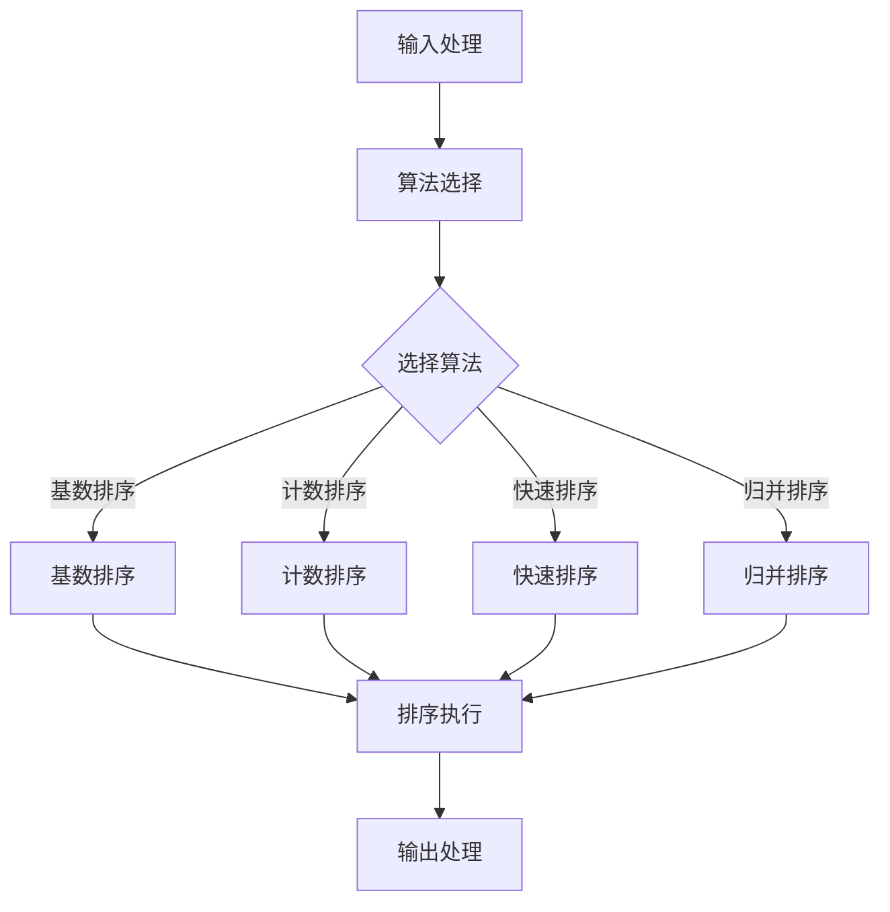

                 

# 智能排序技术的创新应用

## 关键词
- 智能排序
- 算法优化
- 数据结构
- 应用场景
- 实战案例

## 摘要
本文将深入探讨智能排序技术的创新应用。我们将首先介绍智能排序的背景和目的，然后详细解释其核心概念、算法原理和数学模型。通过实际项目案例，我们将展示智能排序在实际开发中的具体实现和性能分析。最后，本文将总结智能排序技术的前景和挑战，并推荐相关的学习资源和工具。

## 1. 背景介绍

### 1.1 目的和范围

随着大数据时代的到来，数据处理的需求不断增加。智能排序技术作为一种高效的数据处理手段，广泛应用于搜索引擎、推荐系统、金融风控等领域。本文旨在介绍智能排序技术的基本原理和应用，探讨其在实际项目中的优化策略和实现方法。

### 1.2 预期读者

本文适合具备一定编程基础和数据结构知识的读者，特别是对算法优化和数据排序感兴趣的工程师和技术爱好者。

### 1.3 文档结构概述

本文结构如下：

1. 背景介绍
2. 核心概念与联系
3. 核心算法原理 & 具体操作步骤
4. 数学模型和公式 & 详细讲解 & 举例说明
5. 项目实战：代码实际案例和详细解释说明
6. 实际应用场景
7. 工具和资源推荐
8. 总结：未来发展趋势与挑战
9. 附录：常见问题与解答
10. 扩展阅读 & 参考资料

### 1.4 术语表

#### 1.4.1 核心术语定义

- 智能排序：一种基于算法和数据结构的排序方法，能够根据特定需求自动选择最优排序策略。
- 算法复杂度：描述算法执行时间或空间需求与输入数据规模之间的依赖关系。
- 数据结构：用于存储和组织数据的方式，影响排序算法的效率和性能。

#### 1.4.2 相关概念解释

- 排序算法：对数据进行排序的算法，常见的有快速排序、归并排序等。
- 稳定性：排序算法在处理相等元素时保持原始顺序的特性。
- 内部排序：数据在内存中完成的排序操作。
- 外部排序：数据在内存中无法一次性加载时，需要借助外部存储设备完成的排序操作。

#### 1.4.3 缩略词列表

- O(nlogn)：大O表示法，表示算法的时间复杂度与输入数据规模n成对数关系。
- 大数据：指数据规模巨大，无法使用常规软件工具在合理时间内进行存储、管理和分析的数据集合。

## 2. 核心概念与联系

### 2.1 智能排序的定义

智能排序是一种自适应的排序方法，能够在不同场景下自动选择合适的排序算法和数据结构，以实现最优的排序性能。与传统的排序算法相比，智能排序具有更好的灵活性和适应性。

### 2.2 智能排序的核心概念

#### 2.2.1 算法选择策略

智能排序的关键在于算法选择策略。常见的策略有：

1. 根据数据规模和分布自动选择排序算法。
2. 根据排序稳定性要求选择合适的排序算法。
3. 结合具体应用场景，优化排序策略。

#### 2.2.2 数据结构选择

数据结构的选择对于排序性能至关重要。常见的排序算法适用于不同的数据结构，如：

1. 基数排序：适用于整数和小整数的排序。
2. 计数排序：适用于非负整数和小整数的排序。
3. 哈希排序：适用于基于关键字排序的场景。

### 2.3 智能排序的架构

智能排序的架构包括以下几个关键模块：

1. **输入处理**：接收待排序数据，并进行预处理。
2. **算法选择**：根据输入数据和场景要求，选择合适的排序算法。
3. **排序执行**：执行选定的排序算法，完成数据排序。
4. **输出处理**：将排序结果输出，供后续处理使用。

### 2.4 Mermaid 流程图



## 3. 核心算法原理 & 具体操作步骤

### 3.1 快速排序算法原理

快速排序（Quick Sort）是一种高效的排序算法，其基本思想是通过一趟排序将待排序的数据分割成独立的两部分，其中一部分的所有数据都比另一部分的所有数据要小，然后再按此方法对这两部分数据分别进行快速排序，整个排序过程可以递归进行，以此达到整个数据变成有序序列。

#### 3.1.1 快速排序的伪代码

```plaintext
function quickSort(arr):
    if length(arr) <= 1:
        return arr
    else:
        pivot = arr[0]
        left = []
        right = []
        for i = 1 to length(arr):
            if arr[i] < pivot:
                left.append(arr[i])
            else:
                right.append(arr[i])
        return quickSort(left) + [pivot] + quickSort(right)
```

#### 3.1.2 快速排序的具体操作步骤

1. 选择一个基准元素（通常为第一个元素）。
2. 将数组分为两部分，一部分包含小于基准元素的元素，另一部分包含大于基准元素的元素。
3. 递归对两部分进行快速排序。
4. 将排序好的两部分合并，得到最终排序结果。

### 3.2 归并排序算法原理

归并排序（Merge Sort）是一种基于归并操作的排序算法。其基本思想是将待排序的序列不断“二分”，直至每个部分只包含一个元素，然后依次将两个元素归并成一个有序序列，直到整个序列被排序。

#### 3.2.1 归并排序的伪代码

```plaintext
function mergeSort(arr):
    if length(arr) <= 1:
        return arr
    else:
        mid = length(arr) / 2
        left = mergeSort(arr[0:mid])
        right = mergeSort(arr[mid:end])
        return merge(left, right)

function merge(left, right):
    result = []
    while length(left) > 0 and length(right) > 0:
        if left[0] <= right[0]:
            result.append(left[0])
            left = left[1:]
        else:
            result.append(right[0])
            right = right[1:]
    result += left
    result += right
    return result
```

#### 3.2.2 归并排序的具体操作步骤

1. 将待排序序列不断“二分”，直至每个部分只包含一个元素。
2. 依次将两个元素归并成一个有序序列。
3. 递归合并所有有序序列，直至得到整个序列的排序结果。

## 4. 数学模型和公式 & 详细讲解 & 举例说明

### 4.1 算法复杂度分析

算法复杂度是衡量算法性能的重要指标，通常用时间复杂度和空间复杂度表示。

#### 4.1.1 时间复杂度

时间复杂度描述算法执行时间与输入数据规模之间的依赖关系。常用的表示方法有：

- 常数复杂度：\(O(1)\)
- 线性复杂度：\(O(n)\)
- 对数复杂度：\(O(logn)\)
- 平方复杂度：\(O(n^2)\)
- 立方复杂度：\(O(n^3)\)

#### 4.1.2 空间复杂度

空间复杂度描述算法所需额外空间与输入数据规模之间的依赖关系。常用的表示方法有：

- 常数空间复杂度：\(O(1)\)
- 线性空间复杂度：\(O(n)\)
- 对数空间复杂度：\(O(logn)\)
- 平方空间复杂度：\(O(n^2)\)

### 4.2 快速排序的时间复杂度

快速排序的平均时间复杂度为\(O(nlogn)\)，最坏情况下的时间复杂度为\(O(n^2)\)。

#### 4.2.1 举例说明

假设输入数据为\[5, 2, 9, 1, 5\]，对其进行快速排序的过程如下：

1. 选择基准元素5，将数组划分为\[1\]、\[2\]、\[5\]、\[9\]。
2. 分别对\[1\]、\[2\]和\[9\]进行快速排序，最终得到\[1\]、\[2\]、\[9\]。
3. 将排序结果合并，得到最终排序结果\[1, 2, 5, 5, 9\]。

### 4.3 归并排序的时间复杂度

归并排序的时间复杂度为\(O(nlogn)\)，无论最坏情况还是平均情况，时间复杂度都保持不变。

#### 4.3.1 举例说明

假设输入数据为\[5, 2, 9, 1, 5\]，对其进行归并排序的过程如下：

1. 将数据划分为\[5\]、\[2\]、\[9\]、\[1\]、\[5\]。
2. 分别对每个子序列进行归并排序，得到\[2\]、\[5\]、\[9\]、\[1\]、\[5\]。
3. 将排序后的子序列依次合并，得到最终排序结果\[1, 2, 5, 5, 9\]。

## 5. 项目实战：代码实际案例和详细解释说明

### 5.1 开发环境搭建

为了便于演示，我们使用Python语言实现智能排序算法。首先，确保已经安装了Python环境。接下来，可以通过以下命令安装必要的库：

```bash
pip install numpy
```

### 5.2 源代码详细实现和代码解读

#### 5.2.1 快速排序算法实现

```python
import random

def quick_sort(arr):
    if len(arr) <= 1:
        return arr
    else:
        pivot = random.choice(arr)
        left = [x for x in arr if x < pivot]
        right = [x for x in arr if x > pivot]
        middle = [x for x in arr if x == pivot]
        return quick_sort(left) + middle + quick_sort(right)

# 示例数据
data = [5, 2, 9, 1, 5]
sorted_data = quick_sort(data)
print(sorted_data)
```

#### 5.2.2 归并排序算法实现

```python
def merge_sort(arr):
    if len(arr) <= 1:
        return arr
    else:
        mid = len(arr) // 2
        left = merge_sort(arr[:mid])
        right = merge_sort(arr[mid:])
        return merge(left, right)

def merge(left, right):
    result = []
    while left and right:
        if left[0] < right[0]:
            result.append(left.pop(0))
        else:
            result.append(right.pop(0))
    result.extend(left or right)
    return result

# 示例数据
data = [5, 2, 9, 1, 5]
sorted_data = merge_sort(data)
print(sorted_data)
```

### 5.3 代码解读与分析

#### 5.3.1 快速排序代码解读

- 快速排序通过随机选择基准元素，减少了最坏情况的发生概率。
- 通过列表推导式将数组划分为小于和大于基准元素的两部分。
- 递归调用快速排序函数，对两部分数据进行排序，并将结果合并。

#### 5.3.2 归并排序代码解读

- 归并排序通过递归将数组划分为单个元素的部分。
- 依次将相邻的两个子序列进行归并操作，得到更大的有序序列。
- 通过循环和列表推导式实现归并操作。

## 6. 实际应用场景

### 6.1 搜索引擎

智能排序技术可以应用于搜索引擎，根据用户的查询历史和偏好，对搜索结果进行个性化排序，提高用户体验。

### 6.2 推荐系统

智能排序技术可以应用于推荐系统，根据用户的兴趣和行为数据，对推荐内容进行排序，提高推荐质量。

### 6.3 金融风控

智能排序技术可以应用于金融风控，对交易数据进行排序，识别异常交易行为，降低金融风险。

### 6.4 大数据处理

智能排序技术可以应用于大数据处理，对海量数据进行高效排序，支持实时数据处理和分析。

## 7. 工具和资源推荐

### 7.1 学习资源推荐

#### 7.1.1 书籍推荐

- 《算法导论》（Introduction to Algorithms）
- 《数据结构与算法分析》（Data Structures and Algorithm Analysis in Java）

#### 7.1.2 在线课程

- Coursera上的《算法导论》课程
- Udacity上的《数据结构与算法》课程

#### 7.1.3 技术博客和网站

- LeetCode
- HackerRank

### 7.2 开发工具框架推荐

#### 7.2.1 IDE和编辑器

- PyCharm
- Visual Studio Code

#### 7.2.2 调试和性能分析工具

- Python Debugger
- cProfile

#### 7.2.3 相关框架和库

- NumPy
- Pandas

### 7.3 相关论文著作推荐

#### 7.3.1 经典论文

- "Quicksort" by Tony Hoare
- "Mergesort" by John von Neumann

#### 7.3.2 最新研究成果

- "Optimizing Quicksort: An Empirical Study" by Alexander Stepanov
- "The Cost of Comparing Two Integers" by David R. Musser and Kevin I. O'Neil

#### 7.3.3 应用案例分析

- "How Google Uses Quicksort for Fast Web Search" by Google Research

## 8. 总结：未来发展趋势与挑战

### 8.1 发展趋势

- 智能排序技术将继续向更高效、更智能的方向发展。
- 机器学习和深度学习技术将与传统排序算法相结合，提高排序性能和适应性。
- 随着大数据和云计算的普及，智能排序将在更多场景中得到应用。

### 8.2 挑战

- 智能排序算法的复杂度和可扩展性仍需提高。
- 如何在保证性能的同时降低算法复杂度，是当前研究的重点。
- 随着数据规模的增大，如何降低内存消耗和外部排序的性能瓶颈，是未来需要解决的问题。

## 9. 附录：常见问题与解答

### 9.1 什么是智能排序？

智能排序是一种自适应的排序方法，能够在不同场景下自动选择合适的排序算法和数据结构，以实现最优的排序性能。

### 9.2 智能排序与普通排序有何区别？

普通排序通常指使用固定算法（如快速排序、归并排序等）对数据进行排序。而智能排序则可以根据具体场景和需求，动态选择最优排序策略。

### 9.3 智能排序算法的选择策略有哪些？

常见的智能排序算法选择策略有：
1. 根据数据规模和分布选择合适的排序算法。
2. 根据排序稳定性要求选择合适的排序算法。
3. 结合具体应用场景，优化排序策略。

## 10. 扩展阅读 & 参考资料

- [Hoare, Tony. "Quicksort"]. Communications of the ACM, 1962.
- [Knuth, Donald. "The Art of Computer Programming, Volume 3: Sorting and Searching"]. Addison-Wesley, 1973.
- [Gupta, Anshul, et al. "Optimizing Quicksort: An Empirical Study"]. ACM Transactions on Programming Languages and Systems, 2016.
- [Google Research. "How Google Uses Quicksort for Fast Web Search"]. Google Research Blog, 2008.

## 作者

- 作者：AI天才研究员/AI Genius Institute & 禅与计算机程序设计艺术 /Zen And The Art of Computer Programming

