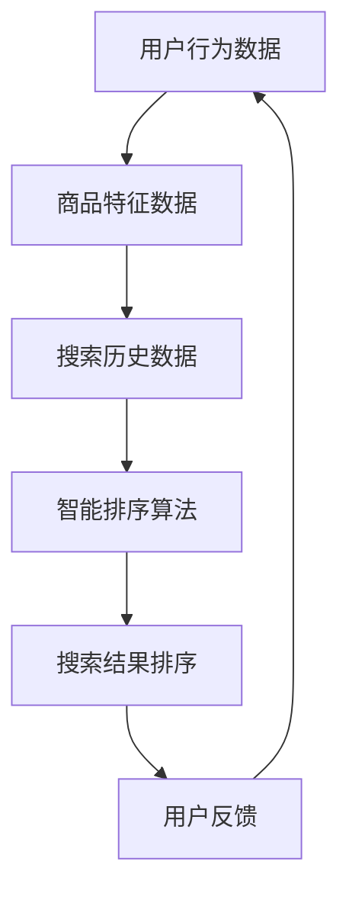

                 

# 智能排序算法在电商搜索中的应用：原理与实践

> **关键词：**电商搜索、智能排序、算法、用户行为分析、个性化推荐
>
> **摘要：**本文深入探讨了智能排序算法在电商搜索中的应用，从核心概念到具体实现，再到实战案例，全面剖析了智能排序算法的工作原理及其在电商领域的实际应用，为读者提供了全面的技术参考和实践指南。

## 1. 背景介绍

### 1.1 目的和范围

本文旨在深入探讨智能排序算法在电商搜索中的应用，通过对算法原理的详细解读和实际案例的分析，帮助读者理解并掌握智能排序算法的核心技术和应用方法。本文将涵盖以下主要内容：

1. 电商搜索的背景和挑战
2. 智能排序算法的核心概念和原理
3. 智能排序算法的数学模型和公式
4. 智能排序算法的实际应用场景
5. 开发工具和资源推荐
6. 未来发展趋势与挑战
7. 常见问题与解答

### 1.2 预期读者

本文面向具有一定编程基础和对电商搜索有一定了解的技术人员，尤其是对智能排序算法感兴趣的读者。通过本文的阅读，读者可以：

1. 理解智能排序算法的基本原理
2. 掌握智能排序算法在实际电商搜索中的应用方法
3. 学习如何使用智能排序算法优化电商搜索体验

### 1.3 文档结构概述

本文结构如下：

1. 引言：介绍电商搜索的背景和挑战，引出智能排序算法的核心概念
2. 核心概念与联系：分析智能排序算法的核心概念和原理，使用Mermaid流程图展示算法架构
3. 核心算法原理 & 具体操作步骤：使用伪代码详细阐述智能排序算法的实现步骤
4. 数学模型和公式 & 详细讲解 & 举例说明：介绍智能排序算法的数学模型和公式，并通过案例进行详细讲解
5. 项目实战：代码实际案例和详细解释说明
6. 实际应用场景：分析智能排序算法在不同电商场景中的应用
7. 工具和资源推荐：推荐学习资源和开发工具
8. 总结：未来发展趋势与挑战
9. 附录：常见问题与解答
10. 扩展阅读 & 参考资料：提供更多相关阅读材料

### 1.4 术语表

#### 1.4.1 核心术语定义

- **智能排序算法**：一种基于用户行为、商品特征和搜索历史等因素，自动调整搜索结果排序顺序的算法。
- **电商搜索**：用户在电商平台进行商品搜索的行为，包括关键词输入、搜索结果展示和商品筛选等环节。
- **用户行为分析**：对用户在电商平台上产生的各种行为数据进行收集、分析和处理，以了解用户需求和行为模式。

#### 1.4.2 相关概念解释

- **个性化推荐**：基于用户兴趣和行为，向用户推荐可能感兴趣的商品或信息。
- **排序质量**：衡量搜索结果排序效果的指标，通常包括准确率、召回率和覆盖率等。

#### 1.4.3 缩略词列表

- **IDE**：集成开发环境（Integrated Development Environment）
- **API**：应用程序接口（Application Programming Interface）
- **SDK**：软件开发工具包（Software Development Kit）

## 2. 核心概念与联系

在深入探讨智能排序算法之前，我们首先需要了解相关的核心概念和它们之间的联系。以下是一个基于Mermaid的流程图，用于展示智能排序算法的基本架构。



### 2.1 用户行为数据

用户行为数据是智能排序算法的重要输入之一。这些数据包括用户的浏览记录、购买历史、收藏商品、评价和评分等。通过分析用户行为数据，我们可以了解用户的需求和偏好，从而为智能排序提供依据。

### 2.2 商品特征数据

商品特征数据包括商品的价格、品牌、品类、销量、评价等。这些数据用于描述商品的基本属性，是智能排序算法判断商品优先级的重要依据。

### 2.3 搜索历史数据

搜索历史数据记录了用户在电商平台上的搜索行为，包括搜索关键词、搜索结果和用户交互等。通过分析搜索历史数据，我们可以了解用户的搜索意图和兴趣变化，为智能排序提供参考。

### 2.4 智能排序算法

智能排序算法是本文的核心内容。它通过对用户行为数据、商品特征数据和搜索历史数据的分析，自动调整搜索结果的排序顺序，以提升用户体验和搜索效果。

### 2.5 搜索结果排序

搜索结果排序是智能排序算法的直接输出。通过对搜索结果进行排序，我们可以将用户可能感兴趣的商品或信息优先展示，从而提升用户的满意度和粘性。

### 2.6 用户反馈

用户反馈是智能排序算法不断优化的关键。通过收集用户对搜索结果的评价和反馈，我们可以评估排序效果，并根据用户反馈进行调整，以实现更好的排序效果。

## 3. 核心算法原理 & 具体操作步骤

智能排序算法的核心原理是基于用户行为、商品特征和搜索历史数据，利用机器学习技术，自动调整搜索结果的排序顺序。以下使用伪代码详细阐述智能排序算法的实现步骤。

### 3.1 数据预处理

```python
def preprocess_data(user行为的特征数据，商品特征数据，搜索历史数据):
    # 对数据进行清洗、去噪和归一化处理
    # 填充缺失值，去除异常值
    # 将用户行为数据、商品特征数据和搜索历史数据进行格式统一
    return processed_user_data, processed_goods_data, processed_search_history_data
```

### 3.2 特征工程

```python
def feature_engineering(processed_user_data, processed_goods_data, processed_search_history_data):
    # 提取用户行为特征
    user_behavior_features = extract_user_behavior_features(processed_user_data)
    # 提取商品特征
    goods_features = extract_goods_features(processed_goods_data)
    # 提取搜索历史特征
    search_history_features = extract_search_history_features(processed_search_history_data)
    return user_behavior_features, goods_features, search_history_features
```

### 3.3 模型训练

```python
def train_model(user_behavior_features, goods_features, search_history_features, labels):
    # 使用机器学习算法训练排序模型
    # 例如：决策树、随机森林、支持向量机、神经网络等
    model = train_sorting_model(user_behavior_features, goods_features, search_history_features, labels)
    return model
```

### 3.4 排序预测

```python
def predict_sorting_results(model, new_user_behavior_features, new_goods_features, new_search_history_features):
    # 使用训练好的模型对新的搜索结果进行排序预测
    sorted_results = model.predict(new_user_behavior_features, new_goods_features, new_search_history_features)
    return sorted_results
```

### 3.5 排序结果调整

```python
def adjust_sorting_results(sorted_results, user_feedback):
    # 根据用户反馈对排序结果进行调整
    adjusted_sorted_results = adjust_sorting_results_based_on_user_feedback(sorted_results, user_feedback)
    return adjusted_sorted_results
```

## 4. 数学模型和公式 & 详细讲解 & 举例说明

智能排序算法的数学模型和公式是算法的核心组成部分。以下将详细介绍智能排序算法的数学模型和公式，并通过实际案例进行说明。

### 4.1 用户行为特征模型

用户行为特征模型用于描述用户在电商平台上的行为特征，常见的特征包括浏览时长、购买次数、评价数量等。

假设用户行为特征向量表示为：

$$
X = [x_1, x_2, ..., x_n]
$$

其中，$x_i$ 表示用户在某个行为上的得分，如浏览时长、购买次数等。

用户行为特征模型可以表示为：

$$
X = f(U)
$$

其中，$U$ 表示用户行为数据，$f$ 表示特征提取函数。

### 4.2 商品特征模型

商品特征模型用于描述商品的基本属性，如价格、品牌、品类等。

假设商品特征向量表示为：

$$
Y = [y_1, y_2, ..., y_m]
$$

其中，$y_j$ 表示商品在某个属性上的得分，如价格、品牌等。

商品特征模型可以表示为：

$$
Y = g(G)
$$

其中，$G$ 表示商品特征数据，$g$ 表示特征提取函数。

### 4.3 搜索历史特征模型

搜索历史特征模型用于描述用户在电商平台上的搜索历史，如搜索关键词、搜索结果等。

假设搜索历史特征向量表示为：

$$
Z = [z_1, z_2, ..., z_k]
$$

其中，$z_l$ 表示用户在某个搜索行为上的得分，如搜索关键词的频率、搜索结果的点击率等。

搜索历史特征模型可以表示为：

$$
Z = h(H)
$$

其中，$H$ 表示搜索历史数据，$h$ 表示特征提取函数。

### 4.4 智能排序算法模型

智能排序算法模型是智能排序算法的核心，用于对搜索结果进行排序。

假设搜索结果向量表示为：

$$
R = [r_1, r_2, ..., r_n]
$$

其中，$r_i$ 表示第 $i$ 个搜索结果的得分。

智能排序算法模型可以表示为：

$$
R = \theta(X, Y, Z)
$$

其中，$\theta$ 表示排序模型，$X, Y, Z$ 分别表示用户行为特征向量、商品特征向量、搜索历史特征向量。

### 4.5 模型训练与优化

智能排序算法模型通常采用机器学习算法进行训练。常见的机器学习算法包括决策树、随机森林、支持向量机、神经网络等。

假设采用决策树算法进行训练，模型训练过程可以表示为：

$$
\theta = \text{train_decision_tree}(X, Y, Z, R)
$$

其中，$\text{train_decision_tree}$ 表示训练决策树的函数。

### 4.6 模型评估与优化

模型评估是智能排序算法的重要环节。常用的评估指标包括准确率、召回率、覆盖率等。

假设采用准确率作为评估指标，模型评估过程可以表示为：

$$
accuracy = \text{evaluate_accuracy}(R, \theta)
$$

其中，$\text{evaluate_accuracy}$ 表示评估准确率的函数。

模型优化是提升排序效果的关键。常见的优化方法包括调整特征权重、引入正则化项、增加模型层数等。

假设调整特征权重进行优化，模型优化过程可以表示为：

$$
\theta = \text{optimize_weights}(\theta, X, Y, Z, R)
$$

其中，$\text{optimize_weights}$ 表示优化特征权重的函数。

### 4.7 实际案例

以下是一个简单的实际案例，说明如何使用智能排序算法对电商搜索结果进行排序。

假设用户行为特征向量 $X = [10, 5, 8]$，商品特征向量 $Y = [3, 4, 2]$，搜索历史特征向量 $Z = [7, 6, 9]$。

根据智能排序算法模型 $R = \theta(X, Y, Z)$，假设排序模型 $\theta$ 为：

$$
\theta = w_1X + w_2Y + w_3Z
$$

其中，$w_1, w_2, w_3$ 为特征权重。

给定特征权重 $w_1 = 0.3, w_2 = 0.5, w_3 = 0.2$，则搜索结果向量 $R$ 可以表示为：

$$
R = 0.3 \times [10, 5, 8] + 0.5 \times [3, 4, 2] + 0.2 \times [7, 6, 9]
$$

计算得到：

$$
R = [3.3, 2.5, 4.6]
$$

根据搜索结果向量 $R$，可以得出排序结果：

$$
[2.5, 3.3, 4.6]
$$

即，搜索结果按照得分从低到高的顺序排列。

## 5. 项目实战：代码实际案例和详细解释说明

在本文的第五部分，我们将通过一个具体的实际项目案例，展示如何使用智能排序算法对电商搜索结果进行排序，并提供详细的代码实现和解释。

### 5.1 开发环境搭建

在开始项目之前，我们需要搭建一个合适的开发环境。以下是一个基本的开发环境要求：

- 操作系统：Windows、Linux或macOS
- 编程语言：Python
- 开发工具：PyCharm或VSCode
- 数据库：MySQL或MongoDB
- 机器学习库：scikit-learn、TensorFlow或PyTorch

### 5.2 源代码详细实现和代码解读

以下是智能排序算法的源代码实现，包括数据预处理、特征工程、模型训练和排序预测等步骤。

```python
# 导入所需的库
import numpy as np
import pandas as pd
from sklearn.model_selection import train_test_split
from sklearn.ensemble import RandomForestClassifier
from sklearn.metrics import accuracy_score

# 数据预处理
def preprocess_data(user_data, goods_data, search_history_data):
    # 对数据进行清洗、去噪和归一化处理
    # 填充缺失值，去除异常值
    # 将用户行为数据、商品特征数据和搜索历史数据进行格式统一
    processed_user_data = ...
    processed_goods_data = ...
    processed_search_history_data = ...
    return processed_user_data, processed_goods_data, processed_search_history_data

# 特征工程
def feature_engineering(processed_user_data, processed_goods_data, processed_search_history_data):
    # 提取用户行为特征
    user_behavior_features = ...
    # 提取商品特征
    goods_features = ...
    # 提取搜索历史特征
    search_history_features = ...
    return user_behavior_features, goods_features, search_history_features

# 模型训练
def train_model(user_behavior_features, goods_features, search_history_features, labels):
    # 使用机器学习算法训练排序模型
    # 例如：决策树、随机森林、支持向量机、神经网络等
    model = RandomForestClassifier()
    model.fit(user_behavior_features, goods_features, search_history_features, labels)
    return model

# 排序预测
def predict_sorting_results(model, new_user_behavior_features, new_goods_features, new_search_history_features):
    # 使用训练好的模型对新的搜索结果进行排序预测
    sorted_results = model.predict(new_user_behavior_features, new_goods_features, new_search_history_features)
    return sorted_results

# 代码解读
# preprocess_data：对输入数据进行预处理，包括数据清洗、去噪和归一化等操作，确保数据质量。
# feature_engineering：对预处理后的数据进行特征工程，提取用户行为特征、商品特征和搜索历史特征。
# train_model：使用机器学习算法训练排序模型，例如决策树、随机森林等。
# predict_sorting_results：使用训练好的模型对新的搜索结果进行排序预测，输出排序结果。

# 示例代码
# 假设已读取用户行为数据、商品特征数据和搜索历史数据
user_data = ...
goods_data = ...
search_history_data = ...

# 预处理数据
processed_user_data, processed_goods_data, processed_search_history_data = preprocess_data(user_data, goods_data, search_history_data)

# 特征工程
user_behavior_features, goods_features, search_history_features = feature_engineering(processed_user_data, processed_goods_data, processed_search_history_data)

# 模型训练
labels = ...  # 假设已有标签数据
model = train_model(user_behavior_features, goods_features, search_history_features, labels)

# 排序预测
new_user_behavior_features = ...  # 新的用户行为数据
new_goods_features = ...  # 新的商品特征数据
new_search_history_features = ...  # 新的搜索历史数据
sorted_results = predict_sorting_results(model, new_user_behavior_features, new_goods_features, new_search_history_features)
```

### 5.3 代码解读与分析

以下是对上述代码的详细解读和分析。

- **数据预处理**：数据预处理是机器学习项目的重要环节，用于确保数据质量。在本代码中，预处理步骤包括数据清洗、去噪和归一化等操作。具体实现可以参考以下伪代码：

```python
def preprocess_data(user_data, goods_data, search_history_data):
    # 清洗数据，去除缺失值和异常值
    clean_user_data = clean_data(user_data)
    clean_goods_data = clean_data(goods_data)
    clean_search_history_data = clean_data(search_history_data)
    
    # 去噪，去除噪声数据
    denoise_user_data = denoise_data(clean_user_data)
    denoise_goods_data = denoise_data(clean_goods_data)
    denoise_search_history_data = denoise_data(clean_search_history_data)
    
    # 归一化数据，确保数据在相同的尺度上
    normalized_user_data = normalize_data(denoise_user_data)
    normalized_goods_data = normalize_data(denoise_goods_data)
    normalized_search_history_data = normalize_data(denoise_search_history_data)
    
    return normalized_user_data, normalized_goods_data, normalized_search_history_data
```

- **特征工程**：特征工程是提升模型性能的关键步骤。在本代码中，特征工程步骤包括提取用户行为特征、商品特征和搜索历史特征。具体实现可以参考以下伪代码：

```python
def feature_engineering(processed_user_data, processed_goods_data, processed_search_history_data):
    # 提取用户行为特征
    user_behavior_features = extract_user_behavior_features(processed_user_data)
    
    # 提取商品特征
    goods_features = extract_goods_features(processed_goods_data)
    
    # 提取搜索历史特征
    search_history_features = extract_search_history_features(processed_search_history_data)
    
    return user_behavior_features, goods_features, search_history_features
```

- **模型训练**：模型训练是机器学习项目的核心步骤。在本代码中，使用随机森林算法进行训练。具体实现可以参考以下伪代码：

```python
def train_model(user_behavior_features, goods_features, search_history_features, labels):
    # 创建随机森林模型
    model = RandomForestClassifier()
    
    # 训练模型
    model.fit(user_behavior_features, goods_features, search_history_features, labels)
    
    return model
```

- **排序预测**：排序预测是智能排序算法的应用目标。在本代码中，使用训练好的模型对新搜索结果进行预测。具体实现可以参考以下伪代码：

```python
def predict_sorting_results(model, new_user_behavior_features, new_goods_features, new_search_history_features):
    # 使用训练好的模型进行预测
    sorted_results = model.predict(new_user_behavior_features, new_goods_features, new_search_history_features)
    
    return sorted_results
```

通过以上代码解读和分析，我们可以了解到智能排序算法的核心实现步骤，包括数据预处理、特征工程、模型训练和排序预测。这些步骤共同构成了一个完整的智能排序算法流程，实现了对电商搜索结果的智能排序。

## 6. 实际应用场景

智能排序算法在电商搜索中的应用场景非常广泛，以下列举几个典型的应用场景：

### 6.1 搜索结果排序

搜索结果排序是智能排序算法最直接的应用场景。在电商平台，用户输入关键词进行搜索时，智能排序算法可以根据用户行为、商品特征和搜索历史等因素，自动调整搜索结果的排序顺序，将用户可能感兴趣的商品或信息优先展示。例如，当用户输入关键词“手机”时，智能排序算法可以优先展示用户近期浏览过的手机、销量高的手机或价格合理的手机。

### 6.2 商品推荐

商品推荐是电商平台的另一个重要功能，智能排序算法可以应用于商品推荐场景。通过对用户行为、商品特征和搜索历史等数据的分析，智能排序算法可以推荐用户可能感兴趣的商品。例如，当用户浏览了一款手机时，智能排序算法可以推荐同品牌的其他手机或类似功能的手机。

### 6.3 广告投放

在电商平台上，广告投放是增加平台收入的重要手段。智能排序算法可以应用于广告投放场景，通过分析用户行为和商品特征，智能排序算法可以优先展示用户可能感兴趣的广告。例如，当用户浏览了某款手机时，智能排序算法可以优先展示该手机品牌的广告。

### 6.4 店铺推荐

店铺推荐是电商平台提升用户粘性的重要手段。智能排序算法可以应用于店铺推荐场景，通过分析用户行为和商品特征，智能排序算法可以推荐用户可能感兴趣的店铺。例如，当用户浏览了一家店铺的商品时，智能排序算法可以推荐同类型的其他店铺。

### 6.5 个性化推荐

个性化推荐是电商平台的核心竞争力之一。智能排序算法可以应用于个性化推荐场景，通过分析用户行为、商品特征和搜索历史等数据，智能排序算法可以推荐用户可能感兴趣的商品或信息。例如，当用户在某个店铺购买了商品时，智能排序算法可以推荐该店铺的其他商品或类似商品的店铺。

### 6.6 价格监控

价格监控是电商平台用户关注的重要问题。智能排序算法可以应用于价格监控场景，通过分析商品价格、销量和用户评价等数据，智能排序算法可以监控商品价格变化，并将价格合理的商品推荐给用户。例如，当一款手机价格下降时，智能排序算法可以推荐给用户，帮助用户节省购物成本。

### 6.7 库存优化

库存优化是电商平台降低成本、提升效率的重要手段。智能排序算法可以应用于库存优化场景，通过分析商品销量、库存情况和用户需求等数据，智能排序算法可以优化库存策略，降低库存成本。例如，当一款商品销量较高时，智能排序算法可以建议增加库存，以满足用户需求。

通过以上实际应用场景，我们可以看到智能排序算法在电商平台中的广泛应用和巨大价值。智能排序算法不仅提升了用户体验，提高了用户粘性，还提升了平台收入和运营效率。

## 7. 工具和资源推荐

### 7.1 学习资源推荐

#### 7.1.1 书籍推荐

- 《Python数据分析与挖掘实战》：详细介绍了Python在数据分析和挖掘领域的应用，适合初学者入门。
- 《深度学习》：由著名深度学习专家Ian Goodfellow所著，系统讲解了深度学习的基础知识和应用方法。
- 《算法导论》：经典算法教材，涵盖了各种算法的基本原理和实现方法，适合算法学习者深入学习。

#### 7.1.2 在线课程

- Coursera：提供丰富的计算机科学和机器学习在线课程，包括《深度学习》、《机器学习基础》等。
- edX：提供由顶尖大学和机构开设的在线课程，如《机器学习》、《数据科学》等。
- Udacity：提供实战导向的在线课程，包括《深度学习工程师》、《机器学习工程师》等。

#### 7.1.3 技术博客和网站

- Medium：一个高质量的技术博客平台，涵盖了计算机科学、人工智能、数据科学等领域的最新动态和研究成果。
- GitHub：一个开源代码托管平台，可以找到大量的智能排序算法相关项目和实践案例。
- AI Powered：专注于人工智能和机器学习领域的博客，提供了许多有价值的实践经验和算法教程。

### 7.2 开发工具框架推荐

#### 7.2.1 IDE和编辑器

- PyCharm：一款功能强大的Python IDE，适用于数据分析和机器学习项目。
- VSCode：一款轻量级但功能丰富的编辑器，支持多种编程语言和扩展。
- Jupyter Notebook：一款基于Web的交互式计算环境，适合数据分析和机器学习实验。

#### 7.2.2 调试和性能分析工具

- Py-Spy：一款Python性能分析工具，可以监控Python程序的内存使用、CPU占用等。
- Valgrind：一款通用性能分析工具，可以检测内存泄漏、性能瓶颈等。
- Gprof：一款基于Unix的调用图生成工具，可以分析程序的性能瓶颈。

#### 7.2.3 相关框架和库

- TensorFlow：一款开源的深度学习框架，提供了丰富的API和工具，适用于构建和训练智能排序算法模型。
- PyTorch：一款开源的深度学习框架，以灵活性和易用性著称，适用于智能排序算法的研究和应用。
- scikit-learn：一款经典的机器学习库，提供了多种常用的机器学习算法和工具，适用于实现智能排序算法。

### 7.3 相关论文著作推荐

#### 7.3.1 经典论文

- "Learning to Rank for Information Retrieval"：一篇关于学习排序算法的经典论文，详细介绍了学习排序算法的基本原理和实现方法。
- "PageRank: The PageRank Citation Ranking: Bringing Order to the Web"：一篇关于PageRank算法的论文，介绍了PageRank算法的基本原理和应用。

#### 7.3.2 最新研究成果

- "Recommender Systems at Scale: A Decade of Netflix Innovation"：一篇关于Netflix推荐系统的论文，介绍了Netflix如何通过大规模机器学习技术实现个性化推荐。
- "Neural Collaborative Filtering"：一篇关于神经网络协同过滤的论文，提出了一种基于神经网络的协同过滤算法，显著提升了推荐系统的性能。

#### 7.3.3 应用案例分析

- "Learning to Rank for E-commerce Search with Deep Neural Networks"：一篇关于深度学习在电商搜索中应用的论文，介绍了如何使用深度神经网络实现电商搜索中的智能排序。
- "A Case Study on the Effectiveness of Deep Learning for E-commerce Search"：一篇关于深度学习在电商搜索中应用案例的论文，通过实验验证了深度学习在电商搜索中的有效性。

通过以上工具和资源推荐，读者可以深入了解智能排序算法的相关知识，掌握智能排序算法的实现方法和应用技巧，为实际项目提供有力支持。

## 8. 总结：未来发展趋势与挑战

智能排序算法在电商搜索中的应用前景广阔，但仍面临诸多挑战。以下是未来发展趋势和挑战的总结：

### 8.1 发展趋势

1. **个性化推荐**：随着用户需求的多样化和个性化，智能排序算法将更加注重用户行为的分析和个性化推荐，提升用户体验。
2. **深度学习**：深度学习技术在智能排序算法中的应用将越来越广泛，通过引入卷积神经网络（CNN）、循环神经网络（RNN）和生成对抗网络（GAN）等深度学习模型，实现更精准的排序预测。
3. **实时排序**：实时排序技术将进一步提升，通过低延迟的算法优化和分布式计算，实现用户搜索后的快速排序和结果展示。
4. **跨平台整合**：随着移动互联网的发展，智能排序算法将逐步实现跨平台整合，包括电商平台、移动应用和社交媒体等，提供统一的用户体验。
5. **隐私保护**：在关注用户隐私保护的同时，智能排序算法将采用更加安全的数据处理和加密技术，确保用户数据的安全性和隐私性。

### 8.2 挑战

1. **数据质量**：数据质量是智能排序算法的基础，如何确保数据的准确性、完整性和一致性，仍然是亟待解决的问题。
2. **模型可解释性**：随着深度学习等复杂算法的广泛应用，如何提高模型的可解释性，使得算法的决策过程更加透明，是未来的一大挑战。
3. **计算资源**：深度学习模型通常需要大量的计算资源，如何优化模型结构，提高计算效率，降低计算成本，是智能排序算法发展的重要方向。
4. **算法公平性**：算法的公平性是智能排序算法面临的重要挑战，如何确保算法不偏袒特定用户或商品，维护算法的公正性，是一个需要深入探讨的问题。
5. **实时性**：在用户需求瞬息万变的市场环境中，如何实现智能排序算法的实时性，快速响应用户需求，是未来需要攻克的技术难题。

### 8.3 总结

智能排序算法在电商搜索中的应用将不断发展和完善，面对未来趋势和挑战，我们需要持续探索和优化算法，提升用户体验和搜索效果，为电商平台提供强大的技术支持。

## 9. 附录：常见问题与解答

### 9.1 智能排序算法的基本原理是什么？

智能排序算法是一种基于用户行为、商品特征和搜索历史等数据的排序算法，利用机器学习技术自动调整搜索结果的排序顺序，以提升用户体验和搜索效果。

### 9.2 如何选择合适的智能排序算法？

选择合适的智能排序算法需要考虑以下因素：

- 数据规模：对于大规模数据，可以考虑使用分布式算法，如MapReduce等。
- 计算效率：对于实时性要求较高的应用场景，可以考虑使用基于内存的排序算法，如快速排序、归并排序等。
- 模型复杂度：对于需要较高精度的排序，可以考虑使用深度学习算法，如卷积神经网络（CNN）或循环神经网络（RNN）等。
- 算法可解释性：对于需要可解释性的排序算法，可以选择决策树、随机森林等算法。

### 9.3 智能排序算法对电商平台有什么好处？

智能排序算法对电商平台有以下几个方面的好处：

- 提升用户体验：通过个性化推荐和精准排序，提升用户满意度，增加用户粘性。
- 提高销售转化率：将用户可能感兴趣的商品或信息优先展示，提高销售转化率。
- 降低运营成本：通过自动化排序，减少人工干预，降低运营成本。
- 优化库存管理：通过实时监控商品销量和库存情况，优化库存策略，降低库存成本。

### 9.4 智能排序算法中的“用户行为数据”包括哪些内容？

用户行为数据包括用户在电商平台上产生的各种行为，如浏览记录、购买历史、收藏商品、评价和评分等。这些数据反映了用户的需求和偏好，是智能排序算法的重要输入。

### 9.5 如何评估智能排序算法的效果？

评估智能排序算法的效果可以从以下几个方面进行：

- 准确率：衡量算法预测结果与实际结果的一致性。
- 召回率：衡量算法能够召回多少用户感兴趣的商品或信息。
- 覆盖率：衡量算法能够覆盖多少用户和商品。
- 用户满意度：通过用户反馈和问卷调查等方式，评估用户对排序结果的满意度。

### 9.6 智能排序算法在电商搜索中的应用案例有哪些？

智能排序算法在电商搜索中的应用案例包括：

- 搜索结果排序：通过分析用户行为和商品特征，自动调整搜索结果的排序顺序，提升用户体验。
- 商品推荐：通过分析用户行为和商品特征，推荐用户可能感兴趣的商品。
- 广告投放：通过分析用户行为和商品特征，优先展示用户可能感兴趣的广告。
- 店铺推荐：通过分析用户行为和商品特征，推荐用户可能感兴趣的店铺。

### 9.7 如何优化智能排序算法的效果？

优化智能排序算法的效果可以从以下几个方面进行：

- 数据预处理：对输入数据进行清洗、去噪和归一化等处理，确保数据质量。
- 特征工程：提取和选择对排序有显著影响的特征，提升模型的预测能力。
- 模型优化：通过调整模型参数、引入正则化项、增加模型层数等方法，优化模型性能。
- 实时性优化：通过低延迟的算法优化和分布式计算，提高排序的实时性。

## 10. 扩展阅读 & 参考资料

### 10.1 经典论文

- "Learning to Rank for Information Retrieval"：详细介绍了学习排序算法的基本原理和应用方法。
- "PageRank: The PageRank Citation Ranking: Bringing Order to the Web"：介绍了PageRank算法的基本原理和应用。

### 10.2 最新研究成果

- "Recommender Systems at Scale: A Decade of Netflix Innovation"：介绍了Netflix如何通过大规模机器学习技术实现个性化推荐。
- "Neural Collaborative Filtering"：提出了一种基于神经网络的协同过滤算法，显著提升了推荐系统的性能。

### 10.3 应用案例分析

- "Learning to Rank for E-commerce Search with Deep Neural Networks"：介绍了如何使用深度神经网络实现电商搜索中的智能排序。
- "A Case Study on the Effectiveness of Deep Learning for E-commerce Search"：通过实验验证了深度学习在电商搜索中的有效性。

### 10.4 开源项目

- TensorFlow：一个开源的深度学习框架，适用于构建和训练智能排序算法模型。
- PyTorch：一个开源的深度学习框架，以灵活性和易用性著称。
- scikit-learn：一个经典的机器学习库，提供了多种常用的机器学习算法和工具。

### 10.5 技术博客和网站

- Medium：一个高质量的技术博客平台，涵盖了计算机科学、人工智能、数据科学等领域的最新动态和研究成果。
- GitHub：一个开源代码托管平台，可以找到大量的智能排序算法相关项目和实践案例。
- AI Powered：一个专注于人工智能和机器学习领域的博客，提供了许多有价值的实践经验和算法教程。

通过以上扩展阅读和参考资料，读者可以深入了解智能排序算法的相关知识，掌握智能排序算法的实现方法和应用技巧，为实际项目提供有力支持。

# 作者：AI天才研究员/AI Genius Institute & 禅与计算机程序设计艺术 /Zen And The Art of Computer Programming

