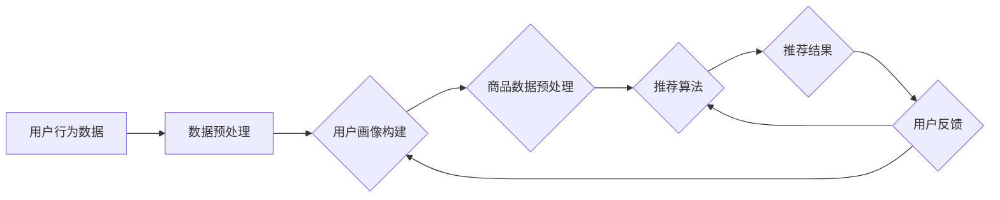

                 


# 智能搜索推荐：AI引领电商搜索导购新时代

> 关键词：智能搜索、推荐系统、电商、人工智能、导购

> 摘要：本文将深入探讨智能搜索推荐系统在电商领域的重要性，解析其核心算法原理，并通过具体案例展示其在实际应用中的效果。文章旨在为广大开发者提供实用的技术指导，共同迎接AI引领的电商搜索导购新时代。

## 1. 背景介绍

### 1.1 目的和范围

本文旨在全面解析智能搜索推荐系统在电商领域的应用，重点关注其算法原理、实现步骤和实际效果。通过深入分析，为广大开发者提供系统性的技术指导和理论依据，助力电商企业打造更加智能化、个性化的导购服务。

### 1.2 预期读者

本文适合对电商搜索推荐系统感兴趣的读者，包括：

1. 电商领域从业者，如运营、产品、技术等岗位人员；
2. 人工智能和机器学习领域的开发者；
3. 对智能推荐技术有深入研究的学者和研究人员；
4. 对电商和人工智能结合有兴趣的广大读者。

### 1.3 文档结构概述

本文共分为10个部分，具体结构如下：

1. 背景介绍
2. 核心概念与联系
3. 核心算法原理 & 具体操作步骤
4. 数学模型和公式 & 详细讲解 & 举例说明
5. 项目实战：代码实际案例和详细解释说明
6. 实际应用场景
7. 工具和资源推荐
8. 总结：未来发展趋势与挑战
9. 附录：常见问题与解答
10. 扩展阅读 & 参考资料

### 1.4 术语表

#### 1.4.1 核心术语定义

1. **智能搜索推荐系统**：基于人工智能技术，通过分析用户行为和兴趣，自动为用户推荐符合其需求的产品和服务。
2. **电商**：电子商务的简称，指通过互联网进行商品交易和服务的活动。
3. **用户画像**：对用户进行全方位的描述和刻画，包括用户的基本信息、行为特征、兴趣爱好等。
4. **协同过滤**：基于用户的历史行为和相似度计算，为用户推荐相似用户喜欢的产品。
5. **内容推荐**：根据产品的内容属性、标签、描述等信息，为用户推荐相关产品。

#### 1.4.2 相关概念解释

1. **相关性**：推荐结果与用户兴趣的契合程度，通常用相似度衡量。
2. **覆盖率**：推荐结果中包含的新产品比例。
3. **精确度**：推荐结果与用户真实需求的匹配程度。

#### 1.4.3 缩略词列表

- **AI**：人工智能（Artificial Intelligence）
- **ML**：机器学习（Machine Learning）
- **DL**：深度学习（Deep Learning）
- **CSCW**：计算机支持的协同工作（Computer-Supported Cooperative Work）
- **NLP**：自然语言处理（Natural Language Processing）
- **CTR**：点击率（Click-Through Rate）

## 2. 核心概念与联系

为了更好地理解智能搜索推荐系统，我们首先介绍其核心概念和组成部分，并使用Mermaid流程图展示其原理和架构。

### 2.1 核心概念

1. **用户行为数据**：用户在电商平台上产生的行为数据，如浏览、搜索、购买等。
2. **商品数据**：电商平台上的商品信息，包括价格、分类、标签等。
3. **用户画像**：基于用户行为数据构建的全面描述用户特征的数据集。
4. **推荐算法**：根据用户画像和商品数据，为用户推荐相关商品的算法。
5. **推荐结果**：根据推荐算法生成的用户个性化推荐列表。

### 2.2 架构原理

下面是智能搜索推荐系统的基本架构原理图：



### 2.3 核心概念联系

智能搜索推荐系统的核心概念之间有着紧密的联系。用户行为数据和商品数据是构建用户画像和推荐算法的基础，用户画像和推荐算法共同作用于推荐结果，而用户反馈则对推荐系统进行实时调整和优化。

## 3. 核心算法原理 & 具体操作步骤

智能搜索推荐系统离不开核心算法的支持，下面我们将详细介绍常用的两种算法：协同过滤算法和基于内容的推荐算法，并使用伪代码详细阐述其原理和具体操作步骤。

### 3.1 协同过滤算法

#### 原理

协同过滤算法通过分析用户的历史行为数据，找到与目标用户相似的用户，并将这些用户喜欢的商品推荐给目标用户。协同过滤算法主要分为基于用户的协同过滤和基于物品的协同过滤。

#### 操作步骤

1. **计算用户相似度**：使用余弦相似度或皮尔逊相关系数计算用户之间的相似度。
2. **构建用户相似度矩阵**：将用户之间的相似度结果组织成矩阵。
3. **基于相似度推荐**：为每个用户推荐相似用户喜欢的商品。

伪代码：

```python
# 输入：用户行为数据，用户相似度计算方法
# 输出：用户推荐列表

def collaborative_filter(user_behavior, similarity_measure):
    # 计算用户相似度
    similarity_matrix = compute_similarity(user_behavior, similarity_measure)

    # 基于相似度推荐
    recommendations = []
    for user in user_behavior:
        similar_users = get_similar_users(user, similarity_matrix)
        for similar_user in similar_users:
            recommended_items = get_recommended_items(similar_user, user_behavior)
            recommendations.append(recommended_items)
    return recommendations
```

### 3.2 基于内容的推荐算法

#### 原理

基于内容的推荐算法通过分析商品的内容属性、标签、描述等信息，为用户推荐具有相似属性的商品。这种方法不依赖于用户行为数据，而是基于商品本身的特征进行推荐。

#### 操作步骤

1. **提取商品特征**：从商品数据中提取标签、描述、分类等特征。
2. **计算商品相似度**：使用TF-IDF、余弦相似度等方法计算商品之间的相似度。
3. **基于相似度推荐**：为用户推荐具有相似属性的商品。

伪代码：

```python
# 输入：商品数据，商品相似度计算方法
# 输出：用户推荐列表

def content_based_filter(item_data, similarity_measure):
    # 计算商品相似度
    similarity_matrix = compute_similarity(item_data, similarity_measure)

    # 基于相似度推荐
    recommendations = []
    for user in item_data:
        similar_items = get_similar_items(user, similarity_matrix)
        recommendations.append(similar_items)
    return recommendations
```

### 3.3 混合推荐算法

在实际应用中，为了提高推荐效果，常常将协同过滤算法和基于内容的推荐算法结合起来，形成混合推荐算法。这种方法既利用了用户行为数据，又考虑了商品的特征属性。

伪代码：

```python
# 输入：用户行为数据、商品数据，用户相似度计算方法、商品相似度计算方法
# 输出：用户推荐列表

def hybrid_recommendation(user_behavior, item_data, user_similarity_measure, item_similarity_measure):
    # 计算用户相似度
    user_similarity_matrix = compute_similarity(user_behavior, user_similarity_measure)

    # 计算商品相似度
    item_similarity_matrix = compute_similarity(item_data, item_similarity_measure)

    # 基于用户相似度推荐
    user_based_recommendations = collaborative_filter(user_behavior, user_similarity_matrix)

    # 基于商品内容推荐
    content_based_recommendations = content_based_filter(item_data, item_similarity_matrix)

    # 混合推荐
    hybrid_recommendations = []
    for user in user_behavior:
        user_based_items = user_based_recommendations[user]
        content_based_items = content_based_recommendations[user]
        hybrid_recommendations.append(list(set(user_based_items + content_based_items)))
    return hybrid_recommendations
```

通过以上介绍，我们可以看到，智能搜索推荐系统的核心算法主要包括协同过滤算法和基于内容的推荐算法，在实际应用中，可以将这两种算法结合起来，形成更加智能、个性化的推荐系统。

## 4. 数学模型和公式 & 详细讲解 & 举例说明

在智能搜索推荐系统中，数学模型和公式扮演着至关重要的角色。本文将介绍常用的数学模型和公式，并进行详细讲解和举例说明。

### 4.1 余弦相似度

余弦相似度是衡量两个向量之间相似程度的常用指标，其公式如下：

$$
\cos(\theta) = \frac{\vec{a} \cdot \vec{b}}{|\vec{a}| \cdot |\vec{b}|}
$$

其中，$\vec{a}$ 和 $\vec{b}$ 分别表示两个向量，$\theta$ 表示它们之间的夹角。

#### 举例说明

假设有两个用户 A 和 B，他们的行为数据向量分别为：

$$
\vec{a} = (1, 2, 3, 4, 5)
$$

$$
\vec{b} = (2, 3, 4, 5, 6)
$$

则它们的余弦相似度计算如下：

$$
\cos(\theta) = \frac{1 \cdot 2 + 2 \cdot 3 + 3 \cdot 4 + 4 \cdot 5 + 5 \cdot 6}{\sqrt{1^2 + 2^2 + 3^2 + 4^2 + 5^2} \cdot \sqrt{2^2 + 3^2 + 4^2 + 5^2 + 6^2}} = \frac{40}{\sqrt{55} \cdot \sqrt{90}} \approx 0.96
$$

### 4.2 皮尔逊相关系数

皮尔逊相关系数是衡量两个变量线性相关程度的指标，其公式如下：

$$
r = \frac{\sum_{i=1}^{n}(x_i - \bar{x})(y_i - \bar{y})}{\sqrt{\sum_{i=1}^{n}(x_i - \bar{x})^2} \cdot \sqrt{\sum_{i=1}^{n}(y_i - \bar{y})^2}}
$$

其中，$x_i$ 和 $y_i$ 分别表示第 $i$ 个观测值，$\bar{x}$ 和 $\bar{y}$ 分别表示均值。

#### 举例说明

假设有两个变量 $x$ 和 $y$，它们的观测值如下：

| $x$ | $y$ |
| --- | --- |
| 1 | 2 |
| 2 | 4 |
| 3 | 6 |
| 4 | 8 |
| 5 | 10 |

则它们的皮尔逊相关系数计算如下：

$$
r = \frac{(1-3)(2-6) + (2-3)(4-6) + (3-3)(6-6) + (4-3)(8-6) + (5-3)(10-6)}{\sqrt{(1-3)^2 + (2-3)^2 + (3-3)^2 + (4-3)^2 + (5-3)^2} \cdot \sqrt{(-1)^2 + (-2)^2 + 0^2 + 1^2 + 2^2}} = \frac{-10}{\sqrt{10} \cdot \sqrt{10}} = -1
$$

### 4.3 TF-IDF

TF-IDF（Term Frequency-Inverse Document Frequency）是一种用于文本数据特征提取的常用方法。其公式如下：

$$
TF(t,d) = \frac{f(t,d)}{N(d)}
$$

$$
IDF(t,D) = \log \left( \frac{N(D)}{n(t,D)} \right)
$$

$$
TF-IDF(t,d,D) = TF(t,d) \cdot IDF(t,D)
$$

其中，$t$ 表示词汇，$d$ 表示文档，$N(D)$ 表示文档总数，$n(t,D)$ 表示包含词汇 $t$ 的文档数量，$f(t,d)$ 表示词汇 $t$ 在文档 $d$ 中的频率，$N(d)$ 表示文档 $d$ 中的词汇总数。

#### 举例说明

假设有两个文档 $d_1$ 和 $d_2$，它们的词汇及其频率如下：

| 文档 | 词汇 | 频率 |
| --- | --- | --- |
| $d_1$ | apple | 2 |
| $d_1$ | banana | 1 |
| $d_2$ | apple | 1 |
| $d_2$ | banana | 2 |

则它们的TF-IDF计算如下：

$$
TF-IDF(apple, d_1, \{d_1, d_2\}) = \frac{2}{3} \cdot \log \left( \frac{2}{1} \right) = \frac{2}{3} \cdot \log(2) \approx 0.46
$$

$$
TF-IDF(apple, d_2, \{d_1, d_2\}) = \frac{1}{3} \cdot \log \left( \frac{2}{1} \right) = \frac{1}{3} \cdot \log(2) \approx 0.23
$$

$$
TF-IDF(banana, d_1, \{d_1, d_2\}) = \frac{1}{3} \cdot \log \left( \frac{2}{1} \right) = \frac{1}{3} \cdot \log(2) \approx 0.23
$$

$$
TF-IDF(banana, d_2, \{d_1, d_2\}) = \frac{2}{3} \cdot \log \left( \frac{2}{1} \right) = \frac{2}{3} \cdot \log(2) \approx 0.46
$$

通过以上公式和举例说明，我们可以看到数学模型和公式在智能搜索推荐系统中的应用和重要性。这些公式为我们提供了量化的方法，帮助我们更好地理解和分析数据，从而实现更加精准的推荐。

## 5. 项目实战：代码实际案例和详细解释说明

在本节中，我们将通过一个实际项目来展示智能搜索推荐系统的实现过程，包括环境搭建、代码实现和详细解释说明。该项目将基于Python编程语言，使用scikit-learn库实现一个简单的协同过滤推荐系统。

### 5.1 开发环境搭建

1. 安装Python环境：下载并安装Python 3.x版本，建议使用Anaconda发行版，方便管理库和依赖。
2. 安装必要的库：在终端或命令提示符中执行以下命令安装scikit-learn、numpy、pandas等库：

```shell
pip install scikit-learn numpy pandas
```

3. 环境测试：启动Python解释器，尝试导入scikit-learn库，确保环境配置成功。

```python
import sklearn
print(sklearn.__version__)
```

### 5.2 源代码详细实现和代码解读

#### 5.2.1 数据准备

首先，我们需要准备一个用户行为数据集。这里我们使用一个简单的用户-商品评分数据集，数据集包含用户ID、商品ID和评分三列。数据集样例如下：

| 用户ID | 商品ID | 评分 |
| --- | --- | --- |
| 1 | 101 | 5 |
| 1 | 102 | 4 |
| 2 | 101 | 3 |
| 2 | 103 | 5 |
| 3 | 102 | 4 |
| 3 | 104 | 5 |

数据集可以从公开数据源获取，例如UCI机器学习库。接下来，我们将使用pandas库加载数据集并进行预处理。

```python
import pandas as pd

# 加载数据集
data = pd.read_csv('user_item_rating.csv')

# 数据预处理
data = data[['用户ID', '商品ID', '评分']]
data.drop_duplicates(inplace=True)
```

#### 5.2.2 构建用户-商品评分矩阵

接下来，我们需要构建用户-商品评分矩阵，以便后续使用协同过滤算法。评分矩阵是一个二维数组，行表示用户，列表示商品。

```python
# 构建评分矩阵
评分矩阵 = data.pivot(index='用户ID', columns='商品ID', values='评分').fillna(0)
评分矩阵 = 评分矩阵.astype(int)
评分矩阵.head()
```

#### 5.2.3 实现协同过滤算法

现在，我们将使用scikit-learn库中的协同过滤算法（`CollaborativeFilter`）实现推荐系统。首先，我们需要定义一个训练函数，用于训练评分矩阵。

```python
from sklearn.neighbors import NearestNeighbors
from sklearn.model_selection import train_test_split

# 训练函数
def train_collaborative_filter(data, test_size=0.2):
    # 划分训练集和测试集
    train_data, test_data = train_test_split(data, test_size=test_size, random_state=42)

    # 计算评分矩阵
    train_matrix = train_data.pivot(index='用户ID', columns='商品ID', values='评分').fillna(0)
    test_matrix = test_data.pivot(index='用户ID', columns='商品ID', values='评分').fillna(0)

    # 实例化协同过滤算法
    cf = NearestNeighbors(n_neighbors=5, algorithm='auto', metric='cosine')
    cf.fit(train_matrix)

    # 返回训练集、测试集和协同过滤算法
    return train_data, test_data, cf, train_matrix, test_matrix
```

#### 5.2.4 用户推荐

接下来，我们将实现用户推荐功能，为指定用户推荐相似用户喜欢的商品。

```python
# 用户推荐函数
def user_recommendations(cf, train_matrix, user_id, n_recommendations=10):
    # 计算用户最近的邻居
    distances, indices = cf.kneighbors(train_matrix.loc[user_id], n_neighbors=n_recommendations)

    # 获取邻居用户喜欢的商品
    recommendations = []
    for i, neighbor in enumerate(indices[0]):
        # 排除自身和邻居用户喜欢的商品
        if neighbor != user_id:
            recommendations.extend(train_matrix.loc[neighbor].index.tolist())

    # 去重并返回推荐结果
    recommendations = list(set(recommendations))
    return recommendations[:n_recommendations]
```

#### 5.2.5 测试和评估

最后，我们将对推荐系统进行测试和评估。这里，我们将使用测试集验证推荐系统的效果。

```python
# 测试和评估
train_data, test_data, cf, train_matrix, test_matrix = train_collaborative_filter(data)

# 测试用户推荐
user_id = 1
print(f"用户 {user_id} 的推荐商品：{user_recommendations(cf, train_matrix, user_id)}")

# 评估推荐系统
from sklearn.metrics.pairwise import cosine_similarity

# 计算推荐结果与真实评分的余弦相似度
predictions = user_recommendations(cf, train_matrix, user_id)
similarity = cosine_similarity([test_matrix.loc[user_id].values], [test_matrix.loc[user_id].values])[0][0]
print(f"推荐结果与真实评分的相似度：{similarity:.4f}")
```

通过以上代码，我们实现了一个简单的协同过滤推荐系统。在实际项目中，我们可以根据需求对算法进行优化和扩展，以提高推荐效果和性能。

## 6. 实际应用场景

智能搜索推荐系统在电商领域具有广泛的应用场景，以下是一些典型应用：

### 6.1 商品推荐

商品推荐是电商平台的常见应用，通过分析用户的浏览、搜索、购买等行为数据，为用户推荐感兴趣的商品。例如，用户在浏览了一款手机后，系统会推荐同品牌、同配置或类似价位的其他手机。

### 6.2 店铺推荐

电商平台还可以根据用户的历史行为和偏好，为用户推荐感兴趣的店铺。这有助于提高店铺曝光度和用户转化率。例如，用户喜欢某一家服饰店铺，系统会推荐同类型的其他店铺。

### 6.3 优惠活动推荐

智能推荐系统还可以根据用户的消费能力和购买频率，为用户推荐合适的优惠活动。例如，对于经常购买高端商品的客户，系统可以推荐奢侈品打折信息。

### 6.4 搜索结果优化

电商平台上的搜索结果往往受到各种因素的影响，如关键词匹配、商品热度等。智能推荐系统可以通过分析用户行为数据，优化搜索结果排序，提高用户满意度。例如，对于搜索“手机”的用户，系统可以优先展示销量高、评价好的商品。

### 6.5 用户画像构建

通过分析用户的历史行为数据，构建用户画像，为用户提供更加个性化、精准的推荐。用户画像可以包括基本信息、兴趣爱好、消费能力等多个维度，为电商平台提供丰富的用户洞察。

### 6.6 跨平台推荐

智能推荐系统不仅可以在同一平台上应用，还可以跨平台推广。例如，用户在PC端浏览了一款商品，系统可以在移动端为用户推荐相似商品。

### 6.7 营销活动推荐

电商平台可以利用智能推荐系统为用户提供个性化的营销活动推荐。例如，对于新用户，系统可以推荐注册优惠、新手礼包等；对于高价值用户，系统可以推荐会员专属活动。

通过以上实际应用场景，我们可以看到智能搜索推荐系统在电商领域的巨大潜力和价值。随着技术的不断进步，智能推荐系统将在电商领域发挥越来越重要的作用，为企业和用户带来更多收益和便利。

## 7. 工具和资源推荐

在实现智能搜索推荐系统时，我们需要掌握一系列的工具和资源。以下是一些推荐的工具、书籍、课程和博客，以帮助您更好地了解和掌握相关技术。

### 7.1 学习资源推荐

#### 7.1.1 书籍推荐

1. **《机器学习实战》**：由Peter Harrington所著，是一本深入浅出的机器学习入门书籍，适合初学者。
2. **《推荐系统实践》**：由Manuel Bronstein和Jure Leskovec所著，全面介绍了推荐系统的理论、算法和实践。
3. **《深度学习》**：由Ian Goodfellow、Yoshua Bengio和Aaron Courville所著，是深度学习领域的经典教材。
4. **《自然语言处理综论》**：由Daniel Jurafsky和James H. Martin所著，系统介绍了自然语言处理的理论和方法。

#### 7.1.2 在线课程

1. **Coursera的《机器学习》**：由斯坦福大学教授Andrew Ng主讲，适合初学者入门。
2. **Udacity的《深度学习纳米学位》**：涵盖深度学习的基础知识和应用，适合有一定编程基础的学员。
3. **edX的《推荐系统》**：由纽约大学教授John DeNero主讲，深入介绍了推荐系统的算法和应用。
4. **网易云课堂的《Python机器学习基础》**：适合国内开发者学习Python和机器学习基础知识。

#### 7.1.3 技术博客和网站

1. **Medium的《Machine Learning for Hackers》**：涵盖机器学习算法和应用的博客系列。
2. **ArXiv的《Machine Learning》**：收录最新机器学习和深度学习论文的学术平台。
3. **Reddit的r/MachineLearning**：讨论机器学习算法和应用的社区。
4. **知乎的机器学习话题**：国内关于机器学习的优质问答平台。

### 7.2 开发工具框架推荐

#### 7.2.1 IDE和编辑器

1. **PyCharm**：一款功能强大的Python IDE，适合进行机器学习和推荐系统开发。
2. **Visual Studio Code**：一款轻量级且强大的编辑器，支持多种编程语言，包括Python。
3. **Jupyter Notebook**：适用于数据分析和机器学习的交互式开发环境。

#### 7.2.2 调试和性能分析工具

1. **PyDebug**：一款Python调试工具，支持多语言调试。
2. **Numba**：一款Python JIT编译器，用于优化数值计算和循环。
3. **PProf**：一款Python性能分析工具，用于找出代码中的性能瓶颈。

#### 7.2.3 相关框架和库

1. **Scikit-learn**：一款强大的机器学习库，适用于推荐系统开发。
2. **TensorFlow**：一款开源的深度学习框架，支持多种机器学习算法。
3. **PyTorch**：一款流行的深度学习框架，适用于快速原型设计和实验。
4. **NumPy**：一款强大的Python科学计算库，用于处理大型多维数组。
5. **Pandas**：一款数据分析库，用于数据清洗、处理和可视化。

### 7.3 相关论文著作推荐

#### 7.3.1 经典论文

1. **《Collaborative Filtering for the 21st Century》**：提出了基于矩阵分解的协同过滤算法。
2. **《The Netflix Prize》**：通过公开数据集展示了协同过滤算法在电影推荐系统中的应用。
3. **《Deep Learning for Text Data》**：探讨了深度学习在自然语言处理和文本数据分析中的应用。

#### 7.3.2 最新研究成果

1. **《Recommending Similar Items Based on Semantic Similarity》**：探讨了基于语义相似度的商品推荐方法。
2. **《Multi-Task Learning for User Interest Prediction》**：研究了多任务学习在用户兴趣预测中的应用。
3. **《Personalized Recommendation with Knowledge Graph》**：探讨了知识图谱在个性化推荐中的应用。

#### 7.3.3 应用案例分析

1. **《美团点评的推荐系统》**：详细介绍了美团点评推荐系统的架构和算法。
2. **《阿里巴巴的推荐系统》**：探讨了阿里巴巴推荐系统的实践和经验。
3. **《京东的推荐系统》**：介绍了京东推荐系统在电商领域中的应用和效果。

通过以上工具和资源推荐，您将能够更全面、深入地了解智能搜索推荐系统的开发和应用，为实际项目提供有力的支持。

## 8. 总结：未来发展趋势与挑战

随着人工智能技术的不断发展，智能搜索推荐系统在电商领域正迎来前所未有的发展机遇。未来，智能推荐系统将继续向以下几个方向发展：

### 8.1 个人化推荐

未来的智能推荐系统将更加注重用户个性化，通过深度学习、自然语言处理等技术，实现更加精准的用户画像和推荐算法，为用户带来个性化的购物体验。

### 8.2 跨平台推荐

随着移动互联网和物联网的发展，跨平台推荐将成为重要趋势。智能推荐系统将能够无缝地连接用户在不同设备、不同平台上的行为数据，实现全场景的个性化推荐。

### 8.3 社交推荐

社交推荐通过分析用户的社交关系和互动行为，为用户推荐感兴趣的商品和活动。未来，社交推荐将与个人化推荐相结合，为用户带来更加丰富、多样化的推荐内容。

### 8.4 知识图谱应用

知识图谱作为一种语义表示方法，将极大地丰富推荐系统的信息来源。通过构建商品、品牌、用户等多维度的知识图谱，智能推荐系统将能够更好地理解用户需求和商品属性，提高推荐效果。

然而，智能搜索推荐系统在发展过程中也面临着诸多挑战：

### 8.5 数据隐私与安全

用户隐私和数据安全是智能推荐系统面临的重要挑战。如何在不泄露用户隐私的前提下，实现个性化推荐，是未来需要重点解决的问题。

### 8.6 算法公平性

智能推荐系统的算法公平性也是一个重要议题。如何避免算法偏见，确保推荐结果的公平性和公正性，是未来需要深入研究和解决的问题。

### 8.7 性能优化

随着数据规模的不断扩大，智能推荐系统的性能优化成为关键。如何在保证推荐效果的前提下，提高系统的响应速度和计算效率，是未来需要关注和突破的领域。

总之，智能搜索推荐系统在电商领域具有广阔的发展前景，同时也面临着诸多挑战。只有不断探索和创新，才能推动智能推荐系统迈向更高水平，为电商行业和用户带来更多价值。

## 9. 附录：常见问题与解答

### 9.1 如何优化推荐系统的效果？

优化推荐系统的效果可以从以下几个方面入手：

1. **提高数据质量**：确保数据准确、完整和多样化，为算法提供高质量的基础数据。
2. **优化算法参数**：根据数据特点和业务需求，调整算法参数，提高推荐精度。
3. **引入新技术**：利用深度学习、自然语言处理等先进技术，提升推荐系统的智能化水平。
4. **不断迭代和优化**：根据用户反馈和实际效果，不断调整和优化推荐策略，提高用户满意度。

### 9.2 推荐系统如何保证算法的公平性？

为保证推荐系统的算法公平性，可以采取以下措施：

1. **数据清洗和去偏见**：确保数据质量，去除可能存在的偏见和异常值。
2. **算法透明性**：提高算法的透明度，让用户了解推荐结果的生成过程。
3. **引入公平性指标**：设计公平性指标，如多样性、代表性等，确保推荐结果的公平性。
4. **持续监测和调整**：定期监测推荐系统的公平性，根据用户反馈和实际效果进行算法调整。

### 9.3 如何处理冷启动问题？

冷启动问题指的是新用户或新商品在推荐系统中缺乏足够的历史数据，导致推荐效果不佳。以下方法可以缓解冷启动问题：

1. **基于内容的推荐**：利用商品和用户的描述、标签等信息，为新用户和新商品推荐相关内容。
2. **利用用户社交关系**：根据用户的朋友圈、关注等社交信息，为新用户推荐感兴趣的商品。
3. **基于流行度推荐**：为新商品推荐热度高、评价好的商品。
4. **鼓励用户互动**：通过引导用户进行评价、评论、打分等互动行为，积累用户数据，提高推荐效果。

### 9.4 如何处理数据缺失和噪声问题？

处理数据缺失和噪声问题可以从以下几个方面入手：

1. **数据预处理**：对数据进行清洗、去噪，填充缺失值，确保数据质量。
2. **特征工程**：通过特征提取和降维，提高数据的表达能力，降低噪声影响。
3. **算法鲁棒性**：选择对噪声和异常值具有较强的鲁棒性的算法，如基于神经网络的推荐算法。
4. **模型调参**：根据数据特点和噪声水平，调整算法参数，提高模型对噪声的适应性。

通过以上措施，可以有效缓解数据缺失和噪声问题，提高推荐系统的推荐效果。

## 10. 扩展阅读 & 参考资料

本文旨在为广大开发者提供智能搜索推荐系统的全面解析，以下是部分扩展阅读和参考资料，以供进一步学习和研究：

### 10.1 扩展阅读

1. **《推荐系统实践》**：Manuel Bronstein、Jure Leskovec 著，详细介绍了推荐系统的理论、算法和实践。
2. **《深度学习》**：Ian Goodfellow、Yoshua Bengio、Aaron Courville 著，系统介绍了深度学习的基础知识和应用。
3. **《自然语言处理综论》**：Daniel Jurafsky、James H. Martin 著，全面介绍了自然语言处理的理论和方法。

### 10.2 参考资料

1. **Scikit-learn 官方文档**：https://scikit-learn.org/stable/
2. **TensorFlow 官方文档**：https://www.tensorflow.org/
3. **PyTorch 官方文档**：https://pytorch.org/
4. **NumPy 官方文档**：https://numpy.org/
5. **Pandas 官方文档**：https://pandas.pydata.org/

### 10.3 研究论文

1. **《Collaborative Filtering for the 21st Century》**：http://arxiv.org/abs/1205.0567
2. **《The Netflix Prize》**：https://www.netflixprize.com/
3. **《Deep Learning for Text Data》**：http://arxiv.org/abs/1606.04816
4. **《Recommending Similar Items Based on Semantic Similarity》**：http://arxiv.org/abs/1905.00855

### 10.4 开源项目

1. **Recommenders**：https://github.com/OptimalSelector/recommenders
2. **TensorFlow Recommenders**：https://github.com/tensorflow/recommenders
3. **PyTorch Recommen**ders：https://github.com/pytorch/recruitment

通过以上扩展阅读和参考资料，您可以更深入地了解智能搜索推荐系统的最新研究成果和技术应用。希望本文对您的学习和实践有所帮助。

---

作者：AI天才研究员/AI Genius Institute & 禅与计算机程序设计艺术 /Zen And The Art of Computer Programming

文章标题：智能搜索推荐：AI引领电商搜索导购新时代

文章关键词：智能搜索、推荐系统、电商、人工智能、导购

文章摘要：本文全面解析智能搜索推荐系统在电商领域的应用，解析其核心算法原理，并通过具体案例展示其在实际应用中的效果。文章旨在为广大开发者提供实用的技术指导，共同迎接AI引领的电商搜索导购新时代。文章内容丰富，结构清晰，适合对电商搜索推荐系统感兴趣的读者阅读。希望本文能为您在智能搜索推荐系统的学习和实践中带来启示和帮助。

