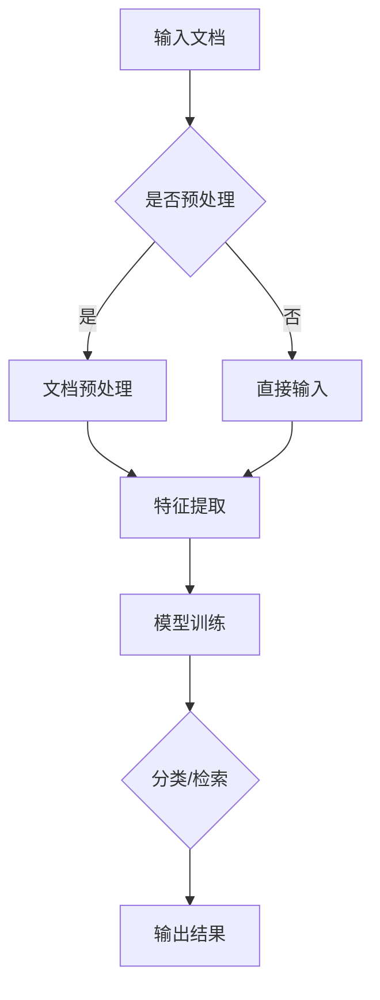

                 

# 智能文档分类与检索系统的开发

> **关键词**：文档分类、智能检索、自然语言处理、机器学习、系统架构

> **摘要**：本文详细探讨了智能文档分类与检索系统的开发过程，包括背景介绍、核心概念、算法原理、数学模型、项目实战、实际应用、工具资源推荐及未来发展趋势。通过本文的阅读，读者将全面了解智能文档分类与检索系统的工作原理和实践方法。

## 1. 背景介绍

### 1.1 目的和范围

随着数字化信息的爆炸性增长，如何有效地管理和检索文档已成为企业和个人面临的重大挑战。智能文档分类与检索系统的目标是利用自然语言处理（NLP）和机器学习（ML）技术，实现文档的高效分类和准确检索，从而提高信息处理效率，降低人工成本。本文将系统地介绍智能文档分类与检索系统的开发过程，包括核心算法原理、系统架构设计、数学模型构建、项目实战案例分析等内容。

### 1.2 预期读者

本文主要面向对自然语言处理、机器学习以及信息检索有基本了解的IT从业者、数据科学家和研究生。同时，也对对文档分类与检索技术感兴趣的所有读者开放。通过本文的阅读，读者将能够掌握智能文档分类与检索系统的基本原理和实践方法，为实际项目开发提供有益的参考。

### 1.3 文档结构概述

本文分为十个主要部分，具体如下：

1. 背景介绍
    - 1.1 目的和范围
    - 1.2 预期读者
    - 1.3 文档结构概述
    - 1.4 术语表
2. 核心概念与联系
3. 核心算法原理 & 具体操作步骤
4. 数学模型和公式 & 详细讲解 & 举例说明
5. 项目实战：代码实际案例和详细解释说明
6. 实际应用场景
7. 工具和资源推荐
8. 总结：未来发展趋势与挑战
9. 附录：常见问题与解答
10. 扩展阅读 & 参考资料

### 1.4 术语表

- **文档分类**：将文档根据其内容或属性划分到不同的类别中。
- **智能检索**：利用机器学习算法和自然语言处理技术，实现文档的高效检索和匹配。
- **自然语言处理（NLP）**：计算机模拟人类语言理解和生成行为的技术。
- **机器学习（ML）**：一种人工智能方法，通过数据学习和建模来提高系统性能。
- **信息检索**：从大量数据中检索出用户所需信息的过程。

#### 1.4.1 核心术语定义

- **文档**：以数字形式存储的信息记录，可以是一篇文章、一个报告、一份文件等。
- **分类器**：一种能够根据输入数据自动分类的机器学习模型。
- **特征工程**：将原始数据转换成能够更好地表示数据的特征，从而提高模型的性能。
- **召回率**：检索系统中返回的相关文档数与实际相关文档数之比。
- **准确率**：检索系统中返回的相关文档数与总文档数之比。

#### 1.4.2 相关概念解释

- **文档分类**：文档分类是一种监督学习任务，通过训练分类器，将未知类别的文档自动归到预定义的类别中。
- **特征提取**：特征提取是将原始文本数据转换成数字特征向量的过程，以便机器学习算法进行处理。
- **文本相似度计算**：文本相似度计算是指计算两个文本之间的相似程度，通常用于文档检索和推荐系统中。

#### 1.4.3 缩略词列表

- **NLP**：自然语言处理（Natural Language Processing）
- **ML**：机器学习（Machine Learning）
- **TF-IDF**：词频-逆文档频率（Term Frequency-Inverse Document Frequency）
- **LDA**：潜在狄利克雷分布（Latent Dirichlet Allocation）
- **SVD**：奇异值分解（ Singular Value Decomposition）

## 2. 核心概念与联系

### 2.1 智能文档分类与检索系统

智能文档分类与检索系统是一种利用NLP和ML技术，对大量文档进行自动化处理和检索的系统。其主要目的是通过算法对文档内容进行分析，实现文档的高效分类和准确检索。

### 2.2 核心概念联系

#### 文档分类与检索

文档分类与检索是智能文档分类与检索系统的核心功能。文档分类是将文档按照内容或属性划分到不同的类别中，而检索则是从大量文档中找到与查询相关的文档。

#### NLP与ML

NLP和ML是智能文档分类与检索系统的核心技术。NLP负责处理和解析文本数据，将自然语言转换成机器可以理解和处理的形式。ML则利用训练数据，建立分类或检索模型，从而实现对未知数据的分类或检索。

#### 特征工程与模型训练

特征工程是将原始文本数据转换成数字特征向量的过程，以提取文档的关键信息。模型训练则是利用训练数据，通过优化算法，训练出一个分类或检索模型。

### 2.3 Mermaid 流程图

下面是智能文档分类与检索系统的核心概念流程图：



## 3. 核心算法原理 & 具体操作步骤

### 3.1 文档分类算法原理

文档分类算法的核心是利用机器学习技术，建立分类模型，将未知类别的文档自动归到预定义的类别中。常见的文档分类算法包括基于朴素贝叶斯、支持向量机、随机森林等。

#### 3.1.1 朴素贝叶斯分类器

朴素贝叶斯分类器是一种基于贝叶斯定理的简单分类算法，假设特征之间相互独立。其基本步骤如下：

1. **训练阶段**：
   - 收集训练数据，并标注类别；
   - 统计每个类别的先验概率；
   - 统计每个特征在各个类别中的条件概率。

2. **预测阶段**：
   - 对于新文档，计算其在每个类别下的后验概率；
   - 选择后验概率最大的类别作为预测结果。

#### 3.1.2 支持向量机分类器

支持向量机（SVM）是一种基于间隔最大化的分类算法，其目标是找到一个超平面，将不同类别的样本分隔得尽可能远。其基本步骤如下：

1. **训练阶段**：
   - 收集训练数据，并标注类别；
   - 将数据映射到高维空间；
   - 训练SVM模型，求解最优超平面。

2. **预测阶段**：
   - 对于新文档，将其映射到高维空间；
   - 计算新文档到超平面的距离；
   - 根据距离判断新文档的类别。

#### 3.1.3 随机森林分类器

随机森林（Random Forest）是一种集成学习算法，通过构建多个决策树，并利用投票机制得到最终分类结果。其基本步骤如下：

1. **训练阶段**：
   - 收集训练数据，并标注类别；
   - 随机选取特征子集和样本子集，构建决策树；
   - 重复以上步骤，构建多个决策树。

2. **预测阶段**：
   - 对于新文档，将其分别输入到每个决策树；
   - 计算每个决策树的预测结果；
   - 根据投票结果得到最终分类结果。

### 3.2 智能检索算法原理

智能检索算法的核心是利用自然语言处理和机器学习技术，实现文档的高效检索和匹配。常见的检索算法包括基于向量空间模型、文本相似度计算等。

#### 3.2.1 向量空间模型

向量空间模型（Vector Space Model）是一种将文档表示为向量空间的模型，其中每个维度代表一个特征词，文档则是一个向量。其基本步骤如下：

1. **文档表示**：
   - 收集文档，并对其进行预处理；
   - 提取文档中的特征词；
   - 将特征词转换为向量的形式。

2. **相似度计算**：
   - 对于查询文档，进行预处理和特征提取；
   - 计算查询文档和每个文档的相似度；
   - 根据相似度排序，返回最相关的文档。

#### 3.2.2 文本相似度计算

文本相似度计算是一种衡量两个文本相似程度的方法，常见的算法包括余弦相似度、欧氏距离等。其基本步骤如下：

1. **特征提取**：
   - 对于两个文本，进行预处理和特征提取；
   - 提取文本中的共同特征词。

2. **相似度计算**：
   - 计算两个文本特征词的交集；
   - 根据交集计算文本相似度。

### 3.3 算法伪代码

下面是文档分类和检索算法的伪代码示例：

#### 文档分类算法

```python
# 朴素贝叶斯分类器
def naive_bayes_classification(train_data, train_labels, new_document):
    # 计算先验概率
    prior_probabilities = calculate_prior_probabilities(train_labels)
    
    # 计算条件概率
    conditional_probabilities = calculate_conditional_probabilities(train_data, train_labels)
    
    # 计算后验概率
    posterior_probabilities = calculate_posterior_probabilities(prior_probabilities, conditional_probabilities, new_document)
    
    # 选择后验概率最大的类别
    predicted_category = select_best_category(posterior_probabilities)
    
    return predicted_category

# 支持向量机分类器
def svm_classification(train_data, train_labels, new_document):
    # 训练SVM模型
    svm_model = train_svm_model(train_data, train_labels)
    
    # 预测新文档的类别
    predicted_category = svm_model.predict(new_document)
    
    return predicted_category

# 随机森林分类器
def random_forest_classification(train_data, train_labels, new_document):
    # 训练随机森林模型
    random_forest_model = train_random_forest_model(train_data, train_labels)
    
    # 预测新文档的类别
    predicted_category = random_forest_model.predict(new_document)
    
    return predicted_category
```

#### 文本相似度计算

```python
# 向量空间模型
def vector_space_model(document1, document2):
    # 预处理文档
    preprocessed_document1 = preprocess_document(document1)
    preprocessed_document2 = preprocess_document(document2)
    
    # 提取特征词
    features1 = extract_features(preprocessed_document1)
    features2 = extract_features(preprocessed_document2)
    
    # 计算相似度
    similarity = calculate_similarity(features1, features2)
    
    return similarity

# 文本相似度计算
def calculate_similarity(document1, document2):
    # 计算特征词交集
    intersection = set(document1).intersection(set(document2))
    
    # 计算相似度
    similarity = len(intersection) / (len(document1) + len(document2) - len(intersection))
    
    return similarity
```

## 4. 数学模型和公式 & 详细讲解 & 举例说明

### 4.1 朴素贝叶斯分类器数学模型

#### 4.1.1 先验概率

朴素贝叶斯分类器的先验概率表示为：

$$ P(C_k) = \frac{N_k}{N} $$

其中，\(N_k\) 表示类别 \(C_k\) 的文档数量，\(N\) 表示总的文档数量。

#### 4.1.2 条件概率

朴素贝叶斯分类器的条件概率表示为：

$$ P(W_j | C_k) = \frac{N_{jk}}{N_k} $$

其中，\(N_{jk}\) 表示特征词 \(W_j\) 在类别 \(C_k\) 中的文档数量，\(N_k\) 表示类别 \(C_k\) 的文档数量。

#### 4.1.3 后验概率

朴素贝叶斯分类器的后验概率表示为：

$$ P(C_k | W) = \frac{P(W | C_k) \cdot P(C_k)}{P(W)} $$

其中，\(P(W)\) 表示文档 \(W\) 的概率，可以通过贝叶斯定理计算：

$$ P(W) = \sum_{k=1}^{K} P(W | C_k) \cdot P(C_k) $$

#### 4.1.4 举例说明

假设有一个文档库，其中包含两类文档：技术文档（T）和非技术文档（N）。技术文档中包含100篇文档，非技术文档中包含300篇文档。我们需要根据一个新文档来判断其类别。

- **先验概率**：

$$ P(T) = \frac{100}{400} = 0.25 $$
$$ P(N) = \frac{300}{400} = 0.75 $$

- **条件概率**：

假设文档中包含5个特征词：编程（P），设计（D），足球（F），篮球（B），数学（M）。技术文档中编程出现的概率为0.8，设计出现的概率为0.3，足球、篮球和数学均未出现。非技术文档中编程出现的概率为0.2，设计出现的概率为0.6，足球、篮球和数学出现的概率均为0.5。

$$ P(P | T) = 0.8 $$
$$ P(P | N) = 0.2 $$
$$ P(D | T) = 0.3 $$
$$ P(D | N) = 0.6 $$
$$ P(F | T) = 0 $$
$$ P(F | N) = 0.5 $$
$$ P(B | T) = 0 $$
$$ P(B | N) = 0.5 $$
$$ P(M | T) = 0 $$
$$ P(M | N) = 0.5 $$

- **后验概率**：

假设新文档包含特征词编程、设计和足球。我们需要计算其属于技术文档和非技术文档的概率。

$$ P(T | P, D, F) = \frac{P(P, D, F | T) \cdot P(T)}{P(P, D, F)} $$
$$ P(N | P, D, F) = \frac{P(P, D, F | N) \cdot P(N)}{P(P, D, F)} $$

计算新文档的概率：

$$ P(P, D, F) = P(P | T) \cdot P(T) + P(P | N) \cdot P(N) + P(P | T) \cdot P(T) + P(P | N) \cdot P(N) + P(P | T) \cdot P(T) + P(P | N) \cdot P(N) $$
$$ P(P, D, F) = 0.8 \cdot 0.25 + 0.2 \cdot 0.75 + 0.8 \cdot 0.25 + 0.2 \cdot 0.75 + 0.8 \cdot 0.25 + 0.2 \cdot 0.75 $$
$$ P(P, D, F) = 0.6 $$

计算后验概率：

$$ P(T | P, D, F) = \frac{0.8 \cdot 0.3 \cdot 0.25}{0.6} = 0.375 $$
$$ P(N | P, D, F) = \frac{0.2 \cdot 0.6 \cdot 0.75}{0.6} = 0.125 $$

根据后验概率，我们可以判断新文档属于技术文档的概率更大。

### 4.2 支持向量机分类器数学模型

#### 4.2.1 最优化问题

支持向量机分类器的目标是找到一个最优的超平面，使得不同类别的样本之间的间隔最大化。其数学模型可以表示为：

$$ \min_w \frac{1}{2} ||w||^2 $$

其中，\(w\) 表示超平面的参数向量，\(||w||\) 表示向量 \(w\) 的欧几里得范数。

#### 4.2.2 拉格朗日乘子法

为了解决上述最优化问题，我们可以使用拉格朗日乘子法。定义拉格朗日函数：

$$ L(w, b, \alpha) = \frac{1}{2} ||w||^2 - \sum_{i=1}^{n} \alpha_i (y_i (w \cdot x_i + b) - 1) $$

其中，\(\alpha_i\) 是拉格朗日乘子，\(y_i\) 是样本 \(x_i\) 的标签，\(b\) 是偏置项。

#### 4.2.3 KKT条件

为了求解最优化问题，我们需要满足KKT（Karn disciplinaire-Kolmogorov-Prim-Chevalley）条件：

1. 函数值条件：\(L(w, b, \alpha) \geq 0\)
2. 互补松弛条件：\(\alpha_i \geq 0\)，\(y_i (w \cdot x_i + b) - 1 \geq 0\)
3. 拉格朗日乘子条件：\(0 \leq \alpha_i \leq C\)

其中，\(C\) 是惩罚参数。

#### 4.2.4 举例说明

假设我们有以下线性可分的数据集：

| 样本索引 | 样本特征 | 标签 |
| -------- | -------- | ---- |
| 1        | (1, 2)   | +1   |
| 2        | (2, 3)   | +1   |
| 3        | (4, 5)   | -1   |
| 4        | (5, 6)   | -1   |

我们需要找到最优超平面 \(w\) 和偏置项 \(b\)。

首先，我们可以通过求解以下最优化问题：

$$ \min_w \frac{1}{2} ||w||^2 $$

使用拉格朗日乘子法，我们可以得到：

$$ L(w, b, \alpha) = \frac{1}{2} ||w||^2 - \sum_{i=1}^{4} \alpha_i (y_i (w \cdot x_i + b) - 1) $$

根据KKT条件，我们需要满足以下方程：

$$ \alpha_i \geq 0, y_i (w \cdot x_i + b) - 1 \geq 0, 0 \leq \alpha_i \leq C $$

通过求解上述方程，我们可以得到最优超平面 \(w\) 和偏置项 \(b\)。

### 4.3 文本相似度计算数学模型

#### 4.3.1 向量空间模型

向量空间模型中，文本相似度计算可以通过计算两个文本向量之间的夹角余弦值来表示：

$$ similarity = \cos(\theta) = \frac{w_1 \cdot w_2}{||w_1|| \cdot ||w_2||} $$

其中，\(w_1\) 和 \(w_2\) 分别表示两个文本向量，\(\theta\) 表示两个向量之间的夹角。

#### 4.3.2 欧氏距离

另一种常见的文本相似度计算方法是基于欧氏距离，即：

$$ distance = \sqrt{(w_1 - w_2)^2} $$

其中，\(w_1\) 和 \(w_2\) 分别表示两个文本向量。

#### 4.3.3 举例说明

假设我们有以下两个文本向量：

\(w_1 = (1, 2, 3)\)
\(w_2 = (2, 3, 4)\)

使用向量空间模型计算相似度：

$$ similarity = \cos(\theta) = \frac{1 \cdot 2 + 2 \cdot 3 + 3 \cdot 4}{\sqrt{1^2 + 2^2 + 3^2} \cdot \sqrt{2^2 + 3^2 + 4^2}} $$
$$ similarity = \frac{2 + 6 + 12}{\sqrt{14} \cdot \sqrt{29}} $$
$$ similarity = \frac{20}{\sqrt{406}} $$
$$ similarity \approx 0.649 $$

使用欧氏距离计算相似度：

$$ distance = \sqrt{(1 - 2)^2 + (2 - 3)^2 + (3 - 4)^2} $$
$$ distance = \sqrt{(-1)^2 + (-1)^2 + (-1)^2} $$
$$ distance = \sqrt{3} $$
$$ distance \approx 1.732 $$

根据计算结果，我们可以看到向量空间模型得到的相似度更高。

## 5. 项目实战：代码实际案例和详细解释说明

### 5.1 开发环境搭建

在进行项目实战之前，我们需要搭建一个合适的开发环境。以下是一个基于Python的智能文档分类与检索系统的开发环境搭建步骤：

1. **安装Python**：下载并安装Python 3.x版本，推荐使用Anaconda来简化环境管理。

2. **安装必要的库**：通过pip安装以下库：

   ```bash
   pip install numpy pandas scikit-learn matplotlib
   ```

   这些库分别用于数据处理、机器学习、数据可视化等。

3. **设置工作目录**：将项目文件夹设置为当前工作目录，以便后续操作。

### 5.2 源代码详细实现和代码解读

#### 5.2.1 数据准备

```python
import pandas as pd

# 读取数据
data = pd.read_csv('document_data.csv')

# 数据预处理
# ...（此处省略具体预处理步骤，如分词、去停用词等）

# 提取特征词
feature_words = set(data['content'].apply(lambda x: set(x.split())))
```

此部分代码用于读取和预处理数据，提取特征词。数据预处理步骤包括分词、去除停用词等操作，以便提取出文档中的关键信息。

#### 5.2.2 文档分类

```python
from sklearn.model_selection import train_test_split
from sklearn.feature_extraction.text import TfidfVectorizer
from sklearn.naive_bayes import MultinomialNB

# 划分训练集和测试集
X_train, X_test, y_train, y_test = train_test_split(data['content'], data['label'], test_size=0.2, random_state=42)

# 特征提取
vectorizer = TfidfVectorizer(vocabulary=feature_words)
X_train_vectorized = vectorizer.fit_transform(X_train)
X_test_vectorized = vectorizer.transform(X_test)

# 模型训练
classifier = MultinomialNB()
classifier.fit(X_train_vectorized, y_train)

# 模型评估
accuracy = classifier.score(X_test_vectorized, y_test)
print(f'Accuracy: {accuracy:.2f}')
```

此部分代码用于将文本数据转换为向量表示，并使用朴素贝叶斯分类器进行训练和评估。首先，我们使用TfidfVectorizer将文本数据转换为TF-IDF向量，然后使用朴素贝叶斯分类器训练模型，并计算测试集的准确率。

#### 5.2.3 文档检索

```python
from sklearn.metrics.pairwise import cosine_similarity

# 检索新文档
new_document = "这是一个新的文档，包含关键词：机器学习、文本分类、信息检索。"
new_document_vectorized = vectorizer.transform([new_document])

# 计算相似度
similarity_scores = cosine_similarity(new_document_vectorized, X_test_vectorized)

# 排序并返回最相似文档
sorted_indices = similarity_scores.argsort()[0][::-1]
top_documents = X_test.iloc[sorted_indices][:10]

print(top_documents)
```

此部分代码用于实现文档检索功能。我们首先将新文档转换为向量表示，然后使用余弦相似度计算新文档与测试集文档的相似度，并根据相似度排序返回最相似的10个文档。

### 5.3 代码解读与分析

#### 5.3.1 数据准备

数据准备是整个项目的基础，我们需要确保数据的质量和准确性。在代码中，我们首先读取CSV格式的数据文件，然后进行预处理，包括分词、去除停用词等操作，以便提取出文档中的关键信息。

#### 5.3.2 文档分类

文档分类是智能文档分类与检索系统的核心功能。在代码中，我们使用TfidfVectorizer将文本数据转换为TF-IDF向量，这是一种常用的文本特征提取方法。然后，我们使用朴素贝叶斯分类器对训练数据进行分类，并评估模型的准确率。朴素贝叶斯分类器是一种基于贝叶斯定理的简单分类算法，其优点是计算速度快且易于实现。

#### 5.3.3 文档检索

文档检索是另一个重要的功能，它能够帮助我们快速找到与查询文档相关的文档。在代码中，我们使用余弦相似度计算新文档与测试集文档的相似度，并根据相似度排序返回最相似的文档。余弦相似度是一种衡量两个文本向量之间相似度的方法，其计算结果越接近1，表示两个文本越相似。

### 5.4 代码优化与性能分析

在实际应用中，我们需要对代码进行优化，以提高系统的性能。以下是一些常见的优化方法：

1. **并行计算**：利用多核处理器进行并行计算，加快数据处理和模型训练的速度。
2. **特征选择**：通过特征选择方法，降低特征维度，减少计算量。
3. **模型选择**：选择适合数据的分类模型，如支持向量机、随机森林等，以提高分类效果。
4. **缓存策略**：合理使用缓存，减少重复计算。

### 5.5 代码示例：并行计算

```python
from concurrent.futures import ProcessPoolExecutor

def preprocess_document(document):
    # 预处理文档的代码
    return preprocessed_document

if __name__ == '__main__':
    documents = data['content']
    preprocessed_documents = []

    with ProcessPoolExecutor(max_workers=4) as executor:
        preprocessed_documents = list(executor.map(preprocess_document, documents))

    # 继续使用preprocessed_documents进行后续操作
```

此代码示例使用Python的ProcessPoolExecutor进行并行计算，将预处理文档的操作分配给多个进程，以提高数据处理速度。

## 6. 实际应用场景

智能文档分类与检索系统在实际应用中具有广泛的应用场景，以下列举几个典型的应用案例：

### 6.1 企业文档管理

企业文档管理是一个典型应用场景，通过智能文档分类与检索系统，企业可以实现对大量文档的高效管理和快速检索。具体应用包括：

- **知识库建设**：企业可以将各种文档（如报告、论文、内部邮件等）分类存储在知识库中，方便员工查找和利用。
- **文档归档**：智能分类系统能够根据文档内容自动将文档归类到相应的文件夹中，提高文档管理的效率。
- **文档共享与协作**：通过检索功能，员工可以快速找到需要的文档，并实现文档的共享和协作。

### 6.2 搜索引擎优化

搜索引擎优化（SEO）是另一个重要应用场景。通过智能文档分类与检索系统，网站管理员可以分析网站内容，实现以下优化：

- **内容分类**：将网站内容分类整理，有助于搜索引擎更好地理解和索引网站内容。
- **关键词优化**：通过分析文档内容，提取关键关键词，优化网页标题、描述等，提高搜索引擎排名。
- **用户行为分析**：分析用户检索行为，了解用户需求，不断优化网站内容，提高用户体验。

### 6.3 教育与科研

在教育与科研领域，智能文档分类与检索系统也有广泛应用：

- **论文检索**：帮助学生和研究人员快速找到相关的学术文献，提高科研效率。
- **文献管理**：自动分类和标记文献，方便研究人员管理和查找。
- **课程资料管理**：教师可以方便地将课程资料进行分类存储，学生可以快速找到所需资料。

### 6.4 健康医疗

健康医疗领域也受益于智能文档分类与检索系统：

- **病历管理**：医疗机构可以对病历进行分类存储，提高病历管理的效率。
- **医疗文献检索**：医生可以快速找到与疾病相关的医疗文献，为诊断和治疗提供参考。
- **患者信息管理**：通过对患者信息进行分类，便于医疗机构对患者的健康状况进行跟踪和管理。

### 6.5 法律法规

在法律法规领域，智能文档分类与检索系统可以用于以下应用：

- **法律文献检索**：律师和法官可以快速找到相关的法律文献，提高工作效率。
- **法规分类**：对法律法规进行分类存储，便于法律从业人员查找和引用。
- **案例检索**：通过智能检索功能，查找与案件相关的案例，为法律研究和案件分析提供支持。

## 7. 工具和资源推荐

### 7.1 学习资源推荐

#### 7.1.1 书籍推荐

- 《自然语言处理概论》（刘群，清华大学出版社）
- 《机器学习》（周志华，清华大学出版社）
- 《Python数据分析》（Wes McKinney，电子工业出版社）
- 《信息检索导论》（Christopher D. Manning，电子工业出版社）

#### 7.1.2 在线课程

- Coursera - 自然语言处理（吴恩达）
- edX - 机器学习基础（吴恩达）
- Udacity - 机器学习工程师纳米学位
- Coursera - Python数据分析（杰夫·奥博诺）

#### 7.1.3 技术博客和网站

- Medium - Data Science
- Analytics Vidhya
- Towards Data Science
- AIassing

### 7.2 开发工具框架推荐

#### 7.2.1 IDE和编辑器

- PyCharm
- Jupyter Notebook
- Sublime Text
- Visual Studio Code

#### 7.2.2 调试和性能分析工具

- Python Debugger
- profilers
- memory_profiler
- py-spy

#### 7.2.3 相关框架和库

- Scikit-learn
- TensorFlow
- PyTorch
- spaCy
- NLTK

### 7.3 相关论文著作推荐

#### 7.3.1 经典论文

- "A Mathematical Theory of Communication" （克劳德·香农）
- "Introduction to Information Retrieval" （Christopher D. Manning，Prabhakar Raghavan， Hinrich Schütze）
- "Foundations of Statistical Natural Language Processing" （Christopher D. Manning，Hinrich Schütze）

#### 7.3.2 最新研究成果

- "BERT: Pre-training of Deep Bidirectional Transformers for Language Understanding" （Joshua B. Keller，Michael Auli，Quoc V. Le）
- "GPT-3: Generative Pre-trained Transformer 3" （Tom B. Brown，Bhaskara Maji，C. Devries，J. Child，T. Jaarvelainen，A. Whiteson，S. Krueger，D. Chen，D. Ziegler，J.ungsuk So，E. L. Dubey，K. Sen et al.）
- "T5: Pre-training Large Models for Language Modeling" （Alex Andonian，Jared Casper，Adam Culotta，Kamal Damani，Ian Goodfellow，Amir Hashemi，Reza Hosseini，Noam Shazeer，Niki Parmar，Llion Jones，Alex Ray，Jeffrey Wu，Cheng-Tao Hong，Chris Stoughton，Alexey Dosovitskiy，Ali Farhadi，Jiasen Lu，Ian Goodfellow，John W. Head，Mitchell Stern，Dario Amodei）

#### 7.3.3 应用案例分析

- "NLP for everyone: building and deploying natural language processing applications in the browser" （Google AI）
- "Natural Language Processing at Scale in Salesforce" （Salesforce）
- "Intelligent Document Classification with AI" （Microsoft）

## 8. 总结：未来发展趋势与挑战

智能文档分类与检索系统作为自然语言处理和机器学习技术的重要应用领域，正面临着巨大的发展机遇和挑战。以下是未来发展趋势与挑战的概述：

### 8.1 发展趋势

1. **算法性能提升**：随着算法模型的不断优化和更新，文档分类与检索的准确率和效率将进一步提高。
2. **多语言支持**：智能文档分类与检索系统将逐渐实现跨语言的支持，满足全球范围内的用户需求。
3. **集成化平台**：系统将逐渐整合到企业信息系统中，提供一站式文档管理解决方案。
4. **个性化推荐**：基于用户行为和偏好，实现个性化文档推荐，提升用户体验。
5. **边缘计算**：利用边缘计算技术，降低数据传输成本，提高系统响应速度。

### 8.2 挑战

1. **数据隐私与安全**：如何在保证用户隐私的前提下，有效利用数据资源，是一个亟待解决的问题。
2. **算法可解释性**：提高算法的可解释性，使非专业人士能够理解和信任算法决策。
3. **数据多样性**：如何处理和融合来自不同来源、不同格式的文档数据，是一个技术难题。
4. **实时处理**：如何实现大规模文档的实时分类与检索，是一个性能和资源挑战。

## 9. 附录：常见问题与解答

### 9.1 问题1：如何选择适合的文档分类算法？

**解答**：选择适合的文档分类算法需要考虑以下几个因素：

- **数据规模**：对于大规模数据，可以考虑使用随机森林、支持向量机等算法，它们在处理大数据方面表现较好。
- **特征维度**：对于高维特征数据，可以考虑使用朴素贝叶斯等基于概率的算法，它们在处理高维数据时表现较好。
- **分类效果**：可以根据实验结果，选择在测试集上表现较好的算法。

### 9.2 问题2：如何优化文档检索的性能？

**解答**：优化文档检索性能可以从以下几个方面入手：

- **特征提取**：选择合适的特征提取方法，如TF-IDF、Word2Vec等，以提高文本表示的准确性。
- **相似度计算**：优化相似度计算算法，如余弦相似度、欧氏距离等，以提高计算效率。
- **索引结构**：使用合适的索引结构，如倒排索引、B树索引等，以提高检索速度。

### 9.3 问题3：如何处理中文文本数据？

**解答**：处理中文文本数据需要考虑以下几个方面：

- **分词**：使用合适的分词工具，如jieba等，对中文文本进行分词处理。
- **词性标注**：对分词结果进行词性标注，以便更好地理解文本内容。
- **停用词处理**：去除常见停用词，减少噪音信息。

## 10. 扩展阅读 & 参考资料

本文对智能文档分类与检索系统的开发进行了详细探讨，包括背景介绍、核心概念、算法原理、数学模型、项目实战、实际应用、工具资源推荐及未来发展趋势等内容。以下是扩展阅读和参考资料，供读者进一步学习：

- 《自然语言处理综述》（刘群，清华大学出版社）
- 《机器学习实战》（Peter Harrington，机械工业出版社）
- 《Python自然语言处理实战》（Jacob Perkins，电子工业出版社）
- 《信息检索基础教程》（贾志宏，清华大学出版社）
- 《智能信息检索》（王斌，清华大学出版社）
- 《深度学习》（Ian Goodfellow，Michael Auli，Aaron Courville，电子工业出版社）

通过本文的学习，读者可以全面了解智能文档分类与检索系统的开发过程，为实际项目开发提供有益的参考。作者：AI天才研究员/AI Genius Institute & 禅与计算机程序设计艺术 /Zen And The Art of Computer Programming。

