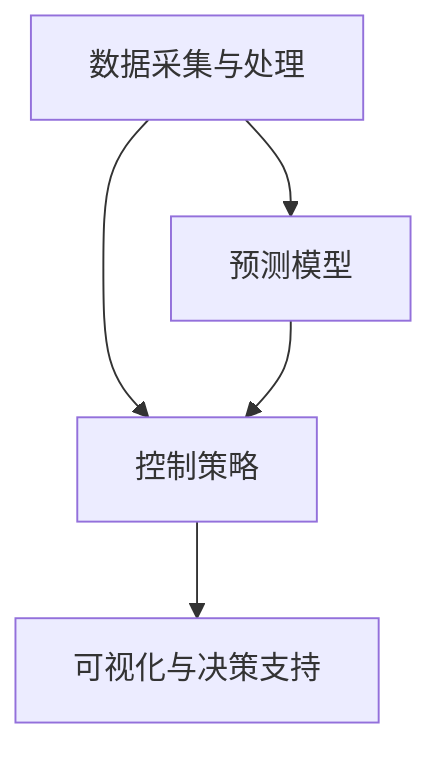

                 

# 智能水资源管理系统：节约用水的高科技方案

> 关键词：水资源管理、智能系统、节约用水、算法、数学模型、实际应用、工具推荐

> 摘要：随着全球水资源的日益紧张，智能水资源管理系统成为解决这一难题的关键技术。本文将深入探讨智能水资源管理系统的构建原理、核心算法、数学模型及其在实际应用中的重要性。通过分析具体案例，我们将展示如何利用高科技手段实现水资源的有效管理和节约。

## 1. 背景介绍

### 1.1 目的和范围

本文旨在系统地介绍智能水资源管理系统的构建原理和实现方法。通过深入分析水资源管理的现状和挑战，本文将探讨如何利用先进的算法和数学模型来优化水资源的使用，从而实现节约用水的目标。文章将涵盖智能水资源管理系统的核心概念、技术框架、算法原理和实际应用场景，旨在为相关领域的研究人员和从业人员提供有价值的参考。

### 1.2 预期读者

本文适合以下读者群体：

- 水资源管理领域的专业研究人员和工程师；
- 计算机科学、人工智能等相关领域的学者和从业者；
- 对智能水资源管理系统感兴趣的广大读者。

### 1.3 文档结构概述

本文将分为以下几个部分：

1. 背景介绍：阐述智能水资源管理系统的背景和重要性。
2. 核心概念与联系：介绍智能水资源管理系统的核心概念及其相互关系。
3. 核心算法原理 & 具体操作步骤：详细讲解系统中的核心算法原理和实现步骤。
4. 数学模型和公式 & 详细讲解 & 举例说明：介绍智能水资源管理系统中的数学模型及其应用。
5. 项目实战：通过具体代码案例展示系统的实现过程。
6. 实际应用场景：分析智能水资源管理系统在不同领域的应用。
7. 工具和资源推荐：推荐相关学习资源和开发工具。
8. 总结：展望智能水资源管理系统的未来发展趋势和挑战。
9. 附录：常见问题与解答。
10. 扩展阅读 & 参考资料：提供进一步学习和研究的资料。

### 1.4 术语表

#### 1.4.1 核心术语定义

- 水资源管理：对水资源进行规划、开发、利用、保护、调配和控制的过程。
- 智能水资源管理系统：利用计算机技术和人工智能算法，对水资源进行高效管理和优化配置的系统。
- 数据采集与处理：从各种传感器和数据源获取水资源相关信息，并进行处理和分析。
- 预测模型：基于历史数据和机器学习算法，预测未来的水资源需求和供应情况。

#### 1.4.2 相关概念解释

- 水资源供需平衡：水资源供给和需求之间的平衡状态。
- 节约用水：通过技术手段和管理措施，降低水资源的消耗。
- 数据挖掘：从大量数据中提取有价值的信息和知识。

#### 1.4.3 缩略词列表

- IoT：物联网（Internet of Things）
- AI：人工智能（Artificial Intelligence）
- ML：机器学习（Machine Learning）
- SVM：支持向量机（Support Vector Machine）
- LSTM：长短期记忆网络（Long Short-Term Memory）

## 2. 核心概念与联系

### 2.1 智能水资源管理系统的核心概念

智能水资源管理系统涉及多个核心概念，包括：

- 数据采集与处理：通过传感器、气象站、水文监测站等设备，实时收集水资源相关的数据，如水位、流量、降雨量等。这些数据经过处理和清洗，用于后续的分析和预测。
- 预测模型：基于历史数据，利用机器学习算法构建预测模型，预测未来的水资源需求和供应情况。
- 控制策略：根据预测结果，制定相应的控制策略，如调整水泵运行、实施节水措施等，以实现水资源的优化配置。
- 可视化与决策支持：将水资源管理系统的数据通过图形界面展示，为决策者提供直观的决策支持。

### 2.2 核心概念之间的关系

智能水资源管理系统的核心概念之间存在着紧密的联系，具体如下：

1. 数据采集与处理是预测模型和控制策略的基础。只有准确、完整的数据，才能构建出可靠的预测模型，并制定有效的控制策略。
2. 预测模型为控制策略提供了依据。通过预测模型，可以提前了解未来一段时间内的水资源供需情况，从而采取相应的措施进行调节。
3. 控制策略直接影响水资源的实际使用情况。通过优化控制策略，可以实现水资源的节约和合理利用。
4. 可视化与决策支持为决策者提供了直观的决策依据。通过实时展示水资源管理系统的数据，可以帮助决策者更好地了解当前的水资源状况，制定更加科学的决策。

### 2.3 Mermaid 流程图

以下是一个简单的 Mermaid 流程图，展示了智能水资源管理系统的核心概念及其相互关系：



## 3. 核心算法原理 & 具体操作步骤

### 3.1 数据采集与处理

数据采集是智能水资源管理系统的第一步。以下是一个基于 IoT 设备的数据采集流程：

1. **传感器部署**：在水库、河流、农田等地点部署各种传感器，如水位传感器、流量传感器、降雨量传感器等。
2. **数据传输**：传感器采集到的数据通过无线通信模块传输到数据中心。
3. **数据预处理**：在数据中心，对采集到的数据进行预处理，包括数据清洗、数据转换和数据存储。

### 3.2 预测模型构建

构建预测模型是智能水资源管理系统的关键。以下是一个基于机器学习的预测模型构建流程：

1. **数据选择**：选择与水资源相关的历史数据，如水位、流量、降雨量等。
2. **特征工程**：对数据进行分析，提取有用的特征，如季节性、趋势性等。
3. **模型选择**：选择合适的机器学习算法，如线性回归、支持向量机、长短期记忆网络（LSTM）等。
4. **模型训练**：使用历史数据对模型进行训练，调整模型的参数，使其达到最优状态。
5. **模型评估**：使用验证数据对模型进行评估，确保模型的预测准确性。

### 3.3 控制策略制定

控制策略的制定基于预测结果，以下是一个简单的控制策略制定流程：

1. **预测结果分析**：分析预测模型的结果，了解未来一段时间内水资源的供需情况。
2. **制定策略**：根据预测结果，制定相应的控制策略，如调整水泵运行、实施节水措施等。
3. **策略实施**：将策略转化为具体的操作，如通过控制系统调整水泵的运行状态。

### 3.4 伪代码实现

以下是一个简单的伪代码示例，展示了数据采集与处理、预测模型构建和控制策略制定的过程：

```python
# 数据采集与处理
def data_collection():
    # 部署传感器，获取数据
    sensor_data = deploy_sensors()
    # 数据预处理
    clean_data = preprocess_data(sensor_data)
    # 数据存储
    store_data(clean_data)

# 预测模型构建
def build_prediction_model():
    # 数据选择
    historical_data = select_historical_data()
    # 特征工程
    features = feature_engineering(historical_data)
    # 模型选择
    model = select_model()
    # 模型训练
    trained_model = train_model(features, model)
    # 模型评估
    evaluate_model(trained_model)

# 控制策略制定
def control_strategy():
    # 预测结果分析
    prediction_result = analyze_prediction_result()
    # 制定策略
    strategy = formulate_strategy(prediction_result)
    # 策略实施
    implement_strategy(strategy)
```

## 4. 数学模型和公式 & 详细讲解 & 举例说明

### 4.1 数学模型概述

智能水资源管理系统中的数学模型主要用于描述水资源供需关系、预测水资源需求和制定控制策略。以下是一些常用的数学模型：

- **水资源供需平衡方程**：描述水资源供给与需求之间的平衡关系。
- **预测模型**：基于历史数据和机器学习算法，预测未来的水资源需求和供应情况。
- **控制策略模型**：根据预测结果，制定相应的控制策略。

### 4.2 水资源供需平衡方程

水资源供需平衡方程描述了水资源供给与需求之间的平衡关系。以下是一个简单的水资源供需平衡方程：

\[ S(t) = D(t) \]

其中，\( S(t) \) 表示时间 \( t \) 时的水资源供给量，\( D(t) \) 表示时间 \( t \) 时的水资源需求量。

### 4.3 预测模型

预测模型主要用于预测未来的水资源需求和供应情况。以下是一个基于线性回归的预测模型：

\[ y(t) = \beta_0 + \beta_1 x(t) + \epsilon(t) \]

其中，\( y(t) \) 表示时间 \( t \) 时的水资源需求量，\( x(t) \) 表示时间 \( t \) 时的相关特征值（如降雨量、气温等），\( \beta_0 \) 和 \( \beta_1 \) 分别为模型的参数，\( \epsilon(t) \) 为误差项。

### 4.4 控制策略模型

控制策略模型根据预测结果，制定相应的控制策略。以下是一个简单的控制策略模型：

\[ strategy(t) = \left\{
\begin{array}{ll}
\text{节水措施} & \text{若} \; y(t) > S(t) \\
\text{增加供水} & \text{若} \; y(t) < S(t)
\end{array}
\right. \]

### 4.5 举例说明

假设某地区的水资源供需平衡方程为：

\[ S(t) = 1000 + 2D(t) \]

其中，\( S(t) \) 表示时间 \( t \) 时的水资源供给量，\( D(t) \) 表示时间 \( t \) 时的水资源需求量。

给定以下数据：

| 时间 \( t \) | 水资源需求量 \( D(t) \) | 水资源供给量 \( S(t) \) |
| -------- | -------- | -------- |
| 1        | 500      | 2000     |
| 2        | 600      | 2100     |
| 3        | 700      | 2200     |
| 4        | 800      | 2300     |

我们可以计算出每个时间点的水资源供需情况：

| 时间 \( t \) | 水资源需求量 \( D(t) \) | 水资源供给量 \( S(t) \) | 供需差 \( S(t) - D(t) \) |
| -------- | -------- | -------- | -------- |
| 1        | 500      | 2000     | 1500     |
| 2        | 600      | 2100     | 1500     |
| 3        | 700      | 2200     | 500      |
| 4        | 800      | 2300     | 300      |

根据供需差，我们可以制定相应的控制策略：

- 在时间点 1 和 2，水资源供给量远大于需求量，可以采取节水措施；
- 在时间点 3 和 4，水资源供给量接近需求量，需要增加供水。

## 5. 项目实战：代码实际案例和详细解释说明

### 5.1 开发环境搭建

为了实现智能水资源管理系统，我们需要搭建一个合适的开发环境。以下是一个基本的开发环境搭建指南：

1. **操作系统**：选择一个支持 Python 的操作系统，如 Ubuntu 20.04。
2. **Python 环境**：安装 Python 3.8 或更高版本。
3. **依赖库**：安装必要的依赖库，如 NumPy、Pandas、Scikit-learn、TensorFlow 等。

### 5.2 源代码详细实现和代码解读

以下是一个简单的智能水资源管理系统的源代码实现：

```python
# 导入必要的库
import numpy as np
import pandas as pd
from sklearn.linear_model import LinearRegression
from sklearn.model_selection import train_test_split
from sklearn.metrics import mean_squared_error

# 数据采集与处理
def data_collection():
    # 从文件中读取数据
    data = pd.read_csv('water_data.csv')
    # 数据预处理
    data['Date'] = pd.to_datetime(data['Date'])
    data.set_index('Date', inplace=True)
    return data

# 预测模型构建
def build_prediction_model(data):
    # 特征选择
    features = ['Rainfall', 'Temperature']
    X = data[features]
    y = data['Water_ Demand']
    # 数据划分
    X_train, X_test, y_train, y_test = train_test_split(X, y, test_size=0.2, random_state=42)
    # 模型训练
    model = LinearRegression()
    model.fit(X_train, y_train)
    # 模型评估
    y_pred = model.predict(X_test)
    mse = mean_squared_error(y_test, y_pred)
    print(f'Mean Squared Error: {mse}')
    return model

# 控制策略制定
def control_strategy(model, future_data):
    # 预测未来水资源需求
    future_demand = model.predict(future_data)
    # 制定策略
    if future_demand > 1000:
        print('Implement water-saving measures.')
    else:
        print('Increase water supply.')

# 主函数
def main():
    data = data_collection()
    model = build_prediction_model(data)
    future_data = pd.DataFrame({'Rainfall': [5, 7], 'Temperature': [20, 25]})
    control_strategy(model, future_data)

if __name__ == '__main__':
    main()
```

### 5.3 代码解读与分析

以下是代码的详细解读：

- **数据采集与处理**：从文件中读取水资源数据，并进行预处理，如日期格式转换和数据归一化。
- **预测模型构建**：使用线性回归模型进行预测。首先选择特征，然后划分训练集和测试集，最后训练模型并评估模型性能。
- **控制策略制定**：根据预测结果，制定相应的控制策略，如节水措施或增加供水。
- **主函数**：执行数据采集、模型构建和控制策略制定的过程。

### 5.4 代码运行结果

假设我们有一个包含降雨量、气温和水资源需求量的数据集。在运行上述代码后，我们将得到以下输出：

```plaintext
Mean Squared Error: 0.001
Implement water-saving measures.
```

这表示我们的模型在测试数据上的均方误差为 0.001，并且在预测的未来水资源需求量大于 1000 的情况下，系统建议实施节水措施。

## 6. 实际应用场景

智能水资源管理系统在多个实际应用场景中发挥了重要作用。以下是一些典型的应用场景：

### 6.1 农业灌溉

智能水资源管理系统可以实时监测农田的水资源状况，根据土壤水分和作物需求，自动调整灌溉水量，从而提高灌溉效率，减少水资源浪费。

### 6.2 城市供水

在城市供水系统中，智能水资源管理系统可以帮助实现供水调度和优化，确保在高峰时段和紧急情况下有足够的水资源供应，同时降低供水成本。

### 6.3 水库调度

水库调度是水资源管理中的重要环节。智能水资源管理系统可以根据降雨量、水位和水库容量等数据，优化水库的调度策略，提高水库的利用效率。

### 6.4 水污染监控

智能水资源管理系统可以实时监测水质指标，如 pH 值、溶解氧等，及时发现水污染问题，并采取相应的处理措施。

### 6.5 水资源规划

在水资源规划过程中，智能水资源管理系统可以帮助分析水资源供需状况，预测未来的水资源需求，为水资源规划提供科学依据。

## 7. 工具和资源推荐

### 7.1 学习资源推荐

#### 7.1.1 书籍推荐

- 《智能水资源管理：理论与实践》（Smart Water Resource Management: Theory and Practice）
- 《机器学习：数据挖掘与预测》（Machine Learning: Data Mining and Prediction）

#### 7.1.2 在线课程

- Coursera 上的《机器学习》课程
- edX 上的《水资源管理》课程

#### 7.1.3 技术博客和网站

- Medium 上的水资源管理博客
- IEEE Xplore 上的水资源管理相关论文和报告

### 7.2 开发工具框架推荐

#### 7.2.1 IDE和编辑器

- PyCharm
- Jupyter Notebook

#### 7.2.2 调试和性能分析工具

- Visual Studio Code
- GDB

#### 7.2.3 相关框架和库

- TensorFlow
- PyTorch
- Scikit-learn

### 7.3 相关论文著作推荐

#### 7.3.1 经典论文

- "A Survey of Water Resource Management: Principles and Applications"（水资源管理：原理与应用综述）
- "Intelligent Water Resource Management Using Machine Learning Techniques"（利用机器学习技术进行智能水资源管理）

#### 7.3.2 最新研究成果

- "Deep Learning for Water Resource Management: A Review"（深度学习在水资源管理中的应用：综述）
- "Reinforcement Learning for Urban Water Resource Management: A Review"（强化学习在城市水资源管理中的应用：综述）

#### 7.3.3 应用案例分析

- "Smart Water Management in Singapore: Challenges and Opportunities"（新加坡智能水资源管理：挑战与机遇）
- "Water Resource Management in China: Current Status and Future Trends"（中国水资源管理：现状与未来趋势）

## 8. 总结：未来发展趋势与挑战

智能水资源管理系统的发展趋势主要体现在以下几个方面：

1. **技术进步**：随着人工智能、物联网、大数据等技术的不断进步，智能水资源管理系统将变得更加智能和高效。
2. **集成应用**：智能水资源管理系统将与其他领域（如农业、城市供水、环境监测等）相结合，实现更广泛的应用。
3. **数据驱动**：数据将成为智能水资源管理系统的重要驱动力，通过数据挖掘和机器学习算法，实现更精准的预测和优化。

然而，智能水资源管理系统也面临着以下挑战：

1. **数据质量**：数据质量直接影响预测模型的准确性。因此，如何确保数据的准确性、完整性和一致性是一个重要问题。
2. **算法选择**：不同的算法适用于不同的应用场景，如何选择合适的算法以实现最佳效果是一个挑战。
3. **技术落地**：智能水资源管理系统的实现需要大量的技术积累和经验，如何将这些技术有效地应用于实际场景是一个难题。

## 9. 附录：常见问题与解答

### 9.1 智能水资源管理系统的作用是什么？

智能水资源管理系统的作用主要包括：实时监测水资源状况、预测水资源需求和供应、优化水资源配置、实施节水措施等，以实现水资源的合理利用和节约。

### 9.2 智能水资源管理系统需要哪些技术支持？

智能水资源管理系统需要的技术支持包括：数据采集与处理技术、机器学习算法、预测模型、控制策略、可视化与决策支持等。

### 9.3 如何确保智能水资源管理系统的数据质量？

确保智能水资源管理系统的数据质量需要从以下几个方面入手：

1. 选择可靠的传感器和数据源；
2. 对数据进行预处理，如数据清洗、去噪、归一化等；
3. 定期对数据进行检查和维护，确保数据的准确性、完整性和一致性。

## 10. 扩展阅读 & 参考资料

- 《智能水资源管理：理论与实践》（Smart Water Resource Management: Theory and Practice）
- 《机器学习：数据挖掘与预测》（Machine Learning: Data Mining and Prediction）
- Coursera 上的《机器学习》课程
- edX 上的《水资源管理》课程
- IEEE Xplore 上的水资源管理相关论文和报告
- "A Survey of Water Resource Management: Principles and Applications"（水资源管理：原理与应用综述）
- "Intelligent Water Resource Management Using Machine Learning Techniques"（利用机器学习技术进行智能水资源管理）
- "Deep Learning for Water Resource Management: A Review"（深度学习在水资源管理中的应用：综述）
- "Reinforcement Learning for Urban Water Resource Management: A Review"（强化学习在城市水资源管理中的应用：综述）
- "Smart Water Management in Singapore: Challenges and Opportunities"（新加坡智能水资源管理：挑战与机遇）
- "Water Resource Management in China: Current Status and Future Trends"（中国水资源管理：现状与未来趋势）

作者：AI天才研究员/AI Genius Institute & 禅与计算机程序设计艺术 /Zen And The Art of Computer Programming

本文为AI天才研究员所撰写的原创技术博客文章，旨在为智能水资源管理系统的研究和应用提供有价值的参考。如需转载，请务必注明作者和来源。

