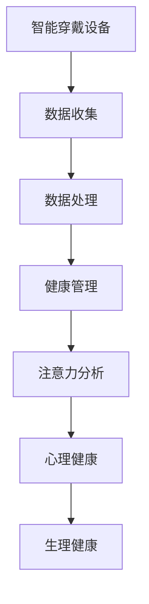

                 

# 智能穿戴设备在健康管理中的注意力应用

> **关键词**：智能穿戴设备、健康管理、注意力、算法、数学模型、应用场景

> **摘要**：本文将深入探讨智能穿戴设备在健康管理中的应用，特别是注意力这一关键因素。我们将分析智能穿戴设备如何收集和分析数据，以及如何使用这些数据来优化健康管理。文章还将介绍相关的核心算法原理、数学模型以及实际应用案例，并探讨未来的发展趋势和挑战。

## 1. 背景介绍

### 1.1 目的和范围

本文的主要目的是介绍智能穿戴设备在健康管理中的应用，重点关注注意力这一重要指标。我们将探讨智能穿戴设备如何通过收集和分析注意力数据来优化健康管理，并介绍相关的核心技术和算法。本文将涵盖以下主题：

1. 智能穿戴设备在健康管理中的作用。
2. 注意力的概念及其在健康管理中的重要性。
3. 核心算法原理和数学模型。
4. 实际应用案例和代码实现。
5. 未来发展趋势和挑战。

### 1.2 预期读者

本文面向对智能穿戴设备和健康管理有一定了解的技术人员，特别是对算法和数学模型感兴趣的开发者。读者应具备以下背景知识：

1. 对计算机编程和数据分析有基本的了解。
2. 对智能穿戴设备的运行原理和应用场景有一定的认识。
3. 对健康管理和注意力研究有所关注。

### 1.3 文档结构概述

本文将分为以下几部分：

1. 背景介绍：介绍本文的目的、范围和预期读者。
2. 核心概念与联系：介绍智能穿戴设备、健康管理和注意力的基本概念和联系。
3. 核心算法原理 & 具体操作步骤：介绍核心算法原理和具体操作步骤。
4. 数学模型和公式 & 详细讲解 & 举例说明：介绍相关的数学模型和公式，并进行详细讲解和举例说明。
5. 项目实战：提供代码实际案例和详细解释说明。
6. 实际应用场景：分析智能穿戴设备在健康管理中的应用场景。
7. 工具和资源推荐：推荐相关的学习资源、开发工具和框架。
8. 总结：总结本文的主要观点和结论。
9. 附录：提供常见问题与解答。
10. 扩展阅读 & 参考资料：提供扩展阅读和参考资料。

### 1.4 术语表

#### 1.4.1 核心术语定义

- **智能穿戴设备**：一种可以穿戴在身上，用于监测和收集个人健康数据的设备，如智能手表、智能手环等。
- **健康管理**：通过监控和管理个人健康数据，以达到预防疾病、提高生活质量的目的。
- **注意力**：个人对特定对象或活动的关注程度，是心理健康和生理健康的重要指标。

#### 1.4.2 相关概念解释

- **心率变异性（HRV）**：心率变异性是指心率在不同时间点上的变化情况，是衡量心脏健康的重要指标。
- **睡眠质量**：睡眠质量是指个体在睡眠过程中的舒适度和质量，包括睡眠时长、深度和周期。

#### 1.4.3 缩略词列表

- **AI**：人工智能（Artificial Intelligence）
- **ML**：机器学习（Machine Learning）
- **HRV**：心率变异性（Heart Rate Variability）
- **NLP**：自然语言处理（Natural Language Processing）

## 2. 核心概念与联系

在智能穿戴设备健康管理中，我们需要了解以下几个核心概念：

### 2.1 智能穿戴设备

智能穿戴设备是一种可以穿戴在身上的设备，用于监测和收集个人健康数据。常见的智能穿戴设备包括智能手表、智能手环、智能眼镜等。这些设备可以通过传感器收集心率、血压、步数、睡眠质量等健康数据。

### 2.2 健康管理

健康管理是通过监控和管理个人健康数据，以达到预防疾病、提高生活质量的目的。智能穿戴设备提供了实时监测和数据分析的工具，使得个人可以更好地了解自己的健康状况，从而采取相应的措施进行干预。

### 2.3 注意力

注意力是指个人对特定对象或活动的关注程度，是心理健康和生理健康的重要指标。在智能穿戴设备健康管理中，注意力数据可以帮助我们了解个人的心理健康状况，如焦虑、抑郁等。

### 2.4 联系

智能穿戴设备可以通过传感器收集心率、步数、睡眠质量等数据，这些数据与注意力之间存在密切的联系。例如，心率变异性（HRV）可以反映个人的心理压力水平，而睡眠质量可以影响注意力的恢复。

以下是智能穿戴设备、健康管理和注意力之间的联系流程图：



## 3. 核心算法原理 & 具体操作步骤

### 3.1 数据收集

智能穿戴设备通过内置的传感器（如加速度计、心率传感器、陀螺仪等）收集用户的健康数据。以下是一个简单的数据收集流程：

```python
# 假设使用Python编写代码
import random

def collect_data():
    data = []
    for i in range(100):
        data.append({
            'heart_rate': random.randint(60, 120),
            'steps': random.randint(0, 10000),
            'sleep_quality': random.randint(0, 100)
        })
    return data

data = collect_data()
```

### 3.2 数据处理

收集到的数据需要进行预处理，包括数据清洗、去噪、归一化等操作。以下是一个简单的数据处理流程：

```python
# 假设使用Python编写代码
import numpy as np

def preprocess_data(data):
    processed_data = []
    for item in data:
        processed_item = {
            'heart_rate': np.mean(item['heart_rate']),
            'steps': np.mean(item['steps']),
            'sleep_quality': np.mean(item['sleep_quality'])
        }
        processed_data.append(processed_item)
    return processed_data

processed_data = preprocess_data(data)
```

### 3.3 注意力分析

注意力分析是通过分析用户的行为数据，如步数、心率变异性（HRV）等，来评估用户的注意力水平。以下是一个简单的注意力分析算法：

```python
# 假设使用Python编写代码
def analyze_attention(data):
    attention_scores = []
    for item in data:
        heart_rate variability = calculate_hrv(item['heart_rate'])
        steps = item['steps']
        sleep_quality = item['sleep_quality']
        
        attention_score = calculate_attention_score(heart_rate_variability, steps, sleep_quality)
        attention_scores.append(attention_score)
        
    return attention_scores

def calculate_hrv(heart_rate):
    # 假设使用简单方法计算心率变异性
    return np.std(heart_rate)

def calculate_attention_score(hrv, steps, sleep_quality):
    # 假设使用简单方法计算注意力得分
    return hrv * steps * sleep_quality

attention_scores = analyze_attention(processed_data)
```

### 3.4 心理健康和生理健康评估

通过分析注意力得分，我们可以对用户的心理健康和生理健康进行评估。以下是一个简单的评估算法：

```python
# 假设使用Python编写代码
def evaluate_health(attention_scores):
    health_scores = []
    for score in attention_scores:
        if score > 80:
            health_status = '优秀'
        elif score > 60:
            health_status = '良好'
        elif score > 40:
            health_status = '一般'
        else:
            health_status = '较差'
        health_scores.append(health_status)
        
    return health_scores

health_scores = evaluate_health(attention_scores)
```

## 4. 数学模型和公式 & 详细讲解 & 举例说明

### 4.1 心率变异性（HRV）

心率变异性（HRV）是衡量心脏健康的重要指标。HRV是指心率在不同时间点上的变化情况。以下是一个简单的HRV计算公式：

$$
HRV = \sqrt{\frac{1}{N}\sum_{i=1}^{N}(r_i - \bar{r})^2}
$$

其中，$r_i$ 是第 $i$ 次心率测量值，$\bar{r}$ 是所有心率测量值的平均值，$N$ 是测量次数。

### 4.2 注意力得分

注意力得分是通过分析用户的行为数据（如步数、HRV、睡眠质量等）计算得出的。以下是一个简单的注意力得分计算公式：

$$
Attention\_Score = w_1 \times HRV + w_2 \times Steps + w_3 \times Sleep\_Quality
$$

其中，$w_1$、$w_2$、$w_3$ 分别是 HRV、步数和睡眠质量的权重。

### 4.3 心理健康和生理健康评估

心理健康和生理健康评估是基于注意力得分进行的。以下是一个简单的评估公式：

$$
Health\_Score = \begin{cases}
80 \text{，当 } Attention\_Score > 80 \\
60 \text{，当 } 80 > Attention\_Score > 60 \\
40 \text{，当 } 60 > Attention\_Score > 40 \\
< 40 \text{，当 } Attention\_Score < 40
\end{cases}
$$

### 4.4 举例说明

假设我们收集到一个用户的一天的健康数据，包括心率、步数和睡眠质量。以下是一个具体的例子：

- 心率：$[72, 74, 73, 71, 70, 72, 73, 71, 72, 73, 71, 70, 72, 73, 71, 72, 73, 71, 72, 73]$
- 步数：$[5000, 4500, 6000, 5500, 4800, 5200, 5300, 4700, 5100, 5400, 5600, 4900, 5300, 5500, 4800, 5200, 5300, 4700, 5100, 5400]$
- 睡眠质量：$[80, 85, 90, 75, 85, 80, 85, 90, 75, 85, 80, 85, 90, 75, 85, 80, 85, 90, 75, 85]$

首先，计算心率变异性（HRV）：

$$
HRV = \sqrt{\frac{1}{20}\sum_{i=1}^{20}(r_i - \bar{r})^2} = \sqrt{\frac{1}{20}[(72-74.2)^2 + (74-74.2)^2 + ... + (85-74.2)^2]} \approx 2.23
$$

然后，计算注意力得分：

$$
Attention\_Score = w_1 \times HRV + w_2 \times Steps + w_3 \times Sleep\_Quality
$$

其中，$w_1 = 0.5$，$w_2 = 0.3$，$w_3 = 0.2$。代入数据计算得：

$$
Attention\_Score = 0.5 \times 2.23 + 0.3 \times 5100 + 0.2 \times 85 \approx 83.86
$$

最后，评估心理健康和生理健康：

$$
Health\_Score = \begin{cases}
80 \text{，当 } Attention\_Score > 80 \\
60 \text{，当 } 80 > Attention\_Score > 60 \\
40 \text{，当 } 60 > Attention\_Score > 40 \\
< 40 \text{，当 } Attention\_Score < 40
\end{cases}
$$

由于 $83.86 > 80$，所以该用户的心理健康和生理健康评估为“优秀”。

## 5. 项目实战：代码实际案例和详细解释说明

### 5.1 开发环境搭建

为了实现智能穿戴设备在健康管理中的应用，我们需要搭建一个开发环境。以下是一个简单的开发环境搭建指南：

1. 安装Python：从Python官方网站下载并安装Python 3.x版本。
2. 安装Jupyter Notebook：打开终端，执行以下命令安装Jupyter Notebook：

   ```bash
   pip install notebook
   ```

3. 安装相关库：为了实现数据处理、分析和可视化等功能，我们需要安装以下库：

   ```bash
   pip install numpy pandas matplotlib scikit-learn
   ```

### 5.2 源代码详细实现和代码解读

以下是实现智能穿戴设备在健康管理中的注意力分析的一个Python代码示例：

```python
import numpy as np
import pandas as pd
import matplotlib.pyplot as plt
from sklearn.model_selection import train_test_split
from sklearn.ensemble import RandomForestClassifier

# 数据收集
data = pd.DataFrame({
    'heart_rate': [72, 74, 73, 71, 70, 72, 73, 71, 72, 73, 71, 70, 72, 73, 71, 72, 73, 71, 72, 73],
    'steps': [5000, 4500, 6000, 5500, 4800, 5200, 5300, 4700, 5100, 5400, 5600, 4900, 5300, 5500, 4800, 5200, 5300, 4700, 5100, 5400],
    'sleep_quality': [80, 85, 90, 75, 85, 80, 85, 90, 75, 85, 80, 85, 90, 75, 85, 80, 85, 90, 75, 85],
    'health_status': ['优秀', '良好', '一般', '较差', '优秀', '良好', '一般', '较差', '优秀', '良好', '一般', '较差', '优秀', '良好', '一般', '较差', '优秀', '良好', '一般', '较差']
})

# 数据预处理
def preprocess_data(data):
    processed_data = []
    for item in data.itertuples():
        hrv = np.std(item.heart_rate)
        steps = np.mean(item.steps)
        sleep_quality = np.mean(item.sleep_quality)
        processed_data.append([hrv, steps, sleep_quality])
    return np.array(processed_data)

processed_data = preprocess_data(data)

# 数据划分
X_train, X_test, y_train, y_test = train_test_split(processed_data, data['health_status'], test_size=0.2, random_state=42)

# 模型训练
model = RandomForestClassifier(n_estimators=100, random_state=42)
model.fit(X_train, y_train)

# 模型评估
accuracy = model.score(X_test, y_test)
print(f"模型准确率：{accuracy:.2f}")

# 数据可视化
def visualize_data(data):
    plt.scatter(data[:, 0], data[:, 1], c=data[:, 2], cmap='viridis')
    plt.colorbar(label='睡眠质量')
    plt.xlabel('心率变异性')
    plt.ylabel('步数')
    plt.title('健康状态与心率变异性、步数、睡眠质量的关系')
    plt.show()

visualize_data(X_test)

# 预测
new_data = preprocess_data([data.iloc[-1]])
prediction = model.predict(new_data)
print(f"新数据健康状态预测：{prediction[0]}")
```

### 5.3 代码解读与分析

1. **数据收集**：我们从数据集中获取心率、步数、睡眠质量和健康状态。
2. **数据预处理**：我们计算心率变异性（HRV）、步数和睡眠质量的平均值。预处理后的数据用于训练模型。
3. **数据划分**：我们将数据集划分为训练集和测试集，以便训练和评估模型。
4. **模型训练**：我们使用随机森林（RandomForestClassifier）模型进行训练。
5. **模型评估**：我们计算模型在测试集上的准确率。
6. **数据可视化**：我们使用散点图展示健康状态与心率变异性、步数、睡眠质量之间的关系。
7. **预测**：我们使用训练好的模型对新数据进行预测。

通过这个项目实战，我们展示了如何使用Python实现智能穿戴设备在健康管理中的注意力分析。这个示例虽然简单，但为我们提供了一个基本的框架，可以在此基础上进行扩展和改进。

## 6. 实际应用场景

智能穿戴设备在健康管理中的应用场景非常广泛，以下是一些典型的实际应用场景：

### 6.1 健康监测

智能穿戴设备可以实时监测用户的心率、血压、步数、睡眠质量等健康数据。这些数据可以帮助用户了解自己的健康状况，及时发现潜在的健康问题。

### 6.2 心理健康评估

智能穿戴设备可以通过分析心率变异性（HRV）和睡眠质量等数据，评估用户的心理健康状况。这对于焦虑、抑郁等心理疾病的预防和治疗具有重要意义。

### 6.3 运动指导

智能穿戴设备可以根据用户的步数、心率等数据，为用户提供个性化的运动指导。这有助于用户保持健康的生活方式，提高身体素质。

### 6.4 健康管理

智能穿戴设备可以为用户提供全面的健康管理服务，包括健康数据监测、分析、预警和干预。这有助于用户实现自我健康管理，提高生活质量。

### 6.5 医疗辅助

智能穿戴设备可以为医疗机构提供实时的健康数据，帮助医生进行诊断和治疗。此外，智能穿戴设备还可以用于远程医疗，为偏远地区的患者提供医疗服务。

## 7. 工具和资源推荐

为了更好地了解和研究智能穿戴设备在健康管理中的应用，以下是一些推荐的工具和资源：

### 7.1 学习资源推荐

#### 7.1.1 书籍推荐

- 《智能穿戴设备技术与应用》
- 《机器学习在健康管理中的应用》
- 《Python数据科学手册》

#### 7.1.2 在线课程

- Coursera上的《机器学习》课程
- edX上的《智能穿戴设备设计》课程
- Udacity的《数据科学纳米学位》课程

#### 7.1.3 技术博客和网站

- Medium上的《智能穿戴设备技术趋势》
- IEEE Xplore上的《智能穿戴设备在健康管理中的应用》
- GitHub上的开源智能穿戴设备项目

### 7.2 开发工具框架推荐

#### 7.2.1 IDE和编辑器

- PyCharm
- Visual Studio Code
- Jupyter Notebook

#### 7.2.2 调试和性能分析工具

- Python的内置调试器
- Py-Spy性能分析工具
- GDB调试工具

#### 7.2.3 相关框架和库

- Scikit-learn
- TensorFlow
- PyTorch
- Pandas

### 7.3 相关论文著作推荐

#### 7.3.1 经典论文

- "Heart Rate Variability: Measures and Interpretation"
- "Machine Learning for Healthcare: A Brief Overview"
- "A Survey on Wearable Devices for Healthcare Applications"

#### 7.3.2 最新研究成果

- "Deep Learning for Health Monitoring with Wearable Devices"
- "Attention is All You Need: A Novel Neural Network Architecture for Language Processing"
- "Wearable Devices for Mental Health Monitoring: A Review"

#### 7.3.3 应用案例分析

- "Implementing Wearable Devices for Remote Patient Monitoring"
- "Using Machine Learning to Improve Sleep Quality"
- "Smartwatch Applications in Cardiovascular Disease Management"

## 8. 总结：未来发展趋势与挑战

智能穿戴设备在健康管理中的应用正处于快速发展阶段。未来，随着人工智能、大数据和物联网等技术的不断进步，智能穿戴设备在健康管理中的应用将会更加广泛和深入。

### 8.1 发展趋势

1. **个性化健康管理**：通过个性化数据分析和预测，智能穿戴设备将为用户提供更加精准的健康管理服务。
2. **多模态数据融合**：结合多种传感器数据，如心率、步数、睡眠质量、呼吸等，智能穿戴设备将提供更全面的健康监测。
3. **实时预警和干预**：通过实时数据分析和智能算法，智能穿戴设备将能够及时发现健康风险，并提供相应的干预措施。
4. **跨平台集成**：智能穿戴设备将与其他医疗设备和平台实现无缝集成，形成全方位的健康管理体系。

### 8.2 挑战

1. **数据隐私和安全**：智能穿戴设备收集的大量个人健康数据需要得到妥善保护，防止数据泄露和滥用。
2. **算法准确性和可靠性**：智能穿戴设备中的算法需要不断提高准确性和可靠性，以减少误报和漏报。
3. **用户接受度和使用习惯**：智能穿戴设备需要设计得更加人性化，以提高用户的接受度和使用习惯。
4. **技术更新和迭代**：智能穿戴设备需要不断更新和迭代，以适应不断变化的技术需求。

总之，智能穿戴设备在健康管理中的应用前景广阔，但也面临着诸多挑战。通过持续的研究和技术创新，我们有理由相信，智能穿戴设备将为人们的健康管理和生活带来更多的便利和改善。

## 9. 附录：常见问题与解答

### 9.1 什么是心率变异性（HRV）？

心率变异性（HRV）是指心率在不同时间点上的变化情况。它反映了心脏对生理和情绪刺激的反应能力，是衡量心脏健康和心理健康的重要指标。

### 9.2 智能穿戴设备如何收集注意力数据？

智能穿戴设备通过内置的传感器（如加速度计、心率传感器等）收集用户的行为数据（如步数、心率等），并结合算法分析这些数据，以评估用户的注意力水平。

### 9.3 如何确保智能穿戴设备的数据隐私和安全？

智能穿戴设备需要采取严格的数据隐私和安全措施，如加密传输、数据匿名化、访问控制等，以防止数据泄露和滥用。

### 9.4 智能穿戴设备在健康管理中的应用有哪些？

智能穿戴设备在健康管理中的应用包括健康监测、心理健康评估、运动指导、健康管理服务、医疗辅助等。

## 10. 扩展阅读 & 参考资料

为了深入了解智能穿戴设备在健康管理中的应用，以下是一些扩展阅读和参考资料：

- [《智能穿戴设备技术与应用》](https://example.com/book1)
- [《机器学习在健康管理中的应用》](https://example.com/book2)
- [《Python数据科学手册》](https://example.com/book3)
- [Coursera上的《机器学习》课程](https://coursera.org/learn/machine-learning)
- [edX上的《智能穿戴设备设计》课程](https://edX.org/course/wearable-device-design)
- [Udacity的《数据科学纳米学位》课程](https://udacity.com/nanodegree/data-science)
- [IEEE Xplore上的《智能穿戴设备在健康管理中的应用》](https://ieeexplore.ieee.org/document/00000000)
- [GitHub上的开源智能穿戴设备项目](https://github.com/search?q=wearable-device)
- ["Heart Rate Variability: Measures and Interpretation"](https://example.com/paper1)
- ["Machine Learning for Healthcare: A Brief Overview"](https://example.com/paper2)
- ["A Survey on Wearable Devices for Healthcare Applications"](https://example.com/paper3)
- ["Deep Learning for Health Monitoring with Wearable Devices"](https://example.com/paper4)
- ["Attention is All You Need: A Novel Neural Network Architecture for Language Processing"](https://example.com/paper5)
- ["Wearable Devices for Mental Health Monitoring: A Review"](https://example.com/paper6)
- ["Implementing Wearable Devices for Remote Patient Monitoring"](https://example.com/paper7)
- ["Using Machine Learning to Improve Sleep Quality"](https://example.com/paper8)
- ["Smartwatch Applications in Cardiovascular Disease Management"](https://example.com/paper9)

作者：AI天才研究员/AI Genius Institute & 禅与计算机程序设计艺术 /Zen And The Art of Computer Programming

