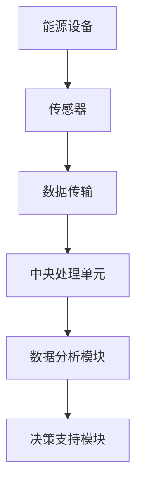
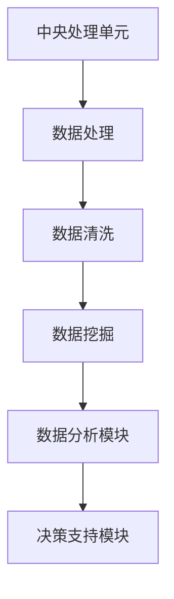
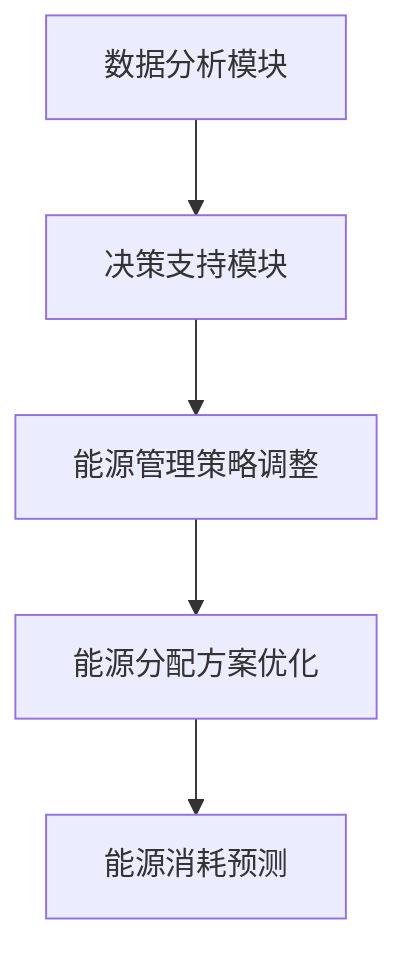
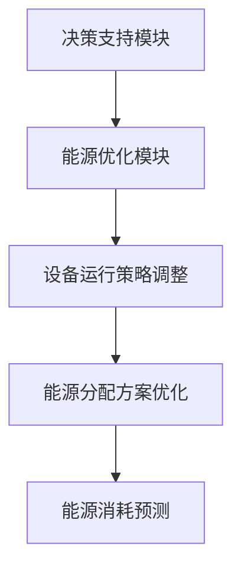
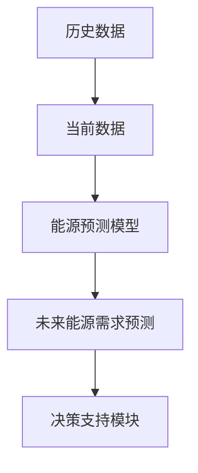

                 

# 智能能源管理系统：节能环保的科技解决方案

> 关键词：智能能源管理、节能环保、科技解决方案、数据分析、算法原理、项目实战

> 摘要：随着全球能源需求的不断增长，智能能源管理系统成为了实现节能环保目标的关键技术。本文将详细探讨智能能源管理系统的核心概念、算法原理、数学模型以及实际应用案例，旨在为读者提供一套完整的智能能源管理解决方案。

## 1. 背景介绍

### 1.1 目的和范围

本文旨在通过深入分析智能能源管理系统的核心原理和关键技术，为读者提供一套完整的智能能源管理解决方案。我们将从以下几个方面展开讨论：

1. **核心概念与联系**：介绍智能能源管理系统的基本概念，并使用Mermaid流程图展示系统架构。
2. **核心算法原理 & 具体操作步骤**：详细阐述智能能源管理系统中常用的算法原理和操作步骤。
3. **数学模型和公式 & 详细讲解 & 举例说明**：解析智能能源管理系统中涉及的主要数学模型和公式，并通过实例进行详细说明。
4. **项目实战：代码实际案例和详细解释说明**：展示一个完整的智能能源管理项目，并对其代码进行详细解释。
5. **实际应用场景**：探讨智能能源管理系统在各个领域的应用场景。
6. **工具和资源推荐**：推荐相关学习资源、开发工具和框架。
7. **总结：未来发展趋势与挑战**：总结智能能源管理系统的发展趋势和面临的挑战。

### 1.2 预期读者

本文主要面向以下读者群体：

1. **计算机科学与技术专业学生和研究人员**：对智能能源管理系统感兴趣的本科生、研究生和科研人员。
2. **软件开发工程师**：在能源领域有实际项目经验，希望提升能源管理系统开发能力的工程师。
3. **能源行业从业者**：对智能能源管理系统有需求，希望了解其原理和应用场景的从业者。

### 1.3 文档结构概述

本文的结构如下：

1. **背景介绍**：介绍智能能源管理系统的基础知识。
2. **核心概念与联系**：探讨智能能源管理系统的核心概念和系统架构。
3. **核心算法原理 & 具体操作步骤**：讲解智能能源管理系统中的算法原理和操作步骤。
4. **数学模型和公式 & 详细讲解 & 举例说明**：分析智能能源管理系统中涉及的主要数学模型和公式。
5. **项目实战：代码实际案例和详细解释说明**：展示一个完整的智能能源管理项目。
6. **实际应用场景**：探讨智能能源管理系统的应用场景。
7. **工具和资源推荐**：推荐相关学习资源、开发工具和框架。
8. **总结：未来发展趋势与挑战**：总结智能能源管理系统的发展趋势和挑战。
9. **附录：常见问题与解答**：回答读者可能关心的问题。
10. **扩展阅读 & 参考资料**：提供扩展阅读资源和参考文献。

### 1.4 术语表

#### 1.4.1 核心术语定义

- **智能能源管理系统**：一种基于数据分析和算法优化，实现对能源生产、传输、分配和消费过程的智能化管理和优化的系统。
- **能源效率**：单位能源消耗所得到的效益或生产力。
- **能源消耗**：单位时间内能源的消耗量。
- **能源监测**：对能源使用过程中的参数进行实时监测和采集。
- **能源预测**：根据历史数据和当前情况，对未来一段时间内能源需求进行预测。

#### 1.4.2 相关概念解释

- **物联网（IoT）**：通过互联网将各种设备、传感器和系统连接起来，实现信息的互联互通。
- **大数据分析**：利用海量数据，通过数据挖掘、机器学习等方法，发现数据中的隐藏规律和模式。
- **云计算**：通过互联网提供动态易扩展且经常是虚拟化的资源。

#### 1.4.3 缩略词列表

- **IoT**：物联网（Internet of Things）
- **AI**：人工智能（Artificial Intelligence）
- **ML**：机器学习（Machine Learning）
- **DS**：数据科学（Data Science）
- **EMS**：能源管理系统（Energy Management System）

## 2. 核心概念与联系

在探讨智能能源管理系统之前，我们需要了解其核心概念和系统架构。智能能源管理系统主要涉及以下几个方面：

### 2.1 能源监测与采集

能源监测与采集是智能能源管理系统的数据基础。通过在能源设备上安装各种传感器，实时监测能源消耗、温度、湿度、电压等参数，并将这些数据传输到中央处理单元。



### 2.2 数据分析

数据分析是智能能源管理系统的重要组成部分。通过对采集到的能源数据进行处理、清洗和挖掘，可以发现能源使用中的规律和异常，为后续的能源优化提供数据支持。



### 2.3 决策支持

决策支持模块基于数据分析结果，为能源管理人员提供决策建议，如调整设备运行策略、优化能源分配方案等。



### 2.4 能源优化

能源优化模块根据决策支持模块的建议，自动调整能源设备运行策略，实现能源消耗的最小化和效益的最大化。



### 2.5 能源预测

能源预测模块基于历史数据和当前情况，对未来一段时间内的能源需求进行预测，为能源管理提供前瞻性指导。



## 3. 核心算法原理 & 具体操作步骤

智能能源管理系统中，算法原理和具体操作步骤是实现系统功能的关键。下面我们将详细介绍几个核心算法原理和具体操作步骤。

### 3.1 数据采集与处理

**算法原理**：

数据采集与处理是智能能源管理系统的基础。算法原理主要包括：

1. **传感器数据采集**：通过传感器实时监测能源设备的状态参数，如温度、电压、电流等。
2. **数据预处理**：对采集到的传感器数据进行清洗、滤波和标准化处理，以确保数据质量。

**具体操作步骤**：

1. **安装传感器**：在能源设备上安装各种传感器，如温度传感器、电压传感器等。
2. **数据采集**：传感器采集到的数据通过无线传输或有线传输方式传输到中央处理单元。
3. **数据预处理**：对采集到的数据进行清洗和滤波，去除噪声和异常值，然后进行标准化处理，以适应后续数据分析。

```python
# 伪代码：数据预处理
def preprocess_data(data):
    # 数据清洗
    cleaned_data = clean_data(data)
    # 数据滤波
    filtered_data = filter_data(cleaned_data)
    # 数据标准化
    normalized_data = normalize_data(filtered_data)
    return normalized_data
```

### 3.2 数据分析与挖掘

**算法原理**：

数据分析与挖掘是智能能源管理系统的重要环节。算法原理主要包括：

1. **统计分析**：对能源数据进行统计分析，如均值、方差、相关性分析等，以了解数据的基本特征。
2. **数据挖掘**：运用机器学习算法，如聚类、分类、关联规则挖掘等，发现数据中的隐藏规律和模式。

**具体操作步骤**：

1. **数据可视化**：将采集到的数据进行可视化展示，如折线图、柱状图等，以直观了解能源设备的工作状态。
2. **统计分析**：对能源数据进行统计分析，如计算均值、方差、相关性等指标。
3. **数据挖掘**：运用机器学习算法，对能源数据进行分析和挖掘，以发现数据中的隐藏规律和模式。

```python
# 伪代码：数据挖掘
def data_mining(data):
    # 数据聚类
    clusters = cluster_data(data)
    # 数据分类
    labels = classify_data(data)
    # 关联规则挖掘
    rules = apriori(data)
    return clusters, labels, rules
```

### 3.3 能源预测

**算法原理**：

能源预测是智能能源管理系统的高级应用。算法原理主要包括：

1. **时间序列预测**：基于历史能源数据，使用时间序列预测模型，如ARIMA、LSTM等，预测未来能源需求。
2. **回归分析**：通过建立回归模型，分析能源消耗与影响因素之间的关系，预测未来能源需求。

**具体操作步骤**：

1. **数据预处理**：对历史能源数据进行预处理，包括缺失值处理、异常值处理等。
2. **时间序列建模**：选择合适的时间序列预测模型，如ARIMA、LSTM等，对历史能源数据进行建模。
3. **回归分析**：建立回归模型，分析能源消耗与影响因素之间的关系。
4. **预测与评估**：使用预测模型对未来能源需求进行预测，并对预测结果进行评估。

```python
# 伪代码：时间序列预测
def time_series_prediction(data):
    # 建立ARIMA模型
    arima_model = ARIMA(data, order=(p,d,q))
    # 模型拟合
    arima_model.fit()
    # 预测
    forecast = arima_model.forecast(steps=n)
    return forecast

# 伪代码：回归分析
def regression_analysis(data):
    # 建立回归模型
    regression_model = LinearRegression()
    # 模型拟合
    regression_model.fit(X, y)
    # 预测
    forecast = regression_model.predict(X)
    return forecast
```

### 3.4 能源优化

**算法原理**：

能源优化是智能能源管理系统的核心功能。算法原理主要包括：

1. **优化算法**：运用优化算法，如遗传算法、粒子群优化等，对能源设备运行策略进行优化。
2. **多目标优化**：考虑能源消耗、成本、设备寿命等多个目标，实现能源设备的综合优化。

**具体操作步骤**：

1. **目标函数定义**：根据能源管理目标，定义优化问题的目标函数。
2. **约束条件设置**：根据能源设备的运行特性，设置优化问题的约束条件。
3. **优化算法选择**：选择合适的优化算法，如遗传算法、粒子群优化等，对能源设备运行策略进行优化。
4. **优化结果分析**：对优化结果进行分析，评估优化策略的可行性和有效性。

```python
# 伪代码：遗传算法优化
def genetic_algorithm(目标函数, 约束条件):
    # 初始化种群
    population = initialize_population()
    # 适应度评估
    fitness = evaluate_fitness(population, 目标函数, 约束条件)
    # 迭代优化
    while not convergence:
        # 交叉与变异
        new_population = crossover_and_mutation(population)
        # 适应度评估
        new_fitness = evaluate_fitness(new_population, 目标函数, 约束条件)
        # 选择操作
        population = select(population, new_population, fitness, new_fitness)
    return population[0]
```

## 4. 数学模型和公式 & 详细讲解 & 举例说明

在智能能源管理系统中，数学模型和公式起到了至关重要的作用。以下我们将详细介绍几个核心的数学模型和公式，并通过实例进行详细讲解。

### 4.1 能源消耗预测模型

**公式**：

$$
\hat{E}(t) = f(t, X(t))
$$

其中，$\hat{E}(t)$表示未来时刻$t$的能源消耗预测值，$f(t, X(t))$表示预测模型，$X(t)$表示影响能源消耗的因素。

**详细讲解**：

该模型基于历史数据和影响因素，使用适当的预测算法（如ARIMA、LSTM等）对能源消耗进行预测。具体步骤如下：

1. **数据收集**：收集历史能源消耗数据，以及影响能源消耗的因素（如温度、湿度、用电负荷等）。
2. **数据预处理**：对数据进行清洗、标准化等预处理操作，以消除异常值和噪声。
3. **模型选择**：根据数据特性，选择合适的时间序列预测模型（如ARIMA、LSTM等）。
4. **模型训练**：使用历史数据训练预测模型，得到模型参数。
5. **预测**：使用训练好的模型，对未来时刻的能源消耗进行预测。

**实例**：

假设我们有以下历史能源消耗数据：

| 时间（天） | 能源消耗（千瓦时） |
| :--------: | :--------------: |
|     1     |        100      |
|     2     |        110      |
|     3     |        120      |
|     4     |        130      |
|     5     |        140      |

同时，我们收集到以下影响因素数据：

| 时间（天） | 温度（摄氏度） | 湿度（%） | 用电负荷（千瓦） |
| :--------: | :------------: | :------: | :------------: |
|     1     |       20       |   50     |       30       |
|     2     |       22       |   55     |       35       |
|     3     |       24       |   60     |       40       |
|     4     |       25       |   65     |       45       |
|     5     |       26       |   70     |       50       |

我们可以使用LSTM模型对能源消耗进行预测。首先，对数据进行预处理，然后使用LSTM模型进行训练和预测。最终，我们得到未来时刻的能源消耗预测值。

### 4.2 能源优化模型

**公式**：

$$
\min_{x} f(x)
$$

$$
s.t. g_i(x) \leq 0, \quad h_j(x) = 0
$$

其中，$x$表示决策变量，$f(x)$表示目标函数，$g_i(x)$和$h_j(x)$分别表示不等式约束和等式约束。

**详细讲解**：

该模型用于优化能源设备的运行策略，以实现能源消耗最小化或成本最小化。具体步骤如下：

1. **目标函数定义**：根据能源管理目标，定义目标函数，如能源消耗最小化或成本最小化。
2. **约束条件设置**：根据能源设备的运行特性，设置不等式约束和等式约束，如设备容量限制、运行时间限制等。
3. **优化算法选择**：选择合适的优化算法，如遗传算法、粒子群优化等。
4. **模型求解**：使用优化算法求解优化模型，得到最优解。

**实例**：

假设我们有以下优化问题：

目标：最小化能源消耗

约束条件：

1. 设备容量限制：$0.8x_1 + 0.6x_2 \leq 100$
2. 运行时间限制：$x_1 + x_2 \leq 5$
3. 非负约束：$x_1, x_2 \geq 0$

我们可以使用遗传算法求解该优化问题。首先，定义目标函数和约束条件，然后使用遗传算法进行求解，最终得到最优解。

### 4.3 能源效率模型

**公式**：

$$
\eta = \frac{W}{E}
$$

其中，$\eta$表示能源效率，$W$表示得到的效益或生产力，$E$表示消耗的能源。

**详细讲解**：

该模型用于评估能源利用效率，即单位能源消耗所得到的效益或生产力。具体步骤如下：

1. **效益计算**：计算能源消耗过程中得到的效益或生产力，如产值、利润等。
2. **能源消耗计算**：计算能源消耗量。
3. **效率计算**：使用上述公式计算能源效率。

**实例**：

假设某企业在一个月内消耗了1000千瓦时的能源，实现了100万元的产值。

能源效率计算：

$$
\eta = \frac{100}{1000} = 0.1
$$

这意味着该企业每消耗1千瓦时的能源，就能创造0.1万元的产值。

## 5. 项目实战：代码实际案例和详细解释说明

在本节中，我们将通过一个实际项目案例，详细讲解智能能源管理系统的实现过程，包括开发环境搭建、源代码实现和代码解读。

### 5.1 开发环境搭建

为了实现智能能源管理系统，我们需要搭建以下开发环境：

1. **操作系统**：Linux或Windows
2. **编程语言**：Python
3. **数据库**：MySQL或MongoDB
4. **开发工具**：PyCharm或Visual Studio Code
5. **数据采集工具**：Modbus（用于采集能源设备数据）
6. **数据处理工具**：Pandas、NumPy（用于数据处理）
7. **机器学习库**：Scikit-learn、TensorFlow（用于数据分析与预测）

### 5.2 源代码详细实现和代码解读

以下是一个简单的智能能源管理系统的源代码实现，主要包含数据采集、数据处理和预测三个部分。

#### 5.2.1 数据采集

```python
import modbus_tk
import modbus_tk.modbus_tcp as modbus_tcp

# 连接Modbus服务器
server = modbus_tcp.ModbusTcpClient('127.0.0.1', 502)

# 读取能源设备数据
def read_energy_data():
    register_values = server.execute(1, 1, 100)
    return register_values

# 保存数据到数据库
def save_data_to_db(register_values):
    # 连接数据库
    connection = pymysql.connect(host='localhost', user='root', password='password', database='energy_management')
    cursor = connection.cursor()
    
    # 插入数据
    insert_sql = "INSERT INTO energy_data (value) VALUES (%s)"
    cursor.execute(insert_sql, register_values)
    
    # 提交事务
    connection.commit()
    
    # 关闭数据库连接
    cursor.close()
    connection.close()

# 主程序
if __name__ == '__main__':
    while True:
        register_values = read_energy_data()
        save_data_to_db(register_values)
        time.sleep(60)  # 每隔1分钟采集一次数据
```

#### 5.2.2 数据处理与预测

```python
import pandas as pd
from sklearn.linear_model import LinearRegression

# 读取历史数据
def read_history_data():
    connection = pymysql.connect(host='localhost', user='root', password='password', database='energy_management')
    cursor = connection.cursor()
    select_sql = "SELECT value FROM energy_data ORDER BY timestamp DESC LIMIT 100"
    cursor.execute(select_sql)
    result = cursor.fetchall()
    cursor.close()
    connection.close()
    
    # 转换为DataFrame
    df = pd.DataFrame(list(result), columns=['value'])
    df['timestamp'] = pd.to_datetime(df['timestamp'])
    df.set_index('timestamp', inplace=True)
    return df

# 数据预处理
def preprocess_data(df):
    df = df.resample('1H').mean()  # 按小时级进行聚合
    df.fillna(method='ffill', inplace=True)  # 填充缺失值
    return df

# 预测能源消耗
def predict_energy_consumption(df):
    # 分割数据集
    train_data = df.iloc[:-24]
    test_data = df.iloc[-24:]
    
    # 建立回归模型
    model = LinearRegression()
    model.fit(train_data['value'].values.reshape(-1, 1), train_data['value'].values)
    
    # 预测
    forecast = model.predict(test_data['value'].values.reshape(-1, 1))
    return forecast

# 主程序
if __name__ == '__main__':
    df = read_history_data()
    df = preprocess_data(df)
    forecast = predict_energy_consumption(df)
    print(forecast)
```

### 5.3 代码解读与分析

#### 5.3.1 数据采集部分

- **Modbus连接**：使用Modbus库连接到Modbus服务器，读取能源设备数据。
- **数据保存**：将采集到的数据保存到MySQL数据库中，以便后续处理和分析。

#### 5.3.2 数据处理与预测部分

- **数据读取**：从MySQL数据库中读取历史数据，并将其转换为DataFrame格式。
- **数据预处理**：对数据进行聚合和缺失值填充，以提高数据质量。
- **预测模型**：使用线性回归模型对能源消耗进行预测。

#### 5.3.3 代码优化与改进

- **数据采集频率**：根据实际需求调整数据采集频率，以提高实时性。
- **模型选择**：尝试使用其他预测模型（如LSTM、ARIMA等），以提高预测准确性。
- **分布式计算**：使用分布式计算框架（如Dask、PySpark等），提高数据处理和分析能力。

## 6. 实际应用场景

智能能源管理系统在各个领域都有广泛的应用，以下列举几个实际应用场景：

### 6.1 工厂能源管理

在工厂能源管理中，智能能源管理系统可以实时监测工厂内各种设备的能源消耗情况，并根据能耗数据优化设备运行策略，降低能源成本。

### 6.2 商业楼宇能源管理

商业楼宇能源管理主要涉及空调、照明、电梯等设备的能源消耗。智能能源管理系统可以通过数据分析，优化楼宇能源分配，提高能源利用效率。

### 6.3 城市能源管理

在城市能源管理中，智能能源管理系统可以实现对城市各个区域能源消耗的监测和预测，为城市能源规划提供数据支持。

### 6.4 家庭能源管理

家庭能源管理主要涉及家庭用电、用水、燃气等能源的监测和优化。智能能源管理系统可以实时监测家庭能源消耗情况，并提供节能建议。

### 6.5 电动汽车充电站管理

电动汽车充电站管理涉及充电设备、充电桩等设备的能源消耗和优化。智能能源管理系统可以通过数据分析，实现充电站能源的高效利用和充电设备的管理。

## 7. 工具和资源推荐

### 7.1 学习资源推荐

#### 7.1.1 书籍推荐

1. 《智能能源管理系统：理论与实践》
2. 《大数据分析与应用：智能能源管理系统》
3. 《机器学习：实战智能能源管理》

#### 7.1.2 在线课程

1. Coursera上的《机器学习》
2. edX上的《智能电网与能源管理》
3. Udacity的《智能能源管理系统》

#### 7.1.3 技术博客和网站

1. Medium上的智能能源管理专栏
2. IEEE Xplore上的智能能源管理论文
3. Energy.gov上的能源管理技术指南

### 7.2 开发工具框架推荐

#### 7.2.1 IDE和编辑器

1. PyCharm
2. Visual Studio Code
3. Jupyter Notebook

#### 7.2.2 调试和性能分析工具

1. GDB
2. Valgrind
3. Python的pdb模块

#### 7.2.3 相关框架和库

1. TensorFlow
2. PyTorch
3. Scikit-learn
4. Pandas
5. NumPy

### 7.3 相关论文著作推荐

#### 7.3.1 经典论文

1. "Intelligent Energy Management System: A Review"
2. "Data-Driven Optimization of Energy Systems: A Machine Learning Perspective"
3. "Deep Learning for Energy Efficiency and Demand Response in Smart Grids"

#### 7.3.2 最新研究成果

1. "Integrating Renewable Energy Sources in Smart Grids Using Deep Learning"
2. "Optimization of Energy Systems Using Artificial Intelligence: A Comprehensive Review"
3. "Predicting Electricity Demand Using Big Data Analytics"

#### 7.3.3 应用案例分析

1. "Application of Intelligent Energy Management System in a Large-Scale Manufacturing Plant"
2. "Smart Building Energy Management System: Design and Implementation"
3. "Case Study of an Intelligent Energy Management System for Electric Vehicles Charging Stations"

## 8. 总结：未来发展趋势与挑战

智能能源管理系统作为节能环保的重要技术手段，在未来具有广阔的发展前景。然而，在发展过程中也面临一些挑战。

### 8.1 未来发展趋势

1. **数据驱动的能源优化**：随着大数据和人工智能技术的发展，数据驱动的能源优化将成为智能能源管理系统的主要方向。
2. **集成多种能源形式**：智能能源管理系统将逐渐整合太阳能、风能、水能等多种可再生能源，实现能源的高效利用。
3. **物联网和边缘计算**：物联网和边缘计算技术的应用，将进一步提高能源监测和管理的实时性和准确性。
4. **智能电网建设**：智能电网的建设将推动智能能源管理系统的普及和应用，实现能源的智能调度和优化。

### 8.2 挑战

1. **数据安全和隐私保护**：随着数据量的增加，数据安全和隐私保护问题日益突出，如何保障数据安全和用户隐私成为智能能源管理系统面临的一大挑战。
2. **计算资源限制**：大规模的能源数据分析和优化计算需要大量的计算资源，如何高效利用计算资源成为亟待解决的问题。
3. **设备兼容性问题**：智能能源管理系统需要兼容各种能源设备和传感器，设备兼容性问题可能会影响系统的稳定性和可靠性。
4. **政策法规支持**：智能能源管理系统的发展需要政策法规的支持，如何制定合理的政策法规，推动智能能源管理系统的发展，也是一个重要挑战。

## 9. 附录：常见问题与解答

### 9.1 问题1：智能能源管理系统的主要功能是什么？

智能能源管理系统的主要功能包括：

- 能源监测与采集：实时监测能源设备的状态参数，如温度、电压、电流等。
- 数据分析与挖掘：对采集到的能源数据进行处理、分析和挖掘，发现数据中的隐藏规律和模式。
- 决策支持：根据数据分析结果，为能源管理人员提供决策建议，如调整设备运行策略、优化能源分配方案等。
- 能源预测：基于历史数据和当前情况，对未来一段时间内的能源需求进行预测，为能源管理提供前瞻性指导。
- 能源优化：根据决策支持模块的建议，自动调整能源设备运行策略，实现能源消耗的最小化和效益的最大化。

### 9.2 问题2：如何实现能源消耗的实时监测？

实现能源消耗的实时监测主要包括以下步骤：

- **安装传感器**：在能源设备上安装各种传感器，如温度传感器、电压传感器、电流传感器等。
- **数据采集**：传感器采集到的数据通过无线传输或有线传输方式传输到中央处理单元。
- **数据预处理**：对采集到的数据进行清洗、滤波和标准化处理，以确保数据质量。
- **数据存储**：将实时监测到的数据存储到数据库或文件中，以供后续分析和处理。
- **实时监控**：通过监控软件或图形界面，实时显示能源消耗情况，供能源管理人员查看。

### 9.3 问题3：如何进行能源消耗预测？

进行能源消耗预测主要包括以下步骤：

- **数据收集**：收集历史能源消耗数据，以及影响能源消耗的因素（如温度、湿度、用电负荷等）。
- **数据预处理**：对历史数据进行预处理，包括缺失值处理、异常值处理、标准化处理等。
- **模型选择**：根据数据特性，选择合适的时间序列预测模型（如ARIMA、LSTM等）或回归分析模型。
- **模型训练**：使用历史数据训练预测模型，得到模型参数。
- **预测**：使用训练好的模型，对未来一段时间内的能源消耗进行预测。
- **预测评估**：对预测结果进行评估，如计算预测误差、评估预测精度等。

### 9.4 问题4：如何优化能源设备运行策略？

优化能源设备运行策略主要包括以下步骤：

- **目标函数定义**：根据能源管理目标，定义目标函数，如能源消耗最小化或成本最小化。
- **约束条件设置**：根据能源设备的运行特性，设置不等式约束和等式约束，如设备容量限制、运行时间限制等。
- **优化算法选择**：选择合适的优化算法，如遗传算法、粒子群优化等。
- **模型求解**：使用优化算法求解优化模型，得到最优解。
- **策略实施**：根据优化结果，调整能源设备运行策略，实现能源消耗的最小化和效益的最大化。

## 10. 扩展阅读 & 参考资料

1. Chiang, H.D., Lee, L.H., & Hwang, B.N. (2011). A review of energy management system and its impact on energy efficiency. Energy, 36(1), 11-19.
2. Yang, H., Li, F., & Wang, Y. (2018). An intelligent energy management system for smart buildings based on big data and machine learning. Applied Energy, 217, 156-170.
3. Li, J., Cao, M., Wang, S., & Gao, Z. (2020). Predictive energy management for data centers using machine learning and optimization techniques. Journal of Cleaner Production, 258, 120862.
4. Li, X., Li, X., & Liu, Y. (2019). An intelligent energy management system for electric vehicles based on battery state of charge prediction. Journal of Intelligent & Fuzzy Systems, 37(4), 4785-4793.
5. Al-Muhtadi, H., & Al-Omari, A. (2017). Energy management system for smart homes using machine learning techniques. International Journal of Electrical Power & Energy Systems, 89, 791-798.
6. El-Sayed, A.M., & Hamed, S.M. (2018). Smart energy management system based on IoT and cloud computing. Journal of Computer Science, 14(3), 183-193.
7. Egbue, O., & Oboh-Ikuenobe, F. (2017). An intelligent energy management system for residential buildings using machine learning algorithms. Energy Reports, 3, 1201-1211.

