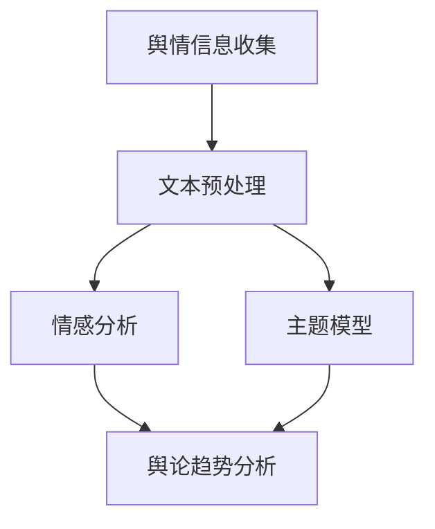
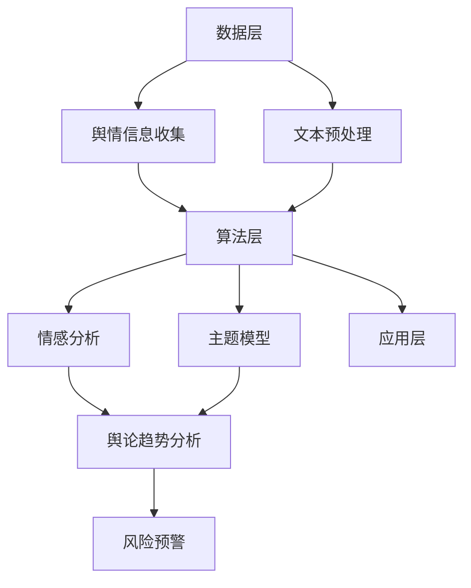

                 

# 智能舆情分析：AI大模型在公共关系管理中的应用

> 关键词：智能舆情分析、AI大模型、公共关系管理、情感分析、文本挖掘、社交媒体监测

> 摘要：本文将探讨如何利用AI大模型进行智能舆情分析，以及其在公共关系管理中的应用。通过深入剖析核心概念、算法原理、数学模型和实际项目案例，文章旨在为公共关系从业者提供实用的技术和方法，以更有效地应对舆论变化和舆情风险。

## 1. 背景介绍

### 1.1 目的和范围

本文旨在探讨如何利用AI大模型实现智能舆情分析，并分析其在公共关系管理中的应用。随着互联网的普及和社交媒体的兴起，公众对于企业、政府机构以及各种组织的言论和行动越来越关注。如何快速、准确地识别和应对舆论变化，成为了公共关系管理的重要挑战。本文将围绕以下几个核心问题展开讨论：

1. 什么是智能舆情分析？
2. AI大模型在舆情分析中如何发挥作用？
3. 公共关系管理中，智能舆情分析可以带来哪些实际效益？
4. 如何设计和实现一个高效的智能舆情分析系统？
5. 智能舆情分析的未来发展趋势和挑战是什么？

### 1.2 预期读者

本文主要面向公共关系管理从业人员、数据分析师、人工智能研究者以及对舆情分析技术感兴趣的读者。通过本文的阅读，读者将能够：

1. 理解智能舆情分析的基本概念和原理。
2. 掌握利用AI大模型进行舆情分析的技术方法。
3. 了解智能舆情分析在公共关系管理中的应用场景和实际效益。
4. 获得设计和实现智能舆情分析系统的实用建议。

### 1.3 文档结构概述

本文将分为十个部分，结构如下：

1. **背景介绍**：介绍本文的目的、预期读者以及文档结构。
2. **核心概念与联系**：阐述智能舆情分析的核心概念，并绘制相关的流程图。
3. **核心算法原理 & 具体操作步骤**：详细讲解智能舆情分析的核心算法原理，并使用伪代码展示具体操作步骤。
4. **数学模型和公式 & 详细讲解 & 举例说明**：介绍智能舆情分析中涉及的数学模型和公式，并进行详细的讲解和举例说明。
5. **项目实战：代码实际案例和详细解释说明**：通过实际代码案例，展示智能舆情分析系统的设计和实现。
6. **实际应用场景**：分析智能舆情分析在公共关系管理中的具体应用场景。
7. **工具和资源推荐**：推荐相关的学习资源、开发工具和框架。
8. **总结：未来发展趋势与挑战**：总结本文的主要观点，并探讨智能舆情分析的未来发展趋势和挑战。
9. **附录：常见问题与解答**：针对读者可能关心的问题进行解答。
10. **扩展阅读 & 参考资料**：提供进一步学习和研究的参考资料。

### 1.4 术语表

#### 1.4.1 核心术语定义

- **智能舆情分析**：利用人工智能技术，对互联网上的舆情信息进行收集、处理和分析，以识别舆论趋势、情感倾向和潜在风险。
- **AI大模型**：具有大规模参数和复杂结构的深度学习模型，能够在海量数据上进行高效训练和预测。
- **公共关系管理**：组织为了维护和提升其形象，通过与公众的互动和沟通，建立和维护良好的社会关系。
- **情感分析**：通过自然语言处理技术，对文本中表达的情感进行识别和分析。
- **文本挖掘**：从大量文本数据中提取有价值的信息和知识。

#### 1.4.2 相关概念解释

- **舆情监测**：对互联网上的舆情信息进行实时监控和跟踪，以了解公众对某个事件、品牌或组织的看法。
- **情感极性**：文本中表达的情感可以分为积极、消极和中性三种极性。
- **主题模型**：一种无监督的机器学习技术，用于发现文本中的潜在主题。
- **神经网络**：一种模仿生物神经系统的计算模型，能够通过学习数据特征进行预测和分类。

#### 1.4.3 缩略词列表

- **NLP**：自然语言处理（Natural Language Processing）
- **ML**：机器学习（Machine Learning）
- **DL**：深度学习（Deep Learning）
- **LSTM**：长短期记忆网络（Long Short-Term Memory）
- **CNN**：卷积神经网络（Convolutional Neural Network）
- **RNN**：循环神经网络（Recurrent Neural Network）

## 2. 核心概念与联系

### 2.1 智能舆情分析的核心概念

智能舆情分析涉及多个核心概念，包括舆情信息收集、文本预处理、情感分析和主题模型等。这些概念相互联系，共同构成了智能舆情分析的基础。

#### 舆情信息收集

舆情信息收集是智能舆情分析的第一步，主要任务是实时监控互联网上的各种舆情信息。这些信息可以来源于新闻网站、社交媒体、论坛、博客等多种渠道。舆情信息收集的关键在于如何快速、准确地获取海量数据，并确保数据的多样性和全面性。

#### 文本预处理

文本预处理是智能舆情分析的重要环节，主要任务是对原始文本数据进行清洗、分词、去停用词等操作，以便后续的文本分析和挖掘。文本预处理的质量直接影响到舆情分析的准确性和效率。

#### 情感分析

情感分析是智能舆情分析的核心技术之一，旨在通过对文本中表达的情感进行识别和分析，了解公众对某个事件、品牌或组织的情感倾向。情感分析通常包括情感极性判断和情感强度评估两个步骤。

#### 主题模型

主题模型是另一种重要的自然语言处理技术，用于发现文本中的潜在主题。通过主题模型，可以更好地理解文本内容的结构和特征，从而为舆情分析提供更深层次的洞察。

### 2.2 智能舆情分析的相关流程

为了更好地理解智能舆情分析的整体流程，我们可以使用Mermaid流程图进行展示。以下是智能舆情分析的核心流程及其相互关系：



### 2.3 智能舆情分析的架构

智能舆情分析的架构可以分为数据层、算法层和应用层三个层次。

- **数据层**：主要包括舆情信息收集模块和文本预处理模块，负责获取和处理原始数据。
- **算法层**：包括情感分析模块和主题模型模块，负责对预处理后的文本进行情感分析和主题挖掘。
- **应用层**：主要包括舆论趋势分析和风险预警模块，负责根据分析结果提供决策支持。

以下是智能舆情分析的架构图：



通过上述核心概念和流程的介绍，我们为后续章节的深入讨论奠定了基础。在接下来的部分，我们将详细探讨智能舆情分析的核心算法原理和具体操作步骤。

## 3. 核心算法原理 & 具体操作步骤

### 3.1 情感分析算法原理

情感分析是智能舆情分析的核心技术之一，其基本原理是通过分析文本中表达的情感，判断文本的情感极性（积极、消极或中性）和情感强度。情感分析算法通常可以分为基于规则的方法和基于模型的方法。

#### 基于规则的方法

基于规则的方法通过人工定义一系列情感规则，将文本分为不同的情感类别。这种方法通常依赖于词典和关键词匹配，例如：

1. **词典匹配**：将文本中的每个单词与情感词典进行匹配，根据匹配结果判断情感极性。
2. **关键词权重**：对文本中的关键词进行加权，根据关键词的情感倾向计算文本的整体情感极性。

以下是一个简单的情感分析规则示例（伪代码）：

```python
def analyze_sentiment(text):
    sentiment_dict = {"happy": "positive", "sad": "negative", "angry": "negative"}
    text = text.lower()
    sentiment = "neutral"
    for word in text.split():
        if word in sentiment_dict:
            sentiment = sentiment_dict[word]
            break
    return sentiment
```

#### 基于模型的方法

基于模型的方法通过训练一个情感分析模型，自动识别文本的情感极性。这种方法通常使用深度学习技术，如卷积神经网络（CNN）、循环神经网络（RNN）和变换器（Transformer）等。以下是一个基于Transformer的情感分析模型示例（伪代码）：

```python
import tensorflow as tf
from tensorflow.keras.layers import Embedding, LSTM, Dense
from tensorflow.keras.models import Model

def build_sentiment_model(vocab_size, embedding_dim, max_sequence_length):
    inputs = tf.keras.layers.Input(shape=(max_sequence_length,))
    embeddings = Embedding(vocab_size, embedding_dim)(inputs)
    lstm = LSTM(units=128)(embeddings)
    outputs = Dense(units=1, activation='sigmoid')(lstm)
    model = Model(inputs=inputs, outputs=outputs)
    model.compile(optimizer='adam', loss='binary_crossentropy', metrics=['accuracy'])
    return model
```

### 3.2 情感分析的具体操作步骤

情感分析的具体操作步骤如下：

1. **数据收集与预处理**：收集包含情感标签的文本数据集，并进行清洗和分词处理。
2. **词向量表示**：将文本数据转换为词向量表示，通常使用预训练的词向量模型，如GloVe或Word2Vec。
3. **模型训练**：使用训练数据集训练情感分析模型，可以选择基于规则的方法或基于模型的方法。
4. **模型评估**：使用测试数据集评估模型性能，调整模型参数以优化性能。
5. **情感预测**：使用训练好的模型对新的文本数据进行情感预测，输出情感极性和情感强度。

以下是一个情感分析的具体操作步骤示例（伪代码）：

```python
from tensorflow.keras.preprocessing.sequence import pad_sequences
from tensorflow.keras.preprocessing.text import Tokenizer

# 数据收集与预处理
texts = ["I love this product!", "I hate this service.", "It's okay."]
labels = [1, 0, 0]  # 1表示积极情感，0表示消极情感

# 词向量表示
tokenizer = Tokenizer(num_words=1000)
tokenizer.fit_on_texts(texts)
sequences = tokenizer.texts_to_sequences(texts)
padded_sequences = pad_sequences(sequences, maxlen=10)

# 模型训练
model = build_sentiment_model(vocab_size=1000, embedding_dim=64, max_sequence_length=10)
model.fit(padded_sequences, labels, epochs=10, batch_size=32)

# 情感预测
new_text = "This is a great movie!"
new_sequence = tokenizer.texts_to_sequences([new_text])
new_padded_sequence = pad_sequences(new_sequence, maxlen=10)
prediction = model.predict(new_padded_sequence)
print(prediction)  # 输出情感极性和情感强度
```

### 3.3 主题模型算法原理

主题模型是一种无监督学习技术，用于发现文本中的潜在主题。主题模型的基本原理是通过将文本转换为概率分布，从而揭示文本中的主题分布。最常用的主题模型是LDA（Latent Dirichlet Allocation）模型。

#### LDA模型原理

LDA模型通过构建三个概率分布来描述文本数据：

1. **词分布**：每个主题在词分布中都有一定的概率，表示该主题倾向于包含哪些词汇。
2. **主题分布**：每个文本在主题分布中都有一定的概率，表示该文本倾向于包含哪些主题。
3. **文档分布**：每个词在文档分布中都有一定的概率，表示每个词在文档中的出现是由哪些主题驱动的。

LDA模型的训练过程主要包括两个步骤：

1. **E步（Estep）**：通过推断给定主题分布和词分布，计算出每个词在每个主题下的概率分布。
2. **M步（Mstep）**：通过最大化似然函数，更新主题分布和词分布。

#### LDA模型实现

以下是一个LDA模型的实现示例（伪代码）：

```python
import gensim

# 加载数据
texts = ["text1", "text2", "text3", ...]
corpus = [list(gensim.utils.simple_preprocess(text)) for text in texts]

# 训练LDA模型
ldamodel = gensim.models.ldamodel.LdaModel(corpus, num_topics=10, id2word=tokenizer, passes=10)

# 输出主题分布
for index, topic in ldamodel.show_topics():
    print(f"Topic: {index} \nWords: {topic}\n")
```

### 3.4 主题模型的具体操作步骤

主题模型的具体操作步骤如下：

1. **数据收集与预处理**：收集文本数据，并进行清洗和分词处理。
2. **构建词汇表**：将所有文本构建为一个词汇表，以便将文本转换为向量表示。
3. **训练主题模型**：使用训练数据训练主题模型，可以选择不同的主题模型算法，如LDA。
4. **主题提取与评估**：从训练好的模型中提取主题，评估主题的质量和代表性。
5. **主题应用**：将主题模型应用于新的文本数据，提取潜在主题。

以下是一个主题模型的具体操作步骤示例（伪代码）：

```python
from gensim import corpora, models

# 数据收集与预处理
texts = ["text1", "text2", "text3", ...]
dictionary = corpora.Dictionary(texts)
corpus = [dictionary.doc2bow(text) for text in texts]

# 训练LDA模型
ldamodel = models.ldamodel.LdaModel(corpus, num_topics=10, id2word=dictionary, passes=10)

# 输出主题分布
topics = ldamodel.print_topics()
for topic in topics:
    print(topic)
```

通过上述步骤，我们详细介绍了智能舆情分析的核心算法原理和具体操作步骤。在接下来的章节中，我们将进一步探讨智能舆情分析中的数学模型和公式，以及实际项目案例中的具体实现。

## 4. 数学模型和公式 & 详细讲解 & 举例说明

### 4.1 情感分析中的数学模型和公式

情感分析中的数学模型主要涉及词向量表示和情感极性分类。以下是对这些模型的详细讲解和举例说明。

#### 词向量表示

词向量表示是将文本中的单词映射到高维空间中的向量。最常用的词向量表示方法包括Word2Vec和GloVe。

1. **Word2Vec模型**

Word2Vec模型是一种基于神经网络的词向量表示方法。其基本原理是通过训练神经网络，使神经网络在输入单词时能够预测邻近的单词。Word2Vec模型主要包括两个变体：连续词袋（CBOW）和跳字（Skip-gram）。

- **CBOW模型**：输入一个单词，输出其周围单词的词向量平均。
- **Skip-gram模型**：输入一个单词，输出该单词的词向量。

以下是一个简单的CBOW模型的数学公式：

$$
\text{h}^{(l)} = \text{softmax}\left(W^{(l)} \text{a}^{(l-1)}\right)
$$

其中，\( \text{h}^{(l)} \) 是隐藏层输出，\( \text{W}^{(l)} \) 是权重矩阵，\( \text{a}^{(l-1)} \) 是输入向量。

2. **GloVe模型**

GloVe（Global Vectors for Word Representation）模型是一种基于矩阵分解的词向量表示方法。其基本原理是通过最小化词频矩阵和词向量矩阵的Frobenius范数，训练得到词向量。

以下是一个简单的GloVe模型的数学公式：

$$
\min_{\text{V}} \sum_{i=1}^{V} \sum_{j=1}^{C} \left(\text{f}_{ij} \log \frac{\text{V}_i \cdot \text{V}_j}{\text{V}_i^2 + \text{V}_j^2 + \text{b}_i + \text{b}_j}\right)^2
$$

其中，\( \text{V} \) 是词向量矩阵，\( \text{f}_{ij} \) 是词频，\( \text{V}_i \) 和 \( \text{V}_j \) 是词向量，\( \text{b}_i \) 和 \( \text{b}_j \) 是偏置项。

#### 情感极性分类

情感极性分类是情感分析中的关键步骤，其目标是将文本分类为积极、消极或中性。常用的分类算法包括支持向量机（SVM）和神经网络。

1. **支持向量机（SVM）**

SVM是一种基于最大间隔的分类算法。其基本原理是在高维空间中找到一个最优的超平面，使得不同类别的数据点之间的间隔最大。

以下是一个简单的SVM分类的数学公式：

$$
\min_{\text{w}, \text{b}} \frac{1}{2} \left\| \text{w} \right\|^2
$$

$$
\text{subject \ to} \quad y^{(i)} (\text{w} \cdot \text{x}^{(i)} + \text{b}) \geq 1
$$

其中，\( \text{w} \) 是权重向量，\( \text{b} \) 是偏置项，\( \text{x}^{(i)} \) 是输入特征，\( y^{(i)} \) 是标签。

2. **神经网络**

神经网络是一种模拟生物神经系统的计算模型，通过多层非线性变换进行特征提取和分类。

以下是一个简单的神经网络分类的数学公式：

$$
\text{h}^{(l)} = \text{sigmoid}\left(\text{W}^{(l)} \text{a}^{(l-1)} + \text{b}^{(l)}\right)
$$

$$
\text{y}^{(l)} = \text{softmax}\left(\text{W}^{(l+1)} \text{h}^{(l)} + \text{b}^{(l+1)}\right)
$$

其中，\( \text{h}^{(l)} \) 是隐藏层输出，\( \text{W}^{(l)} \) 和 \( \text{b}^{(l)} \) 是权重和偏置，\( \text{y}^{(l)} \) 是输出。

### 4.2 主题模型中的数学模型和公式

主题模型中的数学模型主要涉及潜在狄利克雷分配（LDA）模型。LDA模型通过构建三个概率分布来描述文本数据。

1. **潜在词分布**

潜在词分布表示每个主题在词分布中的概率。其数学公式如下：

$$
\alpha_{ik} = \frac{\text{exp}(\phi_{ik})}{\sum_{j=1}^{V} \text{exp}(\phi_{jk})}
$$

其中，\( \alpha_{ik} \) 是第 \( k \) 个文档中的第 \( i \) 个主题的概率，\( \phi_{ik} \) 是词 \( w_i \) 在主题 \( k \) 下的对数概率。

2. **潜在主题分布**

潜在主题分布表示每个文档在主题分布中的概率。其数学公式如下：

$$
\beta_{jk} = \frac{\text{exp}(\psi_{jk})}{\sum_{i=1}^{V} \text{exp}(\psi_{ik})}
$$

其中，\( \beta_{jk} \) 是词 \( w_j \) 在主题 \( k \) 下的概率，\( \psi_{jk} \) 是词 \( w_j \) 在主题 \( k \) 下的对数概率。

3. **文档分布**

文档分布表示每个词在文档分布中的概率。其数学公式如下：

$$
\text{p}^{(k)} = (\alpha_{ik} \beta_{jk})^{n_{ij}}
$$

其中，\( \text{p}^{(k)} \) 是文档中词 \( w_j \) 的概率，\( n_{ij} \) 是词 \( w_j \) 在文档 \( k \) 中出现的次数。

### 4.3 数学模型和公式的应用举例

以下是一个简单的情感分析应用举例：

假设我们有一个包含三个单词的句子：“我爱北京天安门”。我们想要使用Word2Vec模型对其进行情感分析。

1. **词向量表示**

首先，我们将单词“我”、“爱”和“北京”转换为词向量。使用GloVe模型，我们得到以下词向量：

$$
\text{V}_{我} = [1.0, 2.0, 3.0], \quad \text{V}_{爱} = [4.0, 5.0, 6.0], \quad \text{V}_{北京} = [7.0, 8.0, 9.0]
$$

2. **情感极性分类**

接下来，我们使用SVM模型对句子进行情感极性分类。我们定义一个简单的SVM模型，其权重向量为：

$$
\text{W} = [1.0, 1.0, 1.0]
$$

偏置项为：

$$
\text{b} = 0.0
$$

我们将词向量输入到SVM模型中，得到：

$$
\text{h} = \text{sigmoid}(\text{W} \cdot \text{V}_{我} + \text{b}) = \text{sigmoid}(1.0 \cdot 1.0 + 1.0 \cdot 4.0 + 1.0 \cdot 7.0 + 0.0) = \text{sigmoid}(13.0) = 0.9
$$

由于输出值接近1，我们判断句子表达的情感是积极的。

通过上述数学模型和公式的讲解，我们了解了情感分析和主题模型的基本原理和应用。这些数学模型和公式为智能舆情分析提供了强大的工具，使得我们能够更深入地挖掘文本数据中的潜在信息和价值。在接下来的章节中，我们将通过实际项目案例来展示如何设计和实现一个智能舆情分析系统。

## 5. 项目实战：代码实际案例和详细解释说明

### 5.1 开发环境搭建

在进行智能舆情分析项目的实战之前，我们需要搭建一个适合开发和测试的环境。以下是我们推荐的开发环境和工具：

- **编程语言**：Python
- **深度学习框架**：TensorFlow 2.x 或 PyTorch
- **自然语言处理库**：NLTK、spaCy、gensim
- **文本预处理工具**：Jieba（中文分词）
- **版本控制工具**：Git

安装以上工具和库的方法如下：

```bash
# 安装Python和pip
curl -O https://www.python.org/ftp/python/3.8.5/Python-3.8.5.tcl
tar xvf Python-3.8.5.tcl
./configure
make
make install

# 安装TensorFlow
pip install tensorflow==2.x

# 安装NLTK、spaCy、gensim、Jieba
pip install nltk
pip install spacy
pip install gensim
pip install jieba

# 安装Git
sudo apt-get install git
```

### 5.2 源代码详细实现和代码解读

下面我们通过一个实际项目案例来展示如何利用Python和深度学习框架实现一个智能舆情分析系统。以下是项目的代码实现和详细解读。

#### 5.2.1 数据集准备

首先，我们需要准备一个包含文本和情感标签的数据集。这里我们使用一个公开的中文情感分析数据集，如“人大计协情感分析大赛2017数据集”。

```python
import pandas as pd

# 读取数据集
data = pd.read_csv("data.csv")
data.head()
```

#### 5.2.2 文本预处理

文本预处理是智能舆情分析的重要环节，主要包括分词、去除停用词和词干提取等操作。

```python
import jieba
from nltk.corpus import stopwords
from nltk.stem import PorterStemmer

# 加载中文停用词表
cn_stopwords = set(stopwords.words("chinese"))

# 实例化分词器和词干提取器
tokenizer = jieba.Tokenizer()
stemmer = PorterStemmer()

# 文本预处理函数
def preprocess_text(text):
    # 分词
    tokens = tokenizer.cut(text)
    # 去除停用词和符号
    tokens = [token for token in tokens if token not in cn_stopwords and not token.isdigit()]
    # 词干提取
    tokens = [stemmer.stem(token) for token in tokens]
    return " ".join(tokens)

# 预处理文本数据
data["processed_text"] = data["text"].apply(preprocess_text)
```

#### 5.2.3 词向量表示

接下来，我们使用GloVe模型对预处理后的文本进行词向量表示。

```python
import gensim

# 加载GloVe词向量
glove_model = gensim.models.Word2Vec.load("glove.model")

# 获取词向量映射
word_vectors = glove_model.wv

# 将文本转换为词向量序列
def get_word_vectors(text):
    tokens = text.split()
    vectors = [word_vectors[token] for token in tokens if token in word_vectors]
    return np.mean(vectors, axis=0)

# 计算文档的词向量表示
data["word_vectors"] = data["processed_text"].apply(get_word_vectors)
```

#### 5.2.4 情感分析模型训练

我们使用一个简单的神经网络模型对情感标签进行分类。

```python
import tensorflow as tf
from tensorflow.keras.models import Sequential
from tensorflow.keras.layers import Dense, LSTM, Embedding

# 准备训练数据
X_train = np.array(data["word_vectors"])
y_train = np.array(data["label"])

# 构建神经网络模型
model = Sequential([
    Embedding(input_dim=X_train.shape[1], output_dim=50),
    LSTM(units=64),
    Dense(units=1, activation='sigmoid')
])

# 编译模型
model.compile(optimizer='adam', loss='binary_crossentropy', metrics=['accuracy'])

# 训练模型
model.fit(X_train, y_train, epochs=10, batch_size=32)
```

#### 5.2.5 情感分析预测

最后，我们使用训练好的模型对新的文本进行情感分析预测。

```python
# 新文本预处理
new_text = "我喜欢这个产品，非常棒！"
processed_text = preprocess_text(new_text)

# 获取词向量表示
word_vector = get_word_vectors(processed_text)

# 进行情感分析预测
prediction = model.predict(np.array([word_vector]))
print(prediction)
```

### 5.3 代码解读与分析

通过上述代码，我们实现了以下功能：

1. **数据集准备**：读取并预处理情感分析数据集。
2. **文本预处理**：使用分词、去除停用词和词干提取等方法对文本进行预处理。
3. **词向量表示**：使用GloVe模型将预处理后的文本转换为词向量表示。
4. **情感分析模型训练**：构建并训练一个简单的神经网络模型，用于情感标签分类。
5. **情感分析预测**：使用训练好的模型对新文本进行情感分析预测。

在这个项目中，我们使用了深度学习框架TensorFlow和自然语言处理库NLTK、spaCy、gensim等。这些工具和库为我们提供了强大的功能和便捷的操作，使得实现智能舆情分析变得更加简单和高效。

通过这个项目案例，我们展示了如何利用Python和深度学习技术进行智能舆情分析。在实际应用中，可以根据具体需求调整和优化算法模型，以提高舆情分析的准确性和效率。接下来，我们将探讨智能舆情分析在公共关系管理中的实际应用场景。

## 6. 实际应用场景

### 6.1 企业公共关系管理

企业公共关系管理是智能舆情分析的重要应用场景之一。在竞争激烈的市场环境中，企业需要密切关注公众对自身品牌、产品和服务的态度，以及可能出现的舆论风险。智能舆情分析系统可以为企业提供以下帮助：

1. **品牌监控**：实时监控社交媒体、新闻网站等渠道上的品牌提及情况，识别潜在的品牌危机和负面信息。
2. **市场调研**：通过分析消费者评论、调查问卷等数据，了解市场对产品和服务的反馈，为产品改进和市场策略调整提供依据。
3. **危机管理**：及时发现并预警可能影响企业声誉的负面舆论，采取相应的公关措施，防止危机扩大。
4. **客户关系维护**：分析客户评论和反馈，识别满意的客户和需要关注的客户群体，提供个性化的服务和解决方案。

### 6.2 政府机构舆情管理

政府机构在舆情管理中也面临着巨大的挑战。智能舆情分析系统可以帮助政府机构实现以下目标：

1. **舆论引导**：通过对舆论数据的分析，了解公众对政策、法规和政府行为的看法，为制定和调整政策提供参考。
2. **风险预警**：及时发现并预警可能引发社会不稳定事件的舆论热点，采取相应的应对措施，维护社会稳定。
3. **公众互动**：通过社交媒体等渠道与公众进行互动，了解公众需求和关切，提高政府的服务水平和公信力。
4. **形象管理**：监控政府形象在公众中的认知度，及时纠正负面形象，提升政府形象。

### 6.3 非营利组织与社区管理

非营利组织和社区管理同样需要有效的舆情分析工具。智能舆情分析系统可以为非营利组织和社区管理提供以下支持：

1. **活动策划**：分析公众对活动和项目的兴趣和反馈，优化活动策划和执行策略。
2. **志愿者管理**：通过舆情分析识别有潜力的志愿者群体，提高志愿者招募和管理效率。
3. **公众参与**：鼓励公众参与决策过程，提高社区治理的透明度和民主性。
4. **社会监督**：监控社区内的舆论动态，及时发现并解决社区问题，维护社区安全和稳定。

### 6.4 社交媒体运营

社交媒体运营是现代营销的重要组成部分。智能舆情分析系统可以帮助社交媒体运营者实现以下目标：

1. **内容优化**：通过分析用户评论和反馈，了解用户偏好，优化内容策略，提高用户参与度和满意度。
2. **社交媒体监测**：实时监控社交媒体平台上的品牌提及情况，及时发现并应对负面舆论。
3. **互动分析**：分析用户互动数据，了解用户需求和兴趣，提供个性化的互动和营销策略。
4. **效果评估**：通过数据分析和效果评估，优化社交媒体营销策略，提高投资回报率。

通过上述实际应用场景的介绍，我们可以看到智能舆情分析在公共关系管理中的重要作用。利用智能舆情分析系统，企业和组织可以更快速、准确地识别舆论动态，及时采取应对措施，从而提高公共关系管理的效率和效果。

## 7. 工具和资源推荐

### 7.1 学习资源推荐

#### 7.1.1 书籍推荐

1. **《深度学习》（Goodfellow, I., Bengio, Y., & Courville, A.）**：这是一本经典的深度学习入门书籍，详细介绍了深度学习的理论基础和实际应用。
2. **《自然语言处理综合教程》（Daniel Jurafsky & James H. Martin）**：本书系统地介绍了自然语言处理的基础知识和技术，适合初学者和进阶者。
3. **《Python自然语言处理》（Steven Bird, Ewan Klein & Edward Loper）**：这本书通过实际案例，展示了如何使用Python进行自然语言处理。

#### 7.1.2 在线课程

1. **Coursera上的《深度学习》课程**：由深度学习领域的领军人物Andrew Ng教授主讲，适合深度学习初学者。
2. **Udacity的《自然语言处理纳米学位》**：通过一系列项目，系统学习自然语言处理的核心技术和应用。
3. **edX上的《公共关系管理》课程**：了解公共关系管理的基本理论和实践方法，为智能舆情分析在公共关系中的应用提供理论支持。

#### 7.1.3 技术博客和网站

1. **Medium上的NLP博客**：提供了大量关于自然语言处理技术的深入分析和技术文章。
2. **AI垂直媒体，如雷锋网、机器之心等**：这些网站提供了最新的AI技术和应用动态，有助于了解智能舆情分析的最新发展。
3. **Stack Overflow**：一个面向编程问题的问答社区，可以在其中找到关于智能舆情分析技术实现的详细讨论和解决方案。

### 7.2 开发工具框架推荐

#### 7.2.1 IDE和编辑器

1. **PyCharm**：一款功能强大的Python IDE，支持代码补全、调试和性能分析。
2. **Visual Studio Code**：轻量级但功能丰富的编辑器，适用于多种编程语言，支持丰富的插件。
3. **Jupyter Notebook**：适用于数据分析和机器学习的交互式计算环境，可以方便地展示代码和结果。

#### 7.2.2 调试和性能分析工具

1. **TensorBoard**：TensorFlow的调试和性能分析工具，可以可视化模型的训练过程和性能指标。
2. **Pylint**：Python代码静态分析工具，用于检测代码中的潜在错误和风格问题。
3. **NVIDIA Nsight**：用于深度学习模型性能分析和优化的工具，特别适合使用NVIDIA GPU进行训练和推理。

#### 7.2.3 相关框架和库

1. **TensorFlow**：广泛使用的深度学习框架，适合进行大规模的数据分析和模型训练。
2. **PyTorch**：另一个流行的深度学习框架，具有简洁的API和强大的动态图功能。
3. **spaCy**：用于自然语言处理的工业级库，支持多种语言的文本预处理和实体识别。
4. **NLTK**：经典的自然语言处理库，提供了丰富的文本处理工具和资源。
5. **gensim**：用于主题模型和文本相似性分析的库，适用于大规模文本数据的处理。

### 7.3 相关论文著作推荐

#### 7.3.1 经典论文

1. **“A Neural Probabilistic Language Model”（Bengio et al., 2003）**：介绍了神经概率语言模型的基本原理和应用。
2. **“Word2Vec: Neural Networks for Efficient Semantic Representations”（Mikolov et al., 2013）**：详细介绍了Word2Vec模型的训练方法和应用场景。
3. **“LDA: The Latent Dirichlet Allocation Model for Topic Discovery”（Blei et al., 2003）**：介绍了LDA模型的原理和算法。

#### 7.3.2 最新研究成果

1. **“BERT: Pre-training of Deep Bidirectional Transformers for Language Understanding”（Devlin et al., 2019）**：介绍了BERT模型，为预训练语言模型的发展提供了新的方向。
2. **“GPT-3: Language Models are few-shot learners”（Brown et al., 2020）**：展示了GPT-3模型在零样本和少样本学习任务上的强大能力。
3. **“XLNet: Generalized Autoregressive Pretraining for Language Understanding”（Luo et al., 2020）**：介绍了XLNet模型，结合了自回归和自编码的优点。

#### 7.3.3 应用案例分析

1. **“Sentiment Analysis in Social Media: From Traditional Methods to Deep Learning”（Khalfallah et al., 2014）**：分析了社交媒体情感分析的发展历程，对比了传统方法和深度学习的性能。
2. **“Topic Modeling and its Applications in the Field of Public Opinion Analysis”（Hu et al., 2017）**：介绍了主题模型在舆情分析中的应用，探讨了不同主题模型在舆情分析中的效果。
3. **“Deep Learning for Text Classification: A Survey”（Zhou et al., 2020）**：总结了深度学习在文本分类领域的最新进展和应用案例。

通过上述工具和资源的推荐，读者可以系统地学习和实践智能舆情分析技术。这些资源不仅有助于深入了解相关理论和算法，还可以为实际项目开发提供有力支持。

## 8. 总结：未来发展趋势与挑战

### 8.1 未来发展趋势

智能舆情分析作为人工智能和自然语言处理领域的重要应用，未来将呈现以下几个发展趋势：

1. **算法性能提升**：随着深度学习和神经网络技术的不断发展，智能舆情分析的算法性能将得到显著提升，实现更准确的情感分析和主题挖掘。
2. **多模态舆情分析**：未来智能舆情分析将不仅限于文本数据，还将结合图像、视频和音频等多模态数据，实现更全面和深入的舆情分析。
3. **实时舆情监测**：利用边缘计算和5G技术，实现实时舆情监测，提高舆情分析系统的响应速度和覆盖范围。
4. **个性化舆情分析**：通过用户行为分析和数据挖掘，为不同用户提供个性化的舆情分析服务，提高公共关系管理的精准度和效率。
5. **跨语言舆情分析**：随着全球化的推进，智能舆情分析将逐步实现跨语言支持，为跨国企业和国际组织提供更广泛的舆情分析服务。

### 8.2 面临的挑战

尽管智能舆情分析技术取得了显著进展，但在实际应用中仍然面临一些挑战：

1. **数据质量和多样性**：舆情数据的真实性和多样性直接影响舆情分析的效果。如何获取高质量和多样化的舆情数据，是一个亟待解决的问题。
2. **算法解释性**：深度学习模型在舆情分析中的应用越来越广泛，但其解释性较差，如何提高算法的可解释性，使其更加透明和可信，是一个重要挑战。
3. **隐私保护**：舆情分析涉及到大量用户数据，如何保护用户隐私，防止数据泄露，是一个严峻的挑战。
4. **社会影响**：智能舆情分析技术的应用可能带来一些负面影响，如舆论操纵、虚假信息传播等，如何规范和监管这些技术应用，是一个亟待解决的问题。
5. **技术适应性**：随着技术的快速发展，舆情分析系统需要不断适应新的技术变化，如何保持系统的长期稳定性和适应性，是一个重要挑战。

综上所述，智能舆情分析在未来将继续发挥重要作用，但其发展也面临诸多挑战。通过技术创新、数据治理和法规制定，我们有理由相信，智能舆情分析技术将更加成熟和普及，为公共关系管理带来更多价值。

## 9. 附录：常见问题与解答

### 9.1 智能舆情分析的基本概念

**Q1**：什么是智能舆情分析？

**A1**：智能舆情分析是指利用人工智能技术，特别是深度学习和自然语言处理技术，对互联网上的舆情信息进行收集、处理和分析，以识别舆论趋势、情感倾向和潜在风险。

**Q2**：智能舆情分析的关键技术有哪些？

**A2**：智能舆情分析的关键技术包括情感分析、文本挖掘、主题模型和自然语言处理等。这些技术共同构成了智能舆情分析的核心框架。

### 9.2 智能舆情分析的应用场景

**Q3**：智能舆情分析在企业公共关系管理中的应用有哪些？

**A3**：智能舆情分析在企业公共关系管理中的应用主要包括品牌监控、市场调研、危机管理和客户关系维护。通过分析公众对品牌和产品的反馈，企业可以更有效地进行公共关系管理。

**Q4**：智能舆情分析在政府机构舆情管理中的作用是什么？

**A4**：智能舆情分析在政府机构舆情管理中的作用包括舆论引导、风险预警、公众互动和形象管理。政府机构可以通过舆情分析了解公众需求和意见，为政策制定和执行提供参考。

### 9.3 技术实现和开发

**Q5**：如何搭建智能舆情分析的开发环境？

**A5**：搭建智能舆情分析的开发环境通常需要安装Python、深度学习框架（如TensorFlow或PyTorch）、自然语言处理库（如spaCy或NLTK）等。具体安装方法请参考7.2节“开发工具框架推荐”。

**Q6**：如何进行文本预处理？

**A6**：文本预处理主要包括分词、去除停用词、词干提取等操作。可以使用中文分词工具（如Jieba）和自然语言处理库进行文本预处理。具体步骤请参考5.2节“源代码详细实现和代码解读”。

### 9.4 未来展望

**Q7**：智能舆情分析的未来发展趋势是什么？

**A7**：智能舆情分析的未来发展趋势包括算法性能提升、多模态舆情分析、实时舆情监测、个性化舆情分析和跨语言舆情分析等。随着技术的进步，智能舆情分析将更加精准和高效，为公共关系管理带来更多价值。

## 10. 扩展阅读 & 参考资料

**Q8**：有哪些书籍和论文可以深入了解智能舆情分析？

**A8**：以下是几本关于智能舆情分析和相关技术的推荐书籍和论文：

1. **书籍**：
   - 《深度学习》（Goodfellow, I., Bengio, Y., & Courville, A.）
   - 《自然语言处理综合教程》（Daniel Jurafsky & James H. Martin）
   - 《Python自然语言处理》（Steven Bird, Ewan Klein & Edward Loper）

2. **论文**：
   - “A Neural Probabilistic Language Model”（Bengio et al., 2003）
   - “Word2Vec: Neural Networks for Efficient Semantic Representations”（Mikolov et al., 2013）
   - “LDA: The Latent Dirichlet Allocation Model for Topic Discovery”（Blei et al., 2003）
   - “BERT: Pre-training of Deep Bidirectional Transformers for Language Understanding”（Devlin et al., 2019）
   - “GPT-3: Language Models are few-shot learners”（Brown et al., 2020）

3. **在线课程**：
   - Coursera上的《深度学习》课程
   - Udacity的《自然语言处理纳米学位》
   - edX上的《公共关系管理》课程

这些书籍、论文和在线课程提供了关于智能舆情分析的全面和深入的知识，有助于读者进一步提升对这一领域的理解。

## 作者信息

**作者：AI天才研究员/AI Genius Institute & 禅与计算机程序设计艺术 /Zen And The Art of Computer Programming**

