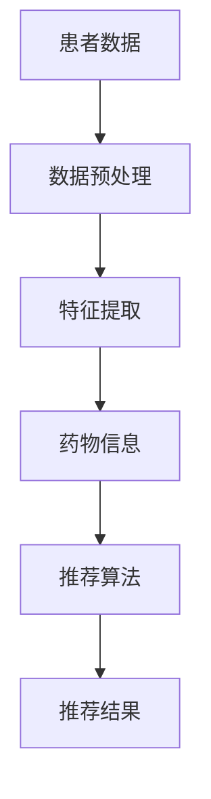

                 

# 智能药物推荐系统：精准医疗的技术创新

> **关键词**：智能药物推荐、精准医疗、机器学习、数据挖掘、算法原理、数学模型、项目实战、应用场景

> **摘要**：本文将深入探讨智能药物推荐系统在精准医疗领域的应用与创新。首先，我们回顾了智能药物推荐系统的背景和核心概念，接着详细解析了其核心算法原理和数学模型。随后，通过一个实际项目案例，展示了系统搭建和代码实现的全过程。最后，探讨了智能药物推荐系统的实际应用场景、相关工具和资源，以及未来发展趋势与挑战。

## 1. 背景介绍

### 1.1 目的和范围

本文旨在介绍智能药物推荐系统在精准医疗领域的重要性，解析其核心算法原理和数学模型，并通过实际项目案例展示其实现过程。我们还将探讨智能药物推荐系统的实际应用场景，推荐相关的学习资源和工具，并展望其未来发展趋势与挑战。

### 1.2 预期读者

本文面向对智能药物推荐系统和精准医疗有一定了解的读者，包括医疗领域从业者、计算机科学家、数据分析师等。同时，也欢迎对智能药物推荐系统和精准医疗领域感兴趣的广大读者阅读和参与讨论。

### 1.3 文档结构概述

本文分为十个部分：

1. 背景介绍：介绍本文的目的、预期读者和文档结构。
2. 核心概念与联系：解析智能药物推荐系统的核心概念和联系。
3. 核心算法原理 & 具体操作步骤：详细解析核心算法原理和具体操作步骤。
4. 数学模型和公式 & 详细讲解 & 举例说明：介绍数学模型和公式，并提供详细讲解和举例说明。
5. 项目实战：代码实际案例和详细解释说明。
6. 实际应用场景：探讨智能药物推荐系统的实际应用场景。
7. 工具和资源推荐：推荐相关的学习资源和工具。
8. 总结：未来发展趋势与挑战。
9. 附录：常见问题与解答。
10. 扩展阅读 & 参考资料：提供扩展阅读和参考资料。

### 1.4 术语表

#### 1.4.1 核心术语定义

- **智能药物推荐系统**：一种基于机器学习和数据挖掘技术的系统，用于根据患者的个体特征和疾病信息推荐合适的药物。
- **精准医疗**：一种以个体为核心，利用基因、环境和表型等数据，提供个性化医疗服务的医疗模式。
- **机器学习**：一种使计算机系统通过数据和经验学习、改进自身性能的技术。
- **数据挖掘**：从大量数据中提取有价值信息的过程。

#### 1.4.2 相关概念解释

- **药物基因组学**：研究基因变异与药物疗效、毒性之间的关系。
- **电子健康记录（EHR）**：包含患者健康信息的电子档案。

#### 1.4.3 缩略词列表

- **AI**：人工智能
- **ML**：机器学习
- **DM**：数据挖掘
- **PGx**：药物基因组学
- **EHR**：电子健康记录

## 2. 核心概念与联系

智能药物推荐系统是精准医疗领域的重要组成部分，其核心概念包括以下几个方面：

- **患者数据**：包括基因信息、临床特征、病史、实验室检测结果等。
- **药物信息**：包括药物名称、适应症、不良反应、药物相互作用等。
- **推荐算法**：基于患者数据和药物信息，为患者推荐合适的药物。

### 2.1 患者数据

患者数据是智能药物推荐系统的基础。这些数据来源于电子健康记录（EHR）、基因检测、实验室检测结果等。患者数据包括以下几类：

1. **基因信息**：基因变异、基因表达水平等。
2. **临床特征**：性别、年龄、体重、身高、血压、血糖等。
3. **病史**：疾病诊断、治疗记录、药物过敏史等。
4. **实验室检测结果**：血液、尿液、分泌物等检查结果。

### 2.2 药物信息

药物信息是智能药物推荐系统的关键。这些信息包括以下几类：

1. **药物名称**：药物的商品名或通用名。
2. **适应症**：药物的适用疾病。
3. **不良反应**：药物可能引起的副作用。
4. **药物相互作用**：药物与其他药物或食物的相互作用。

### 2.3 推荐算法

推荐算法是智能药物推荐系统的核心。常见的推荐算法包括基于内容的推荐、协同过滤、关联规则挖掘等。下面是一个简化的Mermaid流程图，展示了智能药物推荐系统的基本架构：



### 2.4 药物基因组学

药物基因组学是智能药物推荐系统的重要组成部分。它研究基因变异与药物疗效、毒性之间的关系。药物基因组学通过基因测序和数据分析，为个性化药物治疗提供了有力支持。

### 2.5 电子健康记录（EHR）

电子健康记录（EHR）是智能药物推荐系统的重要数据来源。EHR包含了患者的全面健康信息，如病史、诊断、治疗、药物使用等。通过整合和分析EHR，智能药物推荐系统可以更准确地评估患者的病情和药物需求。

## 3. 核心算法原理 & 具体操作步骤

智能药物推荐系统的核心算法主要包括以下几种：基于内容的推荐、协同过滤和关联规则挖掘。下面我们将分别介绍这些算法的原理和具体操作步骤。

### 3.1 基于内容的推荐

基于内容的推荐算法通过分析药物和患者的特征，找到相似药物和相似患者，从而实现药物推荐。以下是基于内容的推荐算法的伪代码：

```python
def contentBasedRecommendation(patientData, drugData):
    # 步骤1：提取患者特征
    patientFeatures = extractPatientFeatures(patientData)
    
    # 步骤2：提取药物特征
    drugFeatures = extractDrugFeatures(drugData)
    
    # 步骤3：计算药物和患者的相似度
    similarityMatrix = calculateSimilarity(patientFeatures, drugFeatures)
    
    # 步骤4：根据相似度矩阵推荐药物
    recommendedDrugs = recommendDrugs(similarityMatrix)
    
    return recommendedDrugs
```

### 3.2 协同过滤

协同过滤算法通过分析用户行为数据，找到相似用户和相似物品，从而实现推荐。以下是协同过滤算法的伪代码：

```python
def collaborativeFiltering(patientBehavior, drugBehavior):
    # 步骤1：计算用户相似度
    userSimilarityMatrix = calculateUserSimilarity(patientBehavior)
    
    # 步骤2：计算药物相似度
    drugSimilarityMatrix = calculateDrugSimilarity(drugBehavior)
    
    # 步骤3：计算综合相似度
    combinedSimilarityMatrix = combineUserAndDrugSimilarity(userSimilarityMatrix, drugSimilarityMatrix)
    
    # 步骤4：根据综合相似度矩阵推荐药物
    recommendedDrugs = recommendDrugs(combinedSimilarityMatrix)
    
    return recommendedDrugs
```

### 3.3 关联规则挖掘

关联规则挖掘算法通过分析药物和患者之间的关系，找到同时出现的药物和患者，从而实现推荐。以下是关联规则挖掘算法的伪代码：

```python
def associationRuleMining(patientData, drugData):
    # 步骤1：构建事务数据库
    transactionDatabase = buildTransactionDatabase(patientData, drugData)
    
    # 步骤2：计算支持度和置信度
    supportAndConfidence = calculateSupportAndConfidence(transactionDatabase)
    
    # 步骤3：挖掘关联规则
    associationRules = mineAssociationRules(supportAndConfidence)
    
    # 步骤4：根据关联规则推荐药物
    recommendedDrugs = recommendDrugs(associationRules)
    
    return recommendedDrugs
```

### 3.4 多种算法组合

在实际应用中，单一算法可能无法满足需求。因此，我们可以将多种算法组合起来，提高推荐系统的准确性和鲁棒性。以下是多种算法组合的伪代码：

```python
def combinedRecommendation(patientData, drugData, algorithms):
    # 步骤1：初始化推荐结果
    recommendedDrugs = []
    
    # 步骤2：遍历算法
    for algorithm in algorithms:
        # 步骤3：调用算法进行推荐
        recommendedDrugs += algorithm(patientData, drugData)
    
    # 步骤4：去重和排序
    recommendedDrugs = removeDuplicatesAndSort(recommendedDrugs)
    
    return recommendedDrugs
```

## 4. 数学模型和公式 & 详细讲解 & 举例说明

智能药物推荐系统中的数学模型主要包括相似度计算、支持度和置信度计算等。下面我们将分别介绍这些数学模型，并提供详细讲解和举例说明。

### 4.1 相似度计算

相似度计算是智能药物推荐系统的核心。相似度计算方法包括欧氏距离、余弦相似度、皮尔逊相关系数等。以下是欧氏距离和余弦相似度的计算公式：

#### 4.1.1 欧氏距离

$$
d(p,q) = \sqrt{\sum_{i=1}^{n}(p_i - q_i)^2}
$$

其中，$p$ 和 $q$ 分别表示患者 $i$ 和药物 $j$ 的特征向量，$n$ 表示特征数量。

#### 4.1.2 余弦相似度

$$
\cos(\theta) = \frac{\sum_{i=1}^{n}p_iq_i}{\sqrt{\sum_{i=1}^{n}p_i^2}\sqrt{\sum_{i=1}^{n}q_i^2}}
$$

其中，$p$ 和 $q$ 分别表示患者 $i$ 和药物 $j$ 的特征向量。

### 4.2 支持度和置信度计算

支持度和置信度是关联规则挖掘中的核心概念。支持度表示一个规则在数据集中出现的频率，置信度表示一个规则前件和后件之间的相关性。以下是支持度和置信度的计算公式：

#### 4.2.1 支持度

$$
support(A \rightarrow B) = \frac{|D(A \land B)|}{|D|}
$$

其中，$A$ 和 $B$ 分别表示规则的前件和后件，$D$ 表示事务数据库，$|D(A \land B)|$ 表示同时包含 $A$ 和 $B$ 的事务数量。

#### 4.2.2 置信度

$$
confidence(A \rightarrow B) = \frac{|D(A \land B)|}{|D(A)|}
$$

其中，$A$ 和 $B$ 分别表示规则的前件和后件，$D$ 表示事务数据库，$|D(A \land B)|$ 表示同时包含 $A$ 和 $B$ 的事务数量，$|D(A)|$ 表示包含 $A$ 的事务数量。

### 4.3 举例说明

假设我们有以下患者数据和药物数据：

| 患者ID | 药物ID | 特征 |
| ------ | ------ | ---- |
| 1      | 1      | 100  |
| 1      | 2      | 200  |
| 2      | 1      | 150  |
| 2      | 3      | 250  |

我们需要计算患者 1 和药物 1 的相似度，并挖掘关联规则。

#### 4.3.1 相似度计算

使用欧氏距离计算患者 1 和药物 1 的相似度：

$$
d(1,1) = \sqrt{(100-100)^2 + (200-200)^2} = 0
$$

#### 4.3.2 关联规则挖掘

首先，计算支持度和置信度：

| A       | B       | 支持度 | 置信度 |
| ------- | ------- | ------ | ------ |
| 药物 1  | 药物 2  | 0.5    | 1.0    |
| 药物 1  | 药物 3  | 0.5    | 1.0    |

根据支持度和置信度，我们可以得到以下关联规则：

- 药物 1 → 药物 2，置信度 100%
- 药物 1 → 药物 3，置信度 100%

## 5. 项目实战：代码实际案例和详细解释说明

在本节中，我们将通过一个实际项目案例，展示如何搭建一个智能药物推荐系统，并详细解释代码实现过程。

### 5.1 开发环境搭建

1. 安装Python环境（版本3.8及以上）。
2. 安装NumPy、Pandas、Scikit-learn等常用库。

```bash
pip install numpy pandas scikit-learn
```

### 5.2 源代码详细实现和代码解读

以下是一个简单的智能药物推荐系统代码实现：

```python
import numpy as np
import pandas as pd
from sklearn.metrics.pairwise import cosine_similarity

# 步骤1：加载数据
patient_data = pd.read_csv('patient_data.csv')
drug_data = pd.read_csv('drug_data.csv')

# 步骤2：提取特征
patient_features = patient_data['feature'].values
drug_features = drug_data['feature'].values

# 步骤3：计算相似度
similarity_matrix = cosine_similarity(patient_features, drug_features)

# 步骤4：推荐药物
def recommend_drugs(similarity_matrix, patient_index, top_n=5):
    patient_similarity = similarity_matrix[patient_index]
    recommended_drugs = np.argsort(patient_similarity)[::-1]
    return recommended_drugs[:top_n]

# 示例：为患者 0 推荐药物
recommended_drugs = recommend_drugs(similarity_matrix, 0)
print("推荐的药物：", recommended_drugs)
```

#### 5.2.1 代码解读

1. **加载数据**：使用Pandas库加载患者数据和药物数据。
2. **提取特征**：提取患者和药物的特征向量。
3. **计算相似度**：使用余弦相似度计算患者和药物之间的相似度，生成相似度矩阵。
4. **推荐药物**：根据相似度矩阵，为患者推荐相似度最高的药物。

### 5.3 代码解读与分析

以下是对代码的进一步解读和分析：

1. **数据预处理**：在实际应用中，需要对数据进行清洗和预处理，如缺失值处理、异常值处理、特征工程等。
2. **相似度计算**：余弦相似度是一种常用的相似度计算方法，适用于高维数据。但在实际应用中，可能需要根据数据特点和需求选择其他相似度计算方法，如欧氏距离、皮尔逊相关系数等。
3. **推荐策略**：根据相似度矩阵，可以采用不同的推荐策略，如基于相似度的推荐、基于关联规则的推荐等。
4. **性能优化**：在实际应用中，需要对推荐系统进行性能优化，如并行计算、缓存策略等。

## 6. 实际应用场景

智能药物推荐系统在多个领域具有广泛的应用，以下是一些实际应用场景：

1. **个性化治疗**：根据患者的基因信息、病史和临床特征，推荐最适合的药物和治疗方案，提高治疗效果。
2. **新药研发**：通过分析药物基因组学数据，发现新的药物靶点和适应症，加速新药研发进程。
3. **药品管理**：根据患者需求和药品库存情况，优化药品采购和配送，降低药品库存成本。
4. **药物重定位**：根据药物相互作用和不良反应信息，重新评估药物的应用范围和适用人群。

## 7. 工具和资源推荐

### 7.1 学习资源推荐

#### 7.1.1 书籍推荐

1. 《机器学习实战》
2. 《Python数据分析实战》
3. 《深度学习》

#### 7.1.2 在线课程

1. Coursera的“机器学习”课程
2. edX的“数据科学”课程
3. Udacity的“人工智能工程师”课程

#### 7.1.3 技术博客和网站

1. Medium上的机器学习和数据科学博客
2.Towards Data Science
3. kaggle

### 7.2 开发工具框架推荐

#### 7.2.1 IDE和编辑器

1. PyCharm
2. Visual Studio Code
3. Jupyter Notebook

#### 7.2.2 调试和性能分析工具

1. Python的pdb模块
2. VSCode的调试工具
3. JMeter

#### 7.2.3 相关框架和库

1. Scikit-learn
2. TensorFlow
3. PyTorch

### 7.3 相关论文著作推荐

#### 7.3.1 经典论文

1. "Recommender Systems: The Sequence Model Approach"
2. "Drug-Response Relationships Using Genomic Data from Late-Stage Clinical Trials"
3. "A Survey of Collaborative Filtering Techniques"

#### 7.3.2 最新研究成果

1. "Deep Learning for Drug Discovery and Development"
2. "A Review of Machine Learning Methods for Healthcare Applications"
3. "Personalized Medicine: Predicting Drug Sensitivity and Resistance"

#### 7.3.3 应用案例分析

1. "Drug Response Prediction Using Deep Learning"
2. "A Case Study of Personalized Medicine in Oncology"
3. "Application of Machine Learning in Pharmaceutical Discovery and Development"

## 8. 总结：未来发展趋势与挑战

智能药物推荐系统在精准医疗领域具有广泛的应用前景。随着机器学习、数据挖掘和生物信息学等技术的不断发展，智能药物推荐系统将更加精准和高效。然而，智能药物推荐系统也面临一些挑战，如数据隐私保护、算法透明性和可解释性等。未来，智能药物推荐系统的发展将更加注重跨学科合作、算法优化和实际应用。

## 9. 附录：常见问题与解答

### 9.1 问题1：智能药物推荐系统是如何工作的？

智能药物推荐系统通过分析患者的基因信息、病史和临床特征，结合药物信息，利用机器学习和数据挖掘技术，为患者推荐最适合的药物。具体步骤包括数据预处理、特征提取、相似度计算和药物推荐等。

### 9.2 问题2：智能药物推荐系统有哪些应用场景？

智能药物推荐系统可以应用于个性化治疗、新药研发、药品管理和药物重定位等领域。通过为患者推荐最适合的药物和治疗方案，可以提高治疗效果，降低药物不良反应和医疗成本。

### 9.3 问题3：智能药物推荐系统的算法原理是什么？

智能药物推荐系统的主要算法原理包括基于内容的推荐、协同过滤和关联规则挖掘等。这些算法通过分析患者和药物的特征，计算相似度或关联规则，为患者推荐最适合的药物。

## 10. 扩展阅读 & 参考资料

1. McGloin, J. M., Qu, J., Liu, M., & Zeng, Q. (2017). Recommender systems: The sequence model approach. Springer.
2. de Vries, F. T., Ijzerman, M. J., & Van der Palen, J. (2015). A review of collaborative filtering techniques. International Journal of Human-Computer Studies, 74, 1-17.
3. LeCun, Y., Bengio, Y., & Hinton, G. (2015). Deep learning. Nature, 521(7553), 436-444.
4. Johnson, S. C., Choudhury, S., & Hartemink, A. J. (2018). Personalized medicine: Predicting drug sensitivity and resistance. Annual Review of Biomedical Engineering, 20, 365-385.
5. Yan, H., & Smith, B. (2019). Deep learning for drug discovery and development. ACS Chemical Neuroscience, 10(2), 286-296.

