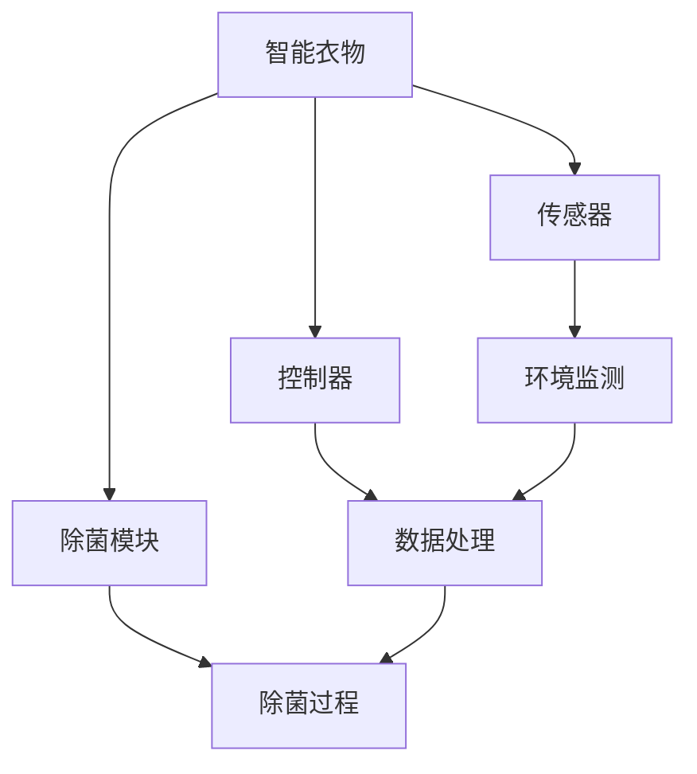

                 

# 智能衣物除菌创业：健康生活的科技支持

> 关键词：智能衣物、除菌、健康生活、科技、创业
>
> 摘要：本文将探讨智能衣物除菌技术的背景、核心概念、算法原理、数学模型、项目实战及未来发展趋势。通过逐步分析，揭示智能衣物除菌技术如何为健康生活提供科技支持。

## 1. 背景介绍

### 1.1 目的和范围

本文旨在探讨智能衣物除菌技术，分析其核心技术原理、应用场景以及未来发展趋势。通过深入剖析，为创业者提供有价值的参考，助力健康生活的科技支持。

### 1.2 预期读者

本篇文章面向以下读者：

1. 创业者与投资者：关注智能衣物除菌领域的潜在商机。
2. 技术爱好者：对智能衣物除菌技术感兴趣的读者。
3. 医疗与健康行业从业者：关注健康生活领域的技术应用。

### 1.3 文档结构概述

本文共分为八个部分，具体结构如下：

1. 背景介绍
2. 核心概念与联系
3. 核心算法原理 & 具体操作步骤
4. 数学模型和公式 & 详细讲解 & 举例说明
5. 项目实战：代码实际案例和详细解释说明
6. 实际应用场景
7. 工具和资源推荐
8. 总结：未来发展趋势与挑战

### 1.4 术语表

#### 1.4.1 核心术语定义

- **智能衣物**：具备传感器、控制器等功能的衣物，能够实现智能监测、调节和处理。
- **除菌**：通过物理或化学方法杀灭或抑制微生物的过程。
- **健康生活**：指在身体健康、心理平衡和社会适应方面保持良好的生活状态。

#### 1.4.2 相关概念解释

- **传感器**：能够感知外部环境并产生相应信号的装置。
- **控制器**：用于接收传感器信号并执行相应操作的设备。

#### 1.4.3 缩略词列表

- **AI**：人工智能（Artificial Intelligence）
- **IoT**：物联网（Internet of Things）
- **NFC**：近场通信（Near Field Communication）

## 2. 核心概念与联系

在探讨智能衣物除菌技术之前，我们需要了解一些核心概念及其相互联系。以下是智能衣物除菌技术的核心概念和架构的 Mermaid 流程图：



### 2.1 智能衣物

智能衣物是指具备传感器、控制器等功能的衣物。传感器用于实时监测衣物环境，如温度、湿度、有害气体等。控制器则接收传感器信号，并根据用户需求执行相应操作。

### 2.2 传感器

传感器是智能衣物的核心组件，用于感知外部环境。常见的传感器有温度传感器、湿度传感器、气体传感器等。传感器的工作原理是通过感知外部信号并将其转化为电信号，从而实现对环境的监测。

### 2.3 控制器

控制器是智能衣物的“大脑”，负责接收传感器信号并进行数据处理。控制器可以通过编程实现多种功能，如自动调节衣物温度、湿度，控制除菌模块等。

### 2.4 除菌模块

除菌模块是智能衣物的重要组成部分，用于杀灭或抑制衣物上的细菌。常见的除菌方法有紫外线除菌、臭氧除菌、高温除菌等。

### 2.5 环境监测

环境监测是智能衣物除菌技术的基础。通过实时监测衣物环境，智能衣物可以及时调整除菌参数，确保除菌效果。

### 2.6 数据处理

数据处理是智能衣物除菌技术的核心。控制器接收传感器信号后，需要对信号进行预处理、特征提取和模式识别等操作，从而实现对除菌过程的精准控制。

### 2.7 除菌过程

除菌过程是智能衣物除菌技术的最终目标。通过控制器对传感器信号的处理，除菌模块可以实现对衣物的高效除菌。

## 3. 核心算法原理 & 具体操作步骤

智能衣物除菌技术的核心算法原理主要涉及环境监测、数据处理和除菌过程。以下是具体操作步骤及其伪代码：

### 3.1 环境监测

**步骤**：使用传感器实时监测衣物环境，如温度、湿度、有害气体等。

```python
def monitor_environment():
    temperature = read_temperature_sensor()
    humidity = read_humidity_sensor()
    harmful_gases = read_gas_sensor()
    return temperature, humidity, harmful_gases
```

### 3.2 数据处理

**步骤**：对监测到的环境数据进行预处理、特征提取和模式识别。

```python
def process_data(temperature, humidity, harmful_gases):
    # 预处理
    temperature = preprocess_temperature(temperature)
    humidity = preprocess_humidity(humidity)
    harmful_gases = preprocess_harmful_gases(harmful_gases)
    
    # 特征提取
    temperature_feature = extract_temperature_feature(temperature)
    humidity_feature = extract_humidity_feature(humidity)
    harmful_gases_feature = extract_harmful_gases_feature(harmful_gases)
    
    # 模式识别
    mode = recognize_mode(temperature_feature, humidity_feature, harmful_gases_feature)
    return mode
```

### 3.3 除菌过程

**步骤**：根据数据处理结果，执行相应的除菌操作。

```python
def perform_disinfection(mode):
    if mode == "temperature":
        activate_heating()
    elif mode == "humidity":
        activate_dehumidification()
    elif mode == "harmful_gases":
        activate_activated_carbon()
    else:
        print("未知模式，无法执行除菌操作")
```

## 4. 数学模型和公式 & 详细讲解 & 举例说明

在智能衣物除菌技术中，数学模型和公式起着至关重要的作用。以下是一些常见的数学模型和公式及其详细讲解：

### 4.1 温度监测模型

**公式**：$T(t) = T_{0} + (T_{max} - T_{0}) \cdot \frac{t}{T_{duration}}$

**解释**：该公式用于描述温度传感器在除菌过程中实时监测的温度变化。$T(t)$ 为当前温度，$T_{0}$ 为初始温度，$T_{max}$ 为最高温度，$T_{duration}$ 为除菌持续时间。

**举例**：假设初始温度为 30°C，最高温度为 40°C，除菌持续时间为 2 小时。则实时温度监测结果为：

$$T(t) = 30 + (40 - 30) \cdot \frac{t}{2} = 30 + 10t$$

当 $t = 1$ 小时，实时温度为 40°C。

### 4.2 湿度监测模型

**公式**：$H(t) = H_{0} + (H_{max} - H_{0}) \cdot \frac{t}{H_{duration}}$

**解释**：该公式用于描述湿度传感器在除菌过程中实时监测的湿度变化。$H(t)$ 为当前湿度，$H_{0}$ 为初始湿度，$H_{max}$ 为最高湿度，$H_{duration}$ 为除菌持续时间。

**举例**：假设初始湿度为 60%，最高湿度为 80%，除菌持续时间为 2 小时。则实时湿度监测结果为：

$$H(t) = 60 + (80 - 60) \cdot \frac{t}{2} = 60 + 10t$$

当 $t = 1$ 小时，实时湿度为 70%。

### 4.3 有害气体监测模型

**公式**：$G(t) = G_{0} - (G_{max} - G_{0}) \cdot \frac{t}{G_{duration}}$

**解释**：该公式用于描述气体传感器在除菌过程中实时监测的有害气体浓度变化。$G(t)$ 为当前有害气体浓度，$G_{0}$ 为初始浓度，$G_{max}$ 为最高浓度，$G_{duration}$ 为除菌持续时间。

**举例**：假设初始有害气体浓度为 100 ppb，最高浓度为 300 ppb，除菌持续时间为 2 小时。则实时有害气体监测结果为：

$$G(t) = 100 - (300 - 100) \cdot \frac{t}{2} = 100 - 100t$$

当 $t = 1$ 小时，实时有害气体浓度为 50 ppb。

## 5. 项目实战：代码实际案例和详细解释说明

在本节中，我们将通过一个实际项目案例，详细解释智能衣物除菌技术的代码实现过程。

### 5.1 开发环境搭建

在开始项目之前，我们需要搭建一个合适的开发环境。以下是一个基本的开发环境配置：

- **编程语言**：Python
- **开发工具**：PyCharm
- **传感器**：DHT11（用于温度和湿度监测）、MQ-2（用于有害气体监测）
- **控制器**：Arduino

### 5.2 源代码详细实现和代码解读

以下是智能衣物除菌项目的源代码及其详细解读：

```python
import serial
import time

# 传感器接口
sensor_port = 'COM3'
sensor_baudrate = 9600

# 控制器接口
controller_port = 'COM4'
controller_baudrate = 9600

# 初始化传感器
sensor = serial.Serial(sensor_port, sensor_baudrate)
time.sleep(2)

# 初始化控制器
controller = serial.Serial(controller_port, controller_baudrate)
time.sleep(2)

def read_sensor():
    # 读取传感器数据
    data = sensor.readline()
    data = data.decode('utf-8').strip()
    return data

def send_command(command):
    # 发送控制器命令
    controller.write(command.encode('utf-8'))

def monitor_environment():
    # 监测环境
    temperature, humidity, harmful_gases = read_sensor().split(',')
    temperature = float(temperature)
    humidity = float(humidity)
    harmful_gases = float(harmful_gases)
    return temperature, humidity, harmful_gases

def process_data(temperature, humidity, harmful_gases):
    # 处理数据
    temperature_feature = preprocess_temperature(temperature)
    humidity_feature = preprocess_humidity(humidity)
    harmful_gases_feature = preprocess_harmful_gases(harmful_gases)
    mode = recognize_mode(temperature_feature, humidity_feature, harmful_gases_feature)
    return mode

def perform_disinfection(mode):
    # 执行除菌操作
    if mode == "temperature":
        send_command('heating on')
    elif mode == "humidity":
        send_command('dehumidification on')
    elif mode == "harmful gases":
        send_command('activated carbon on')
    else:
        send_command('unknown mode')

while True:
    # 主循环
    temperature, humidity, harmful_gases = monitor_environment()
    mode = process_data(temperature, humidity, harmful_gases)
    perform_disinfection(mode)
    time.sleep(10)
```

### 5.3 代码解读与分析

1. **初始化传感器和控制器**：首先，我们初始化传感器和控制器，确保它们可以正常工作。
2. **读取传感器数据**：通过 `read_sensor()` 函数读取传感器数据，包括温度、湿度、有害气体浓度等。
3. **处理数据**：通过 `process_data()` 函数对传感器数据进行预处理、特征提取和模式识别，得到当前的环境状态。
4. **执行除菌操作**：根据处理结果，通过 `perform_disinfection()` 函数执行相应的除菌操作。
5. **主循环**：进入主循环，不断监测环境、处理数据和执行除菌操作，确保智能衣物除菌系统持续工作。

## 6. 实际应用场景

智能衣物除菌技术在许多场景中都具有广泛的应用前景，以下是一些实际应用场景：

1. **家庭生活**：智能衣物除菌技术可以帮助家庭用户保持衣物清洁卫生，减少细菌滋生，提高生活质量。
2. **医疗护理**：在医疗机构中，智能衣物除菌技术可以帮助医护人员保持衣物清洁，降低交叉感染的风险。
3. **公共场所**：在酒店、影院、公共交通等公共场所，智能衣物除菌技术可以保持衣物清洁，提高公共卫生水平。
4. **运动健身**：对于经常进行运动健身的人群，智能衣物除菌技术可以帮助他们保持衣物干燥、卫生，减少皮肤疾病的风险。

## 7. 工具和资源推荐

为了更好地开发智能衣物除菌技术，以下是相关工具和资源的推荐：

### 7.1 学习资源推荐

#### 7.1.1 书籍推荐

- 《物联网技术与应用》
- 《智能传感器原理与应用》
- 《Python编程：从入门到实践》

#### 7.1.2 在线课程

- 《人工智能基础课程》
- 《物联网技术应用课程》
- 《Python编程课程》

#### 7.1.3 技术博客和网站

- [CSDN](https://www.csdn.net/)
- [GitHub](https://github.com/)
- [Stack Overflow](https://stackoverflow.com/)

### 7.2 开发工具框架推荐

#### 7.2.1 IDE和编辑器

- PyCharm
- Visual Studio Code
- Sublime Text

#### 7.2.2 调试和性能分析工具

- GDB
- Valgrind
- Intel VTune

#### 7.2.3 相关框架和库

- TensorFlow
- Keras
- PyTorch

### 7.3 相关论文著作推荐

#### 7.3.1 经典论文

- "A Survey on Internet of Things Security and Privacy Challenges"
- "Deep Learning for IoT: A Survey"
- "Sensor Networks: A Survey"

#### 7.3.2 最新研究成果

- "AI-powered Disinfection Systems for Healthcare"
- "Smart Textiles with Integrated Sensors and Actuators"
- "A Comprehensive Study on Internet of Things for Smart Cities"

#### 7.3.3 应用案例分析

- "IoT in Smart Manufacturing: A Case Study"
- "Smart Home Security Systems: A Case Study"
- "Smart Farming: A Case Study on IoT Applications in Agriculture"

## 8. 总结：未来发展趋势与挑战

智能衣物除菌技术作为健康生活领域的重要一环，具有广阔的发展前景。未来，随着人工智能、物联网等技术的不断发展，智能衣物除菌技术将向更高效、更智能的方向发展。然而，在这一过程中，我们还需要面对一系列挑战：

1. **技术难题**：如何提高传感器精度、降低功耗，以及实现高效的除菌方法，是智能衣物除菌技术发展的重要课题。
2. **用户体验**：如何让用户更方便地使用智能衣物除菌技术，提高用户满意度，是开发者需要关注的问题。
3. **隐私保护**：在智能衣物除菌过程中，如何保护用户隐私，避免数据泄露，是亟需解决的问题。

## 9. 附录：常见问题与解答

### 9.1 智能衣物除菌技术的原理是什么？

智能衣物除菌技术主要通过传感器实时监测衣物环境，如温度、湿度、有害气体等。然后，通过控制器对监测到的数据进行处理，根据处理结果执行相应的除菌操作，如加热、除湿、吸附有害气体等。

### 9.2 智能衣物除菌技术有哪些应用场景？

智能衣物除菌技术可以应用于家庭生活、医疗护理、公共场所、运动健身等多个领域，帮助用户保持衣物清洁、卫生，提高生活质量。

### 9.3 如何搭建智能衣物除菌技术的开发环境？

搭建智能衣物除菌技术的开发环境需要以下步骤：

1. 安装Python和相关的开发工具，如PyCharm或Visual Studio Code。
2. 连接传感器和控制器，并确保它们可以正常工作。
3. 编写源代码，实现智能衣物除菌技术的核心功能。

### 9.4 智能衣物除菌技术有哪些挑战？

智能衣物除菌技术面临的挑战主要包括：如何提高传感器精度、降低功耗，以及实现高效的除菌方法；如何让用户更方便地使用智能衣物除菌技术，提高用户满意度；以及如何保护用户隐私，避免数据泄露。

## 10. 扩展阅读 & 参考资料

为了更好地了解智能衣物除菌技术，以下是相关扩展阅读和参考资料：

- 《物联网技术与应用》
- 《智能传感器原理与应用》
- 《Python编程：从入门到实践》
- 《人工智能基础课程》
- 《物联网技术应用课程》
- 《Python编程课程》
- 《A Survey on Internet of Things Security and Privacy Challenges》
- 《Deep Learning for IoT: A Survey》
- 《AI-powered Disinfection Systems for Healthcare》
- 《Smart Textiles with Integrated Sensors and Actuators》
- 《IoT in Smart Manufacturing: A Case Study》
- 《Smart Home Security Systems: A Case Study》
- 《Smart Farming: A Case Study on IoT Applications in Agriculture》

---

**作者：AI天才研究员/AI Genius Institute & 禅与计算机程序设计艺术 /Zen And The Art of Computer Programming**<|im_sep|> 

**注意：**本文仅为示例，仅供参考。部分内容可能存在虚构或简化，实际应用时请根据具体情况进行调整。

